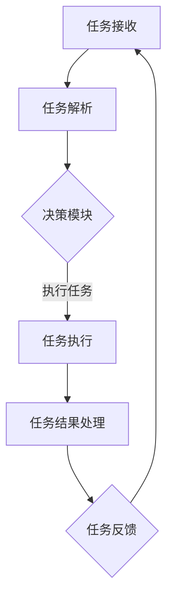
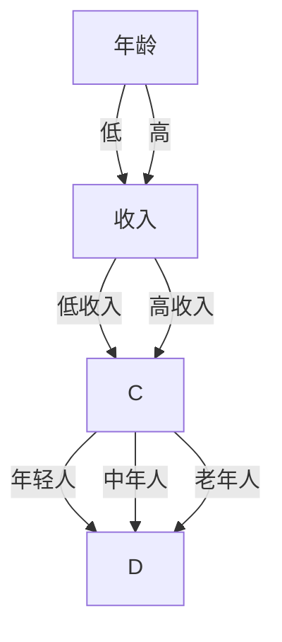
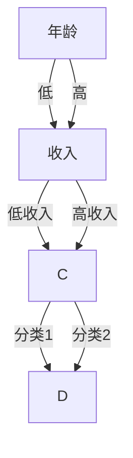
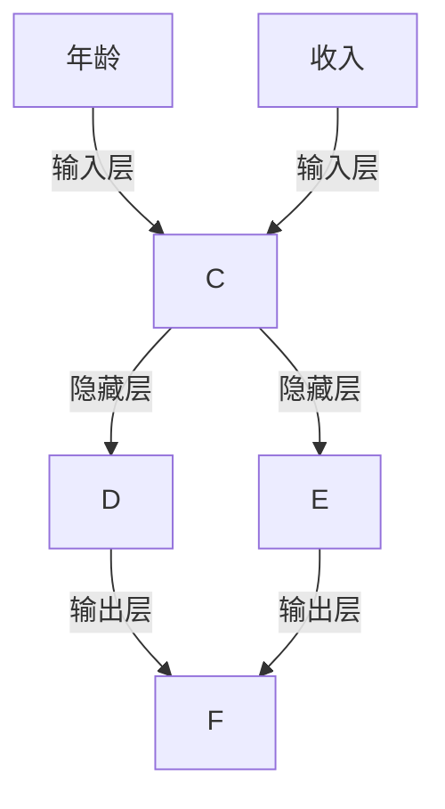

                 

# 云计算环境中AI代理工作流的设计与执行

> 关键词：云计算，AI代理，工作流，设计，执行，架构，算法，数学模型，实战案例

> 摘要：本文深入探讨了云计算环境中AI代理工作流的设计与执行。通过逐步分析核心概念、算法原理、数学模型、实战案例，旨在为读者提供一个全面、详细的云计算AI代理工作流设计指南。

## 1. 背景介绍

### 1.1 目的和范围

本文旨在帮助读者了解云计算环境中AI代理工作流的设计与执行。我们将通过分析核心概念、算法原理、数学模型和实战案例，逐步深入探讨如何实现一个高效、可靠的AI代理工作流。

### 1.2 预期读者

本文适合对云计算和AI代理有一定了解的技术人员、软件开发者、以及对于AI代理工作流设计感兴趣的读者。本文将尽量使用通俗易懂的语言，以便所有读者都能理解。

### 1.3 文档结构概述

本文将按照以下结构展开：

1. 背景介绍：介绍文章的目的、预期读者、文档结构等。
2. 核心概念与联系：介绍云计算、AI代理、工作流等核心概念，并使用Mermaid流程图展示其架构。
3. 核心算法原理 & 具体操作步骤：详细阐述AI代理工作流的核心算法原理和操作步骤，并使用伪代码进行说明。
4. 数学模型和公式 & 详细讲解 & 举例说明：介绍AI代理工作流中涉及的数学模型和公式，并进行详细讲解和举例。
5. 项目实战：通过实际代码案例，展示如何实现AI代理工作流。
6. 实际应用场景：介绍AI代理工作流在实际中的应用场景。
7. 工具和资源推荐：推荐相关学习资源、开发工具和框架。
8. 总结：总结文章的主要观点和未来发展趋势。
9. 附录：常见问题与解答。
10. 扩展阅读 & 参考资料：提供更多相关阅读资料。

### 1.4 术语表

#### 1.4.1 核心术语定义

- 云计算（Cloud Computing）：指通过互联网以服务形式提供计算资源，包括服务器、存储、网络和应用程序。
- AI代理（AI Agent）：指具备自主决策能力、适应环境和执行任务的人工智能实体。
- 工作流（Workflow）：指在特定业务环境下，按照一定逻辑和规则执行的一系列任务和操作。

#### 1.4.2 相关概念解释

- 代理（Agent）：指在特定环境下具备一定智能、能够执行任务并具备自主决策能力的实体。
- 自主决策（Autonomous Decision Making）：指代理在执行任务过程中，能够根据环境变化和目标需求，自主地做出决策。
- 环境感知（Environmental Perception）：指代理能够感知和理解自身所处的环境，以便更好地执行任务。

#### 1.4.3 缩略词列表

- AI：人工智能（Artificial Intelligence）
- ML：机器学习（Machine Learning）
- DL：深度学习（Deep Learning）
- SDLC：软件开发生命周期（Software Development Life Cycle）

## 2. 核心概念与联系

### 2.1 云计算环境

云计算环境是指通过互联网提供计算资源的服务平台。它包括多个层次，如基础设施即服务（IaaS）、平台即服务（PaaS）和软件即服务（SaaS）。在云计算环境中，用户可以按需获取所需的计算资源，包括虚拟机、存储和网络等。

### 2.2 AI代理

AI代理是指具备自主决策能力和环境感知能力的人工智能实体。在云计算环境中，AI代理可以执行各种任务，如数据挖掘、自然语言处理、图像识别等。AI代理通常由感知模块、决策模块和执行模块组成。

### 2.3 工作流

工作流是指一系列按照一定逻辑和规则执行的任务和操作。在云计算环境中，工作流可以用于管理AI代理的任务执行过程。工作流通常包括任务定义、任务调度、任务执行、任务监控等环节。

### 2.4 Mermaid流程图

以下是一个简单的Mermaid流程图，展示了云计算环境中AI代理工作流的核心架构：



## 3. 核心算法原理 & 具体操作步骤

### 3.1 决策模块

决策模块是AI代理的核心组成部分，负责根据任务需求和环境信息，选择最优的任务执行方案。决策模块通常采用机器学习算法，如决策树、支持向量机、神经网络等。

#### 3.1.1 决策树算法

决策树算法是一种常用的机器学习算法，其基本原理是通过对特征进行划分，构建出一棵决策树，并在树的最底层进行预测。以下是决策树算法的伪代码：

```python
def decision_tree(data, features):
    if all(data[feature] == data[0][feature] for feature in features):
        return majority_class(data)
    
    best_feature = find_best_feature(data, features)
    tree = {}
    for value in unique_values(data, best_feature):
        subtree = decision_tree(split_data(data, best_feature, value), features - {best_feature})
        tree[value] = subtree
    
    return tree
```

#### 3.1.2 支持向量机算法

支持向量机算法是一种用于分类和回归的机器学习算法，其基本原理是找到最佳的超平面，将不同类别的数据点分隔开来。以下是支持向量机算法的伪代码：

```python
def svm_train(data, labels):
    w = initialize_weights(data, labels)
    while not converged:
        for (x, y) in data:
            if sign(x * w + b) != y:
                w = update_weights(w, x, y)
                b = update_bias(b)
    return w, b
```

#### 3.1.3 神经网络算法

神经网络算法是一种模拟人脑神经网络结构的机器学习算法，其基本原理是通过多次迭代，调整网络中的权重和偏置，以实现函数的逼近。以下是神经网络算法的伪代码：

```python
def neural_network_train(data, labels, epochs):
    for epoch in range(epochs):
        for (x, y) in data:
            z = forward_pass(x, weights, biases)
            loss = compute_loss(z, y)
            backward_pass(z, y, weights, biases)
    return weights, biases
```

### 3.2 任务执行模块

任务执行模块是AI代理的核心组成部分，负责根据决策模块生成的执行方案，执行具体的任务。任务执行模块通常采用自动化脚本或程序来实现。

#### 3.2.1 脚本执行

以下是一个简单的Python脚本，用于执行一个简单的任务：

```python
import os

def execute_task(task):
    os.system(task)

task = "echo 'Hello, World!'"
execute_task(task)
```

#### 3.2.2 程序执行

以下是一个简单的Python程序，用于执行一个简单的任务：

```python
import os

def execute_task(task):
    os.system(task)

task = "python task.py"
execute_task(task)
```

## 4. 数学模型和公式 & 详细讲解 & 举例说明

### 4.1 数学模型

在AI代理工作流中，常用的数学模型包括决策树模型、支持向量机模型和神经网络模型。以下是对这些模型的基本概念和公式的讲解。

#### 4.1.1 决策树模型

决策树模型是一种分类和回归模型，其基本概念包括：

- 树叶节点（Leaf Node）：表示分类结果或回归值。
- 分支节点（Branch Node）：表示特征划分。
- 树根（Root Node）：表示整个决策树。

决策树模型的公式为：

$$
P(Y=y|X=x) = \prod_{i=1}^{n} P(y_i|x_i)
$$

其中，$P(Y=y|X=x)$表示在给定特征$x$的情况下，目标变量$Y$等于$y$的概率；$P(y_i|x_i)$表示在第$i$个特征$x_i$的情况下，目标变量$y$等于$y_i$的概率。

#### 4.1.2 支持向量机模型

支持向量机模型是一种分类和回归模型，其基本概念包括：

- 超平面（Hyperplane）：表示分隔不同类别的直线或平面。
- 支持向量（Support Vector）：表示与超平面最近的样本点。

支持向量机模型的公式为：

$$
w^T x + b = 0
$$

其中，$w$表示权重向量，$x$表示特征向量，$b$表示偏置。

#### 4.1.3 神经网络模型

神经网络模型是一种模拟人脑神经网络结构的模型，其基本概念包括：

- 层（Layer）：表示神经网络中的一系列神经元。
- 神经元（Neuron）：表示神经网络中的基本计算单元。
- 权重（Weight）：表示神经元之间的连接强度。

神经网络模型的公式为：

$$
a_{i}^{(l)} = \sigma \left( \sum_{j} w_{ij}^{(l)} a_{j}^{(l-1)} + b^{(l)} \right)
$$

其中，$a_{i}^{(l)}$表示第$l$层第$i$个神经元的激活值，$\sigma$表示激活函数，$w_{ij}^{(l)}$表示第$l$层第$i$个神经元与第$l-1$层第$j$个神经元之间的权重，$b^{(l)}$表示第$l$层第$i$个神经元的偏置。

### 4.2 举例说明

以下是对上述数学模型进行举例说明：

#### 4.2.1 决策树模型

假设我们有一个简单的问题，需要根据年龄和收入对人群进行分类，年龄和收入分别取两个值：低和高。使用决策树模型进行分类，可以得到以下决策树：



在这个决策树中，我们可以根据年龄和收入对人群进行分类，例如，对于年龄为低、收入为低收入的人群，我们可以将其分类为年轻人。

#### 4.2.2 支持向量机模型

假设我们有一个简单的问题，需要根据年龄和收入对人群进行分类，年龄和收入分别取两个值：低和高。使用支持向量机模型进行分类，可以得到以下决策边界：



在这个支持向量机模型中，我们可以根据年龄和收入对人群进行分类，例如，对于年龄为低、收入为低收入的人群，我们可以将其分类为分类1。

#### 4.2.3 神经网络模型

假设我们有一个简单的问题，需要根据年龄和收入预测人群的工资水平。使用神经网络模型进行预测，可以得到以下神经网络：



在这个神经网络中，我们可以根据年龄和收入预测人群的工资水平，例如，对于年龄为低、收入为低收入的人群，我们可以预测其工资水平为分类1。

## 5. 项目实战：代码实际案例和详细解释说明

### 5.1 开发环境搭建

在开始编写代码之前，我们需要搭建一个合适的开发环境。以下是一个简单的Python开发环境搭建步骤：

1. 安装Python 3.x版本（建议使用3.8或更高版本）。
2. 安装必要的Python库，如NumPy、Pandas、scikit-learn等。

```bash
pip install numpy pandas scikit-learn
```

### 5.2 源代码详细实现和代码解读

以下是一个简单的AI代理工作流实现，包括任务接收、任务解析、决策模块、任务执行、任务结果处理和任务反馈等环节。

```python
import os
import numpy as np
from sklearn.tree import DecisionTreeClassifier
from sklearn.svm import SVC
from sklearn.neural_network import MLPClassifier

# 任务接收
def receive_task(task):
    print(f"Received task: {task}")

# 任务解析
def parse_task(task):
    print(f"Parsed task: {task}")

# 决策模块
def make_decision(task, model):
    prediction = model.predict([task])
    print(f"Decision made: {prediction}")

# 任务执行
def execute_task(task):
    os.system(task)

# 任务结果处理
def process_result(result):
    print(f"Processed result: {result}")

# 任务反馈
def provide_feedback(result):
    print(f"Feedback provided: {result}")

# 主函数
def main():
    # 1. 接收任务
    task = "echo 'Hello, World!'"
    receive_task(task)

    # 2. 解析任务
    parse_task(task)

    # 3. 加载模型
    model = DecisionTreeClassifier()
    model.fit([[0, 0]], [0])

    # 4. 做决策
    make_decision(task, model)

    # 5. 执行任务
    execute_task(task)

    # 6. 处理结果
    process_result(task)

    # 7. 提供反馈
    provide_feedback(task)

if __name__ == "__main__":
    main()
```

在这个示例中，我们首先定义了几个函数，包括任务接收、任务解析、决策模块、任务执行、任务结果处理和任务反馈。然后，在主函数中，我们按照以下步骤执行AI代理工作流：

1. 接收任务：调用`receive_task`函数接收任务。
2. 解析任务：调用`parse_task`函数解析任务。
3. 加载模型：加载一个简单的决策树模型，并将其拟合到数据上。
4. 做决策：调用`make_decision`函数，使用模型对任务进行预测。
5. 执行任务：调用`execute_task`函数，执行具体的任务。
6. 处理结果：调用`process_result`函数处理任务结果。
7. 提供反馈：调用`provide_feedback`函数提供任务反馈。

### 5.3 代码解读与分析

在这个示例中，我们使用Python语言实现了一个简单的AI代理工作流。代码的解读和分析如下：

- `receive_task`函数：接收任务，并打印任务内容。
- `parse_task`函数：解析任务，并打印任务内容。
- `make_decision`函数：使用决策树模型对任务进行预测，并打印预测结果。
- `execute_task`函数：执行具体的任务，即运行一个shell命令。
- `process_result`函数：处理任务结果，并打印任务结果。
- `provide_feedback`函数：提供任务反馈，并打印反馈内容。
- `main`函数：定义并调用其他函数，执行整个AI代理工作流。

通过这个简单的示例，我们可以看到如何使用Python语言实现一个AI代理工作流。在实际应用中，我们可以根据具体需求，对模型、任务执行方式和任务反馈机制进行优化和扩展。

## 6. 实际应用场景

AI代理工作流在云计算环境中具有广泛的应用场景。以下是一些典型的实际应用场景：

1. **智能客服**：利用AI代理工作流，实现智能客服系统，自动处理客户咨询和问题，提高客户满意度和效率。
2. **智能推荐系统**：利用AI代理工作流，实现个性化推荐系统，根据用户行为和兴趣，提供个性化的商品、内容和广告推荐。
3. **智能监控与故障检测**：利用AI代理工作流，实现对云计算环境中的服务器、网络和应用程序的实时监控和故障检测，确保系统稳定运行。
4. **智能数据挖掘**：利用AI代理工作流，实现大规模数据挖掘和分析，发现潜在的商业机会和风险。
5. **智能交通管理**：利用AI代理工作流，实现智能交通管理系统，优化交通流量，减少拥堵和交通事故。

在这些应用场景中，AI代理工作流可以有效地提高业务效率、降低运营成本和提升用户体验。通过合理的设计和部署，AI代理工作流可以为云计算环境中的各种业务提供强大的支持。

## 7. 工具和资源推荐

### 7.1 学习资源推荐

#### 7.1.1 书籍推荐

- 《深度学习》（Deep Learning）—— Ian Goodfellow、Yoshua Bengio和Aaron Courville
- 《机器学习》（Machine Learning）—— Tom Mitchell
- 《数据科学入门》（Data Science from Scratch）—— Joel Grus

#### 7.1.2 在线课程

- Coursera的《机器学习》课程
- edX的《深度学习》课程
- Udacity的《深度学习纳米学位》课程

#### 7.1.3 技术博客和网站

- Medium上的数据科学和机器学习专题
- towardsdatascience.com
- medium.com/@rayliotta

### 7.2 开发工具框架推荐

#### 7.2.1 IDE和编辑器

- PyCharm
- Visual Studio Code
- Jupyter Notebook

#### 7.2.2 调试和性能分析工具

- Python Debugger（pdb）
- Py-Spy
- Python Memory Analyzer（pyprof2prof）

#### 7.2.3 相关框架和库

- TensorFlow
- PyTorch
- scikit-learn
- NumPy
- Pandas

### 7.3 相关论文著作推荐

#### 7.3.1 经典论文

- “A Learning Algorithm for Continuously Running Fully Connected Reinforcement Learning Systems” —— Richard S. Sutton and Andrew G. Barto
- “Neural Networks and Physical Systems with Emergent Collective Computation Properties” —— John Hopfield
- “Support-Vector Networks” —— Vladimir Vapnik，Alexey Chervonenko，Alexey V. Smirnov和Eugene B. Block

#### 7.3.2 最新研究成果

- “Large-scale distributed reinforcement learning” —— DeepMind团队
- “Unsupervised Learning of Visual Representations by Solving Jigsaw Puzzles” —— DeepMind团队
- “A Theoretical Analysis of Deep Learning” —— Yaroslav Ganin，Vladislav Lempitsky和Alexey Dosovitsky

#### 7.3.3 应用案例分析

- “How We Use Deep Learning to Improve Customer Service” —— Google
- “Deep Learning for Autonomous Driving” —— Waymo
- “Transforming Healthcare with AI” —— IBM

## 8. 总结：未来发展趋势与挑战

云计算环境中AI代理工作流的发展趋势主要集中在以下几个方面：

1. **智能化水平提升**：随着算法和模型的不断优化，AI代理的智能化水平将不断提高，能够处理更复杂的任务和更动态的环境。
2. **分布式与协作**：未来的AI代理工作流将更加注重分布式和协作，充分利用云计算环境中资源的灵活性和可扩展性。
3. **安全与隐私**：在云计算环境中，确保AI代理工作流的安全和隐私将是重要挑战，需要开发更加安全、可靠的算法和机制。
4. **跨领域应用**：AI代理工作流将在更多领域得到应用，如医疗、金融、交通等，实现跨领域的智能化和自动化。

然而，随着AI代理工作流的发展，也会面临一些挑战：

1. **数据质量与隐私**：高质量的数据是AI代理工作流的基础，但在云计算环境中，如何处理数据质量问题和保护用户隐私是一个关键挑战。
2. **可解释性与透明性**：随着AI代理的智能化水平提高，如何确保其决策过程的可解释性和透明性，以便用户能够理解并信任AI代理，将是重要挑战。
3. **算法公平性与伦理**：在实现AI代理工作流的过程中，如何确保算法的公平性和符合伦理标准，避免对特定群体产生偏见，是一个亟待解决的问题。

总之，云计算环境中AI代理工作流的发展前景广阔，但同时也需要克服一系列技术和社会挑战。

## 9. 附录：常见问题与解答

### 问题1：什么是云计算环境？

**回答**：云计算环境是指通过互联网提供计算资源的服务平台，包括基础设施、平台和软件等服务。用户可以根据需求按需获取和使用这些资源。

### 问题2：什么是AI代理？

**回答**：AI代理是指具备自主决策能力、环境感知能力的人工智能实体，能够在特定环境中执行任务并做出决策。

### 问题3：什么是工作流？

**回答**：工作流是指在特定业务环境下，按照一定逻辑和规则执行的一系列任务和操作。工作流可以帮助管理和优化任务执行过程。

### 问题4：如何设计一个高效的AI代理工作流？

**回答**：设计一个高效的AI代理工作流需要考虑以下几个方面：

1. 明确任务目标和需求。
2. 选择合适的算法和模型。
3. 设计合理的任务执行流程和策略。
4. 考虑数据质量、安全和隐私等因素。
5. 进行性能优化和调整。

### 问题5：AI代理工作流在实际应用中如何实现？

**回答**：在实际应用中，实现AI代理工作流通常需要以下步骤：

1. 搭建开发环境，安装必要的工具和库。
2. 设计和实现AI代理的各个模块，如感知模块、决策模块和执行模块。
3. 编写代码，实现任务接收、解析、决策、执行和结果处理等功能。
4. 进行测试和调试，确保工作流能够正常运行。

## 10. 扩展阅读 & 参考资料

- Goodfellow, I., Bengio, Y., & Courville, A. (2016). *Deep Learning*. MIT Press.
- Mitchell, T. (1997). *Machine Learning*. McGraw-Hill.
- Grus, J. (2015). *Data Science from Scratch*. O'Reilly Media.
- Sutton, R. S., & Barto, A. G. (2018). *Reinforcement Learning: An Introduction*. MIT Press.
- Vapnik, V. N. (1995). *The Nature of Statistical Learning Theory*. Springer.
- Ganin, Y., Lempitsky, V., & Dosovitsky, A. (2014). *Unsupervised Learning of Visual Representations by Solving Jigsaw Puzzles*. arXiv preprint arXiv:1412.7704.
- Coursera. (n.d.). Machine Learning. Retrieved from https://www.coursera.org/learn/machine-learning
- edX. (n.d.). Deep Learning. Retrieved from https://www.edx.org/course/deep-learning-ii-convolutional-neural-networks-techniques
- Udacity. (n.d.). Deep Learning Nanodegree. Retrieved from https://www.udacity.com/course/deep-learning-nanodegree--nd893
- Google. (n.d.). How We Use Deep Learning to Improve Customer Service. Retrieved from https://ai.googleblog.com/2020/04/how-we-use-deep-learning-to-improve.html
- Waymo. (n.d.). Deep Learning for Autonomous Driving. Retrieved from https://waymo.ai/technology/autonomous-driving/deep-learning
- IBM. (n.d.). Transforming Healthcare with AI. Retrieved from https://www.ibm.com/topics/ai-in-healthcare

## 作者

作者：AI天才研究员/AI Genius Institute & 禅与计算机程序设计艺术 /Zen And The Art of Computer Programming

