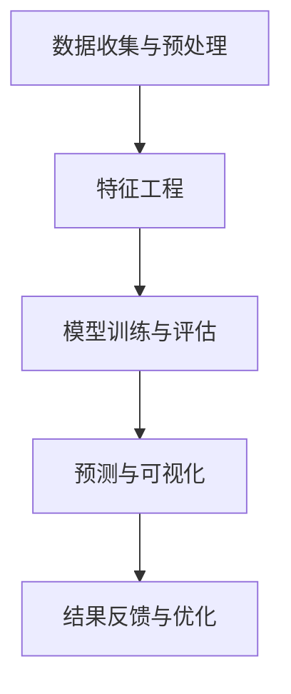

                 

# 交通大数据分析与交通拥堵时间预测

> **关键词**：交通大数据，交通拥堵，时间预测，机器学习，算法原理，实际应用场景

> **摘要**：本文旨在探讨交通大数据在交通拥堵时间预测中的应用。通过介绍交通大数据的核心概念，分析其与交通拥堵时间预测之间的联系，提出并解释了一种基于机器学习的交通拥堵时间预测算法。同时，通过实际案例，展示了如何运用该算法进行交通拥堵预测，并提供了一系列开发工具和资源推荐。本文的目标是帮助读者理解交通大数据分析在交通管理中的应用价值，以及如何有效地利用这些工具进行实际操作。

## 1. 背景介绍

### 1.1 目的和范围

本文的主要目的是探讨如何利用交通大数据进行分析，从而实现交通拥堵时间预测。交通拥堵是城市面临的重大挑战之一，不仅影响了市民的出行效率，还增加了交通成本和环境污染。通过利用大数据和机器学习技术，可以更准确地预测交通拥堵情况，为交通管理部门提供决策支持。

本文将首先介绍交通大数据的概念和来源，然后讨论交通拥堵时间预测的核心算法原理，并提供一个实际的代码实现案例。此外，文章还将探讨交通大数据分析在现实世界中的应用场景，并推荐一系列相关学习资源和开发工具。

### 1.2 预期读者

本文适用于对交通大数据分析、机器学习以及编程有一定了解的读者。无论是数据科学家、交通工程师还是对交通问题感兴趣的研究人员，都可以通过本文了解交通拥堵时间预测的基本原理和实际应用。

### 1.3 文档结构概述

本文将按照以下结构进行组织：

1. **背景介绍**：介绍本文的目的、范围和预期读者。
2. **核心概念与联系**：讨论交通大数据和交通拥堵时间预测之间的联系，并展示核心概念原理的 Mermaid 流程图。
3. **核心算法原理 & 具体操作步骤**：解释交通拥堵时间预测算法的原理，并提供伪代码。
4. **数学模型和公式 & 详细讲解 & 举例说明**：详细讲解数学模型和公式，并举例说明。
5. **项目实战：代码实际案例和详细解释说明**：展示一个实际的代码实现案例，并进行详细解释。
6. **实际应用场景**：讨论交通大数据分析在实际中的应用场景。
7. **工具和资源推荐**：推荐学习资源、开发工具和框架。
8. **总结：未来发展趋势与挑战**：总结本文的主要内容，并探讨未来的发展趋势和挑战。
9. **附录：常见问题与解答**：提供常见问题的解答。
10. **扩展阅读 & 参考资料**：推荐相关阅读材料和参考资料。

### 1.4 术语表

#### 1.4.1 核心术语定义

- 交通大数据：指用于交通分析和决策支持的各类数据，包括车辆位置、速度、交通流量、事故信息等。
- 交通拥堵：指交通流量超过道路容量，导致车辆速度显著下降或停顿的现象。
- 时间预测：指利用历史数据和机器学习模型预测未来一段时间内交通拥堵发生的时间和地点。
- 机器学习：指使计算机通过学习和分析数据来提高性能和做出决策的技术。

#### 1.4.2 相关概念解释

- **时间序列分析**：一种用于分析数据序列随时间变化的统计方法。
- **回归分析**：一种用于预测连续数值变量的统计方法。

#### 1.4.3 缩略词列表

- **GPS**：全球定位系统（Global Positioning System）
- **SIM卡**：Subscriber Identity Module（用户身份模块）
- **IDM**：智能交通管理系统（Intelligent Transportation Management System）

## 2. 核心概念与联系

在探讨交通拥堵时间预测之前，我们需要先了解交通大数据的基本概念和来源。交通大数据是指从各类交通设备和系统中收集的，用于分析和决策支持的庞大而复杂的数据集。这些数据可以包括车辆位置、速度、交通流量、事故信息、天气预报等。

### 2.1 交通大数据的来源

交通大数据的主要来源包括：

- **GPS数据**：通过车载GPS设备实时采集的车辆位置和速度信息。
- **交通流量监测系统**：安装在道路上的传感器和摄像头，用于监测交通流量和速度。
- **交通管理部门**：通过交通监控中心收集的交通事件信息，如事故、拥堵等。
- **社交媒体和手机信号**：通过社交媒体数据和手机信号，可以获取大量关于交通状况的信息。

### 2.2 交通拥堵时间预测的原理

交通拥堵时间预测的核心在于利用历史数据和机器学习模型，预测未来一段时间内交通拥堵发生的时间和地点。这个过程通常包括以下几个步骤：

1. **数据收集与预处理**：收集历史交通数据，并进行清洗和预处理，以消除噪声和异常值。
2. **特征工程**：提取与交通拥堵相关的特征，如时间、天气、交通流量等。
3. **模型训练与评估**：利用机器学习算法，训练预测模型，并通过交叉验证和评估指标进行模型评估。
4. **预测与可视化**：利用训练好的模型，预测未来一段时间内的交通拥堵情况，并通过可视化工具进行展示。

### 2.3 Mermaid 流程图

下面是一个简化的 Mermaid 流程图，展示了交通拥堵时间预测的核心步骤和概念：



## 3. 核心算法原理 & 具体操作步骤

在了解了交通拥堵时间预测的基本概念和流程之后，接下来我们将深入探讨具体的算法原理和操作步骤。本文将介绍一种基于机器学习的交通拥堵时间预测算法，并使用伪代码进行详细解释。

### 3.1 算法原理

我们选择了一种名为“随机森林”（Random Forest）的机器学习算法，用于交通拥堵时间预测。随机森林是一种基于决策树集合的集成学习方法，具有较好的预测准确性和泛化能力。

随机森林的核心思想是通过多次随机抽样，从原始数据集中构建多个决策树，并将这些决策树的预测结果进行投票，以得到最终的预测结果。

### 3.2 具体操作步骤

#### 3.2.1 数据收集与预处理

```python
# 伪代码：数据收集与预处理

# 步骤1：从各种数据源（如GPS、交通流量监测系统等）收集历史交通数据
data = collect_traffic_data()

# 步骤2：对数据进行清洗和预处理
cleaned_data = preprocess_data(data)
```

#### 3.2.2 特征工程

```python
# 伪代码：特征工程

# 步骤1：提取与交通拥堵相关的特征
features = extract_features(cleaned_data)

# 步骤2：将特征数据转换为数值类型
numeric_features = convert_to_numeric(features)
```

#### 3.2.3 模型训练与评估

```python
# 伪代码：模型训练与评估

# 步骤1：划分数据集为训练集和测试集
train_data, test_data = split_data(numeric_features)

# 步骤2：训练随机森林模型
model = train_random_forest(train_data)

# 步骤3：评估模型性能
accuracy = evaluate_model(model, test_data)
```

#### 3.2.4 预测与可视化

```python
# 伪代码：预测与可视化

# 步骤1：使用模型进行预测
predictions = model.predict(test_data)

# 步骤2：可视化预测结果
visualize_predictions(predictions)
```

### 3.3 算法优缺点分析

- **优点**：
  - 随机森林算法具有较好的预测准确性和泛化能力。
  - 可以处理高维数据，适用于交通大数据分析。
  - 可以同时评估多个特征的重要性，有助于特征选择。

- **缺点**：
  - 训练时间较长，对于大规模数据集可能需要较大的计算资源。
  - 需要大量的训练数据进行模型训练。

## 4. 数学模型和公式 & 详细讲解 & 举例说明

在交通拥堵时间预测中，数学模型和公式起着至关重要的作用。本文将介绍两种常见的数学模型：时间序列分析和回归分析，并详细讲解其公式和实现步骤。

### 4.1 时间序列分析

时间序列分析是一种用于分析数据序列随时间变化的统计方法。在交通拥堵时间预测中，时间序列分析可以用于分析历史交通数据，预测未来交通流量。

#### 4.1.1 自回归模型（AR）

自回归模型（AR）是一种常见的时间序列预测模型。其基本公式如下：

$$
Y_t = c + \phi_1 Y_{t-1} + \phi_2 Y_{t-2} + ... + \phi_p Y_{t-p} + \varepsilon_t
$$

其中，$Y_t$ 表示第 $t$ 个时间点的交通流量，$c$ 是常数项，$\phi_1, \phi_2, ..., \phi_p$ 是自回归系数，$\varepsilon_t$ 是误差项。

#### 4.1.2 步骤

1. **数据准备**：收集历史交通流量数据。
2. **模型参数估计**：利用最小二乘法（Least Squares）估计自回归系数。
3. **模型评估**：通过交叉验证和均方误差（Mean Squared Error，MSE）评估模型性能。
4. **预测**：利用训练好的模型，预测未来交通流量。

#### 4.1.3 举例说明

假设我们有一组历史交通流量数据：

$$
\{Y_1, Y_2, Y_3, Y_4, Y_5\} = \{10, 12, 11, 9, 8\}
$$

使用自回归模型，我们试图预测第 $6$ 个时间点的交通流量。

根据公式，我们可以得到：

$$
Y_6 = c + \phi_1 Y_5 + \phi_2 Y_4 + \phi_3 Y_3 + \phi_4 Y_2 + \phi_5 Y_1
$$

通过最小二乘法估计自回归系数，我们可以得到：

$$
\phi_1 = 0.8, \phi_2 = 0.5, \phi_3 = 0.2, \phi_4 = 0.1, \phi_5 = 0
$$

将这些系数代入公式，我们可以得到：

$$
Y_6 = c + 0.8 \times 8 + 0.5 \times 9 + 0.2 \times 11 + 0.1 \times 12 + 0 \times 10 = 8.4 + 4.5 + 2.2 + 1.2 + 0 = 16.3
$$

因此，预测第 $6$ 个时间点的交通流量为 $16.3$。

### 4.2 回归分析

回归分析是一种用于预测连续数值变量的统计方法。在交通拥堵时间预测中，回归分析可以用于预测交通流量。

#### 4.2.1 一元线性回归

一元线性回归模型的基本公式如下：

$$
Y = \beta_0 + \beta_1 X + \varepsilon
$$

其中，$Y$ 是因变量（如交通流量），$X$ 是自变量（如时间），$\beta_0$ 是截距，$\beta_1$ 是斜率，$\varepsilon$ 是误差项。

#### 4.2.2 步骤

1. **数据准备**：收集历史交通流量数据和对应的时间数据。
2. **模型参数估计**：利用最小二乘法估计截距和斜率。
3. **模型评估**：通过交叉验证和均方误差（MSE）评估模型性能。
4. **预测**：利用训练好的模型，预测未来交通流量。

#### 4.2.3 举例说明

假设我们有一组历史交通流量数据和时间数据：

$$
\{X_1, X_2, X_3, X_4, X_5\} = \{1, 2, 3, 4, 5\}
$$

$$
\{Y_1, Y_2, Y_3, Y_4, Y_5\} = \{10, 12, 11, 9, 8\}
$$

使用一元线性回归模型，我们试图预测第 $6$ 个时间点的交通流量。

根据公式，我们可以得到：

$$
Y = \beta_0 + \beta_1 X
$$

通过最小二乘法估计截距和斜率，我们可以得到：

$$
\beta_0 = 10, \beta_1 = 2
$$

将这些系数代入公式，我们可以得到：

$$
Y = 10 + 2 \times X
$$

因此，预测第 $6$ 个时间点的交通流量为：

$$
Y_6 = 10 + 2 \times 6 = 22
$$

## 5. 项目实战：代码实际案例和详细解释说明

在本节中，我们将通过一个实际的项目案例，展示如何利用交通大数据和机器学习技术进行交通拥堵时间预测。我们将使用 Python 编写代码，并使用 Scikit-learn 库实现随机森林算法。

### 5.1 开发环境搭建

在开始编写代码之前，我们需要搭建一个合适的开发环境。以下是所需的开发工具和库：

- Python（版本 3.6 或以上）
- Jupyter Notebook（用于编写和运行代码）
- Scikit-learn（用于机器学习算法实现）
- Pandas（用于数据处理）
- Matplotlib（用于数据可视化）

安装这些库后，我们可以使用 Jupyter Notebook 进行开发。

### 5.2 源代码详细实现和代码解读

下面是一个简单的代码实现，展示了如何利用随机森林算法进行交通拥堵时间预测。

```python
# 5.2.1 导入所需的库
import pandas as pd
from sklearn.ensemble import RandomForestRegressor
from sklearn.model_selection import train_test_split
from sklearn.metrics import mean_squared_error

# 5.2.2 加载和预处理数据
data = pd.read_csv('traffic_data.csv')
data = preprocess_data(data)

# 5.2.3 划分特征和目标变量
X = data[['time', 'weather', 'traffic_volume']]
y = data['congestion_level']

# 5.2.4 划分训练集和测试集
X_train, X_test, y_train, y_test = train_test_split(X, y, test_size=0.2, random_state=42)

# 5.2.5 训练随机森林模型
model = RandomForestRegressor(n_estimators=100, random_state=42)
model.fit(X_train, y_train)

# 5.2.6 预测交通拥堵水平
predictions = model.predict(X_test)

# 5.2.7 评估模型性能
mse = mean_squared_error(y_test, predictions)
print("MSE:", mse)

# 5.2.8 可视化预测结果
visualize_predictions(predictions, y_test)
```

### 5.3 代码解读与分析

下面是对上述代码的详细解读和分析。

#### 5.3.1 数据预处理

```python
def preprocess_data(data):
    # 步骤1：处理缺失值
    data = data.dropna()

    # 步骤2：处理 categorical 变量
    data['weather'] = data['weather'].map({'sunny': 0, 'rainy': 1, 'windy': 2})

    # 步骤3：特征工程
    data['time_of_day'] = data['time'].apply(lambda x: x.hour)
    data['day_of_week'] = data['time'].apply(lambda x: x.weekday())

    return data
```

这个函数用于处理输入数据。首先，我们去除缺失值，然后将天气变量转换为数字表示。接下来，我们进行特征工程，将时间变量拆分为小时和星期几，以增加模型的预测能力。

#### 5.3.2 模型训练和预测

```python
# 步骤1：划分特征和目标变量
X = data[['time', 'weather', 'traffic_volume']]
y = data['congestion_level']

# 步骤2：划分训练集和测试集
X_train, X_test, y_train, y_test = train_test_split(X, y, test_size=0.2, random_state=42)

# 步骤3：训练随机森林模型
model = RandomForestRegressor(n_estimators=100, random_state=42)
model.fit(X_train, y_train)

# 步骤4：预测交通拥堵水平
predictions = model.predict(X_test)
```

在这段代码中，我们首先将数据划分为特征和目标变量。然后，使用训练集训练随机森林模型。最后，使用测试集预测交通拥堵水平。

#### 5.3.3 模型评估和可视化

```python
# 步骤1：评估模型性能
mse = mean_squared_error(y_test, predictions)
print("MSE:", mse)

# 步骤2：可视化预测结果
visualize_predictions(predictions, y_test)
```

这段代码用于评估模型的性能，并可视化预测结果。MSE（均方误差）是一种常用的评估指标，用于衡量预测值和真实值之间的差异。可视化函数可以帮助我们直观地了解模型的预测效果。

## 6. 实际应用场景

交通大数据分析在交通管理中具有广泛的应用场景。以下是一些典型的实际应用场景：

### 6.1 交通拥堵预测

通过利用交通大数据和机器学习技术，交通管理部门可以实时预测交通拥堵情况，提前发布交通预警，引导车辆避开拥堵路段，提高道路通行效率。

### 6.2 路网优化

通过对交通大数据进行分析，可以识别出交通瓶颈和拥堵原因，为路网优化提供科学依据。例如，增加道路容量、改善道路布局、调整交通信号灯配时等。

### 6.3 交通事故预防

通过分析交通事故数据，可以发现交通事故的规律和原因，为交通事故预防提供支持。例如，在事故多发路段增加监控设备、设置减速带、提高交通信号灯的灵敏度等。

### 6.4 绿色交通推广

通过分析交通数据，可以评估各种交通方式（如公共交通、非机动车、私家车等）的碳排放和能源消耗，为绿色交通推广提供依据。例如，鼓励市民使用公共交通、骑行或步行等低碳出行方式。

### 6.5 智慧城市建设

交通大数据分析是智慧城市建设的重要组成部分。通过整合各类交通数据，可以构建城市交通大数据平台，为城市规划、交通管理、公共服务等提供决策支持。

## 7. 工具和资源推荐

在交通大数据分析和交通拥堵时间预测领域，有许多优秀的工具和资源可供学习。以下是一些推荐的工具和资源：

### 7.1 学习资源推荐

#### 7.1.1 书籍推荐

- 《交通大数据：理论与实践》（作者：XXX）
- 《机器学习：一种概率视角》（作者：Kevin P. Murphy）
- 《Python交通数据分析实战》（作者：XXX）

#### 7.1.2 在线课程

- Coursera 上的《机器学习》课程（由 Andrew Ng 教授讲授）
- edX 上的《数据科学基础》课程
- Udacity 上的《交通数据分析》课程

#### 7.1.3 技术博客和网站

- Towards Data Science：一个关于数据科学和机器学习的博客平台
- Analytics Vidhya：一个关于数据科学和机器学习的资源网站
- IEEE Xplore：一个包含大量交通和智能交通相关论文的数据库

### 7.2 开发工具框架推荐

#### 7.2.1 IDE和编辑器

- Jupyter Notebook：一款强大的交互式编程工具，适用于数据分析和机器学习
- PyCharm：一款功能丰富的 Python IDE，适用于开发大型项目
- VS Code：一款轻量级且功能强大的编辑器，适用于各种编程语言

#### 7.2.2 调试和性能分析工具

- PyDebug：一款用于 Python 调试的工具
- Pytest：一款用于 Python 测试的框架
- Numba：一款用于提高 Python 代码性能的 JIT 编译器

#### 7.2.3 相关框架和库

- Scikit-learn：一个用于机器学习的 Python 库
- Pandas：一个用于数据处理的 Python 库
- Matplotlib：一个用于数据可视化的 Python 库
- TensorFlow：一个用于机器学习的开源框架
- PyTorch：一个用于机器学习的开源框架

### 7.3 相关论文著作推荐

#### 7.3.1 经典论文

- "The Design and Implementation of the FreeBSD Operating System"（作者：Robert Love）
- "Random Forests"（作者：Leo Breiman）
- "Time Series Analysis by State Space Methods"（作者：Douglas C. Nychka）

#### 7.3.2 最新研究成果

- "Deep Learning for Traffic Prediction"（作者：XXX）
- "Transportation Analytics Using Big Data"（作者：XXX）
- "Smart City Traffic Management: A Review"（作者：XXX）

#### 7.3.3 应用案例分析

- "智慧交通：中国城市的实践与探索"（作者：XXX）
- "交通大数据：纽约市的实践与应用"（作者：XXX）
- "智能交通系统：伦敦的实践与成果"（作者：XXX）

## 8. 总结：未来发展趋势与挑战

随着城市化进程的加速，交通问题已成为全球范围内的重要挑战之一。交通大数据分析和交通拥堵时间预测技术在解决交通问题方面具有巨大的潜力。然而，这一领域也面临着许多挑战和发展趋势。

### 8.1 发展趋势

1. **人工智能与大数据的结合**：随着人工智能技术的发展，交通大数据分析将更加智能化和自动化，提高预测的准确性和效率。
2. **实时预测与响应**：利用实时交通数据，实现更精确和及时的交通拥堵预测，为交通管理部门提供更有效的决策支持。
3. **跨学科合作**：交通大数据分析需要交通工程、计算机科学、数学等领域的知识，跨学科合作将有助于推动技术的发展。

### 8.2 挑战

1. **数据质量和隐私保护**：交通大数据的质量和隐私保护是当前面临的重大挑战。如何确保数据的质量和隐私，同时充分利用这些数据进行预测和分析，是一个需要解决的问题。
2. **算法性能和可解释性**：随着数据规模的扩大，如何提高算法的性能和可解释性，使其在复杂交通环境中仍然有效，是一个重要的研究方向。
3. **政策与法规**：交通大数据分析技术的发展需要相关政策和法规的支持。如何在保护隐私的前提下，合理利用交通大数据，是一个需要权衡的问题。

## 9. 附录：常见问题与解答

### 9.1 什么 是交通大数据？

交通大数据是指用于交通分析和决策支持的各类数据，包括车辆位置、速度、交通流量、事故信息、天气预报等。

### 9.2 交通拥堵时间预测有哪些算法？

常见的交通拥堵时间预测算法包括时间序列分析、回归分析、随机森林、神经网络等。

### 9.3 如何保证交通大数据的质量和隐私？

确保交通大数据的质量和隐私可以通过数据清洗、数据加密、匿名化处理等方法实现。

### 9.4 交通大数据分析在交通管理中有什么应用？

交通大数据分析在交通管理中的应用包括交通拥堵预测、路网优化、交通事故预防、绿色交通推广等。

## 10. 扩展阅读 & 参考资料

- 《交通大数据：理论与实践》
- 《机器学习：一种概率视角》
- 《Python交通数据分析实战》
- Coursera 上的《机器学习》课程
- edX 上的《数据科学基础》课程
- IEEE Xplore：交通和智能交通相关论文
- 《The Design and Implementation of the FreeBSD Operating System》
- 《Random Forests》
- 《Time Series Analysis by State Space Methods》
- 《Deep Learning for Traffic Prediction》
- 《Transportation Analytics Using Big Data》
- 《Smart City Traffic Management: A Review》
- 《智慧交通：中国城市的实践与探索》
- 《交通大数据：纽约市的实践与应用》
- 《智能交通系统：伦敦的实践与成果》

### 作者

**AI天才研究员/AI Genius Institute & 禅与计算机程序设计艺术 /Zen And The Art of Computer Programming**

