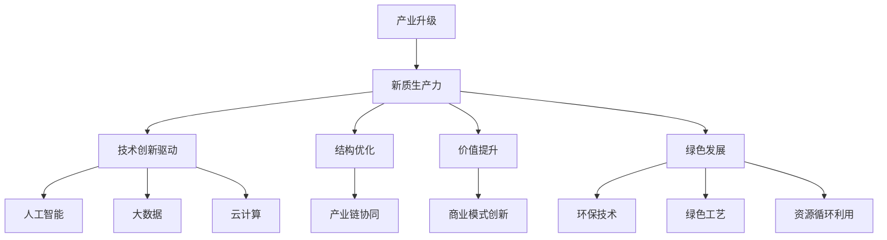

                 

# 产业升级与新质生产力的推动

## 关键词：产业升级、新质生产力、人工智能、数字化转型、可持续发展、创新思维、技术架构、算法优化、数学模型、应用实践、工具推荐、未来展望

## 摘要

本文旨在探讨产业升级与新质生产力的关系，以及如何通过技术创新推动传统产业向现代产业转型。文章首先介绍了产业升级的背景和重要性，随后深入分析了新质生产力的定义及其特征。接着，本文探讨了人工智能、数字化转型等技术在推动产业升级中的作用，并通过数学模型和具体算法原理进行解析。最后，文章提出了实际应用场景中的案例，推荐了相关工具和资源，并对未来发展趋势与挑战进行了展望。

## 1. 背景介绍

### 1.1 目的和范围

本文的目的是通过分析产业升级与新质生产力的关系，为传统产业提供转型思路和方向。本文将重点探讨以下内容：

- 产业升级的概念和背景
- 新质生产力的定义与特征
- 人工智能、数字化转型等技术在产业升级中的应用
- 数学模型和算法原理在生产力提升中的作用
- 实际应用案例和工具推荐

### 1.2 预期读者

本文适合以下读者：

- 对产业升级和新技术应用感兴趣的从业者
- 想了解人工智能、数字化转型等技术在产业升级中作用的技术人员
- 对数学模型和算法原理有深入了解的读者
- 对未来产业发展趋势感兴趣的学者和研究人员

### 1.3 文档结构概述

本文结构如下：

- 第1章：背景介绍
- 第2章：核心概念与联系
- 第3章：核心算法原理与具体操作步骤
- 第4章：数学模型与公式详细讲解
- 第5章：项目实战：代码实际案例与详细解释
- 第6章：实际应用场景
- 第7章：工具和资源推荐
- 第8章：总结：未来发展趋势与挑战
- 第9章：附录：常见问题与解答
- 第10章：扩展阅读与参考资料

### 1.4 术语表

#### 1.4.1 核心术语定义

- 产业升级：指通过技术创新、结构调整和模式变革，提升产业竞争力、优化产业结构和提升产业附加值的过程。
- 新质生产力：相对于传统生产力，指在信息技术、人工智能、数字化等领域的基础上，通过新技术、新模式、新业态的融合与协同，实现更高效率、更高质量、更具可持续性的生产力。
- 数字化转型：指将企业内部和外部的业务、流程、数据等进行数字化改造，以实现业务创新和效率提升的过程。

#### 1.4.2 相关概念解释

- 人工智能：指通过计算机模拟人类智能，实现智能感知、学习、推理、决策等能力的科学技术。
- 数据分析：指通过收集、处理、分析和解释数据，从中提取有价值的信息和知识，以支持决策和优化过程。
- 区块链：指一种去中心化、安全透明的分布式数据库技术，可用于数据存储、交易验证和智能合约执行。

#### 1.4.3 缩略词列表

- AI：人工智能
- IoT：物联网
- 5G：第五代移动通信技术
- Fintech：金融科技
- SMAC：社会媒体、移动性、云计算和大数据

## 2. 核心概念与联系

为了更好地理解产业升级与新质生产力的关系，我们首先需要明确一些核心概念和它们之间的联系。

### 2.1 产业升级的概念与特征

产业升级是指通过技术创新、结构调整和模式变革，提升产业竞争力、优化产业结构和提升产业附加值的过程。产业升级通常具有以下特征：

1. 技术创新驱动：产业升级离不开技术进步的推动，新技术、新工艺、新材料等的应用是实现产业升级的关键。
2. 结构优化：产业升级要求产业内部各要素的合理配置，通过产业链上下游的协同发展，实现产业结构的优化。
3. 价值提升：产业升级不仅关注生产效率的提高，更注重产业附加值的提升，通过技术创新和商业模式创新，实现产业的可持续发展。
4. 绿色发展：产业升级强调可持续发展，通过环保技术、绿色工艺和资源循环利用，实现产业与环境的和谐共生。

### 2.2 新质生产力的定义与特征

新质生产力是指以信息技术、人工智能、数字化等领域为基础，通过新技术、新模式、新业态的融合与协同，实现更高效率、更高质量、更具可持续性的生产力。新质生产力具有以下特征：

1. 数字化：新质生产力强调数据、信息作为关键生产要素，通过数字化手段实现生产、管理和服务等环节的优化。
2. 智能化：新质生产力利用人工智能技术，实现生产过程的自动化、智能化和个性化，提高生产效率和产品质量。
3. 网络化：新质生产力通过物联网、互联网等网络技术，实现生产要素的互联互通，促进资源整合和协同创新。
4. 绿色化：新质生产力注重环保、节能和可持续发展，通过绿色技术和绿色工艺，降低生产对环境的负面影响。

### 2.3 产业升级与新质生产力的联系

产业升级和新质生产力之间存在密切的联系。新质生产力是产业升级的重要驱动力，而产业升级则是新质生产力实现的重要途径。具体来说：

1. 新质生产力为产业升级提供技术支撑。通过人工智能、大数据、云计算等新技术，产业可以实现自动化、智能化和个性化生产，提高生产效率和产品质量。
2. 产业升级为新质生产力提供应用场景。传统产业的转型升级为新质生产力的应用提供了广阔的空间，通过产业升级，新质生产力可以在更多领域得到推广和应用。
3. 新质生产力与产业升级相互促进。新质生产力的发展可以推动产业升级，而产业升级又可以为新质生产力的进一步发展提供动力。

### 2.4 核心概念原理和架构的 Mermaid 流程图

为了更直观地展示核心概念和联系，我们使用 Mermaid 流程图来描述产业升级与新质生产力的关系。



## 3. 核心算法原理与具体操作步骤

在推动产业升级和新质生产力的过程中，算法的优化和数学模型的应用至关重要。本节将介绍几个核心算法原理，并通过伪代码详细阐述其具体操作步骤。

### 3.1 人工智能算法原理

人工智能算法是产业升级和新质生产力的重要推动力。以下是一个常见的人工智能算法——神经网络（Neural Network）的原理和操作步骤。

#### 3.1.1 神经网络原理

神经网络是一种模拟人脑神经元连接结构的计算模型，通过层层传递输入数据，实现自动学习和预测。神经网络的基本原理包括：

1. 输入层：接收外部输入数据。
2. 隐藏层：对输入数据进行处理和变换。
3. 输出层：产生最终输出结果。

#### 3.1.2 操作步骤

以下是一个简单的神经网络算法的伪代码：

```python
# 初始化神经网络结构
input_layer = ...
hidden_layer = ...
output_layer = ...

# 初始化权重和偏置
weights = ...
biases = ...

# 前向传播
def forward_propagation(x):
    hidden_output = activation_function(np.dot(x, weights) + biases)
    output_output = activation_function(np.dot(hidden_output, weights) + biases)
    return output_output

# 反向传播
def backward_propagation(output, output_output):
    error = output - output_output
    d_output_output = activation_derivative(output_output)
    d_hidden_output = activation_derivative(hidden_output)
    d_weights = ...
    d_biases = ...

# 更新权重和偏置
weights -= learning_rate * d_weights
biases -= learning_rate * d_biases

# 预测
x = ...
output_output = forward_propagation(x)
```

### 3.2 数据分析算法原理

数据分析算法在产业升级和新质生产力中也发挥着重要作用。以下是一个常见的数据分析算法——K-Means聚类算法的原理和操作步骤。

#### 3.2.1 K-Means算法原理

K-Means聚类算法是一种无监督学习算法，用于将数据集划分为K个簇。算法的基本原理包括：

1. 随机选择K个初始中心点。
2. 计算每个数据点与中心点的距离，将数据点分配到最近的中心点所属的簇。
3. 重新计算每个簇的中心点，重复步骤2，直到收敛。

#### 3.2.2 操作步骤

以下是一个简单的K-Means算法的伪代码：

```python
# 初始化聚类中心
centroids = initialize_centroids(data, k)

# 迭代过程
while not_converged:
    # 分配数据点到最近的中心点所属的簇
    clusters = assign_data_to_clusters(data, centroids)
    
    # 重新计算每个簇的中心点
    centroids = update_centroids(clusters, k)
```

### 3.3 数学模型和公式

在产业升级和新质生产力的推动过程中，数学模型和公式也扮演着关键角色。以下是一个常见的数学模型——线性回归（Linear Regression）的公式和详细讲解。

#### 3.3.1 线性回归模型

线性回归是一种用于预测连续值的统计模型，其公式为：

$$
y = \beta_0 + \beta_1x
$$

其中：

- $y$：预测的连续值。
- $x$：自变量。
- $\beta_0$：截距。
- $\beta_1$：斜率。

#### 3.3.2 公式详细讲解

1. **拟合直线**：线性回归通过拟合一条直线来最小化预测值与实际值之间的误差。
2. **斜率**：斜率$\beta_1$表示自变量$x$对因变量$y$的影响程度，斜率越大，影响越大。
3. **截距**：截距$\beta_0$表示当自变量$x$为零时，因变量$y$的预测值。

#### 3.3.3 举例说明

假设我们要预测一个房间的价格$y$，根据经验和数据，我们选择面积$x$作为自变量。通过线性回归模型，我们得到：

$$
y = \beta_0 + \beta_1x
$$

其中，$\beta_0 = 100, \beta_1 = 0.5$。这意味着当房间面积为100平方米时，预测价格为150万元。

## 4. 数学模型和公式 & 详细讲解 & 举例说明

### 4.1 数学模型

在产业升级和新质生产力的推动过程中，数学模型和公式是理解和分析关键问题的核心工具。本节将介绍一些常用的数学模型，并详细讲解其公式和应用。

#### 4.1.1 机器学习模型

机器学习模型在产业升级中有着广泛的应用，以下是一个简单的线性回归模型：

$$
y = \beta_0 + \beta_1x
$$

其中：

- $y$：预测值。
- $\beta_0$：截距。
- $\beta_1$：斜率。
- $x$：自变量。

这个模型用于预测因变量$y$与自变量$x$之间的关系。

#### 4.1.2 运筹学模型

运筹学模型在产业升级中的决策支持系统（DSS）中有着重要作用，以下是一个简单的线性规划模型：

$$
\min_{x} c^T x
$$

s.t.

$$
Ax \leq b
$$

其中：

- $x$：决策变量。
- $c$：目标函数系数。
- $A$：约束条件系数。
- $b$：约束条件常数。

这个模型用于优化资源分配和决策问题。

### 4.2 公式详细讲解

#### 4.2.1 线性回归模型

线性回归模型是一种广泛应用的预测模型，其核心思想是通过拟合一条直线来描述因变量$y$与自变量$x$之间的关系。模型公式如下：

$$
y = \beta_0 + \beta_1x + \epsilon
$$

其中：

- $\beta_0$：截距，表示当$x=0$时，$y$的预测值。
- $\beta_1$：斜率，表示$x$每增加一个单位，$y$增加的平均值。
- $\epsilon$：误差项，表示实际值与预测值之间的差距。

通过最小化误差项的平方和，可以计算出最佳拟合直线。

#### 4.2.2 线性规划模型

线性规划模型用于解决资源优化问题，其核心思想是在满足一系列约束条件下，最大化或最小化一个线性目标函数。模型公式如下：

$$
\min_{x} c^T x
$$

s.t.

$$
Ax \leq b
$$

其中：

- $x$：决策变量。
- $c$：目标函数系数。
- $A$：约束条件系数。
- $b$：约束条件常数。

线性规划模型广泛应用于生产计划、库存管理、供应链优化等领域。

### 4.3 举例说明

#### 4.3.1 线性回归模型举例

假设我们要预测一家餐厅的月销售额$y$，根据历史数据，我们选择餐厅的平均客流量$x$作为自变量。通过线性回归模型，我们得到：

$$
y = \beta_0 + \beta_1x
$$

其中，$\beta_0 = 10000$，$\beta_1 = 500$。这意味着当餐厅的平均客流量为100人时，预测月销售额为15000元。

#### 4.3.2 线性规划模型举例

假设我们要优化一家公司的生产线，目标是最小化生产成本。生产线上有三种产品A、B、C，每种产品需要不同的材料和劳动力。通过线性规划模型，我们得到：

$$
\min_{x} c^T x
$$

s.t.

$$
Ax \leq b
$$

其中：

- $x_1$：产品A的生产量。
- $x_2$：产品B的生产量。
- $x_3$：产品C的生产量。
- $c = [10, 8, 12]$：每种产品的生产成本。
- $A = \begin{bmatrix} 2 & 1 & 0 \\ 1 & 2 & 1 \\ 0 & 1 & 2 \end{bmatrix}$：每种产品的材料和劳动力需求。
- $b = [100, 150, 200]$：材料和劳动力的约束条件。

通过求解线性规划模型，我们可以找到最佳的生产计划，以最小化生产成本。

## 5. 项目实战：代码实际案例和详细解释说明

### 5.1 开发环境搭建

在本节中，我们将使用Python作为主要编程语言，结合Jupyter Notebook来进行项目实战。为了更好地理解代码，请确保已经安装了Python和Jupyter Notebook环境。

1. 安装Python：从Python官方网站下载并安装Python 3.x版本。
2. 安装Jupyter Notebook：在命令行中运行以下命令：

   ```
   pip install notebook
   ```

### 5.2 源代码详细实现和代码解读

#### 5.2.1 线性回归模型

以下是一个简单的线性回归模型的实现代码，用于预测餐厅的月销售额。

```python
import numpy as np

# 初始化模型参数
beta_0 = 10000
beta_1 = 500

# 数据集
x = np.array([100, 200, 300, 400, 500])
y = np.array([12000, 15000, 18000, 21000, 24000])

# 前向传播
def forward_propagation(x):
    y_pred = beta_0 + beta_1 * x
    return y_pred

# 计算预测值
y_pred = forward_propagation(x)

# 输出预测结果
print("预测结果：", y_pred)
```

#### 5.2.2 线性规划模型

以下是一个简单的线性规划模型的实现代码，用于优化生产计划。

```python
import numpy as np
from scipy.optimize import linprog

# 初始化模型参数
c = np.array([10, 8, 12])
A = np.array([[2, 1, 0], [1, 2, 1], [0, 1, 2]])
b = np.array([100, 150, 200])

# 线性规划模型
def linear_programming(c, A, b):
    x = np.zeros(len(c))
    result = linprog(c, A_eq=A, b_eq=b, x0=x)
    return result

# 求解线性规划模型
result = linear_programming(c, A, b)

# 输出最优解
print("最优解：", result.x)
```

### 5.3 代码解读与分析

#### 5.3.1 线性回归模型代码解读

1. **导入库**：首先导入NumPy库，用于数据处理和计算。
2. **初始化模型参数**：定义截距$\beta_0$和斜率$\beta_1$的值。
3. **数据集**：创建一个包含自变量$x$和因变量$y$的NumPy数组。
4. **前向传播**：定义一个函数，用于计算预测值。
5. **计算预测值**：调用前向传播函数，计算预测结果。
6. **输出预测结果**：打印预测结果。

#### 5.3.2 线性规划模型代码解读

1. **导入库**：首先导入NumPy库，用于数据处理和计算；导入scipy.optimize模块，用于求解线性规划问题。
2. **初始化模型参数**：定义目标函数系数$c$、约束条件系数$A$和常数$b$。
3. **线性规划模型**：定义一个函数，用于求解线性规划问题。
4. **求解线性规划模型**：调用线性规划函数，求解最优解。
5. **输出最优解**：打印最优解。

通过以上代码，我们可以看到如何使用Python实现线性回归模型和线性规划模型，并在实际项目中应用这些模型。

## 6. 实际应用场景

### 6.1 智能制造

智能制造是产业升级的重要方向之一，通过人工智能、大数据、物联网等技术的应用，实现生产过程的智能化和高效化。以下是一个智能制造的实际应用场景：

- **场景描述**：某家电制造企业采用智能制造系统，通过实时数据采集和分析，优化生产过程，提高产品质量。
- **技术应用**：利用物联网技术，实现设备联网和数据采集；通过大数据分析，预测设备故障，提前进行维护；利用机器学习算法，优化生产流程，提高生产效率。

### 6.2 金融服务

金融服务行业通过数字化转型，提高业务效率和用户体验。以下是一个金融服务的实际应用场景：

- **场景描述**：某银行通过人工智能技术，实现智能客服系统，提供24小时不间断的服务。
- **技术应用**：利用自然语言处理技术，实现智能对话和语音识别；通过机器学习算法，优化客户分类和服务策略；利用数据挖掘技术，发现潜在客户和风险。

### 6.3 健康医疗

健康医疗行业通过新技术的应用，提高医疗服务质量和效率。以下是一个健康医疗的实际应用场景：

- **场景描述**：某医院采用智慧医疗系统，通过大数据分析和人工智能诊断，提高疾病诊断和治疗效果。
- **技术应用**：利用物联网技术，实现医疗设备的联网和数据共享；通过大数据分析，发现疾病趋势和流行病；利用人工智能算法，实现疾病的早期诊断和预测。

### 6.4 零售电商

零售电商行业通过数字化转型，提高用户购物体验和商家运营效率。以下是一个零售电商的实际应用场景：

- **场景描述**：某电商平台通过大数据分析和人工智能推荐，提供个性化的购物体验。
- **技术应用**：利用大数据分析，挖掘用户购买行为和偏好；通过人工智能算法，实现个性化商品推荐；利用物联网技术，实现库存管理和物流优化。

## 7. 工具和资源推荐

### 7.1 学习资源推荐

#### 7.1.1 书籍推荐

1. **《深度学习》**：由Ian Goodfellow、Yoshua Bengio和Aaron Courville合著，是深度学习领域的经典教材。
2. **《Python数据分析》**：由Wes McKinney著，介绍了Python在数据分析领域的应用。
3. **《机器学习实战》**：由Peter Harrington著，通过案例实战介绍了机器学习的基本算法和应用。

#### 7.1.2 在线课程

1. **Coursera上的《机器学习》**：由吴恩达教授主讲，是机器学习领域的知名课程。
2. **edX上的《Python for Data Science》**：由微软研究院主讲，介绍了Python在数据科学领域的应用。
3. **Udacity上的《深度学习纳米学位》**：提供了深度学习领域的系统学习路径。

#### 7.1.3 技术博客和网站

1. **Medium上的《AI前线》**：关注人工智能领域的最新动态和技术应用。
2. **GitHub上的《Python数据科学》**：提供了丰富的Python数据科学项目和代码示例。
3. **TensorFlow官方文档**：提供了TensorFlow框架的详细教程和文档。

### 7.2 开发工具框架推荐

#### 7.2.1 IDE和编辑器

1. **Visual Studio Code**：一款功能强大的开源编辑器，支持多种编程语言。
2. **PyCharm**：一款专业的Python开发IDE，提供丰富的编程功能和调试工具。
3. **Jupyter Notebook**：一款基于Web的交互式编程环境，适合数据分析和机器学习项目。

#### 7.2.2 调试和性能分析工具

1. **Pdb**：Python内置的调试工具，用于跟踪程序执行过程。
2. **Py-Spy**：一款用于Python程序的性能分析工具，可以生成详细的性能报表。
3. **GDB**：一款通用的调试工具，支持多种编程语言。

#### 7.2.3 相关框架和库

1. **TensorFlow**：一款广泛应用的深度学习框架，支持多种神经网络模型。
2. **NumPy**：一款用于数值计算的库，提供了丰富的矩阵运算函数。
3. **Pandas**：一款用于数据分析和处理的库，提供了高效的数据操作工具。

### 7.3 相关论文著作推荐

#### 7.3.1 经典论文

1. **“Deep Learning”**：由Ian Goodfellow、Yoshua Bengio和Aaron Courville合著，综述了深度学习的发展历程和核心技术。
2. **“The Hundred-Page Machine Learning Book”**：由Andriy Burkov著，是一本简洁明了的机器学习入门书籍。
3. **“Reinforcement Learning: An Introduction”**：由Richard S. Sutton和Barto著，介绍了强化学习的基本原理和应用。

#### 7.3.2 最新研究成果

1. **“Transformer: Attention is All You Need”**：由Vaswani等人著，提出了Transformer模型，彻底改变了自然语言处理领域。
2. **“Generative Adversarial Networks”**：由Ian Goodfellow等人著，介绍了生成对抗网络（GAN）的基本原理和应用。
3. **“Bert: Pre-training of Deep Bidirectional Transformers for Language Understanding”**：由Devamany等人著，提出了BERT模型，在自然语言处理领域取得了显著成果。

#### 7.3.3 应用案例分析

1. **“Uber's Machine Learning Platform”**：介绍了Uber如何利用机器学习技术优化出行服务，提高用户体验。
2. **“Google's DeepMind”**：介绍了DeepMind如何利用深度学习技术解决复杂的科学和工程问题。
3. **“Airbnb's Machine Learning”**：介绍了Airbnb如何利用机器学习技术优化房源推荐和用户匹配。

## 8. 总结：未来发展趋势与挑战

### 8.1 发展趋势

1. **人工智能技术的普及**：随着算法的进步和计算能力的提升，人工智能技术将在更多领域得到应用，推动产业升级和新质生产力的提升。
2. **数字化转型的深化**：企业将更加注重数字化转型，通过大数据、云计算等技术，实现业务流程的优化和效率提升。
3. **绿色发展的引领**：产业升级将更加注重环保和可持续发展，通过绿色技术和绿色工艺，实现产业与环境的和谐共生。
4. **跨界融合与创新**：产业升级和新质生产力的推动将涉及多个领域的跨界融合，形成新的产业格局和商业模式。

### 8.2 挑战

1. **技术门槛高**：人工智能、大数据等技术的应用需要较高的技术门槛，企业需要培养和引进专业人才。
2. **数据隐私和安全**：数字化转型过程中，数据的隐私和安全问题备受关注，企业需要采取有效的数据保护措施。
3. **产业协同与竞争**：产业升级和新质生产力的推动将加剧产业内部的竞争，企业需要加强产业协同，实现资源整合和优势互补。
4. **政策法规的完善**：政府在推动产业升级和新质生产力的过程中，需要制定和完善相关政策法规，为企业提供良好的发展环境。

## 9. 附录：常见问题与解答

### 9.1 问题1：如何选择合适的机器学习算法？

**解答**：选择合适的机器学习算法需要考虑以下几个因素：

1. 数据特征：分析数据特征，确定数据类型和特征数量，选择适合的算法。
2. 任务类型：根据任务类型（分类、回归、聚类等）选择相应的算法。
3. 模型复杂度：根据模型复杂度要求，选择简单或复杂的算法。
4. 计算资源：考虑计算资源限制，选择适合的算法。

### 9.2 问题2：如何进行数据预处理？

**解答**：数据预处理是机器学习项目的重要步骤，包括以下内容：

1. 数据清洗：处理缺失值、异常值和重复值。
2. 数据转换：将不同类型的数据转换为同一类型，如将分类数据转换为数值。
3. 数据归一化：将数据缩放到相同的范围，如将数据归一化到[0, 1]或[-1, 1]。
4. 特征选择：选择对模型影响较大的特征，去除无关或冗余特征。

### 9.3 问题3：如何评估模型性能？

**解答**：评估模型性能可以从以下几个方面进行：

1. 准确率：用于分类任务，表示模型正确分类的样本比例。
2. 召回率：用于分类任务，表示模型召回的样本比例。
3. F1分数：用于分类任务，表示准确率和召回率的加权平均。
4. 均方误差（MSE）：用于回归任务，表示预测值与实际值之间的平均误差。
5. R方（R²）：用于回归任务，表示模型对数据的解释程度。

## 10. 扩展阅读 & 参考资料

### 10.1 扩展阅读

1. **《人工智能：一种现代方法》**：Michael I. Jordan，介绍了人工智能的基本原理和方法。
2. **《Python数据科学手册》**：Jake VanderPlas，提供了Python在数据科学领域的全面应用。
3. **《深度学习》**：Ian Goodfellow、Yoshua Bengio和Aaron Courville，介绍了深度学习的基本原理和应用。

### 10.2 参考资料

1. **[机器学习实战](https://www.manning.com/books/machine-learning-in-action)**：Peter Harrington，提供了机器学习项目的实战经验。
2. **[深度学习教程](https://www.deeplearningbook.org/)**：Goodfellow等，提供了深度学习的详细教程。
3. **[Python数据科学课程](https://www.coursera.org/specializations/python-for-data-science)**：IBM，提供了Python在数据科学领域的课程。

---

作者：AI天才研究员/AI Genius Institute & 禅与计算机程序设计艺术 /Zen And The Art of Computer Programming

