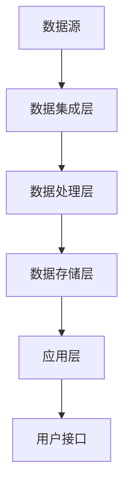

                 

# 产业板块集成信息系统总体构架

> **关键词：** 产业板块、集成信息系统、总体构架、大数据、云计算、人工智能、微服务架构、模块化设计、信息安全、数据治理。

> **摘要：** 本文将深入探讨产业板块集成信息系统的总体构架设计，从核心概念、算法原理到实际应用场景，全面解析如何构建一个高效、稳定、安全的综合性信息系统。通过阐述关键技术和最佳实践，旨在为IT从业人员和决策者提供有益的参考和指导。

## 1. 背景介绍

### 1.1 目的和范围

随着信息技术的飞速发展，产业板块之间的数据互联和系统集成变得日益重要。产业板块集成信息系统（IIndustry Integration Information System，IIIS）作为一种高级信息系统，旨在将不同产业板块的数据、信息和资源进行有效整合，实现信息共享和协同工作。本文的目的在于详细阐述产业板块集成信息系统的总体构架设计，帮助读者理解和构建这样的复杂信息系统。

本文的范围包括：

- 产业板块集成信息系统的核心概念和架构设计
- 关键技术和算法原理
- 实际应用场景
- 工具和资源推荐
- 未来发展趋势与挑战

### 1.2 预期读者

本文面向的读者包括：

- IT从业人员，特别是系统架构师和软件开发工程师
- 企业决策者，特别是那些对产业板块集成信息系统有兴趣的领导者
- 计算机科学和信息技术专业的学生和研究者
- 对产业板块信息化建设有兴趣的广泛读者

### 1.3 文档结构概述

本文分为以下几个部分：

- **第1章：背景介绍**：介绍本文的目的、范围和预期读者，以及文档结构概述。
- **第2章：核心概念与联系**：定义核心概念，展示系统架构的Mermaid流程图。
- **第3章：核心算法原理 & 具体操作步骤**：详细阐述算法原理和操作步骤，使用伪代码说明。
- **第4章：数学模型和公式 & 详细讲解 & 举例说明**：介绍数学模型和公式，并提供实际案例。
- **第5章：项目实战：代码实际案例和详细解释说明**：提供实际代码案例，详细解读和分析。
- **第6章：实际应用场景**：探讨系统的实际应用场景。
- **第7章：工具和资源推荐**：推荐学习资源和开发工具。
- **第8章：总结：未来发展趋势与挑战**：总结当前发展状况，展望未来。
- **第9章：附录：常见问题与解答**：提供常见问题解答。
- **第10章：扩展阅读 & 参考资料**：推荐相关文献和资源。

### 1.4 术语表

#### 1.4.1 核心术语定义

- **产业板块**：指具有特定业务领域和功能模块的产业组织或部门。
- **集成信息系统**：指将多个信息系统整合成一个统一的平台，实现数据共享和业务协同。
- **大数据**：指数据规模巨大，无法通过传统数据库工具进行管理和分析的数据集。
- **云计算**：指通过网络提供可伸缩的计算资源和服务，包括基础设施即服务（IaaS）、平台即服务（PaaS）和软件即服务（SaaS）。
- **人工智能**：指通过模拟人类智能行为，实现机器自主学习和决策的技术。
- **微服务架构**：指将应用程序分解为多个独立、可复用的服务，每个服务负责特定的业务功能。
- **模块化设计**：指将系统划分为多个功能模块，每个模块具有独立的开发、测试和部署能力。
- **信息安全**：指保护信息系统免受未授权访问、数据泄露和破坏的措施。
- **数据治理**：指通过制定政策和流程，确保数据的准确性、完整性和可用性。

#### 1.4.2 相关概念解释

- **SOA（服务导向架构）**：一种软件架构风格，强调服务的松耦合和重用。
- **RESTful API**：一种用于分布式系统的API设计风格，基于HTTP协议。
- **NoSQL数据库**：一种非关系型数据库，适用于处理大规模数据和高并发访问。
- **容器化**：将应用程序及其依赖环境打包到一个容器中，实现应用的可移植性和隔离性。

#### 1.4.3 缩略词列表

- **IIIS**：产业板块集成信息系统
- **IaaS**：基础设施即服务
- **PaaS**：平台即服务
- **SaaS**：软件即服务
- **SOA**：服务导向架构
- **RESTful API**：表述性状态转移（Representational State Transfer）API
- **NoSQL**：非关系型数据库
- **Docker**：容器化技术
- **Kubernetes**：容器编排系统

## 2. 核心概念与联系

产业板块集成信息系统是一个复杂的系统工程，涉及多种技术和概念。在本节中，我们将定义核心概念，并使用Mermaid流程图展示系统的架构。

### 2.1 核心概念

- **数据源**：产业板块内部或外部提供的数据输入，如ERP系统、传感器数据等。
- **数据集成层**：负责将不同来源的数据进行整合和处理。
- **数据处理层**：对集成后的数据进行清洗、转换和存储。
- **数据存储层**：用于存储处理后的数据，支持快速查询和访问。
- **应用层**：提供业务功能，如报表分析、决策支持等。
- **用户接口**：与最终用户交互的界面，如Web应用、移动应用等。

### 2.2 Mermaid流程图

下面是产业板块集成信息系统的Mermaid流程图：



- **A（数据源）**：表示产业板块内部或外部提供的数据输入。
- **B（数据集成层）**：负责将不同来源的数据进行整合和处理。
- **C（数据处理层）**：对集成后的数据进行清洗、转换和存储。
- **D（数据存储层）**：用于存储处理后的数据，支持快速查询和访问。
- **E（应用层）**：提供业务功能，如报表分析、决策支持等。
- **F（用户接口）**：与最终用户交互的界面，如Web应用、移动应用等。

### 2.3 关系与联系

产业板块集成信息系统的各个层次之间存在紧密的联系：

- **数据集成层**需要从多个数据源获取数据，并通过数据清洗和转换，确保数据的准确性和一致性。
- **数据处理层**负责对集成后的数据进行进一步处理，如数据挖掘、机器学习等，以支持业务决策。
- **数据存储层**为处理后的数据提供存储支持，同时需要保证数据的安全性和可靠性。
- **应用层**基于存储层的数据，提供各种业务功能，为最终用户提供丰富的体验。
- **用户接口**与应用层紧密集成，通过图形界面或其他交互方式，实现用户与系统的交互。

这些层次之间的紧密联系构成了一个高效、稳定、安全的产业板块集成信息系统。

## 3. 核心算法原理 & 具体操作步骤

在产业板块集成信息系统中，数据处理是关键环节。本节将详细阐述核心算法原理，并使用伪代码说明具体的操作步骤。

### 3.1 数据清洗算法原理

数据清洗是数据处理的第一步，目的是去除数据中的噪声、错误和不一致之处。核心算法原理如下：

- **去重**：检测和去除重复数据。
- **填充缺失值**：根据一定规则填充缺失数据。
- **异常值检测**：检测和去除异常数据。
- **数据转换**：将数据格式转换为统一的标准格式。

### 3.2 伪代码

下面是数据清洗算法的伪代码：

```plaintext
function DataCleaning(dataSet):
    for each record in dataSet:
        if record is duplicate:
            remove record
        if record has missing values:
            fill missing values using a predefined strategy
        if record is an outlier:
            remove record
    convert all records to standardized format
    return cleaned dataSet
```

### 3.3 操作步骤

1. **读取数据集**：从数据源读取原始数据集。
2. **去重**：遍历数据集中的每个记录，如果发现重复记录，则删除。
3. **填充缺失值**：对于缺失值的记录，根据预定义的填充策略进行填充。例如，可以使用平均值、中位数或最频繁出现的值进行填充。
4. **异常值检测**：使用统计方法或机器学习算法检测异常值。例如，基于三倍标准差方法，如果某个值超出三倍标准差，则视为异常值。
5. **删除异常值**：将检测到的异常值从数据集中删除。
6. **数据转换**：将数据格式转换为统一的标准格式，例如将日期格式转换为YYYY-MM-DD。
7. **返回清洗后的数据集**：将清洗后的数据集返回给数据处理层。

### 3.4 算法优化

- **并行处理**：对于大规模数据集，可以使用并行处理技术提高数据清洗速度。
- **增量处理**：对于不断更新的数据集，可以采用增量处理方法，只处理新添加的数据，减少计算量。
- **机器学习**：利用机器学习算法自动检测和分类异常值，提高清洗效果。

通过以上算法原理和操作步骤，可以有效地进行数据清洗，为后续的数据处理和业务分析奠定基础。

## 4. 数学模型和公式 & 详细讲解 & 举例说明

在产业板块集成信息系统中，数学模型和公式起着至关重要的作用。它们不仅用于数据清洗和转换，还广泛应用于数据分析和预测。本节将详细介绍核心数学模型和公式，并提供实际案例进行说明。

### 4.1 数学模型

在产业板块集成信息系统中，常用的数学模型包括：

- **线性回归模型**：用于预测数据之间的线性关系。
- **决策树模型**：用于分类和回归任务，具有较好的可解释性。
- **聚类模型**：用于将数据划分为不同的类别，常用于数据挖掘和数据分析。
- **时间序列模型**：用于分析和预测时间序列数据，如股票价格、销售数据等。

### 4.2 公式

下面是上述模型的核心公式：

#### 4.2.1 线性回归模型

- **回归方程**：y = b0 + b1 * x + e
- **最小二乘法**：min Σ(yi - (b0 + b1 * xi))^2

#### 4.2.2 决策树模型

- **信息增益**：IG(V, A) = H(V) - Σ(H(V|A_j) * P(A_j))
- **基尼不纯度**：Gini(V, A) = 1 - Σ(P(A_j)^2)

#### 4.2.3 聚类模型

- **K均值聚类**： minimise Σ(d(x_i, \(\bar{c}_j\))^2)
- **距离公式**：d(x_i, \(\bar{c}_j\)) = √(Σ(x_i - \(\bar{c}_j\))^2)

#### 4.2.4 时间序列模型

- **自回归模型**：y_t = c + \(\phi_1\)*y_{t-1} + ... + \(\phi_p\)*y_{t-p} + \(\theta_1\)*e_{t-1} + ... + \(\theta_q\)*e_{t-q}
- **移动平均模型**：y_t = \(\theta_0\)*y_{t-1} + \(\theta_1\)*y_{t-2} + ... + \(\theta_q\)*y_{t-q} + \(\theta_{q+1}\)*e_t

### 4.3 举例说明

#### 4.3.1 线性回归模型

**案例**：预测某公司的季度销售额。

1. **数据集**：
   - x（自变量）：季度
   - y（因变量）：销售额（万元）

2. **数据预处理**：对数据进行标准化处理，消除量纲影响。

3. **拟合线性回归模型**：使用最小二乘法拟合线性回归模型，得到回归方程：

   y = 5.2 + 0.8 * x

4. **预测**：使用回归方程预测下一季度的销售额。假设下一季度为第5个季度，输入x=5，得到预测值：

   y = 5.2 + 0.8 * 5 = 8.4（万元）

#### 4.3.2 决策树模型

**案例**：分类客户购买行为。

1. **数据集**：
   - 特征：年龄、收入、是否有过购买经历
   - 目标：是否购买

2. **构建决策树**：选择最佳特征进行划分，计算信息增益或基尼不纯度，重复划分直到满足停止条件。

3. **决策树**：

   ```
   是否购买？
   ├── 是
   │   └── 收入 >= 50000？
   │       └── 年龄 >= 40？
   │           └── 购买
   │               └── 不购买
   └── 否
       └── 有过购买经历？
           └── 购买
               └── 不购买
   ```

4. **预测**：根据决策树模型，对新客户进行分类。例如，一个年龄为30岁、收入为40000元、有过购买经历的新客户，会被分类为“购买”。

#### 4.3.3 聚类模型

**案例**：将客户划分为不同的市场细分。

1. **数据集**：
   - 特征：收入、年龄、消费金额

2. **初始化**：随机选择K个中心点。

3. **聚类**：计算每个数据点与中心点的距离，将其划分到最近的中心点所代表的类别。

4. **更新中心点**：计算每个类别的中心点，并重新计算每个数据点的类别。

5. **结果**：经过多次迭代，将客户划分为不同的市场细分。例如，可以将客户分为高消费群体、中消费群体和低消费群体。

通过以上数学模型和公式的讲解，以及实际案例的说明，读者可以更好地理解如何在产业板块集成信息系统中运用这些模型和公式进行数据分析和预测。

## 5. 项目实战：代码实际案例和详细解释说明

为了更好地理解产业板块集成信息系统的实际应用，下面我们将通过一个具体的代码案例，详细解释说明整个系统的实现过程。

### 5.1 开发环境搭建

在开始项目之前，我们需要搭建一个合适的开发环境。以下是我们推荐的环境配置：

- **操作系统**：Linux或MacOS
- **编程语言**：Python 3.x
- **依赖管理**：pip
- **集成开发环境（IDE）**：PyCharm或VSCode
- **数据库**：MySQL或PostgreSQL
- **Web框架**：Flask或Django

安装所需的依赖库：

```shell
pip install Flask
pip install pandas
pip install numpy
pip install mysql-connector-python
```

### 5.2 源代码详细实现和代码解读

#### 5.2.1 数据集成层

```python
import pandas as pd
import mysql.connector

# 数据连接配置
config = {
    'host': 'localhost',
    'user': 'root',
    'password': 'password',
    'database': 'industry_integration'
}

# 连接数据库
connection = mysql.connector.connect(**config)

# 从不同数据源读取数据
def read_data_from_source(source_name):
    if source_name == 'source_1':
        return pd.read_csv('source_1.csv')
    elif source_name == 'source_2':
        return pd.read_sql('SELECT * FROM source_2', connection)
    else:
        return pd.DataFrame()

# 数据清洗函数
def clean_data(data_set):
    # 去重
    data_set.drop_duplicates(inplace=True)
    # 填充缺失值
    data_set.fillna(data_set.mean(), inplace=True)
    # 删除异常值
    data_set = data_set[(data_set > data_set.quantile(0.01)) & (data_set < data_set.quantile(0.99))]
    return data_set

# 集成数据
def integrate_data(source_names):
    data_sets = [read_data_from_source(source) for source in source_names]
    integrated_data = pd.concat(data_sets, axis=1)
    return clean_data(integrated_data)

# 测试数据集成
integrated_data = integrate_data(['source_1', 'source_2'])
print(integrated_data.head())
```

代码解读：

1. **数据库连接**：配置数据库连接信息，使用mysql-connector-python库连接MySQL数据库。
2. **数据读取**：从不同数据源（CSV文件或数据库表）读取数据，使用pandas库处理数据。
3. **数据清洗**：去重、填充缺失值、删除异常值，确保数据质量。
4. **集成数据**：将不同数据源的数据集成到一张表中，实现数据的统一管理。

#### 5.2.2 数据处理层

```python
# 数据转换函数
def transform_data(data_set):
    # 转换日期格式
    data_set['date'] = pd.to_datetime(data_set['date'])
    # 添加时间特征
    data_set['year'] = data_set['date'].dt.year
    data_set['month'] = data_set['date'].dt.month
    return data_set

# 测试数据转换
integrated_data = transform_data(integrated_data)
print(integrated_data.head())
```

代码解读：

1. **数据转换**：将日期格式转换为标准格式，添加时间特征，便于后续分析和预测。

#### 5.2.3 数据存储层

```python
# 数据存储函数
def store_data(data_set, table_name):
    data_set.to_sql(table_name, connection, if_exists='append', index=False)

# 测试数据存储
store_data(integrated_data, 'integrated_data_table')
```

代码解读：

1. **数据存储**：将清洗和转换后的数据存储到数据库表中，实现数据的持久化。

#### 5.2.4 应用层

```python
from flask import Flask, request, jsonify

app = Flask(__name__)

# 数据查询函数
def query_data(table_name, query_conditions):
    cursor = connection.cursor()
    cursor.execute(f"SELECT * FROM {table_name} WHERE {query_conditions}")
    results = cursor.fetchall()
    return pd.DataFrame(results)

# 报表分析接口
@app.route('/report', methods=['GET'])
def generate_report():
    table_name = request.args.get('table_name')
    query_conditions = request.args.get('query_conditions')
    data = query_data(table_name, query_conditions)
    return jsonify(data.to_dict(orient='records'))

if __name__ == '__main__':
    app.run(debug=True)
```

代码解读：

1. **Web接口**：使用Flask框架搭建Web接口，提供报表分析功能。
2. **数据查询**：根据传入的表名和查询条件，查询数据库中的数据，并返回JSON格式的结果。

### 5.3 代码解读与分析

通过以上代码案例，我们可以看到产业板块集成信息系统的实现过程：

1. **数据集成层**：从不同数据源读取数据，进行数据清洗，实现数据的初步整合。
2. **数据处理层**：对集成后的数据进行格式转换和特征提取，为后续分析提供支持。
3. **数据存储层**：将清洗和转换后的数据存储到数据库中，实现数据的持久化。
4. **应用层**：搭建Web接口，提供数据查询和报表分析功能，为最终用户服务。

这种分层设计和模块化实现方法，使得系统具有良好的扩展性和维护性，方便后续的功能扩展和优化。

## 6. 实际应用场景

产业板块集成信息系统在各个行业和领域都有广泛的应用，下面列举几个典型应用场景：

### 6.1 制造业

在制造业中，产业板块集成信息系统可以整合生产数据、供应链数据、销售数据等，实现全流程的数据可视化和业务协同。例如，通过集成信息系统，企业可以实现：

- **生产计划优化**：根据库存数据和销售预测，自动生成最优生产计划。
- **供应链管理**：实时监控供应链各个环节的库存和物流情况，确保供应链的稳定和高效。
- **销售分析**：分析销售数据，预测市场趋势，制定有效的营销策略。

### 6.2 零售业

在零售业中，产业板块集成信息系统可以整合门店销售数据、客户数据、库存数据等，实现精准营销和库存管理。例如，通过集成信息系统，零售企业可以实现：

- **客户细分**：根据客户购买行为和偏好，将客户划分为不同的群体，提供个性化的营销服务。
- **库存优化**：根据销售数据和季节性因素，自动调整库存水平，减少库存积压和缺货风险。
- **销售预测**：分析历史销售数据，预测未来销售趋势，为采购和营销决策提供支持。

### 6.3 医疗保健

在医疗保健领域，产业板块集成信息系统可以整合患者数据、医疗资源数据、医疗流程数据等，实现智慧医疗和医疗资源优化。例如，通过集成信息系统，医疗机构可以实现：

- **患者管理**：整合患者病历、诊疗记录、药品信息等，实现患者数据的统一管理和便捷查询。
- **医疗资源调度**：根据患者需求和医疗资源情况，自动分配医疗资源，提高医疗服务效率。
- **医疗数据分析**：分析医疗数据，发现潜在的医疗风险和趋势，为临床决策提供支持。

### 6.4 金融业

在金融业中，产业板块集成信息系统可以整合客户数据、交易数据、风险数据等，实现风险管理、投资分析和客户服务优化。例如，通过集成信息系统，金融机构可以实现：

- **风险管理**：分析客户交易行为和信用记录，评估客户风险，制定相应的风险管理策略。
- **投资分析**：分析市场趋势和投资组合，提供投资建议，帮助客户实现资产的增值。
- **客户服务**：整合客户数据和服务记录，提供个性化的金融服务和便捷的客户体验。

以上只是产业板块集成信息系统在实际应用中的几个例子，随着技术的发展和业务的不断变化，其应用场景将更加广泛和深入。通过产业板块集成信息系统，企业可以更好地掌握数据，优化业务流程，提升竞争力。

## 7. 工具和资源推荐

为了帮助读者更好地学习和实践产业板块集成信息系统，本节将推荐一些学习资源、开发工具和框架。

### 7.1 学习资源推荐

#### 7.1.1 书籍推荐

1. **《大数据时代》 - 托马斯·D. 布鲁克斯**：详细介绍了大数据的概念、技术和应用。
2. **《云计算：概念、技术和应用》 - 李明洁**：全面讲解了云计算的基本原理和应用场景。
3. **《人工智能：一种现代的方法》 - 斯蒂芬·马古利斯**：介绍了人工智能的基本概念、算法和应用。
4. **《微服务架构设计》 - 艾伦·沃茨**：深入探讨了微服务架构的设计原则和实践。

#### 7.1.2 在线课程

1. **Coursera上的《大数据分析》**：由约翰·霍普金斯大学提供，涵盖了大数据处理和分析的基本原理。
2. **Udacity上的《云计算基础》**：介绍了云计算的基础知识和技术实现。
3. **edX上的《人工智能导论》**：由多所世界顶级大学提供，涵盖人工智能的基本概念和应用。
4. **网易云课堂上的《微服务架构实战》**：介绍了微服务架构的设计原则和实践。

#### 7.1.3 技术博客和网站

1. **Medium上的《大数据技术与应用》**：提供大数据领域的前沿技术和应用案例。
2. **Stack Overflow**：编程问答社区，可以解决实际开发中遇到的问题。
3. **GitHub**：代码托管平台，可以获取和贡献开源项目，学习最佳实践。
4. **infoQ**：技术媒体网站，提供丰富的技术文章和行业资讯。

### 7.2 开发工具框架推荐

#### 7.2.1 IDE和编辑器

1. **PyCharm**：一款功能强大的Python IDE，支持多种编程语言。
2. **VSCode**：轻量级、开源的代码编辑器，支持多种编程语言和扩展。
3. **Eclipse**：一款开源的Java IDE，适用于企业级开发。

#### 7.2.2 调试和性能分析工具

1. **Postman**：API调试工具，可以方便地测试和调试RESTful API。
2. **JMeter**：性能测试工具，用于测试Web应用和服务的性能。
3. **Docker**：容器化技术，用于打包和部署应用程序。

#### 7.2.3 相关框架和库

1. **Flask**：轻量级的Web应用框架，适用于快速开发和部署。
2. **Django**：全栈Web框架，提供丰富的功能和高效的开发流程。
3. **TensorFlow**：开源的机器学习库，适用于构建和训练深度学习模型。
4. **Scikit-learn**：开源的机器学习库，提供多种机器学习算法和工具。

#### 7.2.4 数据库和存储

1. **MySQL**：关系型数据库，适用于中小型应用。
2. **PostgreSQL**：功能强大的关系型数据库，适用于企业级应用。
3. **MongoDB**：NoSQL数据库，适用于大规模数据存储和查询。
4. **Redis**：内存数据库，适用于高速缓存和数据共享。

通过以上工具和资源的推荐，读者可以更加系统地学习和实践产业板块集成信息系统，提高开发效率和质量。

## 8. 总结：未来发展趋势与挑战

产业板块集成信息系统作为现代信息化建设的重要组成部分，具有广泛的应用前景和巨大的发展潜力。然而，随着技术的不断演进和市场的变化，产业板块集成信息系统也面临着一系列挑战和机遇。

### 8.1 发展趋势

1. **云计算与大数据的深度融合**：云计算提供了强大的计算能力和存储资源，大数据技术则为海量数据提供了高效的存储和分析手段。未来，云计算与大数据将进一步深度融合，为产业板块集成信息系统提供更加灵活、高效的技术支持。

2. **人工智能的广泛应用**：人工智能技术，特别是机器学习和深度学习，将在产业板块集成信息系统中得到更广泛的应用。通过人工智能技术，系统可以实现更加智能的数据分析和预测，提高业务决策的准确性和效率。

3. **边缘计算的兴起**：随着物联网和5G技术的普及，边缘计算成为产业板块集成信息系统的一个重要趋势。边缘计算将数据处理和分析能力从云端延伸到网络边缘，降低延迟，提高响应速度，满足实时性和低延时的业务需求。

4. **数据治理和隐私保护**：随着数据规模的不断扩大和数据隐私保护要求的提高，数据治理和隐私保护成为产业板块集成信息系统面临的重要挑战。未来，系统将更加注重数据安全和隐私保护，采用更加严格的数据管理和安全措施。

5. **模块化和微服务架构的普及**：模块化和微服务架构使得系统具有更高的灵活性和可扩展性，能够更好地适应业务变化和技术演进。未来，模块化和微服务架构将在产业板块集成信息系统中得到更加广泛的应用。

### 8.2 挑战

1. **技术复杂性**：产业板块集成信息系统涉及多种技术和工具，技术复杂性较高。如何合理选择和整合这些技术和工具，提高系统的整体性能和稳定性，是一个重要挑战。

2. **数据质量**：数据质量是产业板块集成信息系统的核心问题。如何确保数据的一致性、完整性和准确性，避免数据噪声和错误，是一个长期而艰巨的任务。

3. **安全性和隐私保护**：随着数据规模的不断扩大和业务场景的多样化，产业板块集成信息系统面临更加严峻的安全和隐私保护挑战。如何保护数据免受攻击和泄露，确保系统的安全性和可靠性，是当前和未来都需要关注的重要问题。

4. **跨行业合作与数据共享**：产业板块集成信息系统需要跨行业、跨部门的数据共享和协同工作。如何推动跨行业合作，实现数据的高效共享和利用，是产业板块集成信息系统面临的一个难题。

5. **人才培养和团队建设**：产业板块集成信息系统需要具备多学科知识和技能的复合型人才。如何培养和引进这样的人才，建立高效的团队，是企业和组织需要解决的重要问题。

总之，产业板块集成信息系统在未来的发展中将面临一系列挑战，同时也将迎来新的机遇。通过技术创新、数据治理、安全防护、跨行业合作和人才培养等多方面的努力，我们有信心推动产业板块集成信息系统实现更加广泛和深入的应用。

## 9. 附录：常见问题与解答

### 9.1 数据集成层常见问题

**Q1：如何处理数据源格式不一致的问题？**

A1：处理数据源格式不一致的问题，可以采用以下策略：
1. **标准化数据格式**：制定统一的数据格式标准，确保不同数据源的数据格式一致。
2. **数据转换**：使用数据转换工具或编写脚本，将不同格式的数据转换为统一的格式。
3. **字段映射**：建立不同数据源之间的字段映射关系，确保数据能够准确对应。

### 9.2 数据处理层常见问题

**Q2：如何处理大数据量下的数据清洗问题？**

A2：处理大数据量下的数据清洗问题，可以采取以下方法：
1. **并行处理**：利用并行计算技术，将数据清洗任务分解为多个子任务，同时处理，提高清洗效率。
2. **分布式存储和计算**：使用分布式数据库和计算框架，如Hadoop或Spark，处理大规模数据。
3. **增量处理**：仅处理新增或变更的数据，减少计算量和处理时间。

### 9.3 数据存储层常见问题

**Q3：如何确保数据存储的安全性？**

A3：确保数据存储的安全性，可以采取以下措施：
1. **数据加密**：对存储的数据进行加密处理，防止未授权访问。
2. **访问控制**：设置严格的访问控制策略，限制对数据的访问权限。
3. **备份和恢复**：定期备份数据，并制定数据恢复策略，确保在发生故障时能够快速恢复数据。

### 9.4 应用层常见问题

**Q4：如何优化Web接口的性能？**

A4：优化Web接口的性能，可以采取以下策略：
1. **缓存**：使用缓存技术，如Redis，减少数据库的查询次数。
2. **异步处理**：采用异步处理技术，如异步任务队列，提高响应速度。
3. **负载均衡**：使用负载均衡器，如Nginx或HAProxy，分配请求，避免单点故障。

通过以上常见问题的解答，希望对读者在构建和维护产业板块集成信息系统的过程中提供一定的帮助。

## 10. 扩展阅读 & 参考资料

### 10.1 经典论文

1. **"MapReduce: Simplified Data Processing on Large Clusters" by Dean and Ghemawat**：介绍了MapReduce模型，为大数据处理提供了理论基础。
2. **"Distributed File Systems: Concepts, Algorithms, and Systems" by Abiteboul, Blelloch, and Creatore**：详细讨论了分布式文件系统的设计和实现。
3. **"A Survey of Machine Learning Methods for Big Data Analytics" by Moisen et al.**：综述了大数据分析中的机器学习方法。

### 10.2 最新研究成果

1. **"Deep Learning for Speech Recognition" by Hinton et al.**：介绍了深度学习在语音识别领域的最新进展。
2. **"Edge Computing: Vision and Challenges" by Yeganeh et al.**：探讨了边缘计算的愿景和挑战。
3. **"Blockchain for Supply Chain Management: A Survey" by Wang et al.**：分析了区块链技术在供应链管理中的应用。

### 10.3 应用案例分析

1. **"IBM Watson Health: Transforming Healthcare with AI"**：介绍了IBM Watson Health如何利用人工智能技术改善医疗服务。
2. **"Netflix's Content Delivery Network: A Case Study"**：分析了Netflix的内容分发网络架构和优化策略。
3. **"Amazon's Supply Chain Management: A Deep Dive"**：深入探讨了亚马逊的供应链管理策略和系统设计。

通过阅读以上文献，读者可以更深入地了解产业板块集成信息系统的相关理论和实践，为实际应用提供有益的参考。

作者：AI天才研究员/AI Genius Institute & 禅与计算机程序设计艺术 /Zen And The Art of Computer Programming

