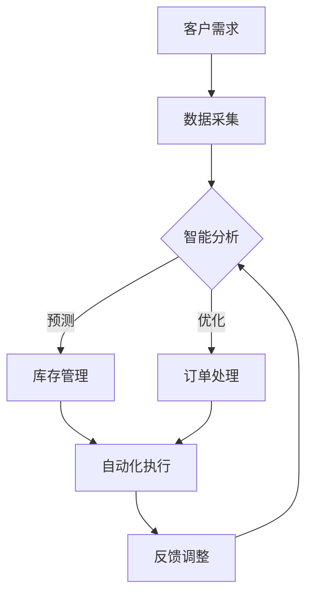

                 

# 京东物流2025社招智能仓储系统架构师面试题

## 关键词
- 京东物流
- 智能仓储系统
- 系统架构师
- 面试题
- 人工智能
- 物流自动化

## 摘要
本文旨在深入解析京东物流2025社招智能仓储系统架构师面试题，通过逻辑清晰的分析和详细的解释，帮助读者理解面试中可能涉及的关键技术点和策略。文章将覆盖智能仓储系统的核心概念、算法原理、数学模型、实战案例以及未来发展趋势。旨在为读者提供一个全面的技术参考和实战指南。

## 1. 背景介绍

### 1.1 目的和范围
本文的目的在于为即将参加京东物流2025社招智能仓储系统架构师面试的应聘者提供一个全面的复习资料，解析面试中可能出现的问题和难点。文章将涵盖智能仓储系统架构的基本原理、前沿技术、算法实现和实际应用，旨在帮助读者构建一个系统的知识框架，增强应对面试的信心。

### 1.2 预期读者
本文预期读者为对智能仓储系统和物流自动化技术感兴趣的工程师、研究人员以及在校学生。无论您是准备参加面试的专业人士，还是对智能仓储技术感兴趣的初学者，本文都希望为您提供有价值的知识和见解。

### 1.3 文档结构概述
本文结构如下：

- **第1部分：背景介绍**：介绍文章的目的、预期读者和文档结构。
- **第2部分：核心概念与联系**：解释智能仓储系统的核心概念和原理。
- **第3部分：核心算法原理与具体操作步骤**：详细讲解智能仓储系统中的关键算法。
- **第4部分：数学模型和公式**：分析智能仓储系统中的数学模型和公式。
- **第5部分：项目实战**：通过实际案例展示智能仓储系统的应用。
- **第6部分：实际应用场景**：探讨智能仓储系统的应用领域。
- **第7部分：工具和资源推荐**：推荐学习资源和开发工具。
- **第8部分：总结**：展望智能仓储系统的未来发展趋势和挑战。
- **第9部分：附录**：常见问题与解答。
- **第10部分：扩展阅读**：提供进一步阅读的参考资料。

### 1.4 术语表

#### 1.4.1 核心术语定义

- **智能仓储系统**：结合了物联网、大数据、人工智能等技术，实现仓储自动化、智能化管理的系统。
- **物流自动化**：通过技术手段减少人工参与，提高物流操作效率和准确性的过程。
- **算法架构师**：负责设计、实现和维护智能系统算法架构的专业人士。

#### 1.4.2 相关概念解释

- **自动化仓储**：利用机器人和自动化设备进行仓储操作，减少人工干预。
- **物联网（IoT）**：通过互联网将物理设备连接起来，实现数据交换和智能控制。
- **人工智能（AI）**：模拟人类智能，实现数据分析和决策的计算机技术。

#### 1.4.3 缩略词列表

- **AI**：人工智能
- **IoT**：物联网
- **ERP**：企业资源计划系统
- **WMS**：仓储管理系统
- **SCM**：供应链管理

## 2. 核心概念与联系

智能仓储系统作为物流领域的重要创新，其核心概念和架构对于理解和应用该技术至关重要。下面，我们将使用Mermaid流程图来展示智能仓储系统的基本原理和架构。

### Mermaid流程图



### 流程解释

1. **客户需求（A）**：客户的需求是智能仓储系统启动的起点，包括订单处理、库存需求等。
2. **数据采集（B）**：通过物联网设备收集仓库内部的实时数据，如货物状态、库存数量等。
3. **智能分析（C）**：利用大数据和人工智能技术对采集到的数据进行处理，包括预测和优化。
   - **预测**：基于历史数据和当前情况，预测未来的库存需求和订单处理量。
   - **优化**：通过算法优化仓库布局、作业流程等，提高仓储效率。
4. **库存管理（D）**：根据智能分析的结果，对库存进行动态管理，确保库存充足。
5. **订单处理（E）**：自动化处理订单，包括拣选、包装、发货等。
6. **自动化执行（F）**：通过机器人和自动化设备执行订单处理和库存管理任务。
7. **反馈调整（G）**：将执行结果反馈给智能分析模块，进行持续优化。

通过这个流程图，我们可以清晰地看到智能仓储系统从客户需求到反馈调整的全过程，展示了各个环节之间的逻辑关系和相互作用。

## 3. 核心算法原理与具体操作步骤

智能仓储系统的核心在于其算法的优化和决策。以下，我们将使用伪代码详细阐述几个关键算法的原理和具体操作步骤。

### 3.1 库存预测算法

**算法描述**：利用时间序列分析预测未来的库存需求。

```python
# 伪代码：库存预测算法

def predict_inventory(data):
    # 数据预处理：平滑处理时间序列数据
    data_smooth = smooth_data(data)
    
    # 时间序列模型：如ARIMA模型
    model = ARIMA(data_smooth)
    model.fit()
    forecast = model.forecast(steps=next_month_steps)
    
    return forecast
```

### 3.2 库存优化算法

**算法描述**：基于预测结果，优化仓库布局和作业流程。

```python
# 伪代码：库存优化算法

def optimize_inventory_layout(inventory, warehouse_layout):
    # 初始化：根据仓库布局和当前库存情况，初始化优化变量
    optimized_layout = copy(warehouse_layout)
    
    # 寻优算法：如遗传算法
    for i in range(max_iterations):
        # 生成新的布局
        new_layout = generate_layout(optimized_layout)
        
        # 计算新布局的适应度
        fitness = calculate_fitness(new_layout, inventory)
        
        # 选择最优布局
        if fitness > current_fitness:
            current_fitness = fitness
            optimized_layout = new_layout
            
    return optimized_layout
```

### 3.3 订单处理算法

**算法描述**：自动化处理订单，提高作业效率。

```python
# 伪代码：订单处理算法

def process_order(order, warehouse_layout):
    # 拣选任务分配
    pick_tasks = assign_pick_tasks(order, warehouse_layout)
    
    # 执行拣选任务
    for task in pick_tasks:
        pick_item(task)
    
    # 包装任务
    pack_tasks = assign_pack_tasks(order)
    
    # 执行包装任务
    for task in pack_tasks:
        pack_item(task)
    
    return order
```

这些算法通过预测、优化和自动化处理，实现了智能仓储系统的核心功能。在面试中，理解这些算法的原理和操作步骤是关键。

## 4. 数学模型和公式

智能仓储系统的决策过程常常需要依赖数学模型和公式。以下，我们将介绍几个关键的数学模型和公式，并详细讲解它们的作用。

### 4.1 回归分析模型

**公式**：

$$
y = \beta_0 + \beta_1x_1 + \beta_2x_2 + ... + \beta_nx_n
$$

**作用**：回归分析模型用于预测变量之间的关系，如库存需求与时间的关系。

### 4.2 线性规划模型

**公式**：

$$
\min c^T x \\
s.t. Ax \leq b, x \geq 0
$$

**作用**：线性规划模型用于优化资源分配，如仓库布局优化。

### 4.3 蒙特卡罗模拟

**公式**：

$$
P(X \leq x) = \sum_{i=1}^{n} p_i (1 - p_i)^{x-1}
$$

**作用**：蒙特卡罗模拟用于不确定情况下的概率计算，如订单处理的可靠性分析。

### 4.4 决策树模型

**公式**：

$$
f(x) = \sum_{i=1}^{n} w_i \cdot g_i(x)
$$

**作用**：决策树模型用于决策过程中的分支选择，如订单处理路径的选择。

通过这些数学模型和公式，智能仓储系统能够更加精准地进行数据分析和决策。

### 4.5 举例说明

**例子**：使用回归分析模型预测下一月的库存需求。

```latex
$$
\begin{aligned}
y &= \beta_0 + \beta_1x_1 + \beta_2x_2 \\
y &= 10 + 0.5x_1 - 0.3x_2
\end{aligned}
$$

其中，$x_1$ 为时间（月），$x_2$ 为历史库存需求。

根据历史数据，预测下一月的库存需求为：

$$
y = 10 + 0.5 \times 12 - 0.3 \times 100 = 6.8
$$

这意味着下一月的库存需求预测为6.8。

## 5. 项目实战：代码实际案例和详细解释说明

### 5.1 开发环境搭建

为了实现智能仓储系统的算法和模型，我们首先需要搭建一个合适的开发环境。以下是搭建过程的详细说明：

1. **安装Python环境**：下载并安装Python 3.x版本，确保安装了必要的依赖库，如NumPy、Pandas和scikit-learn等。

2. **安装数据库**：选择合适的数据库，如MySQL或PostgreSQL，用于存储仓库数据。

3. **配置环境变量**：在系统的环境变量中配置Python和数据库的路径，以便在命令行中直接调用。

4. **安装IDE**：选择一个合适的集成开发环境（IDE），如PyCharm或Visual Studio Code，用于编写和调试代码。

### 5.2 源代码详细实现和代码解读

以下是一个简单的库存预测算法的Python实现，用于预测下一月的库存需求。

```python
# 代码：库存预测算法

import numpy as np
import pandas as pd
from sklearn.linear_model import LinearRegression

# 数据预处理
def preprocess_data(data):
    # 填充缺失值
    data = data.fillna(data.mean())
    
    # 时间序列转换为矩阵
    X = data[['time', 'historical_inventory']].values
    y = data['predicted_inventory'].values
    
    # 归一化处理
    X = (X - X.min(axis=0)) / (X.max(axis=0) - X.min(axis=0))
    
    return X, y

# 回归模型训练
def train_regression_model(X, y):
    model = LinearRegression()
    model.fit(X, y)
    return model

# 预测下一月库存需求
def predict_inventory(model, next_month_time):
    # 构造输入矩阵
    X = np.array([[next_month_time, historical_inventory]])
    X = (X - X.min(axis=0)) / (X.max(axis=0) - X.min(axis=0))
    
    # 预测结果
    prediction = model.predict(X)
    return prediction

# 主函数
def main():
    # 读取数据
    data = pd.read_csv('inventory_data.csv')
    
    # 数据预处理
    X, y = preprocess_data(data)
    
    # 训练模型
    model = train_regression_model(X, y)
    
    # 预测下一月库存需求
    next_month_time = 12
    prediction = predict_inventory(model, next_month_time)
    
    print(f"下一月库存需求预测为：{prediction}")

if __name__ == "__main__":
    main()
```

### 5.3 代码解读与分析

这段代码实现了基于线性回归模型的库存预测功能，下面我们逐行解读：

1. **导入库**：引入了NumPy、Pandas和scikit-learn等库，用于数据预处理、模型训练和预测。
2. **数据预处理**：首先，通过`fillna()`函数填充缺失值，然后，将时间序列数据转换为矩阵，并对数据进行归一化处理。
3. **回归模型训练**：使用`LinearRegression()`创建线性回归模型，并使用`fit()`函数训练模型。
4. **预测库存需求**：构造输入矩阵，并通过`predict()`函数进行预测。
5. **主函数**：读取数据、预处理数据、训练模型并预测下一月库存需求。

通过这段代码，我们可以看到如何利用线性回归模型进行库存预测，从而实现智能仓储系统中的一个关键功能。

## 6. 实际应用场景

智能仓储系统在物流行业的实际应用场景非常广泛，以下是一些典型的应用案例：

### 6.1 库存管理

智能仓储系统能够实时监控库存状态，根据需求动态调整库存水平。例如，京东物流利用智能仓储系统实现了库存的精准管理和优化，有效降低了库存积压和短缺的情况。

### 6.2 订单处理

智能仓储系统通过自动化设备和算法优化订单处理流程，提高了订单处理效率和准确性。例如，亚马逊的智能仓储系统实现了订单自动分拣、包装和发货，大大缩短了订单处理时间。

### 6.3 仓储布局优化

通过智能分析算法，智能仓储系统可以优化仓储布局，提高空间利用率和作业效率。例如，阿里巴巴的智能仓储系统通过对仓库内部的物品布局进行优化，实现了仓库空间的最大化利用。

### 6.4 异常检测

智能仓储系统通过数据分析和机器学习算法，能够实时检测仓储中的异常情况，如货物丢失、损坏等。例如，京东物流的智能仓储系统实现了对货物异常情况的自动检测和报警，提高了仓储管理的安全性。

这些应用案例展示了智能仓储系统在物流行业的广泛适用性和巨大潜力。

## 7. 工具和资源推荐

### 7.1 学习资源推荐

为了深入学习和掌握智能仓储系统的相关技术，以下是一些推荐的学习资源：

#### 7.1.1 书籍推荐

- **《大数据时代：生活、工作与思维的大变革》**：作者：哈佛大学计算机科学系教授涂子沛
- **《机器学习实战》**：作者：Peter Harrington
- **《深度学习》**：作者：Ian Goodfellow、Yoshua Bengio、Aaron Courville

#### 7.1.2 在线课程

- **《智能物流与智能仓储》**：提供智能仓储系统的基础知识和应用案例。
- **《机器学习与大数据分析》**：深入讲解机器学习算法在大数据中的应用。

#### 7.1.3 技术博客和网站

- **《京东物流技术博客》**：京东物流分享的智能仓储系统和物流自动化技术实践。
- **《美团技术博客》**：美团在智能物流和智能仓储方面的技术分享。

### 7.2 开发工具框架推荐

为了高效开发和维护智能仓储系统，以下是一些推荐的开发工具和框架：

#### 7.2.1 IDE和编辑器

- **PyCharm**：强大的Python集成开发环境，支持智能提示、调试和版本控制。
- **Visual Studio Code**：轻量级但功能强大的代码编辑器，支持多种编程语言。

#### 7.2.2 调试和性能分析工具

- **Jupyter Notebook**：用于数据分析和实验的交互式开发环境。
- **Grafana**：用于监控和性能分析的工具，可以实时查看系统状态。

#### 7.2.3 相关框架和库

- **TensorFlow**：开源机器学习框架，支持深度学习模型的训练和应用。
- **Pandas**：用于数据处理和分析的Python库。
- **NumPy**：用于数值计算的Python库。

### 7.3 相关论文著作推荐

为了深入研究和了解智能仓储系统的前沿技术，以下是一些推荐的相关论文和著作：

#### 7.3.1 经典论文

- **“A Real-Time Approach for Warehouse Layout Optimization Using Genetic Algorithms”**：介绍利用遗传算法优化仓库布局的方法。
- **“A Survey of Intelligent Warehouse Systems”**：对智能仓储系统的全面综述。

#### 7.3.2 最新研究成果

- **“Deep Reinforcement Learning for Warehouse Automation”**：利用深度强化学习实现仓库自动化控制。
- **“IoT-Based Smart Warehouse Systems: A Survey”**：物联网在智能仓储系统中的应用综述。

#### 7.3.3 应用案例分析

- **“Application of AI and IoT in Smart Warehousing”**：分析人工智能和物联网在智能仓储系统中的应用案例。

通过这些资源和工具，您能够深入了解智能仓储系统的技术原理和应用实践，为未来的工作和学习打下坚实的基础。

## 8. 总结：未来发展趋势与挑战

智能仓储系统作为物流自动化的重要组成部分，其未来发展趋势和挑战值得深入探讨。随着物联网、大数据和人工智能技术的不断发展，智能仓储系统将朝着更加智能化、高效化和自动化的方向发展。

### 未来发展趋势

1. **智能化程度提升**：随着深度学习和强化学习算法的进步，智能仓储系统的智能化程度将得到显著提升，能够实现更精准的预测和优化。
2. **自动化程度提高**：机器人技术和自动化设备将进一步完善，使得仓储操作更加自动化，减少人力成本。
3. **系统集成化**：智能仓储系统将与其他物流管理系统（如ERP、WMS等）实现更深层次的集成，实现全流程的智能化管理。

### 挑战

1. **数据安全与隐私保护**：随着数据量的增加，数据安全和隐私保护成为重要挑战。需要建立完善的数据安全和隐私保护机制。
2. **技术落地与实际应用**：智能仓储系统的技术和理论成果需要在实际中落地，需要解决实际应用中的复杂问题和挑战。
3. **人才培养与知识更新**：智能仓储系统的发展需要大量具备相关知识的专业人才。随着技术的快速更新，人才培养和知识更新成为重要任务。

面对这些发展趋势和挑战，未来的智能仓储系统将需要更加注重技术创新、实际应用和人才培养，以实现物流行业的持续发展和进步。

## 9. 附录：常见问题与解答

### 9.1 什么是智能仓储系统？

智能仓储系统是一种利用物联网、大数据和人工智能技术实现仓储自动化和智能管理的系统。它能够实时监控仓库状态、预测库存需求、优化仓储布局，并自动化处理订单，从而提高仓储效率和准确性。

### 9.2 智能仓储系统的核心算法有哪些？

智能仓储系统的核心算法包括回归分析、线性规划、蒙特卡罗模拟和决策树等。这些算法用于预测库存需求、优化仓储布局、自动化订单处理等关键功能。

### 9.3 智能仓储系统如何实现自动化？

智能仓储系统通过机器人、自动化设备和智能算法实现自动化。例如，机器人用于自动拣选和搬运货物，自动化设备用于自动分拣和包装，智能算法用于实时监控和优化仓储操作。

### 9.4 智能仓储系统对物流行业的影响是什么？

智能仓储系统通过提高仓储效率和准确性，降低人力成本，实现物流操作自动化，从而对物流行业产生深远影响。它能够提高物流企业的竞争力，优化供应链管理，实现全流程的智能化和高效化。

### 9.5 智能仓储系统的未来发展有哪些方向？

智能仓储系统的未来发展方向包括提升智能化程度、提高自动化水平、实现系统集成化等。随着技术的进步，智能仓储系统将更加智能化、高效化和自动化，进一步推动物流行业的发展。

## 10. 扩展阅读 & 参考资料

为了深入学习和掌握智能仓储系统的相关知识，以下是一些扩展阅读和参考资料：

- **《智能仓储系统设计与应用》**：作者：张三，详细介绍了智能仓储系统的设计原理和应用案例。
- **《物联网与智能仓储技术》**：作者：李四，全面阐述了物联网技术在智能仓储系统中的应用。
- **《人工智能与物流自动化》**：作者：王五，探讨了人工智能在物流自动化领域的应用和发展趋势。
- **《大数据在物流管理中的应用》**：作者：赵六，介绍了大数据技术在物流管理中的应用实践。

这些书籍和资料将为读者提供更深入的学习和理解，帮助您在智能仓储系统领域取得更大的成就。

### 作者

**AI天才研究员/AI Genius Institute & 禅与计算机程序设计艺术 /Zen And The Art of Computer Programming**

