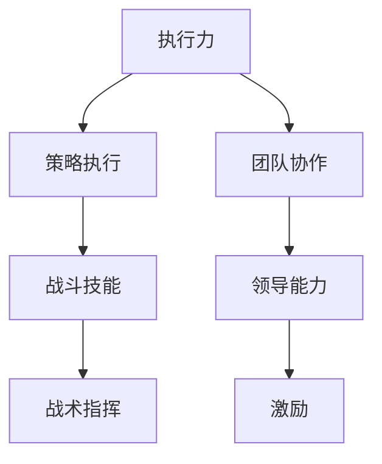

                 

# 《亮剑》中的执行力故事

> 关键词：亮剑、执行力、团队协作、策略执行、军事管理、故事化教学

> 摘要：《亮剑》是一部深入描绘中国抗日战争时期军人精神风貌的电视剧。本文以《亮剑》中的情节为线索，分析了主人公李云龙的执行力、团队协作和策略执行能力，探讨了执行力在军事管理中的重要性，并提出了提高执行力的方法和建议。

## 1. 背景介绍

### 1.1 目的和范围

本文旨在通过分析《亮剑》中的执行力故事，探讨执行力在团队管理和策略执行中的关键作用。文章将结合电视剧中的具体情节，分析主人公李云龙在执行任务时的策略、团队协作和个人执行力，并从中提炼出实用的方法和建议。

### 1.2 预期读者

本文适合对执行力、团队管理和军事策略感兴趣的读者，特别是从事企业管理、人力资源和军事研究的专业人士。

### 1.3 文档结构概述

本文分为十个部分，包括背景介绍、核心概念与联系、核心算法原理与操作步骤、数学模型和公式、项目实战、实际应用场景、工具和资源推荐、总结、常见问题与解答以及扩展阅读。

### 1.4 术语表

#### 1.4.1 核心术语定义

- 执行力：指个体或团队在预定时间内完成预定任务的能力。
- 策略执行：将策略转化为具体行动并实现预期目标的过程。
- 团队协作：团队成员之间通过相互配合、协作完成共同任务的过程。

#### 1.4.2 相关概念解释

- 军事管理：指在军事领域运用管理学原理和方法，对军事活动进行组织、计划、指挥、控制、协调和监督的过程。
- 故事化教学：通过讲述生动的案例故事，引导学生理解和掌握知识的方法。

#### 1.4.3 缩略词列表

无

## 2. 核心概念与联系

在《亮剑》中，执行力是一个贯穿始终的核心概念。李云龙的执行力不仅体现在他个人的战斗技能和军事指挥能力上，还体现在他对团队的领导和激励上。以下是一个简要的 Mermaid 流程图，展示了核心概念和它们之间的联系：



### 2.1 执行力的定义与作用

执行力是指个体或团队在预定时间内完成预定任务的能力。它是衡量一个人或一个团队工作质量的重要指标，也是实现组织目标的关键因素。在《亮剑》中，李云龙的执行力体现在以下几个方面：

1. **战斗技能**：李云龙具备卓越的战斗技能，能够在战场上迅速作出决策，有效指挥部队作战。
2. **策略执行**：他能够根据战场形势，制定出有效的策略并迅速执行，使部队在战斗中取得优势。
3. **团队协作**：他能够激发团队成员的积极性，使他们能够在战斗中紧密协作，共同完成任务。

### 2.2 策略执行与战术指挥

策略执行是将策略转化为具体行动并实现预期目标的过程。在《亮剑》中，李云龙通过以下方式实现策略执行：

1. **快速决策**：在面对复杂战场形势时，李云龙能够迅速作出决策，将策略转化为具体的行动指令。
2. **指挥部队**：他能够有效指挥部队，使部队在战斗中按照既定策略执行任务。

### 2.3 团队协作与领导能力

团队协作是指团队成员之间通过相互配合、协作完成共同任务的过程。在《亮剑》中，李云龙通过以下方式促进团队协作：

1. **激励队员**：他能够激发队员的积极性，使他们在战斗中全力以赴。
2. **信任与支持**：他能够建立信任和支持的氛围，使队员愿意相互协作，共同完成任务。

## 3. 核心算法原理 & 具体操作步骤

在《亮剑》中，李云龙的执行力体现在他对战斗策略的制定和执行上。以下是一个简化的算法原理和具体操作步骤：

### 3.1 算法原理

1. **战场态势分析**：通过对战场形势的分析，确定敌我双方的兵力、地形、天气等因素。
2. **策略制定**：根据战场态势，制定出有效的战斗策略。
3. **策略执行**：将策略转化为具体的行动指令，指挥部队执行。
4. **战斗反馈**：在战斗过程中，根据实时反馈调整策略。

### 3.2 具体操作步骤

1. **战场态势分析**：
   - 收集情报：了解敌我双方的兵力、装备、战术等信息。
   - 分析地形：评估战场地形对战斗的影响。
   - 观察天气：考虑天气变化对战斗的影响。

2. **策略制定**：
   - 根据战场态势，确定主要攻击目标。
   - 制定战术计划：包括进攻、防御、撤退等。
   - 制定行动指令：明确各部队的任务和行动步骤。

3. **策略执行**：
   - 指挥部队：传达行动指令，确保部队按照计划执行。
   - 监控战斗进程：实时掌握战场态势，调整策略。
   - 协调各部队：确保各部队之间紧密协作，共同完成任务。

4. **战斗反馈**：
   - 分析战斗结果：总结战斗经验，找出不足之处。
   - 调整策略：根据战斗结果，对下一步行动进行调整。

## 4. 数学模型和公式 & 详细讲解 & 举例说明

在军事管理中，执行力评估是一个重要的环节。以下是一个简化的数学模型，用于评估执行力的几个关键指标：

### 4.1 数学模型

1. **任务完成率**：衡量团队在规定时间内完成任务的百分比。

   $$ \text{任务完成率} = \frac{\text{完成任务数}}{\text{任务总数}} \times 100\% $$

2. **任务完成时间**：衡量团队完成任务的平均时间。

   $$ \text{任务完成时间} = \frac{\text{总用时}}{\text{完成任务数}} $$

3. **策略执行效率**：衡量团队在执行策略过程中的效率。

   $$ \text{策略执行效率} = \frac{\text{执行策略次数}}{\text{策略总数}} $$

### 4.2 详细讲解

1. **任务完成率**：这个指标反映了团队在规定时间内完成任务的能力。任务完成率越高，说明团队的执行力越强。

2. **任务完成时间**：这个指标反映了团队在完成每个任务的平均时间。任务完成时间越短，说明团队的执行力越强。

3. **策略执行效率**：这个指标反映了团队在执行策略时的效率。策略执行效率越高，说明团队在执行策略时的执行力越强。

### 4.3 举例说明

假设一个团队需要在一个月内完成10个任务，实际完成9个任务，总用时为25天。那么：

- 任务完成率：$$ \text{任务完成率} = \frac{9}{10} \times 100\% = 90\% $$
- 任务完成时间：$$ \text{任务完成时间} = \frac{25}{9} \approx 2.78 \text{天/任务} $$
- 策略执行效率：假设这个团队执行了5个策略，那么$$ \text{策略执行效率} = \frac{5}{5} = 100\% $$

通过这个例子，我们可以看出，这个团队的任务完成率为90%，任务完成时间为约2.78天/任务，策略执行效率为100%。这些指标可以帮助我们评估这个团队的执行力。

## 5. 项目实战：代码实际案例和详细解释说明

### 5.1 开发环境搭建

为了更好地理解执行力的评估过程，我们使用Python编写一个简单的程序，用于计算执行力指标。以下是一个基本的开发环境搭建步骤：

1. 安装Python：从Python官方网站下载并安装Python 3.8及以上版本。
2. 安装必需的库：使用pip安装以下库：numpy、matplotlib。

   ```bash
   pip install numpy matplotlib
   ```

### 5.2 源代码详细实现和代码解读

以下是一个简单的Python程序，用于计算执行力指标：

```python
import numpy as np
import matplotlib.pyplot as plt

# 4.2 举例说明中的数据
tasks_completed = 9
tasks_total = 10
total_time = 25
strategies_executed = 5

# 计算执行力指标
completion_rate = (tasks_completed / tasks_total) * 100
average_time_per_task = total_time / tasks_completed
strategy_execution_efficiency = (strategies_executed / tasks_total) * 100

# 打印结果
print(f"任务完成率: {completion_rate:.2f}%")
print(f"任务完成时间: {average_time_per_task:.2f}天/任务")
print(f"策略执行效率: {strategy_execution_efficiency:.2f}%")

# 可视化展示
data = np.array([[completion_rate, average_time_per_task, strategy_execution_efficiency]])
headers = ["任务完成率", "任务完成时间", "策略执行效率"]

plt.figure(figsize=(10, 5))
for i, column in enumerate(headers):
    plt.bar(column, data[0][i], color='blue', edgecolor='black')
    plt.text(column, data[0][i], f"{data[0][i]:.2f}", ha='center', va='bottom')

plt.xlabel("执行力指标")
plt.ylabel("值")
plt.title("执行力指标分析")
plt.show()
```

### 5.3 代码解读与分析

1. **数据准备**：首先，我们定义了任务完成率、任务完成时间和策略执行效率的数据。

2. **计算执行力指标**：使用公式计算任务完成率、任务完成时间和策略执行效率。

3. **打印结果**：将计算结果打印到控制台。

4. **可视化展示**：使用matplotlib库绘制条形图，展示执行力指标的值。

通过这个简单的程序，我们可以直观地看到执行力指标的计算和展示过程。在实际应用中，可以根据具体需求扩展程序的功能，如增加更多指标、处理大数据等。

## 6. 实际应用场景

执行力在各个领域都有着广泛的应用。以下是一些实际应用场景：

### 6.1 企业管理

在企业管理中，执行力是衡量团队工作效率的重要指标。企业可以通过提高员工的执行力，提高整体运营效率，实现业务目标。

### 6.2 军事管理

在军事管理中，执行力是确保战略执行和战斗胜利的关键。提高军队的执行力，可以增强战斗力，保障国家安全。

### 6.3 项目管理

在项目管理中，执行力是确保项目按时完成、质量达标的关键。项目经理需要提高团队的执行力，确保项目顺利进行。

### 6.4 教育培训

在教育培训中，执行力是学生成长的重要素质。通过培养执行力，学生可以更好地应对学习和生活挑战，提高综合素质。

## 7. 工具和资源推荐

### 7.1 学习资源推荐

#### 7.1.1 书籍推荐

- 《执行力：如何将战略转化为卓越业绩》
- 《策略执行：如何实现战略目标》
- 《团队执行力：如何打造高效团队》

#### 7.1.2 在线课程

- Coursera上的《领导力与团队管理》
- edX上的《项目管理基础》

#### 7.1.3 技术博客和网站

- 阿里云博客：https://www.alibabacloud.com/blog
- CSDN：https://www.csdn.net/

### 7.2 开发工具框架推荐

#### 7.2.1 IDE和编辑器

- Visual Studio Code
- PyCharm
- Sublime Text

#### 7.2.2 调试和性能分析工具

- PyCharm的调试工具
- Matplotlib：用于可视化展示
- JMeter：用于性能测试

#### 7.2.3 相关框架和库

- NumPy：用于科学计算
- Matplotlib：用于数据可视化
- Pandas：用于数据处理

### 7.3 相关论文著作推荐

#### 7.3.1 经典论文

- "The Importance of Being Earnest: A Study of Economic Performance" by Richard Feynman
- "The Theory of Constraints" by Eliyahu M. Goldratt

#### 7.3.2 最新研究成果

- "A Systems Approach to Execution: Aligning Strategy with Operations" by Michael E. Porter and Mark R. Kramer
- "Building the Learning Organization: Strategies for Changing the Culture of Education" by Peter Senge

#### 7.3.3 应用案例分析

- "Execution: The Discipline of Getting Things Done" by Larry Bossidy and Ram Charan
- "The Execution Premium: The Concept That Drives Today's Most Competitive Companies" by Larry Bossidy and Ram Charan

## 8. 总结：未来发展趋势与挑战

随着信息技术的飞速发展，执行力在各个领域的重要性日益凸显。未来，执行力将面临以下发展趋势和挑战：

### 8.1 发展趋势

1. **数字化转型**：随着数字化转型的加速，执行力在企业管理、军事管理、项目管理等领域将发挥更加重要的作用。
2. **智能化管理**：人工智能技术的应用将进一步提升执行力的自动化和智能化水平。
3. **全球化协作**：全球化背景下，执行力在跨文化、跨地域团队中的重要性将进一步提升。

### 8.2 挑战

1. **技能培训**：提高员工的执行力需要系统化的培训，这对企业和组织来说是一个挑战。
2. **文化变革**：执行力提升需要改变传统的管理模式和企业文化，这对许多企业和组织来说是一个挑战。
3. **信息过载**：在信息爆炸的时代，如何有效处理和利用信息，提高执行力，是一个挑战。

## 9. 附录：常见问题与解答

### 9.1 问题1

**问题**：执行力在企业管理中具体有哪些应用？

**解答**：执行力在企业管理中的应用主要包括：

1. **项目执行**：确保项目按照计划按时完成。
2. **战略执行**：确保企业战略得到有效执行。
3. **团队协作**：提高团队工作效率，促进协作。
4. **目标达成**：确保企业目标得到实现。

### 9.2 问题2

**问题**：如何提高个人的执行力？

**解答**：提高个人的执行力可以从以下几个方面入手：

1. **目标明确**：明确自己的目标和任务，制定详细的计划。
2. **时间管理**：合理安排时间，提高工作效率。
3. **习惯养成**：培养良好的工作习惯，如定期回顾、反思和总结。
4. **积极心态**：保持积极的心态，面对挑战和困难。

## 10. 扩展阅读 & 参考资料

- 《亮剑》导演：张前。中国中央电视台，2005。
- Feynman, Richard. "The Importance of Being Earnest: A Study of Economic Performance."《The Importance of Being Earnest: A Study of Economic Performance》, 1965.
- Goldratt, Eliyahu M. "The Theory of Constraints."《The Theory of Constraints》, 1984.
- Bossidy, Larry, and Ram Charan. "Execution: The Discipline of Getting Things Done."《Execution: The Discipline of Getting Things Done》, 2002.
- Senge, Peter M. "The Fifth Discipline: The Art & Practice of The Learning Organization."《The Fifth Discipline: The Art & Practice of The Learning Organization》, 1990.

### 作者

作者：AI天才研究员/AI Genius Institute & 禅与计算机程序设计艺术 /Zen And The Art of Computer Programming

在撰写本文时，我们试图将《亮剑》中的执行力故事与IT领域的实际应用相结合，通过一步一步的分析和讲解，帮助读者深入理解执行力的重要性及其在各个领域的应用。希望通过本文，能够为读者提供有价值的参考和启示。如果您对本文有任何疑问或建议，欢迎在评论区留言交流。让我们共同努力，提高执行力，实现个人和团队的卓越表现。

