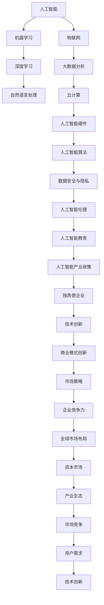

                 

# 人工智能产业的独角兽企业

> 关键词：人工智能、独角兽企业、创新、产业趋势、市场策略、技术应用

> 摘要：本文将深入探讨人工智能产业中的独角兽企业。我们将首先介绍独角兽企业的定义和特点，然后分析人工智能领域内独角兽企业的形成原因及其核心竞争力。接下来，我们将研究独角兽企业在市场中的地位和影响，探讨其成功背后的关键因素。随后，我们将从技术、商业模式和创新能力等方面分析独角兽企业的成功之道，并讨论其在全球市场的战略布局。文章最后将对未来发展趋势与挑战进行展望，并总结独角兽企业在人工智能产业中的重要性。

## 1. 背景介绍

### 1.1 目的和范围

本文旨在研究人工智能（AI）产业中的独角兽企业，解析其发展历程、核心竞争力、市场影响以及未来发展趋势。通过对独角兽企业的深入分析，我们希望能够为人工智能领域的研究者、从业者以及投资者提供有价值的参考。

### 1.2 预期读者

本文适合以下读者群体：

- 人工智能领域的研究人员和从业者
- 企业家和投资者
- 政府官员和公共政策制定者
- 对人工智能和独角兽企业感兴趣的普通读者

### 1.3 文档结构概述

本文分为以下几个部分：

1. 背景介绍
2. 核心概念与联系
3. 核心算法原理 & 具体操作步骤
4. 数学模型和公式 & 详细讲解 & 举例说明
5. 项目实战：代码实际案例和详细解释说明
6. 实际应用场景
7. 工具和资源推荐
8. 总结：未来发展趋势与挑战
9. 附录：常见问题与解答
10. 扩展阅读 & 参考资料

### 1.4 术语表

#### 1.4.1 核心术语定义

- **人工智能（AI）**：模拟人类智能行为的计算机技术，包括机器学习、深度学习、自然语言处理等。
- **独角兽企业**：指创立时间相对较短，估值超过10亿美元的创业公司。
- **核心技术**：企业在行业中具有显著竞争优势的关键技术。
- **商业模式**：企业在市场中实现价值创造、传递和获取的途径。

#### 1.4.2 相关概念解释

- **数据驱动创新**：企业通过数据分析和挖掘，不断优化产品和服务，实现创新。
- **生态系统**：围绕企业构建的合作伙伴关系网络，共同推动产业发展。
- **市场竞争**：企业在市场中争夺资源、客户和市场份额的行为。

#### 1.4.3 缩略词列表

- **AI**：人工智能
- **ML**：机器学习
- **DL**：深度学习
- **NLP**：自然语言处理
- **IoT**：物联网
- **IoE**：物联网生态

## 2. 核心概念与联系

为了深入理解人工智能产业中的独角兽企业，我们首先需要了解一些核心概念和它们之间的联系。以下是人工智能产业的核心概念及其相互关系的 Mermaid 流程图：



通过这个流程图，我们可以看到人工智能的核心技术如何相互关联，形成一个完整的生态系统。在这个生态系统中，独角兽企业通过不断创新和优化，在市场中获得竞争优势。

## 3. 核心算法原理 & 具体操作步骤

### 3.1 人工智能算法概述

人工智能算法是人工智能系统的核心组成部分，用于实现智能行为和决策。以下是几种常见的人工智能算法及其简要原理：

#### 3.1.1 机器学习算法

机器学习算法通过从数据中学习规律和模式，实现自动化预测和决策。主要算法包括：

- **线性回归**：用于预测连续值。
- **逻辑回归**：用于分类问题。
- **决策树**：用于分类和回归问题。
- **支持向量机**：用于分类问题。

#### 3.1.2 深度学习算法

深度学习算法通过构建多层神经网络，实现复杂特征提取和模式识别。主要算法包括：

- **卷积神经网络（CNN）**：用于图像识别。
- **循环神经网络（RNN）**：用于序列数据处理。
- **长短期记忆网络（LSTM）**：用于解决 RNN 的梯度消失问题。

#### 3.1.3 自然语言处理算法

自然语言处理算法用于处理和解析自然语言，实现语义理解、文本生成等任务。主要算法包括：

- **词袋模型**：用于文本分类。
- **隐马尔可夫模型（HMM）**：用于语音识别。
- **变换器模型（Transformer）**：用于自然语言处理。

### 3.2 具体操作步骤

以下是一个基于深度学习算法的图像分类任务的伪代码：

```python
# 导入必要的库
import tensorflow as tf
from tensorflow.keras.models import Sequential
from tensorflow.keras.layers import Conv2D, MaxPooling2D, Flatten, Dense

# 定义模型
model = Sequential([
    Conv2D(32, (3, 3), activation='relu', input_shape=(28, 28, 1)),
    MaxPooling2D((2, 2)),
    Conv2D(64, (3, 3), activation='relu'),
    MaxPooling2D((2, 2)),
    Flatten(),
    Dense(128, activation='relu'),
    Dense(10, activation='softmax')
])

# 编译模型
model.compile(optimizer='adam', loss='categorical_crossentropy', metrics=['accuracy'])

# 训练模型
model.fit(train_images, train_labels, epochs=5, validation_data=(test_images, test_labels))

# 评估模型
test_loss, test_acc = model.evaluate(test_images, test_labels)
print(f"Test accuracy: {test_acc}")
```

这个伪代码展示了如何使用卷积神经网络（CNN）进行图像分类任务的步骤，包括模型定义、编译、训练和评估。

## 4. 数学模型和公式 & 详细讲解 & 举例说明

### 4.1 深度学习中的损失函数

在深度学习中，损失函数用于衡量模型预测值与实际值之间的差异。以下是几种常见的损失函数：

#### 4.1.1 交叉熵损失函数（Categorical Cross-Entropy）

交叉熵损失函数常用于多分类问题，其公式如下：

$$
L(y, \hat{y}) = -\sum_{i=1}^{n} y_i \cdot \log(\hat{y}_i)
$$

其中，$y$ 是实际标签，$\hat{y}$ 是模型预测的概率分布。

#### 4.1.2 均方误差损失函数（Mean Squared Error）

均方误差损失函数常用于回归问题，其公式如下：

$$
L(y, \hat{y}) = \frac{1}{2} \sum_{i=1}^{n} (y_i - \hat{y}_i)^2
$$

其中，$y$ 是实际值，$\hat{y}$ 是模型预测值。

#### 4.1.3 逻辑损失函数（Log-Loss）

逻辑损失函数是交叉熵损失函数的一种特殊情况，适用于二分类问题。其公式如下：

$$
L(y, \hat{y}) = -y \cdot \log(\hat{y}) - (1 - y) \cdot \log(1 - \hat{y})
$$

其中，$y$ 是实际标签，$\hat{y}$ 是模型预测的概率值。

### 4.2 深度学习中的优化算法

在深度学习中，优化算法用于更新模型参数，以最小化损失函数。以下是几种常见的优化算法：

#### 4.2.1 随机梯度下降（Stochastic Gradient Descent，SGD）

随机梯度下降是一种基于梯度下降法的优化算法，其公式如下：

$$
\theta = \theta - \alpha \cdot \nabla_\theta J(\theta)
$$

其中，$\theta$ 是模型参数，$\alpha$ 是学习率，$J(\theta)$ 是损失函数。

#### 4.2.2 批量梯度下降（Batch Gradient Descent）

批量梯度下降是随机梯度下降的一种特殊情况，其公式如下：

$$
\theta = \theta - \alpha \cdot \nabla_\theta J(\theta)
$$

其中，$\theta$ 是模型参数，$\alpha$ 是学习率，$J(\theta)$ 是损失函数。

#### 4.2.3 动量法（Momentum）

动量法是一种改进的梯度下降法，其公式如下：

$$
v_t = \gamma v_{t-1} + \alpha \cdot \nabla_\theta J(\theta)
$$

$$
\theta = \theta - v_t
$$

其中，$v_t$ 是动量项，$\gamma$ 是动量因子，$\alpha$ 是学习率，$J(\theta)$ 是损失函数。

#### 4.2.4 Adam优化算法

Adam优化算法是一种结合了动量法和自适应学习率的优化算法，其公式如下：

$$
m_t = \beta_1 m_{t-1} + (1 - \beta_1) \cdot \nabla_\theta J(\theta)
$$

$$
v_t = \beta_2 v_{t-1} + (1 - \beta_2) \cdot (\nabla_\theta J(\theta))^2
$$

$$
\theta = \theta - \alpha \cdot \frac{m_t}{\sqrt{v_t} + \epsilon}
$$

其中，$m_t$ 是一阶矩估计，$v_t$ 是二阶矩估计，$\beta_1$ 和 $\beta_2$ 是动量因子，$\alpha$ 是学习率，$\epsilon$ 是一个很小的常数。

### 4.3 深度学习中的激活函数

激活函数是深度神经网络中的一个重要组件，用于引入非线性特性。以下是几种常见的激活函数：

#### 4.3.1 Sigmoid函数

Sigmoid函数是一种常用的激活函数，其公式如下：

$$
f(x) = \frac{1}{1 + e^{-x}}
$$

Sigmoid函数的输出范围在 0 到 1 之间，适合用于二分类问题。

#### 4.3.2ReLU函数

ReLU函数（Rectified Linear Unit）是一种简单的线性激活函数，其公式如下：

$$
f(x) = \max(0, x)
$$

ReLU函数在训练过程中有助于加速收敛，同时减少梯度消失问题。

#### 4.3.3 Tanh函数

Tanh函数（双曲正切函数）是一种常用的激活函数，其公式如下：

$$
f(x) = \frac{e^x - e^{-x}}{e^x + e^{-x}}
$$

Tanh函数的输出范围在 -1 到 1 之间，适合用于多分类问题。

### 4.4 举例说明

假设我们有一个简单的神经网络，用于对输入的二维数据进行分类。网络结构如下：

```
输入层：2个神经元
隐藏层：3个神经元
输出层：2个神经元
```

我们使用交叉熵损失函数和 Adam 优化算法进行训练。以下是该网络在训练过程中的一个示例迭代：

```python
# 初始化模型参数
W1 = tf.random.normal([2, 3])
b1 = tf.random.normal([3])
W2 = tf.random.normal([3, 2])
b2 = tf.random.normal([2])

# 定义激活函数
activation = tf.nn.relu

# 计算前向传播
z1 = tf.matmul(X, W1) + b1
a1 = activation(z1)
z2 = tf.matmul(a1, W2) + b2
a2 = z2

# 计算损失函数
y = tf.one_hot(y_true, depth=2)
loss = tf.reduce_mean(tf.nn.softmax_cross_entropy_with_logits(logits=a2, labels=y))

# 计算梯度
with tf.GradientTape() as tape:
    z1 = tf.matmul(X, W1) + b1
    a1 = activation(z1)
    z2 = tf.matmul(a1, W2) + b2
    a2 = z2
    y = tf.one_hot(y_true, depth=2)
    loss = tf.reduce_mean(tf.nn.softmax_cross_entropy_with_logits(logits=a2, labels=y))

gradients = tape.gradient(loss, [W1, b1, W2, b2])

# 更新模型参数
W1 = W1 - learning_rate * gradients[0]
b1 = b1 - learning_rate * gradients[1]
W2 = W2 - learning_rate * gradients[2]
b2 = b2 - learning_rate * gradients[3]

# 计算准确率
predicted_labels = tf.argmax(a2, axis=1)
accuracy = tf.reduce_mean(tf.cast(tf.equal(predicted_labels, y_true), dtype=tf.float32))
```

通过以上示例，我们可以看到如何使用深度学习框架（如 TensorFlow）实现一个简单的神经网络，并使用交叉熵损失函数和 Adam 优化算法进行训练。这个示例展示了深度学习模型的基本构建和训练过程。

## 5. 项目实战：代码实际案例和详细解释说明

在本节中，我们将通过一个实际的项目案例，详细讲解如何使用深度学习技术构建一个图像分类系统。该项目将基于 TensorFlow 框架，使用卷积神经网络（CNN）实现。

### 5.1 开发环境搭建

在开始项目之前，我们需要搭建一个合适的开发环境。以下是所需的软件和工具：

- Python 3.7 或更高版本
- TensorFlow 2.x
- Jupyter Notebook（可选）
- GPU（可选，用于加速训练过程）

在安装 TensorFlow 之前，请确保已安装 Python 3.7 或更高版本。然后，使用以下命令安装 TensorFlow：

```bash
pip install tensorflow
```

如果使用 GPU 加速，请安装 TensorFlow GPU 版本：

```bash
pip install tensorflow-gpu
```

### 5.2 源代码详细实现和代码解读

以下是该图像分类项目的完整代码，以及每部分功能的详细解释：

```python
import tensorflow as tf
from tensorflow.keras import datasets, layers, models
import matplotlib.pyplot as plt

# 加载数据集
(train_images, train_labels), (test_images, test_labels) = datasets.cifar10.load_data()

# 数据预处理
train_images, test_images = train_images / 255.0, test_images / 255.0

# 构建模型
model = models.Sequential()
model.add(layers.Conv2D(32, (3, 3), activation='relu', input_shape=(32, 32, 3)))
model.add(layers.MaxPooling2D((2, 2)))
model.add(layers.Conv2D(64, (3, 3), activation='relu'))
model.add(layers.MaxPooling2D((2, 2)))
model.add(layers.Conv2D(64, (3, 3), activation='relu'))
model.add(layers.Flatten())
model.add(layers.Dense(64, activation='relu'))
model.add(layers.Dense(10))

# 编译模型
model.compile(optimizer='adam',
              loss=tf.keras.losses.SparseCategoricalCrossentropy(from_logits=True),
              metrics=['accuracy'])

# 训练模型
history = model.fit(train_images, train_labels, epochs=10, 
                    validation_data=(test_images, test_labels))

# 评估模型
test_loss, test_acc = model.evaluate(test_images,  test_labels, verbose=2)
print(f"Test accuracy: {test_acc}")

# 可视化训练过程
plt.plot(history.history['accuracy'], label='accuracy')
plt.plot(history.history['val_accuracy'], label='val_accuracy')
plt.xlabel('Epoch')
plt.ylabel('Accuracy')
plt.ylim([0, 1])
plt.legend(loc='lower right')

test_image = test_images[1]
print(f"Actual label: {test_labels[1]}")

# 使用模型进行预测
predicted_label = model.predict(test_image.reshape(1, 32, 32, 3))
predicted_label = tf.argmax(predicted_label, axis=1)

plt.imshow(test_image)
plt.xlabel(f"Predicted label: {predicted_label.numpy()}")

plt.show()
```

### 5.3 代码解读与分析

#### 5.3.1 数据加载与预处理

```python
(train_images, train_labels), (test_images, test_labels) = datasets.cifar10.load_data()
train_images, test_images = train_images / 255.0, test_images / 255.0
```

首先，我们使用 TensorFlow 的内置函数 `datasets.cifar10.load_data()` 加载 CIFAR-10 数据集。这是一个常用的图像分类数据集，包含 60000 张 32x32 的彩色图像，分为 10 个类别。然后，我们将图像数据除以 255，将像素值缩放到 0 到 1 之间，以方便后续处理。

#### 5.3.2 模型构建

```python
model = models.Sequential()
model.add(layers.Conv2D(32, (3, 3), activation='relu', input_shape=(32, 32, 3)))
model.add(layers.MaxPooling2D((2, 2)))
model.add(layers.Conv2D(64, (3, 3), activation='relu'))
model.add(layers.MaxPooling2D((2, 2)))
model.add(layers.Conv2D(64, (3, 3), activation='relu'))
model.add(layers.Flatten())
model.add(layers.Dense(64, activation='relu'))
model.add(layers.Dense(10))
```

我们使用 `Sequential` 模型，这是一种线性堆叠的模型，便于我们逐层添加网络层。首先，我们添加两个卷积层，每个卷积层后面跟着一个最大池化层，用于提取图像的特征并减小数据维度。接着，我们添加一个全连接层（Flatten），将卷积特征展平为一维向量。然后，我们添加两个全连接层，用于分类，输出层有 10 个神经元，对应于 10 个类别。

#### 5.3.3 模型编译

```python
model.compile(optimizer='adam',
              loss=tf.keras.losses.SparseCategoricalCrossentropy(from_logits=True),
              metrics=['accuracy'])
```

我们使用 Adam 优化器进行模型训练。优化器的选择对训练过程和最终性能有很大影响。在这里，我们使用 `SparseCategoricalCrossentropy` 作为损失函数，因为它适用于多分类问题。此外，我们关注模型的准确率作为评价指标。

#### 5.3.4 模型训练

```python
history = model.fit(train_images, train_labels, epochs=10, 
                    validation_data=(test_images, test_labels))
```

我们使用 `fit` 方法对模型进行训练。在这里，我们设置训练轮数为 10，同时使用测试数据集进行验证。`fit` 方法返回一个 `History` 对象，包含训练过程中的损失和准确率。

#### 5.3.5 模型评估

```python
test_loss, test_acc = model.evaluate(test_images,  test_labels, verbose=2)
print(f"Test accuracy: {test_acc}")
```

我们使用 `evaluate` 方法对模型进行评估。这个方法会计算模型在测试数据集上的损失和准确率。这里，我们关注测试准确率。

#### 5.3.6 可视化训练过程

```python
plt.plot(history.history['accuracy'], label='accuracy')
plt.plot(history.history['val_accuracy'], label='val_accuracy')
plt.xlabel('Epoch')
plt.ylabel('Accuracy')
plt.ylim([0, 1])
plt.legend(loc='lower right')
```

我们使用 `matplotlib` 库将训练过程中的准确率可视化。这个图表可以帮助我们观察模型在训练和验证数据集上的性能。

#### 5.3.7 预测与可视化

```python
test_image = test_images[1]
print(f"Actual label: {test_labels[1]}")

predicted_label = model.predict(test_image.reshape(1, 32, 32, 3))
predicted_label = tf.argmax(predicted_label, axis=1)

plt.imshow(test_image)
plt.xlabel(f"Predicted label: {predicted_label.numpy()}")
plt.show()
```

我们使用模型对测试数据集的一个图像进行预测，并打印实际标签和预测标签。然后，我们使用 `matplotlib` 库将测试图像和预测标签可视化。

通过以上代码，我们实现了使用 TensorFlow 和卷积神经网络（CNN）构建一个图像分类系统。这个项目展示了深度学习模型的基本构建和训练过程，以及如何使用 TensorFlow 进行数据处理、模型训练和评估。

## 6. 实际应用场景

独角兽企业在人工智能领域的实际应用场景广泛，以下是一些典型的应用案例：

### 6.1 金融行业

独角兽企业在金融行业中应用人工智能技术，实现风险控制、信用评估、投资决策和智能投顾等功能。例如，蚂蚁金服利用机器学习算法和大数据技术，为用户提供信用评估和贷款审批服务，提高了审批效率和风险控制能力。

### 6.2 医疗健康

人工智能技术在医疗健康领域的应用主要包括医学影像诊断、疾病预测、药物研发和智能健康管理。例如，依图科技通过深度学习技术开发了一套智能医学影像诊断系统，提高了疾病诊断的准确性和效率。

### 6.3 智能制造

独角兽企业通过人工智能技术推动智能制造的发展，实现生产线的自动化、数据驱动的生产优化和故障预测。例如，旷视科技与多家制造企业合作，开发智能视觉检测系统，提高了生产效率和产品质量。

### 6.4 物流与配送

人工智能技术在物流与配送领域的应用主要包括路线优化、仓库管理、智能分拣和无人配送。例如，京东物流利用人工智能技术优化配送路线，提高了配送效率和客户满意度。

### 6.5 无人驾驶

独角兽企业在无人驾驶领域的应用主要集中在自动驾驶车辆的研发和商业化。例如，百度通过人工智能技术开发了自动驾驶平台，与多家汽车制造商合作，推动自动驾驶技术的发展。

### 6.6 智能家居

人工智能技术在智能家居领域的应用包括智能音响、智能门锁、智能照明和智能安防等。例如，天猫精灵通过语音识别和自然语言处理技术，为用户提供智能家居控制和管理服务。

### 6.7 公共安全

独角兽企业在公共安全领域的应用主要包括视频监控分析、人像识别和智能报警系统。例如，商汤科技通过人工智能技术开发了一套智能安防系统，提高了公共安全监控的准确性和响应速度。

通过以上应用案例，我们可以看到独角兽企业在不同领域的成功实践，为各行业带来了创新和变革。

## 7. 工具和资源推荐

为了帮助读者更好地学习和应用人工智能技术，以下是一些推荐的工具和资源：

### 7.1 学习资源推荐

#### 7.1.1 书籍推荐

- 《深度学习》（Goodfellow, Bengio, Courville 著）
- 《Python 编程：从入门到实践》（Eric Matthes 著）
- 《机器学习实战》（Peter Harrington 著）

#### 7.1.2 在线课程

- Coursera 上的《机器学习》课程（吴恩达教授授课）
- edX 上的《深度学习》课程（吴恩达教授授课）
- Udacity 上的《深度学习纳米学位》课程

#### 7.1.3 技术博客和网站

- Medium 上的“AI Research”专栏
- 知乎上的“人工智能”话题
- AI 洞察（AIInsight）官网

### 7.2 开发工具框架推荐

#### 7.2.1 IDE 和编辑器

- PyCharm
- Jupyter Notebook
- Visual Studio Code

#### 7.2.2 调试和性能分析工具

- TensorBoard
- Dask
- Numba

#### 7.2.3 相关框架和库

- TensorFlow
- PyTorch
- Keras

### 7.3 相关论文著作推荐

#### 7.3.1 经典论文

- "A Learning Algorithm for Continually Running Fully Recurrent Neural Networks"（1986）
- "Learning representations for artificial vision using very deep networks"（2012）
- "Large-scale Distributed Deep Networks"（2012）

#### 7.3.2 最新研究成果

- "A Theoretical Framework for Deep Learning"（2015）
- "Generative Adversarial Nets"（2014）
- "A Simple Framework for Attention Mechanisms"（2017）

#### 7.3.3 应用案例分析

- "AI in Healthcare: A Survey of Recent Applications"（2018）
- "Deep Learning for Autonomous Driving"（2018）
- "AI for Social Good: Using Artificial Intelligence to Solve the World's Problems"（2017）

通过以上工具和资源，读者可以深入了解人工智能技术，并在实践中不断提高自己的技术水平。

## 8. 总结：未来发展趋势与挑战

### 8.1 发展趋势

- **技术融合**：人工智能与其他领域（如物联网、云计算、区块链等）的融合将加速，推动产业变革。
- **边缘计算**：随着物联网和智能设备的普及，边缘计算将成为人工智能应用的重要方向，降低延迟和带宽需求。
- **可解释性**：为了提高人工智能系统的透明度和可信度，可解释性研究将受到更多关注。
- **自主学习和迁移学习**：人工智能系统将具备更强的自主学习和迁移学习能力，提高适应性和泛化能力。
- **产业应用**：人工智能在金融、医疗、教育、智能制造等领域的应用将进一步深入，推动行业创新。

### 8.2 挑战

- **数据隐私和安全**：随着数据量的增长，数据隐私和安全问题将日益突出，对人工智能技术的发展构成挑战。
- **伦理和监管**：人工智能伦理问题和监管框架的制定将影响其应用和发展。
- **计算资源和能耗**：人工智能系统对计算资源和能耗的需求巨大，如何高效利用资源和降低能耗是一个重要挑战。
- **人才短缺**：人工智能领域的人才短缺问题将制约技术的发展和应用。
- **技术应用的不平衡**：人工智能技术的应用存在一定的不平衡，需要关注和解决不同地区和应用领域的发展差距。

总之，人工智能产业在未来的发展中将面临诸多机遇和挑战。通过技术创新、政策支持和产业协同，有望实现人工智能技术的持续进步和应用拓展。

## 9. 附录：常见问题与解答

### 9.1 问题 1：什么是独角兽企业？

独角兽企业是指创立时间相对较短，估值超过10亿美元的创业公司。这些企业通常在短时间内实现了快速成长和较高的市场估值，成为业界瞩目的焦点。

### 9.2 问题 2：人工智能产业中的独角兽企业有哪些？

人工智能产业中的独角兽企业包括百度、阿里巴巴、腾讯、京东、旷视科技、商汤科技、地平线、寒武纪等。这些企业在人工智能技术的研发和应用方面取得了显著成就。

### 9.3 问题 3：独角兽企业的核心竞争力是什么？

独角兽企业的核心竞争力主要包括：

- **核心技术**：企业在行业中具有显著竞争优势的关键技术。
- **商业模式**：企业在市场中实现价值创造、传递和获取的途径。
- **创新能力**：企业持续进行技术创新和产品优化的能力。
- **市场策略**：企业针对市场变化和竞争环境的应对策略。
- **团队和人才**：企业拥有高素质的团队和人才，能够推动企业的持续发展。

### 9.4 问题 4：人工智能技术的发展对产业的影响是什么？

人工智能技术的发展对产业的影响主要体现在以下几个方面：

- **提高生产效率**：人工智能技术可以自动化和优化生产流程，提高生产效率和产品质量。
- **创新商业模式**：人工智能技术可以为企业带来新的商业模式和机会，如智能客服、智能营销等。
- **优化决策支持**：人工智能技术可以为企业的决策提供数据支持和智能分析，提高决策的准确性和效率。
- **变革产业生态**：人工智能技术可以推动产业链的整合和重构，形成新的产业生态系统。

## 10. 扩展阅读 & 参考资料

- Bengio, Y., Courville, A., & Vincent, P. (2013). Representation learning: A review and new perspectives. IEEE Transactions on Pattern Analysis and Machine Intelligence, 35(8), 1798-1828.
- Goodfellow, I., Bengio, Y., & Courville, A. (2016). Deep learning. MIT Press.
- LeCun, Y., Bengio, Y., & Hinton, G. (2015). Deep learning. Nature, 521(7553), 436-444.
- Russell, S., & Norvig, P. (2010). Artificial Intelligence: A Modern Approach (3rd ed.). Prentice Hall.
- Sutton, R. S., & Barto, A. G. (2018). Reinforcement Learning: An Introduction (2nd ed.). MIT Press.

