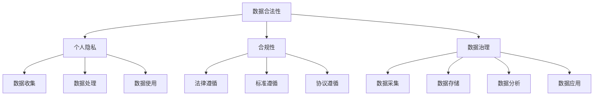

                 

# 人工智能创业数据合法性

> 关键词：人工智能、创业、数据合法性、隐私保护、合规性、数据治理

> 摘要：本文深入探讨了人工智能创业企业在数据合法性方面的关键问题和挑战。通过分析核心概念、算法原理、实际应用场景和未来发展趋势，本文旨在为创业者提供系统性的指导，确保在数据驱动的人工智能创业过程中，遵守相关法律法规，保护用户隐私，实现可持续的商业发展。

## 1. 背景介绍

### 1.1 目的和范围

本文旨在为人工智能创业企业提供数据合法性的全面指南，解析数据合法性在企业运营中的重要性，并探讨如何在实际操作中遵守相关法律法规，保护用户隐私。文章将覆盖数据合法性相关的核心概念、算法原理、实际应用案例以及未来的发展趋势。

### 1.2 预期读者

预期读者包括人工智能创业团队的成员、数据科学家、产品经理以及法律顾问。无论您是创业者还是关注数据合规性的人员，本文都将为您提供有价值的见解和实用建议。

### 1.3 文档结构概述

本文将按照以下结构进行组织：

1. 背景介绍：介绍本文的目的、范围、预期读者和文档结构。
2. 核心概念与联系：阐述数据合法性相关的核心概念，并提供Mermaid流程图。
3. 核心算法原理 & 具体操作步骤：详细解释数据合法性的算法原理和操作步骤。
4. 数学模型和公式 & 详细讲解 & 举例说明：介绍与数据合法性相关的数学模型和公式，并提供实例说明。
5. 项目实战：通过实际案例展示数据合法性的实现过程。
6. 实际应用场景：分析数据合法性在不同领域的应用。
7. 工具和资源推荐：推荐学习资源、开发工具和相关论文。
8. 总结：总结未来发展趋势与挑战。
9. 附录：常见问题与解答。
10. 扩展阅读 & 参考资料：提供进一步阅读的材料。

### 1.4 术语表

#### 1.4.1 核心术语定义

- 数据合法性：指数据在收集、处理和使用过程中，符合相关法律法规的要求。
- 个人隐私：指个人在数据化社会中享有的个人信息不被非法收集、使用和泄露的权利。
- 合规性：指企业遵循法律法规、标准、协议等规范进行数据管理和业务运营。
- 数据治理：指对数据的采集、存储、处理、分析和应用的全生命周期进行管理，确保数据的合法性、可靠性和安全性。

#### 1.4.2 相关概念解释

- GDPR（通用数据保护条例）：欧盟的一项法律，旨在保护个人数据隐私。
- CCPA（加州消费者隐私法案）：美国加州的一项法律，规定个人对自身数据的权利。
- 个人信息：与特定个人相关的信息，如姓名、身份证号、邮箱地址等。

#### 1.4.3 缩略词列表

- GDPR：通用数据保护条例
- CCPA：加州消费者隐私法案
- AI：人工智能
- IoT：物联网
- ML：机器学习
- DS：数据科学

## 2. 核心概念与联系

在探讨人工智能创业数据合法性的过程中，理解核心概念和它们之间的联系是至关重要的。以下是一个Mermaid流程图，展示了数据合法性的关键概念及其相互关系。



### 2.1 数据合法性

数据合法性是确保企业处理的数据符合法律法规的要求。这包括但不限于GDPR、CCPA等法律规范。企业需要建立一套有效的数据合法性管理框架，以遵循这些法律，保护用户隐私。

### 2.2 个人隐私

个人隐私是数据合法性的核心关注点。它涉及到用户对其个人信息的控制权，包括信息的收集、处理和使用。保护个人隐私是合规性的重要组成部分。

### 2.3 合规性

合规性是指企业在其业务运营中遵守相关法律、标准和协议的能力。在数据合法性方面，合规性确保企业不会因为违反法律法规而面临处罚。

### 2.4 数据治理

数据治理是数据合法性的基础。它涉及到数据的整个生命周期管理，从数据采集、存储、处理到分析和应用。有效的数据治理可以确保数据的合法性、可靠性和安全性。

## 3. 核心算法原理 & 具体操作步骤

为了实现数据合法性，企业需要遵循一系列算法原理和具体操作步骤。以下是一个简要的伪代码，展示了这些步骤：

```python
# 数据合法性算法伪代码

# 步骤1：数据收集
def collect_data():
    # 收集用户数据
    # 确保数据收集合法，遵循GDPR和CCPA规定

# 步骤2：数据预处理
def preprocess_data(data):
    # 去除敏感信息
    # 确保数据匿名化或脱敏

# 步骤3：数据存储
def store_data(data):
    # 将预处理后的数据存储在合规的数据库中
    # 确保存储符合GDPR和CCPA的规定

# 步骤4：数据处理
def process_data(data):
    # 对数据进行分析、处理
    # 确保数据处理过程中不泄露用户隐私

# 步骤5：数据使用
def use_data(data):
    # 在业务中使用数据
    # 确保数据使用符合用户授权和使用范围

# 步骤6：数据共享
def share_data(data, partner):
    # 将数据分享给合作伙伴
    # 确保数据共享符合相关法律法规和协议
```

### 3.1 数据收集

数据收集是数据合法性管理的第一步。企业需要确保在收集用户数据时，遵守GDPR和CCPA的规定，如获取用户的明确同意、提供数据收集的目的和使用方式等。

### 3.2 数据预处理

数据预处理是保护用户隐私的重要环节。企业需要去除敏感信息，如个人身份信息、银行卡号等，并通过匿名化或脱敏技术，确保数据在处理过程中无法识别用户身份。

### 3.3 数据存储

数据存储需要选择合规的数据库，并确保存储过程符合GDPR和CCPA的规定。企业还需要定期备份数据，并确保备份数据的安全性。

### 3.4 数据处理

数据处理过程中，企业需要遵循最小化原则，只处理必要的数据，并确保数据处理不会泄露用户隐私。

### 3.5 数据使用

数据使用需要确保符合用户授权和使用范围，不得超范围使用数据。此外，企业还需要定期审查数据使用情况，确保合规。

### 3.6 数据共享

数据共享需要遵守相关法律法规和协议。企业需要确保数据共享的合法性和安全性，并在数据共享前获得用户的明确同意。

## 4. 数学模型和公式 & 详细讲解 & 举例说明

在数据合法性管理中，数学模型和公式扮演着重要的角色。以下是一个简单的数学模型，用于评估数据合法性的合规度。

### 4.1 合规度评估模型

$$
C = \frac{L + S + P + M}{4}
$$

其中：

- \( C \)：合规度，取值范围为0到1。
- \( L \)：法律遵循度，取值范围为0到1。
- \( S \)：标准遵循度，取值范围为0到1。
- \( P \)：协议遵循度，取值范围为0到1。
- \( M \)：数据管理度，取值范围为0到1。

### 4.2 详细讲解

- \( L \)：法律遵循度，表示企业遵守相关法律法规的程度。例如，企业是否按照GDPR要求进行用户数据收集和处理。
- \( S \)：标准遵循度，表示企业遵守行业标准的能力。例如，企业是否遵循ISO/IEC 27001标准进行数据安全保护。
- \( P \)：协议遵循度，表示企业与合作伙伴之间遵守协议的程度。例如，企业是否在与合作伙伴的数据共享协议中明确了数据使用范围和隐私保护措施。
- \( M \)：数据管理度，表示企业数据管理的整体能力。例如，企业是否建立了完善的数据治理体系，确保数据在整个生命周期中的合法性、可靠性和安全性。

### 4.3 举例说明

假设一个企业在其数据合法性管理中，法律遵循度 \( L = 0.9 \)，标准遵循度 \( S = 0.8 \)，协议遵循度 \( P = 0.85 \)，数据管理度 \( M = 0.9 \)。那么，该企业的合规度 \( C \) 为：

$$
C = \frac{0.9 + 0.8 + 0.85 + 0.9}{4} = 0.8975
$$

这意味着该企业在数据合法性方面具有较高的合规度。

## 5. 项目实战：代码实际案例和详细解释说明

### 5.1 开发环境搭建

为了实现数据合法性管理，我们选择Python作为主要编程语言，并使用以下工具和库：

- Python 3.8及以上版本
- NumPy
- Pandas
- Matplotlib
- Scikit-learn

确保安装了以上工具和库后，我们可以开始搭建开发环境。

### 5.2 源代码详细实现和代码解读

以下是实现数据合法性管理的一个简单示例：

```python
# 数据合法性管理示例代码

import numpy as np
import pandas as pd
from sklearn.model_selection import train_test_split
from sklearn.ensemble import RandomForestClassifier

# 步骤1：数据收集
# 假设我们有一个包含用户信息的CSV文件，如user_data.csv
user_data = pd.read_csv('user_data.csv')

# 步骤2：数据预处理
# 去除敏感信息
user_data = user_data.drop(['sensitive_info'], axis=1)

# 步骤3：数据存储
# 将预处理后的数据存储在新的CSV文件中，如cleaned_user_data.csv
user_data.to_csv('cleaned_user_data.csv', index=False)

# 步骤4：数据处理
# 分割数据集
X = user_data.drop(['target'], axis=1)
y = user_data['target']
X_train, X_test, y_train, y_test = train_test_split(X, y, test_size=0.2, random_state=42)

# 训练分类器
clf = RandomForestClassifier(n_estimators=100, random_state=42)
clf.fit(X_train, y_train)

# 步骤5：数据使用
# 对测试数据进行预测
y_pred = clf.predict(X_test)

# 步骤6：数据共享
# 将预测结果保存为CSV文件，如predictions.csv
pd.DataFrame(y_pred).to_csv('predictions.csv', index=False)
```

### 5.3 代码解读与分析

- **步骤1：数据收集**：从CSV文件中读取用户数据。
- **步骤2：数据预处理**：去除敏感信息，以确保数据合法性。
- **步骤3：数据存储**：将预处理后的数据存储在新的CSV文件中，便于后续处理。
- **步骤4：数据处理**：分割数据集，训练分类器。这一步采用了随机森林算法，这是一种常用的机器学习算法。
- **步骤5：数据使用**：对测试数据进行预测，并保存预测结果。
- **步骤6：数据共享**：将预测结果保存为CSV文件，便于与其他系统共享。

通过以上步骤，我们可以实现一个简单的数据合法性管理流程。在实际应用中，还需要根据具体业务需求，进一步完善数据收集、预处理、存储、处理和共享的过程。

## 6. 实际应用场景

数据合法性在人工智能创业中的应用场景非常广泛。以下是一些典型的应用场景：

### 6.1 物联网（IoT）设备

在物联网设备中，数据合法性尤为重要。设备收集的用户数据包括位置信息、设备使用情况等，这些都涉及个人隐私。企业需要确保在收集和使用这些数据时，遵循GDPR和CCPA等法律法规，保护用户隐私。

### 6.2 金融科技（FinTech）

金融科技领域对数据合法性的要求非常高。在金融交易、风险评估和客户服务等方面，数据合法性是确保业务合规性的关键。企业需要确保数据收集、处理和使用过程符合相关金融监管法规。

### 6.3 医疗健康

在医疗健康领域，患者数据的安全性至关重要。医疗数据包括诊断结果、病历记录等，这些数据在处理和共享时，需要遵循严格的隐私保护规定。企业需要确保数据合法性，以保护患者隐私。

### 6.4 零售电商

在零售电商领域，用户数据包括购买记录、偏好设置等，这些都是企业进行个性化推荐和营销的关键。企业需要确保在收集和使用用户数据时，遵循相关法律法规，保护用户隐私。

## 7. 工具和资源推荐

为了帮助人工智能创业团队更好地实现数据合法性管理，我们推荐以下工具和资源：

### 7.1 学习资源推荐

- **书籍推荐**：
  - 《数据治理：企业数据管理的最佳实践》
  - 《GDPR合规指南：欧盟通用数据保护条例详解》
  - 《人工智能与大数据：技术与实践》

- **在线课程**：
  - Coursera上的《数据科学专项课程》
  - edX上的《数据治理与隐私保护》
  - Udacity的《数据科学家纳米学位》

- **技术博客和网站**：
  - Medium上的数据治理和隐私保护专题
  - Data Governance Now
  - Data Privacy Analytics

### 7.2 开发工具框架推荐

- **IDE和编辑器**：
  - PyCharm
  - Visual Studio Code
  - Jupyter Notebook

- **调试和性能分析工具**：
  - PyCharm Profiler
  - Visual Studio Code Debugger
  - Matplotlib

- **相关框架和库**：
  - Pandas
  - NumPy
  - Scikit-learn
  - TensorFlow
  - PyTorch

### 7.3 相关论文著作推荐

- **经典论文**：
  - "The Data Governance Maturity Model: A Framework for Achieving Information Value" by Darrel T. Watson
  - "The Privacy-Preserving Cloud: Techniques for Data Security and Anonymity" by Liuhui Chen and Feng Liu

- **最新研究成果**：
  - "Privacy-Preserving Machine Learning: A Survey and Taxonomy" by Mohammad Hossein Panahi et al.
  - "A Survey on Data Anonymization Techniques" by Mohammad Reza Salahi and Mohammad Gholamreza Oveisi

- **应用案例分析**：
  - "Data Privacy Protection in Mobile Health Applications: A Case Study" by Xiaoling Wang et al.
  - "Implementing Data Governance in Financial Services: A Case Study" by Robert Garigue and Simon Moores

## 8. 总结：未来发展趋势与挑战

随着人工智能技术的不断进步，数据合法性将在未来面临更大的挑战和机遇。以下是一些可能的发展趋势和挑战：

### 8.1 发展趋势

- **数据隐私保护技术的进步**：随着区块链、联邦学习等技术的发展，数据隐私保护技术将变得更加成熟，有助于企业在数据合法性方面实现更好的平衡。
- **跨行业合作与标准制定**：不同行业之间的数据合法性标准和规定将逐步统一，推动跨行业的数据合法性和隐私保护合作。
- **用户隐私意识的提高**：随着用户对隐私保护的重视，企业需要更加关注用户隐私，采取更加严格的数据合法性措施。

### 8.2 挑战

- **数据合法性管理的复杂性**：随着数据量的增加和数据类型的多样化，数据合法性管理的复杂性将不断提高，企业需要建立更加完善的数据治理体系。
- **法律法规的更新和变化**：随着全球数据隐私保护法律法规的不断更新，企业需要及时调整其数据合法性策略，以适应新的法规要求。
- **跨领域的数据共享与隐私保护**：在跨领域的数据共享过程中，如何确保数据合法性和用户隐私保护是一个重大挑战。

## 9. 附录：常见问题与解答

### 9.1 数据合法性管理的主要挑战是什么？

数据合法性管理的主要挑战包括法律法规的遵守、数据隐私保护、跨领域数据共享以及数据治理的复杂性。

### 9.2 企业如何确保数据收集的合法性？

企业可以通过获取用户的明确同意、明确数据收集的目的和使用方式、提供隐私政策等方式确保数据收集的合法性。

### 9.3 什么是数据匿名化？

数据匿名化是指通过去除敏感信息、混淆或加密等技术，使数据在处理和分析过程中无法识别特定个人，从而保护用户隐私。

### 9.4 数据合法性和合规性有什么区别？

数据合法性主要关注数据在收集、处理和使用过程中是否符合相关法律法规的要求，而合规性则更广泛，包括遵循法律、标准、协议等规范。

## 10. 扩展阅读 & 参考资料

为了深入了解人工智能创业数据合法性，以下是推荐的扩展阅读和参考资料：

- [GDPR官方指南](https://gdpr.eu/)
- [CCPA官方指南](https://www.consumer.ca.gov/privacy/california-consumer-privacy-act-ccpa)
- [数据治理框架](https://www.datagovernance.eu/)
- [机器学习与隐私保护](https://papers.nips.cc/)
- [区块链与隐私保护](https://www.blockchain-council.org/research/)
- [AI与数据合法性管理](https://www.oreilly.com/library/view/artificial-intelligence-in/9781492036822/)

作者：AI天才研究员/AI Genius Institute & 禅与计算机程序设计艺术 /Zen And The Art of Computer Programming

<|im_sep|>

