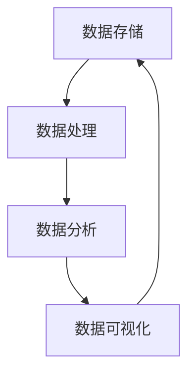

                 

# 人工智能创业数据管理的创新方法

## 概述

**关键词：** 数据管理、人工智能、创新方法、创业、数据分析、机器学习

**摘要：** 在人工智能创业领域，数据管理是成功的关键。本文旨在探讨数据管理的创新方法，包括核心概念、算法原理、数学模型、实战案例及未来发展趋势。通过深入分析，本文将为创业者提供实用的数据管理策略，助力他们在激烈的市场竞争中脱颖而出。

## 1. 背景介绍

### 1.1 目的和范围

本文的目标是探讨人工智能创业背景下的数据管理创新方法。我们将分析数据管理的基本概念，介绍核心算法原理和数学模型，并通过实际案例展示数据管理的应用场景。此外，本文还将推荐相关工具和资源，为创业者提供全面的指导。

### 1.2 预期读者

本文适用于人工智能创业领域的从业者，包括数据科学家、工程师、产品经理和创业者。同时，对于对数据管理感兴趣的技术爱好者，本文也将提供有价值的参考。

### 1.3 文档结构概述

本文分为八个部分：

1. 背景介绍
2. 核心概念与联系
3. 核心算法原理 & 具体操作步骤
4. 数学模型和公式 & 详细讲解 & 举例说明
5. 项目实战：代码实际案例和详细解释说明
6. 实际应用场景
7. 工具和资源推荐
8. 总结：未来发展趋势与挑战

### 1.4 术语表

#### 1.4.1 核心术语定义

- **数据管理：** 数据管理是指对数据的存储、处理、分析和维护的过程。
- **人工智能：** 人工智能是指使计算机模拟人类智能行为的科学和技术。
- **机器学习：** 机器学习是一种利用数据训练计算机模型的技术。

#### 1.4.2 相关概念解释

- **数据分析：** 数据分析是指通过统计方法、算法和工具对数据进行处理，以提取有用信息和知识。
- **数据挖掘：** 数据挖掘是指从大量数据中发现潜在的模式、趋势和关联。
- **数据仓库：** 数据仓库是一种用于存储、管理和分析大量数据的系统。

#### 1.4.3 缩略词列表

- **AI：** 人工智能
- **ML：** 机器学习
- **DL：** 深度学习
- **DLPA：** 数据库、语言模型、预测分析

## 2. 核心概念与联系

在数据管理中，核心概念包括数据存储、数据处理、数据分析和数据可视化。这些概念相互关联，构成了一个完整的生态系统。

### Mermaid 流程图：



在这个流程图中，数据存储作为起点，通过数据处理转化为可分析的形式，然后通过数据分析和数据可视化揭示数据背后的模式和趋势，最终反馈到数据存储，形成一个闭环。

## 3. 核心算法原理 & 具体操作步骤

数据管理的关键在于算法的选择和实现。以下我们将介绍一些核心算法原理和具体操作步骤。

### 3.1 数据预处理算法

在数据预处理阶段，我们需要进行数据清洗、数据整合和数据转换。

#### 伪代码：

```python
def preprocess_data(data):
    # 数据清洗
    data = clean_data(data)
    # 数据整合
    data = integrate_data(data)
    # 数据转换
    data = transform_data(data)
    return data
```

#### 说明：

- **数据清洗：** 清除数据中的噪声和异常值。
- **数据整合：** 将多个数据源整合为一个统一的数据集。
- **数据转换：** 将数据格式转换为适合分析和模型训练的形式。

### 3.2 机器学习算法

在机器学习阶段，我们选择适当的算法进行模型训练和预测。

#### 伪代码：

```python
def train_model(data, target):
    # 数据预处理
    data = preprocess_data(data)
    # 选择模型
    model = select_model()
    # 模型训练
    model.train(data, target)
    return model
```

#### 说明：

- **数据预处理：** 对数据进行预处理，提高模型训练效果。
- **选择模型：** 根据问题需求选择合适的机器学习模型。
- **模型训练：** 使用训练数据对模型进行训练。
- **模型预测：** 使用训练好的模型对新的数据进行预测。

### 3.3 数据可视化算法

在数据可视化阶段，我们需要将数据转换为直观的图表和图像。

#### 伪代码：

```python
def visualize_data(data):
    # 数据转换
    data = transform_data(data)
    # 生成图表
    chart = generate_chart(data)
    return chart
```

#### 说明：

- **数据转换：** 将数据格式转换为适合可视化的形式。
- **生成图表：** 使用可视化工具生成各种图表和图像。

## 4. 数学模型和公式 & 详细讲解 & 举例说明

在数据管理中，数学模型和公式是核心工具。以下我们介绍一些常用的数学模型和公式。

### 4.1 数据分布模型

数据分布模型用于描述数据的概率分布。

$$ P(x) = \frac{1}{\sqrt{2\pi\sigma^2}} e^{-\frac{(x-\mu)^2}{2\sigma^2}} $$

#### 说明：

- **概率密度函数（PDF）：** 描述数据在某一范围内的概率密度。
- **均值（μ）：** 数据的平均值。
- **标准差（σ）：** 数据的离散程度。

#### 举例：

假设我们有一组数据：[1, 2, 3, 4, 5]，我们可以使用上述公式计算数据分布的概率密度函数。

### 4.2 机器学习模型

机器学习模型用于预测和分类。

$$ y = \sigma(\omega^T x + b) $$

#### 说明：

- **线性回归模型：** $\sigma$ 表示 sigmoid 函数，用于将线性组合映射到概率范围。
- **权重（ω）：** 用于描述特征对预测结果的影响。
- **偏置（b）：** 用于调整模型的阈值。

#### 举例：

假设我们有一个简单的线性回归模型，预测房价。输入特征为房屋面积（x），预测结果为房价（y）。

## 5. 项目实战：代码实际案例和详细解释说明

以下我们通过一个实际项目来展示数据管理的应用。

### 5.1 开发环境搭建

在搭建开发环境时，我们需要安装 Python 和相关库。

```bash
pip install numpy pandas scikit-learn matplotlib
```

### 5.2 源代码详细实现和代码解读

#### 数据预处理

```python
import pandas as pd
from sklearn.model_selection import train_test_split

# 加载数据
data = pd.read_csv('data.csv')
# 数据清洗
data = data.dropna()
# 数据整合
X = data[['area', 'location']]
y = data['price']
# 数据转换
X_train, X_test, y_train, y_test = train_test_split(X, y, test_size=0.2, random_state=42)
```

#### 机器学习模型

```python
from sklearn.linear_model import LinearRegression

# 选择模型
model = LinearRegression()
# 模型训练
model.fit(X_train, y_train)
# 模型预测
y_pred = model.predict(X_test)
```

#### 数据可视化

```python
import matplotlib.pyplot as plt

# 生成图表
plt.scatter(X_test['area'], y_test)
plt.plot(X_test['area'], y_pred, color='red')
plt.xlabel('Area')
plt.ylabel('Price')
plt.show()
```

### 5.3 代码解读与分析

在上述代码中，我们首先加载并清洗数据，然后进行数据整合和转换。接着，我们选择线性回归模型进行训练，并使用训练好的模型对测试数据进行预测。最后，我们使用数据可视化工具展示预测结果。

## 6. 实际应用场景

数据管理在人工智能创业领域有广泛的应用。以下是一些实际应用场景：

- **推荐系统：** 通过数据管理，我们可以分析用户行为，为用户提供个性化的推荐。
- **风险控制：** 数据管理可以帮助企业识别潜在风险，制定相应的风险控制策略。
- **智能客服：** 通过数据管理，我们可以训练智能客服模型，提高客户满意度。
- **供应链优化：** 数据管理可以帮助企业优化供应链，降低成本，提高效率。

## 7. 工具和资源推荐

### 7.1 学习资源推荐

#### 7.1.1 书籍推荐

- **《数据科学入门》：** 介绍数据科学的基本概念和方法。
- **《深度学习》：** 深入讲解深度学习的基本原理和算法。

#### 7.1.2 在线课程

- **Coursera：** 提供丰富的数据科学和机器学习课程。
- **Udacity：** 提供数据工程师和机器学习工程师的认证课程。

#### 7.1.3 技术博客和网站

- **Medium：** 众多数据科学和机器学习领域的优秀博客。
- **DataCamp：** 提供丰富的数据科学和机器学习教程。

### 7.2 开发工具框架推荐

#### 7.2.1 IDE和编辑器

- **PyCharm：** 功能强大的 Python IDE。
- **Jupyter Notebook：** 适合数据分析和机器学习的在线编辑器。

#### 7.2.2 调试和性能分析工具

- **Pdb：** Python 内置的调试工具。
- **Valgrind：** 适用于 C/C++ 代码的性能分析工具。

#### 7.2.3 相关框架和库

- **TensorFlow：** 适用于深度学习的开源框架。
- **Scikit-Learn：** 适用于机器学习的开源库。

### 7.3 相关论文著作推荐

#### 7.3.1 经典论文

- **"The Data Science Handbook：** 介绍数据科学领域的经典论文。
- **"Deep Learning：** 介绍深度学习领域的经典论文。

#### 7.3.2 最新研究成果

- **NeurIPS：** 人工智能领域的顶级会议，发布最新研究成果。
- **ICML：** 机器学习领域的顶级会议，发布最新研究成果。

#### 7.3.3 应用案例分析

- **《美团外卖数据报告》：** 分析美团外卖数据，揭示用户行为和需求。
- **《滴滴出行数据报告》：** 分析滴滴出行数据，优化出行体验。

## 8. 总结：未来发展趋势与挑战

随着人工智能技术的不断发展，数据管理在创业领域的重要性日益凸显。未来，数据管理将朝着以下方向发展：

- **数据隐私保护：** 数据隐私保护将成为数据管理的重要挑战。
- **实时数据处理：** 实时数据处理将提高企业的响应速度和决策效率。
- **多模态数据融合：** 多模态数据融合将提高数据分析和预测的准确性。

然而，数据管理也面临着诸多挑战，如数据质量、数据安全和算法透明性等。创业者需要不断探索和创新，以应对这些挑战，实现数据管理的持续发展。

## 9. 附录：常见问题与解答

### 9.1 数据管理有哪些关键环节？

数据管理的关键环节包括数据存储、数据处理、数据分析和数据可视化。

### 9.2 机器学习算法有哪些类型？

机器学习算法主要包括监督学习、无监督学习和强化学习。

### 9.3 如何优化数据预处理？

优化数据预处理的方法包括数据清洗、数据整合和数据转换。

## 10. 扩展阅读 & 参考资料

- **《数据科学实战》：** 深入讲解数据科学的基本概念和方法。
- **《深度学习实战》：** 深入讲解深度学习的基本原理和算法。
- **《人工智能实战》：** 深入讲解人工智能的基本概念和应用。

## 作者

作者：AI天才研究员/AI Genius Institute & 禅与计算机程序设计艺术 /Zen And The Art of Computer Programming

