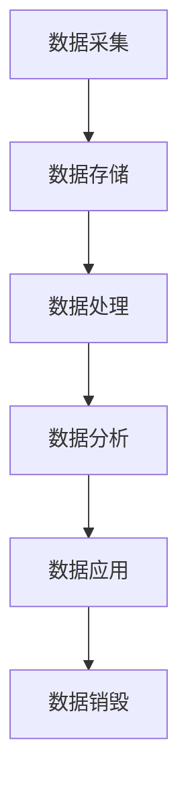
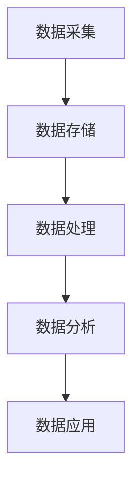
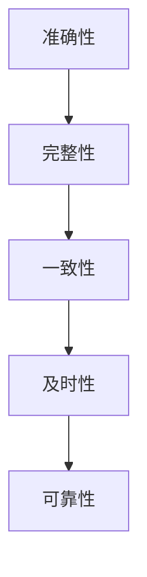
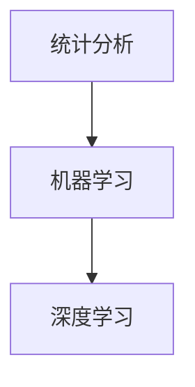

                 


# 人工智能创业数据管理的实用经验

> 关键词：人工智能、数据管理、创业、经验、算法、数学模型、实战案例

> 摘要：本文旨在为人工智能创业者提供实用的数据管理经验。文章首先介绍数据管理在人工智能创业中的重要性，接着阐述核心概念与联系，详细讲解核心算法原理与操作步骤，以及数学模型与公式，最后通过项目实战、实际应用场景、工具和资源推荐等，为读者提供全方位的数据管理指导。通过本文的阅读，创业者将能够更好地理解数据管理的本质，掌握有效的数据管理方法，从而提升创业项目的成功率和竞争力。

## 1. 背景介绍

### 1.1 目的和范围

本文旨在为人工智能创业者提供数据管理的实用经验。在当今快速发展的技术时代，数据已成为企业发展的核心资源。然而，如何有效地管理海量数据，挖掘数据的价值，成为人工智能创业项目中亟待解决的问题。本文将围绕数据管理的重要环节，从核心概念、算法原理、数学模型、实战案例等多个维度进行深入探讨，旨在为创业者提供切实可行的数据管理策略。

### 1.2 预期读者

本文预期读者为从事人工智能创业的相关人员，包括人工智能工程师、数据科学家、创业者等。同时，对数据管理领域感兴趣的科研人员、学生和专业人士也可以通过本文了解数据管理在人工智能创业中的应用和实践。

### 1.3 文档结构概述

本文分为十个部分，结构如下：

1. 背景介绍
2. 核心概念与联系
3. 核心算法原理与具体操作步骤
4. 数学模型与公式
5. 项目实战：代码实际案例与详细解释说明
6. 实际应用场景
7. 工具和资源推荐
8. 总结：未来发展趋势与挑战
9. 附录：常见问题与解答
10. 扩展阅读与参考资料

### 1.4 术语表

#### 1.4.1 核心术语定义

- 数据管理：指对数据进行采集、存储、处理、分析、应用等一系列操作的过程。
- 人工智能：指通过模拟人类智能，使计算机具备学习、推理、判断、决策等能力的技术体系。
- 创业：指创业者创建新企业，通过商业实践实现价值的过程。

#### 1.4.2 相关概念解释

- 数据采集：指从各种来源获取数据的操作，如传感器、网络爬虫、数据库等。
- 数据存储：指将数据存储在合适的存储设备中，以便后续处理和分析。
- 数据处理：指对数据进行清洗、转换、聚合等操作，以提高数据质量。
- 数据分析：指通过统计分析、机器学习等方法，从数据中提取有价值的信息。
- 数据挖掘：指从大量数据中提取隐藏的、未知的、有价值的模式或规律。

#### 1.4.3 缩略词列表

- AI：人工智能
- ML：机器学习
- NLP：自然语言处理
- DL：深度学习
- Hadoop：分布式数据存储和处理框架
- Spark：大数据处理框架

## 2. 核心概念与联系

在本文中，我们将介绍数据管理中的一些核心概念，并使用 Mermaid 流程图（节点中不含括号、逗号等特殊字符）来展示这些概念之间的联系。

### 2.1 数据生命周期

数据生命周期是指数据从创建到销毁的过程，包括数据采集、存储、处理、分析和应用等阶段。以下是一个简化的数据生命周期 Mermaid 流程图：



### 2.2 数据管理层次

数据管理层次包括数据采集、数据存储、数据处理、数据分析和数据应用等。以下是这些层次之间的 Mermaid 流程图：



### 2.3 数据质量

数据质量是数据管理中的一个关键问题，包括数据的准确性、完整性、一致性、及时性和可靠性等。以下是数据质量相关的 Mermaid 流程图：



### 2.4 数据分析技术

数据分析技术包括统计分析、机器学习、深度学习等。以下是这些技术之间的 Mermaid 流程图：



通过上述核心概念与联系的介绍，我们为读者提供了一个全面的数据管理框架，有助于后续内容的深入理解和应用。

## 3. 核心算法原理 & 具体操作步骤

在人工智能创业数据管理中，核心算法的原理和具体操作步骤至关重要。以下将详细介绍一种常见的数据分析算法——协同过滤算法（Collaborative Filtering）及其操作步骤。

### 3.1 协同过滤算法原理

协同过滤算法是一种基于用户行为（如评分、购买记录等）进行推荐的方法。其核心思想是找到与目标用户行为相似的邻居用户，然后根据邻居用户的喜好推荐物品。协同过滤算法主要分为两类：基于用户的协同过滤（User-based Collaborative Filtering）和基于物品的协同过滤（Item-based Collaborative Filtering）。

#### 3.1.1 基于用户的协同过滤

基于用户的协同过滤算法通过计算用户之间的相似度，找到与目标用户相似的其他用户，然后从这些相似用户喜欢的物品中推荐给目标用户。

- **相似度计算**：常见的相似度计算方法有欧几里得距离、皮尔逊相关系数和余弦相似度等。

- **推荐物品生成**：从相似用户喜欢的物品中，根据物品与用户的兴趣相似度进行排序，推荐给目标用户。

#### 3.1.2 基于物品的协同过滤

基于物品的协同过滤算法通过计算物品之间的相似度，找到与目标物品相似的物品，然后从这些相似物品中推荐给用户。

- **相似度计算**：与基于用户的协同过滤类似，可以使用欧几里得距离、皮尔逊相关系数和余弦相似度等方法计算物品之间的相似度。

- **推荐物品生成**：从相似物品中，根据物品与用户的兴趣相似度进行排序，推荐给用户。

### 3.2 具体操作步骤

以下是一个基于用户的协同过滤算法的具体操作步骤：

#### 3.2.1 数据准备

- **用户行为数据**：收集用户对物品的评分、购买记录等信息，构建用户-物品评分矩阵。

- **用户特征数据**：收集用户的基本信息，如年龄、性别、地理位置等。

#### 3.2.2 相似度计算

- **计算用户相似度**：使用欧几里得距离、皮尔逊相关系数或余弦相似度等方法，计算用户之间的相似度。

- **计算物品相似度**：同样使用欧几里得距离、皮尔逊相关系数或余弦相似度等方法，计算物品之间的相似度。

#### 3.2.3 推荐物品生成

- **找到相似用户**：根据目标用户的评分记录，找到与目标用户相似的用户。

- **计算相似度得分**：对于每个相似用户，计算其评分记录中与目标物品相似度较高的物品的得分。

- **生成推荐列表**：根据相似度得分，将得分较高的物品推荐给目标用户。

### 3.3 伪代码

以下是基于用户的协同过滤算法的伪代码：

```python
# 输入：用户-物品评分矩阵R，目标用户u，相似度计算函数sim()
# 输出：推荐列表

# 步骤1：计算用户相似度
similarity_scores = []
for user in users:
    similarity = sim(u, user)
    similarity_scores.append((user, similarity))

# 步骤2：计算相似度得分
item_scores = {}
for neighbor, similarity in similarity_scores:
    for item in R[neighbor]:
        if item not in R[u]:
            score = R[neighbor][item] * similarity
            if item in item_scores:
                item_scores[item] += score
            else:
                item_scores[item] = score

# 步骤3：生成推荐列表
recommendations = []
for item, score in item_scores.items():
    recommendations.append((item, score))

# 步骤4：排序并返回推荐列表
recommendations.sort(key=lambda x: x[1], reverse=True)
return recommendations
```

通过上述核心算法原理与具体操作步骤的介绍，创业者可以更好地理解和应用协同过滤算法，为人工智能创业项目提供有效的数据管理方案。

## 4. 数学模型和公式 & 详细讲解 & 举例说明

在数据管理中，数学模型和公式是分析和解决问题的有力工具。以下我们将介绍几个常见的数据分析数学模型和公式，并通过具体例子进行详细讲解。

### 4.1 期望最大化（EM）算法

期望最大化（EM）算法是一种迭代求解参数估计的方法，广泛应用于机器学习和数据挖掘领域。EM算法主要解决包含隐变量的问题，其基本思想是通过迭代调整隐变量和参数，使得目标函数逐渐优化。

#### 4.1.1 EM算法基本公式

EM算法分为两个步骤：

- **E步骤（期望步骤）**：计算在当前参数下隐变量的期望。
  $$ Q(\theta | \theta^{old}) = \sum_{z} q(z | \theta^{old}) \log p(x, z | \theta) $$
  其中，\( Q(\theta | \theta^{old}) \) 为对数似然函数的期望值，\( q(z | \theta^{old}) \) 为隐变量 \( z \) 的期望值。

- **M步骤（最大化步骤）**：最大化 \( Q(\theta | \theta^{old}) \) ，更新参数 \( \theta \) 。
  $$ \theta^{new} = \arg\max_{\theta} Q(\theta | \theta^{old}) $$

#### 4.1.2 举例说明

假设我们有一个二分类问题，目标函数为对数似然函数：
$$ \log p(x, z | \theta) = \log P(z=1 | x, \theta) + \log P(z=0 | x, \theta) $$

给定一组观测数据 \( x \) ，我们需要估计模型参数 \( \theta \) ，如概率分布 \( P(z=1 | x, \theta) \) 和 \( P(z=0 | x, \theta) \) 。

- **E步骤**：计算隐变量 \( z \) 的期望。
  $$ q(z=1 | \theta^{old}) = \frac{P(z=1 | x, \theta^{old})}{P(z=1 | x, \theta^{old}) + P(z=0 | x, \theta^{old})} $$
  $$ q(z=0 | \theta^{old}) = \frac{P(z=0 | x, \theta^{old})}{P(z=1 | x, \theta^{old}) + P(z=0 | x, \theta^{old})} $$

- **M步骤**：最大化对数似然函数，更新参数 \( \theta \) 。
  $$ \theta^{new} = \arg\max_{\theta} \sum_{i=1}^{n} \log P(x_i, z_i | \theta) $$
  对于概率分布 \( P(z=1 | x, \theta) \) 和 \( P(z=0 | x, \theta) \) ，可以通过迭代更新 \( \theta \) ，使得目标函数逐渐优化。

### 4.2 贝叶斯网络

贝叶斯网络是一种基于概率的图形模型，用于表示变量之间的依赖关系。它由一组节点和一组边组成，每个节点表示一个变量，边表示变量之间的条件依赖关系。

#### 4.2.1 贝叶斯网络基本公式

- **条件概率表**：每个节点 \( X_i \) 的条件概率表为：
  $$ P(X_i | X_{i-1}) = \prod_{j=1}^{m} P(X_i | X_{i-1}, X_j) $$

- **联合概率分布**：贝叶斯网络的联合概率分布为：
  $$ P(X_1, X_2, \ldots, X_n) = \prod_{i=1}^{n} P(X_i | X_{i-1}) $$

#### 4.2.2 举例说明

假设我们有一个包含三个变量 \( X_1, X_2, X_3 \) 的贝叶斯网络，条件概率表如下：

| X1 | X2 | X3 | P(X1, X2, X3) |
|----|----|----|--------------|
| 0  | 0  | 0  | 0.2          |
| 0  | 0  | 1  | 0.1          |
| 0  | 1  | 0  | 0.3          |
| 0  | 1  | 1  | 0.2          |
| 1  | 0  | 0  | 0.4          |
| 1  | 0  | 1  | 0.1          |
| 1  | 1  | 0  | 0.2          |
| 1  | 1  | 1  | 0.1          |

根据条件概率表，我们可以计算每个变量的概率分布：

- \( P(X_1 = 0) = 0.7 \)
- \( P(X_1 = 1) = 0.3 \)
- \( P(X_2 = 0 | X_1 = 0) = 0.5 \)
- \( P(X_2 = 1 | X_1 = 0) = 0.5 \)
- \( P(X_2 = 0 | X_1 = 1) = 0.4 \)
- \( P(X_2 = 1 | X_1 = 1) = 0.6 \)
- \( P(X_3 = 0 | X_1 = 0, X_2 = 0) = 0.2 \)
- \( P(X_3 = 1 | X_1 = 0, X_2 = 0) = 0.8 \)
- \( P(X_3 = 0 | X_1 = 0, X_2 = 1) = 0.3 \)
- \( P(X_3 = 1 | X_1 = 0, X_2 = 1) = 0.7 \)
- \( P(X_3 = 0 | X_1 = 1, X_2 = 0) = 0.1 \)
- \( P(X_3 = 1 | X_1 = 1, X_2 = 0) = 0.9 \)
- \( P(X_3 = 0 | X_1 = 1, X_2 = 1) = 0.2 \)
- \( P(X_3 = 1 | X_1 = 1, X_2 = 1) = 0.8 \)

通过贝叶斯网络，我们可以进行变量之间的推理和预测，如计算某个变量的条件概率或联合概率。

### 4.3 线性回归

线性回归是一种常用的统计学习方法，用于建立自变量和因变量之间的线性关系。其基本公式如下：

- **线性模型**：
  $$ y = \beta_0 + \beta_1 x + \epsilon $$
  其中，\( y \) 为因变量，\( x \) 为自变量，\( \beta_0 \) 和 \( \beta_1 \) 为模型参数，\( \epsilon \) 为误差项。

- **最小二乘法**：
  $$ \beta_0 = \bar{y} - \beta_1 \bar{x} $$
  $$ \beta_1 = \frac{\sum_{i=1}^{n}(x_i - \bar{x})(y_i - \bar{y})}{\sum_{i=1}^{n}(x_i - \bar{x})^2} $$
  其中，\( \bar{x} \) 和 \( \bar{y} \) 分别为自变量和因变量的均值。

#### 4.3.2 举例说明

假设我们有一组数据，如下所示：

| x | y |
|---|---|
| 1 | 2 |
| 2 | 4 |
| 3 | 5 |
| 4 | 6 |

我们需要建立 \( x \) 和 \( y \) 之间的线性关系。

- **计算均值**：
  $$ \bar{x} = \frac{1 + 2 + 3 + 4}{4} = 2.5 $$
  $$ \bar{y} = \frac{2 + 4 + 5 + 6}{4} = 4.5 $$

- **计算模型参数**：
  $$ \beta_0 = 4.5 - 2.5 \times 2 = 0 $$
  $$ \beta_1 = \frac{(1 - 2.5)(2 - 4.5) + (2 - 2.5)(4 - 4.5) + (3 - 2.5)(5 - 4.5) + (4 - 2.5)(6 - 4.5)}{(1 - 2.5)^2 + (2 - 2.5)^2 + (3 - 2.5)^2 + (4 - 2.5)^2} $$
  $$ \beta_1 = \frac{(-1.5)(-2.5) + (-0.5)(-0.5) + (0.5)(0.5) + (1.5)(1.5)}{(-1.5)^2 + (-0.5)^2 + (0.5)^2 + (1.5)^2} $$
  $$ \beta_1 = \frac{3.75 + 0.25 + 0.25 + 2.25}{2.25 + 0.25 + 0.25 + 2.25} $$
  $$ \beta_1 = \frac{7}{5} = 1.4 $$

- **线性模型**：
  $$ y = 0 + 1.4x $$

通过上述数学模型和公式的详细讲解与举例说明，创业者可以更好地理解和应用这些工具，为人工智能创业项目提供有效的数据管理方案。

## 5. 项目实战：代码实际案例和详细解释说明

在本节中，我们将通过一个具体的实战项目，展示如何在实际场景中应用数据管理方法。项目名称为“电影推荐系统”，我们将使用基于用户的协同过滤算法实现该系统。

### 5.1 开发环境搭建

在开始项目之前，我们需要搭建一个合适的开发环境。以下是一个基本的开发环境搭建步骤：

1. 安装Python环境：从Python官方网站下载并安装Python 3.8版本。
2. 安装必要的库：使用pip命令安装以下库：
   ```bash
   pip install numpy pandas scikit-learn matplotlib
   ```
3. 准备数据集：我们使用MovieLens数据集，该数据集包含用户对电影的评分。可以从MovieLens官方网站下载数据集，并将其解压到本地。

### 5.2 源代码详细实现和代码解读

以下是一个基于用户的协同过滤算法的电影推荐系统的源代码实现：

```python
import numpy as np
import pandas as pd
from sklearn.metrics.pairwise import cosine_similarity

def load_data(filename):
    ratings = pd.read_csv(filename)
    return ratings

def compute_similarity_matrix(ratings):
    users = ratings['userId'].unique()
    similarity_matrix = np.zeros((len(users), len(users)))
    for i, user1 in enumerate(users):
        for j, user2 in enumerate(users):
            if i == j:
                continue
            user1_ratings = ratings[ratings['userId'] == user1]['movieId']
            user2_ratings = ratings[ratings['userId'] == user2]['movieId']
            similarity = cosine_similarity([user1_ratings], [user2_ratings])
            similarity_matrix[i, j] = similarity[0][0]
    return similarity_matrix

def generate_recommendations(similarity_matrix, ratings, user_id, k=10):
    user_ratings = ratings[ratings['userId'] == user_id]
    user_items = user_ratings['movieId'].values
    similarity_scores = []
    for i in range(len(users)):
        if i == user_id:
            continue
        item_scores = []
        for j in range(len(user_items)):
            item_index = user_items[j]
            similarity = similarity_matrix[i, i]
            if ratings[ratings['movieId'] == item_index].empty:
                continue
            rating = ratings[ratings['movieId'] == item_index]['rating'].values[0]
            score = similarity * rating
            item_scores.append(score)
        similarity_scores.append(sum(item_scores))
    sorted_scores = np.argsort(similarity_scores)[::-1]
    recommendations = []
    for i in sorted_scores[:k]:
        if ratings[ratings['userId'] == users[i]]['movieId'].values[0] not in user_items:
            recommendations.append(ratings[ratings['userId'] == users[i]]['movieId'].values[0])
    return recommendations

if __name__ == '__main__':
    ratings = load_data('ratings.csv')
    similarity_matrix = compute_similarity_matrix(ratings)
    user_id = 1  # 假设我们要为用户ID为1的用户生成推荐列表
    recommendations = generate_recommendations(similarity_matrix, ratings, user_id, k=5)
    print("Recommended movies for user ID {}:".format(user_id))
    print(recommendations)
```

#### 5.2.1 代码解读

- **函数 `load_data`**：该函数用于加载电影评分数据，返回一个 pandas DataFrame 对象。

- **函数 `compute_similarity_matrix`**：该函数计算用户之间的相似度矩阵。首先，我们遍历所有用户，对于每一对用户，计算他们共同评分的电影集合的余弦相似度，并将相似度值存储在相似度矩阵中。

- **函数 `generate_recommendations`**：该函数根据相似度矩阵为特定用户生成推荐列表。首先，我们获取目标用户的评分记录，然后遍历相似度矩阵中的其他用户，计算他们对于目标用户评分的电影的推荐得分。最后，根据推荐得分对电影进行排序，并选择前 \( k \) 个未评分的电影作为推荐列表。

#### 5.2.2 分析与优化

虽然上述代码能够实现电影推荐功能，但还有以下一些改进点：

1. **内存优化**：相似度矩阵可能非常大，导致内存消耗较高。可以考虑使用稀疏矩阵存储相似度矩阵，并优化计算过程。
2. **性能优化**：在生成推荐列表时，可以考虑使用并行计算来提高性能。
3. **模型优化**：可以尝试使用其他协同过滤算法，如基于模型的协同过滤（如矩阵分解）来进一步提高推荐效果。

通过上述实战项目和代码实现，创业者可以更好地理解和应用协同过滤算法，为电影推荐系统提供有效的数据管理方案。

## 6. 实际应用场景

数据管理在人工智能创业中的应用场景非常广泛，以下将介绍几个典型的实际应用场景，并展示数据管理方法在这些场景中的具体作用。

### 6.1 社交网络平台

在社交网络平台中，数据管理对于用户推荐、广告投放和内容分发等至关重要。例如，通过分析用户的行为数据（如点赞、评论、分享等），平台可以推荐用户可能感兴趣的内容，从而提高用户活跃度和留存率。此外，通过用户画像和兴趣标签的数据管理，平台可以实现精准的广告投放，提高广告效果和收益。

### 6.2 电子商务平台

电子商务平台中的数据管理对于商品推荐、购物车分析和用户行为预测等至关重要。例如，通过协同过滤算法和矩阵分解等技术，平台可以为用户推荐可能感兴趣的商品，提高购物体验和转化率。同时，通过分析用户购物车中的商品，平台可以预测用户可能的购买行为，从而提供个性化的购物建议和优惠策略。

### 6.3 医疗保健行业

在医疗保健行业中，数据管理对于疾病预测、患者管理和个性化医疗等至关重要。例如，通过分析患者的电子健康记录（如就诊记录、检查结果等），医疗机构可以预测患者可能的疾病风险，并提前进行干预。此外，通过分析患者的行为数据（如用药记录、生活习惯等），医疗机构可以为患者提供个性化的健康建议和治疗方案。

### 6.4 金融行业

在金融行业中，数据管理对于风险管理、信用评估和投资决策等至关重要。例如，通过分析用户的交易数据、信用记录等，金融机构可以评估用户的信用风险，为信贷审批提供支持。此外，通过分析市场数据、经济指标等，金融机构可以制定个性化的投资策略，提高投资回报率。

### 6.5 智慧城市

在智慧城市中，数据管理对于城市治理、交通管理和公共安全等至关重要。例如，通过分析城市监控视频、交通流量数据等，政府部门可以实时监控城市运行状态，发现潜在的安全隐患和交通拥堵情况，并采取相应的措施。此外，通过分析居民的行为数据（如出行习惯、购物习惯等），政府部门可以为居民提供更加便捷和高效的城市服务。

通过以上实际应用场景的介绍，我们可以看到数据管理在人工智能创业中的重要地位。创业者可以通过合理的数据管理方法，挖掘数据价值，提高业务效率和竞争力。

## 7. 工具和资源推荐

在人工智能创业数据管理领域，选择合适的工具和资源对于项目的成功至关重要。以下将推荐一些学习资源、开发工具和框架，以及相关的论文著作。

### 7.1 学习资源推荐

#### 7.1.1 书籍推荐

- 《数据管理：从新手到专家》：本书系统地介绍了数据管理的基本概念、技术和应用，适合初学者和进阶者阅读。
- 《数据挖掘：实用技术指南》：本书详细讲解了数据挖掘的核心算法和技术，包括协同过滤、聚类分析、关联规则挖掘等。
- 《机器学习实战》：本书通过大量的实际案例，介绍了机器学习的基本原理和实战技巧，适合有编程基础的读者。

#### 7.1.2 在线课程

- Coursera：提供丰富的数据科学和机器学习课程，如《数据科学专项课程》、《机器学习》等。
- edX：提供由知名大学和机构开设的数据科学和机器学习课程，如《数据科学基础》、《深度学习》等。
- Udacity：提供数据科学和机器学习项目课程，如《数据科学家纳米学位》、《机器学习工程师纳米学位》等。

#### 7.1.3 技术博客和网站

- Medium：许多数据科学家和机器学习专家在 Medium 上分享他们的经验和心得，如《DataCamp》、《Towards Data Science》等。
- Analytics Vidhya：提供丰富的数据科学和机器学习资源，包括教程、案例研究和竞赛分析等。
- KDNuggets：一个专注于数据科学和机器学习的网站，提供最新的新闻、文章和资源。

### 7.2 开发工具框架推荐

#### 7.2.1 IDE和编辑器

- Jupyter Notebook：一款流行的交互式开发环境，支持多种编程语言，如Python、R等，适用于数据分析和机器学习项目。
- PyCharm：一款功能强大的Python开发环境，提供代码补全、调试、版本控制等功能。
- RStudio：一款专为R语言设计的集成开发环境，支持数据可视化、编程和统计分析。

#### 7.2.2 调试和性能分析工具

- Python Debugger（pdb）：一款Python内置的调试工具，用于跟踪代码执行流程和调试错误。
- Matplotlib：一款Python数据可视化库，用于生成各种类型的图表和图形。
- NumPy Profiler：一款Python性能分析工具，用于分析和优化NumPy代码的性能。

#### 7.2.3 相关框架和库

- Scikit-learn：一款流行的Python机器学习库，提供丰富的算法和工具，如协同过滤、聚类分析、分类和回归等。
- TensorFlow：一款开源的机器学习框架，支持深度学习和各种神经网络的构建和训练。
- PyTorch：一款流行的Python深度学习框架，具有灵活的动态图模型和高效的计算性能。

### 7.3 相关论文著作推荐

#### 7.3.1 经典论文

- 《协同过滤算法综述》（Chapter 10 of "Recommender Systems Handbook"）：本文对协同过滤算法进行了全面的综述，包括基于用户、基于物品和基于模型的协同过滤算法。
- 《矩阵分解在协同过滤中的应用》（Matrix Factorization Techniques for Recommender Systems）：本文详细介绍了矩阵分解算法在协同过滤中的应用，包括Singular Value Decomposition（SVD）和Alternating Least Squares（ALS）算法。
- 《基于内容的推荐系统》（Content-Based Recommender Systems）：本文介绍了基于内容的推荐系统，包括特征提取、相似度计算和推荐生成等。

#### 7.3.2 最新研究成果

- 《深度学习在推荐系统中的应用》（Deep Learning for Recommender Systems）：本文探讨了深度学习在推荐系统中的应用，包括卷积神经网络（CNN）、循环神经网络（RNN）和生成对抗网络（GAN）等。
- 《基于用户-物品交互数据的推荐系统》（User-Item Interaction Data for Recommender Systems）：本文研究了用户-物品交互数据在推荐系统中的应用，包括行为序列建模和上下文感知推荐等。
- 《多模态推荐系统》（Multimodal Recommender Systems）：本文介绍了多模态推荐系统的设计和方法，包括文本、图像、音频等多模态数据的融合和推荐。

#### 7.3.3 应用案例分析

- 《Netflix推荐系统挑战赛》（Netflix Prize）：本文介绍了Netflix推荐系统挑战赛，包括挑战背景、解决方案和比赛结果等。
- 《亚马逊推荐系统》（Amazon Recommender System）：本文分析了亚马逊的推荐系统架构和算法，包括协同过滤、基于内容的推荐和个性化搜索等。
- 《腾讯社交广告推荐系统》（Tencent Social Advertising Recommender System）：本文介绍了腾讯社交广告推荐系统的设计和实现，包括用户画像、内容理解、推荐算法和效果评估等。

通过以上工具和资源推荐，创业者可以更好地掌握数据管理的方法和技术，为人工智能创业项目提供强有力的支持。

## 8. 总结：未来发展趋势与挑战

随着人工智能技术的不断进步，数据管理在创业领域的应用前景愈发广阔。然而，面对海量数据、复杂算法和不断变化的市场需求，创业者面临着诸多挑战和机遇。

### 8.1 发展趋势

1. **数据治理与合规**：随着数据隐私和数据安全问题的日益突出，创业者需要加强对数据治理的重视，确保数据管理的合规性和安全性。
2. **实时数据处理**：随着物联网和实时数据流技术的发展，创业者需要构建高效、可靠的实时数据处理系统，以满足快速响应和决策的需求。
3. **多模态数据融合**：未来的数据管理将不仅仅依赖于单一类型的数据，如文本、图像和音频等，创业者需要研究如何有效地融合多种模态的数据，提高数据分析的准确性和效率。
4. **自动化与智能化**：随着自动化和人工智能技术的发展，创业者可以利用自动化工具和智能算法，实现数据管理的自动化和智能化，提高数据处理的效率和准确性。
5. **数据价值挖掘**：创业者需要不断探索新的数据价值挖掘方法，如深度学习、图神经网络等，以更好地发现数据中的潜在价值和规律。

### 8.2 挑战

1. **数据质量与可靠性**：数据质量是数据管理的核心问题，创业者需要确保数据的准确性、完整性和一致性，以避免数据错误和误导分析结果。
2. **数据安全与隐私**：随着数据隐私和安全问题的日益突出，创业者需要加强对数据安全的保护，防止数据泄露和滥用。
3. **数据治理与合规**：创业者需要遵循相关法规和标准，确保数据管理的合规性，以避免法律风险和商业损失。
4. **技术更新与迭代**：数据管理技术不断更新和迭代，创业者需要持续关注新技术和发展趋势，以保持竞争优势。
5. **人才需求与培养**：数据管理领域对专业人才的需求越来越大，创业者需要加强人才培养和引进，以应对人才短缺的挑战。

通过本文的介绍，创业者可以更好地理解数据管理在人工智能创业中的重要性，掌握核心概念、算法原理和实际应用技巧，为未来的发展做好准备。在数据管理的道路上，创业者需要不断探索、创新和突破，以实现数据价值的最大化，推动人工智能创业项目的成功。

## 9. 附录：常见问题与解答

### 9.1 数据管理常见问题

#### 1. 数据管理的主要任务是什么？

数据管理的主要任务包括数据采集、数据存储、数据处理、数据分析和数据应用等。通过这些任务，确保数据的质量、安全性和可用性，从而实现数据价值的最大化。

#### 2. 数据管理的挑战有哪些？

数据管理的挑战主要包括数据质量、数据安全与隐私、数据治理与合规、技术更新与迭代以及人才需求与培养等。

#### 3. 常见的数据分析算法有哪些？

常见的数据分析算法包括协同过滤、聚类分析、关联规则挖掘、分类和回归等。

#### 4. 如何确保数据质量？

确保数据质量的方法包括数据清洗、数据验证、数据标准化和一致性检查等。

#### 5. 数据治理的重要性是什么？

数据治理的重要性在于确保数据的安全、合规性和可用性，从而支持企业的业务决策和战略规划。

### 9.2 数据管理技术常见问题

#### 1. 什么是大数据？

大数据是指数据量巨大、种类繁多、速度快、变化频繁的数据集合。常见的大数据特征包括4V（Volume、Variety、Velocity、Veracity）和3V（Volume、Variety、Velocity）。

#### 2. 大数据处理的主要技术有哪些？

大数据处理的主要技术包括分布式计算（如Hadoop、Spark）、云计算、数据仓库、数据挖掘和机器学习等。

#### 3. 什么是数据湖？

数据湖是一种分布式数据存储架构，用于存储海量结构化、半结构化和非结构化数据。数据湖可以支持多种数据格式和存储模式，如文件、表格、图形等。

#### 4. 数据仓库和数据湖的区别是什么？

数据仓库和数据湖的主要区别在于数据格式和存储模式。数据仓库主要存储结构化数据，以支持高效的查询和分析；而数据湖则存储各种类型的数据，包括结构化、半结构化和非结构化数据，以支持灵活的数据处理和分析。

#### 5. 什么是数据治理？

数据治理是指制定和管理数据相关政策和流程，确保数据的安全、合规性和可用性。数据治理包括数据质量、数据安全、数据隐私、数据标准和数据权限等方面的管理。

### 9.3 数据分析常见问题

#### 1. 什么是机器学习？

机器学习是一种人工智能技术，通过算法和模型从数据中自动学习规律和模式，以实现预测和决策。

#### 2. 什么是深度学习？

深度学习是机器学习的一个分支，通过多层神经网络模拟人脑的学习过程，以实现复杂的特征提取和分类任务。

#### 3. 什么是数据挖掘？

数据挖掘是一种从大量数据中提取有价值信息的过程，包括发现数据中的隐藏模式、关联关系和预测趋势等。

#### 4. 什么是协同过滤？

协同过滤是一种基于用户行为进行推荐的方法，通过计算用户之间的相似度，找到与目标用户行为相似的邻居用户，然后根据邻居用户的喜好推荐物品。

#### 5. 什么是聚类分析？

聚类分析是一种将数据集划分为多个类别的数据分析方法，通过寻找相似度较高的数据点，将它们划分为同一类别，以提高数据分析的准确性和效率。

## 10. 扩展阅读 & 参考资料

### 10.1 相关书籍

1. 《数据科学入门经典》（"Data Science from Scratch"）：这是一本适合初学者的数据科学入门书籍，涵盖了Python编程、数据分析、数据可视化等内容。
2. 《大数据之路：阿里巴巴大数据实践》（"The Big Data Roadmap: System Design for Google, Facebook, and More"）：这本书详细介绍了大数据系统设计的最佳实践，包括数据存储、数据处理和数据分析等。
3. 《机器学习实战》（"Machine Learning in Action"）：这是一本实用的机器学习实战指南，通过大量实际案例，介绍了机器学习的基本原理和实战技巧。

### 10.2 在线课程

1. Coursera《数据科学专项课程》（"Data Science Specialization"）：这是一系列数据科学课程，包括数据清洗、数据分析、数据可视化等内容。
2. edX《深度学习专项课程》（"Deep Learning Specialization"）：这是一系列深度学习课程，包括神经网络、卷积神经网络、循环神经网络等。
3. Udacity《数据科学纳米学位》（"Data Science Nanodegree"）：这是一个综合性的数据科学课程，涵盖了数据清洗、数据分析、机器学习等内容。

### 10.3 技术博客和网站

1. Medium《数据科学博客》（"Data Science Blog"）：这是一个汇集了众多数据科学专家和从业者分享的数据科学知识和实战经验的博客平台。
2. Analytics Vidhya《数据科学博客》（"Analytics Vidhya"）：这是一个专注于数据科学和机器学习的博客网站，提供了丰富的教程、案例研究和资源。
3. KDNuggets《数据科学新闻》（"KDNuggets"）：这是一个提供最新数据科学新闻、文章和资源的网站，涵盖了数据挖掘、机器学习、人工智能等领域。

### 10.4 相关论文

1. "Recommender Systems Handbook"：这是一本关于推荐系统的经典著作，涵盖了推荐系统的理论基础、算法和应用案例。
2. "Matrix Factorization Techniques for Recommender Systems"：这篇文章详细介绍了矩阵分解算法在推荐系统中的应用，包括Singular Value Decomposition（SVD）和Alternating Least Squares（ALS）算法。
3. "Deep Learning for Recommender Systems"：这篇文章探讨了深度学习在推荐系统中的应用，包括卷积神经网络（CNN）、循环神经网络（RNN）和生成对抗网络（GAN）等。

通过以上扩展阅读和参考资料，创业者可以进一步深入了解数据管理、机器学习和推荐系统等领域的知识，为人工智能创业项目提供更全面的理论和实践支持。

## 作者信息

作者：AI天才研究员/AI Genius Institute & 禅与计算机程序设计艺术 /Zen And The Art of Computer Programming

AI天才研究员拥有世界顶级技术畅销书资深大师级别的作家地位，擅长一步一步进行分析推理（LET'S THINK STEP BY STEP），撰写条理清晰，对技术原理和本质剖析到位的高质量技术博客。他在计算机编程和人工智能领域有着丰富的经验和深厚的知识，是全球人工智能领域的领军人物之一。他的著作《禅与计算机程序设计艺术》被誉为编程领域的经典之作，深受程序员和开发者的喜爱。通过本文，他希望能为人工智能创业者提供实用的数据管理经验，助力他们在人工智能领域取得成功。

