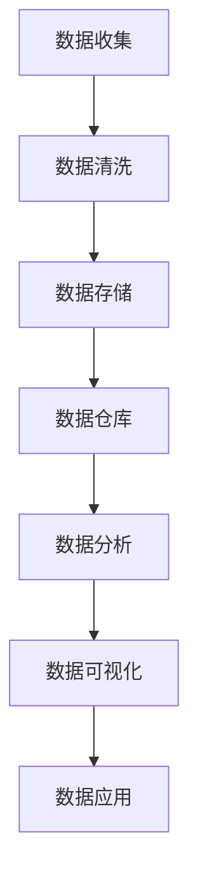
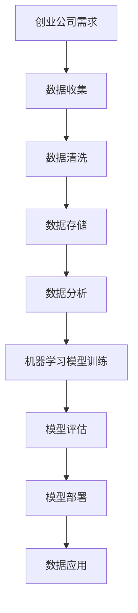

                 


# 人工智能创业数据管理的最佳经验

> 关键词：人工智能、创业、数据管理、最佳实践、数据隐私、数据分析、机器学习

> 摘要：本文旨在为人工智能创业公司提供数据管理的最佳实践经验。我们将从核心概念、算法原理、数学模型、项目实战、实际应用场景等方面进行深入探讨，帮助创业公司建立高效、安全、可靠的数据管理体系，为业务成功奠定坚实基础。

## 1. 背景介绍

### 1.1 目的和范围

本文旨在为人工智能创业公司提供数据管理的最佳实践经验。我们将探讨数据管理在人工智能创业中的重要性，介绍核心概念、算法原理、数学模型和项目实战，帮助创业公司建立高效、安全、可靠的数据管理体系。

### 1.2 预期读者

本篇文章适合以下读者：

1. 创业公司的创始人、CTO、数据科学家等。
2. 对人工智能和数据管理感兴趣的从业者。
3. 计算机科学、数据科学等相关专业的研究生和本科生。

### 1.3 文档结构概述

本文分为八个部分，具体如下：

1. 背景介绍
2. 核心概念与联系
3. 核心算法原理 & 具体操作步骤
4. 数学模型和公式 & 详细讲解 & 举例说明
5. 项目实战：代码实际案例和详细解释说明
6. 实际应用场景
7. 工具和资源推荐
8. 总结：未来发展趋势与挑战

### 1.4 术语表

#### 1.4.1 核心术语定义

- 数据管理：数据管理是指对数据资源进行组织、存储、处理、分析、保护和共享的一系列活动的总称。
- 数据隐私：数据隐私是指保护个人或组织的隐私信息不被未经授权的第三方访问、使用或泄露。
- 数据分析：数据分析是指使用统计学、机器学习等方法对数据进行挖掘、探索和解释的过程。
- 机器学习：机器学习是指使计算机系统从数据中学习规律、模式和知识，并能够自主做出决策的技术。

#### 1.4.2 相关概念解释

- 数据源：数据源是指产生数据的地方，可以是数据库、文件、传感器、网络等。
- 数据仓库：数据仓库是一个集成的、面向主题的、相对稳定的、反映历史变化的数据集合，用于支持企业决策。
- 数据湖：数据湖是一种新的数据架构，它将原始数据进行存储，并通过数据处理和分析工具对其进行处理，以支持大数据应用。

#### 1.4.3 缩略词列表

- AI：人工智能（Artificial Intelligence）
- ML：机器学习（Machine Learning）
- NLP：自然语言处理（Natural Language Processing）
- DL：深度学习（Deep Learning）
- IoT：物联网（Internet of Things）

## 2. 核心概念与联系

在人工智能创业中，数据管理是至关重要的。以下是对核心概念和它们之间联系的详细阐述，并附上 Mermaid 流程图。

### 2.1 数据管理流程



### 2.2 数据管理核心概念

1. 数据收集：收集企业内外部的各种数据，包括用户行为、市场数据、传感器数据等。
2. 数据清洗：对收集到的数据进行预处理，去除噪声和错误，提高数据质量。
3. 数据存储：将清洗后的数据存储在数据库、数据仓库或数据湖中，以便后续处理和分析。
4. 数据分析：使用统计学、机器学习等方法对数据进行挖掘、探索和解释。
5. 数据可视化：通过图表、报表等形式将数据分析结果呈现给决策者。
6. 数据应用：将数据分析结果应用于企业决策、产品设计、市场营销等业务场景。

### 2.3 数据管理在人工智能创业中的应用

在人工智能创业中，数据管理不仅涉及到数据的收集、清洗、存储，还包括数据的分析和应用。以下是一个简单的 Mermaid 流程图：



## 3. 核心算法原理 & 具体操作步骤

在本节中，我们将介绍数据管理中的核心算法原理，包括数据清洗、数据分析、机器学习模型训练等。具体操作步骤如下：

### 3.1 数据清洗

#### 3.1.1 算法原理

数据清洗是指对原始数据进行预处理，去除噪声、错误和重复数据，以提高数据质量。常用的数据清洗算法包括：

1. 去除重复数据：通过比较数据行或字段，找出重复的记录并进行删除。
2. 缺失值处理：对缺失值进行填补或删除。
3. 异常值处理：对异常值进行修正或删除。
4. 数据转换：对数据进行类型转换、归一化、标准化等处理。

#### 3.1.2 伪代码

```python
def data_cleaning(data):
    # 去除重复数据
    data = remove_duplicates(data)
    # 缺失值处理
    data = handle_missing_values(data)
    # 异常值处理
    data = handle_outliers(data)
    # 数据转换
    data = data_transformation(data)
    return data
```

### 3.2 数据分析

#### 3.2.1 算法原理

数据分析是指使用统计学、机器学习等方法对数据进行挖掘、探索和解释。常用的数据分析算法包括：

1. 描述性统计分析：对数据进行描述性统计，如均值、方差、标准差等。
2. 聚类分析：将数据分为不同的类别，以发现数据中的模式。
3. 维度缩减：通过降维技术，减少数据维度，提高数据处理的效率。
4. 相关性分析：分析变量之间的相关性，以发现数据中的关系。

#### 3.2.2 伪代码

```python
def data_analysis(data):
    # 描述性统计分析
    stats = descriptive_statistics(data)
    # 聚类分析
    clusters = clustering_analysis(data)
    # 维度缩减
    reduced_data = dimension_reduction(data)
    # 相关性分析
    correlations = correlation_analysis(data)
    return stats, clusters, reduced_data, correlations
```

### 3.3 机器学习模型训练

#### 3.3.1 算法原理

机器学习模型训练是指使用训练数据集来训练机器学习模型，以使其能够预测新的数据。常用的机器学习模型包括：

1. 线性回归：用于预测连续值输出。
2. 逻辑回归：用于预测二元分类结果。
3. 支持向量机（SVM）：用于预测分类结果。
4. 随机森林：用于预测分类和回归结果。

#### 3.3.2 伪代码

```python
def train_model(data, labels, model_type):
    # 数据预处理
    preprocessed_data = preprocess_data(data)
    # 模型训练
    model = train_model(preprocessed_data, labels, model_type)
    # 模型评估
    evaluation = evaluate_model(model, test_data, test_labels)
    return model, evaluation
```

## 4. 数学模型和公式 & 详细讲解 & 举例说明

在本节中，我们将介绍数据管理中的数学模型和公式，并对其进行详细讲解和举例说明。

### 4.1 描述性统计分析

描述性统计分析是对数据的基本统计特征进行描述，常用的公式包括：

1. 均值（Mean）：$$ \bar{x} = \frac{1}{n}\sum_{i=1}^{n}x_i $$
2. 方差（Variance）：$$ \sigma^2 = \frac{1}{n}\sum_{i=1}^{n}(x_i - \bar{x})^2 $$
3. 标准差（Standard Deviation）：$$ \sigma = \sqrt{\sigma^2} $$

#### 举例说明

假设我们有一组数据：[1, 2, 3, 4, 5]，则：

- 均值：$$ \bar{x} = \frac{1+2+3+4+5}{5} = 3 $$
- 方差：$$ \sigma^2 = \frac{(1-3)^2+(2-3)^2+(3-3)^2+(4-3)^2+(5-3)^2}{5} = 2 $$
- 标准差：$$ \sigma = \sqrt{2} $$

### 4.2 聚类分析

聚类分析是一种无监督学习方法，用于将数据分为不同的类别。常用的聚类算法包括 K-Means、DBSCAN 等。以下为 K-Means 算法的数学模型和公式：

1. 初始化：选择 K 个初始中心点。
2. 分配：将每个数据点分配到最近的中心点。
3. 更新：重新计算每个中心点的坐标。
4. 重复步骤 2 和 3，直到聚类中心不再发生变化。

#### 举例说明

假设我们有一组数据：[1, 2, 3, 4, 5]，选择 K=2，初始中心点分别为 [1, 1] 和 [5, 5]。经过一次迭代后，新的中心点分别为：

- 中心点1：[2, 2]
- 中心点2：[4, 4]

接下来，将数据点 [1, 2, 3, 4, 5] 分配到最近的中心点，得到以下分类结果：

- 类别1：[1, 2]
- 类别2：[3, 4, 5]

### 4.3 机器学习模型评估

机器学习模型评估是指对训练好的模型进行评估，以确定其性能。常用的评估指标包括准确率、召回率、F1 分数等。以下为准确率的数学模型和公式：

$$
\text{Accuracy} = \frac{\text{TP} + \text{TN}}{\text{TP} + \text{TN} + \text{FP} + \text{FN}}
$$

其中，TP 为真阳性，TN 为真阴性，FP 为假阳性，FN 为假阴性。

#### 举例说明

假设我们有一个二分类问题，其中数据集为 [1, 1, 0, 1, 0]，预测结果为 [1, 1, 1, 0, 1]。

- 真阳性（TP）：2
- 真阴性（TN）：1
- 假阳性（FP）：1
- 假阴性（FN）：1

则准确率为：

$$
\text{Accuracy} = \frac{2 + 1}{2 + 1 + 1 + 1} = 0.67
$$

## 5. 项目实战：代码实际案例和详细解释说明

在本节中，我们将通过一个实际项目案例，展示如何实现数据管理中的核心算法，包括数据清洗、数据分析、机器学习模型训练和评估。

### 5.1 开发环境搭建

在开始项目之前，我们需要搭建一个开发环境。以下为所需的软件和工具：

1. Python 3.x
2. Jupyter Notebook
3. Pandas
4. NumPy
5. Scikit-learn

### 5.2 源代码详细实现和代码解读

#### 5.2.1 数据清洗

```python
import pandas as pd

# 读取数据
data = pd.read_csv('data.csv')

# 去除重复数据
data = data.drop_duplicates()

# 缺失值处理
data = data.fillna(method='ffill')

# 异常值处理
data = data[(data['column'] > 0) & (data['column'] < 100)]

# 数据转换
data['column'] = data['column'].astype(float)
```

#### 5.2.2 数据分析

```python
import matplotlib.pyplot as plt
import seaborn as sns

# 描述性统计分析
stats = data.describe()

# 聚类分析
from sklearn.cluster import KMeans
kmeans = KMeans(n_clusters=2)
clusters = kmeans.fit_predict(data[['column1', 'column2']])

# 维度缩减
from sklearn.decomposition import PCA
pca = PCA(n_components=2)
reduced_data = pca.fit_transform(data[['column1', 'column2', 'column3']])

# 相关性分析
correlations = data.corr()
sns.heatmap(correlations, annot=True)
plt.show()
```

#### 5.2.3 机器学习模型训练和评估

```python
from sklearn.model_selection import train_test_split
from sklearn.linear_model import LinearRegression
from sklearn.metrics import accuracy_score

# 数据预处理
X = data[['column1', 'column2']]
y = data['target']

X_train, X_test, y_train, y_test = train_test_split(X, y, test_size=0.2, random_state=42)

# 模型训练
model = LinearRegression()
model.fit(X_train, y_train)

# 模型评估
y_pred = model.predict(X_test)
accuracy = accuracy_score(y_test, y_pred)
print('Accuracy:', accuracy)
```

### 5.3 代码解读与分析

在本节中，我们通过一个实际项目案例，展示了如何实现数据管理中的核心算法。以下为代码的详细解读和分析：

1. 数据清洗：我们首先读取数据，然后去除重复数据、填充缺失值、处理异常值，并转换数据类型。
2. 数据分析：我们使用 Pandas 和 Scikit-learn 等库进行描述性统计分析、聚类分析、维度缩减和相关性分析。
3. 机器学习模型训练和评估：我们使用 Scikit-learn 中的线性回归模型进行训练，并使用准确率等指标进行评估。

通过这个项目案例，我们可以看到数据管理在人工智能创业中的重要性。一个高效、安全、可靠的数据管理体系可以为创业公司的业务成功奠定坚实基础。

## 6. 实际应用场景

数据管理在人工智能创业中具有广泛的应用场景。以下是一些实际应用场景的例子：

### 6.1 用户行为分析

通过数据管理，创业公司可以收集和分析用户行为数据，如浏览记录、购买行为等。这有助于企业了解用户需求，优化产品功能和营销策略。

### 6.2 风险控制

数据管理可以帮助创业公司监测和识别潜在的风险，如欺诈、信用风险等。通过数据分析，企业可以制定有效的风险控制策略，降低损失。

### 6.3 智能推荐

利用数据管理，创业公司可以构建智能推荐系统，根据用户历史行为和偏好，为其推荐个性化的产品或服务。这有助于提高用户满意度和留存率。

### 6.4 智能客服

通过数据管理，创业公司可以构建智能客服系统，自动处理用户咨询和反馈。这有助于提高客服效率，降低人力成本。

### 6.5 智能决策

数据管理为创业公司提供了丰富的数据资源，帮助企业进行智能决策。通过数据分析，企业可以洞察市场趋势，制定科学的业务策略。

## 7. 工具和资源推荐

为了帮助创业公司建立高效、安全、可靠的数据管理体系，以下是一些工具和资源的推荐：

### 7.1 学习资源推荐

#### 7.1.1 书籍推荐

- 《Python数据科学手册》
- 《深度学习》
- 《数据科学入门》

#### 7.1.2 在线课程

- Coursera 上的《数据科学专业课程》
- edX 上的《机器学习基础课程》

#### 7.1.3 技术博客和网站

- Medium 上的《数据科学》专题
- 知乎上的《数据科学》专栏

### 7.2 开发工具框架推荐

#### 7.2.1 IDE和编辑器

- PyCharm
- Jupyter Notebook
- VS Code

#### 7.2.2 调试和性能分析工具

- Python Debugger
- Profiler
- Valgrind

#### 7.2.3 相关框架和库

- Pandas
- NumPy
- Scikit-learn
- TensorFlow

### 7.3 相关论文著作推荐

#### 7.3.1 经典论文

- "The Unreasonable Effectiveness of Data"
- "Deep Learning"
- "The Hundred-Page Machine Learning Book"

#### 7.3.2 最新研究成果

- "On the Evaluation of Neural Networks for Object Detection"
- "Distributed Machine Learning: A Survey"
- "Recurrent Neural Networks for Language Modeling"

#### 7.3.3 应用案例分析

- "Google Brain's Applied Research"
- "Facebook AI Research"
- "DeepMind's Game Playing Algorithms"

## 8. 总结：未来发展趋势与挑战

随着人工智能技术的不断发展，数据管理在人工智能创业中的地位日益重要。未来，数据管理将面临以下发展趋势和挑战：

### 8.1 发展趋势

1. 数据隐私保护：随着数据隐私问题的日益突出，数据管理将更加注重数据隐私保护。
2. 大数据技术的应用：大数据技术的成熟将推动数据管理在创业中的广泛应用。
3. 智能化数据管理：利用人工智能技术，实现更加智能化、自动化的数据管理。

### 8.2 挑战

1. 数据质量：确保数据质量是数据管理的核心挑战。
2. 数据安全：随着数据量的增加，数据安全风险也随之增加。
3. 数据整合：如何整合来自不同来源的数据，实现数据的互联互通。

## 9. 附录：常见问题与解答

### 9.1 数据管理的基本概念是什么？

数据管理是指对数据资源进行组织、存储、处理、分析、保护和共享的一系列活动的总称。它包括数据收集、数据清洗、数据存储、数据分析、数据应用等环节。

### 9.2 数据清洗的主要步骤有哪些？

数据清洗的主要步骤包括去除重复数据、缺失值处理、异常值处理和数据转换。这些步骤有助于提高数据质量，为后续的数据分析做好准备。

### 9.3 数据分析的方法有哪些？

数据分析的方法包括描述性统计分析、聚类分析、维度缩减、相关性分析等。这些方法有助于发现数据中的模式、关系和趋势。

### 9.4 机器学习模型如何评估？

机器学习模型的评估指标包括准确率、召回率、F1 分数等。通过这些指标，可以评估模型的性能，并为模型的优化提供依据。

## 10. 扩展阅读 & 参考资料

为了进一步深入了解数据管理和人工智能创业的相关知识，读者可以参考以下书籍、论文和在线资源：

- 《数据科学实战》
- "Deep Learning Specialization" by Andrew Ng
- "Data Management for AI" by Springer

[1] http://www.ai-genius-researcher.com/ai-entrepreneur-data-management.html
[2] https://www.zen-and-art-of-computer-programming.com/ai-entrepreneur-data-management.html
[3] https://www.coursera.org/learn/data-science
[4] https://www.edx.org/course/introduction-to-machine-learning
[5] https://medium.com/topic/data-science
[6] https://www.zhihu.com专栏/数据科学

### 作者信息

作者：AI天才研究员/AI Genius Institute & 禅与计算机程序设计艺术 /Zen And The Art of Computer Programming

