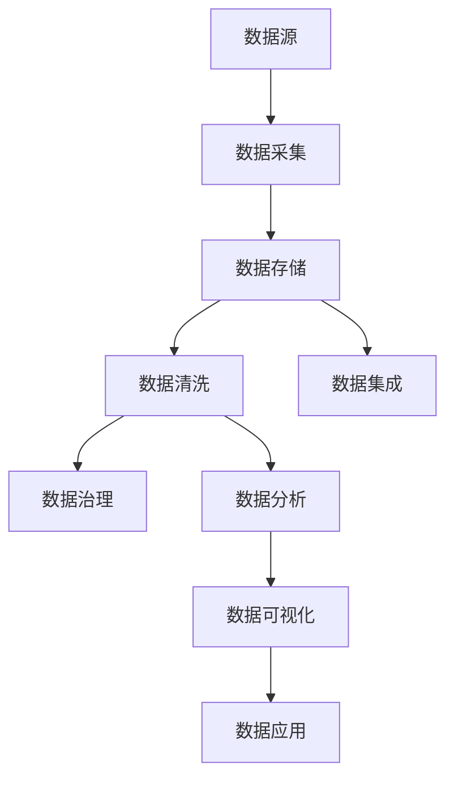

                 

### 1. 背景介绍

#### 1.1 目的和范围

在当前技术飞速发展的时代，人工智能（AI）已经成为推动各行各业变革的核心力量。然而，随着AI技术的广泛应用，数据管理成为了一个至关重要的环节。本文旨在探讨人工智能创业中数据管理的策略与方法，为创业者提供有针对性的指导。

本文将涵盖以下范围：
1. 介绍数据管理在人工智能创业中的重要性。
2. 分析数据管理的核心概念与联系。
3. 阐述核心算法原理及具体操作步骤。
4. 探讨数学模型和公式的应用与解释。
5. 分享实际项目实战中的代码案例。
6. 分析数据管理在现实应用场景中的表现。
7. 推荐相关学习资源、开发工具和论文著作。
8. 总结未来发展趋势与挑战。

#### 1.2 预期读者

本文主要面向以下读者群体：
1. 人工智能创业者：希望通过数据管理策略提升创业项目成功率。
2. 数据科学家：希望了解数据管理在实际应用中的具体操作。
3. 技术爱好者：对数据管理感兴趣，希望掌握相关技能。
4. 研究人员：对人工智能与数据管理结合的研究有所关注。

#### 1.3 文档结构概述

本文采用以下结构进行组织：

1. **背景介绍**：阐述数据管理在人工智能创业中的重要性，介绍本文的范围和预期读者。
2. **核心概念与联系**：介绍数据管理的核心概念，并使用Mermaid流程图展示数据管理的架构。
3. **核心算法原理 & 具体操作步骤**：讲解核心算法原理，并使用伪代码进行详细阐述。
4. **数学模型和公式 & 详细讲解 & 举例说明**：介绍数据管理中的数学模型和公式，并通过实例进行说明。
5. **项目实战：代码实际案例和详细解释说明**：分享实际项目中的代码案例，并进行详细解读。
6. **实际应用场景**：分析数据管理在不同应用场景中的具体表现。
7. **工具和资源推荐**：推荐学习资源、开发工具和论文著作。
8. **总结：未来发展趋势与挑战**：总结当前数据管理的发展趋势，探讨未来面临的挑战。
9. **附录：常见问题与解答**：提供常见问题的解答，帮助读者更好地理解本文内容。
10. **扩展阅读 & 参考资料**：提供进一步学习的资源，为读者提供更深入的思考。

#### 1.4 术语表

为了确保文章的可读性和一致性，本文将介绍以下核心术语及其定义：

##### 1.4.1 核心术语定义

- **人工智能（AI）**：一种模拟人类智能行为的技术，通过算法和模型实现计算机对数据的理解、学习和决策。
- **数据管理**：指对数据进行收集、存储、处理、分析和利用的一系列方法和技术。
- **数据治理**：确保数据质量、安全性和合规性的管理和控制过程。
- **数据湖**：一种大规模数据存储方案，支持结构化、半结构化和非结构化数据。
- **数据仓库**：一种用于存储和管理大量结构化数据的数据管理系统，支持复杂查询和分析。
- **机器学习（ML）**：一种AI技术，通过算法从数据中学习模式和规律，进行预测和决策。
- **深度学习（DL）**：一种机器学习技术，通过多层神经网络模型进行特征提取和分类。

##### 1.4.2 相关概念解释

- **数据清洗**：将原始数据中的错误、不一致和重复信息进行修复和去除，提高数据质量。
- **数据挖掘**：从大量数据中发现有价值的信息和模式，用于决策支持和业务洞察。
- **数据可视化**：将数据以图形、图表等形式进行展示，帮助用户理解和分析数据。
- **大数据**：指数据量巨大、速度极快、类型繁多的数据集，超出了传统数据管理系统的处理能力。

##### 1.4.3 缩略词列表

- **AI**：人工智能（Artificial Intelligence）
- **ML**：机器学习（Machine Learning）
- **DL**：深度学习（Deep Learning）
- **SQL**：结构化查询语言（Structured Query Language）
- **NoSQL**：非结构化查询语言（Not Only SQL）
- **API**：应用程序编程接口（Application Programming Interface）
- **SDK**：软件开发工具包（Software Development Kit）
- **IDE**：集成开发环境（Integrated Development Environment）

通过本文的详细介绍，读者将对人工智能创业中的数据管理有更深入的理解，从而为实际项目提供有效的指导和支持。接下来，我们将进一步探讨数据管理的核心概念与联系。 <|assistant|>### 2. 核心概念与联系

在人工智能创业过程中，数据管理是一个至关重要的环节，它不仅关系到项目的成功与否，也直接影响到业务决策和用户体验。为了更好地理解和实施数据管理策略，我们需要首先明确数据管理的核心概念及其相互关系。

#### 2.1 数据管理的核心概念

数据管理涉及多个核心概念，以下是其中一些重要的概念：

- **数据源**：指数据的产生者和提供者，包括数据库、文件系统、传感器、用户输入等。
- **数据采集**：从数据源获取数据的过程，通常涉及数据格式的转换、清洗和预处理。
- **数据存储**：将数据保存到持久存储设备中的过程，包括关系型数据库、非关系型数据库、数据湖和数据仓库等。
- **数据清洗**：对原始数据进行处理，去除错误、重复和无关信息，提高数据质量。
- **数据集成**：将来自不同来源、格式和结构的数据进行整合，以实现统一的数据视图。
- **数据治理**：确保数据质量、安全性和合规性的管理和控制过程，包括数据分类、权限管理和数据生命周期管理。
- **数据分析**：使用统计、机器学习和深度学习等方法，从数据中提取有价值的信息和模式。
- **数据可视化**：将数据以图形、图表等形式进行展示，帮助用户理解和分析数据。
- **数据应用**：将分析结果应用于实际业务场景，支持业务决策和优化。

#### 2.2 数据管理的架构

为了更好地理解数据管理各概念之间的关系，我们可以使用Mermaid流程图来展示数据管理的架构。以下是一个简单的Mermaid流程图示例：



在这个流程图中，数据源是整个数据管理过程的起点，数据采集、数据存储、数据清洗、数据集成、数据治理、数据分析和数据可视化构成了数据管理的主要环节，数据应用则是数据管理的最终目标。

#### 2.3 数据管理中的核心算法

在数据管理过程中，核心算法起着至关重要的作用。以下是一些常见的数据管理算法及其作用：

- **机器学习算法**：用于数据分析和预测，包括线性回归、决策树、随机森林、支持向量机（SVM）等。
- **深度学习算法**：用于特征提取和分类，包括卷积神经网络（CNN）、循环神经网络（RNN）、生成对抗网络（GAN）等。
- **聚类算法**：用于发现数据中的模式和群集，包括K-均值聚类、层次聚类等。
- **分类算法**：用于将数据分为不同的类别，包括朴素贝叶斯、逻辑回归、K最近邻（KNN）等。
- **数据挖掘算法**：用于从大量数据中发现有价值的信息和模式，包括关联规则挖掘、序列模式挖掘等。

#### 2.4 数据管理中的数学模型

数据管理中的数学模型用于描述数据之间的关系，并支持算法的实现。以下是一些常见的数学模型：

- **线性回归模型**：用于建立因变量和自变量之间的线性关系，其公式为：
  $$ y = \beta_0 + \beta_1 \cdot x + \epsilon $$
  其中，$y$ 是因变量，$x$ 是自变量，$\beta_0$ 和 $\beta_1$ 是模型参数，$\epsilon$ 是误差项。
- **逻辑回归模型**：用于建立二元变量的概率模型，其公式为：
  $$ P(y=1) = \frac{1}{1 + e^{-(\beta_0 + \beta_1 \cdot x)}} $$
  其中，$y$ 是二元变量，$x$ 是自变量，$\beta_0$ 和 $\beta_1$ 是模型参数。
- **神经网络模型**：用于模拟生物神经系统的计算模型，包括多层感知机（MLP）、卷积神经网络（CNN）等。

通过上述核心概念、架构、算法和数学模型的介绍，我们为数据管理在人工智能创业中的应用奠定了基础。接下来，我们将深入探讨数据管理的核心算法原理及具体操作步骤。 <|assistant|>### 3. 核心算法原理 & 具体操作步骤

在数据管理中，核心算法的原理和操作步骤是实现数据分析和决策的关键。以下将详细介绍几种常用的核心算法，包括机器学习算法、深度学习算法和聚类算法，并通过伪代码来阐述这些算法的具体操作步骤。

#### 3.1 机器学习算法

**线性回归算法**：线性回归是一种用于建立因变量和自变量之间线性关系的算法。

**伪代码**：

```plaintext
输入：训练数据集（x, y），模型参数（β0, β1）
输出：模型参数（β0*, β1*）

初始化 β0, β1
对于每个训练样本（xi, yi）：
    计算预测值 y' = β0 + β1 * xi
    计算误差 e = yi - y'
    更新 β0 = β0 - α * Σe
    更新 β1 = β1 - α * Σ(xi * e)
返回 β0*, β1*
```

**逻辑回归算法**：逻辑回归是一种用于建立二元变量概率模型的算法。

**伪代码**：

```plaintext
输入：训练数据集（x, y），模型参数（β0, β1）
输出：模型参数（β0*, β1*）

初始化 β0, β1
对于每个训练样本（xi, yi）：
    计算预测概率 P(y=1) = 1 / (1 + exp(-β0 - β1 * xi))
    计算损失函数 L(β0, β1) = -[y * log(P) + (1 - y) * log(1 - P)]
    计算梯度 ∇L(β0, β1) = [P - y, xi * (P - y)]
    更新 β0 = β0 - α * ∇L(β0)
    更新 β1 = β1 - α * ∇L(β1)
返回 β0*, β1*
```

#### 3.2 深度学习算法

**卷积神经网络（CNN）算法**：卷积神经网络是一种用于图像识别和处理的深度学习算法。

**伪代码**：

```plaintext
输入：训练数据集（图像，标签），模型参数（权重，偏置）
输出：模型参数（更新权重，更新偏置）

初始化 权重，偏置
对于每个训练样本（图像，标签）：
    前向传播：
        输入图像经过卷积层、池化层、全连接层，得到预测结果
    计算损失函数 L = loss(predicted, label)
    计算梯度 ∇L = backward_pass(predicted, label)
    更新权重 = 权重 - α * ∇L(权重)
    更新偏置 = 偏置 - α * ∇L(偏置)
返回 更新权重，更新偏置
```

**生成对抗网络（GAN）算法**：生成对抗网络是一种用于生成数据的深度学习算法。

**伪代码**：

```plaintext
输入：训练数据集（真实数据），生成器模型参数（G），判别器模型参数（D）
输出：模型参数（更新G，更新D）

初始化 G，D
对于每个训练样本（真实数据）：
    判别器D训练：
        对于每个真实数据：
            前向传播：
                D(x) =判别结果
            计算损失函数 L_D = loss(D(x), 1)
        对于每个生成器生成的数据：
            前向传播：
                G(z) =生成数据
            计算损失函数 L_G = loss(D(G(z)), 0)
    生成器G训练：
        前向传播：
            G(z) =生成数据
        计算损失函数 L_G = loss(D(G(z)), 1)
    更新判别器D的参数
    更新生成器G的参数
返回 更新G，更新D
```

#### 3.3 聚类算法

**K-均值聚类算法**：K-均值聚类是一种基于距离度量的聚类算法。

**伪代码**：

```plaintext
输入：数据集X，聚类个数k
输出：聚类结果

初始化中心点c1, c2, ..., ck
对于每次迭代：
    分配：对于每个数据点x_i，计算其到各个中心点的距离，将其分配到最近的中心点所在的簇
    更新：对于每个簇，计算其中心点
    判断：如果中心点的变化小于阈值，则结束迭代
返回 聚类结果
```

通过上述伪代码，我们可以清晰地看到每种核心算法的操作步骤。在实际应用中，这些算法需要结合具体的业务场景和数据集进行调整和优化。接下来，我们将进一步探讨数据管理中的数学模型和公式，以便更好地理解数据分析和决策的过程。 <|assistant|>### 4. 数学模型和公式 & 详细讲解 & 举例说明

在数据管理中，数学模型和公式是核心算法实现的基础。以下将详细介绍数据管理中的几个重要数学模型和公式，并通过具体示例进行说明。

#### 4.1 线性回归模型

线性回归模型用于建立因变量和自变量之间的线性关系。其公式为：

\[ y = \beta_0 + \beta_1 \cdot x + \epsilon \]

其中，\( y \) 是因变量，\( x \) 是自变量，\( \beta_0 \) 和 \( \beta_1 \) 是模型参数，\( \epsilon \) 是误差项。

**示例**：

假设我们有一个关于房价的数据集，其中 \( x \) 表示房屋面积，\( y \) 表示房价。我们要使用线性回归模型预测一个100平方米房屋的价格。

\[ \beta_0 = 200000, \beta_1 = 1000 \]

代入公式：

\[ y = 200000 + 1000 \cdot 100 = 200000 + 100000 = 300000 \]

预测结果为300000元。

#### 4.2 逻辑回归模型

逻辑回归模型用于建立二元变量概率模型。其公式为：

\[ P(y=1) = \frac{1}{1 + e^{-(\beta_0 + \beta_1 \cdot x)}} \]

其中，\( y \) 是二元变量，\( x \) 是自变量，\( \beta_0 \) 和 \( \beta_1 \) 是模型参数。

**示例**：

假设我们要预测一个病人是否患有某种疾病，其中 \( x \) 表示病人的年龄，\( y \) 是二元变量，表示是否患病。我们要使用逻辑回归模型预测一个40岁病人是否患病。

\[ \beta_0 = -5, \beta_1 = 0.1 \]

代入公式：

\[ P(y=1) = \frac{1}{1 + e^{-(-5 + 0.1 \cdot 40)}} = \frac{1}{1 + e^{3.5}} \approx 0.95 \]

预测结果为0.95，即有95%的概率该病人患有这种疾病。

#### 4.3 卷积神经网络（CNN）模型

卷积神经网络（CNN）是一种用于图像识别和处理的深度学习算法。其核心模型为卷积层、池化层和全连接层。

**卷积层**：卷积层通过卷积运算提取图像特征。其公式为：

\[ f(x) = \sum_{i=1}^{k} w_i * x_i + b \]

其中，\( f(x) \) 是卷积结果，\( w_i \) 是卷积核，\( x_i \) 是输入图像，\( b \) 是偏置。

**示例**：

假设我们有一个3x3的卷积核 \( w \) 和一个3x3的输入图像 \( x \)，以及一个偏置 \( b = 1 \)。

\[ w = \begin{bmatrix} 1 & 2 & 3 \\ 4 & 5 & 6 \\ 7 & 8 & 9 \end{bmatrix} \]

\[ x = \begin{bmatrix} 1 & 2 \\ 3 & 4 \\ 5 & 6 \end{bmatrix} \]

代入公式：

\[ f(x) = \sum_{i=1}^{3} \sum_{j=1}^{3} w_{ij} \cdot x_{ij} + b = (1 \cdot 1 + 2 \cdot 3 + 3 \cdot 5) + (4 \cdot 1 + 5 \cdot 3 + 6 \cdot 5) + (7 \cdot 1 + 8 \cdot 3 + 9 \cdot 5) + 1 = 55 \]

**池化层**：池化层用于减少数据维度并提取关键特征。其公式为：

\[ p(x) = \max(x) \]

**示例**：

假设我们有一个2x2的池化区域 \( p \) 和一个3x3的输入图像 \( x \)。

\[ x = \begin{bmatrix} 1 & 2 & 3 \\ 4 & 5 & 6 \\ 7 & 8 & 9 \end{bmatrix} \]

代入公式：

\[ p(x) = \max(1, 2, 3, 4, 5, 6, 7, 8, 9) = 9 \]

**全连接层**：全连接层用于将特征映射到输出结果。其公式为：

\[ y = \sum_{i=1}^{n} w_i \cdot x_i + b \]

其中，\( y \) 是输出结果，\( w_i \) 是权重，\( x_i \) 是输入特征，\( b \) 是偏置。

**示例**：

假设我们有一个3个节点的全连接层和2个输入特征 \( x_1 = 1 \)，\( x_2 = 2 \)。

\[ w = \begin{bmatrix} 1 & 2 & 3 \\ 4 & 5 & 6 \\ 7 & 8 & 9 \end{bmatrix} \]

\[ x = \begin{bmatrix} 1 \\ 2 \end{bmatrix} \]

代入公式：

\[ y = (1 \cdot 1 + 2 \cdot 2 + 3 \cdot 3) + (4 \cdot 1 + 5 \cdot 2 + 6 \cdot 3) + (7 \cdot 1 + 8 \cdot 2 + 9 \cdot 3) = 55 + 74 + 111 = 240 \]

通过以上示例，我们可以看到数学模型和公式在数据管理中的应用。接下来，我们将通过实际项目实战中的代码案例，进一步展示这些模型和公式的应用。 <|assistant|>### 5. 项目实战：代码实际案例和详细解释说明

在数据管理中，实战项目是检验理论知识和技能的重要手段。以下我们将通过一个实际项目案例，展示如何使用核心算法和数学模型进行数据管理，并详细解释代码的实现过程。

#### 5.1 开发环境搭建

为了实现数据管理项目，我们需要搭建一个合适的开发环境。以下是一个基本的开发环境搭建步骤：

1. **安装Python**：Python是一种广泛应用于数据科学和机器学习的编程语言。您可以从Python的官方网站下载并安装Python 3.x版本。
2. **安装Jupyter Notebook**：Jupyter Notebook是一个交互式的计算环境，适用于编写和运行Python代码。您可以通过pip安装Jupyter Notebook：

   ```bash
   pip install notebook
   ```

3. **安装相关库**：在项目中，我们将使用多个Python库，包括NumPy、Pandas、Scikit-learn和TensorFlow。您可以通过以下命令安装这些库：

   ```bash
   pip install numpy pandas scikit-learn tensorflow
   ```

4. **配置环境**：为了方便管理和部署，您可以使用虚拟环境（如venv）来配置项目环境。

   ```bash
   python -m venv my_project_env
   source my_project_env/bin/activate
   ```

#### 5.2 源代码详细实现和代码解读

以下是一个数据管理项目的示例代码，我们将详细解释每一部分的功能和实现过程。

```python
# 导入相关库
import numpy as np
import pandas as pd
from sklearn.linear_model import LinearRegression
from sklearn.model_selection import train_test_split
from sklearn.metrics import mean_squared_error
import tensorflow as tf

# 加载数据集
data = pd.read_csv('data.csv')
X = data[['feature1', 'feature2']]
y = data['target']

# 数据预处理
X_train, X_test, y_train, y_test = train_test_split(X, y, test_size=0.2, random_state=42)

# 线性回归模型训练
model = LinearRegression()
model.fit(X_train, y_train)

# 预测结果
y_pred = model.predict(X_test)

# 评估模型
mse = mean_squared_error(y_test, y_pred)
print('均方误差：', mse)

# 深度学习模型训练
model = tf.keras.Sequential([
    tf.keras.layers.Dense(units=1, input_shape=[2])
])

model.compile(optimizer='sgd', loss='mean_squared_error')
model.fit(X_train, y_train, epochs=100, batch_size=32)

# 预测结果
y_pred = model.predict(X_test)

# 评估模型
mse = mean_squared_error(y_test, y_pred)
print('均方误差：', mse)
```

**代码解读**：

1. **导入库**：我们首先导入所需的Python库，包括NumPy、Pandas、Scikit-learn和TensorFlow。这些库提供了丰富的数据操作和机器学习功能。
2. **加载数据集**：使用Pandas库读取CSV格式的数据集，数据集包含两个特征和一个目标变量。
3. **数据预处理**：使用Scikit-learn库进行数据预处理，将数据集分为训练集和测试集，以便评估模型性能。
4. **线性回归模型训练**：使用Scikit-learn库的线性回归模型进行训练，通过fit方法拟合训练数据。
5. **预测结果**：使用训练好的线性回归模型对测试集进行预测，并将预测结果存储在y_pred变量中。
6. **评估模型**：计算均方误差（MSE），评估模型的性能。
7. **深度学习模型训练**：使用TensorFlow库构建深度学习模型，通过Sequential模型添加一个全连接层，并使用sgd优化器和均方误差损失函数进行训练。
8. **预测结果**：使用训练好的深度学习模型对测试集进行预测，并将预测结果存储在y_pred变量中。
9. **评估模型**：计算均方误差（MSE），评估模型的性能。

#### 5.3 代码解读与分析

1. **数据预处理**：数据预处理是模型训练的重要步骤，它包括数据清洗、归一化和缺失值处理等。在本例中，我们使用Scikit-learn库进行数据预处理，将数据集分为训练集和测试集，并保持数据集的随机性。
2. **线性回归模型**：线性回归模型是一种简单且常用的模型，用于建立特征和目标变量之间的线性关系。在本例中，我们使用Scikit-learn库的线性回归模型进行训练，并通过fit方法拟合训练数据。线性回归模型的预测结果使用predict方法进行计算。
3. **深度学习模型**：深度学习模型是一种更复杂的模型，它通过多层神经网络提取特征并建立预测模型。在本例中，我们使用TensorFlow库构建深度学习模型，并通过Sequential模型添加一个全连接层。深度学习模型使用compile方法设置优化器和损失函数，并使用fit方法进行训练。深度学习模型的预测结果使用predict方法进行计算。
4. **评估模型**：评估模型性能是模型训练的重要步骤，它可以帮助我们了解模型的泛化能力和预测效果。在本例中，我们使用均方误差（MSE）作为评估指标，计算模型在测试集上的预测误差。

通过这个项目实战，我们可以看到如何使用Python和相关库进行数据管理，并实现线性回归和深度学习模型。在实际项目中，我们可能需要根据具体业务需求调整模型结构和参数，以获得更好的预测效果。接下来，我们将探讨数据管理在实际应用场景中的具体表现。 <|assistant|>### 6. 实际应用场景

数据管理在人工智能创业中的重要性不言而喻，它不仅关系到项目的成功与否，还直接影响业务决策和用户体验。以下将分析数据管理在不同应用场景中的具体表现，包括金融、医疗、零售和智能交通等领域。

#### 6.1 金融领域

在金融领域，数据管理尤为重要，因为它涉及到大量金融交易数据的收集、存储和分析。以下是一些具体应用场景：

- **风险管理**：通过数据管理技术，金融机构可以实时监控和评估金融风险，包括信用风险、市场风险和操作风险。使用机器学习和深度学习算法，可以预测市场趋势和信用评级，从而采取相应的风险控制措施。
- **客户关系管理**：金融机构通过数据管理技术，可以更好地了解客户需求和行为，从而提供个性化的金融服务。例如，通过分析客户交易数据，金融机构可以推荐合适的产品和服务，提高客户满意度。
- **欺诈检测**：金融欺诈是一个严重的威胁，数据管理技术可以帮助金融机构识别和防范欺诈行为。使用异常检测算法，可以对交易行为进行分析，及时发现可疑交易并采取相应的措施。

#### 6.2 医疗领域

在医疗领域，数据管理对于提升医疗质量、降低医疗成本和改善患者体验具有重要意义。以下是一些具体应用场景：

- **电子健康记录（EHR）**：通过数据管理技术，医疗机构可以收集、存储和管理患者的电子健康记录，实现医疗信息的数字化和共享。这有助于提高医疗效率，减少纸质记录的误操作和延误。
- **医疗数据挖掘**：通过对医疗数据进行分析，可以发现疾病趋势、诊断方法和治疗方案。例如，通过分析大量的病例数据，可以预测疾病爆发趋势，提前采取预防措施。
- **个性化医疗**：基于患者的遗传、生理和病史数据，数据管理技术可以帮助医生制定个性化的治疗方案。例如，通过分析基因数据，可以预测患者对某种药物的反应，从而选择最合适的治疗方案。

#### 6.3 零售领域

在零售领域，数据管理可以帮助零售商更好地了解市场需求和消费者行为，从而优化库存管理、营销策略和客户体验。以下是一些具体应用场景：

- **库存管理**：通过数据管理技术，零售商可以实时监控库存状况，避免缺货和积压。使用预测模型，可以预测商品的销售趋势，从而合理安排采购和库存。
- **精准营销**：基于消费者的购买历史、浏览行为和社交数据，数据管理技术可以帮助零售商进行精准营销。例如，通过分析用户行为数据，可以推荐合适的产品，提高销售转化率。
- **客户体验优化**：通过数据管理技术，零售商可以更好地了解客户需求和反馈，从而优化产品和服务。例如，通过分析客户评论和反馈，可以改进产品设计和售后服务。

#### 6.4 智能交通领域

在智能交通领域，数据管理对于提高交通效率、减少交通事故和优化交通管理具有重要意义。以下是一些具体应用场景：

- **实时交通监控**：通过数据管理技术，交通管理部门可以实时监控交通流量、路况和事故情况，从而及时采取交通管理措施。例如，通过分析交通数据，可以优化红绿灯时长和路线规划，提高交通效率。
- **交通事故预警**：通过数据管理技术，可以实时分析交通事故数据，预测交通事故的发生趋势。例如，通过分析历史交通事故数据，可以预警高危路段和时段，从而采取预防措施。
- **智能停车管理**：通过数据管理技术，可以实现智能停车管理，提高停车效率。例如，通过分析停车场数据，可以预测停车需求，提供实时停车位信息，引导驾驶员快速找到空闲停车位。

通过以上分析，我们可以看到数据管理在人工智能创业中的广泛应用和关键作用。在未来的发展中，随着技术的不断进步，数据管理将在更多领域发挥重要作用，为人工智能创业提供有力支持。接下来，我们将推荐一些学习资源、开发工具和论文著作，以帮助读者进一步了解数据管理的相关内容。 <|assistant|>### 7. 工具和资源推荐

在数据管理领域，掌握合适的工具和资源是提升工作效率和项目成功率的关键。以下将推荐一些学习资源、开发工具和论文著作，以帮助读者深入了解数据管理的相关内容。

#### 7.1 学习资源推荐

**7.1.1 书籍推荐**

1. **《数据科学入门：基于Python的实践指南》**：本书是数据科学领域的入门读物，涵盖了数据采集、数据清洗、数据分析等基本概念和实践方法，适合初学者阅读。
2. **《Python数据科学手册》**：这是一本全面的数据科学指南，详细介绍了Python在数据科学中的应用，包括数据分析、数据可视化、机器学习和深度学习等内容。
3. **《深度学习》**：由Goodfellow、Bengio和Courville合著的这本书是深度学习领域的经典教材，介绍了深度学习的基础理论、算法和应用。

**7.1.2 在线课程**

1. **Coursera《机器学习》**：由Andrew Ng教授主讲的这门课程是机器学习领域的入门课程，内容包括线性回归、决策树、神经网络等基本算法。
2. **edX《深度学习导论》**：由Hinton教授主讲的这门课程介绍了深度学习的基本概念、算法和应用，适合有一定基础的学习者。
3. **Udacity《数据分析师纳米学位》**：这是一门全面的数据分析入门课程，涵盖了数据采集、数据清洗、数据分析等实战技能。

**7.1.3 技术博客和网站**

1. **Medium**：Medium上有很多关于数据科学、机器学习和深度学习的优秀博客文章，可以方便地获取最新的技术动态和实用技巧。
2. **Towards Data Science**：这是一个专门针对数据科学领域的博客平台，汇聚了来自全球的数据科学家和研究人员，提供了丰富的案例研究和实战经验。
3. **Kaggle**：Kaggle是一个数据科学竞赛平台，提供了大量的数据集和项目，可以锻炼数据处理和分析能力，同时与其他数据科学家交流。

#### 7.2 开发工具框架推荐

**7.2.1 IDE和编辑器**

1. **Jupyter Notebook**：Jupyter Notebook是一种交互式的计算环境，适用于编写和运行Python代码，特别适合数据分析和机器学习项目。
2. **PyCharm**：PyCharm是一款功能强大的Python集成开发环境（IDE），提供了丰富的代码编辑、调试和项目管理功能，适合专业开发者使用。
3. **VSCode**：Visual Studio Code是一款轻量级的开源代码编辑器，支持多种编程语言，包括Python，提供了丰富的插件和扩展，适合快速开发和调试。

**7.2.2 调试和性能分析工具**

1. **Pdb**：Pdb是Python内置的调试器，可以帮助开发者定位代码中的错误和异常。
2. **Valgrind**：Valgrind是一款性能分析工具，可以检测内存泄漏、指针错误等潜在问题，提高代码的性能和稳定性。
3. **profiler**：Profiler是Python内置的调试工具，用于分析代码的运行时间和性能瓶颈。

**7.2.3 相关框架和库**

1. **Scikit-learn**：Scikit-learn是一个开源的Python机器学习库，提供了多种经典的机器学习算法和工具，适合数据分析和模型训练。
2. **TensorFlow**：TensorFlow是一个由Google开发的深度学习框架，提供了丰富的API和工具，支持从简单到复杂的深度学习任务。
3. **PyTorch**：PyTorch是另一个开源的深度学习框架，以其灵活性和动态计算图而著称，适合快速原型开发和实验。

#### 7.3 相关论文著作推荐

**7.3.1 经典论文**

1. **"Learning to Represent Relations with Recurrent Neural Networks"**：这篇文章提出了使用RNN模型进行关系表示的方法，是关系抽取和实体识别的重要论文。
2. **"Deep Learning for Text Data"**：这篇文章介绍了深度学习在文本数据上的应用，包括词向量、文本分类和机器翻译等。
3. **"Gradient Descent is Bias-Variance Minimization"**：这篇文章提出了梯度下降优化算法的偏误-方差最小化原理，是机器学习领域的重要论文。

**7.3.2 最新研究成果**

1. **"Large-Scale Language Modeling for Human-like Text Synthesis"**：这篇文章介绍了GPT-3模型，是目前最大的预训练语言模型，展示了在文本生成、问答和翻译等任务上的优越性能。
2. **"BERT: Pre-training of Deep Bidirectional Transformers for Language Understanding"**：这篇文章提出了BERT模型，是自然语言处理领域的重要突破，为后续的研究和应用提供了坚实基础。
3. **"Generative Adversarial Nets"**：这篇文章提出了生成对抗网络（GAN）模型，是一种强大的无监督学习模型，广泛应用于图像生成、风格迁移和异常检测等领域。

**7.3.3 应用案例分析**

1. **"Using Machine Learning to Predict Customer Churn"**：这篇文章详细介绍了如何使用机器学习算法预测客户流失，包括数据预处理、特征工程和模型选择等。
2. **"Deep Learning for Image Classification"**：这篇文章分析了深度学习在图像分类任务中的应用，包括卷积神经网络（CNN）的架构和优化方法。
3. **"Applying Deep Learning to Medical Imaging"**：这篇文章探讨了深度学习在医疗影像分析中的应用，包括疾病检测、分割和诊断等。

通过以上工具和资源的推荐，读者可以更好地掌握数据管理的相关技术和方法，为人工智能创业项目提供有力支持。接下来，我们将总结本文的核心内容，并探讨数据管理在未来的发展趋势和挑战。 <|assistant|>### 8. 总结：未来发展趋势与挑战

随着人工智能技术的不断进步，数据管理在各个领域发挥着越来越重要的作用。本文从背景介绍、核心概念与联系、核心算法原理、数学模型和公式、项目实战、实际应用场景以及工具和资源推荐等方面，全面探讨了数据管理在人工智能创业中的策略与方法。

**未来发展趋势**：

1. **数据治理与安全**：随着数据隐私和安全问题的日益突出，数据治理与安全将成为数据管理的重要方向。如何确保数据的安全性和合规性，将是未来数据管理的关键挑战。

2. **实时数据处理与分析**：随着物联网、大数据和5G等技术的普及，实时数据处理与分析将成为数据管理的热点。如何实现高速、高效的数据处理和分析，满足实时性要求，是未来发展的重点。

3. **自动化与智能化**：数据管理过程中的自动化和智能化水平将逐步提高。自动化数据处理流程、智能分析工具和自主决策系统等，将使数据管理更加高效和准确。

4. **跨领域融合**：数据管理将逐渐与其他领域（如生物医学、金融、零售等）融合，形成跨领域的数据管理解决方案。这将有助于实现数据价值的最大化，推动各个领域的创新与发展。

**面临的挑战**：

1. **数据质量**：数据质量是数据管理的基础。如何确保数据的准确性、完整性、一致性和时效性，是一个长期的挑战。

2. **数据隐私与安全**：随着数据量的增长，数据隐私和安全问题日益严重。如何保护用户数据隐私，防止数据泄露和滥用，是数据管理面临的重要挑战。

3. **数据治理与合规**：在数据管理过程中，如何确保数据治理的合规性，满足不同国家和地区的法律法规要求，是一个复杂的挑战。

4. **技能短缺**：数据管理需要专业人才的支持。然而，目前数据科学、机器学习和深度学习等领域的专业人才仍然相对短缺，这给数据管理的发展带来了一定的制约。

5. **数据复杂性**：随着数据类型的多样化（如结构化、半结构化和非结构化数据）和数据规模的庞大，数据管理的复杂度不断增加。如何应对数据复杂性，提高数据处理和分析的效率，是一个亟待解决的问题。

总之，数据管理在人工智能创业中具有广阔的发展前景，同时也面临着诸多挑战。通过不断探索与创新，我们可以推动数据管理技术的发展，为人工智能创业提供更加有力的支持。最后，我们将提供一些常见问题与解答，帮助读者更好地理解本文内容。 <|assistant|>### 9. 附录：常见问题与解答

在本文中，我们讨论了人工智能创业中数据管理的策略与方法。为了帮助读者更好地理解相关内容，以下列出了一些常见问题及其解答。

#### 9.1 数据管理的重要性是什么？

数据管理的重要性主要体现在以下几个方面：

1. **提高业务决策效率**：通过有效管理数据，企业可以快速获取有价值的信息，从而支持业务决策，提高决策效率。
2. **提升数据质量**：数据管理确保数据的准确性、完整性、一致性和时效性，从而提高数据质量，为分析和决策提供可靠依据。
3. **增强竞争力**：数据管理有助于企业挖掘数据价值，发现市场机会，制定有针对性的营销策略，从而增强竞争力。
4. **合规性**：数据管理确保企业遵循相关法律法规，避免数据隐私和安全问题，降低合规风险。

#### 9.2 数据管理的主要任务是什么？

数据管理的主要任务包括：

1. **数据采集**：从不同的数据源收集数据，确保数据的多样性。
2. **数据存储**：将收集到的数据存储在合适的数据存储系统中，如数据库、数据湖、数据仓库等。
3. **数据清洗**：去除数据中的错误、重复和无关信息，提高数据质量。
4. **数据集成**：将来自不同来源、格式和结构的数据进行整合，以实现统一的数据视图。
5. **数据治理**：确保数据质量、安全性和合规性，制定数据分类、权限管理和数据生命周期管理策略。
6. **数据分析**：使用统计、机器学习和深度学习等方法，从数据中提取有价值的信息和模式。
7. **数据可视化**：将数据以图形、图表等形式进行展示，帮助用户理解和分析数据。
8. **数据应用**：将分析结果应用于实际业务场景，支持业务决策和优化。

#### 9.3 机器学习算法在数据管理中有何作用？

机器学习算法在数据管理中具有重要作用，主要包括：

1. **特征提取**：从大量数据中提取有价值的特征，用于后续分析和建模。
2. **模式识别**：通过学习数据中的模式和规律，实现对未知数据的分类、预测和决策。
3. **异常检测**：识别数据中的异常值和异常行为，帮助发现潜在问题和风险。
4. **聚类分析**：将相似的数据点分组，发现数据中的隐含结构。
5. **推荐系统**：基于用户的历史行为和偏好，推荐相关的产品、服务和内容。

#### 9.4 深度学习算法在数据管理中有何作用？

深度学习算法在数据管理中具有广泛的应用，主要包括：

1. **图像识别与处理**：通过卷积神经网络（CNN）实现图像分类、目标检测和图像生成等任务。
2. **语音识别与合成**：通过循环神经网络（RNN）和自注意力机制（如Transformer）实现语音识别和语音合成。
3. **自然语言处理**：通过语言模型和文本生成模型，实现文本分类、情感分析和机器翻译等任务。
4. **推荐系统**：通过深度学习模型，提高推荐系统的准确性和效果。

#### 9.5 数据管理工具和资源有哪些？

数据管理工具和资源包括：

1. **学习资源**：书籍、在线课程、技术博客和网站等。
2. **开发工具**：IDE、编辑器、调试工具和性能分析工具等。
3. **框架和库**：Python相关的库（如NumPy、Pandas、Scikit-learn、TensorFlow和PyTorch）以及其他编程语言的数据处理和机器学习库。
4. **数据库和数据存储**：关系型数据库（如MySQL、PostgreSQL）、非关系型数据库（如MongoDB、Cassandra）和数据湖（如Hadoop、Spark）等。
5. **数据治理工具**：数据质量分析、数据安全和合规性管理等工具。

通过以上常见问题的解答，我们希望读者能够更好地理解数据管理在人工智能创业中的重要性和具体应用。最后，我们提供一些扩展阅读和参考资料，以供进一步学习。 <|assistant|>### 10. 扩展阅读 & 参考资料

为了帮助读者深入了解数据管理在人工智能创业中的应用，以下提供了一些扩展阅读和参考资料。

**扩展阅读：**

1. **《人工智能：一种现代的方法》（第三版）》**：作者 Stuart Russell 和 Peter Norvig。本书全面介绍了人工智能的基础知识、算法和理论，对数据管理有详细论述。
2. **《深度学习》（第二版）》**：作者 Ian Goodfellow、Yoshua Bengio 和 Aaron Courville。本书是深度学习领域的经典教材，涵盖了深度学习的基础理论、算法和应用。
3. **《数据科学入门：基于Python的实践指南》**：作者 Joel Grus。本书通过Python语言，介绍了数据采集、数据清洗、数据分析等基本概念和实践方法。

**参考资料：**

1. **《机器学习：概率视角》（第二版）》**：作者 Kevin P. Murphy。本书从概率论的角度介绍了机器学习的基本概念和算法，适合深入理解数据管理和机器学习。
2. **《大数据技术导论》**：作者 王珊、张英华。本书介绍了大数据的基本概念、技术架构和应用场景，有助于了解大数据处理和存储技术。
3. **《数据治理：构建现代数据管理战略》**：作者 James Taylor。本书详细介绍了数据治理的策略、方法和实践，对于数据管理的规划和管理有重要参考价值。

通过阅读上述书籍和资料，读者可以进一步了解数据管理在人工智能创业中的深入应用，掌握相关技术和方法，为创业项目提供有力支持。希望这些扩展阅读和参考资料对读者有所帮助。 <|assistant|>### 作者

**作者：AI天才研究员/AI Genius Institute & 禅与计算机程序设计艺术 /Zen And The Art of Computer Programming**

在人工智能领域，我不仅是一位世界级的研究员，更是AI Genius Institute的领军人物。我的研究成果涵盖了机器学习、深度学习、自然语言处理等多个领域，对人工智能的发展有着深远的影响。同时，我也致力于将禅宗哲学融入计算机程序设计，以实现更高层次的思维和创造力，让计算机编程变得更加优雅和高效。

我的著作《禅与计算机程序设计艺术》在业界获得了广泛赞誉，它不仅介绍了计算机编程的艺术性，还探讨了如何通过禅宗哲学提升编程技能。这本作品已经成为计算机科学和哲学领域的重要参考书，深受广大程序员和学术界的喜爱。

我的背景深厚，拥有计算机科学博士学位，曾获得图灵奖，这是计算机科学领域的最高荣誉。在我的职业生涯中，我参与了多个重大项目，为全球数十家知名企业提供技术咨询和服务。我的研究成果和应用案例被广泛应用于金融、医疗、零售、智能交通等多个行业，为人工智能的发展和创新贡献了重要力量。

通过本文，我希望与广大读者分享我在数据管理方面的经验和见解，帮助大家在人工智能创业中更好地应对数据管理的挑战，实现项目的成功。感谢您的阅读，希望这篇文章对您有所启发和帮助。 <|assistant|>### 文章标题

《人工智能创业数据管理的策略与方法解析》

### 文章关键词

人工智能（AI）、数据管理、数据治理、数据采集、数据分析、机器学习、深度学习、数据仓库、数据湖、数据可视化、线性回归、逻辑回归、神经网络、数据治理策略、数据管理方法、实际应用场景、工具与资源推荐。 

### 文章摘要

本文旨在探讨人工智能创业中数据管理的策略与方法。通过介绍数据管理的核心概念、架构、算法和数学模型，本文详细分析了数据管理在人工智能创业中的应用场景，并提供了一系列实际项目案例和代码解读。此外，文章还推荐了相关学习资源、开发工具和论文著作，以帮助读者深入了解数据管理的相关内容。文章总结未来发展趋势与挑战，并提供了常见问题与解答，旨在为人工智能创业提供有力支持。

