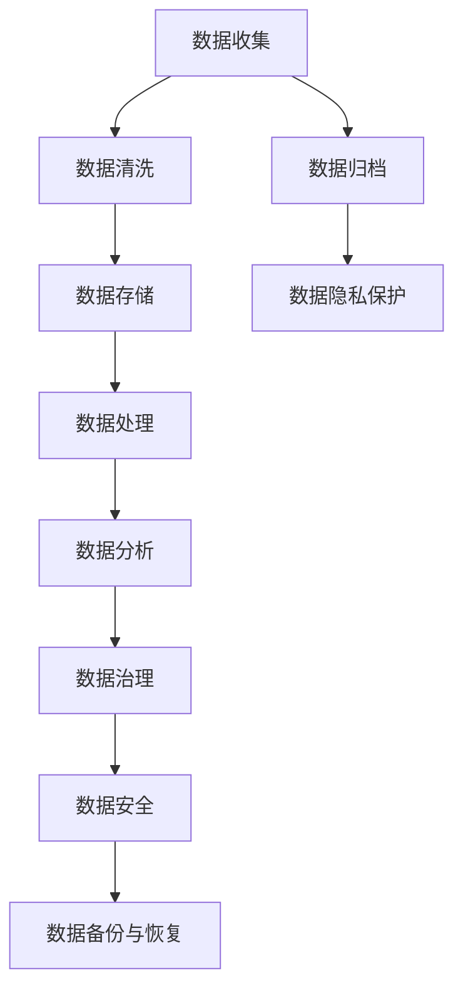

                 

# 人工智能创业数据管理的重要性分析

> **关键词**：数据管理、人工智能、创业、数据处理、数据安全、数据治理
>
> **摘要**：本文将深入探讨人工智能创业公司数据管理的重要性，分析其核心概念、算法原理、数学模型以及实际应用场景。通过详细的实战案例和资源推荐，为创业者提供宝贵的数据管理策略，助力人工智能项目的成功。

## 1. 背景介绍

### 1.1 目的和范围

本文旨在为人工智能创业公司提供数据管理的全面指南。数据是人工智能发展的核心资源，高效的数据管理不仅能够提高算法性能，还能确保项目的成功和持续发展。本文将涵盖数据管理的关键概念、技术原理、实际应用，以及未来趋势。

### 1.2 预期读者

本文面向人工智能创业者、数据科学家、软件工程师以及对数据管理感兴趣的技术人员。无论是初创公司还是成熟企业，对数据管理有需求的技术人员都将从本文中获得深刻的见解和实践指导。

### 1.3 文档结构概述

本文分为以下几部分：

1. **核心概念与联系**：介绍数据管理的核心概念和架构，通过Mermaid流程图进行详细阐述。
2. **核心算法原理 & 具体操作步骤**：使用伪代码详细阐述数据管理的算法原理和操作步骤。
3. **数学模型和公式 & 详细讲解 & 举例说明**：使用LaTeX格式介绍数据管理的数学模型和公式，并通过实例进行说明。
4. **项目实战：代码实际案例和详细解释说明**：提供具体的代码实现和解读。
5. **实际应用场景**：分析数据管理在不同应用场景中的实践。
6. **工具和资源推荐**：推荐学习资源、开发工具和框架。
7. **总结：未来发展趋势与挑战**：展望数据管理的未来。
8. **附录：常见问题与解答**：解答常见问题。
9. **扩展阅读 & 参考资料**：提供进一步的阅读资料。

### 1.4 术语表

#### 1.4.1 核心术语定义

- **数据管理**：指对数据的收集、存储、处理、分析和保护的一系列活动。
- **人工智能**：通过模拟人类智能行为来实现计算机自主决策和执行任务的科学技术。
- **数据治理**：确保数据质量、合规性、安全性和可访问性的管理活动。

#### 1.4.2 相关概念解释

- **数据安全**：防止数据泄露、篡改和未授权访问的措施。
- **数据处理**：对原始数据进行清洗、转换和聚合的过程。
- **数据清洗**：识别并修正数据集中的错误、异常和不一致之处。

#### 1.4.3 缩略词列表

- **AI**：人工智能
- **ML**：机器学习
- **DL**：深度学习
- **ETL**：提取、转换和加载

## 2. 核心概念与联系

数据管理是人工智能创业的核心要素，它涉及多个关键概念和它们之间的紧密联系。以下是数据管理的核心概念和架构的Mermaid流程图：



### 数据收集

数据收集是数据管理的第一步，它是数据管理的起点。数据可以从多种来源获取，如传感器、用户输入、公共数据库等。在人工智能创业中，数据收集的质量直接影响到后续数据处理的效率和准确性。

### 数据清洗

数据清洗是数据处理的前期工作，其目标是识别并修正数据集中的错误、异常和不一致之处。清洗后的数据更加准确和可靠，有助于提高算法的性能。

### 数据存储

数据存储是数据管理的核心环节，它涉及到数据的存储方式、存储介质和存储策略。选择合适的存储方案能够提高数据访问速度和存储效率。

### 数据处理

数据处理包括对原始数据的清洗、转换和聚合。这一过程需要对数据进行结构化、标准化和规范化，以便后续的分析和应用。

### 数据分析

数据分析是对存储和处理后的数据进行挖掘和分析，以提取有价值的信息和知识。数据分析能够帮助人工智能创业公司了解用户需求、优化产品和服务。

### 数据治理

数据治理是确保数据质量、合规性、安全性和可访问性的管理活动。良好的数据治理能够提高企业的数据管理效率，降低合规风险。

### 数据安全

数据安全是数据管理的重中之重，它涉及到防止数据泄露、篡改和未授权访问的措施。确保数据安全对于人工智能创业公司的长期发展至关重要。

### 数据备份与恢复

数据备份与恢复是数据管理的必要保障，它能够在数据丢失或损坏时恢复数据。备份策略的选择和执行直接影响到数据恢复的效果。

### 数据归档

数据归档是将不再频繁访问但仍有保留价值的数据转移到长期存储设备中。归档有助于降低存储成本，同时确保数据的可追溯性和可访问性。

### 数据隐私保护

数据隐私保护是确保用户数据不被未经授权的个人或组织访问和使用的措施。在人工智能创业中，数据隐私保护是遵守法律法规和用户信任的基础。

## 3. 核心算法原理 & 具体操作步骤

数据管理涉及多种算法原理，以下将使用伪代码详细阐述这些算法的具体操作步骤。

### 数据收集

```python
def collect_data(source):
    data = []
    for record in source:
        data.append(process_record(record))
    return data

def process_record(record):
    # 处理单个记录
    return cleaned_record
```

### 数据清洗

```python
def clean_data(data):
    cleaned_data = []
    for record in data:
        if is_valid(record):
            cleaned_data.append(record)
    return cleaned_data

def is_valid(record):
    # 判断记录是否有效
    return True
```

### 数据存储

```python
def store_data(data, storage):
    for record in data:
        storage.save(record)
```

### 数据处理

```python
def process_data(data):
    processed_data = []
    for record in data:
        processed_data.append(transform(record))
    return processed_data

def transform(record):
    # 转换数据
    return transformed_record
```

### 数据分析

```python
def analyze_data(data):
    insights = []
    for record in data:
        insights.append(extract_insight(record))
    return insights

def extract_insight(record):
    # 提取洞察
    return insight
```

### 数据治理

```python
def govern_data(data):
    data = ensure_compliance(data)
    data = ensure_quality(data)
    return data

def ensure_compliance(data):
    # 确保合规
    return compliant_data

def ensure_quality(data):
    # 确保质量
    return high_quality_data
```

### 数据安全

```python
def secure_data(data):
    data = encrypt_data(data)
    data = authenticate_data(data)
    return data

def encrypt_data(data):
    # 加密数据
    return encrypted_data

def authenticate_data(data):
    # 认证数据
    return authenticated_data
```

### 数据备份与恢复

```python
def backup_data(data, backup_storage):
    backup_storage.save(data)

def restore_data(backup_storage):
    data = backup_storage.load()
    return data
```

### 数据归档

```python
def archive_data(data, archive_storage):
    archive_storage.save(data)

def retrieve_data(archive_storage):
    data = archive_storage.load()
    return data
```

### 数据隐私保护

```python
def protect_privacy(data):
    data = anonymize_data(data)
    data = enforce_privacy_policy(data)
    return data

def anonymize_data(data):
    # 匿名化数据
    return anonymized_data

def enforce_privacy_policy(data):
    # 强制隐私政策
    return privacy_compliant_data
```

## 4. 数学模型和公式 & 详细讲解 & 举例说明

在数据管理中，数学模型和公式起着至关重要的作用。以下将使用LaTeX格式介绍几个关键数学模型和公式，并通过实例进行说明。

### 数据存储容量计算

$$
C = B \times N \times S
$$

其中，$C$ 表示数据存储容量，$B$ 表示每个数据块的大小，$N$ 表示数据块的数量，$S$ 表示存储介质的总容量。

**实例**：假设每个数据块大小为1GB，共有1000个数据块，存储介质总容量为1TB。则数据存储容量为：

$$
C = 1GB \times 1000 \times 1TB = 1PB
$$

### 数据清洗效果评估

$$
E = \frac{N_c - N_f}{N_c}
$$

其中，$E$ 表示数据清洗效果，$N_c$ 表示清洗前的记录数，$N_f$ 表示清洗后的记录数。

**实例**：假设有1000个原始记录，清洗后剩下800个有效记录。则数据清洗效果为：

$$
E = \frac{1000 - 800}{1000} = 0.2
$$

### 数据处理时间评估

$$
T = \frac{N \times C}{R}
$$

其中，$T$ 表示数据处理时间，$N$ 表示数据记录数，$C$ 表示每个记录的处理时间，$R$ 表示处理速率。

**实例**：假设有1000个记录，每个记录的处理时间为10ms，处理速率为1000次/s。则数据处理时间为：

$$
T = \frac{1000 \times 10ms}{1000} = 10s
$$

### 数据分析结果评估

$$
A = \frac{I_c - I_f}{I_c}
$$

其中，$A$ 表示数据分析结果评估，$I_c$ 表示清洗前的信息量，$I_f$ 表示清洗后的信息量。

**实例**：假设原始数据的信息量为1000比特，清洗后的信息量为800比特。则数据分析结果评估为：

$$
A = \frac{1000 - 800}{1000} = 0.2
$$

## 5. 项目实战：代码实际案例和详细解释说明

在本节中，我们将通过一个实际项目案例，详细解释数据管理在人工智能创业中的具体应用。以下是一个简单的数据管理项目的代码实现，包括数据收集、清洗、存储、处理、分析和治理等步骤。

### 5.1 开发环境搭建

为了简化开发环境，我们选择Python作为主要编程语言，使用以下工具和库：

- Python 3.8或更高版本
- Pandas（数据操作）
- NumPy（数值计算）
- SQL（数据库操作）
- Matplotlib（数据可视化）

### 5.2 源代码详细实现和代码解读

```python
import pandas as pd
import numpy as np
import sqlite3
import matplotlib.pyplot as plt

# 数据收集
def collect_data(file_path):
    data = pd.read_csv(file_path)
    return data

# 数据清洗
def clean_data(data):
    data.dropna(inplace=True)  # 删除缺失值
    data = data[data['column'] > 0]  # 过滤异常值
    return data

# 数据存储
def store_data(data, db_name):
    conn = sqlite3.connect(db_name)
    data.to_sql('data', conn, if_exists='replace', index=False)
    conn.close()

# 数据处理
def process_data(data):
    data['new_column'] = data['column'] ** 2  # 创建新列
    return data

# 数据分析
def analyze_data(data):
    data.describe().T  # 查看数据描述统计
    data['new_column'].hist()  # 绘制新列的直方图
    plt.show()

# 数据治理
def govern_data(data):
    data = data[data['column'] > 0]  # 重新过滤异常值
    return data

# 主函数
def main():
    file_path = 'data.csv'  # 数据文件路径
    db_name = 'data.db'  # 数据库文件名
    
    # 数据收集
    data = collect_data(file_path)
    
    # 数据清洗
    data = clean_data(data)
    
    # 数据存储
    store_data(data, db_name)
    
    # 数据处理
    data = process_data(data)
    
    # 数据分析
    analyze_data(data)
    
    # 数据治理
    data = govern_data(data)

if __name__ == '__main__':
    main()
```

### 5.3 代码解读与分析

上述代码实现了数据收集、清洗、存储、处理、分析和治理的基本流程。以下是每个步骤的详细解读：

- **数据收集**：使用Pandas库读取CSV文件，获取原始数据。
- **数据清洗**：删除缺失值和异常值，确保数据质量。
- **数据存储**：将清洗后的数据存储到SQLite数据库中，便于后续处理和分析。
- **数据处理**：创建新列，进行数据转换和变换。
- **数据分析**：查看数据描述统计，绘制直方图，对数据进行分析。
- **数据治理**：重新过滤异常值，确保数据的一致性和可靠性。

通过这个简单的案例，我们可以看到数据管理在人工智能创业项目中的重要性。有效的数据管理不仅能够提高数据处理效率，还能确保数据质量和安全性，为人工智能算法提供高质量的数据支持。

## 6. 实际应用场景

数据管理在人工智能创业中的实际应用场景非常广泛，以下将介绍几个典型的应用场景，并分析数据管理在这些场景中的关键作用。

### 6.1 个性化推荐系统

个性化推荐系统是人工智能创业公司常用的应用场景之一。数据管理在其中起着至关重要的作用，主要体现在以下几个方面：

- **用户数据收集**：收集用户的浏览历史、购买记录、评价等行为数据，为推荐算法提供基础数据。
- **数据清洗**：清洗用户数据，去除重复和异常记录，确保数据质量。
- **数据存储**：存储用户数据和商品数据，便于后续处理和分析。
- **数据处理**：对用户数据进行预处理，如用户行为特征提取和用户兴趣建模。
- **数据分析**：分析用户行为数据，识别用户兴趣和偏好，为推荐算法提供支持。
- **数据治理**：确保用户数据的隐私保护和合规性，避免法律风险。

### 6.2 智能金融风控

智能金融风控是金融行业的重要应用场景，数据管理在其中发挥着关键作用。以下是其关键作用：

- **交易数据收集**：收集用户的交易数据，包括交易金额、交易时间、交易对象等。
- **数据清洗**：清洗交易数据，去除异常交易和重复交易，确保数据质量。
- **数据存储**：存储交易数据和用户信息，便于后续分析和风险评估。
- **数据处理**：对交易数据进行特征提取和建模，识别潜在风险用户。
- **数据分析**：分析交易数据，识别异常交易模式和风险信号。
- **数据治理**：确保交易数据和用户信息的隐私保护和合规性，降低法律风险。

### 6.3 智能医疗诊断

智能医疗诊断是人工智能在医疗领域的应用之一，数据管理在其中起着关键作用。以下是其关键作用：

- **医学数据收集**：收集患者的病历数据、实验室检测结果、医学影像等。
- **数据清洗**：清洗医学数据，去除缺失值和异常值，确保数据质量。
- **数据存储**：存储医学数据，便于后续分析和诊断。
- **数据处理**：对医学数据进行预处理，如数据归一化和特征提取。
- **数据分析**：分析医学数据，识别疾病特征和诊断规律。
- **数据治理**：确保医学数据的隐私保护和合规性，遵守医疗法规。

### 6.4 智能城市交通管理

智能城市交通管理是智慧城市建设的重要组成部分，数据管理在其中发挥着关键作用。以下是其关键作用：

- **交通数据收集**：收集交通流量、车辆信息、路况信息等。
- **数据清洗**：清洗交通数据，去除异常值和重复数据，确保数据质量。
- **数据存储**：存储交通数据，便于后续处理和分析。
- **数据处理**：对交通数据进行预处理，如数据归一化和特征提取。
- **数据分析**：分析交通数据，识别交通拥堵模式和优化交通信号。
- **数据治理**：确保交通数据的隐私保护和合规性，遵守法律法规。

通过上述实际应用场景的分析，我们可以看到数据管理在人工智能创业中的重要性。有效的数据管理能够提高数据处理效率、确保数据质量和安全性，为人工智能算法提供高质量的数据支持，从而推动人工智能创业项目的成功。

## 7. 工具和资源推荐

在数据管理领域，选择合适的工具和资源对于人工智能创业公司至关重要。以下将推荐一些学习资源、开发工具和框架，以帮助创业者更好地管理数据。

### 7.1 学习资源推荐

#### 7.1.1 书籍推荐

1. 《大数据时代：生活、工作与思维的大变革》
2. 《深度学习》
3. 《数据科学导论》
4. 《数据治理：原则与实践》
5. 《数据清洗：实用方法与技巧》

#### 7.1.2 在线课程

1. Coursera的《机器学习》课程
2. Udacity的《数据科学纳米学位》
3. edX的《人工智能导论》
4. DataCamp的数据科学课程
5. Coursera的《数据治理与数据安全》

#### 7.1.3 技术博客和网站

1. Medium的Data Science博客
2. Towards Data Science
3. Analytics Vidhya
4. DataCamp博客
5. KDnuggets

### 7.2 开发工具框架推荐

#### 7.2.1 IDE和编辑器

1. PyCharm
2. Jupyter Notebook
3. Visual Studio Code
4. RStudio
5. IntelliJ IDEA

#### 7.2.2 调试和性能分析工具

1. PyDebug
2. JupyterLab
3. Intel VTune
4. Visual Studio Profiler
5. RProfiler

#### 7.2.3 相关框架和库

1. TensorFlow
2. PyTorch
3. Scikit-learn
4. Pandas
5. NumPy
6. SQLite
7. Spark

### 7.3 相关论文著作推荐

#### 7.3.1 经典论文

1. "The Data Warehouse Toolkit" by Ralph Kimball
2. "Data Management: A Modern Approach" by Navathe
3. "Data Mining: Concepts and Techniques" by Han, Kamber, and Pei

#### 7.3.2 最新研究成果

1. "Deep Learning for Data Management" by Dean, Corrado, and Monga
2. "Big Data: A Revolution That Will Transform How We Live, Work, and Think" by Viktor Mayer-Schönberger and Kenneth Cukier
3. "Data-Driven: Profiting from Your Most Important Business Asset: Your Customers" by Bill Trenchard and Karen Sullivan

#### 7.3.3 应用案例分析

1. "Case Study: How Airbnb Uses Data to Drive Business Growth" by Airbnb Engineering and Data Science Team
2. "Data-Driven Decision Making at Spotify" by Spotify Engineering and Data Science Team
3. "Using Data Science to Improve Customer Experience at American Express" by American Express Data Science Team

通过以上推荐，人工智能创业公司可以更好地掌握数据管理的知识、技能和工具，为项目的成功奠定坚实基础。

## 8. 总结：未来发展趋势与挑战

随着人工智能技术的不断发展和普及，数据管理在人工智能创业中的应用前景将更加广阔。未来发展趋势主要体现在以下几个方面：

### 8.1 数据隐私保护

随着数据隐私保护法律法规的不断完善，数据管理中的隐私保护将变得愈发重要。创业者需要加强对用户数据的保护，遵循数据保护法规，确保用户隐私不受侵害。

### 8.2 数据安全

随着数据量的不断增长，数据安全将成为人工智能创业公司面临的重要挑战。创业者需要构建完善的数据安全体系，防范数据泄露、篡改和未授权访问等风险。

### 8.3 数据治理

随着数据应用场景的多样化，数据治理将成为数据管理的关键环节。创业者需要建立规范的数据治理机制，确保数据质量、合规性和一致性，提高数据管理的效率。

### 8.4 数据集构建

高质量的数据集是人工智能算法成功的关键。未来，创业者需要投入更多资源构建多样化、高质量的数据集，以满足不同应用场景的需求。

### 8.5 跨领域融合

人工智能技术与其他领域的融合将推动数据管理的发展。创业者需要关注跨领域的技术趋势，探索数据管理在医疗、金融、交通等领域的应用潜力。

然而，数据管理在人工智能创业中仍面临诸多挑战：

- **数据质量和完整性**：如何确保数据质量和完整性，是数据管理面临的重要问题。
- **数据隐私保护**：如何在满足法规要求的同时，保护用户隐私，是一个复杂的问题。
- **数据处理效率**：随着数据量的增长，如何提高数据处理效率，是一个需要解决的问题。
- **数据治理**：如何建立有效的数据治理机制，确保数据质量、合规性和一致性，是一个长期挑战。

总之，数据管理在人工智能创业中具有重要意义。创业者需要关注未来发展趋势，应对挑战，构建高效、安全、合规的数据管理体系，为人工智能项目的成功奠定坚实基础。

## 9. 附录：常见问题与解答

### 9.1 数据管理中的关键问题

**Q1：什么是数据管理？**

A1：数据管理是指对数据的收集、存储、处理、分析和保护的一系列活动，旨在确保数据质量、合规性和安全性，提高数据利用率。

**Q2：数据管理与人工智能的关系是什么？**

A2：数据管理是人工智能的基础，高质量的数据是训练和优化人工智能算法的关键。数据管理确保数据的准确性、完整性和安全性，为人工智能项目的成功提供支持。

**Q3：数据管理中的常见问题有哪些？**

A3：常见问题包括数据质量不佳、数据隐私保护不足、数据存储成本高、数据处理效率低等。

### 9.2 数据管理解决方案

**Q4：如何解决数据质量问题？**

A4：解决数据质量问题的方法包括数据清洗、数据验证、数据标准化和数据去重等。通过这些方法，可以识别并修正数据集中的错误、异常和不一致之处，提高数据质量。

**Q5：如何确保数据隐私保护？**

A5：确保数据隐私保护的方法包括数据加密、数据脱敏、访问控制和隐私合规性检查等。通过这些措施，可以降低数据泄露和未授权访问的风险，确保用户隐私。

**Q6：如何提高数据处理效率？**

A6：提高数据处理效率的方法包括数据分片、并行处理、分布式计算和数据索引等。通过这些方法，可以优化数据处理的流程，提高数据处理的效率。

**Q7：如何建立有效的数据治理机制？**

A7：建立有效的数据治理机制的方法包括制定数据管理策略、数据质量监控、数据合规性检查和数据生命周期管理等。通过这些措施，可以确保数据质量、合规性和一致性，提高数据管理的效率。

## 10. 扩展阅读 & 参考资料

为了深入了解数据管理在人工智能创业中的应用，以下推荐一些扩展阅读和参考资料：

- 《大数据战略行动：构建智能商业的新动能》
- 《人工智能：一种现代的方法》
- 《数据科学实战：Python数据分析与数据可视化》
- 《数据治理：原则、方法和实践》
- 《数据隐私保护：技术、法规和策略》

此外，以下是一些在线课程和论文，供进一步学习参考：

- Coursera的《机器学习》
- Udacity的《数据科学纳米学位》
- edX的《人工智能导论》
- “Data Management for AI: Challenges and Opportunities” by Michael Stonebraker
- “Privacy-Preserving Data Management: A Survey” by Liang Zhao and Fei Yue

通过阅读这些资料，创业者可以更加全面地了解数据管理的知识体系，为人工智能项目的成功提供有力支持。

**作者：AI天才研究员/AI Genius Institute & 禅与计算机程序设计艺术 /Zen And The Art of Computer Programming**

