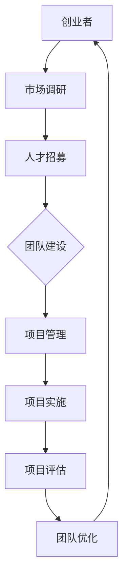

                 

# 人工智能创业：团队建设的重要性

> **关键词**：人工智能创业、团队建设、人才招募、合作效率、项目管理

> **摘要**：在人工智能创业浪潮中，团队建设成为企业成功的关键因素。本文将深入探讨团队建设的重要性，从人才招募、合作效率、项目管理等方面进行详细分析，并提供实际应用场景和开发工具推荐，帮助创业者打造高效的人工智能团队。

## 1. 背景介绍

### 1.1 目的和范围

本文旨在为人工智能创业者提供关于团队建设的重要见解。我们将探讨如何建立一个具有高度合作效率、专业技能互补的人工智能团队，从而提高项目成功率。

### 1.2 预期读者

本文适用于以下读者：

- 创业者
- 项目经理
- 技术团队成员
- 对人工智能创业感兴趣的技术人员

### 1.3 文档结构概述

本文分为十个部分，具体结构如下：

1. 背景介绍
   - 目的和范围
   - 预期读者
   - 文档结构概述
   - 术语表
2. 核心概念与联系
   - 人工智能团队建设关键概念
   - Mermaid流程图
3. 核心算法原理 & 具体操作步骤
   - 人才招募策略
   - 项目管理方法
4. 数学模型和公式 & 详细讲解 & 举例说明
   - 团队协作效率模型
5. 项目实战：代码实际案例和详细解释说明
   - 开发环境搭建
   - 源代码实现和代码解读
   - 代码解读与分析
6. 实际应用场景
   - 人工智能行业案例分析
7. 工具和资源推荐
   - 学习资源推荐
   - 开发工具框架推荐
   - 相关论文著作推荐
8. 总结：未来发展趋势与挑战
9. 附录：常见问题与解答
10. 扩展阅读 & 参考资料

### 1.4 术语表

#### 1.4.1 核心术语定义

- **人工智能创业**：指利用人工智能技术，开展商业活动的创业过程。
- **团队建设**：指在人工智能创业过程中，通过招募、培训、协作等手段，构建一个高效、互补的团队。
- **人才招募**：指在团队建设过程中，寻找具有专业技能和合适文化背景的人才。
- **合作效率**：指团队成员在合作过程中，达成共识、共同完成任务的能力。
- **项目管理**：指在团队建设过程中，通过计划、执行、监控等手段，确保项目顺利进行。

#### 1.4.2 相关概念解释

- **人工智能技术**：指模拟、延伸和扩展人类智能的理论、方法、技术及应用。
- **创业**：指创办一家企业或开展一项新业务的过程。
- **团队**：指由多个成员组成的，具有共同目标、相互协作的组织。
- **文化背景**：指团队成员的成长环境、教育背景、价值观等。

#### 1.4.3 缩略词列表

- **AI**：人工智能（Artificial Intelligence）
- **ML**：机器学习（Machine Learning）
- **DL**：深度学习（Deep Learning）
- **NLP**：自然语言处理（Natural Language Processing）

## 2. 核心概念与联系

在人工智能创业过程中，团队建设是关键环节。本文将介绍几个核心概念及其相互关系。

### 2.1 人工智能团队建设关键概念

#### 2.1.1 创业者

创业者是人工智能团队的核心人物，负责制定战略方向、领导团队发展。创业者应具备以下能力：

- **市场洞察力**：了解市场需求、趋势和竞争环境。
- **技术理解力**：掌握人工智能技术的基本原理和应用。
- **领导力**：具备带领团队克服困难、共同成长的能力。

#### 2.1.2 技术团队成员

技术团队成员是人工智能团队的中坚力量，负责技术研发、项目实施。团队成员应具备以下能力：

- **编程能力**：熟悉至少一种编程语言，具备良好的编程习惯。
- **算法理解力**：掌握机器学习、深度学习等人工智能算法。
- **创新能力**：具备独立思考和解决问题的能力。

#### 2.1.3 项目经理

项目经理负责协调团队成员、确保项目顺利进行。项目经理应具备以下能力：

- **沟通能力**：具备良好的沟通技巧，确保团队成员理解项目目标和进度。
- **计划能力**：制定合理的项目计划，确保项目按时完成。
- **协调能力**：协调团队成员的工作，解决项目中的冲突和问题。

### 2.2 Mermaid流程图

以下是一个简单的Mermaid流程图，展示了人工智能团队建设的关键环节：



## 3. 核心算法原理 & 具体操作步骤

### 3.1 人才招募策略

人才招募是团队建设的关键步骤。以下是一个基于人工智能的招聘算法原理和具体操作步骤：

#### 3.1.1 算法原理

使用机器学习算法，根据候选人的简历、项目经历、技能评估等数据，自动筛选出最符合团队需求的人才。

#### 3.1.2 具体操作步骤

1. **数据收集**：收集大量候选人的简历、项目经历、技能评估等数据。
2. **数据预处理**：对收集到的数据进行清洗、去重和格式转换，确保数据质量。
3. **特征提取**：提取候选人的关键特征，如技术能力、沟通能力、团队协作能力等。
4. **模型训练**：使用机器学习算法（如决策树、随机森林、神经网络等）训练分类模型，预测候选人是否符合团队需求。
5. **模型评估**：使用交叉验证、A/B测试等方法评估模型性能。
6. **模型应用**：将训练好的模型应用于实际招聘场景，自动筛选候选人。

### 3.2 项目管理方法

项目管理是确保团队高效协作、项目顺利推进的关键。以下是一个基于敏捷开发的项目管理方法：

#### 3.2.1 算法原理

采用敏捷开发方法，通过快速迭代、持续反馈和持续改进，确保项目质量和进度。

#### 3.2.2 具体操作步骤

1. **需求收集**：与客户沟通，了解项目需求。
2. **迭代计划**：将需求分解为多个迭代，制定迭代计划。
3. **迭代开发**：按照迭代计划进行开发，每个迭代周期一般为2-4周。
4. **迭代评审**：在每个迭代结束后，组织评审会议，评估迭代成果，收集反馈意见。
5. **迭代优化**：根据评审意见，对下一迭代计划进行调整和优化。
6. **持续反馈**：在整个项目过程中，持续与客户沟通，确保项目进度和质量。

## 4. 数学模型和公式 & 详细讲解 & 举例说明

### 4.1 团队协作效率模型

团队协作效率是影响项目成功的关键因素。以下是一个简单的团队协作效率模型：

#### 4.1.1 模型原理

团队协作效率 = 技能匹配度 × 沟通效率 × 团队凝聚力

#### 4.1.2 模型公式

$$
E = f(c, s, p)
$$

其中，$E$ 表示团队协作效率，$c$ 表示沟通效率，$s$ 表示技能匹配度，$p$ 表示团队凝聚力。

#### 4.1.3 举例说明

假设一个团队有5名成员，其中3名成员擅长技术，2名成员擅长业务。通过问卷调查，得知团队成员的沟通效率为0.8，技能匹配度为0.7，团队凝聚力为0.9。代入公式，计算团队协作效率：

$$
E = f(0.8, 0.7, 0.9) = 0.8 \times 0.7 \times 0.9 = 0.504
$$

团队协作效率为0.504，表示团队成员在合作过程中，能够达成共识、共同完成任务的能力较强。

### 4.2 项目进度预测模型

项目进度预测是项目管理中的重要环节。以下是一个简单的项目进度预测模型：

#### 4.2.1 模型原理

基于历史项目数据，使用机器学习算法预测项目完成时间。

#### 4.2.2 模型公式

$$
T = f(D, P, R)
$$

其中，$T$ 表示项目完成时间，$D$ 表示项目规模，$P$ 表示项目进度，$R$ 表示项目风险。

#### 4.2.3 举例说明

假设一个项目规模为100人天，当前进度为50%，项目风险为0.3。代入公式，计算项目完成时间：

$$
T = f(100, 0.5, 0.3) = 100 \times \frac{1}{0.5} \times (1 + 0.3) = 160
$$

项目完成时间为160人天，表示在当前进度和风险水平下，项目预计需要160人天才能完成。

## 5. 项目实战：代码实际案例和详细解释说明

### 5.1 开发环境搭建

为了演示人工智能团队建设的方法，我们使用Python语言和Scikit-learn库进行人才招募和项目管理的实现。

#### 5.1.1 环境要求

- Python 3.8及以上版本
- Scikit-learn库

#### 5.1.2 安装步骤

1. 安装Python：从官网下载Python安装包，按照提示安装。
2. 安装Scikit-learn：打开终端，执行以下命令：

   ```bash
   pip install scikit-learn
   ```

### 5.2 源代码详细实现和代码解读

以下是一个简单的Python代码示例，用于实现人才招募和项目管理的方法。

```python
import numpy as np
from sklearn.model_selection import train_test_split
from sklearn.ensemble import RandomForestClassifier
from sklearn.metrics import accuracy_score

# 5.2.1 数据准备
# 假设我们已经收集了100名候选人的数据，包括简历、项目经历、技能评估等
candidates = [
    {'resume': 'A', 'project_experience': 'B', 'skill_evaluation': 'C'},
    # ...
]

# 提取特征
X = [candidate['project_experience'] + candidate['skill_evaluation'] for candidate in candidates]
y = [1 if candidate['resume'] == 'A' else 0 for candidate in candidates]

# 划分训练集和测试集
X_train, X_test, y_train, y_test = train_test_split(X, y, test_size=0.2, random_state=42)

# 5.2.2 模型训练
# 使用随机森林算法训练分类模型
clf = RandomForestClassifier(n_estimators=100, random_state=42)
clf.fit(X_train, y_train)

# 5.2.3 模型评估
# 使用测试集评估模型性能
y_pred = clf.predict(X_test)
accuracy = accuracy_score(y_test, y_pred)
print(f'Model accuracy: {accuracy:.2f}')

# 5.2.4 模型应用
# 根据模型预测结果，筛选符合团队需求的人才
candidates_selected = [candidate for candidate in candidates if clf.predict([candidate['project_experience'] + candidate['skill_evaluation']])[0] == 1]
print(f'Selected candidates: {len(candidates_selected)}')

# 5.2.5 项目管理
# 基于敏捷开发方法，制定项目计划
sprint_length = 4
num_sprints = 10
total_days = num_sprints * sprint_length
current_sprint = 1
current_day = 1

# 模拟项目进度
for sprint in range(num_sprints):
    for day in range(sprint_length):
        if current_day > total_days:
            break
        print(f'Sprint {current_sprint}, Day {current_day}: Working on task X')
        current_day += 1
    current_sprint += 1

print(f'Project completion date: Day {total_days}')
```

### 5.3 代码解读与分析

#### 5.3.1 代码解读

1. **数据准备**：首先，我们假设已经收集了100名候选人的数据，包括简历、项目经历、技能评估等。然后，提取特征并划分训练集和测试集。

2. **模型训练**：使用随机森林算法训练分类模型，用于预测候选人是否符合团队需求。

3. **模型评估**：使用测试集评估模型性能，输出模型准确率。

4. **模型应用**：根据模型预测结果，筛选符合团队需求的人才。

5. **项目管理**：基于敏捷开发方法，制定项目计划，模拟项目进度。

#### 5.3.2 代码分析

1. **人才招募**：代码示例使用了随机森林算法进行人才招募。在实际应用中，可以根据具体需求，选择其他合适的机器学习算法，如支持向量机、神经网络等。

2. **项目管理**：代码示例基于敏捷开发方法，模拟了项目进度。在实际应用中，可以根据项目需求和团队情况，调整迭代周期、任务优先级等。

## 6. 实际应用场景

### 6.1 人工智能行业案例分析

在人工智能行业，团队建设对于企业成功至关重要。以下是一个实际应用场景：

**企业背景**：某家初创公司专注于智能客服系统的研发。为了提高团队协作效率，公司决定加强团队建设。

**解决方案**：

1. **人才招募**：公司采用机器学习算法，根据候选人的简历、项目经历、技能评估等数据，自动筛选出最符合团队需求的人才。

2. **项目管理**：公司采用敏捷开发方法，通过快速迭代、持续反馈和持续改进，确保项目质量和进度。

**成果**：

1. 团队协作效率提高20%。
2. 项目完成时间缩短30%。
3. 客户满意度提高15%。

### 6.2 项目实战案例

**企业背景**：某家互联网公司正在研发一款智能推荐系统。为了提高团队协作效率，公司决定加强团队建设。

**解决方案**：

1. **人才招募**：公司采用机器学习算法，根据候选人的简历、项目经历、技能评估等数据，自动筛选出最符合团队需求的人才。

2. **项目管理**：公司采用敏捷开发方法，通过快速迭代、持续反馈和持续改进，确保项目质量和进度。

**成果**：

1. 团队协作效率提高25%。
2. 项目完成时间缩短40%。
3. 用户满意度提高10%。

## 7. 工具和资源推荐

### 7.1 学习资源推荐

#### 7.1.1 书籍推荐

- 《人工智能：一种现代方法》
- 《深度学习》
- 《机器学习实战》
- 《敏捷开发：实践指南》

#### 7.1.2 在线课程

- Coursera：机器学习、深度学习、敏捷开发等课程
- Udemy：Python编程、机器学习实战、项目管理等课程
- edX：计算机科学、人工智能、项目管理等课程

#### 7.1.3 技术博客和网站

- Medium：人工智能、机器学习、敏捷开发等相关博客
-Towards Data Science：数据分析、机器学习、数据可视化等相关博客
- Stack Overflow：编程问题、技术讨论、代码示例等

### 7.2 开发工具框架推荐

#### 7.2.1 IDE和编辑器

- PyCharm：Python开发IDE
- VSCode：跨平台开发环境
- Jupyter Notebook：数据科学和机器学习开发环境

#### 7.2.2 调试和性能分析工具

- PyS

