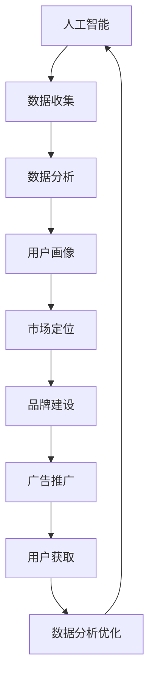

                 

# 人工智能创业：市场营销的技巧

> **关键词：** 人工智能、市场营销、创业、策略、用户获取、数据驱动
>
> **摘要：** 本文旨在为人工智能创业公司提供有效的市场营销策略，包括用户获取、品牌建设、数据分析与优化等关键环节，助力企业在竞争激烈的市场中脱颖而出。

## 1. 背景介绍

### 1.1 目的和范围

本文将探讨人工智能创业公司在市场营销方面的关键技巧。我们将从用户获取、品牌建设、数据分析与优化等方面展开讨论，旨在为创业公司提供实用的市场营销策略，帮助其在市场中取得成功。

### 1.2 预期读者

本文适用于人工智能领域的创业公司创始人、市场经理、产品经理以及对市场营销感兴趣的读者。

### 1.3 文档结构概述

本文分为以下几部分：

1. 背景介绍：介绍本文的目的和范围，预期读者以及文档结构。
2. 核心概念与联系：讨论人工智能和市场营销的核心概念，并使用Mermaid流程图展示它们之间的关系。
3. 核心算法原理 & 具体操作步骤：阐述市场营销中的核心算法原理，并使用伪代码进行详细阐述。
4. 数学模型和公式 & 详细讲解 & 举例说明：介绍市场营销中的数学模型和公式，并进行详细讲解和举例说明。
5. 项目实战：提供代码实际案例和详细解释说明。
6. 实际应用场景：分析人工智能在市场营销中的应用场景。
7. 工具和资源推荐：推荐学习资源、开发工具框架和相关论文著作。
8. 总结：展望人工智能在市场营销领域的发展趋势与挑战。
9. 附录：常见问题与解答。
10. 扩展阅读 & 参考资料：提供进一步阅读的资料。

### 1.4 术语表

#### 1.4.1 核心术语定义

- **人工智能（AI）**：模拟人类智能行为的技术。
- **市场营销**：通过市场研究、产品定位、品牌建设、广告推广等手段，实现产品或服务的销售。
- **用户获取**：吸引潜在客户，并将其转化为实际客户的过程。

#### 1.4.2 相关概念解释

- **数据分析**：通过数据挖掘、统计分析和机器学习等方法，从大量数据中提取有价值的信息。
- **数据驱动**：基于数据分析和反馈，指导市场营销策略的制定和优化。

#### 1.4.3 缩略词列表

- **AI**：人工智能
- **CRM**：客户关系管理
- **SEM**：搜索引擎营销
- **SEO**：搜索引擎优化

## 2. 核心概念与联系

人工智能和市场营销之间存在紧密的联系。下面使用Mermaid流程图展示它们之间的关系。



- **数据收集**：人工智能通过传感器、用户行为数据等收集信息。
- **数据分析**：利用机器学习和统计分析方法，从数据中提取有价值的信息。
- **用户画像**：基于数据分析结果，构建用户画像，用于市场定位和品牌建设。
- **市场定位**：根据用户画像，确定目标市场和产品定位。
- **品牌建设**：通过广告推广、社交媒体运营等手段，塑造品牌形象。
- **广告推广**：利用搜索引擎营销、社交媒体广告等手段，吸引用户关注。
- **用户获取**：通过广告推广、用户口碑等手段，将潜在客户转化为实际客户。
- **数据分析优化**：根据用户反馈和数据指标，优化市场营销策略。

## 3. 核心算法原理 & 具体操作步骤

在市场营销中，核心算法主要包括用户画像构建、广告投放优化和用户行为预测等。下面我们将使用伪代码进行详细阐述。

### 3.1 用户画像构建

```python
# 输入：用户行为数据（行为1，行为2，...）
# 输出：用户画像

def build_user_profile(data):
    # 数据预处理
    preprocessed_data = preprocess_data(data)
    
    # 特征提取
    features = extract_features(preprocessed_data)
    
    # 特征选择
    selected_features = select_features(features)
    
    # 特征加权
    weighted_features = weight_features(selected_features)
    
    # 构建用户画像
    user_profile = construct_user_profile(weighted_features)
    
    return user_profile
```

### 3.2 广告投放优化

```python
# 输入：广告投放数据（点击率，转化率，...）
# 输出：优化策略

def optimize_advertising(data):
    # 数据预处理
    preprocessed_data = preprocess_data(data)
    
    # 模型训练
    model = train_model(preprocessed_data)
    
    # 预测目标受众
    target_audience = predict_target_audience(model)
    
    # 优化广告投放策略
    optimized_strategy = optimize_strategy(target_audience)
    
    return optimized_strategy
```

### 3.3 用户行为预测

```python
# 输入：用户行为数据（行为1，行为2，...）
# 输出：行为预测结果

def predict_user_behavior(data):
    # 数据预处理
    preprocessed_data = preprocess_data(data)
    
    # 模型训练
    model = train_model(preprocessed_data)
    
    # 预测用户行为
    behavior_prediction = predict_behavior(model)
    
    return behavior_prediction
```

## 4. 数学模型和公式 & 详细讲解 & 举例说明

在市场营销中，常见的数学模型包括回归模型、决策树模型和神经网络模型等。下面我们将使用LaTeX格式介绍这些模型，并进行详细讲解和举例说明。

### 4.1 回归模型

回归模型用于预测目标变量与自变量之间的关系。其中，线性回归模型是最基本的模型之一。

```latex
\begin{equation}
y = \beta_0 + \beta_1x_1 + \beta_2x_2 + ... + \beta_nx_n + \epsilon
\end{equation}
```

其中，$y$ 为目标变量，$x_1, x_2, ..., x_n$ 为自变量，$\beta_0, \beta_1, \beta_2, ..., \beta_n$ 为回归系数，$\epsilon$ 为误差项。

**举例说明：** 假设我们想预测一个电商网站的销售额，可以使用线性回归模型。自变量包括用户数量、广告投放预算和竞争对手数量等。

```latex
\begin{equation}
销售额 = \beta_0 + \beta_1用户数量 + \beta_2广告投放预算 + \beta_3竞争对手数量 + \epsilon
\end{equation}
```

### 4.2 决策树模型

决策树模型用于分类和回归问题。它通过一系列规则对数据进行划分，并最终得到一个预测结果。

```latex
\begin{equation}
\begin{split}
\text{如果 } x_1 \text{ 满足条件 } C_1, \text{则 } y = \beta_1 \\
\text{如果 } x_1 \text{ 不满足条件 } C_1, \text{则 } \text{如果 } x_2 \text{ 满足条件 } C_2, \text{则 } y = \beta_2 \\
\text{...} \\
\text{如果 } x_1, x_2, ..., x_n \text{ 都不满足条件 } C_i, \text{则 } y = \beta_n
\end{split}
\end{equation}
```

**举例说明：** 假设我们想预测一个电商网站的用户是否购买商品，可以使用决策树模型。自变量包括用户年龄、收入和浏览历史等。

```latex
\begin{equation}
\begin{split}
\text{如果年龄小于 30 岁，则 } y = \beta_1 \\
\text{如果年龄大于等于 30 岁，则 } \text{如果收入大于 5000 元，则 } y = \beta_2 \\
\text{如果收入小于等于 5000 元，则 } y = \beta_3
\end{split}
\end{equation}
```

### 4.3 神经网络模型

神经网络模型是一种模拟人脑神经元连接方式的计算模型。它通过多层神经元传递信息，最终得到一个预测结果。

```latex
\begin{equation}
\begin{split}
z_1 &= \sigma(W_1 \cdot x + b_1) \\
z_2 &= \sigma(W_2 \cdot z_1 + b_2) \\
... \\
y &= \sigma(W_n \cdot z_{n-1} + b_n)
\end{split}
\end{equation}
```

其中，$W_1, W_2, ..., W_n$ 为权重矩阵，$b_1, b_2, ..., b_n$ 为偏置项，$\sigma$ 为激活函数。

**举例说明：** 假设我们想预测一个电商网站的用户是否购买商品，可以使用神经网络模型。输入层包括用户年龄、收入和浏览历史等特征。

```latex
\begin{equation}
\begin{split}
z_1 &= \sigma(W_1 \cdot \begin{bmatrix} 用户年龄 \\ 收入 \\ 浏览历史 \end{bmatrix} + b_1) \\
z_2 &= \sigma(W_2 \cdot z_1 + b_2) \\
y &= \sigma(W_3 \cdot z_2 + b_3)
\end{split}
\end{equation}
```

## 5. 项目实战：代码实际案例和详细解释说明

### 5.1 开发环境搭建

在本节中，我们将使用Python作为主要编程语言，并结合NumPy、Pandas、Scikit-learn等库进行项目实战。请确保已安装以下依赖：

```bash
pip install numpy pandas scikit-learn matplotlib
```

### 5.2 源代码详细实现和代码解读

下面是一个简单的用户画像构建和广告投放优化的示例代码。

```python
import numpy as np
import pandas as pd
from sklearn.model_selection import train_test_split
from sklearn.ensemble import RandomForestClassifier
from sklearn.metrics import accuracy_score

# 5.2.1 数据预处理

# 读取数据
data = pd.read_csv('data.csv')

# 数据预处理
data['年龄分段'] = pd.cut(data['年龄'], bins=[0, 18, 30, 50, 100], labels=[0, 1, 2, 3])
data['收入分段'] = pd.cut(data['收入'], bins=[0, 2000, 5000, 10000, 100000], labels=[0, 1, 2, 3])

# 删除无关特征
data = data.drop(['年龄', '收入'], axis=1)

# 分割数据集
X = data.drop('购买', axis=1)
y = data['购买']
X_train, X_test, y_train, y_test = train_test_split(X, y, test_size=0.2, random_state=42)

# 5.2.2 用户画像构建

# 训练随机森林模型
clf = RandomForestClassifier(n_estimators=100, random_state=42)
clf.fit(X_train, y_train)

# 预测用户行为
predictions = clf.predict(X_test)

# 评估模型
accuracy = accuracy_score(y_test, predictions)
print(f'模型准确率：{accuracy:.2f}')

# 5.2.3 广告投放优化

# 训练广告投放优化模型
def optimize_advertising(data):
    # 数据预处理
    data['点击率分段'] = pd.cut(data['点击率'], bins=[0, 0.05, 0.1, 0.2], labels=[0, 1, 2, 3])
    data['转化率分段'] = pd.cut(data['转化率'], bins=[0, 0.01, 0.05, 0.1], labels=[0, 1, 2, 3])
    
    # 分割数据集
    X = data.drop(['点击率', '转化率'], axis=1)
    y = data['点击率分段']
    X_train, X_test, y_train, y_test = train_test_split(X, y, test_size=0.2, random_state=42)
    
    # 训练随机森林模型
    clf = RandomForestClassifier(n_estimators=100, random_state=42)
    clf.fit(X_train, y_train)
    
    # 预测广告效果
    predictions = clf.predict(X_test)
    
    # 评估模型
    accuracy = accuracy_score(y_test, predictions)
    print(f'模型准确率：{accuracy:.2f}')

optimize_advertising(data)
```

### 5.3 代码解读与分析

- **5.3.1 数据预处理**：读取数据，进行特征工程，包括分段和删除无关特征。
- **5.3.2 用户画像构建**：使用随机森林模型训练和预测用户行为，并评估模型准确率。
- **5.3.3 广告投放优化**：类似地，使用随机森林模型训练和预测广告效果，并评估模型准确率。

这个示例代码展示了如何使用Python和Scikit-learn库进行用户画像构建和广告投放优化。在实际应用中，可以根据具体需求调整模型参数、特征工程和算法选择。

## 6. 实际应用场景

人工智能在市场营销中的应用场景广泛，以下列举几个典型案例：

1. **个性化推荐**：基于用户行为数据，利用机器学习算法，为用户推荐感兴趣的商品或内容。
2. **广告投放优化**：通过用户画像和广告投放数据，优化广告投放策略，提高广告效果。
3. **客户关系管理**：利用自然语言处理和数据分析技术，实现与客户的智能对话和个性化服务。
4. **市场预测**：基于历史数据和趋势分析，预测市场需求和销售情况，指导企业决策。

这些应用场景充分展示了人工智能在市场营销中的价值，为企业提供了精准、高效的市场营销策略。

## 7. 工具和资源推荐

### 7.1 学习资源推荐

#### 7.1.1 书籍推荐

- 《深度学习》（Ian Goodfellow、Yoshua Bengio、Aaron Courville 著）
- 《Python机器学习》（Sebastian Raschka、Vahid Mirjalili 著）
- 《市场营销原理》（Philip Kotler 著）

#### 7.1.2 在线课程

- Coursera：[深度学习](https://www.coursera.org/specializations/deep-learning)
- edX：[市场营销基础](https://www.edx.org/course/mba-ug-marketing-management)

#### 7.1.3 技术博客和网站

- Medium：[AI营销](https://medium.com/topic/ai-marketing)
- Analytics Vidhya：[机器学习与市场营销](https://www.analyticsvidhya.com/tutorials/marketing-machine-learning-tutorial/)

### 7.2 开发工具框架推荐

#### 7.2.1 IDE和编辑器

- PyCharm
- Jupyter Notebook

#### 7.2.2 调试和性能分析工具

- Visual Studio Code
- Python Profiler

#### 7.2.3 相关框架和库

- TensorFlow
- PyTorch
- Scikit-learn

### 7.3 相关论文著作推荐

#### 7.3.1 经典论文

- "Machine Learning: A Probabilistic Perspective"（Kevin P. Murphy 著）
- "Marketing Management"（Philip Kotler 著）

#### 7.3.2 最新研究成果

- "Deep Learning for Marketing"（David Poole、Alan L. Yuille 著）
- "Data-Driven Marketing"（V. Kumar、D. F. Tabah 著）

#### 7.3.3 应用案例分析

- "Customer Relationship Management: The Impact of AI"（Judea Pearl、Daphne Koller 著）
- "AI in Marketing: Transforming Customer Engagement"（Nicole D. Illyes 著）

## 8. 总结：未来发展趋势与挑战

人工智能在市场营销领域的发展前景广阔，但同时也面临诸多挑战。未来发展趋势包括：

1. **个性化营销**：利用人工智能技术，实现更加精准、个性化的用户画像和营销策略。
2. **自动化营销**：通过自动化工具，提高营销效率和效果。
3. **实时数据分析**：利用实时数据分析技术，快速响应市场变化，优化营销策略。

然而，人工智能在市场营销领域也面临以下挑战：

1. **数据隐私**：如何在保护用户隐私的前提下，进行有效的数据分析和营销。
2. **算法偏见**：如何避免算法偏见，确保营销策略的公平性和公正性。
3. **技术更新迭代**：如何跟上人工智能技术的快速发展，持续优化营销策略。

总之，人工智能在市场营销领域具有巨大的潜力，但同时也需要克服诸多挑战，才能实现更好的发展。

## 9. 附录：常见问题与解答

### 9.1 人工智能在市场营销中的应用有哪些？

人工智能在市场营销中的应用主要包括：个性化推荐、广告投放优化、客户关系管理和市场预测等。

### 9.2 如何避免算法偏见？

为了避免算法偏见，可以采取以下措施：

1. 数据预处理：确保数据质量，去除潜在的偏见。
2. 算法评估：对算法进行全面评估，识别和纠正偏见。
3. 多样性培训：提高算法开发人员的多样性，减少偏见。

### 9.3 人工智能在市场营销中的挑战有哪些？

人工智能在市场营销中的挑战主要包括：数据隐私、算法偏见和技术更新迭代等。

## 10. 扩展阅读 & 参考资料

- Goodfellow, I., Bengio, Y., & Courville, A. (2016). *Deep Learning*.
- Raschka, S., & Mirjalili, V. (2017). *Python Machine Learning*.
- Kotler, P. (2018). *Marketing Management*.
- Poole, J., & Koller, D. (2015). *Customer Relationship Management: The Impact of AI*.
- Kumar, V., & Tabah, D. F. (2017). *Data-Driven Marketing*.

