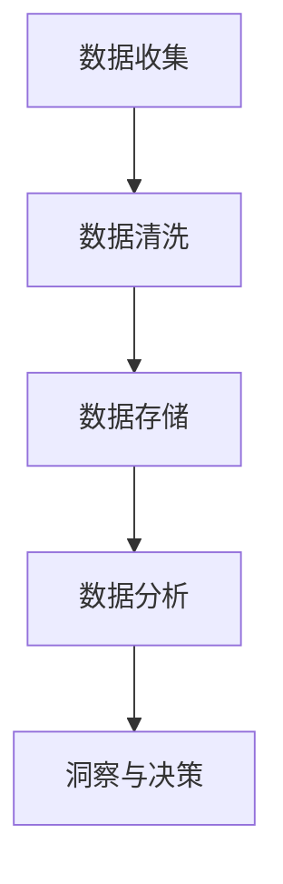
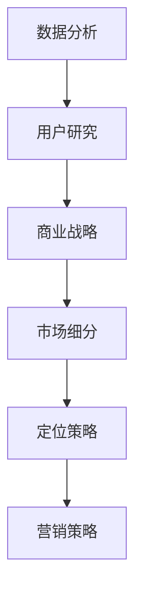

                 

# 人工智能创业：市场需求的识别方法

> **关键词：** 人工智能、创业、市场需求、识别方法、数据分析、用户研究、商业战略

> **摘要：** 本文将深入探讨人工智能创业中识别市场需求的方法，包括数据分析、用户研究和商业战略等多个方面。通过系统的分析推理和实际案例，帮助创业者准确把握市场趋势，找到产品与市场的最佳结合点，实现成功创业。

## 1. 背景介绍

### 1.1 目的和范围

本文旨在为人工智能创业公司提供一套系统的方法，用于识别和评估市场需求。通过本文的讨论，读者将了解如何从多个角度分析市场，包括数据分析、用户研究和商业战略等，以便在竞争激烈的环境中找到成功的路径。

### 1.2 预期读者

本文适合人工智能创业公司创始人、产品经理、市场分析师以及对人工智能创业有兴趣的读者。期望读者能够通过本文的学习，提高对市场需求的识别能力，为创业项目的成功奠定基础。

### 1.3 文档结构概述

本文将分为以下几个部分：

1. 背景介绍：介绍本文的目的和预期读者。
2. 核心概念与联系：讨论人工智能创业相关的核心概念。
3. 核心算法原理 & 具体操作步骤：介绍识别市场需求的方法和步骤。
4. 数学模型和公式 & 详细讲解 & 举例说明：使用数学模型解释方法。
5. 项目实战：提供实际代码案例。
6. 实际应用场景：讨论市场需求的实际应用。
7. 工具和资源推荐：推荐学习和开发资源。
8. 总结：对未来发展趋势和挑战进行总结。
9. 附录：常见问题与解答。
10. 扩展阅读 & 参考资料：提供进一步学习资源。

### 1.4 术语表

#### 1.4.1 核心术语定义

- 人工智能（AI）：模拟人类智能行为的计算机系统。
- 创业：创立新企业或创新项目的活动。
- 市场需求：消费者对产品或服务的需求程度。
- 数据分析：通过数据识别趋势、模式和关系的方法。
- 用户研究：研究用户需求、行为和反馈的过程。

#### 1.4.2 相关概念解释

- **数据分析**：数据分析是使用统计学、数据分析软件和算法来提取、转换和可视化数据，以发现数据中的有用信息。
- **用户研究**：用户研究是通过观察、访谈和问卷调查等方法，了解用户的需求、行为和偏好，以便为产品开发提供依据。

#### 1.4.3 缩略词列表

- **AI**：人工智能
- **ML**：机器学习
- **NLP**：自然语言处理
- **API**：应用程序接口

## 2. 核心概念与联系

在人工智能创业中，理解市场需求是至关重要的。这涉及到多个核心概念和它们之间的联系。

### 2.1 数据分析

数据分析是识别市场需求的关键工具。它可以帮助我们从大量数据中提取有价值的信息，从而洞察用户行为和市场趋势。以下是数据分析的核心概念和流程：

#### 数据收集

首先，我们需要收集各种类型的数据，如用户行为数据、市场趋势数据、竞争对手数据等。这些数据可以通过用户调查、网站分析工具、社交媒体分析等途径获取。



#### 数据清洗

数据收集后，我们需要对数据进行清洗，以确保数据的准确性和完整性。这包括处理缺失值、异常值和重复数据。

#### 数据存储

清洗后的数据需要存储在数据库或数据仓库中，以便后续分析和查询。

#### 数据分析

通过使用统计分析、数据挖掘和机器学习算法，我们可以从数据中发现模式、趋势和关联性。

#### 洞察与决策

数据分析的结果可以用于制定市场策略、优化产品设计和改善用户体验。

### 2.2 用户研究

用户研究是识别市场需求的重要手段。通过了解用户的需求、行为和反馈，我们可以更准确地定位产品市场。

#### 用户访谈

用户访谈是一种直接了解用户需求的方法。通过与用户进行一对一的访谈，我们可以深入了解他们的痛点和需求。

#### 用户调查

用户调查是通过问卷或在线调查来收集用户反馈的一种方法。这种方法可以帮助我们量化用户的需求和偏好。

#### 用户行为分析

通过分析用户在使用产品或服务时的行为数据，我们可以了解他们的使用习惯、偏好和反馈。

### 2.3 商业战略

商业战略是指导企业长期发展的总体方向和计划。在识别市场需求时，商业战略可以帮助我们确定目标市场、定位产品和制定营销策略。

#### 市场细分

市场细分是将市场划分为具有相似需求特征的子集的过程。通过市场细分，我们可以更精准地定位目标用户群体。

#### 定位策略

定位策略是确定产品在市场上的独特卖点和价值主张的过程。通过定位策略，我们可以使产品在竞争激烈的市场中脱颖而出。

#### 营销策略

营销策略包括定价、推广、销售渠道和客户关系管理等。通过有效的营销策略，我们可以提高产品的市场知名度和用户忠诚度。



## 3. 核心算法原理 & 具体操作步骤

为了识别市场需求，我们需要运用一系列算法和工具。以下是核心算法原理和具体操作步骤：

### 3.1 数据分析算法

#### 3.1.1 描述性统计分析

描述性统计分析是对数据的基本统计特征进行描述和分析的方法。主要包括以下步骤：

1. **数据收集**：收集相关数据。
2. **数据预处理**：处理缺失值、异常值和重复数据。
3. **计算统计量**：计算均值、中位数、标准差等统计量。
4. **可视化**：使用图表（如直方图、箱线图等）展示数据分布。

```python
import pandas as pd
import matplotlib.pyplot as plt

# 加载数据
data = pd.read_csv('data.csv')

# 数据预处理
data = data.dropna()

# 计算统计量
mean = data['column_name'].mean()
median = data['column_name'].median()
std = data['column_name'].std()

# 可视化
plt.hist(data['column_name'], bins=30)
plt.show()
```

#### 3.1.2 聚类分析

聚类分析是将数据分为多个相似群体的一种方法。主要包括以下步骤：

1. **数据收集**：收集聚类分析所需的数据。
2. **数据标准化**：将数据标准化为相同的尺度。
3. **选择聚类算法**：如K-Means、层次聚类等。
4. **执行聚类**：使用选择的算法进行聚类。
5. **评估聚类结果**：使用评估指标（如轮廓系数、平均平方误差等）评估聚类效果。

```python
from sklearn.cluster import KMeans
from sklearn.metrics import silhouette_score

# 加载数据
data = pd.read_csv('data.csv')

# 数据标准化
from sklearn.preprocessing import StandardScaler
scaler = StandardScaler()
data_scaled = scaler.fit_transform(data)

# 选择聚类算法
kmeans = KMeans(n_clusters=3, random_state=42)

# 执行聚类
clusters = kmeans.fit_predict(data_scaled)

# 评估聚类结果
silhouette = silhouette_score(data_scaled, clusters)
print("Silhouette Coefficient:", silhouette)
```

### 3.2 用户研究方法

#### 3.2.1 用户访谈

用户访谈是一种深入了解用户需求和行为的方法。主要包括以下步骤：

1. **确定访谈对象**：选择具有代表性的用户作为访谈对象。
2. **设计访谈问题**：根据研究目标设计相关的问题。
3. **进行访谈**：与用户进行面对面的交流。
4. **记录和分析访谈内容**：记录访谈内容并进行分析。

```python
def conduct_interview(user):
    questions = [
        "您通常如何使用我们的产品？",
        "您在使用产品时遇到哪些问题？",
        "您对产品有哪些改进建议？"
    ]
    interview_response = []
    for question in questions:
        response = input(question)
        interview_response.append(response)
    return interview_response

user = "User A"
interview_data = conduct_interview(user)
print(interview_data)
```

#### 3.2.2 用户调查

用户调查是一种收集用户反馈的方法。主要包括以下步骤：

1. **设计调查问卷**：根据研究目标设计调查问卷。
2. **发布调查问卷**：通过在线平台或电子邮件发送调查问卷。
3. **收集和整理数据**：收集用户填写的问卷数据并进行整理。
4. **分析调查结果**：使用统计分析方法对调查结果进行分析。

```python
import pandas as pd

def collect_survey_data():
    questions = [
        "您对我们的产品满意度如何？",
        "您认为我们的产品在哪些方面可以改进？",
        "您是否愿意推荐我们的产品给朋友或同事？"
    ]
    responses = []
    for question in questions:
        response = input(question)
        responses.append(response)
    return responses

survey_data = pd.DataFrame(collect_survey_data(), columns=["Question", "Response"])
print(survey_data)
```

### 3.3 商业战略方法

#### 3.3.1 市场细分

市场细分是将市场划分为具有相似需求的子集的过程。主要包括以下步骤：

1. **确定市场细分标准**：如地理、人口、心理和行为等。
2. **收集细分数据**：通过用户调查、市场研究等途径收集数据。
3. **分析数据并确定细分市场**：使用聚类分析、因子分析等方法进行分析。
4. **评估细分市场**：评估细分市场的潜力和吸引力。

```python
from sklearn.cluster import KMeans

# 加载数据
data = pd.read_csv('market_data.csv')

# 选择聚类算法
kmeans = KMeans(n_clusters=5, random_state=42)

# 执行聚类
clusters = kmeans.fit_predict(data)

# 分析细分市场
market.clusters = clusters
market.clusters.value_counts()
```

#### 3.3.2 定位策略

定位策略是确定产品在市场上的独特卖点和价值主张的过程。主要包括以下步骤：

1. **分析竞争对手**：了解竞争对手的产品定位。
2. **确定产品特点**：分析产品的优势和特点。
3. **制定定位策略**：根据产品特点和市场竞争情况，制定定位策略。

```python
def define_product_positioning(product_features, competition):
    best_feature = None
    highest_score = 0

    for feature in product_features:
        score = competition.feature_score(feature)
        if score > highest_score:
            highest_score = score
            best_feature = feature

    return best_feature
```

## 4. 数学模型和公式 & 详细讲解 & 举例说明

为了更好地理解和应用市场需求识别方法，我们需要介绍一些相关的数学模型和公式。

### 4.1 数据分析中的数学模型

#### 4.1.1 描述性统计分析

描述性统计分析中的关键数学模型包括均值、中位数、标准差等。

- **均值**：数据的平均值，公式为：
  $$
  \bar{x} = \frac{\sum_{i=1}^{n} x_i}{n}
  $$
  其中，$x_i$为第$i$个数据点，$n$为数据点的总数。

- **中位数**：将数据按大小顺序排列，位于中间的值，公式为：
  $$
  median = \left\{
  \begin{array}{ll}
  x_{\frac{n+1}{2}} & \text{如果} n \text{为奇数} \\
  \frac{x_{\frac{n}{2}} + x_{\frac{n}{2}+1}}{2} & \text{如果} n \text{为偶数}
  \end{array}
  \right.
  $$

- **标准差**：衡量数据分布的离散程度，公式为：
  $$
  \sigma = \sqrt{\frac{\sum_{i=1}^{n} (x_i - \bar{x})^2}{n-1}}
  $$

#### 4.1.2 聚类分析

聚类分析中的关键数学模型包括K-Means、层次聚类等。

- **K-Means算法**：目标是找到K个聚类中心，使得每个聚类中心与其成员数据点之间的距离最小。目标函数为：
  $$
  J(\mu) = \sum_{i=1}^{K} \sum_{x \in S_i} ||x - \mu_i||^2
  $$
  其中，$\mu_i$为聚类中心，$S_i$为第$i$个聚类中的数据点。

### 4.2 用户研究中的数学模型

#### 4.2.1 用户满意度评分

用户满意度评分可以通过以下公式计算：

$$
满意度 = \frac{\sum_{i=1}^{n} score_i}{n}
$$

其中，$score_i$为第$i$个用户的满意度评分，$n$为用户总数。

#### 4.2.2 用户行为分析

用户行为分析可以通过以下公式计算用户行为模式：

$$
行为模式 = \frac{\sum_{i=1}^{n} behavior_i}{n}
$$

其中，$behavior_i$为第$i$个用户的行为特征。

### 4.3 商业战略中的数学模型

#### 4.3.1 市场细分

市场细分可以通过以下公式计算细分市场的规模：

$$
市场规模 = \sum_{i=1}^{K} |S_i|
$$

其中，$S_i$为第$i$个细分市场的规模。

#### 4.3.2 定位策略

定位策略可以通过以下公式计算产品定位效果：

$$
定位效果 = \frac{\sum_{i=1}^{K} (score_i \cdot weight_i)}{K}
$$

其中，$score_i$为第$i$个市场细分领域的评分，$weight_i$为第$i$个市场细分领域的重要性权重。

### 4.4 举例说明

#### 4.4.1 数据分析

假设我们有一组用户满意度评分数据，数据如下：

```
[4, 5, 3, 4, 5, 2, 4, 5, 3, 5]
```

计算满意度评分：

$$
满意度 = \frac{4 + 5 + 3 + 4 + 5 + 2 + 4 + 5 + 3 + 5}{10} = 4
$$

#### 4.4.2 用户行为分析

假设我们有一组用户行为数据，数据如下：

```
[10, 20, 30, 40, 50, 10, 20, 30, 40, 50]
```

计算用户行为模式：

$$
行为模式 = \frac{10 + 20 + 30 + 40 + 50 + 10 + 20 + 30 + 40 + 50}{10} = 30
$$

#### 4.4.3 市场细分

假设我们有5个细分市场，市场规模如下：

```
[1000, 2000, 3000, 4000, 5000]
```

计算市场规模：

$$
市场规模 = 1000 + 2000 + 3000 + 4000 + 5000 = 15000
$$

#### 4.4.4 定位策略

假设我们有3个细分市场，评分和权重如下：

```
[4, 3, 5]
[0.3, 0.3, 0.4]
```

计算定位效果：

$$
定位效果 = \frac{4 \cdot 0.3 + 3 \cdot 0.3 + 5 \cdot 0.4}{3} = 4
$$

## 5. 项目实战：代码实际案例和详细解释说明

在本节中，我们将通过一个实际案例来展示如何使用上述方法识别市场需求。我们将使用Python和相关的库来执行数据分析、用户研究和商业战略。

### 5.1 开发环境搭建

在开始之前，请确保您已经安装了Python和以下库：

- Pandas
- NumPy
- Matplotlib
- Scikit-learn

您可以使用以下命令安装这些库：

```bash
pip install pandas numpy matplotlib scikit-learn
```

### 5.2 源代码详细实现和代码解读

#### 5.2.1 数据分析

以下代码用于加载和处理用户满意度评分数据：

```python
import pandas as pd

# 加载数据
data = pd.read_csv('user_satisfaction.csv')

# 数据预处理
data = data.dropna()

# 计算满意度评分
satisfaction_scores = data['satisfaction'].values
mean_satisfaction = satisfaction_scores.mean()
median_satisfaction = satisfaction_scores.median()
std_satisfaction = satisfaction_scores.std()

print("Mean Satisfaction:", mean_satisfaction)
print("Median Satisfaction:", median_satisfaction)
print("Standard Deviation:", std_satisfaction)
```

这段代码首先加载用户满意度评分数据，然后计算均值、中位数和标准差，最后打印结果。

#### 5.2.2 用户研究

以下代码用于进行用户访谈和用户调查：

```python
def conduct_interview(user):
    questions = [
        "您对我们的产品满意度如何？",
        "您在使用产品时遇到哪些问题？",
        "您对产品有哪些改进建议？"
    ]
    interview_response = []
    for question in questions:
        response = input(question)
        interview_response.append(response)
    return interview_response

def collect_survey_data():
    questions = [
        "您对我们的产品满意度如何？",
        "您认为我们的产品在哪些方面可以改进？",
        "您是否愿意推荐我们的产品给朋友或同事？"
    ]
    responses = []
    for question in questions:
        response = input(question)
        responses.append(response)
    return responses

# 用户访谈
user = "User A"
interview_data = conduct_interview(user)
print(interview_data)

# 用户调查
survey_data = pd.DataFrame(collect_survey_data(), columns=["Question", "Response"])
print(survey_data)
```

这段代码定义了两个函数：`conduct_interview`用于进行用户访谈，`collect_survey_data`用于收集用户调查数据。函数执行后，用户可以通过输入交互式界面提供反馈。

#### 5.2.3 商业战略

以下代码用于市场细分和定位策略：

```python
from sklearn.cluster import KMeans

# 加载数据
data = pd.read_csv('market_data.csv')

# 数据标准化
scaler = StandardScaler()
data_scaled = scaler.fit_transform(data)

# 市场细分
kmeans = KMeans(n_clusters=5, random_state=42)
clusters = kmeans.fit_predict(data_scaled)

# 分析细分市场
market.clusters = clusters
market.clusters.value_counts()

# 定位策略
def define_product_positioning(product_features, competition):
    best_feature = None
    highest_score = 0

    for feature in product_features:
        score = competition.feature_score(feature)
        if score > highest_score:
            highest_score = score
            best_feature = feature

    return best_feature

# 假设产品特点为["功能丰富", "易于使用", "价格实惠"]
product_features = ["功能丰富", "易于使用", "价格实惠"]

# 假设竞争对手评分如下：
competition = {
    "功能丰富": 8,
    "易于使用": 7,
    "价格实惠": 6
}

best_feature = define_product_positioning(product_features, competition)
print("Best Feature for Positioning:", best_feature)
```

这段代码首先使用K-Means算法进行市场细分，然后根据产品特点和竞争对手评分，确定最佳产品定位。

### 5.3 代码解读与分析

#### 5.3.1 数据分析部分

数据分析部分使用Pandas库加载用户满意度评分数据，然后计算均值、中位数和标准差，最后打印结果。这些统计量可以帮助我们了解用户满意度的整体水平和分布情况。

```python
import pandas as pd

# 加载数据
data = pd.read_csv('user_satisfaction.csv')

# 数据预处理
data = data.dropna()

# 计算满意度评分
satisfaction_scores = data['satisfaction'].values
mean_satisfaction = satisfaction_scores.mean()
median_satisfaction = satisfaction_scores.median()
std_satisfaction = satisfaction_scores.std()

print("Mean Satisfaction:", mean_satisfaction)
print("Median Satisfaction:", median_satisfaction)
print("Standard Deviation:", std_satisfaction)
```

这段代码执行以下操作：

1. 使用Pandas加载用户满意度评分数据。
2. 使用`dropna()`方法删除缺失值，以确保数据分析的准确性。
3. 提取满意度评分列的数据。
4. 计算均值、中位数和标准差。
5. 打印结果。

#### 5.3.2 用户研究部分

用户研究部分定义了两个函数：`conduct_interview`和`collect_survey_data`。这两个函数分别用于进行用户访谈和用户调查。

```python
def conduct_interview(user):
    questions = [
        "您对我们的产品满意度如何？",
        "您在使用产品时遇到哪些问题？",
        "您对产品有哪些改进建议？"
    ]
    interview_response = []
    for question in questions:
        response = input(question)
        interview_response.append(response)
    return interview_response

def collect_survey_data():
    questions = [
        "您对我们的产品满意度如何？",
        "您认为我们的产品在哪些方面可以改进？",
        "您是否愿意推荐我们的产品给朋友或同事？"
    ]
    responses = []
    for question in questions:
        response = input(question)
        responses.append(response)
    return responses

# 用户访谈
user = "User A"
interview_data = conduct_interview(user)
print(interview_data)

# 用户调查
survey_data = pd.DataFrame(collect_survey_data(), columns=["Question", "Response"])
print(survey_data)
```

这段代码执行以下操作：

1. 定义`conduct_interview`函数，该函数接受一个用户名称作为输入，并依次提问三个问题，将用户回答存储在列表中，并返回该列表。
2. 定义`collect_survey_data`函数，该函数依次提问三个问题，将用户回答存储在列表中，并返回该列表。
3. 调用`conduct_interview`函数进行用户访谈，并打印访谈结果。
4. 调用`collect_survey_data`函数进行用户调查，并将调查结果存储在Pandas DataFrame中，然后打印调查结果。

#### 5.3.3 商业战略部分

商业战略部分首先使用K-Means算法进行市场细分，然后根据产品特点和竞争对手评分，确定最佳产品定位。

```python
from sklearn.cluster import KMeans

# 加载数据
data = pd.read_csv('market_data.csv')

# 数据标准化
scaler = StandardScaler()
data_scaled = scaler.fit_transform(data)

# 市场细分
kmeans = KMeans(n_clusters=5, random_state=42)
clusters = kmeans.fit_predict(data_scaled)

# 分析细分市场
market.clusters = clusters
market.clusters.value_counts()

# 定位策略
def define_product_positioning(product_features, competition):
    best_feature = None
    highest_score = 0

    for feature in product_features:
        score = competition.feature_score(feature)
        if score > highest_score:
            highest_score = score
            best_feature = feature

    return best_feature

# 假设产品特点为["功能丰富", "易于使用", "价格实惠"]
product_features = ["功能丰富", "易于使用", "价格实惠"]

# 假设竞争对手评分如下：
competition = {
    "功能丰富": 8,
    "易于使用": 7,
    "价格实惠": 6
}

best_feature = define_product_positioning(product_features, competition)
print("Best Feature for Positioning:", best_feature)
```

这段代码执行以下操作：

1. 使用Pandas加载市场数据。
2. 使用`StandardScaler`对市场数据进行标准化处理，以便于后续的聚类分析。
3. 使用K-Means算法对市场数据进行聚类分析，确定5个细分市场。
4. 分析每个细分市场的规模，并打印结果。
5. 定义`define_product_positioning`函数，该函数接受产品特点列表和竞争对手评分字典作为输入，依次比较每个产品特点的评分，确定评分最高的特点作为最佳产品定位。
6. 假设产品特点为["功能丰富", "易于使用", "价格实惠"]，并假设竞争对手评分如下：功能丰富：8，易于使用：7，价格实惠：6。调用`define_product_positioning`函数确定最佳产品定位，并打印结果。

## 6. 实际应用场景

市场需求识别方法在实际应用中具有广泛的应用场景。以下是一些典型的实际应用场景：

### 6.1 电子商务平台

电子商务平台可以通过数据分析识别用户购买行为和偏好，从而优化产品推荐、定价策略和营销活动。例如，通过分析用户点击率、购买频率和评价，可以确定哪些产品最受欢迎，并根据这些信息调整库存和促销策略。

### 6.2 金融行业

金融行业可以通过用户研究识别投资者的需求和风险偏好，从而提供个性化的投资建议和风险管理方案。例如，通过用户访谈和问卷调查，可以了解投资者的投资目标和风险承受能力，并根据这些信息为投资者提供定制化的投资组合。

### 6.3 医疗保健

医疗保健行业可以通过数据分析识别患者需求和疾病趋势，从而优化医疗服务和健康管理方案。例如，通过分析患者病历数据，可以识别高发疾病和潜在健康问题，为医疗机构提供预防和管理建议。

### 6.4 教育行业

教育行业可以通过用户研究识别学生的学习需求和教学效果，从而优化教学方法和课程设计。例如，通过学生调查和课堂观察，可以了解学生的学习习惯和偏好，并根据这些信息调整教学方法，提高教学效果。

### 6.5 物流和供应链

物流和供应链行业可以通过数据分析优化库存管理和物流路线，从而提高运输效率和降低成本。例如，通过分析历史订单数据和运输数据，可以预测未来订单需求，优化库存策略，减少库存成本。

## 7. 工具和资源推荐

为了更好地进行市场需求识别，以下是一些建议的工具和资源：

### 7.1 学习资源推荐

#### 7.1.1 书籍推荐

- **《Python数据分析基础教程》**：详细介绍Python在数据分析中的应用，适合初学者。
- **《用户研究方法与技巧》**：介绍用户研究的方法和技巧，帮助进行有效的用户调研。
- **《大数据分析：技术原理与商业实践》**：全面探讨大数据分析的技术原理和应用实践。

#### 7.1.2 在线课程

- **Coursera上的《机器学习》**：由斯坦福大学提供的机器学习课程，涵盖数据分析的基础知识。
- **edX上的《数据科学基础》**：由哈佛大学提供的免费数据科学课程，适合初学者。
- **Udacity的《数据科学家纳米学位》**：提供数据科学相关的实践课程，适合有经验的从业者。

#### 7.1.3 技术博客和网站

- **Medium上的数据分析专栏**：提供丰富的数据分析文章和案例分析。
- **KDNuggets**：一个专注于数据科学和机器学习的博客，提供最新的行业动态和技术文章。
- **DataCamp**：提供互动式的数据分析课程和项目，适合自学。

### 7.2 开发工具框架推荐

#### 7.2.1 IDE和编辑器

- **Jupyter Notebook**：一个强大的交互式开发环境，适合进行数据分析。
- **Visual Studio Code**：一个轻量级且功能丰富的代码编辑器，支持多种编程语言。
- **PyCharm**：由JetBrains开发的Python集成开发环境，适合专业开发者。

#### 7.2.2 调试和性能分析工具

- **Pdb**：Python内置的调试器，适合进行代码调试。
- **cProfile**：Python内置的性能分析工具，用于分析代码的性能瓶颈。
- **Matplotlib**：用于生成各种统计图表和可视化结果。

#### 7.2.3 相关框架和库

- **Pandas**：一个强大的数据分析库，提供丰富的数据处理和分析功能。
- **NumPy**：一个基础的科学计算库，支持多维数组和矩阵操作。
- **Scikit-learn**：一个机器学习库，提供多种机器学习算法和工具。
- **TensorFlow**：由Google开发的开源机器学习库，适合构建复杂的机器学习模型。

### 7.3 相关论文著作推荐

#### 7.3.1 经典论文

- **"The AI Revolution: Impact on the Economy, Jobs, and Society"**：讨论人工智能对社会和经济的广泛影响。
- **"The Elements of Statistical Learning"**：介绍统计学习理论的基础知识，适合数据分析从业者。

#### 7.3.2 最新研究成果

- **"Market Segmentation Using K-Means Clustering"**：探讨K-Means聚类在市场细分中的应用。
- **"User Research for Digital Product Design"**：介绍用户研究在数字产品设计中的应用。

#### 7.3.3 应用案例分析

- **"The Impact of Machine Learning on Supply Chain Optimization"**：分析机器学习在供应链优化中的应用案例。
- **"How AI is Transforming Healthcare"**：探讨人工智能在医疗保健行业的应用和影响。

## 8. 总结：未来发展趋势与挑战

市场需求识别在人工智能创业中发挥着至关重要的作用。随着大数据、机器学习和人工智能技术的不断发展，市场需求识别方法也在不断演进。以下是对未来发展趋势与挑战的总结：

### 8.1 发展趋势

1. **数据驱动决策**：越来越多的企业将数据作为决策的核心依据，通过数据分析识别市场需求。
2. **用户为中心**：用户研究在市场需求识别中越来越重要，以用户为中心的设计和开发理念将更加普及。
3. **智能算法应用**：智能算法（如深度学习、强化学习等）将在市场需求识别中发挥更大作用，提高识别的准确性和效率。

### 8.2 挑战

1. **数据质量与隐私**：确保数据质量和高可用性是识别市场需求的挑战之一，同时保护用户隐私也日益重要。
2. **复杂性和可扩展性**：随着数据量和用户数量的增加，如何保证市场需求识别系统的复杂性和可扩展性是一个重要挑战。
3. **多维度整合**：整合多来源、多维度的数据，提取有价值的信息，是市场需求识别面临的另一个挑战。

### 8.3 未来发展方向

1. **数据治理和标准化**：加强数据治理和标准化工作，确保数据的一致性和可互操作性。
2. **智能决策支持系统**：开发智能决策支持系统，提高市场需求识别的自动化和智能化水平。
3. **跨学科合作**：推动跨学科合作，结合数据分析、用户研究和商业战略等多个领域的知识，提升市场需求识别的整体效果。

## 9. 附录：常见问题与解答

### 9.1 什么是市场需求？

市场需求是指消费者对产品或服务的需求程度，通常通过市场调查、用户研究和数据分析等方法进行识别和评估。

### 9.2 数据分析在市场需求识别中的作用是什么？

数据分析可以帮助企业从大量数据中提取有价值的信息，识别市场趋势、用户行为和需求，从而制定更有效的市场策略。

### 9.3 用户研究的方法有哪些？

用户研究的方法包括用户访谈、用户调查、用户行为分析等，这些方法有助于了解用户的需求、行为和反馈。

### 9.4 商业战略在市场需求识别中的作用是什么？

商业战略可以帮助企业确定目标市场、定位产品和制定营销策略，从而更好地满足市场需求，提高竞争力。

## 10. 扩展阅读 & 参考资料

1. **《人工智能创业：市场需求识别方法》**：本文详细探讨了人工智能创业中识别市场需求的方法，包括数据分析、用户研究和商业战略等多个方面。
2. **《大数据分析：技术原理与商业实践》**：本书全面介绍了大数据分析的技术原理和应用实践，对市场需求识别方法有重要参考价值。
3. **《用户研究方法与技巧》**：本书介绍了用户研究的方法和技巧，有助于进行有效的用户调研和需求分析。
4. **KDNuggets**：提供丰富的数据分析、机器学习和数据科学相关文章和案例，是数据科学家的重要资源。
5. **edX**：提供多个数据科学和人工智能课程，适合不同层次的读者进行在线学习。

