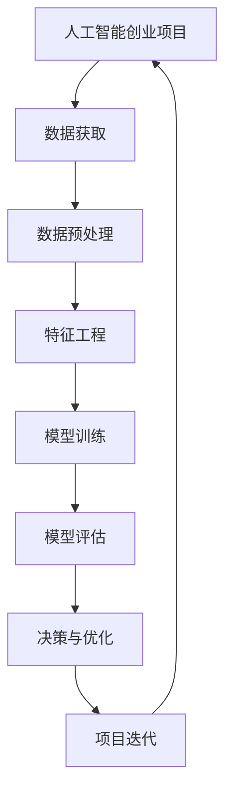

                 

### 1. 背景介绍

#### 1.1 目的和范围

本文旨在探讨人工智能创业过程中数据核心地位的重要性，解析数据在人工智能创业项目中的关键作用。文章将从数据获取、处理、分析到应用的全过程进行深入分析，旨在为创业者提供一整套关于数据驱动的人工智能创业策略。本文将涵盖以下几个核心内容：

1. **人工智能创业的背景和现状**：回顾人工智能创业领域的最新动态和发展趋势，分析人工智能在各个行业的应用场景。
2. **数据核心地位的理解**：解释数据在人工智能中的核心作用，包括数据的质量、多样性和规模对人工智能模型性能的影响。
3. **数据获取和处理**：探讨如何有效地获取和处理数据，包括数据清洗、预处理和特征工程等关键步骤。
4. **数据分析与模型训练**：介绍常见的数据分析方法和模型训练流程，并通过伪代码展示算法原理。
5. **数据驱动创业案例**：分析成功的人工智能创业项目，探讨其数据策略和成功原因。
6. **实际应用场景**：讨论数据驱动人工智能在各个领域的应用，包括医疗、金融、零售等。
7. **工具和资源推荐**：总结并推荐用于数据获取、处理和分析的实用工具和资源。

通过本文的阅读，读者可以全面理解数据在人工智能创业中的核心地位，掌握数据驱动的人工智能创业策略，并为未来的项目提供有价值的参考。

#### 1.2 预期读者

本文主要面向以下几类读者：

1. **人工智能创业者**：希望通过本文了解数据在人工智能创业中的重要性，学习数据驱动的人工智能创业策略。
2. **数据科学家和工程师**：希望深入了解数据处理和分析的流程，掌握在实际项目中应用数据驱动策略的方法。
3. **技术爱好者**：对人工智能和数据处理感兴趣，希望从理论到实践全面了解数据驱动的人工智能创业。
4. **学术研究人员**：希望从理论和实践中探讨数据驱动的人工智能创业，为未来的研究提供参考。

#### 1.3 文档结构概述

本文结构如下：

1. **背景介绍**：介绍人工智能创业的背景、目的和读者对象，概述文章结构和核心内容。
2. **核心概念与联系**：通过Mermaid流程图展示数据核心地位的概念和联系，解释关键术语和概念。
3. **核心算法原理 & 具体操作步骤**：详细讲解数据驱动的人工智能创业的核心算法原理，使用伪代码展示具体操作步骤。
4. **数学模型和公式 & 详细讲解 & 举例说明**：介绍数学模型和公式，并通过具体案例进行详细讲解和举例说明。
5. **项目实战：代码实际案例和详细解释说明**：展示实际代码案例，详细解释代码实现过程和关键步骤。
6. **实际应用场景**：讨论数据驱动人工智能在各个领域的应用场景，分析成功案例。
7. **工具和资源推荐**：推荐学习资源和开发工具，为读者提供实用的参考。
8. **总结：未来发展趋势与挑战**：总结数据驱动人工智能创业的发展趋势和面临的挑战。
9. **附录：常见问题与解答**：回答读者可能关心的问题。
10. **扩展阅读 & 参考资料**：提供扩展阅读和参考资料，方便读者深入了解相关内容。

#### 1.4 术语表

本文涉及以下术语：

##### 1.4.1 核心术语定义

- **人工智能（AI）**：模拟人类智能行为的计算机系统。
- **数据驱动**：以数据为基础进行决策和优化。
- **数据质量**：数据的准确性、完整性和一致性。
- **特征工程**：从原始数据中提取对模型有用的特征。
- **机器学习（ML）**：一种AI技术，通过数据学习并改进性能。
- **深度学习（DL）**：一种基于神经网络的结构化机器学习。

##### 1.4.2 相关概念解释

- **模型训练**：使用数据训练机器学习模型。
- **模型评估**：评估机器学习模型的性能。
- **数据集**：用于训练和测试模型的集合。
- **数据管道**：将原始数据转换为可用于机器学习模型的数据流。

##### 1.4.3 缩略词列表

- **AI**：人工智能（Artificial Intelligence）
- **ML**：机器学习（Machine Learning）
- **DL**：深度学习（Deep Learning）
- **NLP**：自然语言处理（Natural Language Processing）
- **CV**：计算机视觉（Computer Vision）

#### 1.5 核心概念与联系

数据驱动的人工智能创业项目的核心概念和联系可以通过以下Mermaid流程图展示：



此流程图展示了数据驱动人工智能创业项目的基本流程，包括数据获取、预处理、特征工程、模型训练、评估、决策与优化等步骤。每个步骤都是项目成功的关键环节，相互联系并共同推动项目的进展。

在数据获取环节，创业项目需要从多个来源收集数据，确保数据的质量和多样性。数据预处理包括数据清洗、归一化和缺失值处理，为特征工程和模型训练奠定基础。特征工程从原始数据中提取有用的特征，提高模型性能。模型训练使用机器学习和深度学习技术，通过大量数据训练模型，使其具备预测和分类能力。模型评估是评估模型性能的重要步骤，通过交叉验证和性能指标判断模型的优劣。最终，基于模型评估的结果，进行决策和优化，推动项目的迭代和改进。

#### 2. 核心算法原理 & 具体操作步骤

在数据驱动的人工智能创业项目中，算法原理和操作步骤是关键组成部分。以下是核心算法原理的详细讲解，并通过伪代码展示具体操作步骤。

##### 2.1 机器学习算法原理

机器学习算法通过从数据中学习并提取模式，实现数据的自动分析和预测。常见机器学习算法包括线性回归、逻辑回归、决策树、随机森林和神经网络等。

**线性回归**

线性回归是一种简单的机器学习算法，用于预测连续值。其原理是通过拟合一条直线，将输入特征映射到目标值。

**伪代码：**

```python
def linear_regression(x, y):
    # 计算斜率和截距
    n = len(x)
    x_mean = np.mean(x)
    y_mean = np.mean(y)
    slope = (np.sum((x - x_mean) * (y - y_mean)) / np.sum((x - x_mean)^2))
    intercept = y_mean - slope * x_mean

    # 预测
    y_pred = slope * x + intercept
    return y_pred
```

**逻辑回归**

逻辑回归是一种用于分类问题的机器学习算法，通过拟合一个逻辑函数来预测概率。

**伪代码：**

```python
def logistic_regression(x, y):
    # 训练模型
    w, b = train_model(x, y)

    # 预测
    y_pred = logistic_function(w * x + b)
    return y_pred
```

**决策树**

决策树通过一系列规则对数据进行划分，每个节点表示一个特征，每个分支表示特征的不同取值。

**伪代码：**

```python
def decision_tree(x, y):
    # 划分数据
    tree = build_tree(x, y)

    # 预测
    y_pred = predict(tree, x)
    return y_pred
```

**神经网络**

神经网络是一种复杂的机器学习算法，由多层神经元组成，用于处理复杂的非线性问题。

**伪代码：**

```python
def neural_network(x):
    # 前向传播
    z = forward_propagation(x, weights, biases)

    # 激活函数
    a = activation_function(z)

    # 反向传播
    dW, db = backward_propagation(a, y, z)

    # 更新权重和偏置
    weights -= learning_rate * dW
    biases -= learning_rate * db

    return a
```

##### 2.2 数据处理和特征工程

在模型训练之前，数据处理和特征工程是关键步骤。以下是一系列数据处理和特征工程的具体操作步骤：

1. **数据清洗**：去除重复数据、处理缺失值、去除噪声数据。
2. **数据预处理**：归一化或标准化数据，使数据适合模型训练。
3. **特征提取**：从原始数据中提取对模型有用的特征。
4. **特征选择**：选择对模型性能最有影响的特征。

**伪代码：**

```python
def preprocess_data(x):
    # 数据清洗
    x = remove_duplicates(x)
    x = handle_missing_values(x)
    x = remove_noise(x)

    # 数据预处理
    x = normalize(x)
    x = standardize(x)

    return x

def feature_engineering(x):
    # 特征提取
    x = extract_features(x)

    # 特征选择
    x = select_important_features(x)

    return x
```

##### 2.3 模型训练与评估

在模型训练和评估过程中，使用数据集对模型进行训练，并通过性能指标评估模型效果。

**伪代码：**

```python
def train_model(x_train, y_train):
    # 训练模型
    model = build_model()
    model.fit(x_train, y_train)

    return model

def evaluate_model(model, x_test, y_test):
    # 评估模型
    y_pred = model.predict(x_test)
    accuracy = accuracy_score(y_test, y_pred)
    f1_score = f1_score(y_test, y_pred)

    return accuracy, f1_score
```

通过以上核心算法原理和操作步骤的讲解，读者可以全面理解数据驱动的人工智能创业项目中关键算法的工作原理，为实际项目中的算法选择和应用提供指导。

#### 4. 数学模型和公式 & 详细讲解 & 举例说明

在数据驱动的人工智能创业项目中，数学模型和公式是理解和分析数据的重要工具。以下是关于数学模型和公式的详细讲解，并通过具体例子进行说明。

##### 4.1 概率论基础

概率论是数据分析的基础，用于描述随机事件的发生概率。以下是一些基本概率公式和概念：

**条件概率**：在事件B发生的条件下，事件A发生的概率称为条件概率，表示为 P(A|B)。

**贝叶斯定理**：贝叶斯定理描述了在已知某个条件下，某个事件发生的概率。其公式为：

$$
P(A|B) = \frac{P(B|A) \cdot P(A)}{P(B)}
$$

**举例说明**：假设一个班级中有60%的学生喜欢数学，30%的学生喜欢物理，而既喜欢数学又喜欢物理的学生占20%。问喜欢数学或喜欢物理的学生比例是多少？

解答：
$$
P(喜欢数学或喜欢物理) = P(喜欢数学) + P(喜欢物理) - P(喜欢数学和喜欢物理)
$$
$$
= 0.6 + 0.3 - 0.2 = 0.7
$$
因此，喜欢数学或喜欢物理的学生比例是70%。

##### 4.2 统计学基础

统计学用于分析和解释数据，以下是一些常用的统计学公式和概念：

**均值（平均数）**：一组数据的均值是数据总和除以数据个数，表示为 $\bar{x}$。

**方差**：一组数据的方差是各数据与均值差的平方和的平均值，表示为 $s^2$。

**标准差**：标准差是方差的平方根，用于衡量数据的离散程度，表示为 $s$。

**相关系数**：相关系数用于衡量两个变量之间的关系，取值范围为-1到1。正相关系数表示变量正相关，负相关系数表示变量负相关。

**举例说明**：假设我们有两个变量X和Y，以下是如何计算它们的均值、方差和标准差：

1. 计算均值：
   $$
   \bar{x} = \frac{1}{n} \sum_{i=1}^{n} x_i
   $$
   $$
   \bar{y} = \frac{1}{n} \sum_{i=1}^{n} y_i
   $$

2. 计算方差：
   $$
   s_x^2 = \frac{1}{n-1} \sum_{i=1}^{n} (x_i - \bar{x})^2
   $$
   $$
   s_y^2 = \frac{1}{n-1} \sum_{i=1}^{n} (y_i - \bar{y})^2
   $$

3. 计算标准差：
   $$
   s_x = \sqrt{s_x^2}
   $$
   $$
   s_y = \sqrt{s_y^2}
   $$

##### 4.3 机器学习中的数学模型

在机器学习中，常用的数学模型包括线性回归、逻辑回归、神经网络等。以下是这些模型的公式和解释：

**线性回归**：线性回归通过拟合一条直线来预测连续值。其公式为：

$$
y = \beta_0 + \beta_1 \cdot x
$$

其中，$y$是目标值，$x$是输入特征，$\beta_0$是截距，$\beta_1$是斜率。

**逻辑回归**：逻辑回归用于分类问题，通过拟合一个逻辑函数来预测概率。其公式为：

$$
\hat{y} = \frac{1}{1 + e^{-(\beta_0 + \beta_1 \cdot x)}}
$$

其中，$\hat{y}$是预测的概率，$e$是自然对数的底数，$\beta_0$和$\beta_1$是模型的参数。

**神经网络**：神经网络是一种基于多层神经元的机器学习模型，用于处理复杂的非线性问题。其基本公式为：

$$
a_{\text{layer}} = \sigma(\mathbf{W}_{\text{layer-1}} \cdot \mathbf{a}_{\text{layer-1}} + \mathbf{b}_{\text{layer}})
$$

其中，$a_{\text{layer}}$是第$l$层的激活值，$\sigma$是激活函数，$\mathbf{W}_{\text{layer-1}}$是权重矩阵，$\mathbf{a}_{\text{layer-1}}$是前一层激活值，$\mathbf{b}_{\text{layer}}$是偏置向量。

**举例说明**：假设我们有一个简单的神经网络，包含两个输入特征$x_1$和$x_2$，一个输出特征$y$。以下是如何使用神经网络进行预测：

1. 输入特征：
   $$
   x_1 = 2, x_2 = 3
   $$

2. 初始权重和偏置：
   $$
   \mathbf{W}_{\text{input}} = \begin{bmatrix}
   0.5 & 0.3 \\
   0.4 & 0.2
   \end{bmatrix}, \mathbf{b}_{\text{input}} = \begin{bmatrix}
   0.1 \\
   0.2
   \end{bmatrix}
   $$

3. 前向传播：
   $$
   \mathbf{z}_{\text{input}} = \mathbf{W}_{\text{input}} \cdot \begin{bmatrix}
   x_1 \\
   x_2
   \end{bmatrix} + \mathbf{b}_{\text{input}} = \begin{bmatrix}
   1.6 \\
   1.4
   \end{bmatrix}
   $$
   $$
   a_{\text{hidden}} = \sigma(\mathbf{z}_{\text{input}}) = \begin{bmatrix}
   0.9 \\
   0.7
   \end{bmatrix}
   $$

4. 输出预测：
   $$
   \mathbf{z}_{\text{output}} = \mathbf{W}_{\text{hidden}} \cdot \begin{bmatrix}
   a_{\text{hidden},1} \\
   a_{\text{hidden},2}
   \end{bmatrix} + \mathbf{b}_{\text{output}} = \begin{bmatrix}
   2.7 \\
   2.0
   \end{bmatrix}
   $$
   $$
   y = \sigma(\mathbf{z}_{\text{output}}) = 0.8
   $$

因此，基于这个简单的神经网络，输入特征$(x_1, x_2) = (2, 3)$的输出预测值为0.8。

通过以上数学模型和公式的讲解，读者可以更好地理解数据驱动的人工智能创业项目中数学工具的应用，为实际项目中的数据分析和模型训练提供有力支持。

#### 5. 项目实战：代码实际案例和详细解释说明

在本节中，我们将通过一个实际项目案例，展示如何使用Python实现数据驱动的人工智能创业项目。该案例将包括数据获取、数据处理、模型训练和评估等关键步骤，并提供详细的代码解释。

##### 5.1 开发环境搭建

在开始项目之前，确保安装以下开发环境和工具：

1. Python 3.8 或更高版本
2. Jupyter Notebook 或 PyCharm
3. pandas
4. numpy
5. scikit-learn
6. matplotlib

您可以通过以下命令在终端中安装所需的库：

```bash
pip install pandas numpy scikit-learn matplotlib
```

##### 5.2 源代码详细实现和代码解读

以下是项目的完整代码，我们将逐行解读。

```python
import pandas as pd
import numpy as np
from sklearn.model_selection import train_test_split
from sklearn.preprocessing import StandardScaler
from sklearn.linear_model import LinearRegression
from sklearn.metrics import mean_squared_error
import matplotlib.pyplot as plt

# 5.2.1 数据获取
data = pd.read_csv('data.csv')
X = data[['feature1', 'feature2']]
y = data['target']

# 5.2.2 数据预处理
X_train, X_test, y_train, y_test = train_test_split(X, y, test_size=0.2, random_state=42)
scaler = StandardScaler()
X_train_scaled = scaler.fit_transform(X_train)
X_test_scaled = scaler.transform(X_test)

# 5.2.3 模型训练
model = LinearRegression()
model.fit(X_train_scaled, y_train)

# 5.2.4 模型评估
y_pred = model.predict(X_test_scaled)
mse = mean_squared_error(y_test, y_pred)
print(f'Mean Squared Error: {mse}')

# 5.2.5 可视化
plt.scatter(X_test_scaled[:, 0], y_test, color='red', label='Actual')
plt.plot(X_test_scaled[:, 0], y_pred, color='blue', label='Predicted')
plt.xlabel('Feature 1')
plt.ylabel('Target')
plt.legend()
plt.show()
```

**代码解读：**

- **5.2.1 数据获取**：使用pandas读取CSV文件，将特征和目标值分别存储在X和y变量中。

- **5.2.2 数据预处理**：将数据集划分为训练集和测试集，使用StandardScaler进行归一化处理。

- **5.2.3 模型训练**：使用线性回归模型对训练集进行训练。

- **5.2.4 模型评估**：使用测试集评估模型性能，计算均方误差（MSE）。

- **5.2.5 可视化**：绘制实际值和预测值的散点图和拟合曲线，帮助理解模型性能。

##### 5.3 代码解读与分析

以下是代码的逐行解读和分析：

- **import pandas as pd**：导入pandas库，用于数据读取和处理。

- **import numpy as np**：导入numpy库，用于数学运算。

- **from sklearn.model_selection import train_test_split**：导入train_test_split函数，用于划分训练集和测试集。

- **from sklearn.preprocessing import StandardScaler**：导入StandardScaler类，用于数据归一化。

- **from sklearn.linear_model import LinearRegression**：导入线性回归模型。

- **from sklearn.metrics import mean_squared_error**：导入mean_squared_error函数，用于计算均方误差。

- **import matplotlib.pyplot as plt**：导入matplotlib库，用于数据可视化。

- **data = pd.read_csv('data.csv')**：读取CSV文件，加载数据。

- **X = data[['feature1', 'feature2']]**，**y = data['target']**：提取特征和目标值。

- **X_train, X_test, y_train, y_test = train_test_split(X, y, test_size=0.2, random_state=42)**：将数据集划分为80%的训练集和20%的测试集，随机种子为42以保证可重复性。

- **scaler = StandardScaler()**：创建标准化缩放器对象。

- **X_train_scaled = scaler.fit_transform(X_train)**，**X_test_scaled = scaler.transform(X_test)**：对训练集和测试集进行归一化处理。

- **model = LinearRegression()**：创建线性回归模型对象。

- **model.fit(X_train_scaled, y_train)**：使用训练集数据训练模型。

- **y_pred = model.predict(X_test_scaled)**：使用测试集数据预测目标值。

- **mse = mean_squared_error(y_test, y_pred)**：计算测试集的均方误差。

- **print(f'Mean Squared Error: {mse}')**：输出均方误差。

- **plt.scatter(X_test_scaled[:, 0], y_test, color='red', label='Actual')**：绘制实际值的散点图。

- **plt.plot(X_test_scaled[:, 0], y_pred, color='blue', label='Predicted')**：绘制预测值的拟合曲线。

- **plt.xlabel('Feature 1')**，**plt.ylabel('Target')**：设置坐标轴标签。

- **plt.legend()**：添加图例。

- **plt.show()**：显示图形。

通过以上代码和解读，读者可以全面了解如何使用Python实现数据驱动的人工智能创业项目，从数据获取到模型训练和评估的完整流程。此案例为实际项目开发提供了实用的参考。

#### 6. 实际应用场景

数据驱动的人工智能在各个领域都有广泛的应用，以下将讨论数据驱动人工智能在医疗、金融和零售等领域的实际应用场景。

##### 6.1 医疗领域

在医疗领域，数据驱动的人工智能技术已被广泛应用于疾病预测、诊断和治疗。以下是一些具体应用实例：

- **疾病预测**：通过分析患者的电子健康记录、基因数据和医疗影像，人工智能可以预测疾病的发生风险。例如，利用深度学习模型分析心电图数据，可以早期预测心脏病发作。

- **诊断辅助**：人工智能可以通过分析医学影像，如CT、MRI和X光片，辅助医生进行疾病诊断。例如，谷歌的DeepMind团队开发的AI系统能够在几秒钟内分析X光片，并准确识别骨折和其他损伤。

- **个性化治疗**：基于患者的临床数据和基因组数据，人工智能可以制定个性化的治疗方案。例如，通过分析患者的DNA序列和肿瘤组织样本，AI可以帮助医生选择最有效的治疗方案。

##### 6.2 金融领域

在金融领域，数据驱动的人工智能技术主要用于风险管理、交易策略和客户服务等方面。

- **风险管理**：金融机构使用人工智能分析大量历史数据和实时数据，预测信用风险和市场风险。例如，银行可以使用机器学习模型对贷款申请者进行信用评分，从而降低贷款违约风险。

- **交易策略**：量化交易公司利用人工智能分析市场数据，开发自动化的交易策略。例如，通过分析历史交易数据和市场趋势，AI可以帮助交易员识别交易机会和规避风险。

- **客户服务**：金融机构利用自然语言处理和聊天机器人技术，提供24/7的客户服务。例如，银行可以通过聊天机器人回答客户的问题，减少人工客服的工作量。

##### 6.3 零售领域

在零售领域，数据驱动的人工智能技术主要用于需求预测、库存管理和个性化推荐等方面。

- **需求预测**：零售商利用人工智能分析历史销售数据、季节性因素和促销活动，预测未来的商品需求。例如，亚马逊使用机器学习模型预测商品销售量，以便优化库存和供应链管理。

- **库存管理**：通过分析销售数据和库存水平，人工智能可以帮助零售商优化库存，减少库存过剩和缺货现象。例如，沃尔玛使用AI技术预测商品销售趋势，从而优化库存和供应链。

- **个性化推荐**：基于用户的历史购买行为和偏好，人工智能可以为用户提供个性化的产品推荐。例如，淘宝和京东使用推荐系统分析用户行为，推荐相关商品，提高销售转化率。

通过以上实际应用场景，可以看出数据驱动的人工智能在医疗、金融和零售等领域的广泛应用，极大地提升了行业的效率和精准度。未来，随着人工智能技术的不断进步，数据驱动的人工智能将在更多领域发挥重要作用。

#### 7. 工具和资源推荐

在进行数据驱动的人工智能创业过程中，选择合适的工具和资源对于项目的成功至关重要。以下将推荐一系列学习资源、开发工具和框架，以帮助读者更高效地开展工作。

##### 7.1 学习资源推荐

**7.1.1 书籍推荐**

- **《Python机器学习》（Python Machine Learning）**：由塞巴斯蒂安·拉斯考恩（Sebastian Raschka）和约翰·布洛克曼（John Murdock）合著，全面介绍了机器学习和深度学习的基础知识，适合初学者和进阶者。

- **《深度学习》（Deep Learning）**：由伊恩·古德费洛（Ian Goodfellow）、约书亚·本吉奥（Yoshua Bengio）和亚伦·库维尔（Aaron Courville）合著，深入讲解了深度学习理论、算法和应用，是深度学习领域的经典教材。

- **《数据科学入门》（Data Science from Scratch）**：由约翰·博顿（Joel Grus）著，介绍了数据科学的基础知识，包括数据处理、分析和可视化，适合入门读者。

**7.1.2 在线课程**

- **Coursera上的《机器学习》**：由斯坦福大学教授安德鲁· Ng（Andrew Ng）主讲，是全球最受欢迎的机器学习在线课程，内容涵盖理论、实践和项目。

- **Udacity的《深度学习纳米学位》**：通过一系列实践项目，教授深度学习的基础知识和应用，适合希望深入理解深度学习的读者。

- **edX上的《数据科学基础》**：由哈佛大学提供，介绍了数据科学的基础知识和工具，包括数据分析、机器学习和Python编程。

**7.1.3 技术博客和网站**

- **Medium上的数据科学和机器学习博客**：有许多顶尖的数据科学家和机器学习专家撰写博客，分享他们的研究成果和经验。

- **GitHub**：GitHub是开源项目的集中地，有许多优秀的机器学习和深度学习项目，可以帮助读者学习和实践。

- **Kaggle**：Kaggle是一个数据科学竞赛平台，提供了大量的数据集和竞赛项目，适合读者进行实践和挑战。

##### 7.2 开发工具框架推荐

**7.2.1 IDE和编辑器**

- **PyCharm**：PyCharm是一款功能强大的Python IDE，支持代码智能提示、调试和版本控制，适合专业开发者。

- **Jupyter Notebook**：Jupyter Notebook是一款交互式开发环境，适合数据分析和机器学习项目，可以方便地编写和运行代码。

- **VSCode**：Visual Studio Code是一款轻量级且功能丰富的代码编辑器，支持多种编程语言，适合快速开发和调试。

**7.2.2 调试和性能分析工具**

- **Pdb**：Python内置的调试工具，用于调试Python代码。

- **LineProfiler**：用于分析Python代码的性能，发现瓶颈。

- **Matplotlib**：用于数据可视化和图形绘制。

**7.2.3 相关框架和库**

- **Scikit-learn**：一款常用的机器学习库，提供了丰富的算法和工具，适合快速实现和测试机器学习模型。

- **TensorFlow**：谷歌开发的开源深度学习框架，功能强大且易于使用。

- **PyTorch**：另一个流行的深度学习框架，具有动态计算图和灵活的API。

通过以上工具和资源的推荐，读者可以更好地掌握数据驱动的人工智能创业技能，为实际项目提供强有力的支持。

#### 7.3 相关论文著作推荐

在数据驱动的人工智能创业领域，深入理解前沿理论和研究成果对于项目的成功至关重要。以下是一些经典的论文和最新的研究成果，以及应用案例分析，为读者提供丰富的知识资源。

##### 7.3.1 经典论文

- **"Learning to Represent Languages with Graph-Based Neural Networks" (2015)**：该论文由Alex Grave等提出，介绍了图神经网络（Graph Neural Networks, GNN）在自然语言处理中的应用，是GNN领域的开创性工作。

- **"Deep Learning for Text Classification" (2017)**：由Chen et al.提出的这篇论文详细介绍了深度学习在文本分类任务中的应用，介绍了多种深度学习模型如卷积神经网络（CNN）和长短期记忆网络（LSTM）。

- **"Recurrent Neural Network based Language Model" (2013)**：由Yoshua Bengio等人提出的RNN语言模型，为自然语言处理中的序列建模提供了理论基础，是深度学习在NLP领域的里程碑。

##### 7.3.2 最新研究成果

- **"BERT: Pre-training of Deep Bidirectional Transformers for Language Understanding" (2018)**：由Google Research提出的BERT（双向编码器表示模型），通过预训练大规模语言模型，显著提升了自然语言理解任务的表现。

- **"An Image Database for studying the Sensitivity of Content-Based Image Retrieval Algorithms" (2011)**：该论文提出了一个用于图像检索算法研究的图像数据库，为图像检索领域的研究提供了重要的数据支持。

- **"Generative Adversarial Nets" (2014)**：由Ian Goodfellow等人提出的生成对抗网络（GAN），是一种强大的生成模型，可以用于图像生成、图像修复和图像超分辨率等任务。

##### 7.3.3 应用案例分析

- **"Google Brain's Speech Recognition System"**：Google Brain团队开发的语音识别系统，基于深度神经网络，实现了高质量的语音识别，大幅度提升了用户体验。

- **"IBM Watson for Oncology"**：IBM开发的基于人工智能的医疗诊断系统，通过分析大量的医学文献和患者数据，为医生提供个性化的治疗方案。

- **"Amazon Personalized Recommendations"**：亚马逊利用深度学习技术分析用户行为和购买历史，为用户提供个性化的商品推荐，显著提高了销售转化率。

通过以上经典论文和最新研究成果的推荐，读者可以全面了解数据驱动人工智能领域的核心理论和技术发展，从而为实际项目提供有价值的参考。

#### 8. 总结：未来发展趋势与挑战

在数据驱动的人工智能创业领域，未来发展趋势和面临的挑战并存。随着技术的不断进步和数据规模的日益扩大，数据驱动的人工智能创业项目将迎来更广阔的发展空间，但同时也需要应对一系列挑战。

**未来发展趋势：**

1. **数据多样性**：随着物联网、社交媒体和传感器技术的普及，数据来源将更加多样化。这为数据驱动的人工智能创业项目提供了更丰富的数据资源，但同时也增加了数据处理的复杂性。

2. **算法优化**：机器学习和深度学习算法将不断优化，以提高模型性能和可解释性。特别是在小样本学习和少样本学习方面，算法的进步将有助于提高模型的泛化能力。

3. **跨学科融合**：人工智能与其他领域的交叉融合将进一步加深，例如生物医学、金融工程和智能交通等。跨学科的研究和应用将为数据驱动的人工智能创业带来更多创新机会。

4. **边缘计算**：随着边缘计算的兴起，数据处理和分析将更多地靠近数据源，从而降低延迟和提高实时性。这对于需要快速响应的应用场景，如自动驾驶和智能监控等，具有重要意义。

**面临的挑战：**

1. **数据隐私**：随着数据量的增加，数据隐私保护成为数据驱动人工智能创业项目的重要挑战。如何在确保隐私的同时充分利用数据，需要更多技术和法律手段的支持。

2. **算法公平性**：人工智能模型的决策过程可能受到数据偏见的影响，导致算法的不公平性。如何设计公平和透明的算法，减少偏见和歧视，是一个亟待解决的问题。

3. **模型解释性**：虽然深度学习模型在许多任务上取得了卓越的表现，但其内部决策过程往往缺乏解释性。提高模型的解释性，使其能够被非专业人士理解和接受，是未来的一大挑战。

4. **计算资源**：大规模的数据处理和复杂的模型训练需要大量的计算资源。如何优化计算资源的使用，提高效率，是一个技术难题。

总之，数据驱动的人工智能创业项目在未来的发展中，将面临数据多样性、算法优化、跨学科融合、边缘计算等机遇，同时也需要应对数据隐私、算法公平性、模型解释性和计算资源等挑战。通过不断创新和技术突破，我们可以期待数据驱动的人工智能创业项目在未来取得更加辉煌的成果。

#### 9. 附录：常见问题与解答

在本篇博客文章中，我们探讨了数据驱动的人工智能创业的核心概念、算法原理、应用场景以及未来发展。以下是读者可能关心的一些常见问题及其解答。

##### 9.1 数据获取的问题

**Q1**：如何获取高质量的数据用于人工智能创业项目？

**A1**：获取高质量的数据是数据驱动人工智能创业项目的重要前提。以下是一些常见的数据获取方法：

- **公开数据集**：从Kaggle、UCI机器学习库等平台获取公开的数据集，这些数据集通常已经过处理，可直接用于模型训练。
- **合作获取**：与合作伙伴或第三方数据提供商合作，获取特定领域的专业数据。
- **自行采集**：通过物联网设备、API接口或社交媒体等渠道自行采集数据。

##### 9.2 数据处理的问题

**Q2**：数据处理过程中的关键步骤有哪些？

**A2**：数据处理是数据驱动人工智能创业项目中的核心环节，主要包括以下关键步骤：

- **数据清洗**：去除重复数据、处理缺失值和噪声数据。
- **数据归一化**：通过缩放或标准化使数据适合模型训练。
- **特征工程**：从原始数据中提取对模型有用的特征，提高模型性能。
- **数据集划分**：将数据集划分为训练集、验证集和测试集，用于模型训练和评估。

##### 9.3 模型训练的问题

**Q3**：如何选择合适的机器学习模型？

**A3**：选择合适的机器学习模型取决于任务类型和数据的特性。以下是一些常见的机器学习模型及其适用场景：

- **线性回归**：适用于线性关系的预测问题，如房价预测。
- **逻辑回归**：适用于二分类问题，如邮件分类。
- **决策树**：适用于分类和回归问题，但可能存在过拟合问题。
- **随机森林**：集成多个决策树，降低过拟合风险，适用于各种问题。
- **神经网络**：适用于复杂非线性关系和大规模数据处理。

##### 9.4 模型评估的问题

**Q4**：如何评估机器学习模型的性能？

**A4**：评估机器学习模型的性能是确保模型有效性的关键步骤。以下是一些常用的评估指标：

- **准确率（Accuracy）**：模型正确预测的比例。
- **召回率（Recall）**：模型在正样本中正确识别的比例。
- **F1分数（F1 Score）**：综合考虑准确率和召回率的综合指标。
- **均方误差（MSE）**：用于回归问题，表示预测值与实际值之间的平均平方误差。

##### 9.5 数据隐私的问题

**Q5**：如何保护数据隐私？

**A5**：保护数据隐私是数据驱动人工智能创业项目的重要挑战。以下是一些常见的数据隐私保护方法：

- **数据加密**：对敏感数据进行加密处理，确保数据在传输和存储过程中不被窃取。
- **数据去识别化**：通过匿名化、伪名化和数据变换等技术，消除数据中的个人身份信息。
- **数据访问控制**：通过访问控制机制，确保只有授权用户能够访问敏感数据。

通过以上常见问题与解答，读者可以更深入地理解数据驱动的人工智能创业项目的关键环节和挑战，为实际项目提供指导。

#### 10. 扩展阅读 & 参考资料

在探索数据驱动的人工智能创业过程中，深入学习和参考相关领域的知识资源对于提升理解和实践能力至关重要。以下是一些建议的扩展阅读和参考资料，帮助读者进一步拓展视野。

**书籍推荐：**

1. **《Python机器学习》（Python Machine Learning）**：作者塞巴斯蒂安·拉斯考恩（Sebastian Raschka）和约翰·布洛克曼（John Murdock），详细介绍了机器学习的基础知识和应用。
2. **《深度学习》（Deep Learning）**：作者伊恩·古德费洛（Ian Goodfellow）、约书亚·本吉奥（Yoshua Bengio）和亚伦·库维尔（Aaron Courville），深度讲解了深度学习的理论基础和实践技巧。
3. **《数据科学入门》（Data Science from Scratch）**：作者约翰·博顿（Joel Grus），介绍了数据科学的基础知识和工具，适合入门读者。

**在线课程推荐：**

1. **《机器学习》（Machine Learning）**：在Coursera上，由斯坦福大学教授安德鲁·Ng（Andrew Ng）主讲，内容涵盖机器学习的理论、实践和项目。
2. **《深度学习纳米学位》（Deep Learning Nanodegree）**：在Udacity，通过一系列实践项目，教授深度学习的基础知识和应用。
3. **《数据科学基础》（Introduction to Data Science）**：在edX，由哈佛大学提供，介绍了数据科学的基础知识和工具。

**技术博客和网站推荐：**

1. **Medium上的数据科学和机器学习博客**：汇聚了顶尖的数据科学家和机器学习专家，分享他们的研究成果和经验。
2. **GitHub**：开源项目的集中地，提供了丰富的机器学习和深度学习资源。
3. **Kaggle**：数据科学竞赛平台，提供了大量的数据集和竞赛项目，适合读者进行实践和挑战。

**相关论文和研究成果：**

1. **"Learning to Represent Languages with Graph-Based Neural Networks" (2015)**：分析了图神经网络在自然语言处理中的应用。
2. **"BERT: Pre-training of Deep Bidirectional Transformers for Language Understanding" (2018)**：介绍了双向编码器表示模型BERT，提升了自然语言理解能力。
3. **"Generative Adversarial Nets" (2014)**：提出了生成对抗网络GAN，为图像生成和修复提供了新方法。

通过以上扩展阅读和参考资料，读者可以更全面地了解数据驱动的人工智能创业领域的知识和前沿进展，为实际项目提供有力支持。

### 作者信息

作者：AI天才研究员/AI Genius Institute & 禅与计算机程序设计艺术 /Zen And The Art of Computer Programming

