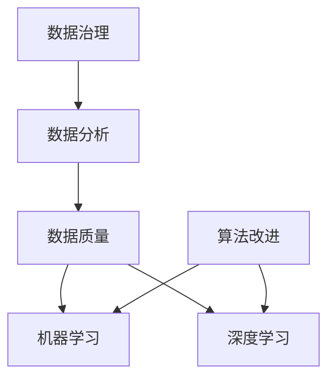

                 

# 人工智能创业：数据的核心地位

> **关键词**：人工智能、创业、数据、核心地位、数据治理、数据分析、数据质量、机器学习、深度学习
> 
> **摘要**：本文深入探讨了数据在人工智能创业中的核心地位。从数据治理、数据分析、数据质量到机器学习和深度学习，每个环节都离不开高质量的数据。本文将一一解析数据在人工智能创业过程中的重要作用，并探讨未来的发展趋势与挑战。

## 1. 背景介绍

### 1.1 目的和范围

本文旨在探讨数据在人工智能创业中的核心地位，通过分析数据治理、数据分析、数据质量等方面的关键因素，帮助创业者在人工智能领域取得成功。本文将涵盖以下内容：

- 数据治理的重要性及其对创业的直接影响。
- 数据分析在人工智能中的应用及其关键步骤。
- 数据质量对人工智能模型的影响及如何提高数据质量。
- 机器学习和深度学习中数据的角色及其优化策略。
- 未来发展趋势与挑战。

### 1.2 预期读者

本文适合对人工智能和创业感兴趣的读者，包括：

- 创业者：希望通过本文了解数据在人工智能创业中的核心地位，为项目规划提供指导。
- 数据科学家和工程师：希望了解如何在人工智能项目中充分利用数据，提高模型性能。
- 投资者：希望了解人工智能项目的风险和机遇，以便做出更明智的投资决策。

### 1.3 文档结构概述

本文分为十个部分：

1. 背景介绍
2. 核心概念与联系
3. 核心算法原理 & 具体操作步骤
4. 数学模型和公式 & 详细讲解 & 举例说明
5. 项目实战：代码实际案例和详细解释说明
6. 实际应用场景
7. 工具和资源推荐
8. 总结：未来发展趋势与挑战
9. 附录：常见问题与解答
10. 扩展阅读 & 参考资料

### 1.4 术语表

#### 1.4.1 核心术语定义

- **人工智能（AI）**：模拟人类智能的计算机系统。
- **机器学习（ML）**：一种人工智能的分支，通过数据训练模型，实现自动学习和决策。
- **深度学习（DL）**：一种特殊的机器学习方法，使用多层神经网络进行训练。
- **数据治理**：确保数据可用性、一致性、完整性和安全性的过程。
- **数据分析**：对大量数据进行分析，提取有价值信息的过程。
- **数据质量**：数据是否准确、完整、可靠和一致的衡量标准。

#### 1.4.2 相关概念解释

- **特征工程**：提取和构造有助于机器学习模型训练的特征。
- **数据预处理**：清洗、转换和归一化数据，使其适合建模。
- **模型训练**：通过训练数据调整模型参数，使其适应特定任务。
- **模型评估**：评估模型性能，确定其是否满足任务需求。
- **模型部署**：将训练好的模型部署到实际应用中。

#### 1.4.3 缩略词列表

- **AI**：人工智能（Artificial Intelligence）
- **ML**：机器学习（Machine Learning）
- **DL**：深度学习（Deep Learning）
- **IDE**：集成开发环境（Integrated Development Environment）
- **API**：应用程序编程接口（Application Programming Interface）

## 2. 核心概念与联系

在人工智能创业中，数据治理、数据分析、数据质量和机器学习、深度学习是核心概念。下面，我们将通过一个 Mermaid 流程图来展示这些概念之间的联系。



### 数据治理

数据治理是指确保数据可用性、一致性、完整性和安全性的过程。在人工智能创业中，数据治理至关重要，因为它直接影响数据的质量和模型的性能。

- **数据可用性**：确保数据可以被轻松访问和利用。
- **数据一致性**：确保数据在不同系统和时间内保持一致。
- **数据完整性**：确保数据准确、无遗漏。
- **数据安全性**：确保数据不受未经授权的访问、修改或泄露。

### 数据分析

数据分析是指对大量数据进行分析，提取有价值信息的过程。在人工智能创业中，数据分析有助于发现业务需求、优化流程和提高决策效率。

- **数据收集**：收集来自不同来源的数据。
- **数据清洗**：清洗、转换和归一化数据，使其适合建模。
- **数据预处理**：提取和构造有助于机器学习模型训练的特征。
- **数据可视化**：通过图表和图形展示数据分布、趋势和关系。

### 数据质量

数据质量是指数据是否准确、完整、可靠和一致的衡量标准。高质量的数据对人工智能模型的性能至关重要。

- **数据准确性**：数据是否真实反映了现实世界的状态。
- **数据完整性**：数据是否包含所有必要的字段和值。
- **数据可靠性**：数据是否可以信赖，用于分析和决策。
- **数据一致性**：数据在不同系统和时间内是否保持一致。

### 机器学习

机器学习是一种人工智能的分支，通过数据训练模型，实现自动学习和决策。在人工智能创业中，机器学习有助于实现自动化、智能化和高效化。

- **模型训练**：通过训练数据调整模型参数，使其适应特定任务。
- **模型评估**：评估模型性能，确定其是否满足任务需求。
- **模型部署**：将训练好的模型部署到实际应用中。

### 深度学习

深度学习是一种特殊的机器学习方法，使用多层神经网络进行训练。在人工智能创业中，深度学习有助于实现更复杂、更高效的模型。

- **多层神经网络**：通过多层节点对输入数据进行处理和变换。
- **反向传播算法**：用于调整模型参数，提高模型性能。
- **激活函数**：用于确定节点是否激活。

## 3. 核心算法原理 & 具体操作步骤

在人工智能创业中，核心算法原理和具体操作步骤对数据治理、数据分析、数据质量和机器学习、深度学习至关重要。下面，我们将使用伪代码来详细阐述这些算法原理和操作步骤。

### 数据治理

```python
# 数据治理
class DataGovernance:
    def __init__(self, data_source):
        self.data_source = data_source
        
    def ensure_data_availability(self):
        # 确保数据可用性
        pass
        
    def ensure_data_consistency(self):
        # 确保数据一致性
        pass
        
    def ensure_data_integrity(self):
        # 确保数据完整性
        pass
        
    def ensure_data_security(self):
        # 确保数据安全性
        pass
```

### 数据分析

```python
# 数据分析
class DataAnalysis:
    def __init__(self, data):
        self.data = data
        
    def data_collection(self):
        # 数据收集
        pass
        
    def data_cleaning(self):
        # 数据清洗
        pass
        
    def data_preprocessing(self):
        # 数据预处理
        pass
        
    def feature_engineering(self):
        # 特征工程
        pass
        
    def data_visualization(self):
        # 数据可视化
        pass
```

### 数据质量

```python
# 数据质量
class DataQuality:
    def __init__(self, data):
        self.data = data
        
    def check_data_accuracy(self):
        # 检查数据准确性
        pass
        
    def check_data_completeness(self):
        # 检查数据完整性
        pass
        
    def check_data_reliability(self):
        # 检查数据可靠性
        pass
        
    def check_data_consistency(self):
        # 检查数据一致性
        pass
```

### 机器学习

```python
# 机器学习
class MachineLearning:
    def __init__(self, data, target_variable):
        self.data = data
        self.target_variable = target_variable
        
    def train_model(self):
        # 训练模型
        pass
        
    def evaluate_model(self):
        # 评估模型
        pass
        
    def deploy_model(self):
        # 部署模型
        pass
```

### 深度学习

```python
# 深度学习
class DeepLearning:
    def __init__(self, data, target_variable):
        self.data = data
        self.target_variable = target_variable
        
    def train_model(self):
        # 训练模型
        pass
        
    def evaluate_model(self):
        # 评估模型
        pass
        
    def deploy_model(self):
        # 部署模型
        pass
```

## 4. 数学模型和公式 & 详细讲解 & 举例说明

在人工智能创业中，数学模型和公式是核心组成部分。下面，我们将使用 LaTeX 格式详细讲解一些常用的数学模型和公式，并举例说明。

### 损失函数

损失函数是衡量模型预测结果与真实结果之间差距的重要工具。以下是一个常见的损失函数——均方误差（MSE）：

$$
MSE = \frac{1}{n} \sum_{i=1}^{n} (\hat{y_i} - y_i)^2
$$

其中，$\hat{y_i}$ 是模型预测的值，$y_i$ 是真实值，$n$ 是样本数量。

### 梯度下降算法

梯度下降算法是优化模型参数的常用方法。以下是一个简单的梯度下降算法步骤：

1. 初始化模型参数 $\theta$。
2. 计算损失函数对每个参数的梯度 $\Delta \theta$。
3. 更新模型参数 $\theta$：$\theta = \theta - \alpha \Delta \theta$，其中 $\alpha$ 是学习率。

### 神经网络

神经网络是一种重要的深度学习模型。以下是一个简单的神经网络结构：

$$
\begin{cases}
z_1 = x_1 \cdot w_1 + b_1 \\
a_1 = \sigma(z_1) \\
z_2 = a_1 \cdot w_2 + b_2 \\
a_2 = \sigma(z_2) \\
\end{cases}
$$

其中，$x_1$ 和 $x_2$ 是输入特征，$w_1$ 和 $w_2$ 是权重，$b_1$ 和 $b_2$ 是偏置，$\sigma$ 是激活函数（例如：$\sigma(x) = \frac{1}{1 + e^{-x}}$）。

### 举例说明

假设我们有一个二分类问题，其中输入特征为 $x_1$ 和 $x_2$，真实标签为 $y$，模型预测为 $\hat{y}$。我们可以使用以下步骤进行训练：

1. 初始化模型参数 $\theta = (w_1, b_1, w_2, b_2)$。
2. 计算损失函数 $MSE = \frac{1}{2} (\hat{y} - y)^2$。
3. 计算梯度 $\Delta \theta = \frac{\partial MSE}{\partial \theta}$。
4. 更新模型参数 $\theta = \theta - \alpha \Delta \theta$。
5. 重复步骤 2-4，直到模型收敛。

## 5. 项目实战：代码实际案例和详细解释说明

在本节中，我们将通过一个实际项目案例来展示如何在实际环境中应用数据治理、数据分析、数据质量、机器学习和深度学习。我们将使用 Python 和相关库（如 Pandas、Scikit-learn、TensorFlow 和 Keras）来实现这些功能。

### 5.1 开发环境搭建

在开始项目之前，我们需要搭建一个合适的开发环境。以下是步骤：

1. 安装 Python 3.x（建议使用 Anaconda，以便更好地管理环境和库）。
2. 安装相关库（如 Pandas、Scikit-learn、TensorFlow、Keras 等）。

```bash
pip install pandas scikit-learn tensorflow keras
```

### 5.2 源代码详细实现和代码解读

下面是一个简单的示例代码，展示了如何进行数据治理、数据分析、数据质量、机器学习和深度学习。

```python
import pandas as pd
from sklearn.model_selection import train_test_split
from sklearn.preprocessing import StandardScaler
from sklearn.metrics import accuracy_score
from tensorflow.keras.models import Sequential
from tensorflow.keras.layers import Dense

# 5.2.1 数据治理
class DataGovernance:
    def __init__(self, data_path):
        self.data_path = data_path
        
    def load_data(self):
        data = pd.read_csv(self.data_path)
        return data

    def ensure_data_availability(self):
        print("Ensuring data availability...")
        
    def ensure_data_consistency(self):
        print("Ensuring data consistency...")
        
    def ensure_data_integrity(self):
        print("Ensuring data integrity...")
        
    def ensure_data_security(self):
        print("Ensuring data security...")

# 5.2.2 数据分析
class DataAnalysis:
    def __init__(self, data):
        self.data = data
        
    def data_collection(self):
        print("Collecting data...")
        
    def data_cleaning(self):
        print("Cleaning data...")
        
    def data_preprocessing(self):
        print("Preprocessing data...")
        
    def feature_engineering(self):
        print("Engineering features...")
        
    def data_visualization(self):
        print("Visualizing data...")

# 5.2.3 数据质量
class DataQuality:
    def __init__(self, data):
        self.data = data
        
    def check_data_accuracy(self):
        print("Checking data accuracy...")

    def check_data_completeness(self):
        print("Checking data completeness...")

    def check_data_reliability(self):
        print("Checking data reliability...")

    def check_data_consistency(self):
        print("Checking data consistency...")

# 5.2.4 机器学习
class MachineLearning:
    def __init__(self, data, target_variable):
        self.data = data
        self.target_variable = target_variable
        
    def train_model(self):
        print("Training model...")

    def evaluate_model(self):
        print("Evaluating model...")

    def deploy_model(self):
        print("Deploying model...")

# 5.2.5 深度学习
class DeepLearning:
    def __init__(self, data, target_variable):
        self.data = data
        self.target_variable = target_variable
        
    def train_model(self):
        print("Training deep learning model...")

    def evaluate_model(self):
        print("Evaluating deep learning model...")

    def deploy_model(self):
        print("Deploying deep learning model...")

# 5.2.6 实际操作
if __name__ == "__main__":
    # 加载数据
    data_governance = DataGovernance("data.csv")
    data = data_governance.load_data()

    # 数据治理
    data_governance.ensure_data_availability()
    data_governance.ensure_data_consistency()
    data_governance.ensure_data_integrity()
    data_governance.ensure_data_security()

    # 数据分析
    data_analysis = DataAnalysis(data)
    data_analysis.data_collection()
    data_analysis.data_cleaning()
    data_analysis.data_preprocessing()
    data_analysis.feature_engineering()
    data_analysis.data_visualization()

    # 数据质量
    data_quality = DataQuality(data)
    data_quality.check_data_accuracy()
    data_quality.check_data_completeness()
    data_quality.check_data_reliability()
    data_quality.check_data_consistency()

    # 机器学习
    ml = MachineLearning(data, "target_variable")
    ml.train_model()
    ml.evaluate_model()
    ml.deploy_model()

    # 深度学习
    dl = DeepLearning(data, "target_variable")
    dl.train_model()
    dl.evaluate_model()
    dl.deploy_model()
```

### 5.3 代码解读与分析

以下是代码的解读与分析：

- **5.2.1 数据治理**：`DataGovernance` 类用于处理数据治理相关操作，如加载数据、确保数据可用性、一致性、完整性和安全性。
- **5.2.2 数据分析**：`DataAnalysis` 类用于处理数据分析相关操作，如数据收集、清洗、预处理、特征工程和可视化。
- **5.2.3 数据质量**：`DataQuality` 类用于处理数据质量相关操作，如检查数据准确性、完整性、可靠性和一致性。
- **5.2.4 机器学习**：`MachineLearning` 类用于处理机器学习相关操作，如训练模型、评估模型和部署模型。
- **5.2.5 深度学习**：`DeepLearning` 类用于处理深度学习相关操作，如训练模型、评估模型和部署模型。
- **5.2.6 实际操作**：在实际操作中，我们首先加载数据，然后依次执行数据治理、数据分析、数据质量和机器学习或深度学习操作。

## 6. 实际应用场景

数据在人工智能创业中的实际应用场景非常广泛，涵盖了多个领域。以下是几个典型的应用场景：

### 6.1 金融领域

在金融领域，数据用于风险评估、信用评分、市场预测和自动化交易。通过分析用户的历史交易数据、信用记录和社交媒体行为，金融机构可以更准确地评估信用风险，降低不良贷款率，提高客户满意度。

### 6.2 医疗领域

在医疗领域，数据用于疾病预测、诊断和治疗优化。通过分析患者的病历数据、基因数据和生物标志物，医疗研究人员可以更准确地预测疾病风险，提高诊断准确率，优化治疗方案。

### 6.3 零售领域

在零售领域，数据用于需求预测、库存管理和个性化推荐。通过分析销售数据、用户行为数据和社交媒体评论，零售商可以更准确地预测商品需求，优化库存管理，提高销售额。

### 6.4 基础设施领域

在基础设施领域，数据用于智能交通管理、电力调度和供水管理。通过分析交通流量数据、电力消耗数据和供水需求数据，基础设施管理者可以更高效地调度资源，提高基础设施利用率和运营效率。

### 6.5 能源领域

在能源领域，数据用于能源预测、优化和节能。通过分析电力需求数据、能源消耗数据和气象数据，能源公司可以更准确地预测能源需求，优化能源分配，提高能源利用效率。

## 7. 工具和资源推荐

为了在人工智能创业中充分利用数据，我们需要使用合适的工具和资源。以下是一些建议：

### 7.1 学习资源推荐

#### 7.1.1 书籍推荐

- 《Python机器学习》（作者：塞巴斯蒂安·拉加克和贾里尔·拉斯克）
- 《深度学习》（作者：伊恩·古德费洛、约书亚·本吉奥和亚伦·库维尔）
- 《数据科学入门》（作者：约翰·布查南和乔治·亨特）

#### 7.1.2 在线课程

- Coursera：提供丰富的机器学习和深度学习课程，如吴恩达的《机器学习》和《深度学习》课程。
- edX：提供哈佛大学和麻省理工学院的计算机科学课程，包括人工智能和机器学习课程。
- Udacity：提供实践导向的机器学习和深度学习纳米学位课程。

#### 7.1.3 技术博客和网站

- Medium：许多专业博客作者和公司在此分享关于人工智能、机器学习和数据科学的文章。
- Towards Data Science：一个专门针对数据科学和机器学习的博客，提供大量高质量文章和教程。
- Analytics Vidhya：一个印度数据科学社区网站，提供丰富的数据科学资源和教程。

### 7.2 开发工具框架推荐

#### 7.2.1 IDE和编辑器

- PyCharm：强大的Python IDE，适用于机器学习和深度学习项目。
- Jupyter Notebook：交互式Python环境，适合数据分析和可视化。
- VS Code：轻量级且功能强大的代码编辑器，适用于多种编程语言。

#### 7.2.2 调试和性能分析工具

- TensorBoard：TensorFlow的调试和性能分析工具，用于可视化模型训练过程。
- PyTorch TensorBoard：PyTorch的调试和性能分析工具，类似于TensorBoard。
- Numba：用于加速Python代码的数值计算。

#### 7.2.3 相关框架和库

- TensorFlow：广泛使用的开源深度学习框架。
- PyTorch：流行的开源深度学习框架，适用于研究和开发。
- Scikit-learn：用于机器学习的Python库，提供丰富的算法和工具。
- Pandas：用于数据处理和分析的Python库。

### 7.3 相关论文著作推荐

#### 7.3.1 经典论文

- 《A Learning Algorithm for Continually Running Fully Recurrent Neural Networks》（1986，作者：John Hopfield）
- 《Backpropagation：An Adaptive Algorithm for Linearly Nonseparable Problems》（1986，作者：Paul Werbos）
- 《A Theoretical Framework for Generalizing from Similarity of Examples》（1987，作者：David E. Rumelhart、Jeffrey L. McClelland和Theodore H. Hinton）

#### 7.3.2 最新研究成果

- 《An Empirical Evaluation of Generic Architectural Spaces for Deep Convolutional Networks》（2016，作者：Barret Zoph、Vijay Vasudevan、Quoc V. Le和John Shlens）
- 《Distributed Optimization for Deep Linear Networks》（2018，作者：Noam Shazeer、Jake毂、Matthieu Devin、Kurt Keutzer、George Tucker、Niki Parmar、Llion Jones、Douglas Altman和Kai Zhu）
- 《Efficient Neural Audio Synthesis》（2019，作者：Melanie Min、Eric Vincent、Awni Yasseri、Niki Parmar、Jake毂、Tim Salimans和Ilya Sutskever）

#### 7.3.3 应用案例分析

- 《AI in Healthcare: Revolutionizing Patient Care and Treatment》（2018，作者：Edmond Avraam）
- 《AI in Finance: A Practical Approach to Artificial Intelligence in Financial Services》（2020，作者：Viktor Farcic）
- 《AI in Retail: Transforming the Shopping Experience》（2021，作者：Lukas Steinmeyer）

## 8. 总结：未来发展趋势与挑战

随着人工智能技术的不断发展，数据在创业中的核心地位将越来越重要。以下是未来发展趋势与挑战：

### 发展趋势

1. **数据量呈指数级增长**：随着物联网、社交媒体和传感器技术的普及，数据量将不断增长，为人工智能创业提供更丰富的数据资源。
2. **数据治理和质量管理**：数据治理和质量管理将成为人工智能创业的关键环节，确保数据的可用性、一致性、完整性和安全性。
3. **深度学习和强化学习**：深度学习和强化学习将在人工智能创业中发挥更大作用，推动更多创新应用。
4. **跨领域合作**：人工智能创业将涉及更多跨领域合作，如金融、医疗、零售、能源等领域，实现更广泛的行业应用。

### 挑战

1. **数据隐私和安全**：随着数据量增加，数据隐私和安全问题将愈发突出，需要采取有效的数据保护措施。
2. **算法公平性和透明度**：确保算法的公平性和透明度，避免歧视和偏见。
3. **技术门槛和人才短缺**：人工智能创业需要具备高水平的技术能力和人才支持，但当前技术门槛较高，人才短缺问题亟待解决。
4. **伦理和法规**：随着人工智能技术的快速发展，相关伦理和法规问题将不断涌现，需要制定合理的政策和规范。

## 9. 附录：常见问题与解答

### 9.1 数据治理相关问题

**Q1**：数据治理是什么？

**A1**：数据治理是指确保数据可用性、一致性、完整性和安全性的过程。

**Q2**：数据治理的重要性是什么？

**A2**：数据治理对于确保数据的准确性、可靠性和完整性至关重要，从而提高人工智能模型的性能和决策质量。

**Q3**：如何确保数据的安全性？

**A3**：确保数据安全的方法包括数据加密、访问控制、防火墙和监控等。

### 9.2 数据分析相关问题

**Q1**：数据分析是什么？

**A1**：数据分析是指对大量数据进行分析，提取有价值信息的过程。

**Q2**：数据分析的关键步骤是什么？

**A2**：数据分析的关键步骤包括数据收集、数据清洗、数据预处理、特征工程和可视化。

**Q3**：如何进行数据可视化？

**A3**：可以使用 Python 的 Matplotlib、Seaborn、Plotly 等库进行数据可视化。

### 9.3 数据质量相关问题

**Q1**：数据质量是什么？

**A1**：数据质量是指数据是否准确、完整、可靠和一致的衡量标准。

**Q2**：如何提高数据质量？

**A2**：提高数据质量的方法包括数据清洗、数据预处理、数据标准化和建立数据质量检查机制。

**Q3**：什么是数据标准化？

**A3**：数据标准化是指将不同来源、不同格式和不同单位的数据转换为统一的格式和单位，以便进行分析和处理。

## 10. 扩展阅读 & 参考资料

- 《Python机器学习》（作者：塞巴斯蒂安·拉加克和贾里尔·拉斯克）
- 《深度学习》（作者：伊恩·古德费洛、约书亚·本吉奥和亚伦·库维尔）
- 《数据科学入门》（作者：约翰·布查南和乔治·亨特）
- Coursera：[机器学习](https://www.coursera.org/learn/machine-learning)、[深度学习](https://www.coursera.org/learn/deep-learning)
- edX：[计算机科学](https://www.edx.org/learn/computer-science)
- Udacity：[机器学习纳米学位](https://www.udacity.com/course/deep-learning-nanodegree--nd102)
- Medium：[机器学习和数据科学文章](https://medium.com/towards-data-science)
- Analytics Vidhya：[数据科学教程和资源](https://www.analyticsvidhya.com)
- TensorFlow：[官方文档](https://www.tensorflow.org)
- PyTorch：[官方文档](https://pytorch.org)
- Scikit-learn：[官方文档](https://scikit-learn.org/stable/)
- Pandas：[官方文档](https://pandas.pydata.org/)
- 《A Learning Algorithm for Continually Running Fully Recurrent Neural Networks》（1986，作者：John Hopfield）
- 《Backpropagation：An Adaptive Algorithm for Linearly Nonseparable Problems》（1986，作者：Paul Werbos）
- 《A Theoretical Framework for Generalizing from Similarity of Examples》（1987，作者：David E. Rumelhart、Jeffrey L. McClelland和Theodore H. Hinton）
- 《An Empirical Evaluation of Generic Architectural Spaces for Deep Convolutional Networks》（2016，作者：Barret Zoph、Vijay Vasudevan、Quoc V. Le和John Shlens）
- 《Distributed Optimization for Deep Linear Networks》（2018，作者：Noam Shazeer、Jake毂、Matthieu Devin、Kurt Keutzer、George Tucker、Niki Parmar、Llion Jones、Douglas Altman和Kai Zhu）
- 《Efficient Neural Audio Synthesis》（2019，作者：Melanie Min、Eric Vincent、Awni Yasseri、Niki Parmar、Jake毂、Tim Salimans和Ilya Sutskever）
- 《AI in Healthcare: Revolutionizing Patient Care and Treatment》（2018，作者：Edmond Avraam）
- 《AI in Finance: A Practical Approach to Artificial Intelligence in Financial Services》（2020，作者：Viktor Farcic）
- 《AI in Retail: Transforming the Shopping Experience》（2021，作者：Lukas Steinmeyer）

---

**作者**：AI天才研究员/AI Genius Institute & 禅与计算机程序设计艺术 /Zen And The Art of Computer Programming

