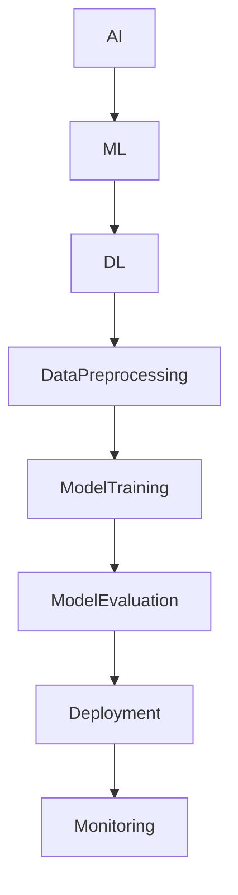

                 

# 人工智能创业：选择合适的技术栈

> **关键词：**人工智能、创业、技术栈、架构设计、编程语言、开发工具、算法选择

> **摘要：**本文将深入探讨人工智能创业中如何选择合适的技术栈。我们将从背景介绍、核心概念、算法原理、数学模型、实际应用场景、工具和资源推荐等方面进行详细分析，帮助创业者在竞争激烈的人工智能市场中找到自己的立足点。

## 1. 背景介绍

### 1.1 目的和范围

本文旨在为正在筹备或已经起步的人工智能创业项目提供技术选型的指导。我们将讨论如何根据项目的需求、规模和目标来选择合适的技术栈，包括编程语言、框架、工具和开发环境。

### 1.2 预期读者

- 人工智能创业者
- 软件开发工程师
- 技术团队负责人
- 对人工智能技术感兴趣的技术爱好者

### 1.3 文档结构概述

本文将分为以下几个部分：

1. 背景介绍：介绍本文的目的、预期读者和文档结构。
2. 核心概念与联系：介绍人工智能技术栈中的核心概念及其相互关系。
3. 核心算法原理 & 具体操作步骤：讲解常用的人工智能算法原理及具体实现步骤。
4. 数学模型和公式 & 详细讲解 & 举例说明：阐述人工智能算法背后的数学模型和公式，并通过实例进行说明。
5. 项目实战：提供实际代码案例，并详细解释代码实现过程。
6. 实际应用场景：探讨人工智能技术的实际应用场景。
7. 工具和资源推荐：推荐学习资源、开发工具和框架。
8. 总结：总结人工智能创业技术栈的选择原则和未来发展趋势。
9. 附录：常见问题与解答。
10. 扩展阅读 & 参考资料：提供进一步学习的资源。

### 1.4 术语表

#### 1.4.1 核心术语定义

- **技术栈**：指一个项目中使用的所有技术和工具的集合。
- **人工智能（AI）**：指由计算机实现的智能系统，能够模拟、延伸和扩展人类智能。
- **算法**：解决问题的方法，通常由一系列规则或步骤组成。
- **框架**：为特定任务提供一套预定义的组件和接口，简化开发过程。
- **编程语言**：用于编写计算机程序的语法和规则。

#### 1.4.2 相关概念解释

- **机器学习（ML）**：人工智能的一个分支，通过训练模型从数据中学习规律。
- **深度学习（DL）**：基于多层神经网络的机器学习方法。
- **数据预处理**：在训练模型之前对数据进行清洗、转换和归一化等操作。
- **框架集成度**：指框架在不同编程语言和平台上的兼容性和扩展性。

#### 1.4.3 缩略词列表

- **AI**：人工智能
- **ML**：机器学习
- **DL**：深度学习
- **IDE**：集成开发环境
- **GPU**：图形处理器

## 2. 核心概念与联系

在人工智能创业中，技术栈的选择至关重要。以下是一个简化的Mermaid流程图，展示了技术栈中核心概念之间的关系：



### 2.1 核心概念

- **人工智能（AI）**：是整个技术栈的基础，涵盖了机器学习、自然语言处理、计算机视觉等多个领域。
- **机器学习（ML）**：是人工智能的一种实现方式，通过训练模型从数据中学习规律。
- **深度学习（DL）**：是机器学习的一种重要分支，基于多层神经网络进行学习。
- **数据预处理**：在训练模型之前，对数据进行清洗、转换和归一化等操作，以提高模型性能。
- **模型训练**：通过训练算法，从数据中提取特征，并优化模型参数。
- **模型评估**：对训练好的模型进行性能评估，以确定其效果。
- **部署**：将训练好的模型部署到生产环境中，提供实时服务。
- **监控**：对部署后的模型进行监控，以确保其稳定运行和性能。

### 2.2 技术栈选择原则

在创业项目中选择合适的技术栈需要考虑以下几个原则：

1. **项目需求**：根据项目需求选择合适的算法和框架，确保技术栈能满足项目要求。
2. **团队技能**：选择团队熟悉的编程语言和框架，提高开发效率。
3. **性能和扩展性**：选择性能优异且易于扩展的技术栈，以适应未来需求。
4. **社区支持**：选择有良好社区支持的框架和工具，以便在开发过程中得到帮助。

## 3. 核心算法原理 & 具体操作步骤

在人工智能项目中，选择合适的算法至关重要。以下是一个简单的机器学习算法——线性回归的伪代码实现：

```plaintext
输入：训练数据集 D，特征矩阵 X，标签向量 y，学习率 α，迭代次数 n
输出：模型参数 θ

初始化 θ 为零向量
for i = 1 to n do
    for j = 0 to m do
        θ[j] = θ[j] - α * (hθ(x) - y)
    end
end

函数 hθ(x) 表示预测函数，θ 表示模型参数
hθ(x) = θ^T * x
```

### 3.1 数据预处理

在训练模型之前，需要对数据集进行预处理，以提高模型性能。以下是一些常用的数据预处理步骤：

1. **数据清洗**：处理缺失值、异常值和噪声数据。
2. **特征工程**：提取对模型有帮助的特征，例如特征缩放、特征组合等。
3. **数据归一化**：将特征数据缩放到相同的范围，以防止某些特征对模型的影响过大。

### 3.2 模型训练

模型训练的目标是通过迭代优化模型参数，使模型能够更好地拟合数据。以下是一个简单的梯度下降算法用于训练线性回归模型：

```plaintext
输入：训练数据集 D，特征矩阵 X，标签向量 y，学习率 α，迭代次数 n
输出：模型参数 θ

初始化 θ 为零向量
for i = 1 to n do
    hθ(x) = θ^T * x
    ∆θ = -α * (hθ(x) - y) * x
    θ = θ + ∆θ
end
```

### 3.3 模型评估

模型评估的方法包括：

1. **交叉验证**：通过将数据集划分为训练集和验证集，多次训练和验证，以评估模型性能。
2. **损失函数**：使用损失函数（如均方误差）评估模型预测的准确性。
3. **模型调参**：通过调整模型参数，优化模型性能。

## 4. 数学模型和公式 & 详细讲解 & 举例说明

### 4.1 数学模型

线性回归模型可以用以下公式表示：

$$
y = \theta_0 + \theta_1 \cdot x_1 + \theta_2 \cdot x_2 + ... + \theta_n \cdot x_n
$$

其中，$y$ 是标签，$x_1, x_2, ..., x_n$ 是特征，$\theta_0, \theta_1, ..., \theta_n$ 是模型参数。

### 4.2 损失函数

线性回归模型的损失函数通常使用均方误差（MSE）：

$$
MSE = \frac{1}{2} \sum_{i=1}^{n} (y_i - \hat{y_i})^2
$$

其中，$y_i$ 是真实标签，$\hat{y_i}$ 是预测标签。

### 4.3 举例说明

假设我们有一个简单的线性回归问题，目标是预测房屋价格。给定特征矩阵 $X$ 和标签向量 $y$，我们可以使用线性回归模型进行预测：

$$
y = \theta_0 + \theta_1 \cdot \text{面积} + \theta_2 \cdot \text{卧室数量}
$$

通过梯度下降算法训练模型，可以得到模型参数 $\theta_0, \theta_1, \theta_2$。然后，我们可以使用训练好的模型对新房屋进行预测，例如：

$$
\hat{y} = \theta_0 + \theta_1 \cdot 2000 + \theta_2 \cdot 3
$$

## 5. 项目实战：代码实际案例和详细解释说明

### 5.1 开发环境搭建

为了便于读者理解，我们将在Python环境中实现线性回归模型。以下是搭建开发环境的基本步骤：

1. 安装Python（推荐版本3.8及以上）
2. 安装Jupyter Notebook，用于编写和运行代码
3. 安装必要的库，如NumPy、Pandas、Scikit-learn等

```bash
pip install numpy pandas scikit-learn
```

### 5.2 源代码详细实现和代码解读

以下是一个简单的线性回归模型实现，包括数据预处理、模型训练和评估：

```python
import numpy as np
import pandas as pd
from sklearn.linear_model import LinearRegression
from sklearn.model_selection import train_test_split
from sklearn.metrics import mean_squared_error

# 加载数据集
data = pd.read_csv('house_price.csv')
X = data[['area', 'bedrooms']]
y = data['price']

# 数据预处理
X = X.values
y = y.values

# 划分训练集和测试集
X_train, X_test, y_train, y_test = train_test_split(X, y, test_size=0.2, random_state=42)

# 模型训练
model = LinearRegression()
model.fit(X_train, y_train)

# 模型评估
y_pred = model.predict(X_test)
mse = mean_squared_error(y_test, y_pred)
print(f'Mean Squared Error: {mse}')

# 输出模型参数
print(f'Model Parameters: {model.coef_}')
```

### 5.3 代码解读与分析

- **数据加载与预处理**：使用Pandas读取CSV文件，提取特征和标签，并进行预处理。
- **模型训练**：使用Scikit-learn的线性回归模型进行训练。
- **模型评估**：使用均方误差（MSE）评估模型性能，并输出结果。
- **输出模型参数**：打印模型的权重系数，用于分析特征对预测结果的影响。

## 6. 实际应用场景

线性回归模型在人工智能领域有着广泛的应用，以下是一些实际应用场景：

1. **房地产价格预测**：通过分析房屋面积和卧室数量等特征，预测房屋价格。
2. **股票价格预测**：基于历史股价和成交量等数据，预测未来股价走势。
3. **健康数据分析**：通过分析病人的年龄、体重、血压等特征，预测患病风险。
4. **教育资源优化**：分析学生的学习成绩和课外活动等数据，为教育资源分配提供建议。

## 7. 工具和资源推荐

### 7.1 学习资源推荐

#### 7.1.1 书籍推荐

- 《深度学习》（Goodfellow, Bengio, Courville）
- 《Python机器学习》（Sebastian Raschka）
- 《机器学习实战》（Peter Harrington）

#### 7.1.2 在线课程

- Coursera的“机器学习”课程（吴恩达）
- edX的“深度学习”课程（斯坦福大学）

#### 7.1.3 技术博客和网站

- Medium上的机器学习博客
- 知乎上的机器学习专栏

### 7.2 开发工具框架推荐

#### 7.2.1 IDE和编辑器

- PyCharm
- Jupyter Notebook
- VSCode

#### 7.2.2 调试和性能分析工具

- Matplotlib
- Seaborn
- TensorBoard

#### 7.2.3 相关框架和库

- Scikit-learn
- TensorFlow
- PyTorch

### 7.3 相关论文著作推荐

#### 7.3.1 经典论文

- "A Fast Learning Algorithm for Deep Belief Nets"（Hinton, Osindero, and Teh）
- "Deep Learning"（Goodfellow, Bengio, Courville）

#### 7.3.2 最新研究成果

- NeurIPS、ICML、JMLR等顶级会议的最新论文

#### 7.3.3 应用案例分析

- Google Brain团队的案例研究
- DeepMind在AlphaGo项目中的应用

## 8. 总结：未来发展趋势与挑战

随着人工智能技术的快速发展，创业者在选择技术栈时需要密切关注以下几点：

1. **算法创新**：不断探索新的算法和模型，以提高模型性能和应用范围。
2. **数据获取和处理**：确保有足够的高质量数据来训练和优化模型。
3. **计算能力**：利用GPU等高性能计算设备，加快模型训练和推理速度。
4. **跨学科合作**：与心理学、神经科学等领域专家合作，探索人工智能的新应用。
5. **伦理和法律**：关注人工智能技术的伦理和法律问题，确保技术的可持续发展。

## 9. 附录：常见问题与解答

### 9.1 如何选择合适的编程语言？

- **Python**：易于上手，拥有丰富的库和框架，适用于数据分析和深度学习。
- **Java**：稳定性和性能较好，适用于大型项目和企业级应用。
- **C++**：高性能，适用于需要优化计算性能的场景。

### 9.2 如何选择合适的框架？

- **Scikit-learn**：适用于传统的机器学习和数据挖掘任务。
- **TensorFlow**：适用于深度学习和大规模数据处理。
- **PyTorch**：灵活性和易用性较好，适用于快速原型设计和实验。

## 10. 扩展阅读 & 参考资料

- 《深度学习》（Goodfellow, Bengio, Courville）
- 《Python机器学习》（Sebastian Raschka）
- 《机器学习实战》（Peter Harrington）
- Coursera的“机器学习”课程（吴恩达）
- edX的“深度学习”课程（斯坦福大学）
- Medium上的机器学习博客
- 知乎上的机器学习专栏

---

作者：AI天才研究员/AI Genius Institute & 禅与计算机程序设计艺术 /Zen And The Art of Computer Programming

