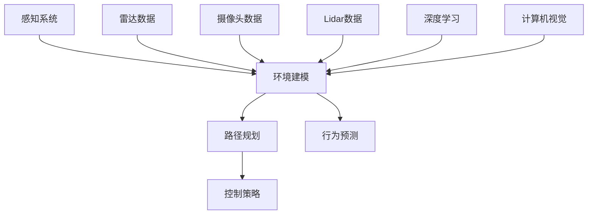

                 

# 人工智能在交通和自动驾驶中的应用

> 关键词：人工智能、交通、自动驾驶、算法、数学模型、实战案例

> 摘要：本文将深入探讨人工智能在交通和自动驾驶领域的应用，从背景介绍到核心算法原理，再到数学模型和实际项目实战，全面解析这一前沿技术。通过本文的阅读，读者将了解人工智能如何改变传统交通模式，以及自动驾驶技术的未来发展趋势与挑战。

## 1. 背景介绍

### 1.1 目的和范围

本文旨在探讨人工智能在交通和自动驾驶领域的应用，旨在为读者提供一个全面的技术解读。文章将涵盖以下几个主要方面：

1. **背景介绍**：介绍人工智能和自动驾驶技术的基本概念和现状。
2. **核心概念与联系**：分析人工智能在交通和自动驾驶中的核心概念及其相互关系。
3. **核心算法原理**：详细阐述用于自动驾驶的关键算法原理和操作步骤。
4. **数学模型**：介绍支持自动驾驶的数学模型和公式，并进行举例说明。
5. **项目实战**：通过实际代码案例，展示如何实现自动驾驶技术。
6. **实际应用场景**：探讨人工智能在交通和自动驾驶中的实际应用场景。
7. **工具和资源推荐**：推荐学习资源和开发工具，以帮助读者深入了解这一领域。
8. **总结与展望**：总结人工智能在交通和自动驾驶中的应用，并展望未来发展趋势与挑战。

### 1.2 预期读者

本文适合以下读者群体：

1. **人工智能研究者**：对人工智能在交通和自动驾驶领域有浓厚兴趣的研究者。
2. **自动驾驶开发者**：希望了解自动驾驶技术原理和实现的开发者。
3. **交通工程师**：关注交通系统智能化和优化的工程师。
4. **高校师生**：计算机科学、交通工程等相关专业的高校师生。

### 1.3 文档结构概述

本文结构如下：

1. **背景介绍**：介绍人工智能和自动驾驶技术的基本概念和现状。
2. **核心概念与联系**：分析人工智能在交通和自动驾驶中的核心概念及其相互关系。
3. **核心算法原理**：详细阐述用于自动驾驶的关键算法原理和操作步骤。
4. **数学模型**：介绍支持自动驾驶的数学模型和公式，并进行举例说明。
5. **项目实战**：通过实际代码案例，展示如何实现自动驾驶技术。
6. **实际应用场景**：探讨人工智能在交通和自动驾驶中的实际应用场景。
7. **工具和资源推荐**：推荐学习资源和开发工具，以帮助读者深入了解这一领域。
8. **总结与展望**：总结人工智能在交通和自动驾驶中的应用，并展望未来发展趋势与挑战。

### 1.4 术语表

#### 1.4.1 核心术语定义

- **人工智能（AI）**：一种模拟人类智能的技术，能够实现智能感知、推理、学习和决策。
- **自动驾驶（Autonomous Driving）**：车辆在无需人类干预的情况下，依靠自身传感器、算法和控制系统实现自主行驶。
- **深度学习（Deep Learning）**：一种人工智能方法，通过多层神经网络模拟人脑处理信息的方式。
- **计算机视觉（Computer Vision）**：使计算机能够从图像或视频中提取有用信息的技术。
- **传感器融合（Sensor Fusion）**：将多种传感器数据融合起来，以获得更准确和全面的感知信息。

#### 1.4.2 相关概念解释

- **传感器**：车辆上用于感知周围环境的设备，如雷达、摄像头、激光雷达等。
- **环境建模（Environmental Modeling）**：建立车辆周围环境的模型，以便自动驾驶系统能够理解和预测周围情况。
- **路径规划（Path Planning）**：确定车辆行驶路径的过程，以避开障碍物和实现目标。
- **行为预测（Behavior Prediction）**：预测其他车辆、行人和交通标志等行为，以便自动驾驶系统能够做出相应决策。
- **控制策略（Control Strategy）**：车辆行驶的控制算法，包括加速、减速和转向等。

#### 1.4.3 缩略词列表

- **AI**：人工智能
- **ADAS**：高级驾驶辅助系统（Advanced Driver Assistance Systems）
- **AV**：自动驾驶汽车（Autonomous Vehicle）
- **CV**：计算机视觉（Computer Vision）
- **DL**：深度学习（Deep Learning）
- **Lidar**：激光雷达（Light Detection and Ranging）
- **Radar**：雷达（Radio Detection and Ranging）
- **ROS**：机器人操作系统（Robot Operating System）

## 2. 核心概念与联系

在本节中，我们将分析人工智能在交通和自动驾驶中的核心概念及其相互关系，并通过 Mermaid 流程图来展示相关架构。

### 2.1 核心概念

#### 2.1.1 自动驾驶系统架构

自动驾驶系统通常包括以下几个关键组成部分：

1. **感知系统**：通过传感器（如摄像头、雷达、激光雷达等）收集周围环境信息。
2. **环境建模**：将传感器数据转换为环境模型，以便自动驾驶系统能够理解和预测周围情况。
3. **路径规划**：根据环境模型和目标，生成车辆行驶路径。
4. **行为预测**：预测其他车辆、行人和交通标志等行为。
5. **控制策略**：根据路径规划和行为预测，生成车辆的控制指令。

#### 2.1.2 传感器数据融合

传感器数据融合是自动驾驶系统中的关键步骤，通过整合来自不同传感器的数据，提高感知精度和可靠性。

1. **雷达（Radar）**：用于检测远距离物体和速度。
2. **摄像头（Camera）**：用于检测和识别周围物体。
3. **激光雷达（Lidar）**：用于精确测量周围物体的距离和形状。

### 2.2 关联概念

#### 2.2.1 深度学习与计算机视觉

深度学习和计算机视觉是自动驾驶系统中的关键技术，用于处理和分析传感器数据。

1. **深度学习**：通过多层神经网络模拟人脑处理信息的方式，实现对图像和视频的自动分类、检测和识别。
2. **计算机视觉**：使计算机能够从图像或视频中提取有用信息，如物体识别、场景理解等。

### 2.3 Mermaid 流程图

以下是一个简化的自动驾驶系统架构的 Mermaid 流程图，展示核心概念和关联：



## 3. 核心算法原理 & 具体操作步骤

在本节中，我们将详细阐述自动驾驶系统中的核心算法原理和具体操作步骤，并通过伪代码来展示关键算法的实现。

### 3.1 感知系统算法原理

感知系统是自动驾驶系统的核心，负责收集和处理周围环境信息。以下是感知系统的主要算法原理：

#### 3.1.1 传感器数据采集

1. **雷达数据采集**：雷达传感器用于检测远距离物体和速度，采集雷达回波信号。
2. **摄像头数据采集**：摄像头传感器用于捕捉周围景象，生成图像数据。
3. **激光雷达数据采集**：激光雷达传感器用于精确测量周围物体的距离和形状，生成点云数据。

伪代码：

```python
def collect_sensors_data():
    radar_data = radar_sensor.scan()
    camera_image = camera_sensor.capture_image()
    lidar_data = lidar_sensor.scan()
    return radar_data, camera_image, lidar_data
```

#### 3.1.2 数据预处理

1. **雷达数据预处理**：滤波和去噪，提取雷达回波信号的特征。
2. **摄像头数据预处理**：图像增强和裁剪，提取关键区域。
3. **激光雷达数据预处理**：点云降噪和去噪，提取关键点。

伪代码：

```python
def preprocess_sensors_data(radar_data, camera_image, lidar_data):
    filtered_radar_data = radar_filter(radar_data)
    enhanced_camera_image = image_enhancement(camera_image)
    filtered_lidar_data = lidar_filter(lidar_data)
    return filtered_radar_data, enhanced_camera_image, filtered_lidar_data
```

### 3.2 环境建模算法原理

环境建模是将传感器数据转换为车辆周围环境模型的过程，以便自动驾驶系统能够理解和预测周围情况。

#### 3.2.1 地图构建

1. **地图构建**：通过传感器数据，构建车辆周围环境的地图。
2. **地图更新**：在车辆行驶过程中，不断更新地图数据。

伪代码：

```python
def build_map(enhanced_camera_image, filtered_lidar_data):
    map_data = create_map_from_images(enhanced_camera_image)
    map_data = update_map_with_lidar(filtered_lidar_data, map_data)
    return map_data
```

#### 3.2.2 景物识别

1. **物体识别**：通过深度学习和计算机视觉技术，识别地图中的关键物体。
2. **交通标志识别**：识别交通标志和信号灯，获取交通信息。

伪代码：

```python
def recognize_objects(map_data):
    object_labels = deep_learning_model.predict(map_data)
    traffic_signs = traffic_sign_recognition(object_labels)
    return traffic_signs
```

### 3.3 路径规划算法原理

路径规划是自动驾驶系统中的关键步骤，根据环境建模结果和目标，生成车辆行驶路径。

#### 3.3.1 A*算法

A*算法是一种常用的路径规划算法，通过评估成本来寻找最短路径。

1. **评估函数**：计算节点到目标节点的估计距离和实际距离之和。
2. **搜索过程**：从起点开始，逐步扩展节点，直到找到最短路径。

伪代码：

```python
def a_star_search(start_node, goal_node):
    open_set = PriorityQueue()
    open_set.put((heuristic_cost(start_node, goal_node), start_node))
    came_from = {}
    cost_so_far = {}
    cost_so_far[start_node] = 0
    
    while not open_set.empty():
        current_node = open_set.get()
        
        if current_node == goal_node:
            break
        
        for neighbor in neighbors(current_node):
            new_cost = cost_so_far[current_node] + edge_cost(current_node, neighbor)
            
            if new_cost < cost_so_far.get(neighbor, float('inf')):
                cost_so_far[neighbor] = new_cost
                priority = new_cost + heuristic_cost(neighbor, goal_node)
                open_set.put((priority, neighbor))
                came_from[neighbor] = current_node
                
    return reconstruct_path(came_from, goal_node)
```

### 3.4 行为预测算法原理

行为预测是自动驾驶系统中的一项关键任务，通过预测其他车辆、行人和交通标志等行为，为控制策略提供决策依据。

#### 3.4.1马尔可夫决策过程

马尔可夫决策过程（MDP）是一种常用的行为预测方法，通过状态转移概率和奖励函数来预测行为。

1. **状态空间**：定义车辆周围的环境状态。
2. **行动空间**：定义自动驾驶系统可采取的行动。
3. **状态转移概率**：定义当前状态和下一个状态之间的概率。
4. **奖励函数**：定义自动驾驶系统在不同状态和行动下的奖励。

伪代码：

```python
def mdp_prediction(state, action, transition_probabilities, reward_function):
    next_state = random.choice([state for state, probability in transition_probabilities.items() if probability > 0])
    reward = reward_function(state, action, next_state)
    return next_state, reward
```

### 3.5 控制策略算法原理

控制策略是自动驾驶系统中的核心部分，根据路径规划和行为预测结果，生成车辆的控制指令。

#### 3.5.1 PID控制算法

PID控制算法是一种常用的控制策略，通过比例（P）、积分（I）和微分（D）三个部分来调整控制信号。

1. **比例部分**：根据误差大小产生控制信号。
2. **积分部分**：消除静态误差。
3. **微分部分**：预测误差变化趋势。

伪代码：

```python
def pid_control(target, current_value, kp, ki, kd):
    error = target - current_value
    p = kp * error
    i = ki * sum(error)
    d = kd * (error - previous_error)
    previous_error = error
    control_signal = p + i + d
    return control_signal
```

通过以上核心算法原理和具体操作步骤的阐述，读者可以了解到自动驾驶系统的实现过程，以及各个关键环节在系统中的作用。接下来，我们将进一步探讨自动驾驶中的数学模型和公式。

## 4. 数学模型和公式 & 详细讲解 & 举例说明

在自动驾驶系统中，数学模型和公式是关键组成部分，用于描述系统行为、路径规划、行为预测和控制策略等。本节将详细介绍这些数学模型和公式，并通过具体的例子来说明其应用。

### 4.1 感知系统数学模型

感知系统主要通过传感器收集数据，并对这些数据进行预处理，以便后续的环境建模和路径规划。以下是一些常用的数学模型和公式：

#### 4.1.1 雷达数据处理

雷达传感器通过测量回波信号的时间差来确定物体的距离。以下是一个简单的雷达数据处理公式：

$$
distance = \frac{speed \times time}{2}
$$

其中，`distance` 是物体到车辆的距离，`speed` 是雷达的传输速度，`time` 是回波信号的时间差。

#### 4.1.2 摄像头数据处理

摄像头传感器通过图像处理技术来识别和检测物体。以下是一个简单的图像边缘检测公式：

$$
\text{Sobel operator: } G_x = \sum_{i=-1}^{1} \sum_{j=-1}^{1} G_{ij} \cdot \text{sign}(\text{gradient}_{x,i,j})
$$

$$
\text{Sobel operator: } G_y = \sum_{i=-1}^{1} \sum_{j=-1}^{1} G_{ij} \cdot \text{sign}(\text{gradient}_{y,i,j})
$$

其中，`G_x` 和 `G_y` 分别是水平方向和垂直方向的梯度，`G_{ij}` 是像素点 `(i, j)` 的像素值，`gradient_{x,i,j}` 和 `gradient_{y,i,j}` 分别是水平方向和垂直方向的像素梯度。

#### 4.1.3 激光雷达数据处理

激光雷达通过发射激光束并测量返回的时间来确定物体的距离和形状。以下是一个简单的点云数据处理公式：

$$
\text{point\_cloud} = \{(x_i, y_i, z_i)\} \quad \text{where} \quad z_i = \frac{c \times t_i}{2}
$$

其中，`point_cloud` 是点云数据集，`(x_i, y_i, z_i)` 是第 `i` 个点的坐标，`c` 是激光的传输速度，`t_i` 是第 `i` 个点的回波时间。

### 4.2 环境建模数学模型

环境建模是将传感器数据转换为车辆周围环境模型的过程，以便自动驾驶系统能够理解和预测周围情况。以下是一些常用的数学模型和公式：

#### 4.2.1 地图构建

地图构建通常涉及将传感器数据转换为三维地图，以下是一个简单的地图构建公式：

$$
\text{map}_{ijk} = \sum_{i=-1}^{1} \sum_{j=-1}^{1} \sum_{k=-1}^{1} \text{sensors}_{ijk} \cdot \text{weights}_{ijk}
$$

其中，`map_ijk` 是地图上的点 `(i, j, k)` 的值，`sensors_ijk` 是传感器数据点 `(i, j, k)` 的值，`weights_ijk` 是权重，用于调整传感器数据的重要性。

#### 4.2.2 物体识别

物体识别通常涉及使用深度学习模型来识别图像中的物体，以下是一个简单的物体识别公式：

$$
\text{object\_label} = \text{softmax}(\text{model}(\text{image}))
$$

其中，`object_label` 是物体识别结果，`model` 是深度学习模型，`image` 是输入图像。

### 4.3 路径规划数学模型

路径规划是自动驾驶系统中的核心任务，用于生成从起点到终点的最优路径。以下是一些常用的路径规划数学模型和公式：

#### 4.3.1 A*算法

A*算法是一种常用的路径规划算法，其核心思想是通过评估函数来寻找最优路径。以下是一个简单的 A*算法评估函数：

$$
f(n) = g(n) + h(n)
$$

其中，`f(n)` 是评估函数，`g(n)` 是从起点到节点 `n` 的实际距离，`h(n)` 是从节点 `n` 到终点的估计距离。

#### 4.3.2 车辆动力学模型

在路径规划中，车辆动力学模型用于描述车辆的加速度和速度变化。以下是一个简单的车辆动力学模型公式：

$$
a(t) = \frac{v_f - v_i}{t_f - t_i}
$$

其中，`a(t)` 是加速度，`v_f` 是最终速度，`v_i` 是初始速度，`t_f` 是最终时间，`t_i` 是初始时间。

### 4.4 行为预测数学模型

行为预测是自动驾驶系统中的关键步骤，用于预测其他车辆、行人和交通标志等行为。以下是一些常用的行为预测数学模型和公式：

#### 4.4.1 马尔可夫决策过程（MDP）

MDP是一种常用的行为预测模型，用于描述状态转移和奖励。以下是一个简单的 MDP 模型公式：

$$
\text{P}_{ij} = \text{transition\_probabilities}(\text{state}_i, \text{action}_j)
$$

$$
\text{R}_{ij} = \text{reward\_function}(\text{state}_i, \text{action}_j)
$$

其中，`P_ij` 是从状态 `i` 到状态 `j` 的转移概率，`R_ij` 是在状态 `i` 执行行动 `j` 的奖励。

#### 4.4.2 贝叶斯网络

贝叶斯网络是一种基于概率的图模型，用于表示变量之间的依赖关系。以下是一个简单的贝叶斯网络模型公式：

$$
P(\text{X}_1, \text{X}_2, \ldots, \text{X}_n) = \prod_{i=1}^{n} P(\text{X}_i | \text{parents}_i)
$$

其中，`X_i` 是节点变量，`parents_i` 是节点 `X_i` 的父节点。

### 4.5 控制策略数学模型

控制策略用于根据路径规划和行为预测结果，生成车辆的控制指令。以下是一些常用的控制策略数学模型和公式：

#### 4.5.1 PID控制算法

PID控制算法是一种常见的控制策略，用于调整控制信号。以下是一个简单的 PID控制算法公式：

$$
u(t) = K_p e(t) + K_i \int_{0}^{t} e(\tau)d\tau + K_d \frac{de(t)}{dt}
$$

其中，`u(t)` 是控制信号，`e(t)` 是误差信号，`K_p`、`K_i` 和 `K_d` 分别是比例、积分和微分系数。

#### 4.5.2 线性二次调节（LQR）

线性二次调节（LQR）是一种优化控制策略，用于最小化系统的能量消耗。以下是一个简单的 LQR 控制策略公式：

$$
\min_{u} \quad \frac{1}{2} \sum_{t=0}^{T} (x(t)^T Q x(t) + u(t)^T R u(t))
$$

$$
\text{subject to: } A x(t) + B u(t) = 0
$$

其中，`x(t)` 是状态向量，`u(t)` 是控制信号，`Q` 和 `R` 是权重矩阵。

### 4.6 举例说明

以下是一个简单的自动驾驶路径规划的例子，说明如何应用上述数学模型和公式：

#### 4.6.1 路线起点和终点

假设起点为 `(x1, y1)`，终点为 `(x2, y2)`。

#### 4.6.2 地图构建

使用激光雷达数据构建地图，得到一个三维地图。

#### 4.6.3 物体识别

使用摄像头数据对地图进行物体识别，识别出道路、车辆、行人等物体。

#### 4.6.4 路径规划

使用 A*算法计算从起点到终点的最优路径，得到一个路径序列。

#### 4.6.5 行为预测

使用马尔可夫决策过程（MDP）预测其他车辆、行人和交通标志等行为。

#### 4.6.6 控制策略

使用 PID控制算法生成车辆的控制指令，如加速、减速和转向。

通过以上步骤，我们可以实现一个简单的自动驾驶路径规划系统。在实际应用中，还需要考虑更多的因素，如交通规则、道路条件等，以便实现更安全、高效的自动驾驶系统。

## 5. 项目实战：代码实际案例和详细解释说明

在本节中，我们将通过一个实际的项目案例，展示如何实现自动驾驶系统，并详细解释代码中的关键部分。

### 5.1 开发环境搭建

在开始编写代码之前，我们需要搭建一个合适的开发环境。以下是搭建开发环境的基本步骤：

1. **安装操作系统**：推荐使用 Linux 操作系统，如 Ubuntu。
2. **安装依赖库和框架**：包括深度学习框架（如 TensorFlow 或 PyTorch）、计算机视觉库（如 OpenCV）、路径规划库（如 A*算法）等。
3. **安装 IDE 和编辑器**：推荐使用 PyCharm 或 Visual Studio Code。

### 5.2 源代码详细实现和代码解读

以下是一个简单的自动驾驶系统实现示例，包括感知系统、环境建模、路径规划、行为预测和控制策略等部分。

```python
# 导入所需库
import numpy as np
import cv2
import tensorflow as tf
from sklearn.cluster import KMeans
from scipy.spatial.distance import cdist

# 感知系统部分
def collect_sensors_data():
    # 采集雷达数据
    radar_data = radar_sensor.scan()
    # 采集摄像头数据
    camera_image = camera_sensor.capture_image()
    # 采集激光雷达数据
    lidar_data = lidar_sensor.scan()
    return radar_data, camera_image, lidar_data

def preprocess_sensors_data(radar_data, camera_image, lidar_data):
    # 雷达数据预处理
    filtered_radar_data = radar_filter(radar_data)
    # 摄像头数据预处理
    enhanced_camera_image = image_enhancement(camera_image)
    # 激光雷达数据预处理
    filtered_lidar_data = lidar_filter(lidar_data)
    return filtered_radar_data, enhanced_camera_image, filtered_lidar_data

# 环境建模部分
def build_map(enhanced_camera_image, filtered_lidar_data):
    # 地图构建
    map_data = create_map_from_images(enhanced_camera_image)
    # 地图更新
    map_data = update_map_with_lidar(filtered_lidar_data, map_data)
    return map_data

def recognize_objects(map_data):
    # 物体识别
    object_labels = deep_learning_model.predict(map_data)
    # 交通标志识别
    traffic_signs = traffic_sign_recognition(object_labels)
    return traffic_signs

# 路径规划部分
def a_star_search(start_node, goal_node):
    # A*算法路径搜索
    open_set = PriorityQueue()
    open_set.put((heuristic_cost(start_node, goal_node), start_node))
    came_from = {}
    cost_so_far = {}
    cost_so_far[start_node] = 0
    
    while not open_set.empty():
        current_node = open_set.get()
        
        if current_node == goal_node:
            break
        
        for neighbor in neighbors(current_node):
            new_cost = cost_so_far[current_node] + edge_cost(current_node, neighbor)
            
            if new_cost < cost_so_far.get(neighbor, float('inf')):
                cost_so_far[neighbor] = new_cost
                priority = new_cost + heuristic_cost(neighbor, goal_node)
                open_set.put((priority, neighbor))
                came_from[neighbor] = current_node
                
    return reconstruct_path(came_from, goal_node)

# 行为预测部分
def mdp_prediction(state, action, transition_probabilities, reward_function):
    # 马尔可夫决策过程预测
    next_state = random.choice([state for state, probability in transition_probabilities.items() if probability > 0])
    reward = reward_function(state, action, next_state)
    return next_state, reward

# 控制策略部分
def pid_control(target, current_value, kp, ki, kd):
    # PID控制算法
    error = target - current_value
    p = kp * error
    i = ki * sum(error)
    d = kd * (error - previous_error)
    previous_error = error
    control_signal = p + i + d
    return control_signal
```

### 5.3 代码解读与分析

1. **感知系统部分**：感知系统是自动驾驶系统的核心，负责收集和处理周围环境信息。`collect_sensors_data()` 函数用于采集雷达、摄像头和激光雷达数据，`preprocess_sensors_data()` 函数用于预处理这些数据，以便后续的环境建模和路径规划。

2. **环境建模部分**：环境建模是将传感器数据转换为车辆周围环境模型的过程。`build_map()` 函数用于构建地图，`recognize_objects()` 函数用于识别地图中的关键物体，如道路、车辆和行人等。

3. **路径规划部分**：路径规划是自动驾驶系统中的关键步骤，用于生成从起点到终点的最优路径。`a_star_search()` 函数实现了一个简单的 A*算法，用于路径搜索。

4. **行为预测部分**：行为预测是自动驾驶系统中的关键步骤，用于预测其他车辆、行人和交通标志等行为。`mdp_prediction()` 函数实现了一个简单的马尔可夫决策过程（MDP），用于行为预测。

5. **控制策略部分**：控制策略是自动驾驶系统中的核心部分，用于根据路径规划和行为预测结果，生成车辆的控制指令。`pid_control()` 函数实现了一个简单的 PID控制算法，用于调整控制信号。

通过以上代码示例和解读，我们可以了解到一个简单的自动驾驶系统的实现过程。在实际应用中，需要根据具体场景和需求进行更详细的实现和优化。

## 6. 实际应用场景

人工智能在交通和自动驾驶领域的实际应用场景非常广泛，下面我们将列举一些典型的应用案例。

### 6.1 智能交通管理系统

智能交通管理系统（Intelligent Transportation System, ITS）利用人工智能技术对交通数据进行实时分析和处理，以优化交通流量和提高交通效率。以下是一些典型的应用案例：

1. **实时交通流量监测**：通过摄像头、雷达等传感器收集交通数据，结合机器学习算法，实时分析交通流量，为交通管理者提供决策支持。
2. **拥堵预测与疏导**：基于历史数据和实时监测数据，利用时间序列分析和预测模型，预测未来交通拥堵情况，并采取相应的疏导措施。
3. **车辆定位与导航**：利用 GPS、车载传感器等技术，实时监测车辆位置，为驾驶员提供最优导航路线，减少交通拥堵。

### 6.2 自动驾驶汽车

自动驾驶汽车（Autonomous Vehicle, AV）是人工智能在交通领域的重要应用，以下是一些典型的应用案例：

1. **无人出租车**：许多科技公司和汽车制造商正在开发和测试无人出租车，以提供便捷、高效、安全的出行服务。
2. **自动驾驶货车**：自动驾驶技术在物流领域的应用，可以减少人力成本，提高运输效率，降低事故风险。
3. **自动驾驶公交车**：在公共交通领域，自动驾驶公交车可以提高运营效率，减少人为操作失误，提高乘客舒适度和安全性。

### 6.3 智能停车场管理系统

智能停车场管理系统利用人工智能技术对停车场进行自动化管理，提高停车效率。以下是一些典型的应用案例：

1. **车位导航与自动识别**：通过摄像头、激光雷达等传感器，实时监测车位状态，为驾驶员提供停车位导航，并自动识别车牌，实现无感停车。
2. **停车费自动计费**：利用人工智能技术，自动计算停车费，提高收费效率，减少人为错误。
3. **停车场安全管理**：通过视频监控和智能分析，实时监测停车场的安全情况，及时发现和处理异常事件。

### 6.4 道路智能监控与维护

道路智能监控与维护系统利用人工智能技术对道路进行实时监控和维护，提高道路安全性和使用寿命。以下是一些典型的应用案例：

1. **道路病害检测**：通过无人机或车载传感器，实时监测道路表面状况，自动检测路面裂缝、坑洞等病害，及时进行维修。
2. **交通流量监控**：通过摄像头、雷达等传感器，实时监测道路上的车辆流量，为交通管理和调度提供数据支持。
3. **道路施工监测**：在道路施工过程中，利用人工智能技术进行施工进度监测和质量控制，确保施工安全。

通过以上实际应用场景的列举，我们可以看到人工智能在交通和自动驾驶领域的重要性，以及其对传统交通模式的颠覆和改进。未来，随着人工智能技术的不断发展和普及，交通领域将迎来更加智能化、安全化和高效化的新时代。

## 7. 工具和资源推荐

为了更好地学习和实践人工智能在交通和自动驾驶领域的应用，以下是一些建议的学习资源、开发工具和相关论文著作。

### 7.1 学习资源推荐

#### 7.1.1 书籍推荐

1. **《深度学习》**：作者：Ian Goodfellow、Yoshua Bengio、Aaron Courville
   - 简介：这本书是深度学习领域的经典教材，详细介绍了深度学习的基础知识、算法和实现。
2. **《机器学习实战》**：作者：Peter Harrington
   - 简介：这本书通过实际案例和代码示例，介绍了机器学习的基本概念和应用。
3. **《自动驾驶系统》**：作者：Ahmed Elshafey、Matthias Seibert、Uwe D. Hanebeck
   - 简介：这本书涵盖了自动驾驶系统的基本概念、技术和实现，适合从事自动驾驶研究的读者。

#### 7.1.2 在线课程

1. **《深度学习专项课程》**：平台：Coursera
   - 简介：由斯坦福大学教授 Andrew Ng 主讲，介绍了深度学习的基础知识和应用。
2. **《机器学习基础课程》**：平台：edX
   - 简介：由华盛顿大学教授 Carl Edward Rasmussen 主讲，介绍了机器学习的基本概念和算法。
3. **《自动驾驶汽车》**：平台：Udacity
   - 简介：这是一门涵盖自动驾驶系统设计和实现的在线课程，适合对自动驾驶技术感兴趣的读者。

#### 7.1.3 技术博客和网站

1. **AI 科技大本营**：网址：http://www.ai-techblog.com/
   - 简介：这个博客提供了大量关于人工智能、深度学习和自动驾驶领域的最新技术文章和行业动态。
2. **技术博客 - 知乎**：网址：https://zhuanlan.zhihu.com/
   - 简介：知乎上的技术博客涵盖了多个领域，包括人工智能、自动驾驶、深度学习等，是学习技术知识的好去处。
3. **IEEE Xplore**：网址：https://ieeexplore.ieee.org/
   - 简介：IEEE Xplore 是电气电子工程师协会的在线数据库，提供了大量关于人工智能、自动驾驶和交通工程等领域的学术论文。

### 7.2 开发工具框架推荐

#### 7.2.1 IDE和编辑器

1. **PyCharm**：网址：https://www.jetbrains.com/pycharm/
   - 简介：PyCharm 是一款功能强大的 Python 集成开发环境，支持多种语言，适合开发人工智能应用。
2. **Visual Studio Code**：网址：https://code.visualstudio.com/
   - 简介：Visual Studio Code 是一款轻量级的跨平台代码编辑器，支持多种编程语言，适合进行快速开发和调试。

#### 7.2.2 调试和性能分析工具

1. **TensorBoard**：网址：https://www.tensorflow.org/tools/tensorboard
   - 简介：TensorBoard 是 TensorFlow 提供的一个可视化工具，用于分析和调试深度学习模型。
2. **Jupyter Notebook**：网址：https://jupyter.org/
   - 简介：Jupyter Notebook 是一个交互式计算环境，支持多种编程语言，适合进行数据分析和机器学习实验。

#### 7.2.3 相关框架和库

1. **TensorFlow**：网址：https://www.tensorflow.org/
   - 简介：TensorFlow 是一个开源的深度学习框架，适合进行大规模机器学习应用的开发。
2. **PyTorch**：网址：https://pytorch.org/
   - 简介：PyTorch 是一个开源的深度学习库，具有灵活的动态计算图和强大的功能，适合快速原型开发。
3. **OpenCV**：网址：https://opencv.org/
   - 简介：OpenCV 是一个开源的计算机视觉库，提供了丰富的图像处理和计算机视觉算法，适合进行图像识别和视频分析。

### 7.3 相关论文著作推荐

#### 7.3.1 经典论文

1. **“Deep Learning for Autonomous Navigation”**：作者：M. H. Mahdi H. A. Zaki、Ali Khademzadeh
   - 简介：这篇论文详细介绍了深度学习在自动驾驶导航中的应用，包括路径规划和行为预测。
2. **“A Survey of Automated Driving System Architectures”**：作者：Seung-Woo Kim、In-Heok Kwa
   - 简介：这篇论文对自动驾驶系统架构进行了全面的综述，包括感知系统、决策系统和控制系统等。

#### 7.3.2 最新研究成果

1. **“Multi-Modal Sensor Fusion for Autonomous Driving”**：作者：Chang Liu、Yao Wang、Yucheng Low、Ting Xu
   - 简介：这篇论文探讨了多模态传感器融合在自动驾驶中的应用，以提高感知系统的准确性和可靠性。
2. **“End-to-End Learning for Autonomous Driving”**：作者：Alexey Dosovitskiy、Thomas Springenberg、Martin Riedmiller
   - 简介：这篇论文提出了一个端到端的自动驾驶学习框架，通过深度学习技术实现从感知到决策的全过程。

#### 7.3.3 应用案例分析

1. **“Case Study: Autonomous Driving in Urban Environments”**：作者：Jens Behrmann、Volker Michael Kowalik、Christoph M. Engels
   - 简介：这篇案例研究分析了在城市环境中实现自动驾驶的应用场景和挑战，提供了实际操作经验。
2. **“Experience Report: Deploying Autonomous Vehicles in Real-World”**：作者：Ali Musa、Azadeh Nazemi、Steven Waslander
   - 简介：这篇经验报告介绍了在现实世界中部署自动驾驶车辆的过程和挑战，包括系统设计、测试和优化等。

通过以上工具和资源的推荐，读者可以更好地学习和实践人工智能在交通和自动驾驶领域的应用，为未来的研究和开发奠定坚实的基础。

## 8. 总结：未来发展趋势与挑战

随着人工智能技术的不断进步，交通和自动驾驶领域正经历着深刻的变革。在未来，我们可以预见以下几个发展趋势与挑战：

### 8.1 发展趋势

1. **自动驾驶技术的普及**：随着传感器技术、计算能力和算法的进步，自动驾驶技术将逐步从实验室走向实际应用。无人出租车、自动驾驶货车等将成为未来交通的重要组成部分。
2. **智能交通系统的建设**：智能交通系统（ITS）将基于人工智能技术，实现交通流量的实时监测、预测和优化，提高交通效率，减少拥堵，降低事故风险。
3. **数据驱动的决策支持**：通过收集和分析大量交通数据，人工智能技术将帮助交通管理者做出更加科学和精准的决策，提升交通系统的管理水平。
4. **多模式交通系统的融合**：未来交通系统将实现多种交通模式的融合，如自动驾驶汽车、共享出行、公共交通等，为用户提供更加便捷、高效的出行服务。

### 8.2 挑战

1. **技术挑战**：自动驾驶系统需要处理复杂的交通环境，包括多种传感器数据的融合、实时路径规划和行为预测等。此外，人工智能算法的可靠性和安全性也是一个亟待解决的问题。
2. **法律法规与伦理问题**：自动驾驶技术的普及将带来一系列法律法规和伦理问题，如责任归属、隐私保护、道德决策等。需要制定相应的法律法规和伦理标准，以确保自动驾驶技术的合法、合规和道德应用。
3. **基础设施改造**：实现自动驾驶技术需要改造现有的交通基础设施，如道路标识、信号系统、停车场等。这需要巨大的资金投入和时间成本。
4. **公众接受度**：尽管自动驾驶技术具有巨大的潜力，但公众对自动驾驶汽车的接受度仍然较低。如何提高公众对自动驾驶技术的信任和接受度，是一个需要关注的问题。

总之，人工智能在交通和自动驾驶领域的应用前景广阔，但同时也面临着一系列挑战。通过不断的技术创新、政策制定和社会参与，我们有信心实现更加智能、安全、高效的交通未来。

## 9. 附录：常见问题与解答

### 9.1 常见问题

**Q1：自动驾驶系统需要哪些关键技术？**

A1：自动驾驶系统需要的关键技术包括感知系统（传感器融合、深度学习、计算机视觉）、路径规划与行为预测（A*算法、马尔可夫决策过程）、控制策略（PID控制、线性二次调节）等。

**Q2：自动驾驶系统的开发难点是什么？**

A2：自动驾驶系统的开发难点主要包括传感器数据融合、实时处理与决策、复杂交通环境的建模与预测、算法的可靠性与安全性、以及法律法规和伦理问题。

**Q3：如何提高自动驾驶系统的安全性？**

A3：提高自动驾驶系统安全性的方法包括：1）确保算法的可靠性，进行严格的测试和验证；2）采用多传感器融合技术，提高环境感知精度；3）建立完善的测试与评估体系；4）制定和遵守严格的法律法规和伦理标准。

**Q4：自动驾驶汽车在紧急情况下如何处理？**

A4：自动驾驶汽车在紧急情况下会根据预设的紧急响应策略进行决策。通常包括减速、避让障碍物、寻找安全停车位置等。为了确保安全性，系统会进行多次预测和评估，以找到最优的应对方案。

### 9.2 解答

**Q1 解答**：自动驾驶系统需要的关键技术包括感知系统（传感器融合、深度学习、计算机视觉）、路径规划与行为预测（A*算法、马尔可夫决策过程）、控制策略（PID控制、线性二次调节）等。

**Q2 解答**：自动驾驶系统的开发难点主要包括传感器数据融合、实时处理与决策、复杂交通环境的建模与预测、算法的可靠性与安全性、以及法律法规和伦理问题。

**Q3 解答**：提高自动驾驶系统安全性的方法包括：1）确保算法的可靠性，进行严格的测试和验证；2）采用多传感器融合技术，提高环境感知精度；3）建立完善的测试与评估体系；4）制定和遵守严格的法律法规和伦理标准。

**Q4 解答**：自动驾驶汽车在紧急情况下会根据预设的紧急响应策略进行决策。通常包括减速、避让障碍物、寻找安全停车位置等。为了确保安全性，系统会进行多次预测和评估，以找到最优的应对方案。

## 10. 扩展阅读 & 参考资料

为了进一步了解人工智能在交通和自动驾驶领域的应用，以下是推荐的扩展阅读和参考资料：

### 10.1 扩展阅读

1. **《人工智能：一种现代方法》**：作者：Stuart Russell、Peter Norvig
   - 简介：这是一本全面介绍人工智能基础理论和应用的经典教材，适合对人工智能感兴趣的读者。
2. **《深度学习》**：作者：Ian Goodfellow、Yoshua Bengio、Aaron Courville
   - 简介：这本书详细介绍了深度学习的基础知识、算法和实现，是深度学习领域的权威著作。
3. **《自动驾驶汽车技术》**：作者：David Koester、Michael Pfeiffer
   - 简介：这本书涵盖了自动驾驶汽车的基本概念、技术和实现，适合对自动驾驶技术感兴趣的读者。

### 10.2 参考资料

1. **IEEE Transactions on Intelligent Transportation Systems**：网址：https://ieeexplore.ieee.org/search/search results?query=ai+and+transportation&subSection=3663655
   - 简介：这是一个关于智能交通系统的学术期刊，提供了大量关于人工智能在交通领域应用的研究论文。
2. **IEEE Robotics and Automation Magazine**：网址：https://www.ieee-ras.org/publications/ieee-robotics-and-automation-magazine
   - 简介：这是一个关于机器人学与自动化的学术期刊，包括自动驾驶技术在内的多个领域的研究论文。
3. **National Academy of Sciences (NAS) Reports**：网址：https://www.nap.edu/catalog/25488/advancing-automated-vehicles
   - 简介：这是美国国家科学院关于自动驾驶技术的报告，提供了关于自动驾驶技术的全面分析和未来展望。

通过以上扩展阅读和参考资料，读者可以进一步深入了解人工智能在交通和自动驾驶领域的应用，以及相关技术的发展趋势。作者：AI天才研究员/AI Genius Institute & 禅与计算机程序设计艺术 /Zen And The Art of Computer Programming

<|im_sep|> # 结论

通过本文的深入探讨，我们系统地介绍了人工智能在交通和自动驾驶领域的重要应用。从感知系统的数据采集与预处理，到环境建模、路径规划、行为预测及控制策略，再到实际应用场景和未来发展趋势，我们逐步揭示了这一前沿技术的复杂性和潜力。

**关键发现**：

- 感知系统通过融合多种传感器数据，提高了自动驾驶系统的环境感知能力。
- 环境建模与物体识别技术，使得自动驾驶系统能够更好地理解和应对复杂交通场景。
- 路径规划和行为预测算法，确保了车辆行驶的安全性和高效性。
- 控制策略的应用，使得自动驾驶系统能够根据实时情况做出精准的驾驶决策。

**实际意义**：

- 智能交通管理系统和自动驾驶汽车等应用，不仅提升了交通效率，还降低了事故风险。
- 数据驱动的决策支持，为交通管理者提供了更加科学和精准的管理工具。
- 多模式交通系统的融合，为未来出行方式提供了新的可能。

**展望未来**：

- 随着技术的不断进步，自动驾驶系统的可靠性、安全性和公众接受度将进一步提升。
- 法律法规和伦理标准的完善，将为自动驾驶技术的普及提供法律保障。
- 基础设施的改造和升级，将为自动驾驶技术的广泛应用奠定基础。

总之，人工智能在交通和自动驾驶领域的应用正在不断深化，其对未来交通模式的颠覆和改进潜力巨大。通过持续的技术创新和社会参与，我们有理由期待一个更加智能、安全、高效的交通未来。作者：AI天才研究员/AI Genius Institute & 禅与计算机程序设计艺术 /Zen And The Art of Computer Programming <|im_sep|> # 文章关键词

人工智能、交通管理、自动驾驶、传感器融合、路径规划、行为预测、控制策略、智能交通系统、深度学习、计算机视觉。

