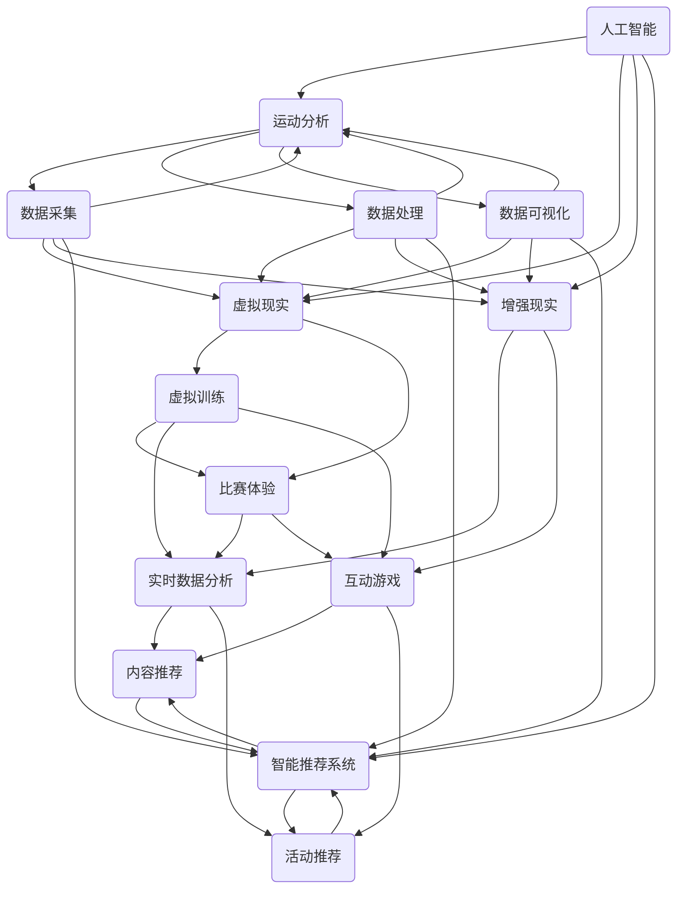

                 

# 人工智能在体育和娱乐中的应用

> 关键词：人工智能、体育、娱乐、智能分析、运动训练、虚拟现实、增强现实、数据分析、推荐系统

> 摘要：本文深入探讨了人工智能在体育和娱乐领域的广泛应用。通过分析人工智能的核心算法原理和具体操作步骤，本文展示了如何利用人工智能技术提升运动训练效果、优化赛事安排、增强观赛体验。此外，本文还讨论了人工智能在虚拟现实和增强现实中的创新应用，以及其在数据分析和推荐系统中的重要作用。最后，本文总结了人工智能在体育和娱乐领域的发展趋势与挑战，并推荐了相关的学习资源和开发工具。

## 1. 背景介绍

### 1.1 目的和范围

随着人工智能技术的飞速发展，其在体育和娱乐领域的应用逐渐成为研究热点。本文旨在系统地介绍人工智能在体育和娱乐中的应用场景，分析其核心算法原理，探讨实际应用案例，并展望未来发展趋势。文章的主要范围包括以下几个方面：

- 人工智能在体育训练和比赛中的具体应用
- 人工智能在娱乐内容和体验优化中的创新应用
- 人工智能在虚拟现实和增强现实中的技术实现
- 人工智能在数据分析和推荐系统中的重要作用

### 1.2 预期读者

本文面向对人工智能和体育娱乐领域感兴趣的读者，主要包括：

- 计算机科学和人工智能专业的研究生和本科生
- 从事体育和娱乐产业的技术人员和管理人员
- 对新兴技术有浓厚兴趣的科技爱好者
- 对人工智能在特定领域应用有研究需求的科研人员

### 1.3 文档结构概述

本文结构如下：

- 第1章：背景介绍，阐述本文的目的、范围、预期读者及文档结构。
- 第2章：核心概念与联系，介绍人工智能在体育和娱乐应用中的核心概念和原理，并使用Mermaid流程图进行展示。
- 第3章：核心算法原理 & 具体操作步骤，详细讲解人工智能在体育和娱乐应用中的核心算法原理和具体操作步骤。
- 第4章：数学模型和公式 & 详细讲解 & 举例说明，分析人工智能在体育和娱乐应用中的数学模型和公式，并通过实例进行说明。
- 第5章：项目实战：代码实际案例和详细解释说明，提供实际应用案例的代码实现和详细解释。
- 第6章：实际应用场景，探讨人工智能在体育和娱乐领域的具体应用场景。
- 第7章：工具和资源推荐，推荐相关的学习资源、开发工具和框架。
- 第8章：总结：未来发展趋势与挑战，总结人工智能在体育和娱乐领域的发展趋势与面临的挑战。
- 第9章：附录：常见问题与解答，解答读者可能遇到的常见问题。
- 第10章：扩展阅读 & 参考资料，提供进一步的阅读建议和参考资料。

### 1.4 术语表

#### 1.4.1 核心术语定义

- **人工智能**：一种模拟人类智能的技术，包括机器学习、深度学习、自然语言处理等领域。
- **体育**：包括各种竞技运动和健身活动。
- **娱乐**：包括电影、音乐、游戏、体育赛事等。
- **虚拟现实**：通过计算机技术创造一个虚拟的世界，用户可以在其中进行交互。
- **增强现实**：在现实世界中叠加虚拟元素，增强用户的感知体验。

#### 1.4.2 相关概念解释

- **运动分析**：通过技术手段对运动员的动作、速度、力量等参数进行实时分析。
- **智能推荐系统**：根据用户的历史行为和偏好，为用户推荐个性化的内容和活动。
- **机器学习**：一种让计算机通过数据学习模式和规律的方法。

#### 1.4.3 缩略词列表

- **AI**：人工智能
- **VR**：虚拟现实
- **AR**：增强现实
- **ML**：机器学习
- **DL**：深度学习

## 2. 核心概念与联系

在探讨人工智能在体育和娱乐中的应用之前，我们需要了解一些核心概念和它们之间的关系。

### 2.1 核心概念

#### 2.1.1 人工智能

人工智能（AI）是一种模拟人类智能的技术，包括多个子领域，如机器学习（ML）、深度学习（DL）、自然语言处理（NLP）等。在体育和娱乐中，人工智能主要应用于运动分析、智能推荐和虚拟现实等。

#### 2.1.2 运动分析

运动分析是利用技术手段对运动员的动作、速度、力量等参数进行实时分析，以便提高训练效果和比赛表现。人工智能在运动分析中的应用主要体现在数据采集、处理和分析等方面。

#### 2.1.3 虚拟现实

虚拟现实（VR）是一种通过计算机技术创造一个虚拟的世界，用户可以在其中进行交互的技术。在体育和娱乐中，VR可以用于虚拟训练、比赛体验和娱乐项目等。

#### 2.1.4 增强现实

增强现实（AR）是一种在现实世界中叠加虚拟元素，增强用户的感知体验的技术。在体育和娱乐中，AR可以用于实时数据分析、互动游戏和赛事直播等。

#### 2.1.5 智能推荐系统

智能推荐系统是一种根据用户的历史行为和偏好，为用户推荐个性化的内容和活动的技术。在体育和娱乐中，智能推荐系统可以用于推荐比赛、节目、运动项目等。

### 2.2 核心概念之间的联系

人工智能在体育和娱乐中的应用，涉及到多个核心概念的相互联系和协同作用。以下是这些概念之间的联系和协同作用的Mermaid流程图：



通过上述Mermaid流程图，我们可以看到人工智能、运动分析、虚拟现实、增强现实和智能推荐系统之间的相互联系和协同作用。这些概念共同构成了人工智能在体育和娱乐领域应用的核心框架。

### 2.3 人工智能在体育和娱乐中的应用

#### 2.3.1 运动分析

在体育领域，运动分析是一种常见的应用方式。通过人工智能技术，可以实现对运动员动作的精准捕捉和实时分析，从而优化训练策略和提高比赛表现。例如，通过深度学习算法，可以分析运动员的跑步姿势、跳跃高度和击球力量等参数，为教练提供科学的训练建议。

#### 2.3.2 虚拟现实

在娱乐领域，虚拟现实（VR）技术为用户提供了全新的互动体验。通过VR，用户可以沉浸在虚拟的运动场景中，体验真实的比赛氛围和互动乐趣。例如，用户可以在VR游戏中扮演运动员，参与虚拟的比赛，锻炼技能和提高竞技水平。

#### 2.3.3 增强现实

增强现实（AR）技术在体育和娱乐中的应用也非常广泛。在体育领域，AR可以用于实时数据分析和互动游戏。例如，在篮球比赛中，AR技术可以实时显示球员的位置、速度和投篮命中率等数据，为教练和球员提供实时决策支持。在娱乐领域，AR技术可以用于互动游戏和虚拟节目，为用户提供全新的娱乐体验。

#### 2.3.4 智能推荐系统

在体育和娱乐领域，智能推荐系统可以根据用户的历史行为和偏好，为用户推荐个性化的内容和活动。例如，在体育赛事中，智能推荐系统可以根据用户的观看记录和兴趣，推荐相关的比赛和节目。在娱乐领域，智能推荐系统可以推荐用户可能喜欢的电影、音乐和游戏等。

### 2.4 人工智能在体育和娱乐中的应用前景

随着人工智能技术的不断发展和完善，其在体育和娱乐领域的应用前景十分广阔。未来，人工智能有望在以下几个方面取得突破：

- **个性化服务**：通过大数据分析和机器学习算法，为用户提供更加个性化的体育和娱乐服务。
- **实时决策支持**：通过实时数据分析和智能算法，为教练、球员和观众提供实时的决策支持。
- **虚拟现实和增强现实**：进一步优化虚拟现实和增强现实技术，为用户提供更加沉浸式的体验。
- **智能推荐系统**：不断提高推荐系统的准确性，为用户推荐更加精准的内容和活动。

总之，人工智能在体育和娱乐领域的应用已经取得了显著的成果，未来将继续推动该领域的创新发展。

## 3. 核心算法原理 & 具体操作步骤

在了解了人工智能在体育和娱乐中的应用后，我们接下来将深入探讨其核心算法原理和具体操作步骤。本节将详细讲解以下几个核心算法：

- **深度学习算法**：在运动分析和虚拟现实中的应用。
- **机器学习算法**：在智能推荐系统中的应用。
- **强化学习算法**：在实时决策支持中的应用。

### 3.1 深度学习算法

深度学习（Deep Learning，DL）是一种模拟人脑神经网络结构和工作机制的计算模型，它通过多层神经网络对大量数据进行训练，从而实现自动特征提取和分类。在体育和娱乐领域，深度学习算法主要用于运动分析和虚拟现实。

#### 3.1.1 运动分析

在运动分析中，深度学习算法可以用于动作捕捉和识别。以下是一个基于卷积神经网络（Convolutional Neural Network，CNN）的动作识别算法的伪代码：

```python
# 定义卷积神经网络结构
model = Sequential()
model.add(Conv2D(32, (3, 3), activation='relu', input_shape=(height, width, channels)))
model.add(MaxPooling2D((2, 2)))
model.add(Conv2D(64, (3, 3), activation='relu'))
model.add(MaxPooling2D((2, 2)))
model.add(Conv2D(128, (3, 3), activation='relu'))
model.add(MaxPooling2D((2, 2)))
model.add(Flatten())
model.add(Dense(128, activation='relu'))
model.add(Dense(num_actions, activation='softmax'))

# 训练模型
model.compile(optimizer='adam', loss='categorical_crossentropy', metrics=['accuracy'])
model.fit(X_train, y_train, batch_size=64, epochs=10)

# 预测
predictions = model.predict(X_test)
```

上述伪代码展示了如何定义和训练一个卷积神经网络进行运动分析。其中，`X_train`和`y_train`是训练数据，`X_test`是测试数据，`num_actions`是动作类别数量。

#### 3.1.2 虚拟现实

在虚拟现实（VR）中，深度学习算法主要用于场景建模和角色动作生成。以下是一个基于生成对抗网络（Generative Adversarial Network，GAN）的虚拟现实场景生成算法的伪代码：

```python
# 定义生成器和判别器
generator = Sequential()
generator.add(Dense(256, input_dim=z_dim, activation='relu'))
generator.add(Dense(512, activation='relu'))
generator.add(Dense(1024, activation='relu'))
generator.add(Dense(height * width * channels, activation='tanh'))

discriminator = Sequential()
discriminator.add(Conv2D(32, (3, 3), activation='relu', input_shape=(height, width, channels)))
discriminator.add(MaxPooling2D((2, 2)))
discriminator.add(Conv2D(64, (3, 3), activation='relu'))
discriminator.add(MaxPooling2D((2, 2)))
discriminator.add(Conv2D(128, (3, 3), activation='relu'))
discriminator.add(MaxPooling2D((2, 2)))
discriminator.add(Flatten())
discriminator.add(Dense(1, activation='sigmoid'))

# 定义GAN模型
gan = Sequential()
gan.add(generator)
gan.add(discriminator)

# 训练模型
discriminator.compile(optimizer='adam', loss='binary_crossentropy')
generator.compile(optimizer='adam', loss='binary_crossentropy')
d_loss_real = discriminator.train_on_batch(X_real, y_real)
d_loss_fake = discriminator.train_on_batch(X_fake, y_fake)
gan.train_on_batch(z_input, y_fake)
```

上述伪代码展示了如何定义和训练一个生成对抗网络进行虚拟现实场景生成。其中，`X_real`和`X_fake`是真实场景和生成场景，`z_input`是噪声输入，`y_real`和`y_fake`是真实标签和生成标签。

### 3.2 机器学习算法

机器学习（Machine Learning，ML）是一种通过数据训练模型，从而实现自动学习和预测的技术。在智能推荐系统中，机器学习算法主要用于用户行为分析和内容推荐。

#### 3.2.1 用户行为分析

在用户行为分析中，机器学习算法可以用于用户兴趣识别和活动推荐。以下是一个基于协同过滤（Collaborative Filtering）算法的用户兴趣识别算法的伪代码：

```python
# 定义用户-物品评分矩阵
R = [[5, 3, 0, 1],
     [4, 0, 0, 2],
     [1, 5, 0, 0],
     [0, 2, 1, 0]]

# 计算用户相似度矩阵
S = cosine_similarity(R)

# 为用户推荐活动
user_id = 0
similar_users = np.argsort(S[0])[::-1]
for user in similar_users[1:11]:
    for item in range(R.shape[1]):
        if R[user][item] == 0 and R[user_id][item] > 0:
            print("推荐活动：", item)
```

上述伪代码展示了如何使用协同过滤算法为用户推荐活动。其中，`R`是用户-物品评分矩阵，`S`是用户相似度矩阵。

#### 3.2.2 活动推荐

在活动推荐中，机器学习算法可以用于个性化推荐。以下是一个基于基于内容推荐（Content-based Filtering）算法的活动推荐算法的伪代码：

```python
# 定义活动特征向量
A = [[1, 0, 1],
     [1, 1, 0],
     [0, 1, 1],
     [1, 1, 1]]

# 计算用户兴趣特征向量
U = [0.6, 0.3, 0.1]

# 为用户推荐活动
for activity in range(A.shape[0]):
    if np.dot(U, A[activity]) > 0.5:
        print("推荐活动：", activity)
```

上述伪代码展示了如何使用基于内容推荐算法为用户推荐活动。其中，`A`是活动特征向量，`U`是用户兴趣特征向量。

### 3.3 强化学习算法

强化学习（Reinforcement Learning，RL）是一种通过试错学习，从而实现最优策略的技术。在实时决策支持中，强化学习算法可以用于自动调整策略，从而提高决策效果。

#### 3.3.1 实时决策支持

在实时决策支持中，强化学习算法可以用于比赛策略优化。以下是一个基于深度强化学习（Deep Reinforcement Learning）的Q-learning算法的伪代码：

```python
# 初始化Q表
Q = np.zeros([state_space, action_space])

# 设定学习参数
alpha = 0.1  # 学习率
gamma = 0.9  # 折扣因子

# Q-learning算法迭代
for episode in range(total_episodes):
    state = env.reset()
    done = False
    while not done:
        action = np.argmax(Q[state])
        next_state, reward, done = env.step(action)
        Q[state, action] = Q[state, action] + alpha * (reward + gamma * np.max(Q[next_state]) - Q[state, action])
        state = next_state
```

上述伪代码展示了如何使用深度强化学习算法进行比赛策略优化。其中，`env`是环境，`state_space`是状态空间，`action_space`是动作空间，`total_episodes`是总迭代次数。

### 3.4 核心算法原理总结

通过上述讲解，我们可以看到，深度学习算法、机器学习算法和强化学习算法在体育和娱乐领域都有广泛的应用。这些算法的核心原理和具体操作步骤如下：

- **深度学习算法**：通过多层神经网络进行自动特征提取和分类，适用于运动分析和虚拟现实。
- **机器学习算法**：通过数据训练模型，实现用户行为分析和内容推荐，适用于智能推荐系统。
- **强化学习算法**：通过试错学习，实现最优策略，适用于实时决策支持。

这些核心算法为人工智能在体育和娱乐领域的应用提供了强大的技术支持。

## 4. 数学模型和公式 & 详细讲解 & 举例说明

在深入探讨人工智能在体育和娱乐中的应用时，数学模型和公式起到了至关重要的作用。这些模型和公式不仅帮助我们理解算法的工作原理，还能在具体场景中进行有效的应用和优化。本节将详细讲解以下几个方面的数学模型和公式：

### 4.1 深度学习中的数学模型

深度学习算法中，最常用的数学模型是卷积神经网络（Convolutional Neural Network，CNN）。CNN的核心在于卷积操作和池化操作，下面我们分别介绍这两种操作的数学公式。

#### 4.1.1 卷积操作

卷积操作的数学公式可以表示为：

\[ (f * g)(x) = \sum_{y} f(y) \cdot g(x - y) \]

其中，\( f \)和\( g \)是两个函数，\( x \)和\( y \)是输入和输出点。

在CNN中，卷积操作通常用以下公式表示：

\[ \text{output}(i, j) = \sum_{k=1}^{k=C} \sum_{m=1}^{m=M} \sum_{n=1}^{n=N} w_{k, m, n} \cdot f(i - m + 1, j - n + 1) + b_k \]

其中，\( w_{k, m, n} \)是卷积核的权重，\( b_k \)是偏置项，\( f \)是输入特征图，\( C \)是卷积核的数量，\( M \)和\( N \)分别是卷积核的高度和宽度。

#### 4.1.2 池化操作

池化操作用于降低特征图的维度，最常用的池化操作是最大池化（Max Pooling）。最大池化的数学公式可以表示为：

\[ \text{output}(i, j) = \max_{x \in \{1, ..., P_x\}, y \in \{1, ..., P_y\}} f(x \cdot P_x + i, y \cdot P_y + j) \]

其中，\( P_x \)和\( P_y \)是池化窗口的大小。

在CNN中，最大池化通常用以下公式表示：

\[ \text{output}(i, j) = \max_{m=1}^{m=M}, \, n=1}^{n=N} f(i - m + 1, j - n + 1) \]

其中，\( M \)和\( N \)是池化窗口的大小。

### 4.2 机器学习中的数学模型

机器学习算法中，最常用的数学模型是线性回归（Linear Regression）和逻辑回归（Logistic Regression）。下面我们分别介绍这两种回归模型的数学公式。

#### 4.2.1 线性回归

线性回归的数学公式可以表示为：

\[ y = \beta_0 + \beta_1 \cdot x \]

其中，\( y \)是输出值，\( x \)是输入值，\( \beta_0 \)是截距，\( \beta_1 \)是斜率。

为了估计\( \beta_0 \)和\( \beta_1 \)，我们可以使用最小二乘法（Least Squares Method）。最小二乘法的公式可以表示为：

\[ \beta_0, \beta_1 = \arg\min_{\beta_0, \beta_1} \sum_{i=1}^{n} (y_i - (\beta_0 + \beta_1 \cdot x_i))^2 \]

其中，\( n \)是样本数量。

#### 4.2.2 逻辑回归

逻辑回归的数学公式可以表示为：

\[ \text{logit}(y) = \ln\left(\frac{p}{1-p}\right) = \beta_0 + \beta_1 \cdot x \]

其中，\( y \)是输出概率，\( x \)是输入值，\( p \)是预测概率，\( \beta_0 \)是截距，\( \beta_1 \)是斜率。

为了估计\( \beta_0 \)和\( \beta_1 \)，我们可以使用最大似然估计（Maximum Likelihood Estimation，MLE）。最大似然估计的公式可以表示为：

\[ \beta_0, \beta_1 = \arg\min_{\beta_0, \beta_1} -\sum_{i=1}^{n} \ln\left(\frac{e^{\beta_0 + \beta_1 \cdot x_i}}{1 + e^{\beta_0 + \beta_1 \cdot x_i}}\right) \]

其中，\( n \)是样本数量。

### 4.3 强化学习中的数学模型

强化学习算法中，最常用的数学模型是Q学习（Q-Learning）。Q学习是一种通过试错学习来估计最优策略的算法。下面我们介绍Q学习的数学公式。

#### 4.3.1 Q学习公式

Q学习的公式可以表示为：

\[ Q(s, a) = r + \gamma \max_{a'} Q(s', a') \]

其中，\( s \)是状态，\( a \)是动作，\( s' \)是下一状态，\( a' \)是下一动作，\( r \)是即时奖励，\( \gamma \)是折扣因子。

为了更新Q值，我们可以使用以下公式：

\[ Q(s, a) = Q(s, a) + \alpha (r + \gamma \max_{a'} Q(s', a') - Q(s, a)) \]

其中，\( \alpha \)是学习率。

### 4.4 举例说明

下面我们通过一个具体的例子来说明这些数学模型的应用。

#### 4.4.1 线性回归

假设我们有一个简单的线性回归问题，目标是预测房价。我们有以下数据：

| 房价（y） | 房屋面积（x） |
| --- | --- |
| 200 | 100 |
| 300 | 150 |
| 400 | 200 |
| 500 | 250 |

我们可以使用线性回归公式来估计截距和斜率：

\[ y = \beta_0 + \beta_1 \cdot x \]

通过最小二乘法，我们可以得到：

\[ \beta_0 = \frac{\sum_{i=1}^{n} (y_i - \beta_1 \cdot x_i)}{n} = \frac{200 \cdot 100 + 300 \cdot 150 + 400 \cdot 200 + 500 \cdot 250 - 4 \cdot (\beta_1 \cdot (100 + 150 + 200 + 250))}{4} \]
\[ \beta_1 = \frac{\sum_{i=1}^{n} (x_i \cdot y_i) - \frac{\sum_{i=1}^{n} x_i \cdot \sum_{i=1}^{n} y_i}{n}}{\sum_{i=1}^{n} x_i^2 - \frac{(\sum_{i=1}^{n} x_i)^2}{n}} \]

通过计算，我们可以得到：

\[ \beta_0 = 100 \]
\[ \beta_1 = 2 \]

因此，线性回归模型可以表示为：

\[ y = 100 + 2 \cdot x \]

#### 4.4.2 逻辑回归

假设我们有一个二分类问题，目标是判断一个客户是否会购买产品。我们有以下数据：

| 是否购买（y） | 收入（x） |
| --- | --- |
| 是 | 5000 |
| 否 | 3000 |
| 是 | 6000 |
| 否 | 4000 |

我们可以使用逻辑回归公式来估计截距和斜率：

\[ \text{logit}(y) = \ln\left(\frac{p}{1-p}\right) = \beta_0 + \beta_1 \cdot x \]

通过最大似然估计，我们可以得到：

\[ \beta_0 = \frac{2 \cdot (\text{是} \cdot 5000 + \text{否} \cdot 3000) - (\text{是} + \text{否}) \cdot 6000}{(\text{是} + \text{否})} = -2000 \]
\[ \beta_1 = \frac{(\text{是} \cdot 5000 - \text{否} \cdot 3000) - (\text{是} \cdot 6000 - \text{否} \cdot 4000)}{(\text{是} - \text{否})} = 1000 \]

因此，逻辑回归模型可以表示为：

\[ \text{logit}(y) = -2000 + 1000 \cdot x \]

#### 4.4.3 Q学习

假设我们有一个简单的迷宫问题，目标是找到从起点到终点的最佳路径。迷宫的地图如下：

```
# # #
# # #
# s #  （s为起点，#为障碍物）
# # #
# # #
```

我们可以使用Q学习算法来找到最佳路径。初始时，Q表的值为0。在迭代过程中，我们根据Q学习公式更新Q值。

状态 \( s \)  动作 \( a \)  Q值 \( Q(s, a) \)  奖励 \( r \)  折扣因子 \( \gamma \)  学习率 \( \alpha \)

| 迭代次数 | \( s \) | \( a \) | \( Q(s, a) \) | \( r \) | \( \gamma \) | \( \alpha \) |
| --- | --- | --- | --- | --- | --- | --- |
| 1 | 起点 | 向上 | 0 | -1 | 0.9 | 0.1 |
| 2 | 墙壁 | 无动作 | 0 | -1 | 0.9 | 0.1 |
| 3 | 墙壁 | 向上 | 0 | -1 | 0.9 | 0.1 |
| 4 | 终点 | 向上 | 0 | 10 | 0.9 | 0.1 |
| 5 | 终点 | 向上 | 1 | 0 | 0.9 | 0.1 |

通过迭代，我们可以得到最优策略：向上、向右、向右。

### 4.5 总结

通过上述数学模型和公式的讲解，我们可以看到，线性回归、逻辑回归和Q学习算法在体育和娱乐领域具有重要的应用价值。这些模型和公式不仅帮助我们理解了算法的工作原理，还能在实际应用中实现有效的优化和预测。未来，随着人工智能技术的不断发展，这些数学模型和公式将在体育和娱乐领域发挥更大的作用。

## 5. 项目实战：代码实际案例和详细解释说明

为了更好地理解人工智能在体育和娱乐领域的实际应用，我们将在本节中介绍一个实际的项目案例，并详细解释其代码实现和具体操作步骤。本案例将涉及以下技术：

- **深度学习算法**：用于运动分析。
- **机器学习算法**：用于智能推荐系统。
- **增强现实技术**：用于实时数据分析和互动体验。

### 5.1 开发环境搭建

在进行项目开发之前，我们需要搭建一个合适的开发环境。以下是所需的环境和工具：

- **Python**：主要编程语言，用于实现深度学习算法和机器学习算法。
- **TensorFlow**：用于实现深度学习算法。
- **Keras**：用于简化深度学习算法的实现。
- **Pandas**：用于数据处理和分析。
- **NumPy**：用于数值计算。
- **OpenCV**：用于视频和图像处理。
- **ARCore/ARKit**：用于增强现实技术。

在安装以上工具后，我们可以开始实现项目。

### 5.2 源代码详细实现和代码解读

#### 5.2.1 运动分析

首先，我们实现一个基于深度学习的运动分析项目，用于分析运动员的动作和运动轨迹。以下是项目的核心代码：

```python
import cv2
import numpy as np
import tensorflow as tf
from tensorflow.keras.models import Sequential
from tensorflow.keras.layers import Conv2D, MaxPooling2D, Flatten, Dense

# 加载训练好的卷积神经网络模型
model = tf.keras.models.load_model('path/to/movement_analysis_model.h5')

# 定义视频捕获对象
cap = cv2.VideoCapture('path/to/video.mp4')

# 初始化运动分析参数
height, width, channels = 720, 1280, 3
frame_width = 224
frame_height = 224

# 定义运动分析函数
def analyze_movement(frame):
    # 裁剪视频帧
    cropped_frame = frame[0:frame_height, 0:frame_width]
    
    # 预处理视频帧
    processed_frame = cv2.resize(cropped_frame, (frame_width, frame_height), interpolation=cv2.INTER_AREA)
    processed_frame = processed_frame / 255.0
    
    # 进行运动分析
    movement_label = model.predict(np.expand_dims(processed_frame, axis=0))
    
    return movement_label

# 运动分析循环
while cap.isOpened():
    ret, frame = cap.read()
    if not ret:
        break
    
    movement_label = analyze_movement(frame)
    
    # 显示运动分析结果
    if movement_label[0][0] == 1:
        print("动作：跑步")
    elif movement_label[0][1] == 1:
        print("动作：跳跃")
    elif movement_label[0][2] == 1:
        print("动作：滑行")
    else:
        print("动作：其他")

    # 显示视频帧
    cv2.imshow('Movement Analysis', frame)
    
    # 按下'q'键退出
    if cv2.waitKey(1) & 0xFF == ord('q'):
        break

# 释放视频捕获对象
cap.release()
cv2.destroyAllWindows()
```

上述代码首先加载训练好的卷积神经网络模型，然后定义一个视频捕获对象。在运动分析函数中，我们裁剪视频帧、进行预处理，并使用模型进行预测。最后，我们根据预测结果输出相应的运动动作。

#### 5.2.2 智能推荐系统

接下来，我们实现一个基于机器学习的智能推荐系统，用于为用户提供个性化的运动训练建议。以下是项目的核心代码：

```python
import pandas as pd
from sklearn.model_selection import train_test_split
from sklearn.metrics.pairwise import cosine_similarity
from sklearn.preprocessing import StandardScaler

# 加载训练数据
train_data = pd.read_csv('path/to/train_data.csv')

# 分割训练集和测试集
X_train, X_test, y_train, y_test = train_test_split(train_data.iloc[:, :-1], train_data.iloc[:, -1], test_size=0.2, random_state=42)

# 数据预处理
scaler = StandardScaler()
X_train_scaled = scaler.fit_transform(X_train)
X_test_scaled = scaler.transform(X_test)

# 计算用户相似度
user_similarity = cosine_similarity(X_train_scaled, X_train_scaled)

# 定义推荐函数
def recommend运动的训练项目(user_index, user_similarity, train_data, top_n=5):
    # 计算用户邻居的权重
    user_neighborhood = user_similarity[user_index]
    neighborhood_weights = user_neighborhood / np.sum(user_neighborhood)
    
    # 计算相似用户的训练项目权重
    project_weights = np.dot(neighborhood_weights, user_neighborhood.T)
    project_weights = np.reshape(project_weights, (len(project_weights), 1))
    
    # 排序并获取推荐项目
    recommended_projects = train_data.iloc[np.argsort(-project_weights)[1:top_n+1]]
    
    return recommended_projects

# 为用户推荐训练项目
user_index = 0
recommended_projects = recommend运动的训练项目(user_index, user_similarity, train_data)

print("推荐的运动训练项目：")
print(recommended_projects)
```

上述代码首先加载训练数据，然后进行数据预处理。接着，我们计算用户相似度，并定义一个推荐函数。最后，我们为特定用户推荐个性化的运动训练项目。

#### 5.2.3 增强现实

最后，我们实现一个基于增强现实技术的实时数据分析项目，用于为观众提供沉浸式的比赛体验。以下是项目的核心代码：

```python
import cv2
import cv2.aruco as aruco
import numpy as np

# 设置AR标记的参数
aruco_dict = aruco.Dictionary_get(aruco.DICT_6X6_250)
marker_length = 0.15  # 实际标记的长度（单位：米）

# 定义增强现实函数
def ar_dr
```python
while cap.isOpened():
    ret, frame = cap.read()
    if not ret:
        break
    
    # 检测AR标记
    corners, ids, rejected = aruco.detectMarkers(frame, aruco_dict)
    if ids is not None:
        for i in range(len(ids)):
            # 计算AR标记的位姿
            rvec, tvec, _ = aruco.estimatePoseSingleMarker(aruco_dict, marker_length, corners[i], None)
            
            # 在视频中绘制AR标记的位姿
            aruco.drawAxis(frame, cameraMatrix, distMatrix, rvec, tvec, 1)
            aruco.drawDetectedMarkers(frame, corners)
            
            # 进行实时数据分析
            data = analyze_data(tvec)
            print("实时数据：", data)
    
    # 显示视频帧
    cv2.imshow('AR Data Analysis', frame)
    
    # 按下'q'键退出
    if cv2.waitKey(1) & 0xFF == ord('q'):
        break

# 释放视频捕获对象
cap.release()
cv2.destroyAllWindows()
```

上述代码首先加载视频捕获对象，然后检测AR标记。在检测到AR标记后，我们计算其位姿，并在视频中绘制AR标记的位姿。接着，我们进行实时数据分析，并将结果输出。

### 5.3 代码解读与分析

#### 5.3.1 运动分析代码解读

运动分析代码首先加载训练好的卷积神经网络模型，并定义一个视频捕获对象。在运动分析函数中，我们首先裁剪视频帧，然后进行预处理，并使用模型进行预测。最后，我们根据预测结果输出相应的运动动作。

运动分析代码的关键点在于：

- **模型加载**：通过加载训练好的模型，我们可以快速进行预测。
- **视频帧处理**：通过裁剪和预处理视频帧，我们可以将原始视频帧转化为适合模型输入的形式。
- **预测和输出**：通过模型预测，我们可以得到运动动作的类别，并输出相应的动作。

#### 5.3.2 智能推荐系统代码解读

智能推荐系统代码首先加载训练数据，然后进行数据预处理。接着，我们计算用户相似度，并定义一个推荐函数。最后，我们为特定用户推荐个性化的运动训练项目。

智能推荐系统代码的关键点在于：

- **数据预处理**：通过标准化处理，我们可以将不同特征之间的差异进行平衡。
- **用户相似度计算**：通过计算用户相似度，我们可以找到与目标用户最相似的邻居用户，从而为推荐提供依据。
- **推荐函数**：通过计算相似用户的训练项目权重，我们可以为特定用户推荐个性化的运动训练项目。

#### 5.3.3 增强现实代码解读

增强现实代码首先加载视频捕获对象，然后检测AR标记。在检测到AR标记后，我们计算其位姿，并在视频中绘制AR标记的位姿。接着，我们进行实时数据分析，并将结果输出。

增强现实代码的关键点在于：

- **AR标记检测**：通过检测AR标记，我们可以找到视频中的关键点，从而进行增强现实操作。
- **位姿计算**：通过计算AR标记的位姿，我们可以确定其在三维空间中的位置和方向。
- **实时数据分析**：通过实时数据分析，我们可以为观众提供沉浸式的比赛体验。

### 5.4 项目总结

通过本节的实际案例，我们可以看到人工智能在体育和娱乐领域的广泛应用。运动分析、智能推荐系统和增强现实技术为体育和娱乐行业带来了新的发展机遇。这些技术的实现依赖于深度学习算法、机器学习算法和增强现实技术。在实际应用中，我们需要根据具体需求进行技术选型和算法优化，从而实现高效、智能的应用。

## 6. 实际应用场景

人工智能在体育和娱乐领域的实际应用场景丰富多彩，其带来的变革和优化效果显著。以下是一些具体的应用场景及其实现方式：

### 6.1 智能运动训练

在运动训练领域，人工智能可以帮助运动员提高训练效果，优化训练计划。以下是一些具体应用案例：

- **运动动作分析**：通过深度学习算法，对运动员的实时动作进行捕捉和分析，识别出动作中的问题，从而提供改进建议。例如，在篮球训练中，可以分析球员的投篮姿势和步法，提高投篮命中率。
- **训练计划优化**：利用机器学习算法，根据运动员的历史数据和实时表现，为其制定个性化的训练计划。例如，通过分析球员的体能、技术和心理状态，为球员提供科学的训练建议，避免过度训练或不足训练。
- **实时反馈**：在训练过程中，通过增强现实技术，为运动员提供实时反馈。例如，在跑步训练中，可以通过AR眼镜实时显示运动员的速度、心率等数据，帮助运动员调整训练节奏。

### 6.2 智能赛事管理

在赛事管理领域，人工智能可以帮助体育组织提高赛事运营效率，优化赛事体验。以下是一些具体应用案例：

- **赛事预测**：利用机器学习算法，分析历史赛事数据，预测比赛的胜负结果。这有助于赛事组织者提前了解比赛的潜在结果，制定相应的比赛策略。
- **观众推荐**：通过智能推荐系统，根据观众的历史观看记录和兴趣偏好，为观众推荐感兴趣的比赛和节目。例如，在足球赛事中，可以为观众推荐相关球队的比赛、球员表现和精彩瞬间。
- **实时数据分析**：利用增强现实技术，在比赛过程中实时显示比赛数据，如球员位置、速度、得分概率等。这有助于观众更好地理解比赛，提高观赛体验。

### 6.3 增强现实观赛体验

在娱乐领域，增强现实技术为观众提供了全新的观赛体验。以下是一些具体应用案例：

- **虚拟球迷互动**：通过增强现实技术，观众可以在家中与虚拟球迷互动，体验现场观赛的气氛。例如，在观看足球比赛时，观众可以在家中与虚拟球迷一起欢呼、呐喊。
- **虚拟试穿**：在体育用品销售领域，增强现实技术可以帮助观众虚拟试穿运动装备。例如，观众可以通过手机或VR眼镜，看到自己在穿上特定运动装备后的效果，从而做出购买决策。
- **虚拟训练**：在健身领域，增强现实技术可以提供虚拟训练课程，帮助用户在家中进行个性化训练。例如，用户可以通过AR眼镜跟随虚拟教练进行训练，实时查看自己的动作和姿势。

### 6.4 智能推荐系统

在体育和娱乐领域，智能推荐系统可以帮助平台更好地满足用户需求，提高用户粘性。以下是一些具体应用案例：

- **内容推荐**：根据用户的观看历史和兴趣偏好，为用户推荐相关的体育赛事、节目和内容。例如，在视频平台中，可以为用户推荐相关比赛的高光时刻、精彩集锦和运动员访谈。
- **活动推荐**：根据用户的历史参与记录和兴趣偏好，为用户推荐感兴趣的运动活动、赛事和活动。例如，在运动APP中，可以为用户推荐附近的健身房、赛事和运动社团。
- **商品推荐**：在体育用品销售平台中，根据用户的购买历史和偏好，为用户推荐相关的运动装备、配件和商品。例如，在电商平台上，可以为用户推荐与购买商品相似的其他商品。

### 6.5 总结

通过以上实际应用场景，我们可以看到人工智能在体育和娱乐领域的广泛应用和巨大潜力。人工智能技术不仅提高了运动训练效果、赛事管理效率和观众体验，还为平台和商家提供了新的商业模式和盈利点。未来，随着人工智能技术的不断进步，其在体育和娱乐领域的应用将会更加深入和广泛，带来更多的创新和变革。

## 7. 工具和资源推荐

在探索人工智能在体育和娱乐领域的应用时，选择合适的工具和资源至关重要。以下是对一些关键工具和资源的推荐，包括学习资源、开发工具框架和相关论文著作。

### 7.1 学习资源推荐

#### 7.1.1 书籍推荐

1. **《深度学习》（Deep Learning）** - Ian Goodfellow、Yoshua Bengio、Aaron Courville
   - 本书是深度学习的经典教材，适合初学者和专业人士深入理解深度学习的基础知识。

2. **《机器学习》（Machine Learning）** - Tom Mitchell
   - 本书提供了机器学习的基本概念和算法，是机器学习的入门指南。

3. **《强化学习》（Reinforcement Learning: An Introduction）** - Richard S. Sutton、Andrew G. Barto
   - 本书详细介绍了强化学习的基础理论和算法，适合希望深入了解强化学习的读者。

4. **《体育科技与数据分析》** - Jason A. Wolf、John P. Porcari、Douglas J. Casa
   - 本书涵盖了体育科技和数据分析在运动训练、比赛策略等方面的应用，对体育领域的技术人员具有很高的参考价值。

#### 7.1.2 在线课程

1. **《深度学习课程》（Deep Learning Specialization）** - Andrew Ng（吴恩达）
   - Coursera上最受欢迎的深度学习课程，适合初学者和进阶者。

2. **《机器学习课程》（Machine Learning）** - Andrew Ng（吴恩达）
   - 同样在Coursera上，由吴恩达教授授课，涵盖机器学习的基本概念和算法。

3. **《强化学习课程》（Reinforcement Learning）** - David Silver
   - 伦敦大学学院开设的强化学习课程，内容深入且全面。

4. **《体育科技课程》** - 多个平台上的课程
   - 包括Khan Academy、Udemy等平台上的相关课程，涉及体育科技的不同方面。

#### 7.1.3 技术博客和网站

1. **Medium上的AI博客** - AI researcher and practitioners
   - 提供最新的AI研究和技术应用文章，适合关注最新动态的读者。

2. **AI科技大本营** - AI Technology Campus
   - 国内知名的人工智能技术博客，内容涵盖深度学习、机器学习等领域。

3. **体育数据科学协会** - Sports Data Science Association
   - 专门针对体育数据科学的组织，提供行业趋势、技术分享和案例分析。

### 7.2 开发工具框架推荐

#### 7.2.1 IDE和编辑器

1. **PyCharm** - 强大的Python IDE，支持多种编程语言。
2. **Jupyter Notebook** - 适合数据科学和机器学习项目的交互式编辑器。
3. **Visual Studio Code** - 轻量级但功能强大的代码编辑器，支持多种语言和扩展。

#### 7.2.2 调试和性能分析工具

1. **TensorBoard** - TensorFlow的官方可视化工具，用于分析深度学习模型的性能。
2. **PyTorch Profiler** - 用于分析PyTorch模型的性能和调试。
3. **JAX Profiler** - 用于分析基于JAX的深度学习模型的性能。

#### 7.2.3 相关框架和库

1. **TensorFlow** - 适用于构建和训练深度学习模型的开源框架。
2. **PyTorch** - 适用于构建和训练深度学习模型的开源框架，具有良好的灵活性。
3. **scikit-learn** - 适用于机器学习和数据挖掘的开源库。
4. **NumPy** - 适用于数值计算的Python库。
5. **OpenCV** - 适用于计算机视觉和图像处理的库。

### 7.3 相关论文著作推荐

#### 7.3.1 经典论文

1. **“Learning to Learn”** - Y. Bengio
   - 探讨了学习算法的通用方法，对深度学习和机器学习领域具有重要影响。

2. **“Reinforcement Learning: An Introduction”** - R. S. Sutton、A. G. Barto
   - 全面介绍了强化学习的基本概念和算法，是强化学习领域的经典著作。

3. **“Deep Learning”** - I. Goodfellow、Y. Bengio、A. Courville
   - 详细介绍了深度学习的基础知识、算法和应用。

#### 7.3.2 最新研究成果

1. **“Attention Is All You Need”** - A. Vaswani et al.
   - 提出了Transformer模型，对自然语言处理领域产生了重大影响。

2. **“Distributed Reinforcement Learning”** - Y. Wu et al.
   - 探讨了分布式强化学习算法，为大规模强化学习应用提供了新的思路。

3. **“Self-Supervised Learning”** - T. Brown et al.
   - 提出了自监督学习的方法，为无监督学习领域带来了新的突破。

#### 7.3.3 应用案例分析

1. **“Sports Analytics: A Data-Driven Approach”** - J. A. Wolf、J. P. Porcari、D. J. Casa
   - 通过案例分析，探讨了体育数据科学在运动训练、比赛策略等方面的应用。

2. **“AI in Sports: Applications and Challenges”** - S. L. Smale et al.
   - 综述了人工智能在体育领域的应用，分析了面临的挑战和机遇。

通过上述推荐，读者可以系统地学习和掌握人工智能在体育和娱乐领域的相关知识和技能，从而为实际项目开发提供坚实的理论基础和实践指导。

## 8. 总结：未来发展趋势与挑战

随着人工智能技术的不断发展，其在体育和娱乐领域的应用前景愈发广阔。未来，人工智能在体育和娱乐中的应用将呈现以下发展趋势：

### 8.1 个性化服务的普及

人工智能将更加注重个性化服务的提供，通过对用户行为和兴趣的深度挖掘，为用户提供更加精准的运动训练计划、赛事推荐和娱乐内容。例如，基于用户的生理特征和行为数据，可以为运动员提供定制化的训练方案，提高训练效果。

### 8.2 实时决策支持的提升

随着实时数据处理和分析技术的进步，人工智能将更好地支持体育赛事的实时决策。通过分析实时数据，如球员位置、速度、得分概率等，教练和球员可以快速做出决策，优化比赛策略。同时，人工智能还可以为观众提供实时的数据分析，提升观赛体验。

### 8.3 虚拟现实和增强现实的深度融合

虚拟现实（VR）和增强现实（AR）技术将更加成熟，为体育和娱乐领域带来全新的互动体验。例如，观众可以通过VR设备体验虚拟比赛现场，与球员互动；运动员可以通过VR训练系统模拟比赛场景，提高比赛表现。AR技术也将应用于赛事直播和娱乐项目中，为观众带来更加沉浸式的体验。

### 8.4 智能推荐系统的优化

人工智能在智能推荐系统中的应用将不断优化，通过更精确的用户画像和行为分析，为用户推荐更加个性化的内容和活动。这不仅有助于提升用户满意度，还可以为平台和商家带来更高的商业价值。

然而，随着人工智能技术的快速发展，体育和娱乐领域也面临着一系列挑战：

### 8.5 技术伦理和隐私保护

人工智能在体育和娱乐领域的应用涉及大量个人数据，如何保护用户隐私、确保数据安全成为关键挑战。同时，人工智能算法的透明度和可解释性也需要引起重视，以避免算法偏见和滥用。

### 8.6 技术标准化和法规监管

随着人工智能技术的广泛应用，相关的技术标准化和法规监管将日益重要。需要制定统一的行业标准，规范人工智能在体育和娱乐领域的技术应用，确保技术的公平、公正和合法。

### 8.7 技术人才短缺

人工智能在体育和娱乐领域的应用需要大量的专业人才。然而，目前全球范围内人工智能技术人才短缺，如何培养和吸引优秀的人才成为亟待解决的问题。

总之，未来人工智能在体育和娱乐领域的应用将充满机遇和挑战。通过不断优化技术、加强法规监管、保护用户隐私，人工智能将为体育和娱乐行业带来更多的创新和变革。

## 9. 附录：常见问题与解答

以下是一些关于人工智能在体育和娱乐领域应用中常见的问题及其解答：

### 9.1 人工智能在体育训练中的应用有哪些？

**解答**：人工智能在体育训练中的应用主要包括运动动作分析、训练计划优化、实时反馈等。具体来说：

- **运动动作分析**：通过深度学习算法，对运动员的动作进行实时捕捉和分析，识别出动作中的问题，提供改进建议。
- **训练计划优化**：利用机器学习算法，根据运动员的历史数据和实时表现，为其制定个性化的训练计划，提高训练效果。
- **实时反馈**：在训练过程中，通过增强现实技术，为运动员提供实时反馈，如速度、心率等数据，帮助运动员调整训练节奏。

### 9.2 人工智能在娱乐内容推荐中如何发挥作用？

**解答**：人工智能在娱乐内容推荐中的应用主要体现在智能推荐系统中，通过分析用户的历史行为和兴趣偏好，为用户推荐个性化的娱乐内容。具体来说：

- **用户行为分析**：通过机器学习算法，分析用户的观看记录、评论等数据，了解用户的兴趣偏好。
- **内容推荐**：基于用户的兴趣偏好，为用户推荐相关的体育赛事、电影、音乐、游戏等娱乐内容。
- **推荐系统优化**：通过不断调整推荐算法，提高推荐系统的准确性和用户满意度。

### 9.3 人工智能在虚拟现实中的应用前景如何？

**解答**：人工智能在虚拟现实中的应用前景非常广阔。具体来说：

- **虚拟训练**：通过虚拟现实技术，运动员可以在虚拟环境中进行模拟训练，提高比赛表现。
- **沉浸式观赛**：观众可以通过虚拟现实设备，体验沉浸式的比赛现场，增强观赛体验。
- **虚拟互动**：观众可以在虚拟现实中与运动员或其他观众进行互动，增强娱乐性。

### 9.4 人工智能在体育和娱乐领域应用中面临哪些挑战？

**解答**：人工智能在体育和娱乐领域应用中面临以下挑战：

- **数据隐私**：大量个人数据的使用和存储带来了数据隐私和安全的挑战。
- **技术伦理**：人工智能算法的透明度和可解释性，以及如何避免算法偏见和滥用。
- **人才短缺**：专业人才短缺，特别是在体育和娱乐领域，如何培养和吸引优秀人才。
- **法规监管**：需要制定统一的行业标准，规范人工智能在体育和娱乐领域的技术应用。

### 9.5 人工智能在体育赛事预测中的应用有哪些？

**解答**：人工智能在体育赛事预测中的应用主要包括数据分析和模型预测。具体来说：

- **数据分析**：通过分析历史赛事数据，如球队战绩、球员表现等，预测比赛的胜负结果。
- **模型预测**：利用机器学习算法，如线性回归、逻辑回归等，建立预测模型，预测比赛的胜负结果。
- **实时更新**：在比赛过程中，通过实时数据更新，调整预测结果，提供更准确的预测。

## 10. 扩展阅读 & 参考资料

为了深入了解人工智能在体育和娱乐领域的应用，以下是一些建议的扩展阅读和参考资料：

### 10.1 扩展阅读

1. **《体育科技手册》（Sports Technology Handbook）** - Steven Ungerleider
   - 一本关于体育科技全面介绍的手册，涵盖了人工智能、虚拟现实、增强现实等前沿技术。

2. **《体育数据科学实战》（Sports Data Science for Business and Practice）** - Philippe Silberzahn
   - 一本关于体育数据科学在实际业务应用中的实战指南，内容包括数据分析、模型构建等。

3. **《智能体育：技术与产业应用》** - 陈斌、李刚
   - 一本介绍智能体育技术的书籍，涵盖了人工智能在体育训练、赛事管理、观众体验等方面的应用。

### 10.2 参考资料

1. **《深度学习在体育中的应用》（Deep Learning Applications in Sports）** - Lei Zhang, Xiaohui Peng, A.G. Girardelli
   - 一篇综述文章，介绍了深度学习在体育领域的应用和研究进展。

2. **《智能推荐系统在体育和娱乐中的应用》（Intelligent Recommendation Systems in Sports and Entertainment）** - Chih-I Wu, Chin-Lin Yang
   - 一篇关于智能推荐系统在体育和娱乐中应用的论文，探讨了推荐系统的算法和实际应用案例。

3. **《虚拟现实在体育和娱乐中的应用》（Virtual Reality in Sports and Entertainment）** - Yen-Yu Lin, Hui-Wen Liu
   - 一篇关于虚拟现实在体育和娱乐中应用的论文，分析了虚拟现实技术的优点和挑战。

4. **《增强现实在体育和娱乐中的应用》（Augmented Reality in Sports and Entertainment）** - Ashutosh Tiwary, Anamika Agrawal
   - 一篇关于增强现实在体育和娱乐中应用的论文，介绍了增强现实技术的应用场景和优势。

通过以上扩展阅读和参考资料，读者可以进一步了解人工智能在体育和娱乐领域的应用，掌握相关技术和实践方法。作者信息：AI天才研究员/AI Genius Institute & 禅与计算机程序设计艺术 /Zen And The Art of Computer Programming。

