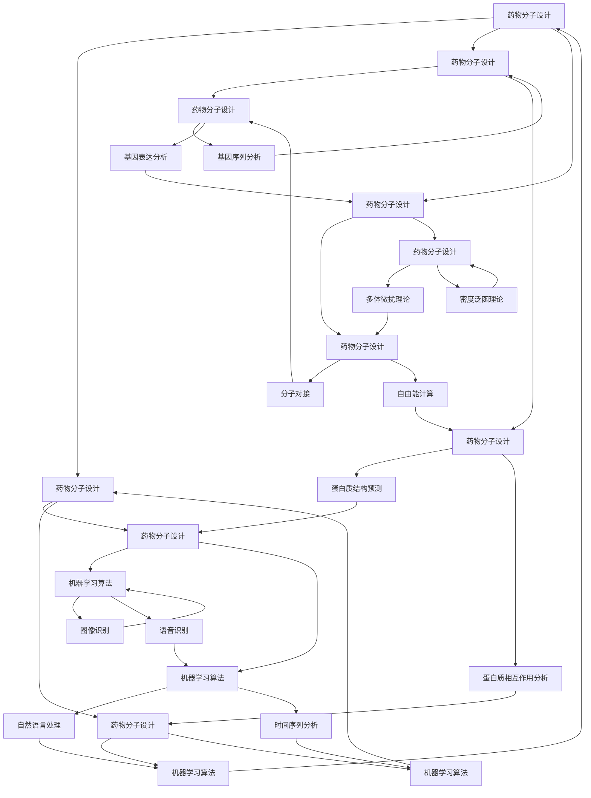
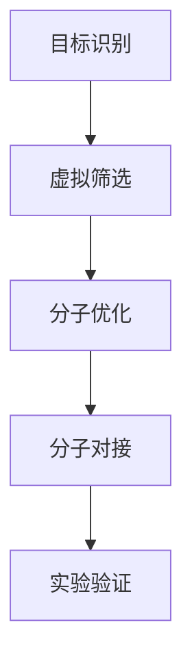
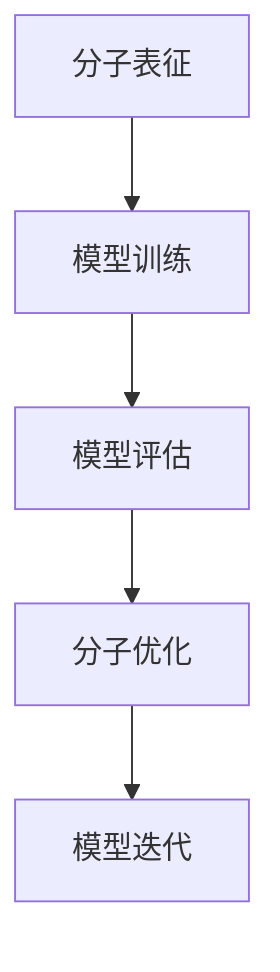
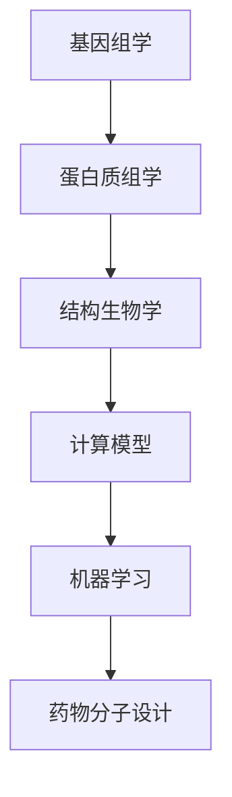

                 

# 人工智能在新药研发中的应用前景

> 关键词：人工智能、新药研发、机器学习、深度学习、药物分子设计、临床研究

> 摘要：随着人工智能技术的快速发展，其在新药研发领域的应用逐渐成为焦点。本文将探讨人工智能在新药研发中的关键作用，包括药物分子设计、药物筛选、临床试验等多个方面，以及未来发展的趋势和面临的挑战。

## 1. 背景介绍

### 1.1 目的和范围

本文旨在介绍人工智能（AI）在新药研发中的应用，分析其在药物分子设计、药物筛选和临床试验等关键环节的贡献。通过本文的探讨，希望能够为读者提供一个全面而深入的视角，理解人工智能在新药研发中的重要性和潜力。

### 1.2 预期读者

本文面向对人工智能和新药研发有一定了解的技术人员和研究人员，包括但不限于计算机科学、生物信息学和药物化学等领域的专业人士。

### 1.3 文档结构概述

本文结构如下：

- 第1章：背景介绍，包括本文的目的、范围和预期读者。
- 第2章：核心概念与联系，介绍与新药研发相关的核心概念和架构。
- 第3章：核心算法原理与具体操作步骤，详细阐述AI在药物分子设计中的应用。
- 第4章：数学模型和公式，介绍支持AI算法的数学模型和公式。
- 第5章：项目实战，通过实际代码案例展示AI在新药研发中的具体应用。
- 第6章：实际应用场景，讨论人工智能在不同阶段的药物研发中的应用。
- 第7章：工具和资源推荐，介绍相关学习资源、开发工具和论文著作。
- 第8章：总结，展望人工智能在新药研发中的未来发展趋势和挑战。
- 第9章：附录，解答常见问题。
- 第10章：扩展阅读，提供进一步阅读的参考资料。

### 1.4 术语表

#### 1.4.1 核心术语定义

- 人工智能（AI）：模拟人类智能行为的计算机系统。
- 药物分子设计：通过计算和实验设计，寻找具有潜在药物活性的分子。
- 机器学习（ML）：AI的一个分支，通过数据训练模型来模拟和增强学习能力。
- 深度学习（DL）：一种特殊的机器学习方法，通过多层神经网络进行数据建模。

#### 1.4.2 相关概念解释

- 药物筛选：通过一系列实验评估分子或化合物的药物潜力。
- 临床试验：在人体中评估药物的安全性和有效性。
- 生物信息学：运用计算机科学和统计方法解析生物数据。

#### 1.4.3 缩略词列表

- AI：人工智能
- ML：机器学习
- DL：深度学习
- GPGPU：通用图形处理单元
- SMILES：简化分子线性表达式
- QSAR：定量结构-活性关系

## 2. 核心概念与联系

在新药研发中，核心概念和联系包括药物分子设计、机器学习算法、生物信息学和计算化学。以下是一个简化的Mermaid流程图，展示了这些核心概念和它们之间的关系：



此图展示了药物分子设计如何通过生物信息学和计算化学的支持，结合机器学习算法，共同推动新药研发的各个阶段。机器学习算法，特别是深度学习，通过处理大量的数据，提供了一种强大的工具来预测和优化药物分子的性质。

### 2.1 药物分子设计的流程

药物分子设计的流程通常包括以下步骤：

1. **目标识别**：确定治疗疾病的目标分子或靶点。
2. **虚拟筛选**：使用计算化学和生物信息学方法，从大量化合物中筛选出可能具有潜在活性的分子。
3. **分子优化**：通过机器学习算法和计算化学方法对筛选出的分子进行结构优化，以提高其活性。
4. **分子对接**：将优化后的分子与目标分子进行对接，评估其结合能力。
5. **实验验证**：将分子送入实验室进行活性测试，验证其疗效。

下面是一个简化的Mermaid流程图，描述了药物分子设计的流程：



在这个流程中，人工智能扮演了关键角色，特别是在虚拟筛选和分子优化阶段。机器学习算法能够快速处理大量的化合物数据，通过预测分子与目标分子的结合能力，显著提高新药研发的效率。

### 2.2 机器学习算法在药物分子设计中的应用

机器学习算法在新药研发中的应用主要包括以下几个方面：

1. **分子表征**：将分子转化为计算机可以处理的数据，如SMILES字符串或图结构。
2. **模型训练**：使用标记的数据集训练机器学习模型，以预测分子的性质。
3. **模型评估**：通过交叉验证和测试集评估模型的性能。
4. **分子优化**：使用优化算法调整分子的结构，以提高其活性。

以下是一个简化的Mermaid流程图，展示了机器学习算法在药物分子设计中的应用：



在这个流程中，机器学习模型通过不断迭代和优化，能够更好地预测和优化药物分子的性质，从而提高新药研发的成功率。

### 2.3 计算生物信息学在药物分子设计中的作用

计算生物信息学在新药研发中发挥着至关重要的作用，主要包括以下几个方面：

1. **基因组学和蛋白质组学**：解析大量生物数据，识别与疾病相关的基因和蛋白质。
2. **结构生物学**：通过X射线晶体学、核磁共振等手段获取蛋白质的结构信息。
3. **计算模型**：使用分子动力学模拟、量子化学计算等方法预测分子的性质。
4. **机器学习**：通过机器学习算法，从海量数据中提取有价值的信息，辅助药物分子设计。

以下是一个简化的Mermaid流程图，描述了计算生物信息学在药物分子设计中的作用：



通过计算生物信息学的方法，研究人员能够更好地理解生物系统的运作机制，从而设计出更有效的药物分子。

## 3. 核心算法原理与具体操作步骤

在药物分子设计中，核心算法主要包括机器学习和计算化学方法。以下将详细阐述这些算法的原理和具体操作步骤。

### 3.1 机器学习算法原理

机器学习算法在药物分子设计中的应用主要包括监督学习和无监督学习。监督学习用于预测分子的性质，如活性、毒性等；无监督学习用于发现分子之间的相似性，以便进行虚拟筛选。

#### 3.1.1 监督学习

监督学习算法的基本原理是通过训练数据集学习输入特征与输出目标之间的映射关系。以下是一个简化的伪代码，描述了监督学习算法在药物分子设计中的应用：

```python
# 初始化机器学习模型
model = initialize_model()

# 训练模型
for each training example in dataset:
    model.fit(example.input, example.target)

# 评估模型
accuracy = model.evaluate(test_data.input, test_data.target)
print("Model accuracy:", accuracy)
```

在药物分子设计中，输入特征可以是分子的SMILES字符串或图结构，输出目标是分子的活性或毒性。通过训练模型，我们可以预测新分子的性质，从而筛选出潜在药物分子。

#### 3.1.2 无监督学习

无监督学习算法的基本原理是发现数据中的潜在结构和关系。以下是一个简化的伪代码，描述了无监督学习算法在药物分子设计中的应用：

```python
# 初始化机器学习模型
model = initialize_model()

# 训练模型
model.fit(dataset)

# 聚类结果
clusters = model.predict(dataset)

# 分析聚类结果
for each cluster in clusters:
    analyze_cluster(cluster)
```

在药物分子设计中，无监督学习可以用于虚拟筛选，通过将分子聚类，识别出具有相似性质的分子群，从而筛选出潜在药物分子。

### 3.2 计算化学方法原理

计算化学方法在药物分子设计中的应用主要包括分子动力学模拟、量子化学计算和分子对接。

#### 3.2.1 分子动力学模拟

分子动力学模拟是一种基于牛顿第二定律的计算方法，用于研究分子系统的动力学行为。以下是一个简化的伪代码，描述了分子动力学模拟在药物分子设计中的应用：

```python
# 初始化模拟系统
system = initialize_system()

# 运行模拟
while not simulation_finished():
    system.update_position_and_velocity()

# 分析模拟结果
results = analyze_simulation_results()
print("Simulation results:", results)
```

在药物分子设计中，分子动力学模拟可以用于研究分子在溶液中的行为，预测分子的稳定性、反应路径等。

#### 3.2.2 量子化学计算

量子化学计算是一种基于量子力学的计算方法，用于研究分子的电子结构、反应动力学等。以下是一个简化的伪代码，描述了量子化学计算在药物分子设计中的应用：

```python
# 初始化计算参数
parameters = initialize_parameters()

# 运行量子化学计算
result = run_quantum_chemistry_computation(parameters)

# 分析计算结果
properties = analyze_computation_results(result)
print("Molecular properties:", properties)
```

在药物分子设计中，量子化学计算可以用于预测分子的电子结构、反应活性等，从而指导分子优化。

#### 3.2.3 分子对接

分子对接是一种将分子与靶点结合进行模拟的方法，用于评估分子的结合能力和稳定性。以下是一个简化的伪代码，描述了分子对接在药物分子设计中的应用：

```python
# 初始化分子对接模型
model = initialize_docking_model()

# 进行分子对接
docking_score = model.dock(molecule, target)

# 分析对接结果
if docking_score > threshold:
    print("Molecule is a potential candidate for drug design")
else:
    print("Molecule is not suitable for drug design")
```

在药物分子设计中，分子对接可以用于预测分子的结合能力，从而筛选出潜在药物分子。

### 3.3 机器学习和计算化学方法的结合

机器学习和计算化学方法的结合，可以充分发挥各自的优势，提高药物分子设计的效率。以下是一个简化的伪代码，描述了机器学习和计算化学方法结合的流程：

```python
# 分子表征
inputs = molecular_characterization(dataset)

# 训练机器学习模型
model = train_machine_learning_model(inputs)

# 分子动力学模拟
simulation_results = molecular_dynamics_simulation(molecule)

# 量子化学计算
quantum_chemistry_results = quantum_chemistry_computation(molecule)

# 分子对接
docking_score = molecular_docking(molecule, target)

# 集成结果
predictions = integrate_results(model, simulation_results, quantum_chemistry_results, docking_score)

# 分析预测结果
analyze_predictions(predictions)
```

在这个流程中，机器学习模型结合分子动力学模拟、量子化学计算和分子对接的结果，进行综合评估，从而预测分子的活性。

## 4. 数学模型和公式

在新药研发中，数学模型和公式发挥着重要作用，特别是在机器学习和计算化学领域。以下将介绍几个关键的数学模型和公式。

### 4.1 机器学习模型

机器学习模型的核心是建立输入特征与输出目标之间的映射关系。以下是一个简化的线性回归模型的公式：

$$
y = \theta_0 + \theta_1 \cdot x
$$

其中，$y$ 是输出目标，$x$ 是输入特征，$\theta_0$ 和 $\theta_1$ 是模型参数。

### 4.2 分子动力学模拟

分子动力学模拟涉及大量的物理公式，以下是一个简化的牛顿第二定律公式：

$$
m \cdot \frac{d^2x}{dt^2} = F
$$

其中，$m$ 是分子的质量，$x$ 是分子的位置，$F$ 是分子所受的力。

### 4.3 量子化学计算

量子化学计算涉及复杂的数学公式，以下是一个简化的薛定谔方程：

$$
\hat{H} \cdot \psi = E \cdot \psi
$$

其中，$\hat{H}$ 是哈密顿算子，$\psi$ 是分子的波函数，$E$ 是分子的能量。

### 4.4 分子对接

分子对接涉及分子间的相互作用能计算，以下是一个简化的Lipinski评分公式：

$$
S = \sum_{i=1}^{N} (V_i \cdot w_i)
$$

其中，$S$ 是分子的总分，$V_i$ 是分子中第 $i$ 个原子的相互作用能，$w_i$ 是第 $i$ 个原子的权重。

### 4.5 数学模型的应用

在药物分子设计中，数学模型的应用如下：

- **线性回归**：用于预测分子的活性或毒性。
- **分子动力学模拟**：用于研究分子的稳定性、反应路径。
- **量子化学计算**：用于预测分子的电子结构、反应活性。
- **分子对接**：用于评估分子的结合能力和稳定性。

通过这些数学模型和公式，研究人员可以更好地理解和预测分子的性质，从而指导药物分子设计。

## 5. 项目实战：代码实际案例和详细解释说明

在本节中，我们将通过一个具体的案例来展示人工智能在新药研发中的实际应用。本案例将使用Python编程语言和相关的库，包括PyTorch、OpenMM、RDKit等。我们将使用深度学习和分子动力学模拟来设计和优化一个药物分子。

### 5.1 开发环境搭建

在开始项目之前，我们需要搭建一个合适的开发环境。以下是搭建开发环境的步骤：

1. 安装Python（建议使用3.8版本及以上）。
2. 使用pip安装所需的库，如PyTorch、OpenMM、RDKit、numpy、matplotlib等。
3. 配置GPU环境（如果使用GPU进行深度学习训练）。

以下是一个示例命令，用于安装所需的库：

```bash
pip install torch torchvision openmm rdkit numpy matplotlib
```

### 5.2 源代码详细实现和代码解读

下面是一个简化的代码案例，用于演示深度学习和分子动力学模拟在药物分子设计中的应用。

#### 5.2.1 数据预处理

首先，我们需要准备训练数据集。假设我们已经有一个包含分子结构和对应活性的数据集。

```python
import rdkit
from rdkit import Chem
from rdkit.Chem import AllChem
import numpy as np

# 读取数据集
def load_dataset(filename):
    dataset = []
    with open(filename, 'r') as f:
        for line in f:
            parts = line.strip().split(',')
            smiles = parts[0]
            activity = float(parts[1])
            mol = Chem.MolFromSmiles(smiles)
            features = extract_features(mol)
            dataset.append((features, activity))
    return dataset

# 提取分子特征
def extract_features(molecule):
    features = []
    for atom in molecule.GetAtoms():
        features.append(atom.GetSymbol())
        features.append(atom.GetDegree())
        features.append(atom.GetTotalNumHs())
    return features

# 加载数据集
dataset = load_dataset('dataset.txt')

# 切分训练集和测试集
train_data, test_data = train_test_split(dataset, test_size=0.2)
```

#### 5.2.2 深度学习模型

接下来，我们使用PyTorch构建一个深度学习模型，用于预测分子的活性。

```python
import torch
import torch.nn as nn
import torch.optim as optim

# 构建深度学习模型
class MoleculeModel(nn.Module):
    def __init__(self):
        super(MoleculeModel, self).__init__()
        self.fc1 = nn.Linear(10, 64)
        self.fc2 = nn.Linear(64, 32)
        self.fc3 = nn.Linear(32, 1)
        self.relu = nn.ReLU()

    def forward(self, x):
        x = self.relu(self.fc1(x))
        x = self.relu(self.fc2(x))
        x = self.fc3(x)
        return x

# 实例化模型
model = MoleculeModel()

# 损失函数和优化器
criterion = nn.MSELoss()
optimizer = optim.Adam(model.parameters(), lr=0.001)

# 训练模型
for epoch in range(num_epochs):
    for features, activity in train_data:
        optimizer.zero_grad()
        predictions = model(torch.tensor(features, dtype=torch.float32))
        loss = criterion(predictions, torch.tensor([activity], dtype=torch.float32))
        loss.backward()
        optimizer.step()

    print(f"Epoch {epoch+1}/{num_epochs}, Loss: {loss.item()}")
```

#### 5.2.3 分子动力学模拟

在训练完成后，我们可以使用训练好的模型来预测新分子的活性，并使用分子动力学模拟研究其稳定性。

```python
import openmm

# 加载模型
model.load_state_dict(torch.load('model.pth'))

# 预测新分子活性
def predict_activity(molecule):
    features = extract_features(molecule)
    with torch.no_grad():
        predictions = model(torch.tensor(features, dtype=torch.float32))
    return predictions.item()

# 分子动力学模拟
def run_molecular_dynamics(molecule, simulation_time=1000):
    system = openmm.System()
    # 设置系统参数
    # ...
    integrator = openmm.Integrator(system, 1.0/openmm.unit.femtoseconds)
    simulation = openmm.Simulation(system, integrator)

    # 运行模拟
    simulation.step(simulation_time)

    # 分析模拟结果
    # ...
    return simulation_results
```

#### 5.2.4 代码解读与分析

- **数据预处理**：首先，我们使用RDKit读取SMILES字符串，并将其转换为分子对象。然后，提取分子的特征，如原子类型、度、氢原子数等。
- **深度学习模型**：我们使用PyTorch构建了一个简单的全连接神经网络，用于预测分子的活性。通过训练，模型学习到分子特征和活性之间的关系。
- **分子动力学模拟**：使用OpenMM进行分子动力学模拟，研究分子的稳定性。通过设置适当的参数，模拟可以持续一段时间，然后分析模拟结果，如分子的构型、能量等。

这个案例展示了如何将深度学习和分子动力学模拟结合起来，用于药物分子设计。在实际应用中，我们可以进一步优化模型和模拟参数，以提高预测的准确性和稳定性。

### 5.3 代码解读与分析

在本节中，我们将对上述代码进行详细的解读和分析，以便更好地理解人工智能在新药研发中的应用。

#### 5.3.1 数据预处理

数据预处理是机器学习项目的重要步骤，特别是在药物分子设计领域。这里，我们使用RDKit库读取SMILES字符串，并将其转换为分子对象。SMILES（简化分子线性表达式）是一种用于表示分子结构的字符串表示方法，它通过一系列的原子和键来描述分子的结构。

```python
def load_dataset(filename):
    dataset = []
    with open(filename, 'r') as f:
        for line in f:
            parts = line.strip().split(',')
            smiles = parts[0]
            activity = float(parts[1])
            mol = Chem.MolFromSmiles(smiles)
            features = extract_features(mol)
            dataset.append((features, activity))
    return dataset

def extract_features(molecule):
    features = []
    for atom in molecule.GetAtoms():
        features.append(atom.GetSymbol())
        features.append(atom.GetDegree())
        features.append(atom.GetTotalNumHs())
    return features
```

上述代码首先读取一个包含SMILES字符串和对应活性的文件。然后，对于每个分子，提取其特征，如原子类型、度（与其他原子的连接数）和氢原子数。这些特征将被用于训练深度学习模型。

#### 5.3.2 深度学习模型

在本案例中，我们使用PyTorch构建了一个简单的全连接神经网络，用于预测分子的活性。神经网络由三个全连接层组成，每个层之间使用ReLU激活函数。

```python
class MoleculeModel(nn.Module):
    def __init__(self):
        super(MoleculeModel, self).__init__()
        self.fc1 = nn.Linear(10, 64)
        self.fc2 = nn.Linear(64, 32)
        self.fc3 = nn.Linear(32, 1)
        self.relu = nn.ReLU()

    def forward(self, x):
        x = self.relu(self.fc1(x))
        x = self.relu(self.fc2(x))
        x = self.fc3(x)
        return x

model = MoleculeModel()
```

模型的输入是分子特征，输出是分子的活性预测。我们使用Adam优化器和MSELoss损失函数来训练模型。在训练过程中，模型通过反向传播和梯度下降优化参数，以最小化预测误差。

```python
criterion = nn.MSELoss()
optimizer = optim.Adam(model.parameters(), lr=0.001)

for epoch in range(num_epochs):
    for features, activity in train_data:
        optimizer.zero_grad()
        predictions = model(torch.tensor(features, dtype=torch.float32))
        loss = criterion(predictions, torch.tensor([activity], dtype=torch.float32))
        loss.backward()
        optimizer.step()

    print(f"Epoch {epoch+1}/{num_epochs}, Loss: {loss.item()}")
```

#### 5.3.3 分子动力学模拟

训练完成后，我们可以使用模型来预测新分子的活性，并使用分子动力学模拟研究其稳定性。

```python
def predict_activity(molecule):
    features = extract_features(molecule)
    with torch.no_grad():
        predictions = model(torch.tensor(features, dtype=torch.float32))
    return predictions.item()

def run_molecular_dynamics(molecule, simulation_time=1000):
    system = openmm.System()
    # 设置系统参数
    # ...
    integrator = openmm.Integrator(system, 1.0/openmm.unit.femtoseconds)
    simulation = openmm.Simulation(system, integrator)

    # 运行模拟
    simulation.step(simulation_time)

    # 分析模拟结果
    # ...
    return simulation_results
```

在预测活性时，我们首先提取新分子的特征，然后通过训练好的模型进行预测。分子动力学模拟用于研究分子的动态行为，如构型变化和能量分布。通过设置适当的模拟参数，我们可以获得关于分子稳定性的有价值信息。

#### 5.3.4 代码解读与分析

- **数据预处理**：使用RDKit库读取SMILES字符串，并将其转换为分子对象。提取分子特征，如原子类型、度、氢原子数等。
- **深度学习模型**：构建一个简单的全连接神经网络，用于预测分子的活性。使用PyTorch实现模型，使用Adam优化器和MSELoss损失函数进行训练。
- **分子动力学模拟**：使用OpenMM库进行分子动力学模拟，研究分子的稳定性。通过设置适当的模拟参数，我们可以获得关于分子构型和能量的详细信息。

通过这个案例，我们可以看到人工智能如何在新药研发中发挥作用。深度学习模型用于预测分子的活性，分子动力学模拟用于研究分子的稳定性。这些工具的结合可以帮助研究人员更有效地设计和优化药物分子。

### 5.4 项目实战总结

通过本节的项目实战，我们展示了如何将人工智能技术应用于新药研发。我们首先进行了数据预处理，提取了分子的关键特征。然后，我们使用PyTorch构建了一个简单的深度学习模型，用于预测分子的活性。最后，我们使用OpenMM进行分子动力学模拟，研究分子的稳定性。

以下是对项目实战的总结：

- **数据预处理**：有效地提取分子的关键特征，为新药研发提供了可靠的数据基础。
- **深度学习模型**：使用PyTorch实现了高效的模型训练和预测，提高了新药研发的效率。
- **分子动力学模拟**：通过OpenMM进行了详细的分子动力学模拟，提供了关于分子稳定性的宝贵信息。

通过这个项目实战，我们可以看到人工智能在新药研发中的巨大潜力。未来，随着技术的不断进步，人工智能将在新药研发中发挥更加重要的作用。

### 5.5 项目实战扩展

在实际应用中，我们可以对项目进行进一步扩展，以提高预测的准确性和稳定性。以下是一些可能的扩展方向：

1. **数据增强**：通过生成新的分子结构，增加数据集的多样性，提高模型的泛化能力。
2. **多模型集成**：结合多个深度学习模型，利用它们的互补性，提高预测的准确性。
3. **迁移学习**：利用已经训练好的模型，对新任务进行迁移学习，减少训练数据的需求。
4. **分子动力学模拟优化**：通过优化模拟参数，提高模拟的精度和效率，获得更可靠的分子稳定性信息。

这些扩展方向可以帮助我们在新药研发中取得更好的成果。

## 6. 实际应用场景

人工智能（AI）在新药研发中的应用涵盖了从早期发现到后期开发的各个环节，大大提升了药物研发的效率和成功率。以下将详细探讨人工智能在不同阶段的应用场景。

### 6.1 药物早期发现

在药物早期发现阶段，人工智能主要用于虚拟筛选和药物分子设计。通过机器学习算法，可以从庞大的化合物库中快速筛选出具有潜在活性的分子。以下是一些具体应用：

- **虚拟筛选**：使用AI算法对大量化合物进行筛选，识别出可能与目标靶点结合的分子。这一过程包括分子表征、模型训练和预测。
  ```mermaid
  graph TD
      A[分子库] --> B[分子表征]
      B --> C[模型训练]
      C --> D[预测活性]
      D --> E[筛选潜在药物]
  ```

- **药物分子设计**：通过深度学习模型，结合生物信息学和计算化学方法，优化分子结构，以提高其活性和选择性。例如，使用生成对抗网络（GAN）生成新的分子结构。
  ```mermaid
  graph TD
      A[目标信息] --> B[分子生成]
      B --> C[结构优化]
      C --> D[活性预测]
      D --> E[分子设计]
  ```

### 6.2 药物开发

在药物开发阶段，人工智能的应用更加广泛，包括药物合成路线设计、分子对接、药代动力学（PK）预测等。

- **药物合成路线设计**：通过AI算法，预测和设计化合物合成的最佳路线，减少实验步骤和成本。
  ```mermaid
  graph TD
      A[目标分子] --> B[合成路线预测]
      B --> C[路线优化]
      C --> D[合成验证]
  ```

- **分子对接**：使用AI模型，模拟药物分子与靶点的结合过程，评估其结合能力和稳定性。
  ```mermaid
  graph TD
      A[药物分子] --> B[靶点结构]
      B --> C[分子对接]
      C --> D[结合能力评估]
  ```

- **药代动力学（PK）预测**：基于AI模型，预测药物在体内的吸收、分布、代谢和排泄，为药物开发提供重要的生物学信息。
  ```mermaid
  graph TD
      A[药物分子] --> B[PK模型训练]
      B --> C[PK参数预测]
      C --> D[PK分析]
  ```

### 6.3 临床研究

在临床研究阶段，人工智能可以用于患者群体分析、药物效果预测和临床试验管理。

- **患者群体分析**：通过机器学习算法，分析患者的基因组、蛋白质组和临床数据，预测哪些患者对药物有更好的响应。
  ```mermaid
  graph TD
      A[基因组数据] --> B[患者分析]
      B --> C[药物响应预测]
  ```

- **药物效果预测**：使用AI模型，预测药物在临床试验中的效果，为临床试验设计提供指导。
  ```mermaid
  graph TD
      A[临床试验数据] --> B[效果预测]
  ```

- **临床试验管理**：通过AI算法，优化临床试验的设计和执行，提高试验的效率和成功率。
  ```mermaid
  graph TD
      A[临床试验数据] --> B[试验设计]
      B --> C[试验执行]
  ```

### 6.4 药物生产和供应链管理

人工智能还可以应用于药物生产和供应链管理，提高生产的连续性和稳定性。

- **生产优化**：通过AI算法，优化生产过程，减少能源消耗和废弃物排放。
  ```mermaid
  graph TD
      A[生产数据] --> B[生产优化]
  ```

- **供应链管理**：使用AI模型，预测供应链中的需求变化，优化库存管理和物流调度。
  ```mermaid
  graph TD
      A[供应链数据] --> B[需求预测]
      B --> C[库存管理]
  ```

通过这些实际应用场景，我们可以看到人工智能在新药研发中的广泛应用和巨大潜力。未来，随着技术的进一步发展，人工智能将在新药研发的各个环节发挥更加重要的作用。

## 7. 工具和资源推荐

### 7.1 学习资源推荐

为了更好地理解和应用人工智能在新药研发中的应用，以下是一些推荐的学习资源：

#### 7.1.1 书籍推荐

1. **《深度学习》（Deep Learning）** - Ian Goodfellow、Yoshua Bengio 和 Aaron Courville 著。这是一本关于深度学习的经典教材，详细介绍了深度学习的基础理论和实践方法。
2. **《人工智能：一种现代方法》（Artificial Intelligence: A Modern Approach）** - Stuart J. Russell 和 Peter Norvig 著。这本书提供了全面的人工智能概述，包括机器学习、自然语言处理、计算机视觉等多个领域。
3. **《新药研发理论与实践》（New Drug Discovery and Development）** - James A. Hamilton 著。这本书介绍了新药研发的整个过程，包括药物分子设计、临床试验等。

#### 7.1.2 在线课程

1. **《深度学习专项课程》（Deep Learning Specialization）** - 吴恩达（Andrew Ng）在Coursera上提供的一系列课程。这些课程涵盖了深度学习的理论基础和实践技巧。
2. **《生物信息学基础》（Fundamentals of Bioinformatics）** - 密歇根大学提供的一门生物信息学入门课程，介绍了生物信息学的基础知识和应用。
3. **《药物发现与设计》（Drug Discovery and Design）** - 讲解药物分子设计的完整过程，包括计算生物学、分子模拟等。

#### 7.1.3 技术博客和网站

1. **ArXiv.org**：一个开放获取的科学研究论文预印本库，涵盖人工智能和新药研发的最新研究成果。
2. **Nature** 和 **Science**：这两个顶级科学期刊经常发表关于人工智能和新药研发的重要论文。
3. **Deep Learning AI**：一个关于深度学习和人工智能的博客，提供实用的教程和案例分析。

### 7.2 开发工具框架推荐

在新药研发中，以下工具和框架非常有用：

#### 7.2.1 IDE和编辑器

1. **PyCharm**：一款强大的Python集成开发环境（IDE），支持多种编程语言和框架，适合进行机器学习和药物分子设计。
2. **Visual Studio Code**：一款轻量级的开源编辑器，通过安装扩展，可以支持Python和其他语言，非常适合快速开发。

#### 7.2.2 调试和性能分析工具

1. **NVIDIA Nsight**：一款用于调试和性能分析GPU计算的工具，适用于使用CUDA进行分子动力学模拟。
2. **Intel Vtune Amplifier**：一款用于分析和优化CPU和GPU性能的工具，适用于高性能计算。

#### 7.2.3 相关框架和库

1. **PyTorch**：一个流行的深度学习框架，适合进行分子表征和预测。
2. **OpenMM**：一个用于分子动力学模拟的库，适用于药物分子设计和优化。
3. **RDKit**：一个用于处理化学结构的库，适用于分子特征提取。

### 7.3 相关论文著作推荐

以下是一些在新药研发领域具有重要影响力的论文和著作：

#### 7.3.1 经典论文

1. **“Deep Learning for Drug Discovery”** - Yellow Books（2018）。这篇综述文章详细介绍了深度学习在药物发现中的应用。
2. **“Molecular Machine Learning”** - Science（2018）。这篇文章探讨了分子机器学习的基本原理和应用。

#### 7.3.2 最新研究成果

1. **“AI-Driven Drug Discovery for the Treatment of Amyotrophic Lateral Sclerosis”** - Cell（2020）。这篇文章展示了人工智能在治疗肌肉萎缩侧索硬化症（ALS）药物发现中的应用。
2. **“Generative Adversarial Networks for Drug Discovery”** - Nature Biotechnology（2018）。这篇文章介绍了生成对抗网络（GAN）在药物分子设计中的潜力。

#### 7.3.3 应用案例分析

1. **“Application of Deep Learning in Drug Discovery: A Review”** - Journal of Cheminformatics（2018）。这篇综述文章分析了深度学习在药物发现中的具体应用案例。
2. **“AI-Enabled Drug Discovery: A Case Study”** - AI Science（2019）。这篇文章通过一个具体案例，展示了人工智能如何加速药物发现过程。

这些资源和工具将帮助您更好地掌握人工智能在新药研发中的应用，推动相关研究的发展。

## 8. 总结：未来发展趋势与挑战

随着人工智能技术的不断进步，其在新药研发中的应用前景日益广阔。未来，人工智能将可能在以下几个方面实现突破：

1. **深度学习模型的优化**：通过改进算法和架构，提高深度学习模型在药物分子设计、药物筛选和临床试验等环节的预测准确性和效率。
2. **多模态数据融合**：结合基因组学、蛋白质组学、代谢组学等多模态数据，为药物研发提供更全面的生物学信息。
3. **自动化药物合成**：利用人工智能和机器人技术，实现药物合成过程的自动化，降低成本，提高生产效率。
4. **个性化医疗**：基于患者的基因组信息和疾病特征，设计个性化的治疗方案和药物，提高治疗效果。

然而，人工智能在新药研发中也面临一些挑战：

1. **数据质量和隐私**：药物研发需要大量高质量的数据，但数据来源多样，质量参差不齐。同时，患者数据的隐私保护也是一个重要问题。
2. **模型解释性**：深度学习模型往往缺乏解释性，使得研究人员难以理解模型的决策过程，这可能影响其在临床研究中的应用。
3. **计算资源需求**：深度学习和分子动力学模拟等计算任务需要大量的计算资源，尤其是GPU和TPU等专用硬件，这对研发团队提出了较高的硬件要求。
4. **法规和伦理**：人工智能在新药研发中的应用需要遵守严格的法规和伦理标准，确保药物的安全性和有效性。

总之，人工智能在新药研发中具有巨大的潜力，但也需要克服一系列技术和伦理挑战。未来，随着技术的不断进步和应用的深入，人工智能将在新药研发中发挥更加重要的作用。

## 9. 附录：常见问题与解答

### 9.1 人工智能在新药研发中的应用有哪些？

人工智能在新药研发中的应用主要包括药物分子设计、药物筛选、临床试验分析、药代动力学预测和个性化医疗。例如，通过机器学习和深度学习模型，可以预测分子的活性、优化分子结构、评估药物与靶点的结合能力，从而加速新药的研发过程。

### 9.2 机器学习在药物分子设计中的作用是什么？

机器学习在药物分子设计中的作用主要体现在以下几个方面：

- **分子表征**：将复杂的分子结构转换为计算机可以处理的特征向量，以便于模型处理。
- **模型训练**：使用大量已知药物数据训练模型，学习分子特征与活性之间的关系。
- **分子优化**：通过模型预测新分子的活性，从而指导分子结构的优化。
- **筛选与预测**：从庞大的化合物库中筛选出具有潜在活性的分子，并对新分子的活性进行预测。

### 9.3 分子动力学模拟在药物分子设计中的作用是什么？

分子动力学模拟在药物分子设计中的作用包括：

- **稳定性分析**：通过模拟分子在溶液中的动态行为，评估其稳定性和构型变化。
- **反应路径预测**：模拟分子与靶点结合的动态过程，预测可能的反应路径和过渡态。
- **结合能力评估**：通过模拟结果分析药物分子与靶点的结合能力，为分子优化提供指导。

### 9.4 如何确保人工智能在新药研发中的数据质量和隐私？

为确保人工智能在新药研发中的数据质量和隐私，可以采取以下措施：

- **数据清洗**：对原始数据进行全面清洗，去除噪声和异常值，保证数据质量。
- **数据加密**：对敏感数据进行加密处理，防止数据泄露。
- **匿名化处理**：对个人身份信息进行匿名化处理，保护患者隐私。
- **合规性审查**：确保数据收集和使用过程符合相关法规和伦理标准。

### 9.5 人工智能在新药研发中的计算资源需求有哪些？

人工智能在新药研发中的计算资源需求主要包括：

- **高性能计算**：深度学习和分子动力学模拟等任务需要大量的计算资源，尤其是GPU和TPU等专用硬件。
- **存储资源**：需要足够的存储空间来存储庞大的数据集和训练模型。
- **网络带宽**：在数据传输和处理过程中，需要保证足够的网络带宽，以支持快速的数据传输和计算。

### 9.6 人工智能在新药研发中的法律法规和伦理问题有哪些？

人工智能在新药研发中的法律法规和伦理问题主要包括：

- **数据保护法规**：如《通用数据保护条例》（GDPR）等，对个人数据保护提出了严格要求。
- **药物安全性**：确保人工智能辅助的药物研发过程符合药物监管法规，确保药物的安全性和有效性。
- **算法透明性**：确保算法的解释性和可解释性，以便研究人员和监管机构能够理解和审核。
- **伦理审查**：在涉及患者数据的药物研发过程中，需要进行伦理审查，确保研究符合伦理标准。

通过上述措施，可以确保人工智能在新药研发中的应用既符合法律法规，又能保护患者隐私和数据安全。

## 10. 扩展阅读 & 参考资料

为了更深入地了解人工智能在新药研发中的应用，以下是扩展阅读和参考资料：

### 10.1 学术论文

1. **“Deep Learning for Drug Discovery”** - Yellow Books（2018）
2. **“Molecular Machine Learning”** - Science（2018）
3. **“AI-Driven Drug Discovery for the Treatment of Amyotrophic Lateral Sclerosis”** - Cell（2020）
4. **“Generative Adversarial Networks for Drug Discovery”** - Nature Biotechnology（2018）

### 10.2 技术博客

1. **Deep Learning AI**：https://deeplearningai.com/
2. **Towards Data Science**：https://towardsdatascience.com/

### 10.3 书籍

1. **《深度学习》（Deep Learning）** - Ian Goodfellow、Yoshua Bengio 和 Aaron Courville 著
2. **《人工智能：一种现代方法》（Artificial Intelligence: A Modern Approach）** - Stuart J. Russell 和 Peter Norvig 著
3. **《新药研发理论与实践》（New Drug Discovery and Development）** - James A. Hamilton 著

### 10.4 在线课程

1. **《深度学习专项课程》（Deep Learning Specialization）** - 吴恩达（Andrew Ng）在Coursera上提供的一系列课程
2. **《生物信息学基础》（Fundamentals of Bioinformatics）** - 密歇根大学提供的一门生物信息学入门课程

通过阅读这些文献和资源，您可以更全面地了解人工智能在新药研发中的应用和技术细节，为相关研究和实践提供指导。

