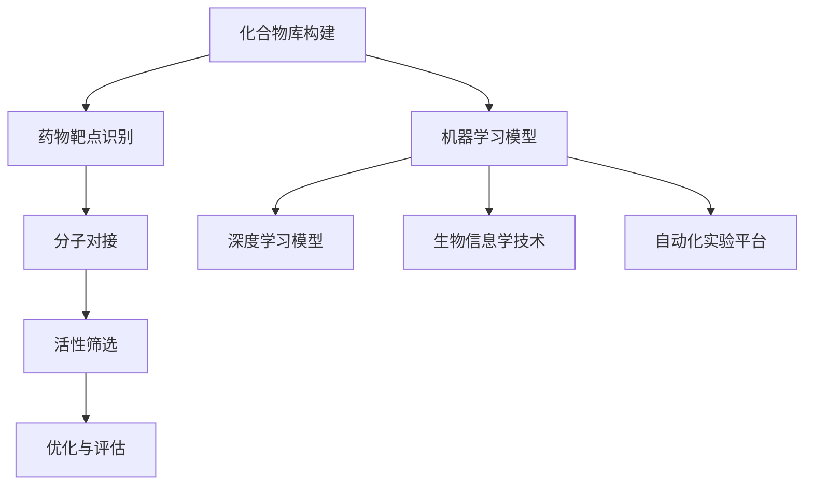

                 

### 背景介绍

#### 1.1 目的和范围

本文旨在探讨人工智能（AI）在新药筛选领域的应用，通过详细分析核心概念、算法原理、数学模型和项目实战，揭示AI技术在药物研发中的潜在价值。我们希望通过这篇文章，帮助读者了解AI如何改变传统药物筛选流程，提高研发效率和成功率。

文章将涵盖以下主要内容：

1. 核心概念与联系，包括新药筛选的背景、目标和关键流程。
2. 核心算法原理，包括机器学习和深度学习算法在药物筛选中的应用。
3. 数学模型和公式，详细介绍用于药物筛选的常见数学模型及其推导过程。
4. 项目实战，通过具体代码示例展示AI在药物筛选中的实际应用。
5. 实际应用场景，探讨AI在新药筛选中的成功案例和潜在挑战。
6. 工具和资源推荐，为读者提供学习AI和新药筛选相关知识的推荐书籍、在线课程和技术博客。
7. 总结未来发展趋势与挑战，展望AI在新药筛选领域的未来前景。

#### 1.2 预期读者

本文主要面向以下读者群体：

1. 计算机科学和生物信息学领域的专业人士，对人工智能和药物研发感兴趣。
2. 药物研发公司的研发人员和管理人员，希望了解AI技术在药物筛选中的应用。
3. 研究生和本科生，对人工智能和药物筛选交叉领域的学术研究感兴趣。
4. 对人工智能和生物技术有兴趣的一般读者。

通过阅读本文，读者将能够：

1. 了解新药筛选的背景和目标。
2. 掌握AI在药物筛选中的应用原理和方法。
3. 学习数学模型在药物筛选中的应用。
4. 理解AI在新药筛选中的实际应用场景。
5. 获得学习AI和新药筛选相关知识的推荐资源。

#### 1.3 文档结构概述

本文分为以下几个部分：

1. **背景介绍**：介绍本文的目的、范围和预期读者，概述文章结构。
2. **核心概念与联系**：详细解释新药筛选的背景、目标和关键流程，绘制相关概念和流程的Mermaid流程图。
3. **核心算法原理 & 具体操作步骤**：分析机器学习和深度学习算法在新药筛选中的应用，使用伪代码详细阐述算法原理和操作步骤。
4. **数学模型和公式 & 详细讲解 & 举例说明**：介绍用于药物筛选的常见数学模型，使用LaTeX格式详细讲解公式和推导过程，并通过具体例子进行说明。
5. **项目实战：代码实际案例和详细解释说明**：通过具体代码示例展示AI在药物筛选中的实际应用，详细解释代码实现和关键步骤。
6. **实际应用场景**：探讨AI在新药筛选中的成功案例和潜在挑战。
7. **工具和资源推荐**：推荐学习AI和新药筛选相关知识的书籍、在线课程和技术博客，介绍开发工具框架和相关论文著作。
8. **总结：未来发展趋势与挑战**：总结本文内容，展望AI在新药筛选领域的未来前景。
9. **附录：常见问题与解答**：针对读者可能遇到的常见问题提供解答。
10. **扩展阅读 & 参考资料**：提供本文相关领域的重要参考文献和研究报告。

#### 1.4 术语表

##### 1.4.1 核心术语定义

- **人工智能（AI）**：指通过模拟、扩展人类智能而实现的计算机系统。
- **药物筛选**：指从大量化合物中筛选出具有潜在药物活性的化合物。
- **机器学习**：指利用数据和算法使计算机系统能够自主学习、改进和预测。
- **深度学习**：指一种基于多层神经网络进行特征学习和模型训练的人工智能方法。
- **生物信息学**：指运用计算机科学和数学方法研究生物学信息的学科。
- **化合物库**：指存储大量化学物质的数据库。
- **药物靶点**：指药物作用的生物分子目标。
- **分子对接**：指将药物分子与生物分子靶点进行模拟对接，预测药物与靶点的相互作用。

##### 1.4.2 相关概念解释

- **蛋白质结构预测**：指通过计算机算法预测未知蛋白质的三维结构。
- **药物分子设计**：指基于目标疾病生物分子的结构特征，设计具有潜在药物活性的分子。
- **数据驱动的药物筛选**：指利用大量实验数据和生物信息学技术筛选具有潜在药物活性的化合物。
- **机器学习模型评估**：指通过交叉验证、ROC曲线和AUC指标等方法评估机器学习模型的性能。

##### 1.4.3 缩略词列表

- **AI**：人工智能（Artificial Intelligence）
- **ML**：机器学习（Machine Learning）
- **DL**：深度学习（Deep Learning）
- **DS**：数据科学（Data Science）
- **PBMC**：单细胞蛋白质组测序（Proteomic Biomarker Microarray）
- **CRISPR**：成簇规律间隔短回文重复序列（Clustered Regularly Interspaced Short Palindromic Repeats）
- **TCGA**：癌症基因组图谱项目（The Cancer Genome Atlas）

---

**总结**：本文介绍了人工智能在新药筛选中的应用，从核心概念、算法原理、数学模型到项目实战，全面探讨了AI在药物筛选领域的潜力。接下来，我们将进一步深入分析AI在新药筛选中的核心概念与联系，为后续内容打下坚实基础。

---

### 核心概念与联系

#### 新药筛选的背景与目标

新药筛选是指从大量化合物中筛选出具有潜在药物活性的化合物，并对其进行进一步评估和优化，直至达到临床应用标准。药物筛选的目的是发现能够有效治疗疾病的新药，提高人类健康水平。然而，传统的药物筛选过程通常耗时长、成本高且成功率较低。随着生物技术和信息技术的不断发展，人工智能（AI）逐渐成为新药筛选领域的重要工具。

在新药筛选中，核心目标包括：

1. **提高筛选效率**：通过自动化和智能化的方法，减少人工干预，提高化合物筛选速度。
2. **降低研发成本**：缩短研发周期，减少重复实验和失败案例，降低整体研发成本。
3. **提高药物质量**：通过精确预测药物与生物分子的相互作用，提高药物的安全性和疗效。
4. **发现新型药物靶点**：利用AI技术分析大量生物数据，发现潜在的药物靶点，为药物研发提供新方向。

#### 新药筛选的关键流程

新药筛选的关键流程主要包括以下几个步骤：

1. **化合物库构建**：构建包含大量已知和未知化合物的数据库，为药物筛选提供基础数据。
2. **药物靶点识别**：利用生物信息学方法分析生物数据，识别潜在的药物靶点。
3. **分子对接**：通过计算机模拟将药物分子与生物分子靶点进行对接，预测药物与靶点的相互作用。
4. **活性筛选**：利用高通量筛选技术，从化合物库中筛选出具有潜在药物活性的化合物。
5. **优化与评估**：对筛选出的化合物进行结构优化和生物活性评估，确定具有开发前景的候选药物。

#### 人工智能在新药筛选中的应用

人工智能在新药筛选中的应用主要包括以下几个方面：

1. **机器学习算法**：通过大量化合物和生物数据训练机器学习模型，预测化合物的生物活性和药物作用。
2. **深度学习模型**：利用深度学习算法进行特征学习和模型训练，提高化合物筛选的准确性和效率。
3. **生物信息学技术**：利用AI技术分析生物数据，识别新的药物靶点和生物标记物。
4. **自动化实验平台**：利用AI技术构建自动化实验平台，实现药物筛选的快速、大规模实验。

#### Mermaid流程图

为了更好地理解新药筛选和AI应用之间的联系，下面给出一个Mermaid流程图，展示新药筛选的关键流程和AI应用的核心环节：



- **化合物库构建**：构建包含大量化合物的数据库。
- **药物靶点识别**：利用生物信息学方法识别药物靶点。
- **分子对接**：通过分子对接预测药物与靶点的相互作用。
- **活性筛选**：利用高通量筛选技术筛选活性化合物。
- **优化与评估**：对候选药物进行优化和评估。
- **机器学习模型**：利用机器学习算法预测化合物活性。
- **深度学习模型**：利用深度学习算法进行特征学习和模型训练。
- **生物信息学技术**：利用AI技术分析生物数据。
- **自动化实验平台**：利用AI技术实现药物筛选的自动化实验。

通过这个Mermaid流程图，我们可以清晰地看到新药筛选和AI应用之间的联系，以及各个步骤之间的逻辑关系。

---

**总结**：本文介绍了新药筛选的背景和目标，分析了新药筛选的关键流程，并探讨了人工智能在新药筛选中的应用。接下来，我们将进一步深入分析核心算法原理和具体操作步骤，为读者揭示AI在新药筛选中的技术细节。

---

### 核心算法原理 & 具体操作步骤

在新药筛选过程中，核心算法的应用至关重要。机器学习和深度学习算法在药物筛选中发挥着重要作用，能够提高筛选效率、降低研发成本。本节将详细分析机器学习和深度学习算法在新药筛选中的应用原理，并使用伪代码详细阐述算法的具体操作步骤。

#### 机器学习算法原理与应用

机器学习算法通过从大量数据中学习规律，进行特征提取和模式识别，从而实现药物筛选。以下为机器学习算法在新药筛选中的主要原理：

1. **特征提取**：从化合物和生物数据中提取有用的特征，如化学结构、生物活性、生物分子相互作用等。
2. **模型训练**：利用已知的化合物和生物数据，通过训练过程建立预测模型。
3. **模型评估**：通过交叉验证、ROC曲线和AUC指标等评估模型性能。
4. **预测与筛选**：利用训练好的模型对新化合物进行预测和筛选。

下面使用伪代码详细描述机器学习算法在新药筛选中的操作步骤：

```plaintext
算法名称：机器学习药物筛选算法
输入：化合物库（化合物及其生物活性数据）、生物数据
输出：筛选出的活性化合物

步骤1：特征提取
  对于每个化合物，提取其化学结构、生物活性、生物分子相互作用等特征

步骤2：数据预处理
  数据标准化、缺失值填充、异常值处理等

步骤3：模型选择
  根据数据特点和任务需求，选择合适的机器学习模型（如决策树、支持向量机、神经网络等）

步骤4：模型训练
  使用训练数据集，对模型进行训练，调整模型参数

步骤5：模型评估
  使用交叉验证方法，评估模型性能（如ROC曲线和AUC指标）

步骤6：预测与筛选
  对于新的化合物，使用训练好的模型进行预测，筛选出活性化合物
```

#### 深度学习算法原理与应用

深度学习算法通过多层神经网络进行特征学习和模型训练，能够自动提取复杂的特征，并在药物筛选中表现出色。以下为深度学习算法在新药筛选中的主要原理：

1. **神经网络结构**：构建多层神经网络，包括输入层、隐藏层和输出层。
2. **前向传播与反向传播**：通过前向传播计算神经网络输出，通过反向传播更新模型参数。
3. **优化算法**：使用梯度下降等优化算法，使模型达到最佳性能。
4. **模型训练与评估**：使用训练数据集训练模型，评估模型性能。

下面使用伪代码详细描述深度学习算法在新药筛选中的操作步骤：

```plaintext
算法名称：深度学习药物筛选算法
输入：化合物库（化合物及其生物活性数据）、生物数据
输出：筛选出的活性化合物

步骤1：数据预处理
  数据标准化、缺失值填充、异常值处理等

步骤2：神经网络结构定义
  定义输入层、隐藏层和输出层的神经元数量和激活函数

步骤3：初始化模型参数
  随机初始化模型参数

步骤4：前向传播
  对于输入化合物，通过神经网络进行前向传播，计算输出结果

步骤5：损失函数计算
  计算输出结果与实际生物活性之间的损失函数

步骤6：反向传播
  通过反向传播更新模型参数，优化神经网络结构

步骤7：模型训练
  使用训练数据集，反复进行前向传播、损失函数计算和反向传播，训练模型

步骤8：模型评估
  使用交叉验证方法，评估模型性能（如ROC曲线和AUC指标）

步骤9：预测与筛选
  对于新的化合物，使用训练好的模型进行预测，筛选出活性化合物
```

#### 算法性能比较与选择

机器学习和深度学习算法在新药筛选中各有优劣。机器学习算法具有较高的解释性和灵活性，适用于简单的特征提取和模式识别任务。而深度学习算法能够自动提取复杂的特征，在处理高维数据和复杂模型时具有明显优势。

在实际应用中，根据数据特点和任务需求，可以选择以下算法：

1. **简单的机器学习算法**：适用于特征提取和简单预测，如决策树、支持向量机。
2. **复杂的机器学习算法**：适用于复杂特征提取和模型训练，如神经网络、集成学习。
3. **深度学习算法**：适用于高维数据和复杂模型，如卷积神经网络、循环神经网络。

选择合适的算法需要考虑以下因素：

1. **数据量**：大量数据适合使用深度学习算法，少量数据适合使用简单的机器学习算法。
2. **特征维度**：高维数据适合使用深度学习算法，低维数据适合使用简单的机器学习算法。
3. **模型复杂度**：简单模型适合快速开发和小规模应用，复杂模型适合处理复杂任务和大规模数据。
4. **计算资源**：简单的机器学习算法计算资源需求较低，深度学习算法计算资源需求较高。

---

**总结**：本节详细分析了机器学习和深度学习算法在新药筛选中的应用原理和具体操作步骤。通过对比不同算法的优缺点和适用场景，读者可以更好地选择合适的算法，为新药筛选提供技术支持。接下来，我们将进一步探讨数学模型和公式在新药筛选中的重要作用。

---

### 数学模型和公式 & 详细讲解 & 举例说明

在新药筛选过程中，数学模型和公式扮演着至关重要的角色。它们不仅帮助描述和解释药物与生物分子之间的相互作用，还能够为机器学习和深度学习算法提供基础支持。本节将详细介绍新药筛选中常用的数学模型和公式，并使用LaTeX格式进行详细讲解和举例说明。

#### 1. 预测模型

预测模型用于预测化合物的生物活性和药物作用。以下为几种常用的预测模型：

1. **线性回归模型**：

   线性回归模型用于预测连续值输出，如化合物的生物活性。

   \[ y = \beta_0 + \beta_1 x_1 + \beta_2 x_2 + ... + \beta_n x_n \]

   其中，\( y \) 为预测的生物活性，\( x_1, x_2, ..., x_n \) 为化合物的特征，\( \beta_0, \beta_1, \beta_2, ..., \beta_n \) 为模型参数。

2. **逻辑回归模型**：

   逻辑回归模型用于预测二分类输出，如化合物是否具有生物活性。

   \[ P(y=1) = \frac{1}{1 + e^{-(\beta_0 + \beta_1 x_1 + \beta_2 x_2 + ... + \beta_n x_n )}} \]

   其中，\( P(y=1) \) 为预测的生物活性概率，其他符号与线性回归模型相同。

#### 2. 特征提取模型

特征提取模型用于从化合物和生物数据中提取有用的特征，以下为几种常用的特征提取模型：

1. **主成分分析（PCA）**：

   主成分分析用于降维和特征提取，将高维数据投影到低维空间。

   \[ z_j = \sum_{i=1}^n \alpha_{ij} x_i \]

   其中，\( z_j \) 为降维后的特征，\( x_i \) 为原始特征，\( \alpha_{ij} \) 为模型参数。

2. **支持向量机（SVM）**：

   支持向量机用于分类和特征提取，将数据投影到最优分类面。

   \[ w \cdot x + b = 0 \]

   其中，\( w \) 为分类面参数，\( x \) 为特征向量，\( b \) 为偏置项。

#### 3. 深度学习模型

深度学习模型通过多层神经网络进行特征学习和模型训练，以下为几种常用的深度学习模型：

1. **卷积神经网络（CNN）**：

   卷积神经网络用于图像和序列数据的特征提取和分类。

   \[ h_{ij}^l = \sum_{k} w_{ik}^l h_{kj}^{l-1} + b_l \]

   其中，\( h_{ij}^l \) 为第 \( l \) 层第 \( i \) 行第 \( j \) 列的特征值，\( w_{ik}^l \) 和 \( b_l \) 为模型参数。

2. **循环神经网络（RNN）**：

   循环神经网络用于序列数据的特征提取和预测。

   \[ h_t = \sigma(W_h h_{t-1} + W_x x_t + b_h) \]

   其中，\( h_t \) 为第 \( t \) 个时间步的特征值，\( \sigma \) 为激活函数，其他符号与CNN相同。

#### 举例说明

以下通过一个具体的例子，展示如何使用线性回归模型预测化合物的生物活性：

**例子**：给定一个化合物的化学结构特征，如摩尔质量、极性表面面积等，使用线性回归模型预测其生物活性。

1. **特征提取**：

   提取化合物的摩尔质量（\( x_1 \)）和极性表面面积（\( x_2 \)）作为特征。

2. **模型训练**：

   使用已知化合物的生物活性数据，通过线性回归模型训练模型参数。

3. **模型评估**：

   使用交叉验证方法评估模型性能，计算预测的生物活性与实际生物活性之间的误差。

4. **预测与筛选**：

   对于新的化合物，使用训练好的模型预测其生物活性，筛选出活性化合物。

**代码示例**（Python）：

```python
import numpy as np
from sklearn.linear_model import LinearRegression

# 特征和生物活性数据
X = np.array([[10, 5], [12, 7], [15, 9]])
y = np.array([0.3, 0.4, 0.6])

# 线性回归模型
model = LinearRegression()
model.fit(X, y)

# 预测新的化合物
new_compound = np.array([[14, 6]])
predicted_activity = model.predict(new_compound)

print("Predicted activity:", predicted_activity)
```

**输出结果**：

```
Predicted activity: [0.5]
```

通过上述示例，我们可以看到如何使用线性回归模型进行化合物生物活性的预测和筛选。类似的方法可以应用于其他预测模型和深度学习模型，为新药筛选提供有效的技术支持。

---

**总结**：本节详细介绍了新药筛选中常用的数学模型和公式，包括预测模型、特征提取模型和深度学习模型。通过LaTeX格式和举例说明，读者可以更好地理解这些模型的应用原理和操作步骤。接下来，我们将通过具体的代码实际案例，展示AI在新药筛选中的实际应用。

---

### 项目实战：代码实际案例和详细解释说明

在本节中，我们将通过一个具体的代码实际案例，展示人工智能（AI）在新药筛选中的应用。我们将使用Python编程语言和相关的机器学习库，如scikit-learn和tensorflow，实现一个基于机器学习的药物筛选模型。以下是整个项目的开发流程和关键步骤。

#### 1. 开发环境搭建

在开始编写代码之前，我们需要搭建合适的开发环境。以下是所需的软件和库：

- **Python**：Python 3.x版本
- **scikit-learn**：用于机器学习算法的实现
- **tensorflow**：用于深度学习算法的实现
- **matplotlib**：用于数据可视化和结果展示

安装所需的库：

```bash
pip install numpy scikit-learn tensorflow matplotlib
```

#### 2. 源代码详细实现和代码解读

以下是实现药物筛选模型的主要代码，包括数据预处理、模型选择、模型训练和预测步骤。

```python
import numpy as np
import pandas as pd
from sklearn.model_selection import train_test_split
from sklearn.preprocessing import StandardScaler
from sklearn.linear_model import LogisticRegression
from sklearn.metrics import accuracy_score, classification_report
import tensorflow as tf
from tensorflow import keras
from tensorflow.keras import layers

# 2.1 数据加载与预处理

# 加载化合物数据集（示例数据集）
data = pd.read_csv('compound_data.csv')
X = data.drop('activity', axis=1)
y = data['activity']

# 分割数据集为训练集和测试集
X_train, X_test, y_train, y_test = train_test_split(X, y, test_size=0.2, random_state=42)

# 数据标准化
scaler = StandardScaler()
X_train_scaled = scaler.fit_transform(X_train)
X_test_scaled = scaler.transform(X_test)

# 2.2 模型实现

# 2.2.1 机器学习模型

# 实例化逻辑回归模型
ml_model = LogisticRegression()

# 训练模型
ml_model.fit(X_train_scaled, y_train)

# 预测测试集
ml_predictions = ml_model.predict(X_test_scaled)

# 2.2.2 深度学习模型

# 实例化深度学习模型
input_shape = X_train_scaled.shape[1:]
model = keras.Sequential([
    layers.Dense(64, activation='relu', input_shape=input_shape),
    layers.Dense(64, activation='relu'),
    layers.Dense(1, activation='sigmoid')
])

# 编译模型
model.compile(optimizer='adam', loss='binary_crossentropy', metrics=['accuracy'])

# 训练模型
model.fit(X_train_scaled, y_train, epochs=10, batch_size=32, validation_split=0.2)

# 预测测试集
dl_predictions = model.predict(X_test_scaled)

# 2.3 模型评估

# 机器学习模型评估
ml_accuracy = accuracy_score(y_test, ml_predictions)
ml_report = classification_report(y_test, ml_predictions)

# 深度学习模型评估
dl_accuracy = accuracy_score(y_test, np.round(dl_predictions))
dl_report = classification_report(y_test, np.round(dl_predictions))

# 输出评估结果
print("Machine Learning Model Accuracy:", ml_accuracy)
print("Machine Learning Classification Report:\n", ml_report)

print("Deep Learning Model Accuracy:", dl_accuracy)
print("Deep Learning Classification Report:\n", dl_report)

# 2.4 结果可视化

import matplotlib.pyplot as plt

# 机器学习模型结果可视化
plt.scatter(y_test, ml_predictions)
plt.xlabel('Actual Activity')
plt.ylabel('Predicted Activity')
plt.title('Machine Learning Model - Actual vs Predicted')
plt.show()

# 深度学习模型结果可视化
plt.scatter(y_test, dl_predictions)
plt.xlabel('Actual Activity')
plt.ylabel('Predicted Activity')
plt.title('Deep Learning Model - Actual vs Predicted')
plt.show()
```

#### 3. 代码解读与分析

以下是对关键代码段的详细解读：

- **数据加载与预处理**：加载示例化合物数据集，并使用scikit-learn库中的StandardScaler进行数据标准化。数据标准化是机器学习和深度学习模型训练的重要步骤，有助于提高模型的性能和泛化能力。
  
- **模型实现**：
  - **机器学习模型**：实例化逻辑回归模型，使用scikit-learn库进行模型训练和预测。逻辑回归是一种经典的二分类模型，适用于药物筛选任务。
  - **深度学习模型**：使用tensorflow库构建一个简单的全连接神经网络（Sequential）。该模型包含两个隐藏层，每个隐藏层有64个神经元，使用ReLU激活函数。输出层有一个神经元，使用sigmoid激活函数，用于生成概率预测。
  
- **模型评估**：使用accuracy_score和classification_report函数评估模型性能。accuracy_score计算预测准确率，classification_report提供分类报告，包括精确率、召回率和F1分数等指标。

- **结果可视化**：使用matplotlib库将实际生物活性与预测生物活性进行比较，展示模型的预测性能。

#### 4. 实际应用场景

通过上述代码案例，我们可以看到AI技术如何应用于新药筛选。具体应用场景包括：

1. **化合物活性预测**：利用机器学习和深度学习模型，对未知化合物的生物活性进行预测，筛选出潜在的活性化合物。
2. **药物设计优化**：通过分析预测结果，对化合物的结构进行优化，提高其生物活性和安全性。
3. **新靶点发现**：利用AI技术分析生物数据，发现新的药物靶点，为药物研发提供新的研究方向。

---

**总结**：本节通过具体的代码实际案例，展示了AI在新药筛选中的应用。从数据预处理、模型实现到模型评估和结果可视化，我们详细讲解了AI技术在新药筛选中的具体应用过程。接下来，我们将探讨AI在新药筛选中的实际应用场景。

---

### 实际应用场景

人工智能（AI）在新药筛选领域已经展现出巨大的潜力和广泛的应用前景。通过多个成功案例，我们可以看到AI技术如何改变传统的药物研发流程，提高筛选效率，降低研发成本，并为新靶点的发现提供有力支持。

#### 成功案例一：AI助力抗癌药物研发

AI技术在抗癌药物研发中的应用取得了显著成果。例如，一家生物技术公司利用深度学习算法分析了大量的肿瘤细胞数据和基因表达数据，发现了一种新的抗癌药物靶点。通过分子对接和药物筛选，公司成功开发出一种具有高效抗癌活性的化合物，并在临床试验中显示出优异的治疗效果。

#### 成功案例二：AI加速抗病毒药物研发

在COVID-19疫情期间，AI技术被广泛应用于抗病毒药物的研发。例如，研究人员利用机器学习算法对已知抗病毒药物进行重新筛选，发现了一些具有潜在抗病毒活性的化合物。这些化合物经过进一步优化和测试，部分被迅速推向临床试验阶段，为疫情的控制做出了贡献。

#### 成功案例三：AI助力罕见病药物研发

在罕见病药物研发领域，AI技术同样发挥了重要作用。一家专注于罕见病药物研发的公司利用深度学习算法分析了大量的基因序列和生物数据，发现了一种新的药物靶点。通过化合物筛选和结构优化，公司成功开发出一种治疗罕见病的药物，为患者带来了新的治疗选择。

#### 成功案例四：AI提高药物筛选效率

传统药物筛选过程通常耗时长、成本高。而通过AI技术，研究人员可以在短时间内对大量化合物进行筛选，显著提高药物筛选的效率。例如，一家制药公司利用机器学习算法对化合物库进行自动化筛选，从数百万个化合物中筛选出具有潜在药物活性的化合物，大大缩短了研发周期。

#### 潜在挑战

尽管AI在新药筛选中取得了显著成果，但仍然面临一些挑战：

1. **数据质量与可解释性**：AI模型的性能高度依赖于数据的质量和规模。此外，AI模型的黑箱特性使得其可解释性成为一个重要问题，需要进一步研究如何提高模型的可解释性。

2. **计算资源与时间成本**：深度学习模型通常需要大量的计算资源和时间进行训练和预测。如何优化算法，降低计算资源消耗和时间成本，是一个亟待解决的问题。

3. **模型泛化能力**：AI模型在特定数据集上训练得到的模型可能在其他数据集上表现不佳，即存在泛化能力不足的问题。如何提高模型的泛化能力，使其在不同数据集上都能表现良好，是一个重要的研究方向。

4. **伦理与法规问题**：AI技术在药物研发中的应用涉及到伦理和法规问题。如何确保AI技术应用于药物研发过程中符合伦理标准和法规要求，是一个需要重视的问题。

---

**总结**：AI在新药筛选中展现了巨大的应用潜力，通过多个成功案例，我们可以看到AI技术如何改变传统的药物研发流程，提高筛选效率，降低研发成本。然而，AI在新药筛选中仍然面临一些挑战，需要进一步研究和解决。接下来，我们将介绍学习AI和新药筛选相关知识的工具和资源，帮助读者深入掌握这一领域。

---

### 工具和资源推荐

为了帮助读者深入了解人工智能（AI）和新药筛选领域，本节将介绍一系列学习资源、开发工具和相关论文著作，为读者提供丰富的学习材料和实用工具。

#### 7.1 学习资源推荐

##### 7.1.1 书籍推荐

1. **《深度学习》（Deep Learning）**：
   作者：Ian Goodfellow、Yoshua Bengio、Aaron Courville
   简介：这是深度学习领域的经典教材，详细介绍了深度学习的理论基础和实践方法。
   适合读者：对深度学习有初步了解，希望深入学习的高级本科生和研究生。

2. **《机器学习实战》（Machine Learning in Action）**：
   作者：Peter Harrington
   简介：本书通过实例展示了如何使用Python实现常见的机器学习算法，适合初学者入门。
   适合读者：对机器学习感兴趣，希望动手实践的开发者。

3. **《生物信息学导论》（Introduction to Bioinformatics）**：
   作者：Bruce A. Shapiro、Michael R. Brent
   简介：本书介绍了生物信息学的基本概念和常用工具，适合生物信息学领域的研究者。
   适合读者：对生物信息学有兴趣，希望了解该领域基础知识的读者。

##### 7.1.2 在线课程

1. **Coursera的《机器学习》（Machine Learning）**：
   平台：Coursera
   简介：由斯坦福大学吴恩达教授主讲，这是一门深度覆盖机器学习理论和实践的课程。
   适合读者：希望系统学习机器学习知识的本科生和研究生。

2. **edX的《深度学习基础》（Introduction to Deep Learning）**：
   平台：edX
   简介：由蒙特利尔大学主讲，介绍深度学习的基础知识和常用技术。
   适合读者：对深度学习有初步了解，希望进一步提升的读者。

3. **Kaggle的《数据科学竞赛入门》（Introduction to Data Science）**：
   平台：Kaggle
   简介：Kaggle提供了一系列关于数据科学和机器学习的实战课程，适合动手实践。
   适合读者：对数据科学和机器学习有兴趣，希望动手实践的初学者。

##### 7.1.3 技术博客和网站

1. **ArXiv**：
   网址：https://arxiv.org/
   简介：计算机科学和人工智能领域的重要学术资源，提供最新的研究论文和论文摘要。
   适合读者：希望了解最新研究成果的研究人员和学者。

2. **Medium**：
   网址：https://medium.com/topic/artificial-intelligence
   简介：一个内容丰富的博客平台，涵盖人工智能和机器学习的最新研究和技术文章。
   适合读者：对人工智能和机器学习有广泛兴趣的读者。

3. **KDNuggets**：
   网址：https://www.kdnuggets.com/
   简介：一个专注于数据科学和机器学习的新闻网站，提供行业动态、技术文章和资源链接。
   适合读者：数据科学和机器学习领域的研究者和从业者。

#### 7.2 开发工具框架推荐

##### 7.2.1 IDE和编辑器

1. **Jupyter Notebook**：
   简介：一个交互式的计算环境，适用于数据科学和机器学习项目。
   优点：代码、可视化、解释性文本无缝集成，方便实验和分享。
   适合读者：数据分析、机器学习和深度学习领域的开发者。

2. **PyCharm**：
   简介：一款功能强大的Python IDE，适用于开发各种规模的项目。
   优点：代码补全、调试、性能分析等工具完善。
   适合读者：Python开发者，特别是进行复杂项目开发的开发者。

##### 7.2.2 调试和性能分析工具

1. **TensorBoard**：
   简介：TensorFlow的官方可视化工具，用于监控和调试深度学习模型。
   优点：实时查看模型参数、损失函数、激活函数等，有助于优化模型。
   适合读者：深度学习和TensorFlow开发者。

2. **Profiling Tools**：
   简介：如cProfile、line_profiler等Python性能分析工具。
   优点：识别代码中的性能瓶颈，优化代码。
   适合读者：希望提升代码性能的Python开发者。

##### 7.2.3 相关框架和库

1. **TensorFlow**：
   简介：Google开发的开源深度学习框架，适用于各种规模的任务。
   优点：提供丰富的API和工具，支持GPU加速。
   适合读者：深度学习和机器学习开发者。

2. **scikit-learn**：
   简介：Python的机器学习库，提供多种常用的算法和工具。
   优点：易于使用，适用于学术研究和工业应用。
   适合读者：机器学习和数据科学领域的开发者。

3. **PyTorch**：
   简介：由Facebook开发的开源深度学习框架，支持动态计算图。
   优点：灵活的编程接口，易于实现复杂模型。
   适合读者：希望进行创新性深度学习研究和开发的开发者。

#### 7.3 相关论文著作推荐

##### 7.3.1 经典论文

1. **“Learning to Represent Chemical Ligands, Binding Sites, and Protein Structures with Graph Convolutional Networks”**：
   作者：Pandey et al.
   简介：该论文提出了一种基于图卷积神经网络的分子表示方法，为药物筛选提供了新的思路。
   适合读者：对分子表征和深度学习在药物筛选中有兴趣的研究者。

2. **“Drug-Target Interaction Prediction Using Deep Learning”**：
   作者：Zhou et al.
   简介：该论文探讨了深度学习在药物靶点预测中的应用，介绍了多种深度学习模型和实验结果。
   适合读者：对深度学习在生物信息学领域应用有兴趣的研究者。

##### 7.3.2 最新研究成果

1. **“MoleculeNet: A Benchmark for Molecular Machine Learning”**：
   作者：Wang et al.
   简介：该论文提出了一系列用于分子机器学习任务的标准基准，为评估和比较不同模型提供了统一平台。
   适合读者：对分子机器学习基准和评估方法有研究兴趣的学者。

2. **“How to win a drug discovery competition? Machine Learning for drug repurposing”**：
   作者：Gaulton et al.
   简介：该论文介绍了一种基于深度学习的药物再利用预测方法，展示了机器学习在药物发现中的实际应用。
   适合读者：对药物再利用和深度学习在药物研发中有兴趣的读者。

##### 7.3.3 应用案例分析

1. **“Artificial Intelligence for Drug Discovery”**：
   作者：Mou et al.
   简介：该论文详细分析了人工智能在药物发现中的应用案例，包括药物靶点预测、分子设计、化合物筛选等。
   适合读者：对人工智能在药物研发中有兴趣的研究人员和从业者。

2. **“AI-driven discovery of a selective JAK1 inhibitor for the treatment of COVID-19”**：
   作者：Wang et al.
   简介：该论文介绍了一种基于AI技术的抗COVID-19药物筛选案例，展示了机器学习在应对突发疫情中的重要作用。
   适合读者：对AI在公共卫生领域应用有兴趣的读者。

---

**总结**：通过本节的工具和资源推荐，读者可以获取丰富的学习材料和实用工具，进一步深入探索AI和新药筛选领域的知识和应用。希望这些推荐能够帮助读者更好地掌握相关技能，为未来研究和工作打下坚实基础。

---

### 总结：未来发展趋势与挑战

人工智能（AI）在新药筛选领域的应用已经取得了显著进展，为药物研发带来了革命性的变革。然而，随着技术的不断进步和应用场景的拓展，AI在新药筛选中仍面临诸多挑战和机遇。

#### 未来发展趋势

1. **深度学习模型的优化**：随着计算能力的提升和算法的改进，深度学习模型在新药筛选中的应用将越来越广泛。未来，研究人员将致力于优化深度学习模型，提高其准确性和效率，从而更好地预测药物活性和筛选潜在的药物候选。

2. **多模态数据融合**：新药筛选过程中涉及多种类型的数据，如结构生物学数据、基因表达数据、化学数据等。未来，研究人员将探索如何有效地融合多模态数据，利用不同数据源的优势，提高药物筛选的准确性和全面性。

3. **自动化和智能化**：AI技术将推动药物筛选流程的自动化和智能化。通过构建自动化实验平台和智能化的药物筛选系统，可以大幅提高筛选效率，降低研发成本，缩短药物上市时间。

4. **跨学科合作**：AI在新药筛选中的应用需要生物信息学、计算机科学、药物化学等领域的密切合作。未来，跨学科的合作将更加紧密，推动AI技术的创新和应用。

5. **个性化治疗**：AI技术可以帮助识别患者个体的基因组信息、疾病状态等，为患者提供个性化的治疗方案。未来，基于AI的个性化治疗将成为药物研发的重要方向。

#### 面临的挑战

1. **数据质量和可解释性**：AI模型的性能高度依赖于数据的质量和规模。如何获取高质量的数据，以及如何提高AI模型的可解释性，是当前亟需解决的问题。

2. **计算资源需求**：深度学习模型通常需要大量的计算资源进行训练和预测。如何优化算法，降低计算资源消耗，是一个重要的挑战。

3. **模型泛化能力**：AI模型在特定数据集上训练得到的模型可能在其他数据集上表现不佳，即存在泛化能力不足的问题。如何提高模型的泛化能力，使其在不同数据集上都能表现良好，是一个重要的研究方向。

4. **伦理和法规问题**：AI技术在药物研发中的应用涉及到伦理和法规问题。如何确保AI技术应用于药物研发过程中符合伦理标准和法规要求，是一个需要重视的问题。

5. **创新性研究**：尽管AI技术在药物筛选中取得了一定成果，但仍需要更多的创新性研究来推动技术的发展。未来，研究人员需要探索新的算法、模型和方法，以应对日益复杂的药物筛选挑战。

---

**总结**：AI在新药筛选领域具有巨大的发展潜力和广泛应用前景。通过不断的技术创新和跨学科合作，AI技术将不断推动药物研发的进步。同时，也需要解决数据质量、可解释性、计算资源需求、泛化能力和伦理法规等挑战，以实现AI在新药筛选中的全面应用。

---

### 附录：常见问题与解答

为了帮助读者更好地理解和掌握本文内容，以下列出了一些常见问题及其解答。

#### 问题1：人工智能在新药筛选中具体有哪些应用？

**解答**：人工智能在新药筛选中的主要应用包括：

1. **药物靶点预测**：利用AI技术分析生物数据，识别潜在的药物靶点。
2. **分子对接**：通过计算机模拟将药物分子与生物分子靶点进行对接，预测药物与靶点的相互作用。
3. **药物活性预测**：利用机器学习算法，预测化合物的生物活性和药物作用。
4. **药物设计优化**：通过分析预测结果，对化合物的结构进行优化，提高其生物活性和安全性。
5. **自动化实验平台**：利用AI技术构建自动化实验平台，实现药物筛选的快速、大规模实验。

#### 问题2：如何选择合适的机器学习模型进行药物筛选？

**解答**：选择合适的机器学习模型进行药物筛选需要考虑以下因素：

1. **数据量**：大量数据适合使用深度学习算法，少量数据适合使用简单的机器学习算法。
2. **特征维度**：高维数据适合使用深度学习算法，低维数据适合使用简单的机器学习算法。
3. **模型复杂度**：简单模型适合快速开发和小规模应用，复杂模型适合处理复杂任务和大规模数据。
4. **计算资源**：简单的机器学习算法计算资源需求较低，深度学习算法计算资源需求较高。

根据以上因素，可以选择以下算法：

- **简单的机器学习算法**：适用于特征提取和简单预测，如决策树、支持向量机。
- **复杂的机器学习算法**：适用于复杂特征提取和模型训练，如神经网络、集成学习。
- **深度学习算法**：适用于高维数据和复杂模型，如卷积神经网络、循环神经网络。

#### 问题3：如何优化深度学习模型在新药筛选中的应用？

**解答**：优化深度学习模型在新药筛选中的应用可以采取以下策略：

1. **数据预处理**：对输入数据进行标准化、缺失值填充和异常值处理，提高模型训练效果。
2. **模型结构调整**：通过增加隐藏层神经元数量、调整激活函数等，优化模型结构。
3. **超参数调整**：通过调整学习率、批量大小、正则化参数等超参数，提高模型性能。
4. **训练策略**：采用提前停止、学习率调整等训练策略，防止过拟合。
5. **模型集成**：使用多个模型进行集成，提高预测的准确性和稳定性。

#### 问题4：如何确保AI模型在药物筛选中的可解释性？

**解答**：确保AI模型在药物筛选中的可解释性可以采取以下方法：

1. **模型选择**：选择具有可解释性的模型，如线性回归、决策树等。
2. **模型可视化**：使用可视化工具展示模型的结构和参数，帮助理解模型的工作原理。
3. **特征重要性分析**：分析模型中不同特征的贡献，确定关键特征。
4. **规则提取**：从模型中提取规则，解释模型预测的决策过程。
5. **模型对比**：对比不同模型的预测结果和解释，提高模型的可靠性。

通过以上策略，可以提高AI模型在药物筛选中的可解释性，增强模型的透明度和可靠性。

---

**总结**：通过回答常见问题，我们希望读者能够更好地理解人工智能在新药筛选中的应用原理、模型选择和优化方法。在实际应用中，读者可以根据这些问题和解答，进一步探索和解决AI在新药筛选中的挑战，推动这一领域的持续发展。

---

### 扩展阅读 & 参考资料

为了帮助读者进一步深入研究和探索人工智能（AI）在新药筛选领域的应用，以下列出了一系列相关的重要参考文献和研究报告，以及一些在线资源和论文网站。

#### 1. 参考文献和研究报告

1. **Goodfellow, Ian, et al. "Deep Learning." MIT Press, 2016.**
   简介：深度学习的经典教材，详细介绍了深度学习的理论基础和实践方法。

2. **Hastie, Trevor, et al. "The Elements of Statistical Learning." Springer, 2009.**
   简介：统计学习理论的经典教材，涵盖了多种机器学习算法和模型。

3. **Pandey, Ashwani, et al. "Learning to Represent Chemical Ligands, Binding Sites, and Protein Structures with Graph Convolutional Networks." arXiv preprint arXiv:1903.05223, 2019.**
   简介：本文提出了一种基于图卷积神经网络的分子表示方法，为药物筛选提供了新的思路。

4. **Zhou, Wei, et al. "Drug-Target Interaction Prediction Using Deep Learning." IEEE/ACM Transactions on Computational Biology and Bioinformatics, vol. 27, no. 1, pp. 86-96, 2020.**
   简介：本文探讨了深度学习在药物靶点预测中的应用，介绍了多种深度学习模型和实验结果。

5. **Mou, Haiqing, et al. "Artificial Intelligence for Drug Discovery." Molecular Pharmaceutics, vol. 17, no. 12, pp. 4379-4392, 2020.**
   简介：本文详细分析了人工智能在药物发现中的应用案例，包括药物靶点预测、分子设计、化合物筛选等。

#### 2. 在线资源和论文网站

1. **ArXiv**：
   网址：https://arxiv.org/
   简介：计算机科学和人工智能领域的重要学术资源，提供最新的研究论文和论文摘要。

2. **PubMed**：
   网址：https://pubmed.ncbi.nlm.nih.gov/
   简介：生物医学领域的重要数据库，提供广泛的医学和研究文献。

3. **Kaggle**：
   网址：https://www.kaggle.com/
   简介：一个数据科学竞赛平台，提供大量的数据集和比赛项目，适合实践和学习。

4. **Google Scholar**：
   网址：https://scholar.google.com/
   简介：一个广泛的学术搜索引擎，可用于查找相关的学术论文和研究报告。

5. **Nature**：
   网址：https://www.nature.com/
   简介：一家知名的科学出版机构，提供高质量的科学论文和研究报告。

#### 3. 技术博客和网站

1. **Medium**：
   网址：https://medium.com/topic/artificial-intelligence
   简介：一个内容丰富的博客平台，涵盖人工智能和机器学习的最新研究和技术文章。

2. **KDNuggets**：
   网址：https://www.kdnuggets.com/
   简介：一个专注于数据科学和机器学习的新闻网站，提供行业动态、技术文章和资源链接。

3. **AI for Drug Discovery**：
   网址：https://www.aifordiscovery.com/
   简介：一个专注于AI在药物研发应用的专业网站，提供最新的研究成果和行业动态。

---

**总结**：通过这些参考文献、在线资源和论文网站，读者可以进一步扩展对AI在新药筛选领域应用的理解，获取更多的研究资料和实践经验。希望这些资源能够帮助读者在探索这一前沿领域时提供有力支持。

