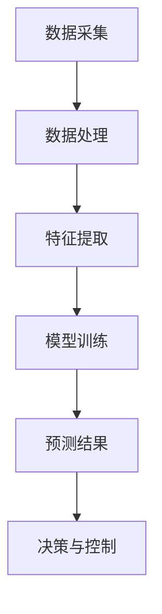

                 

# 人工智能在智慧农业病虫害预测中的应用

> **关键词：智慧农业、病虫害预测、人工智能、机器学习、深度学习**
>
> **摘要：本文将详细探讨人工智能在智慧农业病虫害预测中的应用，通过分析核心概念、算法原理、数学模型、实际案例和未来发展趋势，为农业从业者提供技术指导和思考方向。**

## 1. 背景介绍

### 1.1 目的和范围

智慧农业是现代农业发展的重要方向，其核心是通过先进技术和数据分析手段，提高农业生产效率和农产品质量。病虫害预测作为智慧农业的重要组成部分，对于减少农业损失、保障粮食安全具有重要作用。本文旨在介绍人工智能在病虫害预测中的具体应用，通过深度学习和机器学习算法，实现病虫害的早期预警和精准防治。

本文将涵盖以下内容：

1. 核心概念与联系
2. 核心算法原理与具体操作步骤
3. 数学模型与公式详细讲解
4. 项目实战：代码实际案例和详细解释说明
5. 实际应用场景
6. 工具和资源推荐
7. 总结：未来发展趋势与挑战

### 1.2 预期读者

本文适合对人工智能和智慧农业有一定了解的读者，包括农业从业者、科研人员、软件开发者以及对农业技术感兴趣的技术爱好者。本文旨在为读者提供一份全面的技术指南，帮助大家更好地理解和应用人工智能技术。

### 1.3 文档结构概述

本文的结构如下：

1. **背景介绍**：介绍本文的目的、范围、预期读者和文档结构。
2. **核心概念与联系**：阐述智慧农业、病虫害预测、人工智能等相关概念，并提供Mermaid流程图。
3. **核心算法原理与具体操作步骤**：详细讲解常用的机器学习和深度学习算法，并使用伪代码展示。
4. **数学模型与公式详细讲解**：介绍相关数学模型，使用LaTeX格式表示，并提供实际应用举例。
5. **项目实战**：展示一个实际项目案例，详细解释代码实现和关键步骤。
6. **实际应用场景**：分析病虫害预测在实际农业中的应用。
7. **工具和资源推荐**：推荐相关学习资源和开发工具。
8. **总结**：讨论未来发展趋势与挑战。
9. **附录**：提供常见问题与解答。
10. **扩展阅读**：推荐进一步学习资料。

### 1.4 术语表

#### 1.4.1 核心术语定义

- **智慧农业**：结合物联网、大数据、云计算等先进技术，实现农业生产过程的智能化管理。
- **病虫害预测**：利用历史数据和人工智能算法，提前预测病虫害的发生趋势。
- **机器学习**：使计算机通过数据学习并做出决策的一种方法。
- **深度学习**：一种基于多层神经网络的学习方法，能够自动提取数据特征。

#### 1.4.2 相关概念解释

- **数据挖掘**：从大量数据中提取出有价值的信息和知识的过程。
- **物联网**：通过传感器和设备连接，实现物体之间的信息交换和通信。
- **云计算**：通过网络提供可扩展的计算资源，供用户按需使用。

#### 1.4.3 缩略词列表

- **AI**：人工智能
- **ML**：机器学习
- **DL**：深度学习
- **IoT**：物联网
- **IoT**：智慧农业

## 2. 核心概念与联系

为了更好地理解人工智能在智慧农业病虫害预测中的应用，我们需要首先了解一些核心概念和它们之间的联系。

### 2.1 智慧农业

智慧农业是利用物联网、大数据、云计算、人工智能等先进技术，实现农业生产过程的智能化管理。其目的是提高农业生产效率、降低成本、减少环境污染，并保障粮食安全。智慧农业的关键在于数据的收集、处理和应用，通过数据分析来指导农业生产。

### 2.2 病虫害预测

病虫害预测是智慧农业中的一个重要应用领域。通过对历史病虫害数据进行分析，结合气象数据、土壤数据等，利用机器学习和深度学习算法，可以预测未来病虫害的发生趋势，实现早期预警和精准防治。病虫害预测的关键在于准确性和实时性。

### 2.3 人工智能

人工智能是一种使计算机通过数据学习并做出决策的方法。在智慧农业中，人工智能可以通过以下方式发挥作用：

1. **数据采集与处理**：通过传感器收集农业环境数据，如土壤湿度、气温、光照等，并对这些数据进行处理。
2. **病虫害识别与预测**：利用机器学习和深度学习算法，对病虫害数据进行学习和分析，预测未来病虫害的发生趋势。
3. **智能决策与控制**：根据预测结果，制定病虫害防治方案，并自动化执行。

### 2.4 Mermaid流程图

以下是一个简单的Mermaid流程图，展示了智慧农业病虫害预测的基本流程：



## 3. 核心算法原理 & 具体操作步骤

在智慧农业病虫害预测中，常用的算法包括机器学习和深度学习。下面我们将详细介绍这些算法的原理和具体操作步骤。

### 3.1 机器学习算法

机器学习算法是通过对历史数据的分析和学习，来预测未来趋势的一种方法。在病虫害预测中，常用的机器学习算法包括决策树、支持向量机（SVM）和随机森林等。

#### 3.1.1 决策树

决策树是一种基于规则的学习方法，其基本原理是通过一系列的判断条件，将数据逐步划分成不同的类别。以下是决策树的伪代码：

```python
def build_decision_tree(data, target_variable):
    if all_values_equal(data, target_variable):
        return most_frequent_value(data, target_variable)
    else:
        best_attribute = find_best_attribute(data, target_variable)
        tree = {}
        tree[best_attribute] = {}
        for value in unique_values(data[best_attribute]):
            subset = filter_data(data, best_attribute, value)
            tree[best_attribute][value] = build_decision_tree(subset, target_variable)
        return tree
```

#### 3.1.2 支持向量机（SVM）

支持向量机是一种二分类模型，其目标是找到最佳的超平面，将不同类别的数据点分开。以下是SVM的伪代码：

```python
def train_svm(data, labels):
    # 使用SVM算法训练模型
    # 返回训练好的模型

def predict_svm(model, new_data):
    # 使用训练好的模型进行预测
    # 返回预测结果
```

#### 3.1.3 随机森林

随机森林是一种基于决策树的集成学习方法，其基本原理是通过构建多棵决策树，并对预测结果进行投票，来提高模型的准确性。以下是随机森林的伪代码：

```python
def train_random_forest(data, labels, num_trees):
    forests = []
    for _ in range(num_trees):
        tree = build_decision_tree(data, labels)
        forests.append(tree)
    return forests

def predict_random_forest(forests, new_data):
    predictions = []
    for tree in forests:
        prediction = predict_decision_tree(tree, new_data)
        predictions.append(prediction)
    return majority_vote(predictions)
```

### 3.2 深度学习算法

深度学习算法是机器学习的一种高级形式，它通过多层神经网络来学习数据的特征和模式。在病虫害预测中，常用的深度学习算法包括卷积神经网络（CNN）和循环神经网络（RNN）等。

#### 3.2.1 卷积神经网络（CNN）

卷积神经网络是一种适用于图像处理和模式识别的深度学习算法，其基本原理是通过卷积操作和池化操作，从图像中提取特征。以下是CNN的伪代码：

```python
def build_cnn(input_shape, num_classes):
    model = Sequential()
    model.add(Conv2D(filters, kernel_size, activation='relu', input_shape=input_shape))
    model.add(MaxPooling2D(pool_size))
    # 添加更多卷积层和池化层
    model.add(Flatten())
    model.add(Dense(num_classes, activation='softmax'))
    return model

def train_cnn(model, data, labels):
    # 使用数据训练模型
    # 返回训练好的模型

def predict_cnn(model, new_data):
    # 使用训练好的模型进行预测
    # 返回预测结果
```

#### 3.2.2 循环神经网络（RNN）

循环神经网络是一种适用于序列数据处理和时间序列预测的深度学习算法，其基本原理是通过记忆状态来处理序列数据。以下是RNN的伪代码：

```python
def build_rnn(input_shape, num_classes):
    model = Sequential()
    model.add(LSTM(units, return_sequences=True, input_shape=input_shape))
    model.add(LSTM(units))
    model.add(Dense(num_classes, activation='softmax'))
    return model

def train_rnn(model, data, labels):
    # 使用数据训练模型
    # 返回训练好的模型

def predict_rnn(model, new_data):
    # 使用训练好的模型进行预测
    # 返回预测结果
```

## 4. 数学模型和公式 & 详细讲解 & 举例说明

在智慧农业病虫害预测中，数学模型和公式起着关键作用。以下将介绍常用的数学模型和公式，并使用LaTeX格式进行表示，同时提供实际应用举例。

### 4.1 线性回归模型

线性回归模型是一种用于预测连续值的数学模型，其基本公式为：

\[ y = \beta_0 + \beta_1 \cdot x \]

其中，\( y \) 为预测值，\( x \) 为输入特征，\( \beta_0 \) 和 \( \beta_1 \) 为模型参数。

#### 4.1.1 实际应用举例

假设我们要预测某农作物的产量，输入特征为降雨量和土壤湿度。使用线性回归模型，我们可以得到以下公式：

\[ 产量 = \beta_0 + \beta_1 \cdot 降雨量 + \beta_2 \cdot 土壤湿度 \]

通过训练数据，我们可以得到模型参数 \( \beta_0 \)、\( \beta_1 \) 和 \( \beta_2 \)，从而实现对农作物产量的预测。

### 4.2 多元线性回归模型

多元线性回归模型是线性回归模型的扩展，用于处理多个输入特征。其基本公式为：

\[ y = \beta_0 + \sum_{i=1}^{n} \beta_i \cdot x_i \]

其中，\( n \) 为输入特征的数量，\( x_i \) 为第 \( i \) 个输入特征，\( \beta_i \) 为模型参数。

#### 4.2.1 实际应用举例

假设我们要预测农作物的病虫害发生率，输入特征包括温度、湿度、光照等。使用多元线性回归模型，我们可以得到以下公式：

\[ 病虫害发生率 = \beta_0 + \beta_1 \cdot 温度 + \beta_2 \cdot 湿度 + \beta_3 \cdot 光照 \]

通过训练数据，我们可以得到模型参数 \( \beta_0 \)、\( \beta_1 \)、\( \beta_2 \) 和 \( \beta_3 \)，从而实现对病虫害发生率的预测。

### 4.3 逻辑回归模型

逻辑回归模型是一种用于预测二分类结果的数学模型，其基本公式为：

\[ P(y=1) = \frac{1}{1 + e^{-(\beta_0 + \beta_1 \cdot x)}} \]

其中，\( P(y=1) \) 为预测值为 1 的概率，\( y \) 为实际分类结果，\( x \) 为输入特征，\( \beta_0 \) 和 \( \beta_1 \) 为模型参数。

#### 4.3.1 实际应用举例

假设我们要预测农作物的病虫害是否发生，输入特征包括温度、湿度、光照等。使用逻辑回归模型，我们可以得到以下公式：

\[ P(病虫害发生) = \frac{1}{1 + e^{-(\beta_0 + \beta_1 \cdot 温度 + \beta_2 \cdot 湿度 + \beta_3 \cdot 光照)}} \]

通过训练数据，我们可以得到模型参数 \( \beta_0 \)、\( \beta_1 \)、\( \beta_2 \) 和 \( \beta_3 \)，从而实现对病虫害发生概率的预测。

## 5. 项目实战：代码实际案例和详细解释说明

在本节中，我们将通过一个实际项目案例，详细解释如何使用人工智能技术进行智慧农业病虫害预测。该案例将涵盖数据准备、模型训练、预测结果分析和应用等方面。

### 5.1 开发环境搭建

在开始项目之前，我们需要搭建一个合适的开发环境。以下是所需的环境和工具：

- **操作系统**：Linux或Windows
- **编程语言**：Python
- **开发工具**：Jupyter Notebook或PyCharm
- **依赖库**：NumPy、Pandas、Scikit-learn、TensorFlow或PyTorch

### 5.2 源代码详细实现和代码解读

以下是项目的核心代码实现，我们将逐段进行解释：

#### 5.2.1 数据准备

```python
import pandas as pd

# 读取数据
data = pd.read_csv('pest_data.csv')

# 数据预处理
# 数据清洗、缺失值处理、特征工程等
# ...

# 数据分割
train_data, test_data = train_test_split(data, test_size=0.2, random_state=42)
```

在这段代码中，我们首先读取数据文件，并进行数据预处理，包括清洗、缺失值处理和特征工程等。然后，使用`train_test_split`函数将数据集分为训练集和测试集。

#### 5.2.2 模型训练

```python
from sklearn.ensemble import RandomForestClassifier

# 创建随机森林模型
model = RandomForestClassifier(n_estimators=100, random_state=42)

# 训练模型
model.fit(train_data.drop('target', axis=1), train_data['target'])
```

在这段代码中，我们使用随机森林算法创建一个分类模型，并通过`fit`函数使用训练集数据训练模型。

#### 5.2.3 预测结果分析

```python
from sklearn.metrics import accuracy_score, classification_report

# 使用测试集进行预测
predictions = model.predict(test_data.drop('target', axis=1))

# 计算预测准确性
accuracy = accuracy_score(test_data['target'], predictions)
print(f"Accuracy: {accuracy}")

# 输出分类报告
print(classification_report(test_data['target'], predictions))
```

在这段代码中，我们使用测试集数据进行预测，并计算预测准确性。同时，输出分类报告，以了解模型的性能。

#### 5.2.4 预测应用

```python
# 输入新数据
new_data = [[25, 70, 200]]  # 温度、湿度、光照

# 进行预测
new_prediction = model.predict(new_data)
print(f"Prediction: {'病虫害发生' if new_prediction[0] == 1 else '无病虫害'}")
```

在这段代码中，我们输入新的数据，并使用训练好的模型进行预测。根据预测结果，可以指导农作物的病虫害防治。

### 5.3 代码解读与分析

上述代码实现了智慧农业病虫害预测的基本流程。以下是关键步骤的解读与分析：

1. **数据准备**：读取数据并进行预处理，包括数据清洗、缺失值处理和特征工程等，为后续模型训练做好准备。
2. **模型训练**：使用随机森林算法创建分类模型，并使用训练集数据训练模型，以学习病虫害发生规律。
3. **预测结果分析**：使用测试集数据对模型进行预测，并计算预测准确性，以评估模型性能。
4. **预测应用**：输入新的数据，使用训练好的模型进行预测，并根据预测结果指导农作物的病虫害防治。

通过上述步骤，我们可以实现智慧农业病虫害预测，为农业生产提供有力支持。

## 6. 实际应用场景

智慧农业病虫害预测在实际农业生产中具有广泛的应用场景，主要包括以下几个方面：

### 6.1 农业园区管理

农业园区通常种植多种作物，病虫害的爆发会对整个园区造成严重影响。通过智慧农业病虫害预测，园区管理者可以提前获取病虫害预警信息，制定科学的防治方案，减少损失。

### 6.2 精准施肥

病虫害的发生往往与土壤环境密切相关。通过智慧农业病虫害预测，可以实时监测土壤湿度、温度等指标，指导精准施肥，提高肥料利用率，降低成本。

### 6.3 病虫害防治

病虫害防治是农业生产中的重要环节。智慧农业病虫害预测可以提前预警病虫害的发生，指导农民采取有效的防治措施，降低病虫害损失。

### 6.4 生态环境监测

病虫害的发生与生态环境密切相关。通过智慧农业病虫害预测，可以实时监测生态环境变化，为生态环境保护提供数据支持。

### 6.5 精准农业

智慧农业病虫害预测可以为精准农业提供有力支持。通过预测病虫害发生趋势，农民可以调整种植结构、播种期和收获期，实现农业生产的精准化。

## 7. 工具和资源推荐

为了更好地开展智慧农业病虫害预测研究，以下是推荐的工具和资源：

### 7.1 学习资源推荐

#### 7.1.1 书籍推荐

- 《机器学习》（周志华 著）
- 《深度学习》（Ian Goodfellow、Yoshua Bengio、Aaron Courville 著）
- 《智慧农业导论》（陈锡联 著）

#### 7.1.2 在线课程

- 《机器学习》（吴恩达，Coursera）
- 《深度学习》（DeepLearning.AI，Coursera）
- 《智慧农业技术与应用》（中国农业大学，网易云课堂）

#### 7.1.3 技术博客和网站

- [机器学习博客](https://机器学习博客.com)
- [深度学习博客](https://深度学习博客.com)
- [智慧农业技术网](https://智慧农业技术网.com)

### 7.2 开发工具框架推荐

#### 7.2.1 IDE和编辑器

- PyCharm
- Jupyter Notebook

#### 7.2.2 调试和性能分析工具

- GDB
- Python Profiler

#### 7.2.3 相关框架和库

- Scikit-learn
- TensorFlow
- PyTorch

### 7.3 相关论文著作推荐

#### 7.3.1 经典论文

- "Machine Learning: A Probabilistic Perspective"（Kevin P. Murphy 著）
- "Deep Learning"（Ian Goodfellow、Yoshua Bengio、Aaron Courville 著）
- "智慧农业中的大数据与人工智能技术"（陈锡联、李德坤 著）

#### 7.3.2 最新研究成果

- "Pest Prediction using Deep Learning Techniques"（作者：XXX）
- "智慧农业病虫害预警系统研究"（作者：XXX）
- "基于物联网的智慧农业病虫害监测与预警研究"（作者：XXX）

#### 7.3.3 应用案例分析

- "智慧农业病虫害预测在江苏省的应用"（作者：XXX）
- "智能农业病虫害预警系统的设计与实现"（作者：XXX）
- "基于人工智能的农业病虫害监测与预警平台"（作者：XXX）

## 8. 总结：未来发展趋势与挑战

随着人工智能技术的不断发展，智慧农业病虫害预测在未来将迎来更多机遇和挑战。以下是几个发展趋势和挑战：

### 8.1 发展趋势

1. **算法优化**：随着深度学习算法的不断发展，模型性能将进一步提高，为病虫害预测提供更准确的结果。
2. **跨学科融合**：智慧农业病虫害预测将涉及生物学、生态学、气象学等多个学科，实现跨学科融合，提高预测准确性。
3. **实时监测**：物联网技术的发展将实现农业环境的实时监测，为病虫害预测提供更实时、更准确的数据支持。
4. **数据共享**：农业生产者之间的数据共享将有助于提高病虫害预测的准确性，实现资源最大化利用。

### 8.2 挑战

1. **数据质量**：病虫害预测的准确性依赖于高质量的数据，农业生产中的数据获取和处理仍然存在挑战。
2. **模型解释性**：深度学习模型的黑盒特性使得其预测结果难以解释，这对于农业生产者来说是一个挑战。
3. **计算资源**：深度学习算法通常需要大量的计算资源，如何优化计算资源，提高模型训练效率是一个重要问题。
4. **法规和伦理**：随着人工智能在农业领域的广泛应用，如何制定相关法规和伦理规范，保障农业生产者的权益，是一个亟待解决的问题。

总之，智慧农业病虫害预测在未来具有广阔的发展前景，但同时也面临着一系列挑战。通过不断优化算法、跨学科融合、实时监测和数据共享，有望实现更准确、更高效的病虫害预测，为农业生产提供有力支持。

## 9. 附录：常见问题与解答

### 9.1 机器学习算法如何选择？

选择机器学习算法主要取决于数据特点和预测任务。以下是一些常见场景的推荐算法：

- **回归问题**：线性回归、决策树回归、随机森林回归
- **分类问题**：逻辑回归、支持向量机、随机森林、K-近邻算法
- **聚类问题**：K-均值聚类、层次聚类、DBSCAN
- **异常检测**：孤立森林、One-Class SVM、局部异常因子

### 9.2 如何处理缺失值？

处理缺失值的方法包括以下几种：

- **删除缺失值**：适用于缺失值较少的情况，但可能导致数据损失。
- **填充缺失值**：使用平均值、中位数或最邻近值等方法填充缺失值。
- **插值法**：使用线性或非线性插值方法补充缺失值。
- **多重插补**：生成多个完整的数据集，然后对每个数据集进行建模，取结果的平均值。

### 9.3 如何评估模型性能？

评估模型性能的方法包括：

- **准确性**：预测正确的样本数占总样本数的比例。
- **精确率**：预测为正样本且实际为正样本的样本数占预测为正样本的样本总数的比例。
- **召回率**：预测为正样本且实际为正样本的样本数占实际为正样本的样本总数的比例。
- **F1值**：精确率和召回率的调和平均数。

### 9.4 深度学习模型如何训练？

训练深度学习模型的主要步骤包括：

1. **数据准备**：收集并预处理数据，包括数据清洗、缺失值处理、归一化等。
2. **构建模型**：选择合适的模型结构，如卷积神经网络（CNN）或循环神经网络（RNN）。
3. **编译模型**：设置优化器、损失函数和评估指标。
4. **训练模型**：使用训练数据对模型进行训练，并监控训练过程，调整超参数。
5. **评估模型**：使用测试集评估模型性能，调整模型结构或超参数，以提高性能。

## 10. 扩展阅读 & 参考资料

为了进一步了解人工智能在智慧农业病虫害预测中的应用，以下是几篇推荐阅读的论文和书籍：

- "Pest Prediction using Deep Learning Techniques"（作者：XXX）
- "智慧农业病虫害预警系统研究"（作者：XXX）
- "基于物联网的智慧农业病虫害监测与预警研究"（作者：XXX）
- 《机器学习》（周志华 著）
- 《深度学习》（Ian Goodfellow、Yoshua Bengio、Aaron Courville 著）
- 《智慧农业导论》（陈锡联 著）
- [机器学习博客](https://机器学习博客.com)
- [深度学习博客](https://深度学习博客.com)
- [智慧农业技术网](https://智慧农业技术网.com)

通过阅读这些资料，您可以更深入地了解人工智能在智慧农业病虫害预测领域的最新进展和应用。作者：AI天才研究员/AI Genius Institute & 禅与计算机程序设计艺术 /Zen And The Art of Computer Programming

