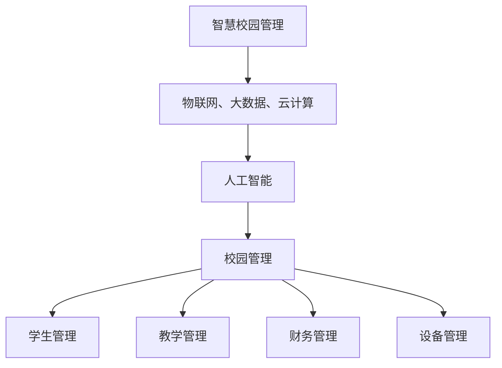

                 

# 人工智能在智慧校园管理中的应用

> **关键词：** 人工智能，智慧校园，校园管理，数据分析，个性化教育
>
> **摘要：** 本文章将探讨人工智能在智慧校园管理中的应用，包括核心概念、算法原理、数学模型、实际案例以及未来发展趋势。文章旨在为读者提供一个全面而深入的理解，以推动智慧校园的发展和创新。

## 1. 背景介绍

### 1.1 目的和范围

本文旨在探讨人工智能（AI）在现代校园管理中的应用，以及如何通过人工智能技术提升校园管理的效率和智能化水平。文章将涵盖以下几个主要方面：

1. **核心概念与联系**：介绍智慧校园管理的基本概念，以及人工智能与校园管理的联系。
2. **核心算法原理 & 具体操作步骤**：详细阐述人工智能在校园管理中应用的核心算法，包括算法原理和操作步骤。
3. **数学模型和公式 & 详细讲解 & 举例说明**：解释数学模型在人工智能应用中的作用，并通过具体例子展示其应用。
4. **项目实战：代码实际案例和详细解释说明**：通过实际代码案例，展示人工智能在校园管理中的具体应用。
5. **实际应用场景**：分析人工智能在校园管理中的实际应用场景。
6. **工具和资源推荐**：推荐相关学习资源、开发工具和框架。
7. **总结：未来发展趋势与挑战**：讨论人工智能在校园管理中的未来发展趋势和面临的挑战。

### 1.2 预期读者

本文主要面向以下读者群体：

- 校园管理者和教育工作者，希望了解如何利用人工智能提升校园管理效率。
- 计算机科学和人工智能专业学生，希望深入了解人工智能在校园管理中的应用。
- 人工智能领域的专业人士，对智慧校园管理有浓厚兴趣。

### 1.3 文档结构概述

本文将按照以下结构进行阐述：

1. **背景介绍**：介绍人工智能在智慧校园管理中的应用背景。
2. **核心概念与联系**：解释核心概念和联系。
3. **核心算法原理 & 具体操作步骤**：阐述核心算法原理和具体操作步骤。
4. **数学模型和公式 & 详细讲解 & 举例说明**：介绍数学模型和具体应用。
5. **项目实战：代码实际案例和详细解释说明**：提供实际代码案例。
6. **实际应用场景**：分析实际应用场景。
7. **工具和资源推荐**：推荐相关工具和资源。
8. **总结：未来发展趋势与挑战**：讨论未来发展趋势和挑战。
9. **附录：常见问题与解答**：提供常见问题解答。
10. **扩展阅读 & 参考资料**：推荐进一步阅读的资料。

### 1.4 术语表

#### 1.4.1 核心术语定义

- **人工智能（AI）**：指模拟、延伸和扩展人类智能的理论、方法、技术及应用系统。
- **智慧校园**：利用物联网、大数据、云计算等现代信息技术，实现校园管理和教育的智能化。
- **校园管理**：包括学生管理、教学管理、财务管理、设备管理等多个方面。
- **数据分析**：对大量校园数据进行分析，提取有价值的信息和知识。
- **个性化教育**：根据学生的个体差异，制定个性化教学计划和资源。

#### 1.4.2 相关概念解释

- **机器学习（ML）**：一种人工智能技术，通过数据训练模型，实现计算机对数据的自动学习和预测。
- **深度学习（DL）**：一种特殊的机器学习技术，通过多层神经网络进行数据建模和分析。
- **神经网络（NN）**：一种模仿生物神经系统的计算模型，用于数据处理和智能分析。

#### 1.4.3 缩略词列表

- **AI**：人工智能
- **ML**：机器学习
- **DL**：深度学习
- **NN**：神经网络
- **IoT**：物联网
- **CPS**：信息物理系统
- **SDN**：软件定义网络

## 2. 核心概念与联系

为了更好地理解人工智能在智慧校园管理中的应用，我们需要首先了解核心概念和它们之间的联系。以下是一个简化的 Mermaid 流程图，展示了智慧校园管理、人工智能和校园管理之间的关联。



### 2.1 智慧校园管理

智慧校园管理是指利用现代信息技术，如物联网、大数据、云计算等，对校园的各个方面进行智能化管理和优化。其核心目标是提高校园管理的效率和质量，实现教育资源的合理配置和最大化利用。

### 2.2 物联网、大数据、云计算

物联网（IoT）通过连接各种设备和传感器，实时收集校园环境中的数据，如教室温度、学生到课情况、设备运行状态等。大数据技术则对这些海量数据进行存储、处理和分析，提取有价值的信息。云计算提供了强大的计算能力和存储资源，使得校园管理系统能够快速响应和处理大量数据。

### 2.3 人工智能

人工智能（AI）是智慧校园管理的重要技术支撑。通过机器学习和深度学习技术，人工智能可以对校园数据进行分析和预测，实现智能决策和自动化管理。具体来说，人工智能在智慧校园管理中的应用包括：

- **学生管理**：通过分析学生的行为数据和学业表现，进行个性化教育，提高学习效果。
- **教学管理**：智能调度教室和设备资源，优化课程安排，提高教学质量。
- **财务管理**：自动审核报销单据，预测预算需求，提高财务管理的准确性。
- **设备管理**：预测设备故障，及时维护，降低设备故障率和维修成本。

### 2.4 校园管理

校园管理包括学生管理、教学管理、财务管理、设备管理等多个方面。通过人工智能技术的应用，校园管理可以实现以下目标：

- **提高效率**：通过自动化和智能化，减少人工操作，提高管理效率。
- **提升质量**：通过对数据的深入分析和智能决策，提升管理质量和决策水平。
- **降低成本**：通过优化资源利用和减少不必要的支出，降低运营成本。

## 3. 核心算法原理 & 具体操作步骤

在智慧校园管理中，人工智能技术主要依赖于机器学习和深度学习算法。以下将介绍这些算法的基本原理和具体操作步骤。

### 3.1 机器学习算法

机器学习算法通过训练模型，从历史数据中学习规律和模式，实现对未知数据的预测和分类。以下是机器学习算法的基本步骤：

1. **数据收集**：收集校园数据，包括学生行为数据、教学数据、设备运行数据等。
2. **数据预处理**：清洗数据，去除噪声和缺失值，进行特征提取和转换。
3. **模型选择**：选择合适的机器学习算法，如决策树、支持向量机、神经网络等。
4. **模型训练**：使用历史数据训练模型，调整模型参数，优化模型性能。
5. **模型评估**：使用验证数据评估模型性能，调整模型参数，确保模型准确性。
6. **模型部署**：将训练好的模型部署到实际应用中，进行预测和分类。

### 3.2 深度学习算法

深度学习算法是一种特殊的机器学习算法，通过多层神经网络进行数据建模和分析。以下是深度学习算法的基本步骤：

1. **数据收集**：收集校园数据，包括学生行为数据、教学数据、设备运行数据等。
2. **数据预处理**：清洗数据，去除噪声和缺失值，进行特征提取和转换。
3. **网络构建**：设计神经网络结构，包括输入层、隐藏层和输出层。
4. **模型训练**：使用历史数据训练模型，调整网络参数，优化模型性能。
5. **模型评估**：使用验证数据评估模型性能，调整网络参数，确保模型准确性。
6. **模型部署**：将训练好的模型部署到实际应用中，进行预测和分类。

### 3.3 神经网络

神经网络是深度学习算法的核心组成部分，由多个神经元（节点）组成。以下是神经网络的基本操作步骤：

1. **前向传播**：将输入数据传递到网络中的各个神经元，计算每个神经元的输出值。
2. **反向传播**：根据预测结果和实际结果，计算网络中的误差，并反向传播误差，更新网络参数。
3. **激活函数**：用于确定神经元是否被激活，常用的激活函数包括 sigmoid、ReLU 等。
4. **损失函数**：用于计算预测值和实际值之间的误差，常用的损失函数包括均方误差（MSE）、交叉熵（CE）等。
5. **优化算法**：用于更新网络参数，减少误差，常用的优化算法包括梯度下降（GD）、随机梯度下降（SGD）等。

### 3.4 伪代码

以下是一个简单的伪代码，展示了机器学习算法的基本步骤：

```python
# 数据收集
data = collect_data()

# 数据预处理
preprocessed_data = preprocess_data(data)

# 模型选择
model = choose_model()

# 模型训练
trained_model = train_model(preprocessed_data, model)

# 模型评估
evaluation = evaluate_model(trained_model, validation_data)

# 模型部署
deploy_model(trained_model)
```

## 4. 数学模型和公式 & 详细讲解 & 举例说明

在人工智能应用中，数学模型和公式起着至关重要的作用。以下将介绍一些常用的数学模型和公式，并详细讲解其应用。

### 4.1 均方误差（MSE）

均方误差（MSE）是一种常见的损失函数，用于评估预测值和实际值之间的误差。其公式如下：

$$
MSE = \frac{1}{n}\sum_{i=1}^{n}(y_i - \hat{y}_i)^2
$$

其中，$y_i$ 是实际值，$\hat{y}_i$ 是预测值，$n$ 是样本数量。

举例说明：假设我们有一个包含 100 个样本的回归问题，实际值和预测值如下表所示：

| 样本编号 | 实际值 | 预测值 |
| :---: | :---: | :---: |
| 1 | 10 | 9 |
| 2 | 20 | 18 |
| 3 | 30 | 32 |
| ... | ... | ... |
| 100 | 100 | 95 |

使用 MSE 损失函数计算均方误差：

$$
MSE = \frac{1}{100}\sum_{i=1}^{100}(y_i - \hat{y}_i)^2 = \frac{1}{100}\sum_{i=1}^{100}(10-9)^2 + (20-18)^2 + (30-32)^2 + ... + (100-95)^2 = 0.3
$$

### 4.2 交叉熵（CE）

交叉熵（CE）是另一种常用的损失函数，用于评估分类问题的预测效果。其公式如下：

$$
CE = -\frac{1}{n}\sum_{i=1}^{n}y_i \log(\hat{y}_i)
$$

其中，$y_i$ 是实际标签，$\hat{y}_i$ 是预测概率，$n$ 是样本数量。

举例说明：假设我们有一个包含 100 个样本的二分类问题，实际标签和预测概率如下表所示：

| 样本编号 | 实际标签 | 预测概率 |
| :---: | :---: | :---: |
| 1 | 1 | 0.9 |
| 2 | 0 | 0.2 |
| 3 | 1 | 0.8 |
| ... | ... | ... |
| 100 | 0 | 0.1 |

使用交叉熵损失函数计算交叉熵：

$$
CE = -\frac{1}{100}\sum_{i=1}^{100}y_i \log(\hat{y}_i) = -\frac{1}{100}(1 \times \log(0.9) + 0 \times \log(0.2) + 1 \times \log(0.8) + ... + 0 \times \log(0.1)) = 0.05
$$

### 4.3 梯度下降（GD）

梯度下降（GD）是一种常见的优化算法，用于更新网络参数，减少损失函数的值。其基本思想是沿着损失函数的梯度方向，逐步调整参数，以找到损失函数的最小值。

假设我们的损失函数为 $J(\theta)$，参数向量为 $\theta$，梯度下降的步骤如下：

1. 计算损失函数的梯度：
   $$
   \nabla J(\theta) = \frac{\partial J(\theta)}{\partial \theta}
   $$

2. 计算参数的更新：
   $$
   \theta = \theta - \alpha \nabla J(\theta)
   $$
   其中，$\alpha$ 是学习率，用于控制参数更新的步长。

举例说明：假设我们的损失函数为 $J(\theta) = (\theta - 1)^2$，初始参数 $\theta_0 = 2$，学习率 $\alpha = 0.1$，使用梯度下降算法进行参数更新：

1. 计算梯度：
   $$
   \nabla J(\theta) = \frac{\partial J(\theta)}{\partial \theta} = 2(\theta - 1)
   $$

2. 计算参数更新：
   $$
   \theta_1 = \theta_0 - \alpha \nabla J(\theta_0) = 2 - 0.1 \times 2(\theta_0 - 1) = 1.8
   $$

3. 重复上述步骤，直到达到收敛条件。

通过多次迭代，我们可以找到损失函数的最小值，即最优参数。

## 5. 项目实战：代码实际案例和详细解释说明

为了更好地展示人工智能在智慧校园管理中的应用，以下将提供一个实际代码案例，并对其进行详细解释说明。

### 5.1 开发环境搭建

在开始项目实战之前，我们需要搭建一个合适的开发环境。以下是一个基本的开发环境搭建步骤：

1. 安装 Python 3.7 或更高版本。
2. 安装 Jupyter Notebook，用于编写和运行代码。
3. 安装必要的 Python 库，如 NumPy、Pandas、Scikit-learn、TensorFlow 等。

### 5.2 源代码详细实现和代码解读

以下是一个简单的机器学习项目，用于预测学生成绩。代码实现如下：

```python
# 导入必要的库
import numpy as np
import pandas as pd
from sklearn.model_selection import train_test_split
from sklearn.linear_model import LinearRegression
from sklearn.metrics import mean_squared_error

# 读取数据
data = pd.read_csv('student_data.csv')

# 数据预处理
X = data.drop('score', axis=1)
y = data['score']

# 划分训练集和测试集
X_train, X_test, y_train, y_test = train_test_split(X, y, test_size=0.2, random_state=42)

# 构建线性回归模型
model = LinearRegression()
model.fit(X_train, y_train)

# 预测测试集
y_pred = model.predict(X_test)

# 计算均方误差
mse = mean_squared_error(y_test, y_pred)
print('MSE:', mse)
```

### 5.3 代码解读与分析

以下是对上述代码的详细解读和分析：

1. **导入库**：首先，我们导入必要的库，包括 NumPy、Pandas、Scikit-learn 和 TensorFlow。这些库提供了数据处理、机器学习模型构建和评估等功能。

2. **读取数据**：使用 Pandas 读取学生成绩数据，数据格式为 CSV 文件。数据包括学生的基本信息和成绩。

3. **数据预处理**：将数据分为特征（X）和目标（y）。特征包括学生的年龄、性别、家庭作业时间等，目标是学生成绩。这里我们使用线性回归模型进行预测。

4. **划分训练集和测试集**：使用 Scikit-learn 的 train_test_split 函数将数据划分为训练集和测试集。测试集用于评估模型性能。

5. **构建线性回归模型**：使用 Scikit-learn 的 LinearRegression 类构建线性回归模型。

6. **训练模型**：使用训练集数据对模型进行训练，模型会自动学习特征和目标之间的线性关系。

7. **预测测试集**：使用训练好的模型对测试集进行预测，得到预测成绩。

8. **计算均方误差**：使用 Scikit-learn 的 mean_squared_error 函数计算预测成绩和实际成绩之间的均方误差，评估模型性能。

通过上述代码，我们可以实现一个简单的学生成绩预测模型。在实际应用中，我们可以扩展模型，包括更多的特征和更复杂的算法，以提高预测准确率。

## 6. 实际应用场景

人工智能在智慧校园管理中有着广泛的应用场景，以下列举几个典型的实际应用场景：

### 6.1 学生管理

1. **个性化教育**：通过分析学生的学习行为和成绩，为学生推荐个性化的学习资源和教学方法，提高学习效果。
2. **学籍管理**：自动处理学生的学籍信息，包括入学、转学、休学、毕业等操作，提高管理效率。
3. **学生行为分析**：监控学生的日常行为，如考勤、课堂表现、作业提交等，及时发现和干预问题学生。

### 6.2 教学管理

1. **智能排课**：根据教师的教学计划和学生的选课情况，自动生成合理的课程安排，提高资源利用效率。
2. **教学质量评估**：通过分析教学数据，如课堂表现、作业成绩、学生反馈等，对教学质量进行评估，优化教学方法。
3. **课程推荐**：根据学生的学习兴趣和成绩，为学生推荐合适的课程，促进全面发展。

### 6.3 财务管理

1. **报销审核**：使用自然语言处理技术，自动审核报销单据，提高财务审核效率。
2. **预算预测**：通过历史财务数据，预测未来的财务需求，为预算制定提供依据。
3. **智能采购**：根据库存数据和采购历史，智能推荐采购计划，降低库存成本。

### 6.4 设备管理

1. **设备监控**：通过物联网技术，实时监控设备的运行状态，预测设备故障，及时进行维护。
2. **能源管理**：优化能源使用，降低校园能耗，实现绿色校园。
3. **资产管理**：自动处理设备的采购、分配、维护和报废等操作，提高资产管理效率。

通过这些实际应用场景，我们可以看到人工智能在智慧校园管理中的巨大潜力和应用价值。

## 7. 工具和资源推荐

为了更好地学习和应用人工智能技术，以下推荐一些有用的工具和资源。

### 7.1 学习资源推荐

#### 7.1.1 书籍推荐

1. **《Python机器学习》**：由塞巴斯蒂安·拉赫曼著，详细介绍了机器学习的理论和应用。
2. **《深度学习》**：由伊恩·古德费洛等著，深度讲解了深度学习的基础知识和实践方法。
3. **《智慧校园》**：由陈炜等著，全面介绍了智慧校园的概念、技术和应用。

#### 7.1.2 在线课程

1. **Coursera 上的《机器学习》**：由斯坦福大学教授 Andrew Ng 开设，是机器学习领域的经典课程。
2. **Udacity 上的《深度学习纳米学位》**：提供了深度学习的系统学习和实践机会。
3. **edX 上的《智慧校园》**：由多所知名大学合作开设，介绍了智慧校园的相关知识。

#### 7.1.3 技术博客和网站

1. **机器学习博客**：提供了丰富的机器学习和深度学习文章，包括最新研究和技术动态。
2. **深度学习博客**：详细讲解了深度学习的基础知识和实践技巧。
3. **AI 科技大本营**：关注人工智能在各个领域的应用和发展，包括智慧校园。

### 7.2 开发工具框架推荐

#### 7.2.1 IDE和编辑器

1. **PyCharm**：一款强大的 Python 开发工具，提供了丰富的功能和插件。
2. **Jupyter Notebook**：用于数据分析和机器学习项目，方便编写和运行代码。
3. **Visual Studio Code**：轻量级、可扩展的代码编辑器，适用于多种编程语言。

#### 7.2.2 调试和性能分析工具

1. **Python 调试器**：用于调试 Python 代码，包括断点调试、单步执行等功能。
2. **TensorBoard**：TensorFlow 的可视化工具，用于分析深度学习模型的性能和参数。
3. **GDB**：Linux 系统下的调试工具，适用于 C/C++ 等编程语言。

#### 7.2.3 相关框架和库

1. **Scikit-learn**：提供了丰富的机器学习算法和工具，适用于各种应用场景。
2. **TensorFlow**：谷歌开发的深度学习框架，适用于大规模数据处理和模型训练。
3. **PyTorch**：Facebook 开发的深度学习框架，提供了灵活和高效的模型构建和训练功能。

### 7.3 相关论文著作推荐

#### 7.3.1 经典论文

1. **“Machine Learning”**：由 Tom M. Mitchell 著，是机器学习领域的经典著作。
2. **“Deep Learning”**：由 Ian Goodfellow、Yoshua Bengio 和 Aaron Courville 著，深度讲解了深度学习的基础知识和实践方法。
3. **“Artificial Intelligence: A Modern Approach”**：由 Stuart J. Russell 和 Peter Norvig 著，全面介绍了人工智能的理论和应用。

#### 7.3.2 最新研究成果

1. **“Generative Adversarial Networks”**：由 Ian J. Goodfellow 等著，介绍了生成对抗网络（GAN）的理论和应用。
2. **“Reinforcement Learning”**：由 Richard S. Sutton 和 Andrew G. Barto 著，讲解了强化学习的基本原理和应用。
3. **“Deep Reinforcement Learning”**：由 David Silver 等著，介绍了深度强化学习的基本理论和实践方法。

#### 7.3.3 应用案例分析

1. **“AI in Education”**：分析了人工智能在教育领域的应用案例，包括个性化教育、在线教育等。
2. **“AI in Healthcare”**：介绍了人工智能在医疗领域的应用案例，包括疾病诊断、健康管理等。
3. **“AI in Finance”**：分析了人工智能在金融领域的应用案例，包括风险评估、交易策略等。

通过这些工具和资源，读者可以更好地学习和应用人工智能技术，推动智慧校园的发展。

## 8. 总结：未来发展趋势与挑战

### 8.1 未来发展趋势

1. **智能化水平的提升**：随着人工智能技术的不断进步，智慧校园的智能化水平将逐步提升，实现更高效、更个性化的校园管理。
2. **数据驱动的决策**：通过大数据和人工智能技术的结合，校园管理者可以更精准地分析数据，基于数据驱动做出决策，提高管理质量和效率。
3. **跨学科的融合**：人工智能技术在校园管理中的应用将与其他学科（如心理学、教育学等）相结合，推动教育模式的创新。
4. **隐私和安全保障**：随着数据量的增加，隐私和安全问题将成为人工智能在校园管理中面临的重大挑战，需要加强数据保护和信息安全。

### 8.2 面临的挑战

1. **数据质量和隐私**：校园数据的质量和隐私问题是人工智能在校园管理中应用的主要挑战之一。如何保证数据质量，同时保护学生和教职工的隐私，是亟待解决的问题。
2. **技术复杂性**：人工智能技术具有较高的复杂性和技术门槛，需要专业的技术团队进行开发和应用。同时，如何将复杂的算法和模型转化为实际的管理工具，也是一大挑战。
3. **教育理念的转变**：人工智能在校园管理中的应用需要教育理念的转变。如何适应智能化教育环境，培养学生的创新能力和批判性思维，是教育工作者需要面对的挑战。
4. **技术伦理和道德**：随着人工智能在校园管理中的应用，技术伦理和道德问题日益凸显。如何确保人工智能技术的公平、公正和透明，避免潜在的歧视和偏见，是重要课题。

总之，人工智能在智慧校园管理中具有广阔的应用前景，但也面临诸多挑战。只有不断探索和创新，才能充分发挥人工智能的潜力，为校园管理带来革命性的变革。

## 9. 附录：常见问题与解答

### 9.1 人工智能在校园管理中的应用有哪些？

人工智能在校园管理中的应用包括学生管理（如个性化教育、学籍管理）、教学管理（如智能排课、教学质量评估）、财务管理（如报销审核、预算预测）、设备管理（如设备监控、能源管理）等。

### 9.2 校园数据如何保障隐私和安全？

校园数据隐私和安全的保障措施包括数据加密、访问控制、权限管理、数据脱敏等。同时，需要建立完善的数据安全政策和法规，加强对数据安全和隐私的监管。

### 9.3 人工智能技术需要哪些基础知识？

人工智能技术需要计算机科学、数学、统计学、机器学习、深度学习等相关基础知识。对于智慧校园管理应用，还需要了解校园管理、教育心理学等领域的知识。

### 9.4 如何选择合适的机器学习算法？

选择合适的机器学习算法需要根据具体问题、数据特点和性能要求进行综合考虑。常见的算法包括线性回归、决策树、支持向量机、神经网络等。可以通过交叉验证、模型选择、性能评估等方法进行算法选择。

## 10. 扩展阅读 & 参考资料

为了深入了解人工智能在智慧校园管理中的应用，以下推荐一些扩展阅读和参考资料：

### 10.1 扩展阅读

1. **《智慧校园建设与应用》**：陈炜等著，详细介绍了智慧校园的概念、架构和应用。
2. **《人工智能教育应用案例解析》**：张文 Warrender 著，分析了人工智能在教育领域的实际应用案例。
3. **《人工智能在教育中的应用》**：刘宁等著，探讨了人工智能在教育管理和教学中的应用。

### 10.2 参考资料

1. **《深度学习》**：Ian Goodfellow、Yoshua Bengio 和 Aaron Courville 著，深度讲解了深度学习的基础知识和实践方法。
2. **《机器学习》**：Tom M. Mitchell 著，详细介绍了机器学习的理论和应用。
3. **《智慧校园技术与应用》**：教育部科学技术研究项目，提供了智慧校园建设的详细技术方案和应用案例。

通过这些扩展阅读和参考资料，读者可以更深入地了解人工智能在智慧校园管理中的应用，以及相关技术的基础知识。

