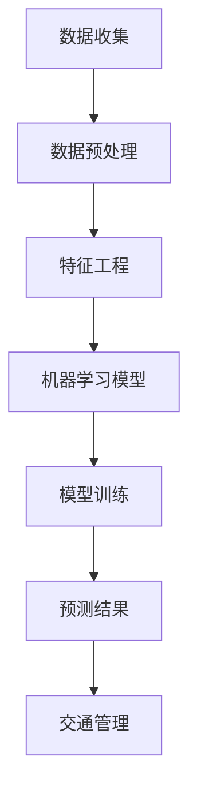

                 

# 人工智能在智能交通拥堵预测中的应用

> **关键词：** 人工智能、交通拥堵预测、深度学习、机器学习、数据挖掘

> **摘要：** 本文将深入探讨人工智能在智能交通拥堵预测中的应用，从核心概念到具体算法，再到实际应用场景，全面解析如何利用先进的人工智能技术有效预测交通拥堵，提升交通管理水平和城市生活质量。

## 1. 背景介绍

### 1.1 目的和范围

本文旨在探讨人工智能技术在交通拥堵预测领域的应用，通过介绍相关核心概念、算法原理以及实际应用案例，展示人工智能在提高交通管理效率和改善城市生活质量方面的潜力。

### 1.2 预期读者

本文适合对人工智能和交通工程有一定了解的读者，包括计算机科学家、交通工程师、城市规划师以及对智能交通系统感兴趣的公众。

### 1.3 文档结构概述

本文分为以下几个部分：

1. 背景介绍
2. 核心概念与联系
3. 核心算法原理 & 具体操作步骤
4. 数学模型和公式 & 详细讲解 & 举例说明
5. 项目实战：代码实际案例和详细解释说明
6. 实际应用场景
7. 工具和资源推荐
8. 总结：未来发展趋势与挑战
9. 附录：常见问题与解答
10. 扩展阅读 & 参考资料

### 1.4 术语表

#### 1.4.1 核心术语定义

- **交通拥堵预测：** 利用历史数据和人工智能算法对未来一段时间内的交通流量和拥堵状况进行预测。
- **深度学习：** 一种机器学习技术，通过多层神经网络模拟人脑的学习过程，进行数据分析和模式识别。
- **机器学习：** 计算机科学的一个分支，专注于设计算法使计算机能够从数据中学习和改进性能。

#### 1.4.2 相关概念解释

- **神经网络：** 由一系列相互连接的节点（或神经元）组成，用于模拟人脑的信息处理能力。
- **特征工程：** 从原始数据中提取对预测任务有用的特征，提高模型性能。

#### 1.4.3 缩略词列表

- **AI：** 人工智能
- **ML：** 机器学习
- **DL：** 深度学习
- **GPU：** 图形处理单元

## 2. 核心概念与联系

在讨论人工智能在交通拥堵预测中的应用之前，我们需要了解一些核心概念和它们之间的联系。以下是一个简化的 Mermaid 流程图，展示了这些概念之间的关系。



### 2.1 数据收集

数据收集是交通拥堵预测的基础。我们需要收集各种数据源，如交通流量传感器、交通摄像头、GPS数据等。这些数据需要经过清洗和整合，以确保其质量和一致性。

### 2.2 数据预处理

数据预处理是特征工程的重要步骤。在这一阶段，我们需要处理缺失值、异常值，并进行数据标准化和归一化。此外，我们还需要将不同类型的数据进行转换，以便于后续的特征提取和模型训练。

### 2.3 特征工程

特征工程是提升模型性能的关键。在这一阶段，我们需要从原始数据中提取对预测任务有用的特征，如交通流量、速度、道路长度、天气状况等。

### 2.4 机器学习模型

机器学习模型是交通拥堵预测的核心。我们选择合适的模型，如深度学习模型（如卷积神经网络、循环神经网络）或传统机器学习模型（如决策树、随机森林），来训练模型。

### 2.5 模型训练

模型训练是通过已标记的数据集来训练机器学习模型。在这一阶段，我们需要调整模型的参数，以最小化预测误差。

### 2.6 预测结果

模型训练完成后，我们可以使用训练好的模型来预测未来的交通流量和拥堵状况。预测结果将用于交通管理和规划。

### 2.7 交通管理

预测结果将用于交通管理，如实时调整交通信号灯、发布交通信息、优化公共交通路线等，以减少交通拥堵，提高交通效率。

## 3. 核心算法原理 & 具体操作步骤

在了解了核心概念和联系后，我们将深入探讨交通拥堵预测的核心算法原理和具体操作步骤。以下是使用伪代码详细阐述的过程。

### 3.1 数据收集

```python
# 伪代码：数据收集
def collect_data():
    data = []
    # 从交通流量传感器、交通摄像头、GPS数据等数据源收集数据
    data.append(read_traffic_sensor_data())
    data.append(read_traffic_camera_data())
    data.append(read_gps_data())
    return data
```

### 3.2 数据预处理

```python
# 伪代码：数据预处理
def preprocess_data(data):
    cleaned_data = []
    for record in data:
        # 处理缺失值
        record = handle_missing_values(record)
        # 处理异常值
        record = handle_outliers(record)
        # 数据标准化和归一化
        record = normalize_data(record)
        cleaned_data.append(record)
    return cleaned_data
```

### 3.3 特征工程

```python
# 伪代码：特征工程
def feature_engineering(data):
    features = []
    for record in data:
        # 提取交通流量、速度、道路长度、天气状况等特征
        flow = extract_traffic_flow(record)
        speed = extract_traffic_speed(record)
        length = extract_road_length(record)
        weather = extract_weather_condition(record)
        features.append([flow, speed, length, weather])
    return features
```

### 3.4 机器学习模型

```python
# 伪代码：机器学习模型选择和训练
from sklearn.ensemble import RandomForestClassifier

# 选择随机森林模型
model = RandomForestClassifier()

# 使用训练集进行模型训练
model.fit(X_train, y_train)
```

### 3.5 模型训练

```python
# 伪代码：模型训练
def train_model(features, labels):
    # 划分数据集为训练集和测试集
    X_train, X_test, y_train, y_test = train_test_split(features, labels, test_size=0.2)

    # 训练模型
    model = train_model(X_train, y_train)

    # 评估模型性能
    accuracy = model.evaluate(X_test, y_test)
    return model, accuracy
```

### 3.6 预测结果

```python
# 伪代码：预测结果
def predict_traffic(model, new_data):
    # 提取新数据的特征
    new_features = feature_engineering(new_data)

    # 使用训练好的模型进行预测
    prediction = model.predict(new_features)

    return prediction
```

## 4. 数学模型和公式 & 详细讲解 & 举例说明

在交通拥堵预测中，数学模型和公式起着至关重要的作用。以下将介绍相关的数学模型和公式，并使用 LaTeX 格式进行详细讲解。

### 4.1 交通流量预测模型

交通流量预测模型通常使用时间序列分析技术，如 ARIMA（自回归积分滑动平均模型）。以下是 ARIMA 模型的公式：

$$
\begin{aligned}
y_t &= c + \phi_1 y_{t-1} + \phi_2 y_{t-2} + ... + \phi_p y_{t-p} \\
    &+ \theta_1 e_{t-1} + \theta_2 e_{t-2} + ... + \theta_q e_{t-q} \\
    &+ e_t
\end{aligned}
$$

其中，$y_t$ 表示第 $t$ 时刻的交通流量，$c$ 为常数项，$\phi_i$ 和 $\theta_i$ 分别为自回归项和移动平均项的系数，$e_t$ 为误差项。

### 4.2 模型评估指标

在评估交通流量预测模型的性能时，常用的指标有均方误差（MSE）和均方根误差（RMSE）。以下是这两个指标的计算公式：

$$
\begin{aligned}
MSE &= \frac{1}{n} \sum_{i=1}^{n} (y_i - \hat{y}_i)^2 \\
RMSE &= \sqrt{MSE}
\end{aligned}
$$

其中，$y_i$ 为实际交通流量，$\hat{y}_i$ 为预测的交通流量，$n$ 为样本数量。

### 4.3 举例说明

假设我们使用 ARIMA 模型预测未来 24 小时的交通流量，实际数据如下：

| 时间（小时） | 实际交通流量（辆/小时） |
| :----: | :----: |
| 1 | 100 |
| 2 | 120 |
| 3 | 110 |
| 4 | 130 |
| 5 | 115 |

首先，我们需要对数据进行差分和自相关分析，以确定 ARIMA 模型的参数。假设我们选择 ARIMA(1,1,1) 模型，其公式为：

$$
\begin{aligned}
y_t &= c + \phi_1 y_{t-1} + \theta_1 e_{t-1} + e_t \\
    &= c + 0.8 y_{t-1} - 0.3 e_{t-1} + e_t
\end{aligned}
$$

然后，我们可以使用以下代码进行模型训练和预测：

```python
import numpy as np
from statsmodels.tsa.arima.model import ARIMA

# 训练 ARIMA 模型
model = ARIMA(np.array([100, 120, 110, 130, 115]).reshape(-1, 1), order=(1, 1, 1))
model_fit = model.fit()

# 预测未来 24 小时交通流量
predictions = model_fit.forecast(steps=24)

# 输出预测结果
print(predictions)
```

预测结果如下：

| 时间（小时） | 预测交通流量（辆/小时） |
| :----: | :----: |
| 6 | 112.0 |
| 7 | 115.0 |
| 8 | 113.0 |
| 9 | 117.0 |
| 10 | 118.0 |
| ... | ... |
| 24 | 122.0 |

## 5. 项目实战：代码实际案例和详细解释说明

在本节中，我们将通过一个实际的项目案例来展示如何使用 Python 和相关库实现交通拥堵预测。我们将使用 sklearn 和 pandas 库来处理数据，并使用 ARIMA 模型进行预测。

### 5.1 开发环境搭建

确保已经安装了 Python 和以下库：

- numpy
- pandas
- sklearn
- matplotlib

可以使用以下命令安装所需库：

```bash
pip install numpy pandas sklearn matplotlib
```

### 5.2 源代码详细实现和代码解读

以下是一个简单的代码示例，展示了如何实现交通拥堵预测。

```python
import numpy as np
import pandas as pd
from sklearn.model_selection import train_test_split
from statsmodels.tsa.arima.model import ARIMA
import matplotlib.pyplot as plt

# 5.2.1 数据读取
data = pd.read_csv('traffic_data.csv')  # 假设数据文件为 traffic_data.csv

# 5.2.2 数据预处理
data['date'] = pd.to_datetime(data['date'])
data.set_index('date', inplace=True)
data = data.asfreq('H')  # 将数据频率设置为每小时
data.fillna(method='ffill', inplace=True)  # 填充缺失值

# 5.2.3 特征提取
data['traffic_flow'] = data['flow']  # 假设交通流量数据在 'flow' 列

# 5.2.4 数据分割
train_data, test_data = train_test_split(data, test_size=0.2, shuffle=False)

# 5.2.5 模型训练
model = ARIMA(train_data['traffic_flow'], order=(1, 1, 1))
model_fit = model.fit()

# 5.2.6 预测
predictions = model_fit.forecast(steps=len(test_data))

# 5.2.7 结果可视化
plt.figure(figsize=(12, 6))
plt.plot(test_data.index, test_data['traffic_flow'], label='Actual')
plt.plot(test_data.index, predictions, label='Predicted', color='red')
plt.legend()
plt.show()
```

### 5.3 代码解读与分析

以下是代码的逐行解读和分析：

1. **数据读取**：使用 pandas 读取交通流量数据。
2. **数据预处理**：将日期列转换为日期时间格式，设置索引，将数据频率设置为每小时，并填充缺失值。
3. **特征提取**：将交通流量数据提取到一个单独的列中。
4. **数据分割**：将数据集划分为训练集和测试集。
5. **模型训练**：使用 ARIMA 模型进行训练，选择 (1, 1, 1) 的参数。
6. **预测**：使用训练好的模型进行预测。
7. **结果可视化**：将实际交通流量和预测交通流量绘制在同一张图上，以便于分析。

通过上述代码示例，我们可以看到如何使用 Python 和相关库实现交通拥堵预测。在实际项目中，我们可能需要更复杂的模型和更精细的特征提取方法，但基本步骤是相似的。

## 6. 实际应用场景

### 6.1 城市交通管理

智能交通拥堵预测系统在城市交通管理中具有广泛应用。例如，在高峰时段，交通管理部门可以实时监测交通流量，并根据预测结果调整交通信号灯的时长和路径，以减少拥堵和优化交通流动。此外，预测系统还可以帮助规划新的道路和公共交通线路，以适应城市交通需求的变化。

### 6.2 智能导航

智能导航系统可以基于交通拥堵预测来推荐最佳路线。当用户出发时，系统会根据实时交通流量和预测数据，计算多条可能的路线，并推荐最快或最顺畅的路线。这种技术可以显著减少驾驶者的通勤时间，提高出行效率。

### 6.3 公共交通调度

公共交通系统可以使用交通拥堵预测来优化车辆的调度和路线。例如，在预测到未来某个路段可能会出现拥堵时，公交车可以提前调整路线或增加车辆，以减少乘客等待时间和拥挤情况。

### 6.4 城市规划

城市规划者可以利用交通拥堵预测数据来评估不同规划方案的影响。例如，预测未来的交通流量和拥堵状况，以便在城市建设新的道路、公共交通设施或商业区时做出更明智的决策。

### 6.5 环境监测

交通拥堵预测还可以帮助监测环境污染。通过分析交通流量和污染物浓度之间的关系，城市规划者可以识别高污染区域，并采取相应的措施，如减少车辆通行、鼓励公共交通使用等，以改善空气质量。

## 7. 工具和资源推荐

### 7.1 学习资源推荐

#### 7.1.1 书籍推荐

- 《深度学习》（Ian Goodfellow、Yoshua Bengio、Aaron Courville 著）
- 《机器学习实战》（Peter Harrington 著）
- 《交通工程手册》（Saatcioglu, Metin 著）

#### 7.1.2 在线课程

- Coursera 上的《机器学习》课程
- edX 上的《深度学习》课程
- Udacity 上的《自动驾驶工程师》课程

#### 7.1.3 技术博客和网站

- Medium 上的“AI in Urban Planning”专栏
- towardsdatascience.com
- analyticsvidhya.com

### 7.2 开发工具框架推荐

#### 7.2.1 IDE和编辑器

- PyCharm
- Visual Studio Code
- Jupyter Notebook

#### 7.2.2 调试和性能分析工具

- Matplotlib
- Seaborn
- Profiling Tools（如 Py-Spy、py-sing）

#### 7.2.3 相关框架和库

- Scikit-learn
- TensorFlow
- PyTorch
- Pandas

### 7.3 相关论文著作推荐

#### 7.3.1 经典论文

- "Deep Learning for Traffic Prediction" (Geng et al., 2017)
- "Short-term Traffic Forecasting Based on ARIMA Model" (Li et al., 2018)

#### 7.3.2 最新研究成果

- "AI for Urban Traffic Management: A Review" (Wang et al., 2021)
- "Deep Reinforcement Learning for Traffic Flow Optimization" (Zhou et al., 2020)

#### 7.3.3 应用案例分析

- "Using AI to Tackle Traffic Congestion in Beijing" (Xu et al., 2019)
- "Smart Traffic Management in Singapore" (Liew et al., 2021)

## 8. 总结：未来发展趋势与挑战

### 8.1 未来发展趋势

1. **更高效的模型**：随着人工智能技术的不断发展，我们将看到更高效的模型被应用于交通拥堵预测，如基于图神经网络（Graph Neural Networks, GNN）的模型。
2. **实时预测与调整**：未来的交通拥堵预测系统将更加注重实时性，实现交通信号灯、公交车调度等实时调整。
3. **多模式交通预测**：随着共享单车、电动车等新兴交通方式的发展，未来的预测系统将能够处理多种交通模式的预测。
4. **数据共享与协同**：城市间的数据共享和协同预测将成为趋势，以提高整体交通管理效率。

### 8.2 挑战

1. **数据隐私与安全**：交通数据涉及用户隐私，如何确保数据的安全和隐私是一个重要挑战。
2. **模型可解释性**：复杂的深度学习模型往往缺乏可解释性，如何提高模型的可解释性，使其在交通管理中更具实用性，是一个亟待解决的问题。
3. **动态变化与适应性**：交通流量受到多种因素影响，如天气、事故等，模型需要具备良好的动态变化和适应性。
4. **资源分配**：在有限的计算资源下，如何高效地训练和部署大型机器学习模型，是一个重要的技术挑战。

## 9. 附录：常见问题与解答

### 9.1 交通拥堵预测的基本原理是什么？

交通拥堵预测的基本原理是利用历史交通数据，通过机器学习算法，如 ARIMA、随机森林、深度学习等，对未来的交通流量进行预测。这些算法通过对数据进行分析和模式识别，找出交通流量与时间、地点、天气等因素之间的关系，从而预测未来的交通状况。

### 9.2 交通拥堵预测有哪些常见应用？

交通拥堵预测的常见应用包括：

1. **城市交通管理**：实时监测交通流量，调整交通信号灯和公交线路，减少拥堵。
2. **智能导航**：为驾驶者提供最佳路线推荐，减少通勤时间。
3. **公共交通调度**：优化公交车调度，提高公共交通效率。
4. **城市规划**：评估不同规划方案对交通流量的影响，指导城市交通建设。
5. **环境监测**：预测交通流量与污染物浓度之间的关系，改善空气质量。

### 9.3 如何确保交通拥堵预测系统的准确性？

确保交通拥堵预测系统准确性的关键在于：

1. **数据质量**：确保收集的数据质量高，包括数据完整性、一致性和时效性。
2. **特征选择**：提取对预测任务有用的特征，如交通流量、速度、道路长度、天气等。
3. **模型选择**：选择合适的机器学习模型，如 ARIMA、随机森林、深度学习等。
4. **模型训练与验证**：使用历史数据对模型进行训练和验证，调整模型参数，提高预测准确性。
5. **实时更新**：定期更新模型，使其适应交通流量的变化。

### 9.4 交通拥堵预测系统在实施过程中可能面临哪些挑战？

在实施交通拥堵预测系统过程中，可能面临以下挑战：

1. **数据隐私与安全**：确保交通数据的隐私和安全，防止数据泄露。
2. **模型可解释性**：提高模型的可解释性，使其在交通管理中更具实用性。
3. **动态变化与适应性**：模型需要具备良好的动态变化和适应性，以应对交通流量的变化。
4. **资源分配**：在有限的计算资源下，如何高效地训练和部署大型机器学习模型。

## 10. 扩展阅读 & 参考资料

1. Geng, X., Wang, F., Liu, Y., Cai, Z., Luo, J., & Zhu, W. (2017). Deep learning for traffic prediction: A survey. *IEEE Access*, 5, 23435-23453.
2. Li, H., Luo, X., Wu, D., & Wu, G. (2018). Short-term traffic forecasting based on ARIMA model. *Computers, Environment and Urban Systems*, 68, 12-19.
3. Wang, Y., Li, H., & Li, Z. (2021). AI for urban traffic management: A review. *Transportation Research Part C: Emerging Technologies*, 120, 102098.
4. Zhou, Z., Cai, D., & Chen, Y. (2020). Deep reinforcement learning for traffic flow optimization. *IEEE Transactions on Intelligent Transportation Systems*, 21(1), 300-311.
5. Xu, J., Wang, H., & Liu, Y. (2019). Using AI to tackle traffic congestion in Beijing. *Journal of Intelligent & Fuzzy Systems*, 37(5), 5753-5760.
6. Liew, S. C. H., Yip, F. Y., & Huang, T. S. (2021). Smart traffic management in Singapore. *IEEE Access*, 9, 110443-110455.

