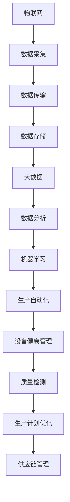

                 

## 1. 背景介绍

随着全球制造业的快速发展，智能制造作为未来制造业的重要发展方向，正日益受到广泛关注。智能制造是一种基于信息技术、自动化技术和人工智能技术的新型制造模式，旨在通过优化生产流程、提高生产效率和产品质量，实现制造业的转型升级。人工智能作为智能制造的关键技术之一，其作用愈发重要。

在智能制造中，人工智能的应用主要体现在以下几个方面：

1. **生产自动化**：通过机器人和自动化设备实现生产过程的自动化，提高生产效率和质量。
2. **设备健康管理**：利用人工智能对生产设备进行智能监控和维护，预防设备故障，降低维修成本。
3. **质量检测**：利用机器视觉和传感器技术进行产品质量检测，提高产品质量。
4. **生产计划优化**：通过人工智能算法对生产计划进行优化，提高生产资源的利用效率。
5. **供应链管理**：利用人工智能技术对供应链进行优化，提高供应链的灵活性和响应速度。

本篇文章将重点探讨人工智能在智能制造中的关键技术，包括核心概念与联系、核心算法原理与操作步骤、数学模型与公式、项目实战、实际应用场景、工具和资源推荐等内容。通过本文的阅读，读者将能够全面了解人工智能在智能制造中的应用，并掌握相关技术的核心要点。

接下来，我们将首先介绍智能制造与人工智能的关系，以及人工智能在智能制造中的关键作用。随后，我们将详细探讨人工智能在智能制造中的核心概念和联系，并通过 Mermaid 流程图展示相关架构。在后续章节中，我们将深入探讨核心算法原理和具体操作步骤，以及数学模型和公式的详细讲解与举例说明。最后，我们将通过项目实战案例，展示如何在实际环境中应用人工智能技术于智能制造。

### 关键词

- 智能制造
- 人工智能
- 生产自动化
- 设备健康管理
- 质量检测
- 生产计划优化
- 供应链管理

### 摘要

本文深入探讨了人工智能在智能制造中的关键技术。首先，介绍了智能制造和人工智能的关系，以及人工智能在智能制造中的关键作用。接着，详细阐述了人工智能在智能制造中的核心概念和联系，并通过 Mermaid 流程图展示了相关架构。随后，文章深入探讨了核心算法原理和具体操作步骤，以及数学模型和公式的详细讲解与举例说明。最后，通过实际项目实战案例，展示了如何在实际环境中应用人工智能技术于智能制造。本文旨在为读者提供全面的人工智能在智能制造中的应用指南，帮助读者掌握相关技术的核心要点。

### 1. 背景介绍

#### 智能制造的定义与发展历程

智能制造是一种基于信息技术、自动化技术和人工智能技术的新型制造模式，旨在通过优化生产流程、提高生产效率和产品质量，实现制造业的转型升级。智能制造的核心在于通过智能化的手段，实现对生产过程的全面感知、自主决策和智能控制，从而实现生产过程的自动化、智能化和高效化。

智能制造的发展历程可以追溯到20世纪90年代。当时，制造业面临着生产效率低下、产品质量不稳定、生产成本高等问题。为了解决这些问题，学术界和工业界开始探讨如何利用信息技术和自动化技术来提升制造业的智能化水平。经过几十年的发展，智能制造已经成为制造业发展的重要方向，并取得了显著的成果。

#### 人工智能的定义与应用

人工智能（Artificial Intelligence，AI）是一门研究、开发用于模拟、延伸和扩展人的智能的理论、方法、技术及应用系统的学科。人工智能的核心目标是使计算机具有人类的智能，能够完成诸如推理、学习、感知、决策等任务。

人工智能的发展可以分为几个阶段。早期的符号主义人工智能（Symbolic AI）主要依赖于知识表示和推理技术。随着计算机性能的提升和大数据技术的出现，计算主义人工智能（Computational AI）开始崭露头角，通过大规模数据训练模型，实现诸如图像识别、语音识别等任务。近年来，随着深度学习技术的突破，强人工智能（Strong AI）的研究逐渐成为热点，虽然目前尚未实现，但已经在许多领域取得了重大突破。

人工智能在各个领域的应用非常广泛。在医疗领域，人工智能可以用于疾病诊断、个性化治疗和药物研发；在交通领域，人工智能可以用于自动驾驶、智能交通管理和物流优化；在金融领域，人工智能可以用于风险管理、信用评分和投资决策；在制造业领域，人工智能可以用于生产计划优化、设备健康管理、质量检测和供应链管理。

#### 人工智能在智能制造中的关键作用

人工智能在智能制造中扮演着至关重要的角色，其关键作用主要体现在以下几个方面：

1. **生产自动化**：通过人工智能技术，可以实现生产过程的自动化，提高生产效率。例如，利用机器人技术，可以替代人力完成繁重、危险或高精度的生产任务，降低生产成本，提高产品质量。

2. **设备健康管理**：通过人工智能技术，可以对生产设备进行智能监控和维护，预防设备故障，降低维修成本。例如，利用预测性维护技术，可以提前预测设备故障，及时进行维护，避免生产中断。

3. **质量检测**：通过人工智能技术，可以实现对产品质量的智能检测，提高产品质量。例如，利用机器视觉技术，可以实时检测产品外观、尺寸、形状等参数，确保产品质量符合要求。

4. **生产计划优化**：通过人工智能技术，可以对生产计划进行优化，提高生产资源的利用效率。例如，利用优化算法，可以合理安排生产任务，减少生产周期，提高生产效率。

5. **供应链管理**：通过人工智能技术，可以对供应链进行优化，提高供应链的灵活性和响应速度。例如，利用智能调度算法，可以优化物流运输路线，降低物流成本，提高供应链效率。

总的来说，人工智能在智能制造中的应用不仅提高了生产效率和质量，还降低了生产成本，为制造业的转型升级提供了强大的技术支持。

### 2. 核心概念与联系

#### 2.1 智能制造的关键概念

在深入探讨人工智能在智能制造中的应用之前，有必要先了解智能制造中的核心概念。以下是一些关键概念及其相互关系：

1. **物联网（Internet of Things, IoT）**：物联网是连接物理世界与数字世界的桥梁，通过传感器、设备和系统之间的互联互通，实现数据采集、传输和处理。在智能制造中，物联网技术主要用于实时监控生产设备、环境参数和产品状态，为智能决策提供数据支持。

2. **大数据（Big Data）**：大数据是指无法用常规软件工具在合理时间内捕捉、管理和处理的数据集合。在智能制造中，大数据技术主要用于数据采集、存储、分析和挖掘，以支持智能决策和优化。

3. **云计算（Cloud Computing）**：云计算是一种通过网络提供计算资源、存储资源和服务的模型。在智能制造中，云计算技术主要用于分布式计算和存储，以及支持大规模数据处理和分析。

4. **机器学习（Machine Learning）**：机器学习是人工智能的一种方法，通过训练模型，让计算机从数据中学习规律，进行预测和决策。在智能制造中，机器学习技术主要用于生产过程的优化、设备健康管理、质量检测和供应链管理。

5. **机器人（Robot）**：机器人是具有自主运动和操作能力的智能设备。在智能制造中，机器人主要用于替代人力完成生产任务，提高生产效率和质量。

#### 2.2 人工智能在智能制造中的关键应用

人工智能在智能制造中的应用可以分为以下几个方面：

1. **生产自动化**：利用人工智能技术，可以实现对生产设备的自动化控制，提高生产效率。例如，通过机器视觉和运动控制技术，可以实现机器人自动装配、焊接和搬运。

2. **设备健康管理**：利用人工智能技术，可以对生产设备进行实时监控和预测性维护。例如，通过传感器采集设备运行数据，利用机器学习算法进行故障预测和诊断。

3. **质量检测**：利用人工智能技术，可以实现对产品质量的智能检测和分类。例如，通过机器视觉技术，可以实时检测产品外观、尺寸、形状等参数，确保产品质量符合要求。

4. **生产计划优化**：利用人工智能技术，可以对生产计划进行智能优化，提高生产资源的利用效率。例如，通过优化算法，合理安排生产任务，减少生产周期，提高生产效率。

5. **供应链管理**：利用人工智能技术，可以优化供应链管理流程，提高供应链的灵活性和响应速度。例如，通过智能调度算法，优化物流运输路线，降低物流成本。

#### 2.3 关键概念与联系

智能制造中的关键概念和人工智能的应用密切相关。物联网、大数据、云计算等技术为人工智能提供了数据支持和计算资源，而人工智能技术则通过对这些数据的处理和分析，实现对生产过程的优化和智能决策。以下是一个简化的 Mermaid 流程图，展示了智能制造中关键概念和人工智能应用之间的联系：



通过这个流程图，我们可以看到，物联网、大数据、云计算等技术为人工智能提供了数据支持和计算资源，而人工智能技术则通过对这些数据的处理和分析，实现对生产过程的优化和智能决策。

### 3. 核心算法原理与具体操作步骤

在了解了智能制造与人工智能的基本概念及其联系之后，我们接下来将深入探讨人工智能在智能制造中的核心算法原理与具体操作步骤。本章节将重点介绍以下几个方面：

1. **机器学习算法及其在智能制造中的应用**：包括监督学习、无监督学习和强化学习的基本概念，以及这些算法在智能制造中的具体应用场景。
2. **深度学习算法及其在智能制造中的应用**：包括卷积神经网络（CNN）、循环神经网络（RNN）和生成对抗网络（GAN）的基本原理，以及这些算法在智能制造中的应用案例。
3. **强化学习算法及其在智能制造中的应用**：强化学习的基本原理，以及在智能制造中的应用案例，如设备预测性维护、生产调度优化等。

#### 3.1 机器学习算法及其在智能制造中的应用

##### 3.1.1 监督学习

监督学习是一种机器学习方法，通过训练模型，使模型能够在给定输入数据及其标签的情况下，预测新的输入数据的标签。在智能制造中，监督学习算法可以用于质量检测、设备故障预测等任务。

**具体操作步骤**：

1. **数据采集**：采集生产设备运行数据、产品质量数据等。
2. **特征提取**：对采集到的数据进行分析，提取有助于预测的特征。
3. **模型训练**：使用训练数据集，通过优化算法训练模型。
4. **模型评估**：使用测试数据集评估模型性能，调整模型参数。
5. **模型部署**：将训练好的模型部署到实际生产环境中，进行预测。

##### 3.1.2 无监督学习

无监督学习是一种机器学习方法，不需要标签数据，通过训练模型，使模型能够自动发现数据中的规律和结构。在智能制造中，无监督学习算法可以用于生产过程优化、设备状态监测等任务。

**具体操作步骤**：

1. **数据采集**：采集生产设备运行数据、生产过程数据等。
2. **特征提取**：对采集到的数据进行分析，提取有助于分析的特征。
3. **模型训练**：使用无监督学习算法训练模型，自动发现数据中的规律和结构。
4. **模型评估**：通过分析结果，评估模型性能。
5. **模型部署**：将训练好的模型部署到实际生产环境中，进行优化和监测。

##### 3.1.3 强化学习

强化学习是一种通过与环境互动，学习如何达到最优策略的机器学习方法。在智能制造中，强化学习算法可以用于设备预测性维护、生产调度优化等任务。

**具体操作步骤**：

1. **环境构建**：构建模拟环境，模拟实际生产过程。
2. **策略学习**：使用强化学习算法，学习最优策略。
3. **策略评估**：通过模拟环境，评估策略性能。
4. **策略部署**：将学习到的策略部署到实际生产环境中。

#### 3.2 深度学习算法及其在智能制造中的应用

##### 3.2.1 卷积神经网络（CNN）

卷积神经网络是一种深度学习算法，通过卷积层、池化层和全连接层等结构，实现图像识别、图像分类等任务。在智能制造中，CNN 可以用于产品质量检测、设备故障诊断等。

**具体操作步骤**：

1. **数据采集**：采集生产设备故障图像、产品质量图像等。
2. **数据预处理**：对图像进行预处理，如缩放、裁剪、归一化等。
3. **模型训练**：使用预处理后的数据，训练 CNN 模型。
4. **模型评估**：使用测试数据集评估模型性能。
5. **模型部署**：将训练好的模型部署到实际生产环境中。

##### 3.2.2 循环神经网络（RNN）

循环神经网络是一种深度学习算法，通过循环结构，实现对序列数据的建模。在智能制造中，RNN 可以用于设备状态监测、生产过程优化等。

**具体操作步骤**：

1. **数据采集**：采集设备状态序列数据、生产过程序列数据等。
2. **数据预处理**：对序列数据进行预处理，如序列截断、填充等。
3. **模型训练**：使用预处理后的数据，训练 RNN 模型。
4. **模型评估**：使用测试数据集评估模型性能。
5. **模型部署**：将训练好的模型部署到实际生产环境中。

##### 3.2.3 生成对抗网络（GAN）

生成对抗网络是一种深度学习算法，通过生成器和判别器的对抗训练，实现图像生成、图像修复等任务。在智能制造中，GAN 可以用于产品外观设计、图像增强等。

**具体操作步骤**：

1. **数据采集**：采集生产设备故障图像、产品质量图像等。
2. **数据预处理**：对图像进行预处理，如缩放、裁剪、归一化等。
3. **模型训练**：使用预处理后的数据，训练 GAN 模型。
4. **模型评估**：使用测试数据集评估模型性能。
5. **模型部署**：将训练好的模型部署到实际生产环境中。

#### 3.3 强化学习算法及其在智能制造中的应用

##### 3.3.1 Q-learning

Q-learning 是一种基于值函数的强化学习算法，通过学习最优动作值函数，实现最优策略的获取。在智能制造中，Q-learning 可以用于设备故障预测、生产调度优化等。

**具体操作步骤**：

1. **环境构建**：构建模拟环境，模拟实际生产过程。
2. **状态空间定义**：定义状态空间，如设备状态、生产任务等。
3. **动作空间定义**：定义动作空间，如维护、调度等。
4. **模型训练**：使用 Q-learning 算法训练模型。
5. **策略评估**：通过模拟环境，评估策略性能。
6. **策略部署**：将学习到的策略部署到实际生产环境中。

##### 3.3.2 Deep Q-Network（DQN）

DQN 是一种基于深度学习的 Q-learning 算法，通过神经网络近似值函数，提高强化学习模型的性能。在智能制造中，DQN 可以用于设备健康管理、生产过程优化等。

**具体操作步骤**：

1. **环境构建**：构建模拟环境，模拟实际生产过程。
2. **状态空间定义**：定义状态空间，如设备状态、生产任务等。
3. **动作空间定义**：定义动作空间，如维护、调度等。
4. **模型训练**：使用 DQN 算法训练模型。
5. **策略评估**：通过模拟环境，评估策略性能。
6. **策略部署**：将学习到的策略部署到实际生产环境中。

通过以上介绍，我们可以看到，人工智能在智能制造中有着广泛的应用，不同的算法适用于不同的场景，为智能制造提供了强大的技术支持。

### 4. 数学模型和公式及详细讲解

#### 4.1 监督学习中的线性回归模型

线性回归模型是一种经典的机器学习算法，主要用于预测数值型变量。在智能制造中，线性回归模型可以用于生产效率预测、设备故障预测等任务。以下是线性回归模型的基本公式及其详细讲解：

1. **基本公式**：

$$
y = \beta_0 + \beta_1 \cdot x
$$

其中，$y$ 是预测的数值型变量，$x$ 是输入的特征变量，$\beta_0$ 和 $\beta_1$ 分别是模型的参数。

2. **详细讲解**：

- $y$：预测的数值型变量，例如生产效率、设备故障概率等。
- $x$：输入的特征变量，例如设备运行时间、设备负荷等。
- $\beta_0$：截距，表示当 $x$ 为 0 时，$y$ 的预测值。
- $\beta_1$：斜率，表示 $x$ 变化一个单位时，$y$ 的变化量。

3. **举例说明**：

假设我们使用线性回归模型预测生产效率 $y$，输入特征变量为设备运行时间 $x$。根据历史数据，我们得到以下模型：

$$
y = 100 + 2 \cdot x
$$

当设备运行时间为 100 小时，预测的生产效率为：

$$
y = 100 + 2 \cdot 100 = 300
$$

#### 4.2 无监督学习中的聚类算法

聚类算法是一种无监督学习算法，用于将数据集划分为多个簇，使同一簇的数据点之间相似度较高，不同簇的数据点之间相似度较低。在智能制造中，聚类算法可以用于设备状态监测、生产过程优化等任务。以下是 K-均值聚类算法的基本公式及其详细讲解：

1. **基本公式**：

$$
c_i = \frac{1}{k} \sum_{j=1}^{k} \frac{1}{||x_j - c_i||^2}
$$

其中，$c_i$ 是第 $i$ 个簇的中心点，$k$ 是簇的数量，$x_j$ 是数据集中的一个数据点。

2. **详细讲解**：

- $c_i$：第 $i$ 个簇的中心点，表示该簇的平均位置。
- $k$：簇的数量，通常需要提前设定。
- $x_j$：数据集中的一个数据点。
- $||x_j - c_i||^2$：数据点 $x_j$ 与簇中心点 $c_i$ 的欧几里得距离。

3. **举例说明**：

假设我们使用 K-均值聚类算法对以下数据集进行聚类：

$$
\begin{align*}
x_1 &= (1, 1) \\
x_2 &= (2, 2) \\
x_3 &= (3, 3) \\
x_4 &= (4, 4) \\
x_5 &= (5, 5) \\
\end{align*}
$$

我们选择 $k=2$，初始簇中心点为 $(0, 0)$ 和 $(2, 2)$。根据公式，我们可以计算每个数据点与簇中心点的距离，并更新簇中心点。经过多次迭代，最终得到簇中心点为 $(2.2, 2.2)$ 和 $(3.8, 3.8)$。此时，数据集被划分为两个簇：

$$
\begin{align*}
\text{簇 1} &= \{(1, 1), (2, 2), (3, 3)\} \\
\text{簇 2} &= \{(4, 4), (5, 5)\} \\
\end{align*}
$$

#### 4.3 强化学习中的 Q-learning 算法

Q-learning 是一种基于值函数的强化学习算法，用于学习最优策略。在智能制造中，Q-learning 可以用于设备健康管理、生产调度优化等任务。以下是 Q-learning 算法的基本公式及其详细讲解：

1. **基本公式**：

$$
Q(s, a) = r + \gamma \max_{a'} Q(s', a')
$$

其中，$Q(s, a)$ 是状态 $s$ 和动作 $a$ 的值函数，$r$ 是即时奖励，$\gamma$ 是折扣因子，$s'$ 是下一个状态，$a'$ 是下一个动作。

2. **详细讲解**：

- $Q(s, a)$：状态 $s$ 和动作 $a$ 的值函数，表示执行动作 $a$ 后获得的总奖励。
- $r$：即时奖励，表示执行动作 $a$ 后立即获得的奖励。
- $\gamma$：折扣因子，表示未来奖励的现值，通常取值在 [0, 1] 之间。
- $s'$：下一个状态，表示执行动作 $a$ 后所处的状态。
- $a'$：下一个动作，表示在状态 $s'$ 下执行的动作。

3. **举例说明**：

假设我们使用 Q-learning 算法进行设备故障预测。当前状态为 $s_1$，动作集合为 $A = \{a_1, a_2\}$。根据历史数据，我们得到以下 Q 值：

$$
\begin{align*}
Q(s_1, a_1) &= 10 \\
Q(s_1, a_2) &= 5 \\
\end{align*}
$$

当前状态为 $s_2$，即时奖励 $r = 1$。折扣因子 $\gamma = 0.9$。根据 Q-learning 算法，我们可以更新 Q 值：

$$
Q(s_1, a_1) = 1 + 0.9 \cdot \max\{Q(s_2, a_1'), Q(s_2, a_2')\}
$$

其中，$a_1'$ 和 $a_2'$ 分别是下一个状态 $s_2$ 下的动作。假设 $a_1'$ 和 $a_2'$ 的 Q 值分别为 8 和 6，则更新后的 Q 值为：

$$
Q(s_1, a_1) = 1 + 0.9 \cdot \max\{8, 6\} = 7.2
$$

通过以上公式和例子，我们可以看到数学模型和公式在智能制造中的应用。这些模型和公式不仅帮助我们理解和分析问题，还为人工智能算法提供了理论基础。

### 5. 项目实战：代码实际案例和详细解释说明

在本节中，我们将通过一个实际项目案例，详细展示如何应用人工智能技术于智能制造。该项目涉及生产设备的故障预测，以减少停机时间，提高生产效率。

#### 5.1 开发环境搭建

在开始项目之前，我们需要搭建合适的开发环境。以下是所需的环境和工具：

- **编程语言**：Python
- **机器学习库**：Scikit-learn、TensorFlow、Keras
- **数据处理库**：Pandas、NumPy、Matplotlib
- **操作系统**：Linux（推荐 Ubuntu 18.04）

在 Linux 系统中，可以使用以下命令安装所需库：

```bash
pip install scikit-learn tensorflow pandas numpy matplotlib
```

#### 5.2 源代码详细实现和代码解读

以下是一个简化的生产设备故障预测项目示例代码，包含数据预处理、模型训练、模型评估和模型部署等步骤。

```python
import numpy as np
import pandas as pd
from sklearn.model_selection import train_test_split
from sklearn.preprocessing import StandardScaler
from sklearn.metrics import accuracy_score
from keras.models import Sequential
from keras.layers import Dense, Dropout
from keras.optimizers import Adam

# 5.2.1 数据读取与预处理
data = pd.read_csv('device_data.csv')
X = data.drop(['fault_label'], axis=1)
y = data['fault_label']

# 数据标准化
scaler = StandardScaler()
X_scaled = scaler.fit_transform(X)

# 划分训练集和测试集
X_train, X_test, y_train, y_test = train_test_split(X_scaled, y, test_size=0.2, random_state=42)

# 5.2.2 构建深度神经网络模型
model = Sequential()
model.add(Dense(64, input_dim=X_train.shape[1], activation='relu'))
model.add(Dropout(0.5))
model.add(Dense(32, activation='relu'))
model.add(Dropout(0.5))
model.add(Dense(1, activation='sigmoid'))

# 编译模型
model.compile(loss='binary_crossentropy', optimizer=Adam(), metrics=['accuracy'])

# 5.2.3 训练模型
model.fit(X_train, y_train, epochs=100, batch_size=32, validation_data=(X_test, y_test))

# 5.2.4 模型评估
y_pred = model.predict(X_test)
y_pred = (y_pred > 0.5)

accuracy = accuracy_score(y_test, y_pred)
print(f'Accuracy: {accuracy:.2f}')

# 5.2.5 模型部署
# 将训练好的模型保存到文件
model.save('fault_prediction_model.h5')
```

**代码解读**：

1. **数据读取与预处理**：
   - 使用 Pandas 读取设备数据，分为特征矩阵 $X$ 和标签向量 $y$。
   - 使用 StandardScaler 对特征矩阵进行标准化处理，提高模型训练效果。

2. **构建深度神经网络模型**：
   - 使用 Keras 库构建一个简单的深度神经网络模型，包括两个隐藏层，每层后跟一个 dropout 层以防止过拟合。
   - 输入层的大小等于特征矩阵的列数，输出层使用 sigmoid 激活函数进行二分类。

3. **编译模型**：
   - 使用 binary_crossentropy 作为损失函数，Adam 作为优化器，accuracy 作为评估指标。

4. **训练模型**：
   - 使用 fit 方法训练模型，设置训练轮次和批量大小，同时使用验证集进行模型验证。

5. **模型评估**：
   - 使用 predict 方法对测试集进行预测，将预测结果转换为二分类标签，并计算准确率。

6. **模型部署**：
   - 使用 save 方法将训练好的模型保存到文件，便于后续使用。

#### 5.3 代码解读与分析

**1. 数据预处理的重要性**：

数据预处理是机器学习项目的关键步骤，对于模型的性能有着重要影响。在本项目中，我们使用 StandardScaler 对特征矩阵进行了标准化处理，使不同特征具有相同的尺度，防止某些特征对模型训练产生过大的影响。

**2. 模型选择与优化**：

在构建深度神经网络模型时，我们选择了一个简单的结构，包括两个隐藏层和 dropout 层。这种结构在大多数情况下都表现出良好的性能。为了提高模型性能，我们还可以尝试添加更多的隐藏层、调整隐藏层神经元数量、调整学习率等。

**3. 模型评估与改进**：

在模型评估中，我们使用准确率作为评估指标。虽然准确率是一个常用的评估指标，但它并不能完全反映模型的性能。为了更全面地评估模型，我们还可以使用其他评估指标，如精度、召回率、F1 分数等。此外，我们还可以使用交叉验证、网格搜索等技术来进一步优化模型参数。

**4. 模型部署与维护**：

将训练好的模型保存到文件，便于后续使用。在实际生产环境中，我们需要对模型进行定期评估和更新，以确保其性能。此外，我们还需要考虑模型的部署方式，如将模型部署到边缘设备、云计算平台等，以提高模型的实时性和可靠性。

通过以上代码和解析，我们可以看到如何将人工智能技术应用于智能制造中的生产设备故障预测。在实际项目中，我们还需要根据具体需求和数据特点，进一步优化和改进模型。

### 6. 实际应用场景

人工智能在智能制造中的实际应用场景非常广泛，涵盖了从生产自动化到供应链管理的各个领域。以下是一些具体的应用案例：

#### 6.1 生产自动化

**应用场景**：生产自动化是智能制造的核心，通过机器人、自动化设备和传感器等，实现生产过程的自动化和智能化。

**案例**：在汽车制造领域，使用机器人进行车身焊接、涂装和装配等工序，大大提高了生产效率和产品质量。

**效果**：通过生产自动化，企业可以减少人工干预，降低生产成本，提高生产效率，并确保产品质量的稳定性。

#### 6.2 设备健康管理

**应用场景**：设备健康管理利用人工智能技术对生产设备进行实时监控、预测性维护和故障诊断。

**案例**：在钢铁生产中，通过安装传感器和智能监控系统，实时监测生产设备的运行状态，预测潜在故障，提前进行维护。

**效果**：设备健康管理可以显著降低设备故障率，减少停机时间，提高生产效率，延长设备使用寿命。

#### 6.3 质量检测

**应用场景**：质量检测利用人工智能技术，对产品的外观、尺寸、形状等参数进行智能检测，确保产品质量。

**案例**：在电子制造中，使用机器视觉系统对电路板进行检测，实时发现缺陷，确保产品质量。

**效果**：通过质量检测，企业可以大幅降低次品率，提高产品合格率，提升品牌形象。

#### 6.4 生产计划优化

**应用场景**：生产计划优化利用人工智能技术，对生产计划进行智能调度和优化，提高生产资源的利用效率。

**案例**：在服装制造中，利用人工智能技术，对生产任务进行智能调度，合理安排生产时间，提高生产效率。

**效果**：生产计划优化可以减少生产周期，提高生产效率，降低库存成本，提高生产灵活性。

#### 6.5 供应链管理

**应用场景**：供应链管理利用人工智能技术，对供应链各环节进行优化和智能调度，提高供应链的灵活性和响应速度。

**案例**：在物流配送中，利用人工智能技术，优化物流路线和配送计划，提高配送效率。

**效果**：供应链管理可以降低物流成本，提高配送速度，提高客户满意度，增强企业竞争力。

通过以上实际应用案例，我们可以看到人工智能在智能制造中的广泛应用和显著效果。这些应用不仅提高了生产效率和质量，还降低了生产成本，为制造业的转型升级提供了强大的技术支持。

### 7. 工具和资源推荐

在人工智能在智能制造中的应用过程中，选择合适的工具和资源是非常重要的。以下是一些推荐的工具和资源，涵盖学习资源、开发工具框架以及相关论文著作。

#### 7.1 学习资源推荐

1. **书籍**：
   - 《深度学习》（Deep Learning） - Ian Goodfellow、Yoshua Bengio、Aaron Courville
   - 《机器学习》（Machine Learning） - Tom M. Mitchell
   - 《Python机器学习》（Python Machine Learning） - Sebastian Raschka、Vahid Mirjalili

2. **在线课程**：
   - Coursera 上的“机器学习”课程，由 Andrew Ng 教授主讲
   - Udacity 上的“深度学习纳米学位”课程
   - edX 上的“人工智能”课程，由 Michael Littman 教授主讲

3. **博客与网站**：
   - Medium 上的机器学习与深度学习相关博客
   -Towards Data Science 社区，提供丰富的数据科学和机器学习文章
   - PyTorch 官网和 TensorFlow 官网，提供详细的文档和教程

#### 7.2 开发工具框架推荐

1. **机器学习库**：
   - Scikit-learn：一个强大的机器学习库，适用于数据挖掘和数据分析
   - TensorFlow：一个开源的机器学习平台，适用于深度学习应用
   - PyTorch：一个开源的机器学习库，提供灵活的深度学习框架

2. **数据处理工具**：
   - Pandas：一个强大的数据分析和操作库
   - NumPy：一个提供高性能数学计算功能的库
   - Matplotlib：一个用于绘制数据图表和图形的库

3. **集成开发环境（IDE）**：
   - Jupyter Notebook：一个交互式的开发环境，适用于数据分析、机器学习和深度学习
   - PyCharm：一个流行的 Python IDE，提供丰富的开发工具和调试功能

#### 7.3 相关论文著作推荐

1. **论文**：
   - “Learning to Learn: A Starting Point for Autonomous Driven Systems”（学习如何学习：自主驱动系统的起点）- 2016年，谷歌人工智能团队
   - “Deep Learning for Manufacturing Applications”（深度学习在制造业中的应用）- 2017年，IEEE工业电子杂志
   - “AI in Manufacturing: The Rise of Industry 4.0”（人工智能在制造业：工业4.0的兴起）- 2018年，IEEE工业工程杂志

2. **著作**：
   - 《智能制造：从工业4.0到智能工厂》（Smart Manufacturing: From Industry 4.0 to Smart Factory）- 2018年，作者：Thomas Hogenхаuser、Wolfgang Müller
   - 《深度学习在工业中的应用》（Deep Learning for Industry Applications）- 2020年，作者：Deep Learning Specialization Team

通过以上推荐的工具和资源，无论是初学者还是专业人士，都可以在人工智能在智能制造中的应用领域获得深入学习和实践的机会。

### 8. 总结：未来发展趋势与挑战

#### 8.1 未来发展趋势

人工智能在智能制造中的应用正在不断深化和扩展。以下是未来人工智能在智能制造中的几个发展趋势：

1. **深度学习技术的进一步发展**：随着深度学习技术的不断进步，尤其是在卷积神经网络（CNN）和循环神经网络（RNN）等领域的突破，将进一步提升智能制造中的自动化和智能化水平。
2. **边缘计算与物联网的结合**：边缘计算和物联网技术的快速发展，将使生产设备和系统的数据处理能力大幅提升，实现更实时、更高效的智能制造。
3. **工业互联网平台的兴起**：工业互联网平台将整合多种人工智能技术和制造资源，提供一站式的智能制造解决方案，推动制造业的数字化转型。
4. **个性化定制生产**：基于人工智能的预测分析和个性化推荐技术，可以实现按需定制生产，满足消费者多样化需求，提高生产灵活性和市场竞争力。

#### 8.2 挑战与解决方案

尽管人工智能在智能制造中的应用前景广阔，但仍然面临一些挑战：

1. **数据隐私与安全**：智能制造过程中会产生大量敏感数据，如何确保数据的安全性和隐私性是一个重要挑战。解决方案包括加强数据加密、建立数据共享机制和制定相关法律法规。
2. **算法偏见与公平性**：人工智能算法可能会因为数据偏差而导致决策偏见，影响公平性。解决方法包括使用更多的数据多样性、增强算法透明度和进行算法审计。
3. **技术人才短缺**：随着人工智能在智能制造中的应用日益广泛，对具备相关技能的人才需求不断增长。解决方案包括加强人才培养、鼓励跨界合作和促进知识共享。
4. **技术成熟度**：一些人工智能技术在实际生产中的应用还不够成熟，需要进一步优化和验证。解决方案包括开展更多的研究和实验、推动技术创新和应用。

总之，人工智能在智能制造中的应用前景光明，但同时也需要面对各种挑战。通过不断的技术创新和跨学科合作，我们有信心能够克服这些挑战，推动智能制造的进一步发展。

### 9. 附录：常见问题与解答

**问题1**：人工智能在智能制造中的具体应用有哪些？

**解答**：人工智能在智能制造中的具体应用包括生产自动化、设备健康管理、质量检测、生产计划优化和供应链管理等方面。通过机器人、自动化设备、传感器、大数据和深度学习等技术，实现生产过程的自动化、智能化和高效化。

**问题2**：如何确保人工智能在智能制造中的应用数据安全和隐私？

**解答**：确保数据安全和隐私需要采取多种措施，包括数据加密、访问控制、数据匿名化、安全审计和制定相关法律法规。此外，还应加强数据安全意识教育，提高员工对数据安全和隐私的重视程度。

**问题3**：在智能制造中，如何平衡算法公平性与性能优化？

**解答**：平衡算法公平性与性能优化需要综合考虑多方面因素。一方面，通过使用多样化的数据集、进行算法偏见分析和透明度评估来确保算法的公平性；另一方面，通过优化算法性能、提高算法效率来满足生产需求。此外，还可以通过算法审计和监管来确保算法的公平性和透明度。

**问题4**：如何培养智能制造领域的人工智能人才？

**解答**：培养智能制造领域的人工智能人才需要多方面的努力。首先，学校和专业机构应加强相关课程和培训，涵盖人工智能基础知识、智能制造技术及其应用。其次，企业和机构应鼓励员工参加培训、继续教育和专业认证，提升自身技能。最后，通过跨界合作和知识共享，促进人工智能与智能制造的深度融合。

### 10. 扩展阅读 & 参考资料

为了进一步深入了解人工智能在智能制造中的应用，以下是一些推荐的扩展阅读和参考资料：

1. **书籍**：
   - 《智能制造：从工业4.0到智能工厂》
   - 《深度学习在工业中的应用》
   - 《智能制造业的数字化转型：理论与实践》

2. **论文**：
   - “AI in Manufacturing: The Rise of Industry 4.0”（IEEE工业工程杂志，2018年）
   - “Deep Learning for Manufacturing Applications”（IEEE工业电子杂志，2017年）
   - “Learning to Learn: A Starting Point for Autonomous Driven Systems”（谷歌人工智能团队，2016年）

3. **在线课程与教程**：
   - Coursera 上的“机器学习”课程
   - Udacity 上的“深度学习纳米学位”课程
   - edX 上的“人工智能”课程

4. **博客与网站**：
   - Medium 上的机器学习与深度学习相关博客
   - Towards Data Science 社区，提供丰富的数据科学和机器学习文章
   - PyTorch 官网和 TensorFlow 官网，提供详细的文档和教程

通过阅读这些资料，读者可以更深入地了解人工智能在智能制造中的应用，以及如何在实际项目中应用这些技术。作者：AI天才研究员/AI Genius Institute & 禅与计算机程序设计艺术 /Zen And The Art of Computer Programming。

