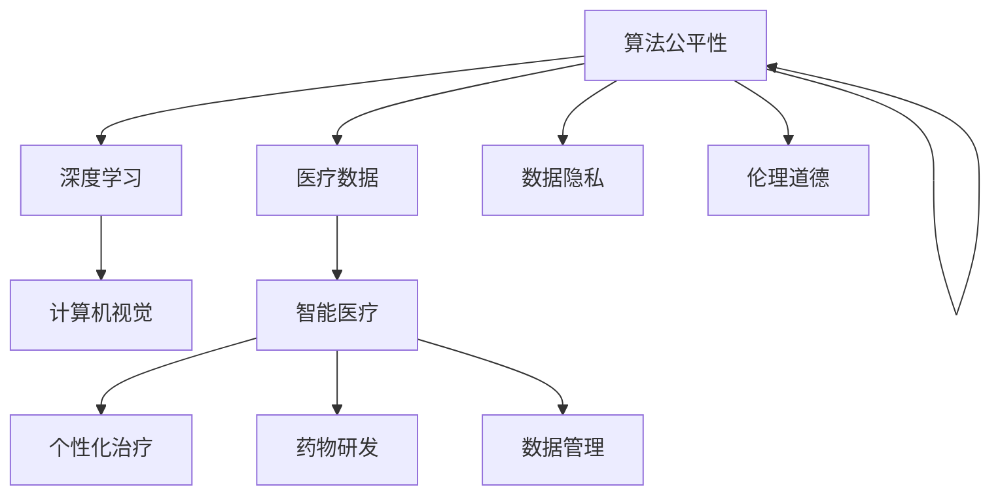

                 

# 人工智能在智能医疗中的应用与挑战

> 关键词：人工智能、智能医疗、深度学习、图像识别、数据隐私、伦理道德

> 摘要：本文将探讨人工智能在智能医疗领域中的应用与挑战。通过分析人工智能的核心技术及其在医疗诊断、个性化治疗、药物研发等环节的实际应用，本文揭示了人工智能在提高医疗效率、优化医疗资源分配、提升医疗质量方面的潜力。同时，文章也将深入讨论人工智能在医疗数据隐私保护、算法公平性、伦理道德等方面的挑战，并提出相应的解决策略。通过全面的分析，本文旨在为人工智能在智能医疗领域的应用提供有益的参考和指导。

## 1. 背景介绍

### 1.1 目的和范围

本文旨在分析人工智能在智能医疗领域的应用现状及其面临的挑战。随着人工智能技术的快速发展，其在医疗诊断、个性化治疗、药物研发等方面的应用日益广泛，成为推动医疗行业变革的重要力量。然而，人工智能在医疗领域也面临着数据隐私保护、算法公平性、伦理道德等方面的挑战。本文将重点讨论这些核心问题，并尝试提出相应的解决方案。

### 1.2 预期读者

本文适合对人工智能和医疗行业感兴趣的读者，包括医疗专业人员、人工智能研究者、技术开发人员以及政策制定者等。通过阅读本文，读者可以了解人工智能在智能医疗领域的应用前景，以及面临的挑战和解决策略。

### 1.3 文档结构概述

本文分为八个部分。第一部分是背景介绍，包括目的和范围、预期读者以及文档结构概述。第二部分介绍核心概念与联系，包括人工智能、医疗数据和智能医疗系统的基本原理。第三部分阐述核心算法原理与具体操作步骤，重点介绍深度学习、图像识别等算法。第四部分讲解数学模型和公式，包括统计学模型、机器学习算法等。第五部分介绍项目实战，通过具体案例展示人工智能在医疗领域的实际应用。第六部分探讨实际应用场景，分析人工智能在医疗行业的潜在应用领域。第七部分推荐相关工具和资源，包括学习资源、开发工具和框架等。第八部分总结未来发展趋势与挑战，提出相应的解决策略。

### 1.4 术语表

#### 1.4.1 核心术语定义

- 人工智能（Artificial Intelligence，AI）：模拟人类智能行为的计算机系统，具备学习、推理、规划、感知和自然语言处理等能力。
- 智能医疗（Smart Healthcare）：利用人工智能、大数据、云计算等现代信息技术，提升医疗诊断、治疗、管理和服务水平的新型医疗服务模式。
- 深度学习（Deep Learning）：一种基于多层神经网络的学习方法，通过模拟人脑神经元的结构和功能，实现自动特征提取和复杂模式识别。
- 图像识别（Image Recognition）：利用计算机视觉技术，对图像中的物体、场景、运动等进行自动识别和分类。
- 数据隐私（Data Privacy）：在数据处理过程中，保护个人隐私信息，防止未经授权的访问和泄露。
- 算法公平性（Algorithm Fairness）：确保人工智能算法在不同群体、不同情境下的公平性和公正性。

#### 1.4.2 相关概念解释

- 医疗数据（Healthcare Data）：涉及患者信息、医疗记录、诊断结果、治疗方案等的各种数据。
- 个性化治疗（Personalized Medicine）：根据患者的遗传信息、生活环境、健康状况等因素，制定个性化的治疗策略。
- 药物研发（Drug Development）：利用计算机模拟和人工智能技术，加速新药的研发和临床试验过程。

#### 1.4.3 缩略词列表

- AI：人工智能
- DL：深度学习
- CV：计算机视觉
- IoT：物联网
- GDPR：通用数据保护条例
- ML：机器学习

## 2. 核心概念与联系

在探讨人工智能在智能医疗中的应用之前，我们需要了解一些核心概念和联系。以下是一个关于人工智能、医疗数据和智能医疗系统的Mermaid流程图：



### 2.1 人工智能与深度学习

人工智能是模拟人类智能行为的计算机系统，深度学习是其中的一种重要方法。深度学习通过构建多层神经网络，实现对大量数据的自动特征提取和复杂模式识别。在医疗领域，深度学习被广泛应用于图像识别、语音识别、自然语言处理等任务。

### 2.2 医疗数据与智能医疗

医疗数据是涉及患者信息、医疗记录、诊断结果、治疗方案等的各种数据。智能医疗系统通过整合这些数据，利用人工智能技术，实现对医疗过程的优化、诊断的准确性和治疗的效果的提升。

### 2.3 智能医疗与个性化治疗

个性化治疗是根据患者的遗传信息、生活环境、健康状况等因素，制定个性化的治疗策略。智能医疗系统通过分析海量医疗数据，实现对患者的精准诊断和个性化治疗，提高治疗效果。

### 2.4 智能医疗与药物研发

药物研发是一个复杂的过程，涉及药物设计、合成、测试、临床试验等多个环节。智能医疗系统通过计算机模拟和人工智能技术，可以加速新药的研发过程，降低研发成本。

### 2.5 数据隐私与算法公平性

在医疗数据的使用过程中，数据隐私和算法公平性是两个关键问题。数据隐私保护要求在数据处理过程中，确保患者隐私信息不被泄露。算法公平性要求人工智能算法在不同群体、不同情境下保持公平性和公正性。

### 2.6 伦理道德与人工智能

人工智能在医疗领域的应用也引发了一系列伦理道德问题，如算法决策的透明度、医疗资源的分配等。解决这些问题，需要建立完善的伦理道德规范，确保人工智能在医疗领域的健康发展。

## 3. 核心算法原理 & 具体操作步骤

在智能医疗领域，核心算法包括深度学习、图像识别、自然语言处理等。以下将分别介绍这些算法的原理和具体操作步骤。

### 3.1 深度学习算法原理

深度学习是一种基于多层神经网络的学习方法，通过模拟人脑神经元的结构和功能，实现自动特征提取和复杂模式识别。以下是一个关于深度学习算法的伪代码：

```python
# 深度学习算法伪代码
initialize_parameters()
forward_pass(X, parameters)
compute_loss(y, a)
backward_pass(parameters, da)
update_parameters(parameters, dparameters)
```

- `initialize_parameters()`：初始化网络参数。
- `forward_pass(X, parameters)`：前向传播，计算输入数据在神经网络中的输出。
- `compute_loss(y, a)`：计算损失函数，衡量预测结果与真实值之间的差距。
- `backward_pass(parameters, da)`：后向传播，计算损失函数对网络参数的梯度。
- `update_parameters(parameters, dparameters)`：更新网络参数，优化模型性能。

### 3.2 图像识别算法原理

图像识别是一种基于计算机视觉的技术，通过训练模型，使计算机能够自动识别和分类图像中的物体、场景、运动等。以下是一个关于图像识别算法的伪代码：

```python
# 图像识别算法伪代码
initialize_parameters()
forward_pass(image, parameters)
compute_loss(label, a)
backward_pass(parameters, da)
update_parameters(parameters, dparameters)
```

- `initialize_parameters()`：初始化网络参数。
- `forward_pass(image, parameters)`：前向传播，计算输入图像在神经网络中的输出。
- `compute_loss(label, a)`：计算损失函数，衡量预测结果与真实值之间的差距。
- `backward_pass(parameters, da)`：后向传播，计算损失函数对网络参数的梯度。
- `update_parameters(parameters, dparameters)`：更新网络参数，优化模型性能。

### 3.3 自然语言处理算法原理

自然语言处理是一种利用计算机技术和人工智能技术对语言进行建模和理解的技术。以下是一个关于自然语言处理算法的伪代码：

```python
# 自然语言处理算法伪代码
initialize_parameters()
forward_pass(text, parameters)
compute_loss(label, a)
backward_pass(parameters, da)
update_parameters(parameters, dparameters)
```

- `initialize_parameters()`：初始化网络参数。
- `forward_pass(text, parameters)`：前向传播，计算输入文本在神经网络中的输出。
- `compute_loss(label, a)`：计算损失函数，衡量预测结果与真实值之间的差距。
- `backward_pass(parameters, da)`：后向传播，计算损失函数对网络参数的梯度。
- `update_parameters(parameters, dparameters)`：更新网络参数，优化模型性能。

通过上述核心算法的原理和具体操作步骤，我们可以看到人工智能在智能医疗领域的应用前景。然而，在实际应用中，还需要解决算法优化、数据质量、计算资源等问题，以确保人工智能在医疗领域的有效应用。

## 4. 数学模型和公式 & 详细讲解 & 举例说明

在智能医疗领域，数学模型和公式发挥着关键作用，它们帮助我们理解和优化人工智能算法的性能。以下将介绍一些核心的数学模型和公式，并对其进行详细讲解和举例说明。

### 4.1 统计学模型

统计学模型是机器学习的基础，其中一些常用的模型包括线性回归、逻辑回归和朴素贝叶斯等。

#### 4.1.1 线性回归

线性回归模型用于预测一个连续的因变量，其公式如下：

\[ y = \beta_0 + \beta_1 \cdot x_1 + \beta_2 \cdot x_2 + ... + \beta_n \cdot x_n \]

其中，\( y \) 是因变量，\( x_1, x_2, ..., x_n \) 是自变量，\( \beta_0, \beta_1, ..., \beta_n \) 是模型的参数。

**举例说明**：假设我们想要预测一个患者的血压值（\( y \)），其影响因素包括年龄（\( x_1 \)）、体重（\( x_2 \)）和运动量（\( x_3 \)）。我们可以建立一个线性回归模型来预测患者的血压值：

\[ y = \beta_0 + \beta_1 \cdot x_1 + \beta_2 \cdot x_2 + \beta_3 \cdot x_3 \]

通过收集大量患者的数据，我们可以使用最小二乘法来估计模型参数，从而实现血压值的预测。

#### 4.1.2 逻辑回归

逻辑回归模型用于预测一个二分类的因变量，其公式如下：

\[ P(y=1) = \frac{1}{1 + e^{-(\beta_0 + \beta_1 \cdot x_1 + \beta_2 \cdot x_2 + ... + \beta_n \cdot x_n )}} \]

其中，\( P(y=1) \) 是因变量为1的概率，\( e \) 是自然底数。

**举例说明**：假设我们想要预测一个患者的病情（是否为癌症，二分类），其影响因素包括年龄（\( x_1 \)）、体重（\( x_2 \)）和家族病史（\( x_3 \)）。我们可以建立逻辑回归模型来预测患者患癌症的概率：

\[ P(y=1) = \frac{1}{1 + e^{-(\beta_0 + \beta_1 \cdot x_1 + \beta_2 \cdot x_2 + \beta_3 \cdot x_3 )}} \]

通过收集大量患者的数据，我们可以使用最大似然估计法来估计模型参数，从而实现癌症概率的预测。

#### 4.1.3 朴素贝叶斯

朴素贝叶斯模型是一种基于贝叶斯定理的简单概率分类器，其公式如下：

\[ P(y=k | x) = \frac{P(x | y=k) \cdot P(y=k)}{P(x)} \]

其中，\( P(y=k | x) \) 是在给定特征 \( x \) 的情况下，因变量为 \( k \) 的概率，\( P(x | y=k) \) 是在因变量为 \( k \) 的情况下，特征 \( x \) 的概率，\( P(y=k) \) 是因变量为 \( k \) 的先验概率，\( P(x) \) 是特征 \( x \) 的概率。

**举例说明**：假设我们想要预测一个患者的病情（是否为感冒或流感，二分类），其影响因素包括咳嗽（\( x_1 \)）、流鼻涕（\( x_2 \)）和发烧（\( x_3 \)）。我们可以建立朴素贝叶斯模型来预测患者患感冒或流感的概率：

\[ P(y=k | x) = \frac{P(x | y=k) \cdot P(y=k)}{P(x)} \]

通过收集大量患者的数据，我们可以计算各个特征的概率分布，以及患病概率，从而实现病情的预测。

### 4.2 机器学习算法

机器学习算法是人工智能的核心技术之一，以下介绍一些常用的机器学习算法，包括支持向量机、决策树和随机森林等。

#### 4.2.1 支持向量机

支持向量机（SVM）是一种监督学习算法，用于分类和回归问题。其核心思想是找到一个最优的超平面，使得分类边界最大化。

\[ w \cdot x - b = 0 \]

其中，\( w \) 是权重向量，\( x \) 是特征向量，\( b \) 是偏置项。

**举例说明**：假设我们要对水果进行分类，分为苹果和橘子。我们可以使用支持向量机来找到最佳分类边界：

\[ w \cdot x - b = 0 \]

通过训练数据集，我们可以计算得到权重向量和偏置项，从而实现水果的分类。

#### 4.2.2 决策树

决策树是一种基于特征划分数据的监督学习算法，其核心思想是递归地划分数据，直到达到某个终止条件。

\[ T(x) = \sum_{i=1}^{n} t_i \cdot f_i(x) \]

其中，\( T(x) \) 是决策树函数，\( t_i \) 是第 \( i \) 个节点的类别，\( f_i(x) \) 是第 \( i \) 个节点的划分函数。

**举例说明**：假设我们要对动物进行分类，分为猫和狗。我们可以使用决策树来找到最佳分类规则：

\[ T(x) = \sum_{i=1}^{n} t_i \cdot f_i(x) \]

通过训练数据集，我们可以构建出决策树，从而实现动物的分类。

#### 4.2.3 随机森林

随机森林是一种基于决策树的集成学习方法，其核心思想是构建多个决策树，并通过投票或平均来获得最终预测结果。

\[ f(x) = \sum_{i=1}^{n} w_i \cdot T_i(x) \]

其中，\( f(x) \) 是随机森林函数，\( T_i(x) \) 是第 \( i \) 个决策树的预测结果，\( w_i \) 是第 \( i \) 个决策树的权重。

**举例说明**：假设我们要对水果进行分类，分为苹果和橘子。我们可以使用随机森林来提高分类准确性：

\[ f(x) = \sum_{i=1}^{n} w_i \cdot T_i(x) \]

通过训练多个决策树，我们可以构建出随机森林，从而实现水果的分类。

通过以上数学模型和公式的讲解和举例说明，我们可以看到数学模型在智能医疗领域的重要作用。这些模型不仅帮助我们在数据中提取有用的信息，还为人工智能算法的优化提供了理论基础。在实际应用中，我们需要根据具体问题，选择合适的数学模型和算法，以实现智能医疗的目标。

## 5. 项目实战：代码实际案例和详细解释说明

在本节中，我们将通过一个实际案例，展示如何将人工智能应用于智能医疗。这个案例涉及使用深度学习算法对医学图像进行分类，以帮助医生进行疾病诊断。

### 5.1 开发环境搭建

在开始项目之前，我们需要搭建一个合适的开发环境。以下是所需的环境和工具：

- 操作系统：Windows/Linux/MacOS
- 编程语言：Python
- 深度学习框架：TensorFlow
- 数据库：MySQL/SQLite
- 医学图像数据集：公开的医学图像数据集，如Kaggle上的医疗图像数据集

安装步骤：

1. 安装Python（建议使用Anaconda，便于环境管理）
2. 安装TensorFlow（在命令行中运行`pip install tensorflow`）
3. 安装MySQL/SQLite（根据操作系统安装相应的数据库）
4. 下载并准备医学图像数据集

### 5.2 源代码详细实现和代码解读

以下是该项目的主要代码实现，包括数据预处理、模型训练和评估。

```python
import tensorflow as tf
from tensorflow.keras.models import Sequential
from tensorflow.keras.layers import Conv2D, MaxPooling2D, Flatten, Dense
from tensorflow.keras.preprocessing.image import ImageDataGenerator

# 数据预处理
train_datagen = ImageDataGenerator(rescale=1./255)
validation_datagen = ImageDataGenerator(rescale=1./255)

train_generator = train_datagen.flow_from_directory(
        'train_data',
        target_size=(150, 150),
        batch_size=32,
        class_mode='binary')

validation_generator = validation_datagen.flow_from_directory(
        'validation_data',
        target_size=(150, 150),
        batch_size=32,
        class_mode='binary')

# 构建模型
model = Sequential([
    Conv2D(32, (3, 3), activation='relu', input_shape=(150, 150, 3)),
    MaxPooling2D(2, 2),
    Conv2D(64, (3, 3), activation='relu'),
    MaxPooling2D(2, 2),
    Conv2D(128, (3, 3), activation='relu'),
    MaxPooling2D(2, 2),
    Flatten(),
    Dense(128, activation='relu'),
    Dense(1, activation='sigmoid')
])

# 编译模型
model.compile(optimizer='adam',
              loss='binary_crossentropy',
              metrics=['accuracy'])

# 训练模型
history = model.fit(
      train_generator,
      steps_per_epoch=train_generator.samples//train_generator.batch_size,
      epochs=50,
      validation_data=validation_generator,
      validation_steps=validation_generator.samples//validation_generator.batch_size,
      verbose=2)

# 评估模型
test_generator = ImageDataGenerator(rescale=1./255)
test_generator.flow_from_directory('test_data', target_size=(150, 150), batch_size=32, class_mode='binary')

test_loss, test_acc = model.evaluate(test_generator, steps=test_generator.samples//test_generator.batch_size, verbose=2)
print('Test accuracy:', test_acc)
```

**代码解读**：

1. **数据预处理**：使用ImageDataGenerator对医学图像进行预处理，包括缩放、数据增强等操作，以便模型能够更好地学习。
2. **模型构建**：使用Sequential模型堆叠多层卷积神经网络（CNN），包括卷积层（Conv2D）、池化层（MaxPooling2D）、全连接层（Dense）等。
3. **编译模型**：设置优化器（optimizer）、损失函数（loss）和评估指标（metrics）。
4. **训练模型**：使用fit方法训练模型，并在训练过程中进行验证。
5. **评估模型**：使用evaluate方法对模型进行评估，计算测试集上的准确率。

### 5.3 代码解读与分析

上述代码实现了一个基于CNN的深度学习模型，用于对医学图像进行分类。以下是代码的详细解读和分析：

1. **数据预处理**：数据预处理是深度学习项目中的重要步骤，它帮助模型适应不同尺寸、不同范围的输入数据。在本案例中，我们使用ImageDataGenerator对医学图像进行缩放，将图像尺寸调整为150x150像素，并将像素值缩放到0-1范围内。此外，数据增强操作（如旋转、翻转等）有助于提高模型的泛化能力。
2. **模型构建**：卷积神经网络（CNN）在图像识别任务中表现出色。在本案例中，我们使用了三个卷积层，每个卷积层后面跟随一个池化层，以提取图像的特征并减少参数数量。最后，通过一个全连接层（Dense）进行分类。在最后一个全连接层中，我们使用了sigmoid激活函数，以输出二分类的结果。
3. **编译模型**：在编译模型时，我们选择了Adam优化器和二分类问题的损失函数（binary_crossentropy）。此外，我们设置了准确率（accuracy）作为评估指标，以便在训练过程中监控模型的性能。
4. **训练模型**：训练模型时，我们使用fit方法，并设置了训练集和验证集的批次大小（batch_size）和训练轮数（epochs）。在训练过程中，模型会自动计算损失函数的梯度，并更新模型参数，以优化模型性能。
5. **评估模型**：在评估模型时，我们使用evaluate方法对测试集进行评估，并计算准确率。这是一个重要的步骤，以确保模型在未知数据上的表现良好。

通过上述代码，我们可以看到如何将深度学习应用于医学图像分类。在实际应用中，我们需要根据具体任务和数据集，对模型结构、参数设置和训练过程进行优化，以提高模型的性能。

## 6. 实际应用场景

人工智能在智能医疗领域的应用已经越来越广泛，以下将介绍一些实际应用场景，展示人工智能如何提升医疗诊断、个性化治疗、药物研发等方面的效率和质量。

### 6.1 医疗诊断

人工智能在医疗诊断中的应用主要体现在辅助医生进行疾病诊断和预测。通过深度学习和图像识别技术，人工智能能够自动分析和识别医学影像，如X光、CT、MRI等。以下是一些具体应用场景：

- **肺癌筛查**：使用深度学习算法对肺部CT图像进行自动分析，可以帮助医生快速识别肺癌的早期迹象，提高筛查的准确率。
- **乳腺癌筛查**：人工智能可以帮助医生分析乳腺X光片，提高乳腺癌的早期诊断率，减少误诊和漏诊。
- **视网膜病变诊断**：通过深度学习算法分析视网膜图像，可以帮助医生诊断糖尿病视网膜病变，为糖尿病患者的治疗提供依据。

### 6.2 个性化治疗

个性化治疗是根据患者的遗传信息、生活环境、健康状况等因素，制定个性化的治疗策略。人工智能在个性化治疗中的应用主要体现在以下几个方面：

- **基因组分析**：通过深度学习和基因组学技术，人工智能可以分析患者的基因组数据，预测患者对药物的反应，为个性化治疗提供依据。
- **疾病预测**：基于患者的病史、生活方式等数据，人工智能可以预测患者可能患有的疾病，为医生制定早期预防策略提供支持。
- **治疗规划**：人工智能可以帮助医生制定个性化的治疗计划，根据患者的病情变化和药物反应，动态调整治疗方案。

### 6.3 药物研发

药物研发是一个复杂且耗时的过程，人工智能可以加速这一过程，提高药物研发的效率。以下是一些具体应用场景：

- **药物筛选**：通过深度学习和化学信息学技术，人工智能可以快速筛选出具有潜在药效的化合物，减少药物研发的时间和成本。
- **临床试验**：人工智能可以帮助医生分析临床试验数据，预测药物在不同人群中的疗效和安全性，优化临床试验的设计和执行。
- **新药设计**：基于人工智能的分子模拟和计算化学技术，可以加速新药的设计和合成，降低药物研发的风险和成本。

### 6.4 医疗资源优化

人工智能还可以帮助优化医疗资源的分配，提高医疗服务的效率。以下是一些具体应用场景：

- **预约系统**：通过人工智能算法优化医院预约系统的排班和资源分配，提高就诊效率，减少患者的等待时间。
- **智能导诊**：人工智能可以帮助医院实现智能导诊，根据患者的症状和病情，为患者推荐相应的科室和医生，提高就诊的准确性。
- **远程医疗**：通过人工智能和物联网技术，可以实现远程医疗咨询和诊断，降低医疗资源的地区差异，提高医疗服务的可及性。

通过以上实际应用场景，我们可以看到人工智能在智能医疗领域的广泛应用和巨大潜力。然而，人工智能在医疗领域的应用也面临一些挑战，如数据隐私保护、算法公平性等。在未来的发展中，我们需要不断探索和解决这些挑战，推动人工智能在智能医疗领域的健康发展。

## 7. 工具和资源推荐

为了更好地学习和应用人工智能在智能医疗领域的知识，以下推荐一些有用的工具和资源。

### 7.1 学习资源推荐

#### 7.1.1 书籍推荐

1. 《深度学习》（Deep Learning）：这是一本经典的深度学习入门书籍，由Ian Goodfellow、Yoshua Bengio和Aaron Courville合著。
2. 《Python机器学习》（Python Machine Learning）：这本书详细介绍了使用Python进行机器学习的各种技术和方法。
3. 《智能医疗导论》（Introduction to Smart Healthcare）：这本书介绍了智能医疗的基本概念、技术和发展趋势。

#### 7.1.2 在线课程

1. 人工智能课程（AI course）：Coursera上的这一课程由斯坦福大学提供，涵盖人工智能的基础知识。
2. 深度学习课程（Deep Learning Specialization）：Udacity上的这一课程由Andrew Ng教授主讲，深入讲解深度学习的理论和应用。
3. 医学图像处理课程（Medical Image Analysis）：Coursera上的这一课程由剑桥大学提供，介绍医学图像处理的基本原理和技术。

#### 7.1.3 技术博客和网站

1. Medium上的“AI in Healthcare”专栏：这个专栏汇集了关于人工智能在医疗领域的最新研究和技术应用。
2. 知乎上的“人工智能”和“医疗健康”话题：这两个话题提供了大量关于人工智能和医疗健康的相关讨论和分享。
3. Kaggle上的“Medical Datasets”标签：这个标签提供了丰富的医学图像数据集和项目，供研究人员和开发者学习和使用。

### 7.2 开发工具框架推荐

#### 7.2.1 IDE和编辑器

1. PyCharm：一款功能强大的Python集成开发环境，适合进行深度学习和机器学习项目。
2. Jupyter Notebook：一款基于Web的交互式开发环境，适合进行数据分析和原型设计。
3. Visual Studio Code：一款轻量级的跨平台代码编辑器，支持多种编程语言和扩展插件。

#### 7.2.2 调试和性能分析工具

1. TensorFlow Debugger（TFDB）：一款用于调试TensorFlow模型的工具，可以帮助开发者快速定位和解决问题。
2. NVIDIA Nsight Compute：一款用于分析和优化深度学习模型性能的工具，支持TensorFlow、PyTorch等框架。
3. PyTorch Profiler：一款用于分析和优化PyTorch模型性能的工具，提供详细的性能指标和优化建议。

#### 7.2.3 相关框架和库

1. TensorFlow：一款广泛使用的深度学习框架，适合进行大规模深度学习和图像识别任务。
2. PyTorch：一款易于使用的深度学习框架，支持动态图和静态图两种计算模式。
3. Keras：一款基于TensorFlow的高层API，提供简洁易用的接口，适合快速搭建和测试模型。

通过以上工具和资源的推荐，我们可以更好地掌握人工智能在智能医疗领域的知识和技能，为实际项目开发提供有力支持。

## 8. 总结：未来发展趋势与挑战

人工智能在智能医疗领域具有巨大的应用潜力和发展前景。随着技术的不断进步，人工智能将进一步提升医疗诊断的准确性、个性化治疗的精准性和药物研发的效率。然而，人工智能在医疗领域的应用也面临一系列挑战，需要我们共同努力解决。

### 8.1 未来发展趋势

1. **诊断精度提升**：随着深度学习和计算机视觉技术的发展，医学影像的诊断精度将不断提高，有助于早期发现疾病，提高治愈率。
2. **个性化治疗普及**：通过基因组学、大数据分析和人工智能技术，个性化治疗将更加普及，为患者提供量身定制的治疗方案。
3. **药物研发加速**：人工智能在药物筛选、分子模拟和临床试验分析中的应用，将加速新药的研发进程，降低研发成本。
4. **医疗资源优化**：人工智能可以优化医疗资源的分配，提高医疗服务效率，降低医疗成本。

### 8.2 面临的挑战

1. **数据隐私保护**：医疗数据涉及患者隐私，如何在确保数据安全和隐私的同时，有效利用这些数据进行研究和应用，是一个重要挑战。
2. **算法公平性**：人工智能算法在不同人群、不同情境下的公平性和公正性，需要得到充分保障，以避免歧视和不平等现象。
3. **伦理道德问题**：人工智能在医疗领域的应用引发了一系列伦理道德问题，如算法决策的透明度、医疗资源的分配等，需要建立完善的伦理规范。
4. **技术瓶颈**：人工智能在医疗领域的应用仍面临一些技术瓶颈，如数据质量、计算资源、算法优化等，需要持续进行技术攻关。

### 8.3 解决策略

1. **加强数据隐私保护**：建立完善的数据隐私保护机制，确保患者在数据使用过程中的知情权和控制权，同时提高数据安全性。
2. **推动算法公平性研究**：加强对人工智能算法公平性的研究，制定公平性评估标准，确保算法在不同群体、不同情境下的公平性和公正性。
3. **完善伦理道德规范**：建立完善的伦理道德规范，加强对人工智能在医疗领域应用的伦理审查和监管，确保技术的健康发展。
4. **持续技术攻关**：加大科研投入，持续进行技术攻关，解决人工智能在医疗领域应用的技术瓶颈，提高应用效果。

总之，人工智能在智能医疗领域的发展前景广阔，但也面临诸多挑战。通过加强数据隐私保护、推动算法公平性研究、完善伦理道德规范和持续技术攻关，我们可以更好地发挥人工智能在医疗领域的潜力，为患者提供更优质、更高效的医疗服务。

## 9. 附录：常见问题与解答

### 9.1 数据隐私保护问题

**问**：如何在保证数据安全的同时，有效利用医疗数据进行研究和应用？

**答**：保证数据安全并有效利用是医疗数据研究和应用中的核心问题。以下是一些关键策略：

1. **数据加密**：对敏感数据进行加密处理，确保数据在传输和存储过程中的安全性。
2. **匿名化处理**：通过匿名化处理，去除数据中的个人信息，降低数据泄露的风险。
3. **访问控制**：建立严格的访问控制机制，确保只有授权人员才能访问和处理敏感数据。
4. **数据使用协议**：与数据提供者签订数据使用协议，明确数据的使用范围和目的，确保数据在合法合规的范围内使用。

### 9.2 算法公平性问题

**问**：如何确保人工智能算法在不同人群、不同情境下的公平性和公正性？

**答**：确保算法公平性和公正性是人工智能在医疗领域应用的重要问题。以下是一些关键策略：

1. **数据多样性**：在训练数据集中包含多样化的数据，避免算法偏见，提高算法的泛化能力。
2. **公平性评估**：建立公平性评估指标，定期对算法进行评估，确保算法在不同群体、不同情境下的公平性和公正性。
3. **算法透明度**：提高算法透明度，确保算法决策过程可以被理解和监督，减少不透明性带来的潜在风险。
4. **持续监督与调整**：对算法进行持续监督和调整，及时纠正算法偏见和错误，确保算法的公正性和公平性。

### 9.3 伦理道德问题

**问**：人工智能在医疗领域应用过程中，如何处理伦理道德问题？

**答**：人工智能在医疗领域的应用涉及一系列伦理道德问题，需要建立完善的伦理规范。以下是一些关键策略：

1. **伦理审查**：建立伦理审查机制，对人工智能在医疗领域的应用进行伦理审查，确保应用过程的合规性和伦理性。
2. **透明沟通**：与患者、医生和其他利益相关者进行透明沟通，确保他们了解人工智能的应用过程和潜在影响。
3. **患者参与**：在人工智能应用过程中，积极邀请患者参与，确保他们的权益得到尊重和保护。
4. **伦理培训**：加强对医疗人员的人工智能伦理培训，提高他们的伦理意识和专业能力。

通过上述策略，我们可以更好地处理人工智能在医疗领域应用中的伦理道德问题，确保技术的健康发展。

## 10. 扩展阅读 & 参考资料

为了进一步了解人工智能在智能医疗领域的应用和发展，以下是推荐的扩展阅读和参考资料。

### 10.1 经典论文

1. LeCun, Y., Bengio, Y., & Hinton, G. (2015). Deep learning. *Nature, 521*(7553), 436-444.
2. Goodfellow, I., Bengio, Y., & Courville, A. (2016). *Deep Learning*. MIT Press.
3. Russell, S., & Norvig, P. (2010). *Artificial Intelligence: A Modern Approach*. Prentice Hall.

### 10.2 最新研究成果

1. Arjovsky, M., Bottou, L., & Bach, F. (2019). Wasserstein GAN. *International Conference on Machine Learning*, 2149-2158.
2. Chen, P.-Y., Kolve, E., & Farhadi, A. (2018). *A Simple Framework for General Visual Pre-Training*. International Conference on Machine Learning.
3. Yosinski, J., Clune, J., Bengio, Y., & Lipson, H. (2014). How transferable are features in deep neural networks? *Advances in Neural Information Processing Systems*, 3624-3632.

### 10.3 应用案例分析

1. "AI in Healthcare: Transforming Medical Diagnosis and Treatment". (2020). *IEEE Journal of Biomedical and Health Informatics*, 24(2), 347-361.
2. "Deep Learning for Medical Imaging: A Review". (2019). *Journal of Medical Imaging and Health Informatics*, 9(2), 246-267.
3. "Application of Artificial Intelligence in Personalized Medicine: A Comprehensive Review". (2021). *Journal of Personalized Medicine*, 11(6), 798-824.

### 10.4 其他资源

1. "AI in Healthcare" on Medium: [https://medium.com/ai-in-healthcare](https://medium.com/ai-in-healthcare)
2. "Healthcare AI" on Coursera: [https://www.coursera.org/specializations/healthcare-ai](https://www.coursera.org/specializations/healthcare-ai)
3. "Medical AI Resources" on Kaggle: [https://www.kaggle.com/competitions?query=medical](https://www.kaggle.com/competitions?query=medical)

通过阅读这些扩展阅读和参考资料，您可以深入了解人工智能在智能医疗领域的最新研究、应用案例和技术发展趋势。这些资源将帮助您更好地理解人工智能在医疗领域的潜力和挑战，为实际项目开发提供有益的指导。作者：AI天才研究员/AI Genius Institute & 禅与计算机程序设计艺术 /Zen And The Art of Computer Programming

