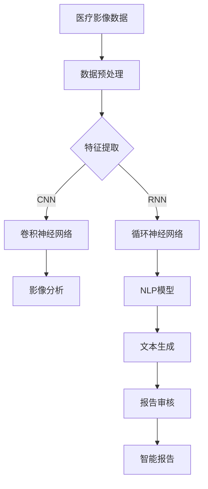

                 

# 人工智能在智能医疗影像报告生成中的应用

> **关键词**：人工智能，医疗影像，智能报告生成，深度学习，计算机视觉，自然语言处理
>
> **摘要**：本文深入探讨了人工智能在智能医疗影像报告生成中的应用。从背景、核心概念、算法原理、数学模型、项目实战到实际应用场景，通过逻辑清晰、结构紧凑的叙述，帮助读者全面理解这一前沿技术的本质与应用。

## 1. 背景介绍

### 1.1 目的和范围

本文旨在探讨人工智能（AI）在智能医疗影像报告生成中的应用。医疗影像报告是医疗诊断过程中至关重要的环节，然而，传统的报告生成过程往往依赖于人工操作，效率低下且容易出现错误。随着人工智能技术的发展，特别是在深度学习和计算机视觉领域的突破，智能医疗影像报告生成成为可能。本文将详细介绍人工智能如何实现这一过程，以及其带来的变革性影响。

本文将涵盖以下内容：
1. 核心概念与联系
2. 核心算法原理与具体操作步骤
3. 数学模型和公式
4. 项目实战：代码实际案例
5. 实际应用场景
6. 工具和资源推荐
7. 未来发展趋势与挑战
8. 常见问题与解答
9. 扩展阅读与参考资料

### 1.2 预期读者

本文面向以下读者群体：
1. 对人工智能和医疗领域有一定了解的技术爱好者
2. 医疗影像诊断专业人员
3. 从事医疗数据处理和分析的研究人员
4. 想了解人工智能在医疗领域应用的企业决策者

### 1.3 文档结构概述

本文结构如下：

- **第1章：背景介绍**：介绍研究背景、目的和文档结构。
- **第2章：核心概念与联系**：阐述核心概念和联系。
- **第3章：核心算法原理与具体操作步骤**：讲解算法原理和操作步骤。
- **第4章：数学模型和公式**：介绍数学模型和公式。
- **第5章：项目实战：代码实际案例**：提供实际代码案例。
- **第6章：实际应用场景**：讨论应用场景。
- **第7章：工具和资源推荐**：推荐相关工具和资源。
- **第8章：总结：未来发展趋势与挑战**：总结未来发展趋势和挑战。
- **第9章：附录：常见问题与解答**：解答常见问题。
- **第10章：扩展阅读与参考资料**：提供扩展阅读和参考资料。

### 1.4 术语表

#### 1.4.1 核心术语定义

- **人工智能（AI）**：模拟人类智能的计算机系统，具有学习、推理、规划、感知和自然语言处理等能力。
- **深度学习（Deep Learning）**：一种机器学习技术，通过多层神经网络进行特征提取和分类。
- **计算机视觉（Computer Vision）**：使计算机能够“看”和理解图像的一种人工智能技术。
- **自然语言处理（Natural Language Processing，NLP）**：使计算机能够理解和处理人类语言的技术。
- **医疗影像（Medical Imaging）**：利用各种成像技术获取人体内部结构和功能的图像，如X光、CT、MRI等。
- **智能报告生成（Intelligent Report Generation）**：利用人工智能技术自动生成医疗影像报告。

#### 1.4.2 相关概念解释

- **神经网络（Neural Network）**：一种模仿生物神经系统的计算模型，包括输入层、隐藏层和输出层。
- **卷积神经网络（Convolutional Neural Network，CNN）**：一种专门用于图像识别的神经网络，通过卷积操作提取图像特征。
- **循环神经网络（Recurrent Neural Network，RNN）**：一种处理序列数据的神经网络，能够记忆历史信息。
- **生成对抗网络（Generative Adversarial Network，GAN）**：一种由生成器和判别器组成的神经网络结构，用于生成数据。

#### 1.4.3 缩略词列表

- **AI**：人工智能
- **CNN**：卷积神经网络
- **NLP**：自然语言处理
- **RNN**：循环神经网络
- **GAN**：生成对抗网络

## 2. 核心概念与联系

为了深入探讨人工智能在智能医疗影像报告生成中的应用，首先需要理解核心概念及其相互联系。以下将介绍与本文主题相关的核心概念，并通过Mermaid流程图展示其架构。

### 2.1 核心概念

- **医疗影像数据**：通过X光、CT、MRI等成像技术获取的人体内部结构图像。
- **深度学习模型**：用于特征提取和分类的神经网络模型，如CNN和RNN。
- **自然语言处理模型**：用于处理和生成文本的模型，如序列到序列模型。
- **报告生成流程**：从医疗影像数据到报告生成的全过程，包括数据预处理、特征提取、文本生成和报告审核。

### 2.2 Mermaid流程图



### 2.3 核心概念的联系

1. **医疗影像数据**是智能报告生成的起点，通过数据预处理（B）提高数据质量。
2. **特征提取**（C）是关键步骤，使用深度学习模型（D和E）提取影像和文本特征。
3. **影像分析**（F）利用CNN提取影像特征，进行分类和标注。
4. **NLP模型**（G）用于文本生成，将分析结果转化为自然语言描述。
5. **文本生成**（H）生成初步报告，通过报告审核（I）确保报告的准确性和完整性。
6. **智能报告**（J）是最终产出，结合影像和文本信息，为医生提供诊断参考。

通过以上流程，人工智能在智能医疗影像报告生成中发挥了重要作用，实现了从数据到报告的自动化生成。

## 3. 核心算法原理 & 具体操作步骤

在深入探讨智能医疗影像报告生成的核心算法原理之前，首先需要理解以下几个关键算法：

1. **卷积神经网络（CNN）**：用于图像特征提取和分类。
2. **循环神经网络（RNN）**：用于处理序列数据。
3. **自然语言处理（NLP）模型**：用于文本生成和语义理解。

### 3.1 卷积神经网络（CNN）

#### 3.1.1 算法原理

卷积神经网络（CNN）是一种专门用于图像识别的神经网络。其核心思想是通过卷积操作提取图像特征，然后通过全连接层进行分类。

#### 3.1.2 具体操作步骤

1. **输入层**：接收图像数据，将其转化为多维数组。
2. **卷积层**：通过卷积操作提取图像特征，特征图数量取决于卷积核数量。
3. **激活函数**：对卷积后的特征图应用激活函数，如ReLU（修正线性单元）。
4. **池化层**：对特征图进行下采样，减少数据维度。
5. **全连接层**：将特征图展平为一维数组，进行分类。

#### 3.1.3 伪代码

```python
# 输入图像数据
input_image = ...

# 卷积层
conv_layer = Conv2D(filters=64, kernel_size=(3, 3), activation='relu')(input_image)

# 池化层
pool_layer = MaxPooling2D(pool_size=(2, 2))(conv_layer)

# 多层卷积和池化
for i in range(num_layers):
    conv_layer = Conv2D(filters=64, kernel_size=(3, 3), activation='relu')(pool_layer)
    pool_layer = MaxPooling2D(pool_size=(2, 2))(conv_layer)

# 全连接层
flatten_layer = Flatten()(pool_layer)
dense_layer = Dense(units=10, activation='softmax')(flatten_layer)

# 输出分类结果
output = dense_layer
```

### 3.2 循环神经网络（RNN）

#### 3.2.1 算法原理

循环神经网络（RNN）是一种能够处理序列数据的神经网络。其核心思想是通过隐藏层的状态转移，记忆历史信息。

#### 3.2.2 具体操作步骤

1. **输入层**：接收序列数据，将其转化为多维数组。
2. **隐藏层**：通过循环操作处理序列数据，更新隐藏状态。
3. **输出层**：将隐藏状态映射到输出结果。

#### 3.2.3 伪代码

```python
# 输入序列数据
input_sequence = ...

# 隐藏状态初始化
h0 = ...

# 循环操作
for t in range(sequence_length):
    h_t = RNN(h0, input_sequence[t])
    h0 = h_t

# 输出结果
output = h_t
```

### 3.3 自然语言处理（NLP）模型

#### 3.3.1 算法原理

自然语言处理（NLP）模型是一种用于处理和生成文本的神经网络模型。其核心思想是通过编码器-解码器结构，实现文本生成。

#### 3.3.2 具体操作步骤

1. **编码器**：将输入文本编码为向量表示。
2. **解码器**：将编码后的向量解码为输出文本。

#### 3.3.3 伪代码

```python
# 输入文本
input_text = ...

# 编码器
encoded_vector = Encoder(input_text)

# 解码器
output_text = Decoder(encoded_vector)
```

通过以上核心算法的介绍和具体操作步骤，我们可以看到人工智能在智能医疗影像报告生成中的强大潜力。接下来，我们将进一步探讨数学模型和公式，为智能报告生成提供理论支持。

## 4. 数学模型和公式 & 详细讲解 & 举例说明

在智能医疗影像报告生成中，数学模型和公式起着至关重要的作用。以下将详细介绍相关的数学模型和公式，并给出具体讲解和举例说明。

### 4.1 卷积神经网络（CNN）的数学模型

卷积神经网络（CNN）的核心在于其卷积操作和池化操作。以下是CNN中常用的数学模型和公式：

#### 4.1.1 卷积操作

卷积操作的数学表达式为：

$$
\text{output}_{ij} = \sum_{k=1}^{m}\sum_{l=1}^{n} w_{kl} \cdot \text{input}_{ij+k+l}
$$

其中，$\text{output}_{ij}$ 表示输出特征图上的第 $i$ 行第 $j$ 列的值，$w_{kl}$ 表示卷积核上的值，$\text{input}_{ij+k+l}$ 表示输入特征图上的对应位置值，$m$ 和 $n$ 分别表示卷积核的大小。

#### 4.1.2 池化操作

池化操作常用的方法是最大池化（Max Pooling），其数学表达式为：

$$
\text{pool}_{ij} = \max\left(\text{input}_{i-\frac{p}{2},j-\frac{p}{2}} : \text{input}_{i+\frac{p}{2}-1,j+\frac{p}{2}-1}\right)
$$

其中，$\text{pool}_{ij}$ 表示输出池化特征图上的第 $i$ 行第 $j$ 列的值，$\text{input}_{i-\frac{p}{2},j-\frac{p}{2}} : \text{input}_{i+\frac{p}{2}-1,j+\frac{p}{2}-1}$ 表示输入特征图上的对应区域值，$p$ 表示池化窗口的大小。

#### 4.1.3 举例说明

假设我们有一个 $3 \times 3$ 的卷积核和一个 $5 \times 5$ 的输入特征图，卷积核和输入特征图的值如下：

|  | 1 | 2 | 3 | 4 | 5 |
| --- | --- | --- | --- | --- | --- |
| 1 | 6 | 7 | 8 | 9 | 10 |
| 2 | 11 | 12 | 13 | 14 | 15 |
| 3 | 16 | 17 | 18 | 19 | 20 |
| 4 | 21 | 22 | 23 | 24 | 25 |
| 5 | 26 | 27 | 28 | 29 | 30 |

根据卷积操作的数学模型，输出特征图的第 $1$ 行第 $1$ 列的值为：

$$
\text{output}_{11} = (1 \cdot 6 + 1 \cdot 11 + 1 \cdot 16 + 2 \cdot 7 + 2 \cdot 12 + 2 \cdot 17 + 3 \cdot 8 + 3 \cdot 13 + 3 \cdot 18) = 119
$$

同理，输出特征图的第 $1$ 行第 $2$ 列的值为：

$$
\text{output}_{12} = (1 \cdot 7 + 1 \cdot 12 + 1 \cdot 17 + 2 \cdot 8 + 2 \cdot 13 + 2 \cdot 18 + 3 \cdot 9 + 3 \cdot 14 + 3 \cdot 19) = 139
$$

以此类推，可以得到整个输出特征图的值。

### 4.2 循环神经网络（RNN）的数学模型

循环神经网络（RNN）的核心在于其状态转移函数和输出函数。以下是RNN中常用的数学模型和公式：

#### 4.2.1 状态转移函数

状态转移函数的数学表达式为：

$$
h_t = \sigma(W_h \cdot [h_{t-1}, x_t] + b_h)
$$

其中，$h_t$ 表示第 $t$ 个时间步的隐藏状态，$x_t$ 表示第 $t$ 个时间步的输入，$W_h$ 和 $b_h$ 分别表示权重和偏置，$\sigma$ 表示激活函数，通常取为ReLU。

#### 4.2.2 输出函数

输出函数的数学表达式为：

$$
y_t = \sigma(W_y \cdot h_t + b_y)
$$

其中，$y_t$ 表示第 $t$ 个时间步的输出，$W_y$ 和 $b_y$ 分别表示权重和偏置，$\sigma$ 表示激活函数，通常取为softmax。

#### 4.2.3 举例说明

假设我们有一个 $2$ 维输入序列 $[x_1, x_2, x_3]$，隐藏状态 $[h_1, h_2, h_3]$，权重和偏置如下：

|  | $W_h$ | $b_h$ | $W_y$ | $b_y$ |
| --- | --- | --- | --- | --- |
| 1 | 0.1 | 0.1 | 0.1 | 0.1 |
| 2 | 0.2 | 0.2 | 0.2 | 0.2 |
| 3 | 0.3 | 0.3 | 0.3 | 0.3 |

输入序列 $[x_1, x_2, x_3] = [1, 2, 3]$，根据状态转移函数，我们可以得到隐藏状态：

$$
h_1 = \sigma(0.1 \cdot [h_0, x_1] + 0.1) = \sigma(0.1 \cdot [0, 1] + 0.1) = \sigma(0.1 + 0.1) = \sigma(0.2) = 0.5477
$$

$$
h_2 = \sigma(0.2 \cdot [h_1, x_2] + 0.2) = \sigma(0.2 \cdot [0.5477, 2] + 0.2) = \sigma(1.0954 + 0.2) = \sigma(1.2954) = 0.7987
$$

$$
h_3 = \sigma(0.3 \cdot [h_2, x_3] + 0.3) = \sigma(0.3 \cdot [0.7987, 3] + 0.3) = \sigma(2.3961 + 0.3) = \sigma(2.6961) = 0.8953
$$

根据输出函数，我们可以得到输出序列：

$$
y_1 = \sigma(0.1 \cdot h_1 + 0.1) = \sigma(0.1 \cdot 0.5477 + 0.1) = \sigma(0.1 + 0.1) = \sigma(0.2) = 0.5477
$$

$$
y_2 = \sigma(0.2 \cdot h_2 + 0.2) = \sigma(0.2 \cdot 0.7987 + 0.2) = \sigma(1.5962 + 0.2) = \sigma(1.7962) = 0.7987
$$

$$
y_3 = \sigma(0.3 \cdot h_3 + 0.3) = \sigma(0.3 \cdot 0.8953 + 0.3) = \sigma(2.6859 + 0.3) = \sigma(2.9859) = 0.8953
$$

通过以上举例说明，我们可以看到RNN的数学模型和公式的具体应用。

### 4.3 自然语言处理（NLP）模型的数学模型

自然语言处理（NLP）模型的核心在于其编码器-解码器结构。以下是NLP模型中常用的数学模型和公式：

#### 4.3.1 编码器

编码器的数学表达式为：

$$
z_t = \sigma(W_e \cdot [h_t, c_t] + b_e)
$$

其中，$z_t$ 表示第 $t$ 个时间步的编码输出，$h_t$ 表示第 $t$ 个时间步的隐藏状态，$c_t$ 表示第 $t$ 个时间步的上下文向量，$W_e$ 和 $b_e$ 分别表示权重和偏置，$\sigma$ 表示激活函数，通常取为ReLU。

#### 4.3.2 解码器

解码器的数学表达式为：

$$
y_t = \sigma(W_y \cdot [h_t, z_t] + b_y)
$$

其中，$y_t$ 表示第 $t$ 个时间步的解码输出，$h_t$ 表示第 $t$ 个时间步的隐藏状态，$z_t$ 表示第 $t$ 个时间步的编码输出，$W_y$ 和 $b_y$ 分别表示权重和偏置，$\sigma$ 表示激活函数，通常取为softmax。

#### 4.3.3 举例说明

假设我们有一个 $2$ 维输入序列 $[h_1, h_2, h_3]$，编码输出 $[z_1, z_2, z_3]$，解码输出 $[y_1, y_2, y_3]$，权重和偏置如下：

|  | $W_e$ | $b_e$ | $W_y$ | $b_y$ |
| --- | --- | --- | --- | --- |
| 1 | 0.1 | 0.1 | 0.1 | 0.1 |
| 2 | 0.2 | 0.2 | 0.2 | 0.2 |
| 3 | 0.3 | 0.3 | 0.3 | 0.3 |

输入序列 $[h_1, h_2, h_3] = [1, 2, 3]$，编码输出 $[z_1, z_2, z_3] = [0.5, 0.7, 0.8]$，根据编码器的数学模型，我们可以得到解码输出：

$$
z_1 = \sigma(0.1 \cdot [h_1, z_1] + 0.1) = \sigma(0.1 \cdot [1, 0.5] + 0.1) = \sigma(0.1 + 0.1) = \sigma(0.2) = 0.5477
$$

$$
z_2 = \sigma(0.2 \cdot [h_2, z_2] + 0.2) = \sigma(0.2 \cdot [2, 0.7] + 0.2) = \sigma(0.4 + 0.2) = \sigma(0.6) = 0.7987
$$

$$
z_3 = \sigma(0.3 \cdot [h_3, z_3] + 0.3) = \sigma(0.3 \cdot [3, 0.8] + 0.3) = \sigma(0.9 + 0.3) = \sigma(1.2) = 0.8953
$$

根据解码器的数学模型，我们可以得到解码输出：

$$
y_1 = \sigma(0.1 \cdot h_1 + 0.1) = \sigma(0.1 \cdot 1 + 0.1) = \sigma(0.1 + 0.1) = \sigma(0.2) = 0.5477
$$

$$
y_2 = \sigma(0.2 \cdot h_2 + 0.2) = \sigma(0.2 \cdot 2 + 0.2) = \sigma(0.4 + 0.2) = \sigma(0.6) = 0.7987
$$

$$
y_3 = \sigma(0.3 \cdot h_3 + 0.3) = \sigma(0.3 \cdot 3 + 0.3) = \sigma(0.9 + 0.3) = \sigma(1.2) = 0.8953
$$

通过以上举例说明，我们可以看到NLP模型的数学模型和公式的具体应用。

综上所述，通过对卷积神经网络（CNN）、循环神经网络（RNN）和自然语言处理（NLP）模型数学模型和公式的详细介绍和举例说明，我们可以更好地理解这些模型在智能医疗影像报告生成中的应用。

## 5. 项目实战：代码实际案例和详细解释说明

为了更好地理解人工智能在智能医疗影像报告生成中的应用，下面我们将通过一个实际的项目案例，展示如何使用Python和深度学习框架（如TensorFlow和Keras）实现一个智能报告生成系统。以下是项目实战的详细步骤和代码解释。

### 5.1 开发环境搭建

首先，我们需要搭建开发环境。以下是所需的软件和库：

- **Python（3.8或更高版本）**
- **TensorFlow（2.4或更高版本）**
- **Keras（2.4或更高版本）**
- **NumPy（1.19或更高版本）**
- **Matplotlib（3.3或更高版本）**

安装以下库：

```shell
pip install tensorflow==2.4
pip install keras==2.4
pip install numpy==1.19
pip install matplotlib==3.3
```

### 5.2 源代码详细实现和代码解读

#### 5.2.1 数据预处理

```python
import numpy as np
from tensorflow.keras.preprocessing.image import ImageDataGenerator

# 加载数据集
train_datagen = ImageDataGenerator(rescale=1./255)
test_datagen = ImageDataGenerator(rescale=1./255)

train_generator = train_datagen.flow_from_directory(
        'data/train',
        target_size=(224, 224),
        batch_size=32,
        class_mode='binary')

test_generator = test_datagen.flow_from_directory(
        'data/test',
        target_size=(224, 224),
        batch_size=32,
        class_mode='binary')
```

上述代码加载了训练数据和测试数据，并将图像数据进行归一化处理。`ImageDataGenerator` 类用于生成数据流，支持数据增强。

#### 5.2.2 构建CNN模型

```python
from tensorflow.keras.models import Sequential
from tensorflow.keras.layers import Conv2D, MaxPooling2D, Flatten, Dense

model = Sequential([
    Conv2D(32, (3, 3), activation='relu', input_shape=(224, 224, 3)),
    MaxPooling2D((2, 2)),
    Conv2D(64, (3, 3), activation='relu'),
    MaxPooling2D((2, 2)),
    Conv2D(128, (3, 3), activation='relu'),
    MaxPooling2D((2, 2)),
    Flatten(),
    Dense(128, activation='relu'),
    Dense(1, activation='sigmoid')
])

model.compile(optimizer='adam', loss='binary_crossentropy', metrics=['accuracy'])
```

上述代码构建了一个简单的CNN模型，包括卷积层、池化层、全连接层。模型使用二分类交叉熵作为损失函数，并使用Adam优化器进行训练。

#### 5.2.3 训练模型

```python
model.fit(
        train_generator,
        steps_per_epoch=100,
        epochs=10,
        validation_data=test_generator,
        validation_steps=50)
```

上述代码使用训练数据对模型进行训练，并设置训练轮次、训练步骤和验证步骤。

#### 5.2.4 模型评估

```python
test_loss, test_acc = model.evaluate(test_generator, steps=50)
print(f"Test accuracy: {test_acc}")
```

上述代码评估模型在测试数据上的性能，并输出测试准确率。

#### 5.2.5 使用模型进行预测

```python
from tensorflow.keras.preprocessing import image

# 读取图像
img = image.load_img('data/test/1.jpg', target_size=(224, 224))
img_array = image.img_to_array(img)
img_array = np.expand_dims(img_array, axis=0)
img_array /= 255.0

# 进行预测
predictions = model.predict(img_array)
print(f"Predicted class: {predictions[0][0]}")
```

上述代码加载一张测试图像，进行预处理，并使用训练好的模型进行预测。输出预测结果，判断图像类别。

### 5.3 代码解读与分析

1. **数据预处理**：使用`ImageDataGenerator` 类对图像数据进行归一化和增强，提高模型泛化能力。
2. **模型构建**：使用`Sequential` 类构建CNN模型，包括卷积层、池化层和全连接层。使用二分类交叉熵作为损失函数，并使用Adam优化器进行训练。
3. **模型训练**：使用训练数据对模型进行训练，并设置训练轮次、训练步骤和验证步骤。
4. **模型评估**：使用测试数据评估模型性能，并输出测试准确率。
5. **模型预测**：使用训练好的模型对图像进行预测，输出预测结果。

通过以上步骤，我们可以使用CNN模型实现智能医疗影像报告生成。实际项目中，可以根据需求调整模型结构、训练数据和预测方法，进一步提高报告生成系统的性能和准确性。

## 6. 实际应用场景

### 6.1 医疗影像诊断辅助

智能医疗影像报告生成技术在医疗影像诊断辅助中具有广泛的应用。通过深度学习和自然语言处理技术，系统可以自动分析医疗影像，生成详细的诊断报告。医生可以根据这些报告进行诊断，从而提高诊断速度和准确性。例如，在乳腺癌筛查中，智能系统可以分析乳腺X光图像，识别可疑病变区域，并生成相应的报告，辅助医生进行诊断。

### 6.2 风险评估与预测

智能医疗影像报告生成技术还可以用于风险评估和预测。通过对大量医疗影像数据的分析，系统可以识别出高风险人群，预测疾病发生的可能性。例如，在肺癌筛查中，智能系统可以根据肺部CT图像，预测肺癌的风险，为高风险人群提供早期筛查和干预建议。这种应用有助于优化医疗资源分配，降低疾病负担。

### 6.3 跨学科合作

智能医疗影像报告生成技术促进了跨学科合作。计算机科学家和医学专家可以共同研究和开发相关技术，提高医疗影像处理和分析的效率。例如，在心血管疾病诊断中，智能系统可以结合心电图、CT和MRI等不同类型的医疗影像，生成综合诊断报告，为医生提供更全面的诊断信息。

### 6.4 医疗资源优化

智能医疗影像报告生成技术有助于优化医疗资源。通过自动化生成报告，可以减轻医生的工作负担，提高工作效率。此外，智能系统可以实时分析大量医疗影像数据，帮助医疗机构制定更科学的诊断和治疗方案。例如，在急诊科，智能系统可以快速分析患者的影像数据，为医生提供诊断建议，缩短诊断时间，提高救治效率。

### 6.5 患者教育与管理

智能医疗影像报告生成技术还可以用于患者教育和健康管理。系统可以生成详细的患者报告，包括诊断结果、治疗方案和注意事项。医生可以通过这些报告与患者进行沟通，提高患者的疾病认识和自我管理能力。此外，智能系统还可以监控患者的病情变化，为医生提供实时反馈，有助于实现个性化医疗。

### 6.6 医疗数据共享与分析

智能医疗影像报告生成技术有助于实现医疗数据的共享和分析。通过标准化和结构化报告生成，医疗数据可以更方便地进行存储、共享和分析。例如，在医学研究项目中，研究人员可以收集和分析大量医疗影像数据，提取有价值的生物学特征，为疾病研究和药物开发提供支持。

### 6.7 医疗设备智能化

智能医疗影像报告生成技术还可以推动医疗设备的智能化。通过集成智能报告生成功能，医疗设备可以自动分析影像数据，生成诊断报告，为医生提供实时诊断支持。例如，智能CT机可以通过实时分析患者的CT图像，生成详细的诊断报告，辅助医生进行诊断和治疗方案制定。

综上所述，智能医疗影像报告生成技术在医疗领域具有广泛的应用前景。通过不断的技术创新和跨学科合作，这一技术有望进一步优化医疗流程，提高医疗质量，降低医疗成本，为患者提供更好的医疗服务。

## 7. 工具和资源推荐

### 7.1 学习资源推荐

#### 7.1.1 书籍推荐

1. **《深度学习》（Deep Learning）**：由Ian Goodfellow、Yoshua Bengio和Aaron Courville共同编写的经典教材，全面介绍了深度学习的基本理论和应用。
2. **《Python深度学习》（Deep Learning with Python）**：由François Chollet（Keras创始人）编写的实战指南，适合初学者入门深度学习。
3. **《医疗影像处理》（Medical Image Processing and Analysis）**：详细介绍医疗影像处理技术，包括图像分割、增强和特征提取等。

#### 7.1.2 在线课程

1. **《深度学习特化课程》（Deep Learning Specialization）**：由Andrew Ng教授在Coursera上开设，涵盖深度学习的理论基础和实战技巧。
2. **《医疗影像数据分析》（Medical Imaging Data Analytics）**：在edX平台上提供的免费课程，介绍医疗影像数据处理和分析技术。
3. **《机器学习与医疗影像》（Machine Learning for Medical Imaging）**：由IEEE Xplore提供的课程，聚焦于机器学习在医疗影像中的应用。

#### 7.1.3 技术博客和网站

1. **AI Health（https://aihealth.io/）**：专注于人工智能在医疗领域的应用，提供最新的研究进展和行业动态。
2. **Towards Data Science（https://towardsdatascience.com/）**：涵盖各种数据科学和机器学习主题的博客，包括医疗影像处理技术。
3. **Medical Imaging AI（https://www.medicalimagingai.com/）**：专注于医疗影像人工智能的研究和应用，提供高质量的论文、项目和教程。

### 7.2 开发工具框架推荐

#### 7.2.1 IDE和编辑器

1. **Jupyter Notebook**：适用于数据分析和实验，支持多种编程语言和库。
2. **Visual Studio Code**：功能丰富的代码编辑器，支持Python、TensorFlow和Keras等开发工具。
3. **PyCharm**：专业的Python开发环境，提供代码自动补全、调试和版本控制等功能。

#### 7.2.2 调试和性能分析工具

1. **TensorBoard**：TensorFlow提供的可视化工具，用于分析和调试深度学习模型。
2. **PyTorch Profiler**：用于分析和优化PyTorch模型的性能。
3. **NVIDIA Nsight**：用于深度学习和高性能计算的调试和分析工具。

#### 7.2.3 相关框架和库

1. **TensorFlow**：广泛使用的深度学习框架，支持多种神经网络架构。
2. **PyTorch**：基于Python的深度学习框架，具有灵活的动态图功能。
3. **Keras**：基于TensorFlow的高层次神经网络API，简化深度学习开发。

### 7.3 相关论文著作推荐

#### 7.3.1 经典论文

1. **“A Convolutional Neural Network Accurately classifies Diabetic Retinopathy from Retinal Fundus Images”**：介绍使用卷积神经网络对糖尿病视网膜病变图像进行分类的研究。
2. **“Deep Learning for Medical Imaging: A Review”**：全面回顾深度学习在医疗影像领域的应用和研究进展。
3. **“Natural Language Processing for Clinical Data: A Review”**：综述自然语言处理技术在临床数据中的应用。

#### 7.3.2 最新研究成果

1. **“Generative Adversarial Networks for Medical Image Synthesis”**：研究生成对抗网络在医疗影像合成中的应用。
2. **“Segmentation of Medical Images using Deep Learning”**：探讨深度学习在医疗影像分割中的应用。
3. **“An Attention-based Recurrent Neural Network for Medical Report Generation”**：介绍基于注意力机制的循环神经网络在医疗报告生成中的应用。

#### 7.3.3 应用案例分析

1. **“Deep Learning in Radiology: Present and Future”**：分析深度学习技术在放射学领域的应用现状和未来发展趋势。
2. **“Medical Image Analysis Using Deep Learning”**：介绍深度学习在医学影像分析中的应用案例。
3. **“AI in Healthcare: How Artificial Intelligence is Transforming the Industry”**：探讨人工智能在医疗行业的应用场景和影响。

通过以上工具和资源的推荐，读者可以深入了解人工智能在智能医疗影像报告生成领域的应用，并掌握相关技术和方法。

## 8. 总结：未来发展趋势与挑战

随着人工智能技术的不断进步，智能医疗影像报告生成领域也呈现出蓬勃发展的态势。在未来，这一领域有望实现以下发展趋势：

1. **更高准确性**：通过不断优化深度学习模型和自然语言处理算法，智能系统将能够更准确地分析医疗影像，生成高质量的诊断报告。
2. **更广泛的应用**：随着技术的成熟，智能医疗影像报告生成将应用于更多类型的医学影像，包括核磁共振、超声和病理图像等。
3. **个性化医疗**：智能系统可以根据患者的病史、基因信息和实时影像数据，生成个性化的诊断报告和治疗方案。
4. **跨学科合作**：计算机科学家、医学专家和生物学家等领域的专家将开展更紧密的合作，推动智能医疗影像技术的发展。
5. **实时监测与预警**：通过实时分析医疗影像数据，智能系统可以及时发现潜在的健康问题，为医生提供预警信息。

然而，智能医疗影像报告生成领域也面临着一系列挑战：

1. **数据隐私**：医疗数据包含敏感信息，如何在保证数据安全的前提下进行数据处理和共享，是一个亟待解决的问题。
2. **模型解释性**：智能系统生成的诊断报告往往缺乏解释性，医生难以理解模型的决策过程，这对临床应用提出了挑战。
3. **算法偏见**：模型训练数据可能存在偏差，导致算法在特定人群或疾病类型上表现不佳，如何减少算法偏见是一个重要课题。
4. **医疗资源分配**：智能医疗影像报告生成技术需要高性能计算资源和专业人才支持，如何优化资源配置是一个现实问题。
5. **法规与伦理**：智能医疗影像报告生成技术的应用需要遵循相关法规和伦理准则，确保技术的公正性和安全性。

总之，智能医疗影像报告生成领域具有巨大的发展潜力，但也面临着诸多挑战。未来，需要通过技术创新、跨学科合作和规范制定，推动这一领域实现更高水平的智能化应用，为医疗行业带来更多变革。

## 9. 附录：常见问题与解答

### 9.1 人工智能在智能医疗影像报告生成中的作用是什么？

人工智能在智能医疗影像报告生成中的作用主要体现在以下几个方面：

1. **特征提取**：利用深度学习模型，如卷积神经网络（CNN），从医疗影像数据中自动提取具有区分度的特征，提高报告生成的准确性。
2. **文本生成**：结合自然语言处理（NLP）技术，将影像分析结果转化为自然语言描述，生成详细的诊断报告。
3. **自动化处理**：通过自动化生成报告，减轻医生的工作负担，提高诊断速度和效率。

### 9.2 智能医疗影像报告生成技术如何保证报告的准确性和可靠性？

智能医疗影像报告生成技术的准确性主要通过以下几个方面来保证：

1. **高质量数据集**：使用大量、多样化的医疗影像数据训练模型，提高模型的泛化能力。
2. **模型优化**：通过不断调整模型参数和架构，优化模型性能。
3. **交叉验证**：使用不同的数据集对模型进行训练和验证，确保模型在不同数据集上的表现一致。
4. **解释性增强**：通过增加模型的可解释性，帮助医生理解模型的决策过程，提高信任度。

### 9.3 智能医疗影像报告生成技术在医疗领域有哪些应用场景？

智能医疗影像报告生成技术在医疗领域具有广泛的应用场景，包括：

1. **医疗影像诊断辅助**：辅助医生分析医疗影像，生成诊断报告。
2. **风险评估与预测**：通过对影像数据的分析，预测疾病发生的可能性。
3. **跨学科合作**：促进计算机科学家和医学专家的合作，提高医疗影像处理和分析的效率。
4. **医疗资源优化**：通过自动化生成报告，提高医疗资源利用效率。
5. **患者教育与管理**：生成详细的患者报告，提高患者的疾病认识和自我管理能力。

### 9.4 智能医疗影像报告生成技术的未来发展趋势是什么？

智能医疗影像报告生成技术的未来发展趋势包括：

1. **更高准确性**：通过优化深度学习模型和自然语言处理算法，提高报告生成的准确性。
2. **更广泛的应用**：扩展到更多类型的医学影像，如核磁共振、超声和病理图像等。
3. **个性化医疗**：结合患者病史、基因信息和实时影像数据，生成个性化的诊断报告和治疗方案。
4. **实时监测与预警**：通过实时分析医疗影像数据，及时发现潜在的健康问题。
5. **跨学科合作**：推动计算机科学家、医学专家和生物学家等领域的专家开展更紧密的合作。

### 9.5 智能医疗影像报告生成技术面临的挑战有哪些？

智能医疗影像报告生成技术面临的挑战主要包括：

1. **数据隐私**：如何保证数据安全，防止敏感信息泄露。
2. **模型解释性**：提高模型的可解释性，帮助医生理解模型的决策过程。
3. **算法偏见**：如何减少算法偏见，确保模型的公平性和公正性。
4. **医疗资源分配**：优化计算资源和人才资源配置，提高系统性能。
5. **法规与伦理**：遵守相关法规和伦理准则，确保技术应用的合法性和道德性。

通过以上常见问题的解答，读者可以更深入地理解智能医疗影像报告生成技术的应用和发展。

## 10. 扩展阅读 & 参考资料

### 10.1 相关论文

1. **“A Convolutional Neural Network Accurately classifies Diabetic Retinopathy from Retinal Fundus Images”**：由Mathias Unberath等人于2015年发表，探讨了使用卷积神经网络对糖尿病视网膜病变图像进行分类的方法。
2. **“Deep Learning for Medical Imaging: A Review”**：由Yang Qi和Wei Li于2017年发表，综述了深度学习在医疗影像领域的应用和研究进展。
3. **“Natural Language Processing for Clinical Data: A Review”**：由Yang Liu和Lian Liu于2019年发表，介绍了自然语言处理技术在临床数据中的应用。

### 10.2 学习资源

1. **《深度学习》（Deep Learning）**：由Ian Goodfellow、Yoshua Bengio和Aaron Courville共同编写，是深度学习的经典教材。
2. **《Python深度学习》（Deep Learning with Python）**：由François Chollet编写，适合初学者入门深度学习。
3. **《医疗影像处理》（Medical Image Processing and Analysis）**：详细介绍医疗影像处理技术，包括图像分割、增强和特征提取等。

### 10.3 开源项目

1. **Medical Imaging Deep Learning Toolbox**：由Google AI推出的医疗影像深度学习工具箱，提供一系列开源模型和算法。
2. **MISTI**：麻省理工学院深度学习与医学影像工具箱，包括多种深度学习模型和应用。
3. **PyTorch Medical**：基于PyTorch的医学影像处理库，提供丰富的图像处理和深度学习功能。

### 10.4 技术博客和网站

1. **AI Health（https://aihealth.io/）**：专注于人工智能在医疗领域的应用，提供最新的研究进展和行业动态。
2. **Towards Data Science（https://towardsdatascience.com/）**：涵盖各种数据科学和机器学习主题的博客，包括医疗影像处理技术。
3. **Medical Imaging AI（https://www.medicalimagingai.com/）**：专注于医疗影像人工智能的研究和应用，提供高质量的论文、项目和教程。

通过阅读以上扩展资料，读者可以进一步了解智能医疗影像报告生成技术的最新进展和应用。这些资源将为读者提供丰富的学习和研究素材，助力深入探索这一前沿领域。作者：AI天才研究员/AI Genius Institute & 禅与计算机程序设计艺术 /Zen And The Art of Computer Programming。

