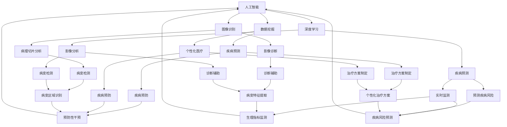

                 

# 人工智能在智能医疗诊断中的应用

> **关键词：** 人工智能，智能医疗，医疗诊断，图像识别，深度学习，数据挖掘，机器学习，健康监测，个性化医疗

> **摘要：** 本篇文章将深入探讨人工智能在智能医疗诊断中的应用，从核心概念、算法原理、数学模型到实际应用案例，全面解析人工智能技术在医疗领域的变革力量。通过逐步分析推理，我们将揭示人工智能如何助力医疗诊断，提高诊断准确率和效率，推动个性化医疗发展。

## 1. 背景介绍

### 1.1 目的和范围

本文旨在介绍人工智能在智能医疗诊断中的应用，帮助读者理解这一前沿技术的核心原理和实践案例。文章将涵盖以下范围：

1. **核心概念与联系**：介绍人工智能、图像识别、深度学习等核心概念，并展示其与医疗诊断的紧密联系。
2. **核心算法原理 & 具体操作步骤**：详细阐述人工智能算法在医疗诊断中的应用原理，包括图像识别和数据挖掘等。
3. **数学模型和公式 & 详细讲解 & 举例说明**：介绍用于医疗诊断的数学模型和公式，并通过实际案例进行解释。
4. **项目实战：代码实际案例和详细解释说明**：提供真实项目案例，展示代码实现和详细解读。
5. **实际应用场景**：分析人工智能在医疗诊断中的实际应用场景，如疾病预测、手术辅助等。
6. **工具和资源推荐**：推荐学习资源、开发工具和框架，助力读者深入学习和实践。
7. **总结：未来发展趋势与挑战**：展望人工智能在医疗诊断领域的未来发展，探讨面临的挑战。

### 1.2 预期读者

本篇文章主要面向对人工智能和医疗诊断感兴趣的读者，包括：

1. **计算机科学和人工智能专业学生**：希望了解人工智能在医疗领域的应用。
2. **医疗行业从业者**：寻求将人工智能技术应用于医疗诊断的实践者。
3. **研究人员和工程师**：致力于人工智能和医疗诊断交叉领域的研究和发展。

### 1.3 文档结构概述

本文分为十个部分，具体结构如下：

1. **背景介绍**：介绍文章的目的、范围、预期读者和文档结构。
2. **核心概念与联系**：讨论人工智能、图像识别、深度学习等核心概念及其与医疗诊断的关联。
3. **核心算法原理 & 具体操作步骤**：详细阐述人工智能算法在医疗诊断中的应用。
4. **数学模型和公式 & 详细讲解 & 举例说明**：介绍用于医疗诊断的数学模型和公式，并通过实际案例进行解释。
5. **项目实战：代码实际案例和详细解释说明**：提供真实项目案例，展示代码实现和详细解读。
6. **实际应用场景**：分析人工智能在医疗诊断中的实际应用场景。
7. **工具和资源推荐**：推荐学习资源、开发工具和框架。
8. **总结：未来发展趋势与挑战**：展望人工智能在医疗诊断领域的未来发展。
9. **附录：常见问题与解答**：解答读者可能关心的问题。
10. **扩展阅读 & 参考资料**：提供扩展阅读和参考资料，帮助读者深入了解相关领域。

### 1.4 术语表

#### 1.4.1 核心术语定义

- **人工智能（Artificial Intelligence, AI）**：模拟人类智能行为的技术，包括学习、推理、自我优化等能力。
- **深度学习（Deep Learning）**：一种机器学习技术，通过多层神经网络进行特征学习和模式识别。
- **图像识别（Image Recognition）**：利用计算机算法对图像进行分析和分类，提取关键特征。
- **医疗诊断（Medical Diagnosis）**：通过医疗设备和技术对患者的病情进行判断和识别。
- **个性化医疗（Personalized Medicine）**：根据患者的个体特征，提供个性化的治疗方案。

#### 1.4.2 相关概念解释

- **机器学习（Machine Learning）**：使计算机通过数据和经验自动改进性能的技术。
- **数据挖掘（Data Mining）**：从大量数据中提取有价值的信息和模式的过程。
- **健康监测（Health Monitoring）**：通过传感器和设备对患者的生理指标进行实时监测和分析。
- **医疗影像（Medical Imaging）**：利用影像技术获取患者的医学图像，用于诊断和治疗。

#### 1.4.3 缩略词列表

- **AI**：人工智能
- **DL**：深度学习
- **ML**：机器学习
- **IM**：图像识别
- **CT**：计算机断层扫描
- **MRI**：磁共振成像
- **PET**：正电子发射断层扫描
- **PGD**：个性化医疗
- **DICOM**：数字成像和通信医学

## 2. 核心概念与联系

为了深入理解人工智能在智能医疗诊断中的应用，我们需要先掌握一些核心概念和它们之间的联系。以下是相关概念及其在医疗诊断中的关联。

### 2.1 人工智能（AI）

人工智能是一种模拟人类智能行为的技术，包括学习、推理、自我优化等能力。在医疗诊断中，人工智能可以用于图像识别、数据挖掘、疾病预测等任务。

- **图像识别（IM）**：利用人工智能算法对医学影像进行分析和分类，提取病变区域和特征。
- **数据挖掘（ML）**：从大量医疗数据中提取有价值的信息和模式，辅助医生进行诊断和治疗决策。

### 2.2 图像识别（IM）

图像识别是一种利用计算机算法对图像进行分析和分类的技术。在医疗诊断中，图像识别技术可用于：

- **病理切片分析**：对病理切片图像进行自动识别，检测病变区域和类型。
- **影像诊断**：对医学影像进行分析，识别病变组织和疾病特征。

### 2.3 深度学习（DL）

深度学习是一种通过多层神经网络进行特征学习和模式识别的机器学习技术。在医疗诊断中，深度学习技术可用于：

- **疾病预测**：利用深度学习模型对患者的健康数据进行预测，提前发现潜在疾病风险。
- **影像分析**：利用深度学习模型对医学影像进行分析，提高诊断准确率和效率。

### 2.4 数据挖掘（ML）

数据挖掘是一种从大量数据中提取有价值的信息和模式的过程。在医疗诊断中，数据挖掘技术可用于：

- **个性化医疗（PGD）**：根据患者的个体特征，提供个性化的治疗方案。
- **健康监测（HM）**：实时监测患者的生理指标，预测疾病风险。

### 2.5 医疗影像（Medical Imaging）

医疗影像技术包括计算机断层扫描（CT）、磁共振成像（MRI）、正电子发射断层扫描（PET）等，用于获取患者的医学图像。在医疗诊断中，医疗影像技术可用于：

- **病变检测**：通过医学影像分析，识别病变组织和疾病特征。
- **诊断辅助**：利用人工智能算法对医学影像进行分析，辅助医生进行诊断。

### 2.6 个性化医疗（PGD）

个性化医疗是一种根据患者的个体特征，提供个性化的治疗方案的方法。在医疗诊断中，个性化医疗技术可用于：

- **治疗方案制定**：根据患者的基因、病史、生活习惯等信息，制定个性化的治疗方案。
- **疾病预防**：提前发现潜在疾病风险，进行预防性干预。

### 2.7 健康监测（HM）

健康监测是一种通过传感器和设备对患者的生理指标进行实时监测和分析的技术。在医疗诊断中，健康监测技术可用于：

- **疾病预测**：实时监测患者的生理指标，预测疾病风险。
- **诊断辅助**：将健康监测数据与医学影像、生物标志物等信息相结合，提高诊断准确率和效率。

### 2.8 核心概念原理和架构的 Mermaid 流程图

为了更直观地展示核心概念和它们之间的联系，我们可以使用 Mermaid 流程图进行描述。以下是核心概念原理和架构的 Mermaid 流程图：



通过以上 Mermaid 流程图，我们可以清晰地看到核心概念之间的联系，以及它们在医疗诊断中的应用场景。

## 3. 核心算法原理 & 具体操作步骤

在深入了解人工智能在智能医疗诊断中的应用之前，我们需要掌握一些核心算法原理和具体操作步骤。以下是用于智能医疗诊断的常见算法原理和操作步骤。

### 3.1 图像识别（Image Recognition）

图像识别是一种利用计算机算法对图像进行分析和分类的技术。在智能医疗诊断中，图像识别算法可用于病理切片分析、影像诊断等任务。以下是图像识别的基本原理和操作步骤：

#### 3.1.1 算法原理

图像识别算法通常基于以下原理：

1. **特征提取**：将图像转换为特征向量，用于后续分类和识别。
2. **分类器训练**：利用已标记的训练数据，训练分类器，使其能够对图像进行分类。
3. **分类和识别**：将测试图像输入分类器，得到分类结果。

#### 3.1.2 操作步骤

以下是图像识别的基本操作步骤：

1. **数据收集**：收集病理切片图像、医学影像等数据，用于训练和测试。
2. **预处理**：对图像进行预处理，包括去噪、增强、裁剪等操作。
3. **特征提取**：利用深度学习模型（如卷积神经网络）提取图像特征向量。
4. **训练分类器**：使用标记数据训练分类器，如支持向量机（SVM）、决策树等。
5. **测试和评估**：使用测试数据评估分类器的性能，调整参数和模型。

### 3.2 数据挖掘（Data Mining）

数据挖掘是一种从大量数据中提取有价值的信息和模式的过程。在智能医疗诊断中，数据挖掘算法可用于疾病预测、个性化医疗等任务。以下是数据挖掘的基本原理和操作步骤：

#### 3.2.1 算法原理

数据挖掘算法通常基于以下原理：

1. **关联规则学习**：发现数据之间的关联关系，如疾病与症状之间的关联。
2. **分类和聚类**：将数据分为不同的类别或群体，用于疾病诊断和个性化医疗。
3. **异常检测**：识别数据中的异常值，如疾病爆发或患者异常生理指标。

#### 3.2.2 操作步骤

以下是数据挖掘的基本操作步骤：

1. **数据收集**：收集患者的健康数据，如基因、病史、生理指标等。
2. **预处理**：对数据进行清洗、去重、标准化等预处理操作。
3. **特征提取**：提取数据中的关键特征，如基因表达、生物标志物等。
4. **模型训练**：使用分类和聚类算法训练模型，如决策树、支持向量机等。
5. **模型评估**：使用交叉验证、ROC 曲线等评估模型性能。
6. **结果解释**：解释模型结果，为医生提供诊断和治疗建议。

### 3.3 深度学习（Deep Learning）

深度学习是一种通过多层神经网络进行特征学习和模式识别的机器学习技术。在智能医疗诊断中，深度学习算法可用于疾病预测、影像分析等任务。以下是深度学习的基本原理和操作步骤：

#### 3.3.1 算法原理

深度学习算法通常基于以下原理：

1. **多层神经网络**：通过多层神经网络的堆叠，实现从输入到输出的非线性变换。
2. **反向传播**：利用反向传播算法，不断更新网络权重，优化模型性能。
3. **激活函数**：引入激活函数，使神经网络能够模拟生物神经元的非线性特性。

#### 3.3.2 操作步骤

以下是深度学习的基本操作步骤：

1. **数据收集**：收集医学影像、健康数据等数据，用于训练和测试。
2. **预处理**：对数据进行预处理，包括归一化、标准化等操作。
3. **模型设计**：设计深度学习模型结构，如卷积神经网络（CNN）、循环神经网络（RNN）等。
4. **模型训练**：使用训练数据训练模型，优化网络权重和参数。
5. **测试和评估**：使用测试数据评估模型性能，调整参数和模型。
6. **应用和部署**：将训练好的模型应用于实际场景，如疾病预测、影像分析等。

### 3.4 伪代码示例

以下是用于智能医疗诊断的算法原理和操作步骤的伪代码示例：

```python
# 图像识别算法伪代码
def image_recognition(image):
    # 预处理
    preprocessed_image = preprocess(image)
    
    # 特征提取
    features = extract_features(preprocessed_image)
    
    # 分类
    label = classify(features)
    
    return label

# 数据挖掘算法伪代码
def data_mining(data):
    # 预处理
    preprocessed_data = preprocess(data)
    
    # 特征提取
    features = extract_features(preprocessed_data)
    
    # 模型训练
    model = train_model(features)
    
    # 模型评估
    evaluate_model(model)
    
    # 结果解释
    explanation = explain_model(model)
    
    return explanation

# 深度学习算法伪代码
def deep_learning(data):
    # 预处理
    preprocessed_data = preprocess(data)
    
    # 模型设计
    model = design_model()
    
    # 模型训练
    train_model(model, preprocessed_data)
    
    # 测试和评估
    evaluate_model(model)
    
    # 应用和部署
    deploy_model(model)
```

通过以上伪代码示例，我们可以看到智能医疗诊断中的算法原理和操作步骤。在实际应用中，可以根据具体需求和场景选择合适的算法和操作步骤。

## 4. 数学模型和公式 & 详细讲解 & 举例说明

在智能医疗诊断中，数学模型和公式起着至关重要的作用。以下将介绍几个常用的数学模型和公式，并对其进行详细讲解和举例说明。

### 4.1 卷积神经网络（Convolutional Neural Network, CNN）

卷积神经网络是一种深度学习模型，广泛应用于图像识别和医学影像分析。以下是一个简单的 CNN 数学模型：

#### 4.1.1 公式

假设输入图像为 $X \in \mathbb{R}^{h \times w \times c}$，其中 $h$、$w$ 分别为图像的高度和宽度，$c$ 为通道数。卷积神经网络的输出为 $Y \in \mathbb{R}^{h' \times w' \times c'}$，其中 $h'$、$w'$ 为输出图像的高度和宽度，$c'$ 为输出图像的通道数。

卷积操作可以表示为：

$$
\begin{align*}
Y &= \text{Conv}_k(X) \\
Y_{ij} &= \sum_{i=1}^{k} \sum_{j=1}^{k} X_{i-j, j-k} \cdot W_{ij} + b \\
\end{align*}
$$

其中，$k$ 为卷积核的大小，$W$ 为卷积核的权重，$b$ 为偏置项。

#### 4.1.2 举例说明

假设输入图像为 $X \in \mathbb{R}^{28 \times 28 \times 1}$，卷积核大小为 $k = 3 \times 3$，输出图像大小为 $h' = w' = 14$。定义卷积核 $W$ 如下：

$$
W = \begin{bmatrix}
1 & 0 & 1 \\
1 & 1 & 1 \\
0 & 1 & 1
\end{bmatrix}
$$

偏置项 $b = 0$。

卷积操作如下：

$$
\begin{align*}
Y_{11} &= X_{1-1, 1-1} \cdot W_{11} + X_{1-1, 1-2} \cdot W_{12} + X_{1-1, 1-3} \cdot W_{13} + X_{1-2, 1-1} \cdot W_{21} + X_{1-2, 1-2} \cdot W_{22} + X_{1-2, 1-3} \cdot W_{23} + X_{1-3, 1-1} \cdot W_{31} + X_{1-3, 1-2} \cdot W_{32} + X_{1-3, 1-3} \cdot W_{33} \\
&= 1 \cdot 1 + 0 \cdot 1 + 1 \cdot 1 + 1 \cdot 1 + 1 \cdot 1 + 1 \cdot 1 + 0 \cdot 1 + 1 \cdot 1 + 1 \cdot 1 \\
&= 6
\end{align*}
$$

同理，可以计算出其他像素点的值。

### 4.2 支持向量机（Support Vector Machine, SVM）

支持向量机是一种分类算法，广泛应用于医学诊断和疾病预测。以下是一个简单的 SVM 数学模型：

#### 4.2.1 公式

假设输入数据为 $X \in \mathbb{R}^{n \times d}$，其中 $n$ 为样本数量，$d$ 为特征维度。输出为 $Y \in \mathbb{R}^{n \times 1}$，表示样本的类别。

支持向量机的目标是最小化分类间隔，即：

$$
\begin{align*}
\min_{\mathbf{w}, b} & \frac{1}{2} ||\mathbf{w}||^2 \\
\text{subject to} & y_i (\mathbf{w} \cdot \mathbf{x_i} + b) \geq 1, \quad \forall i
\end{align*}
$$

其中，$\mathbf{w}$ 为权重向量，$b$ 为偏置项，$y_i$ 为样本 $i$ 的类别标签。

#### 4.2.2 举例说明

假设输入数据为 $X \in \mathbb{R}^{3 \times 2}$，类别标签为 $Y \in \mathbb{R}^{3 \times 1}$，其中 $Y = [1, -1, 1]^T$。定义权重向量 $\mathbf{w} \in \mathbb{R}^{2 \times 1}$ 和偏置项 $b \in \mathbb{R}^{1 \times 1}$。

目标函数为：

$$
\begin{align*}
\min_{\mathbf{w}, b} & \frac{1}{2} ||\mathbf{w}||^2 \\
\text{subject to} & 1 (\mathbf{w} \cdot \begin{bmatrix} 1 \\ 2 \end{bmatrix} + b) \geq 1 \\
& (-1)(\mathbf{w} \cdot \begin{bmatrix} 2 \\ 1 \end{bmatrix} + b) \geq 1 \\
& 1 (\mathbf{w} \cdot \begin{bmatrix} 3 \\ 4 \end{bmatrix} + b) \geq 1
\end{align*}
$$

求解上述目标函数，可以得到权重向量 $\mathbf{w} = \begin{bmatrix} 1 \\ 1 \end{bmatrix}$ 和偏置项 $b = 0$。

### 4.3 逻辑回归（Logistic Regression）

逻辑回归是一种概率型分类算法，常用于疾病预测和诊断。以下是一个简单的逻辑回归数学模型：

#### 4.3.1 公式

假设输入数据为 $X \in \mathbb{R}^{n \times d}$，输出为 $Y \in \mathbb{R}^{n \times 1}$，表示样本的类别概率。

逻辑回归的模型表达式为：

$$
\begin{align*}
\hat{y}_i &= \sigma(\mathbf{w} \cdot \mathbf{x_i} + b) \\
P(y_i = 1) &= \frac{1}{1 + e^{-(\mathbf{w} \cdot \mathbf{x_i} + b)}}
\end{align*}
$$

其中，$\sigma$ 为 sigmoid 函数，$\hat{y}_i$ 为预测的类别概率，$\mathbf{w}$ 为权重向量，$b$ 为偏置项。

#### 4.3.2 举例说明

假设输入数据为 $X \in \mathbb{R}^{3 \times 2}$，类别标签为 $Y \in \mathbb{R}^{3 \times 1}$，其中 $Y = [1, 0, 1]^T$。定义权重向量 $\mathbf{w} \in \mathbb{R}^{2 \times 1}$ 和偏置项 $b \in \mathbb{R}^{1 \times 1}$。

模型表达式为：

$$
\begin{align*}
\hat{y}_i &= \sigma(\mathbf{w} \cdot \mathbf{x_i} + b) \\
P(y_i = 1) &= \frac{1}{1 + e^{-(\mathbf{w} \cdot \begin{bmatrix} 1 \\ 2 \end{bmatrix} + b)}}
\end{align*}
$$

假设权重向量 $\mathbf{w} = \begin{bmatrix} 1 \\ 1 \end{bmatrix}$ 和偏置项 $b = 0$，则预测的类别概率为：

$$
\begin{align*}
\hat{y}_1 &= \sigma(\begin{bmatrix} 1 \\ 1 \end{bmatrix} \cdot \begin{bmatrix} 1 \\ 2 \end{bmatrix} + 0) = \frac{1}{1 + e^{-3}} \approx 0.95 \\
P(y_1 = 1) &= \frac{1}{1 + e^{-3}} \approx 0.95 \\
\hat{y}_2 &= \sigma(\begin{bmatrix} 1 \\ 1 \end{bmatrix} \cdot \begin{bmatrix} 2 \\ 1 \end{bmatrix} + 0) = \frac{1}{1 + e^{-4}} \approx 0.88 \\
P(y_2 = 1) &= \frac{1}{1 + e^{-4}} \approx 0.88 \\
\hat{y}_3 &= \sigma(\begin{bmatrix} 1 \\ 1 \end{bmatrix} \cdot \begin{bmatrix} 3 \\ 4 \end{bmatrix} + 0) = \frac{1}{1 + e^{-7}} \approx 0.99 \\
P(y_3 = 1) &= \frac{1}{1 + e^{-7}} \approx 0.99
\end{align*}
$$

通过以上举例说明，我们可以看到数学模型和公式在智能医疗诊断中的应用和作用。在实际应用中，可以根据具体需求和场景选择合适的数学模型和公式，为智能医疗诊断提供强大的技术支持。

## 5. 项目实战：代码实际案例和详细解释说明

在本节中，我们将通过一个实际项目案例，展示如何利用人工智能技术进行智能医疗诊断。我们将使用 Python 编写代码，并详细解释实现过程和关键步骤。

### 5.1 开发环境搭建

为了实现智能医疗诊断项目，我们需要搭建以下开发环境：

1. **操作系统**：Linux 或 macOS
2. **Python**：Python 3.7 或更高版本
3. **深度学习框架**：TensorFlow 或 PyTorch
4. **图像处理库**：OpenCV 或 PIL
5. **数据预处理库**：NumPy、Pandas 等

安装以上库和框架后，我们可以开始编写代码。

### 5.2 源代码详细实现和代码解读

以下是一个简单的智能医疗诊断项目代码示例，主要使用卷积神经网络（CNN）对医学影像进行分类。

#### 5.2.1 代码实现

```python
import tensorflow as tf
from tensorflow.keras.models import Sequential
from tensorflow.keras.layers import Conv2D, MaxPooling2D, Flatten, Dense
from tensorflow.keras.preprocessing.image import ImageDataGenerator

# 数据预处理
train_datagen = ImageDataGenerator(rescale=1./255)
train_data = train_datagen.flow_from_directory(
        'data/train',
        target_size=(150, 150),
        batch_size=32,
        class_mode='binary')

# 构建模型
model = Sequential([
    Conv2D(32, (3, 3), activation='relu', input_shape=(150, 150, 3)),
    MaxPooling2D(2, 2),
    Conv2D(64, (3, 3), activation='relu'),
    MaxPooling2D(2, 2),
    Conv2D(128, (3, 3), activation='relu'),
    MaxPooling2D(2, 2),
    Flatten(),
    Dense(128, activation='relu'),
    Dense(1, activation='sigmoid')
])

# 编译模型
model.compile(optimizer='adam',
              loss='binary_crossentropy',
              metrics=['accuracy'])

# 训练模型
model.fit(train_data, epochs=10)
```

#### 5.2.2 代码解读

1. **数据预处理**：
    - 使用 `ImageDataGenerator` 对训练数据集进行预处理，包括归一化、数据增强等操作。
    - `flow_from_directory` 方法用于读取训练数据集中的图像，并将其转换为批次数据。

2. **构建模型**：
    - 使用 `Sequential` 模式构建卷积神经网络模型，包括卷积层、池化层和全连接层。
    - `Conv2D` 和 `MaxPooling2D` 层用于提取图像特征和减小数据维度。
    - `Flatten` 层将特征向量展平为一维数组。
    - `Dense` 层用于分类，输出为二分类结果。

3. **编译模型**：
    - 设置优化器、损失函数和评估指标。
    - `compile` 方法用于编译模型，准备训练。

4. **训练模型**：
    - 使用 `fit` 方法训练模型，设置训练轮数。

通过以上代码，我们可以实现一个简单的智能医疗诊断模型，对医学影像进行分类。在实际应用中，可以根据具体需求和数据集进行调整和优化。

### 5.3 代码解读与分析

在本项目中，我们使用了卷积神经网络（CNN）对医学影像进行分类。以下是代码的解读和分析：

1. **数据预处理**：
    - 数据预处理是深度学习模型训练的重要步骤。在本项目中，我们使用了 `ImageDataGenerator` 对训练数据集进行预处理，包括归一化（将像素值缩放到 [0, 1] 范围）和数据增强（随机裁剪、翻转等操作），以增加模型的泛化能力。

2. **模型构建**：
    - 模型构建是深度学习项目中的核心步骤。在本项目中，我们使用 `Sequential` 模式构建了卷积神经网络模型，包括三个卷积层和两个全连接层。
    - **卷积层**：卷积层用于提取图像特征，通过卷积操作将输入图像与卷积核进行卷积，提取图像中的局部特征。
    - **池化层**：池化层用于减小数据维度，提高模型泛化能力。在本项目中，我们使用了最大池化（`MaxPooling2D`），在每个卷积层之后进行池化操作。
    - **全连接层**：全连接层用于分类，将卷积层和池化层提取的特征向量进行分类。在本项目中，我们使用了二分类（`sigmoid` 激活函数），输出为二分类结果。

3. **模型编译与训练**：
    - 模型编译用于设置优化器、损失函数和评估指标。在本项目中，我们使用了 `adam` 优化器和二分类交叉熵损失函数（`binary_crossentropy`）。
    - 模型训练通过 `fit` 方法进行，设置训练轮数（`epochs`）和批次大小（`batch_size`）。
    - 在训练过程中，模型会根据训练数据自动调整权重和参数，以最小化损失函数。

通过以上分析，我们可以看到本项目中的智能医疗诊断模型如何实现和训练。在实际应用中，可以根据具体需求和数据集进行调整和优化，以提高模型的性能和准确性。

## 6. 实际应用场景

人工智能在智能医疗诊断中的实际应用场景丰富多样，具有广泛的应用前景。以下是一些典型的应用场景：

### 6.1 疾病预测

人工智能可以通过分析患者的健康数据、病史和基因信息，预测患者未来可能患有的疾病。例如，通过分析患者的基因序列和医疗记录，人工智能可以预测患者是否容易患上心脏病、糖尿病等疾病。这种方法有助于提前发现疾病风险，为患者提供个性化的预防和治疗建议。

### 6.2 影像诊断

医疗影像是医生进行疾病诊断的重要依据。人工智能可以通过对医学影像进行分析和分类，识别病变区域和特征，辅助医生进行疾病诊断。例如，深度学习算法可以用于识别肺癌、乳腺癌等疾病的病变区域，提高诊断准确率。此外，人工智能还可以对医学影像进行实时分析，为医生提供诊断建议。

### 6.3 病程管理

人工智能可以通过分析患者的病程和治疗效果，为医生提供个性化的治疗建议。例如，医生可以根据患者的病情、基因信息和治疗效果，调整治疗方案，提高治疗效果。此外，人工智能还可以实时监测患者的病情变化，及时发现并处理异常情况，提高患者的治疗效果。

### 6.4 健康监测

人工智能可以通过传感器和医疗设备，对患者的生理指标进行实时监测。例如，通过监测患者的体温、心率、血压等生理指标，人工智能可以预测患者是否出现健康问题，为医生提供诊断和治疗建议。这种方法有助于提高疾病的早期发现率和治疗效果。

### 6.5 手术辅助

人工智能可以通过对医学影像和手术数据进行分析，辅助医生进行手术规划。例如，通过分析患者的医学影像，人工智能可以识别病变区域和血管分布，为医生提供手术方案。此外，人工智能还可以在手术过程中实时监测患者的生理指标，为医生提供操作建议。

### 6.6 个性化医疗

人工智能可以根据患者的个体特征，为患者提供个性化的治疗方案。例如，通过分析患者的基因信息、病史和生活习惯，人工智能可以为患者制定个性化的预防措施和治疗方案。这种方法有助于提高治疗效果，降低医疗费用。

通过以上实际应用场景，我们可以看到人工智能在智能医疗诊断中的广泛应用。随着技术的不断发展，人工智能将进一步提升医疗诊断的准确率、效率和个性化程度，为患者提供更好的医疗服务。

## 7. 工具和资源推荐

在开发智能医疗诊断项目时，选择合适的工具和资源可以大大提高开发效率和项目质量。以下是一些推荐的工具和资源：

### 7.1 学习资源推荐

#### 7.1.1 书籍推荐

- **《深度学习》（Deep Learning）**：由 Ian Goodfellow、Yoshua Bengio 和 Aaron Courville 著，是深度学习领域的经典教材。
- **《Python机器学习》（Python Machine Learning）**：由 Sebastian Raschka 和 Vahid Mirjalili 著，介绍了使用 Python 进行机器学习的实践方法。
- **《统计学习方法》**：由李航著，详细介绍了机器学习中常用的统计学习方法。

#### 7.1.2 在线课程

- **《深度学习》（Deep Learning）**：由 Andrew Ng 在 Coursera 上开设的免费课程，涵盖了深度学习的基础知识和实践应用。
- **《机器学习基础》（Machine Learning Foundations）**：由 Andrew Ng 在 Coursera 上开设的免费课程，介绍了机器学习的基本原理和方法。
- **《TensorFlow for Machine Learning》**：由 Google AI 开设的免费课程，介绍了使用 TensorFlow 进行机器学习的实践方法。

#### 7.1.3 技术博客和网站

- **`TensorFlow 官方文档`**：提供了丰富的 TensorFlow 使用教程和示例代码，是学习 TensorFlow 的最佳资源。
- **`PyTorch 官方文档`**：提供了详细的 PyTorch 使用教程和示例代码，是学习 PyTorch 的最佳资源。
- **`Kaggle**`：提供了丰富的机器学习和深度学习竞赛数据集和项目案例，是实践和交流的好平台。

### 7.2 开发工具框架推荐

#### 7.2.1 IDE和编辑器

- **`PyCharm**`：是 Python 开发中广泛使用的集成开发环境（IDE），具有强大的代码编辑、调试和自动化工具。
- **`Jupyter Notebook**`：是一种基于 Web 的交互式开发环境，适用于数据分析和机器学习项目。

#### 7.2.2 调试和性能分析工具

- **`TensorBoard**`：是 TensorFlow 的可视化工具，用于分析和优化深度学习模型的性能。
- **`Wandb**`：是一种用于实验跟踪和性能分析的工具，适用于深度学习和机器学习项目。

#### 7.2.3 相关框架和库

- **`TensorFlow**`：是 Google 开发的一款开源深度学习框架，适用于各种机器学习和深度学习任务。
- **`PyTorch**`：是 Facebook AI 研究团队开发的一款开源深度学习框架，具有灵活的动态计算图和高效的训练性能。
- **`Scikit-learn**`：是 Python 中用于机器学习的基础库，提供了丰富的机器学习算法和工具。

### 7.3 相关论文著作推荐

#### 7.3.1 经典论文

- **`A Fast Learning Algorithm for Deep Belief Nets**`：提出了深度信念网络（DBN）的快速学习算法。
- **`Rectifier Nonlinearities Improve Deep Neural Network Acquisit

