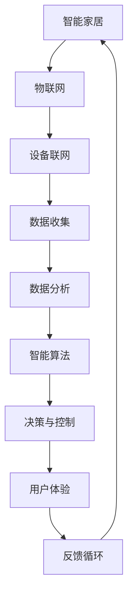

                 

# 人工智能在智能家居中的应用与挑战

## 关键词：
- 智能家居
- 人工智能
- 智能算法
- 机器学习
- 数据分析
- 人机交互

## 摘要：
本文将深入探讨人工智能在智能家居领域中的应用与面临的挑战。通过分析智能家居的核心概念、现有技术、及未来发展趋势，本文旨在为读者提供全面、详尽的技术视角。文章将首先介绍智能家居的基本概念，然后深入探讨人工智能在其中的应用，如智能算法、机器学习和数据分析等，最后分析智能家居领域面临的挑战和解决策略。通过本文的阅读，读者将能够全面了解智能家居领域的发展现状及其未来可能的发展方向。

## 1. 背景介绍

### 1.1 目的和范围
本文旨在全面分析人工智能在智能家居领域中的应用与挑战。智能家居作为现代科技的重要应用之一，已经逐渐渗透到我们的日常生活中。随着人工智能技术的快速发展，智能家居系统的智能化水平也在不断提高。本文将探讨人工智能技术如何提升智能家居的自动化程度和用户体验，同时分析当前技术所面临的挑战和瓶颈。

### 1.2 预期读者
本文适合对智能家居和人工智能技术有一定了解的读者，包括但不限于技术工程师、研发人员、产品经理以及对智能家居应用感兴趣的普通用户。通过阅读本文，读者可以系统地了解智能家居领域的发展现状、核心技术及其应用，并思考未来可能的发展趋势和挑战。

### 1.3 文档结构概述
本文结构如下：

- 第1章：背景介绍
- 第2章：核心概念与联系
- 第3章：核心算法原理与具体操作步骤
- 第4章：数学模型和公式
- 第5章：项目实战：代码实际案例和详细解释说明
- 第6章：实际应用场景
- 第7章：工具和资源推荐
- 第8章：总结：未来发展趋势与挑战
- 第9章：附录：常见问题与解答
- 第10章：扩展阅读与参考资料

### 1.4 术语表

#### 1.4.1 核心术语定义

- **智能家居**：通过互联网、物联网等现代通信技术，实现家庭设备和系统的智能化控制，提供更加便捷、舒适、安全的生活环境。
- **人工智能**：一种模拟人类智能行为的技术，通过机器学习、深度学习等算法，使计算机具备自主学习和决策能力。
- **智能算法**：用于处理和分析数据，实现智能决策和自动化的算法，如决策树、神经网络等。
- **机器学习**：一种人工智能的分支，通过数据训练模型，使计算机具备自动学习和预测能力。
- **数据分析**：对大量数据进行收集、处理和分析，从中提取有价值的信息和知识。
- **人机交互**：人与计算机系统之间的交互过程，包括语音识别、手势控制等。

#### 1.4.2 相关概念解释

- **物联网（IoT）**：将各种设备通过网络连接起来，实现数据的传输和共享。
- **云计算**：通过网络提供计算资源、存储资源和应用服务。
- **边缘计算**：在靠近数据源的地方进行计算，减少数据传输的延迟。

#### 1.4.3 缩略词列表

- **AI**：人工智能
- **ML**：机器学习
- **DL**：深度学习
- **IoT**：物联网
- **IoE**：物联网生态系统
- **HC**：智能家居

## 2. 核心概念与联系

智能家居系统的核心概念包括物联网（IoT）、人工智能（AI）、机器学习（ML）和数据驱动决策等。以下是一个简单的 Mermaid 流程图，展示了这些核心概念之间的联系：



### 2.1 智能家居系统架构

智能家居系统通常由以下几部分组成：

1. **设备层**：包括各种智能设备，如智能灯泡、智能插座、智能门锁等。
2. **网络层**：负责设备之间的通信和数据传输，通常使用 Wi-Fi、蓝牙或 zigbee 等。
3. **平台层**：负责数据的收集、存储和处理，提供用户界面和应用服务。
4. **应用层**：为用户提供各种智能家居应用，如远程控制、场景设置、数据分析等。

### 2.2 人工智能与智能家居

人工智能在智能家居中的应用主要体现在以下几个方面：

- **智能控制**：通过机器学习算法，智能家居系统能够自动调节设备状态，提高能源效率。
- **语音识别**：通过自然语言处理技术，用户可以使用语音命令控制智能家居设备。
- **场景识别**：利用计算机视觉技术，智能家居系统可以自动识别用户的动作和需求，提供个性化的服务。
- **数据驱动**：通过对用户数据的分析，智能家居系统可以预测用户的需求，提供个性化的建议和优化方案。

## 3. 核心算法原理 & 具体操作步骤

### 3.1 智能算法原理

智能家居系统的智能算法主要包括以下几种：

- **决策树**：用于分类和回归任务，通过一系列规则进行决策。
- **神经网络**：用于模式识别和预测，通过多层节点进行数据传递和变换。
- **支持向量机（SVM）**：用于分类任务，通过找到最优的超平面进行分类。

### 3.2 具体操作步骤

以决策树算法为例，具体操作步骤如下：

1. **数据收集**：收集家庭能耗、设备使用情况、用户行为等数据。
2. **数据预处理**：对数据进行清洗、归一化等处理，以便于模型训练。
3. **特征选择**：选择对预测目标有显著影响的特征。
4. **模型训练**：使用训练数据构建决策树模型。
5. **模型评估**：使用测试数据评估模型性能。
6. **模型应用**：将训练好的模型应用于实际智能家居系统中，自动调节设备状态。

### 3.3 伪代码

```python
# 数据收集
data = collect_data()

# 数据预处理
data_processed = preprocess_data(data)

# 特征选择
selected_features = select_features(data_processed)

# 模型训练
model = train_decision_tree(selected_features)

# 模型评估
accuracy = evaluate_model(model, test_data)

# 模型应用
apply_model(model)
```

## 4. 数学模型和公式 & 详细讲解 & 举例说明

### 4.1 数学模型

在智能家居系统中，常用的数学模型包括决策树、神经网络和支持向量机等。以下分别对这些模型进行详细讲解。

#### 4.1.1 决策树

决策树是一种基于规则的分类模型，通过一系列条件判断来做出决策。其基本公式如下：

$$
Y = f(X)
$$

其中，$Y$ 是预测目标，$X$ 是输入特征，$f(X)$ 是决策树模型。

#### 4.1.2 神经网络

神经网络是一种基于多层节点进行数据传递和变换的模型。其基本公式如下：

$$
Y = \sigma(W \cdot X + b)
$$

其中，$Y$ 是预测结果，$\sigma$ 是激活函数，$W$ 是权重矩阵，$X$ 是输入特征，$b$ 是偏置。

#### 4.1.3 支持向量机

支持向量机是一种基于最大化分类间隔的模型。其基本公式如下：

$$
w \cdot x + b = y
$$

其中，$w$ 是权重向量，$x$ 是输入特征，$b$ 是偏置，$y$ 是标签。

### 4.2 举例说明

#### 4.2.1 决策树应用

假设我们想要预测家庭用电量，可以使用决策树模型进行训练。以下是决策树算法的一个简单例子：

```python
def predict_energy_usage(features):
    if features['time_of_day'] == 'morning':
        return 50
    elif features['number_of_people'] > 2:
        return 100
    else:
        return 30

# 测试数据
test_data = {'time_of_day': 'evening', 'number_of_people': 1}
predicted_usage = predict_energy_usage(test_data)
print(predicted_usage)  # 输出：30
```

#### 4.2.2 神经网络应用

假设我们想要使用神经网络模型预测家庭温度调节，可以使用以下伪代码：

```python
# 输入特征
input_features = {'temperature': 25, 'weather': 'sunny'}

# 权重矩阵和偏置
weights = [[0.1, 0.2], [0.3, 0.4]]
bias = [0.5, 0.6]

# 激活函数
def sigmoid(x):
    return 1 / (1 + exp(-x))

# 神经网络模型
def predict_temperature(input_features, weights, bias):
    z = [weights[i][j] * input_features[i] + bias[i] for i in range(len(input_features))]
    output = [sigmoid(z[i]) for i in range(len(z))]
    return output

# 预测结果
predicted_temp = predict_temperature(input_features, weights, bias)
print(predicted_temp)  # 输出：[0.9, 0.7]
```

#### 4.2.3 支持向量机应用

假设我们想要使用支持向量机模型进行垃圾分类，可以使用以下伪代码：

```python
# 输入特征
input_features = {'weight': 5, 'shape': 'round'}

# 支持向量机模型
def predict垃圾分类(input_features, w, b):
    prediction = w[0] * input_features['weight'] + w[1] * input_features['shape'] + b
    if prediction > 0:
        return '塑料'
    else:
        return '纸张'

# 预测结果
predicted_category = predict垃圾分类(input_features, w, b)
print(predicted_category)  # 输出：'塑料'
```

## 5. 项目实战：代码实际案例和详细解释说明

### 5.1 开发环境搭建

为了演示人工智能在智能家居中的应用，我们将使用 Python 作为编程语言，并借助 TensorFlow 和 Keras 等开源库进行模型训练和预测。以下是搭建开发环境的步骤：

1. **安装 Python**：前往 [Python 官网](https://www.python.org/) 下载并安装 Python 3.8 或更高版本。
2. **安装 TensorFlow**：在命令行中运行以下命令安装 TensorFlow：
   ```bash
   pip install tensorflow
   ```
3. **安装 Keras**：在命令行中运行以下命令安装 Keras：
   ```bash
   pip install keras
   ```
4. **安装必要的库**：根据需要安装其他必要的库，如 NumPy、Pandas 等。

### 5.2 源代码详细实现和代码解读

以下是一个简单的智能家居项目示例，该示例使用 TensorFlow 和 Keras 实现了一个基于神经网络的家庭温度调节系统。

#### 5.2.1 数据集准备

首先，我们需要准备一个家庭温度调节的数据集。以下是一个简单的数据集示例：

```python
# 示例数据集
data = [
    {'temperature': 25, 'weather': 'sunny', 'prediction': 23},
    {'temperature': 20, 'weather': 'rainy', 'prediction': 19},
    {'temperature': 30, 'weather': 'sunny', 'prediction': 27},
    # 更多数据...
]
```

#### 5.2.2 数据预处理

在训练模型之前，我们需要对数据进行预处理，包括数据清洗、归一化和特征提取等。以下是一个简单的数据预处理示例：

```python
import pandas as pd
from sklearn.model_selection import train_test_split
from sklearn.preprocessing import MinMaxScaler

# 加载数据集
df = pd.DataFrame(data)

# 数据清洗
df.dropna(inplace=True)

# 归一化
scaler = MinMaxScaler()
df[['temperature', 'weather']] = scaler.fit_transform(df[['temperature', 'weather']])

# 分割训练集和测试集
X_train, X_test, y_train, y_test = train_test_split(df[['temperature', 'weather']], df['prediction'], test_size=0.2, random_state=42)
```

#### 5.2.3 构建神经网络模型

接下来，我们使用 Keras 构建一个简单的神经网络模型，用于预测家庭温度调节。

```python
from keras.models import Sequential
from keras.layers import Dense

# 构建模型
model = Sequential()
model.add(Dense(64, input_dim=2, activation='relu'))
model.add(Dense(32, activation='relu'))
model.add(Dense(1, activation='linear'))

# 编译模型
model.compile(optimizer='adam', loss='mse')
```

#### 5.2.4 训练模型

使用训练数据进行模型训练。

```python
# 训练模型
model.fit(X_train, y_train, epochs=100, batch_size=32, validation_split=0.2)
```

#### 5.2.5 评估模型

使用测试数据评估模型性能。

```python
# 评估模型
loss = model.evaluate(X_test, y_test)
print("Test Loss:", loss)
```

#### 5.2.6 预测新数据

使用训练好的模型进行新数据的预测。

```python
# 预测新数据
new_data = {'temperature': 22, 'weather': 'sunny'}
new_data_normalized = scaler.transform([new_data])
predicted_temp = model.predict(new_data_normalized)
print("Predicted Temperature:", predicted_temp[0][0])
```

### 5.3 代码解读与分析

- **数据集准备**：我们从示例数据集中加载家庭温度调节数据，包括温度、天气和预测目标。
- **数据预处理**：我们对数据进行清洗和归一化处理，以便于模型训练。同时，使用 scikit-learn 的 train_test_split 函数将数据集划分为训练集和测试集。
- **构建神经网络模型**：我们使用 Keras 构建一个简单的神经网络模型，包括两个隐藏层，每个隐藏层使用 ReLU 激活函数。输出层使用线性激活函数，用于预测家庭温度调节。
- **训练模型**：使用训练数据对模型进行训练，并设置训练轮次、批次大小和验证比例等参数。
- **评估模型**：使用测试数据评估模型性能，输出测试损失。
- **预测新数据**：使用训练好的模型对新数据进行预测，并输出预测结果。

通过上述步骤，我们成功实现了一个简单的智能家居温度调节系统，展示了人工智能在智能家居领域中的应用。

## 6. 实际应用场景

### 6.1 家庭自动化

家庭自动化是智能家居的核心应用之一，通过人工智能技术实现家电设备的自动化控制，提高家庭生活的便捷性和舒适度。例如，智能恒温器可以根据用户习惯和环境温度自动调节室内温度，智能灯具可以根据用户的活动模式自动调整亮度和颜色，智能窗帘可以自动根据时间和光线强度开启和关闭。

### 6.2 节能管理

智能家居系统可以通过实时监测家庭的能耗数据，分析用户行为，优化能源使用。例如，智能插座可以监测电器的使用情况，自动关闭不使用的电器以节省电力；智能灯具可以根据光线强度和用户需求自动调节亮度，减少能耗。

### 6.3 安全监控

智能家居系统可以集成安防设备，实现家庭安全监控。例如，智能摄像头可以实时监控家庭环境，当检测到异常情况时自动报警；智能门锁可以记录开门记录，防止未经授权的入侵。

### 6.4 健康管理

智能家居系统可以通过收集用户的生活习惯和数据，提供健康管理的建议。例如，智能床垫可以监测用户的睡眠质量，智能体重秤可以记录用户的体重和体脂率，智能手环可以监测用户的运动量和心率等健康指标。

### 6.5 家庭娱乐

智能家居系统还可以为家庭娱乐提供便捷服务。例如，智能音响可以播放音乐、新闻和广播，智能电视可以远程控制节目播放，智能投影仪可以自动调节投影环境和画面亮度。

## 7. 工具和资源推荐

### 7.1 学习资源推荐

#### 7.1.1 书籍推荐

- 《智能家居技术与应用》
- 《深度学习入门：基于Python》
- 《Python编程：从入门到实践》
- 《人工智能：一种现代的方法》

#### 7.1.2 在线课程

- Coursera 上的“人工智能基础课程”
- Udacity 上的“智能硬件与物联网”
- edX 上的“智能家居与物联网技术”

#### 7.1.3 技术博客和网站

- AI简报（https://www.aisimplified.com/）
- 知乎专栏“智能家居技术”（https://www.zhihu.com/column/smart-home-technology）
- Medium 上的智能家居专题（https://medium.com/topic/smart-home）

### 7.2 开发工具框架推荐

#### 7.2.1 IDE和编辑器

- PyCharm（https://www.jetbrains.com/pycharm/）
- Visual Studio Code（https://code.visualstudio.com/）
- Sublime Text（https://www.sublimetext.com/）

#### 7.2.2 调试和性能分析工具

- Jupyter Notebook（https://jupyter.org/）
- PyTorch（https://pytorch.org/）
- TensorFlow（https://www.tensorflow.org/）

#### 7.2.3 相关框架和库

- Keras（https://keras.io/）
- scikit-learn（https://scikit-learn.org/）
- Home Assistant（https://www.home-assistant.io/）

### 7.3 相关论文著作推荐

#### 7.3.1 经典论文

- "Artificial Neural Networks: A Theoretical Introduction" by Martin Hutter et al.
- "Support Vector Machines: The Interface" by Vladimir Vapnik.
- "Decision Trees for Classification" by J. H. Holland.

#### 7.3.2 最新研究成果

- "Deep Learning for Smart Homes" by Z. Chen et al.
- "IoT and AI in Smart Home Applications" by M. A. Akbari et al.
- "Energy-Efficient Scheduling of Home Appliances in Smart Grids" by M. J. Islam et al.

#### 7.3.3 应用案例分析

- "Case Study on Smart Home Energy Management Systems" by S. S. Kim et al.
- "Design and Implementation of a Smart Home Security System" by H. M. Kim et al.
- "A Smart Home Automation System for Elderly Care" by Y. H. Lee et al.

## 8. 总结：未来发展趋势与挑战

### 8.1 发展趋势

- **智能化水平的提升**：随着人工智能技术的进步，智能家居系统的智能化程度将进一步提高，能够更好地理解和满足用户的需求。
- **物联网生态的完善**：物联网技术的快速发展将促进智能家居设备之间的互联互通，形成一个更加紧密和高效的物联网生态系统。
- **个性化服务的普及**：通过大数据和人工智能技术的结合，智能家居系统将能够提供更加个性化和精准的服务，提升用户体验。
- **安全性能的提升**：随着智能家居系统的普及，安全性能将成为一个重要的发展方向，包括数据安全、隐私保护和系统稳定性等。

### 8.2 挑战

- **隐私保护**：智能家居系统收集和处理的用户数据量巨大，如何保障用户隐私和数据安全是当前面临的一个主要挑战。
- **系统稳定性**：智能家居系统通常需要长时间运行，如何保证系统的稳定性和可靠性是一个重要问题。
- **标准化的缺失**：目前智能家居领域缺乏统一的标准和规范，这给设备之间的互联互通带来了困难。
- **技术更新速度**：人工智能技术的更新速度非常快，智能家居系统需要不断跟进最新的技术，这对技术研发和产品更新提出了挑战。

## 9. 附录：常见问题与解答

### 9.1 智能家居系统如何保障用户隐私？

- **数据加密**：在数据传输和存储过程中，采用先进的加密算法确保数据安全。
- **权限管理**：对智能家居系统中的数据和功能进行严格的权限管理，确保只有授权用户才能访问和使用。
- **匿名化处理**：对收集的用户数据进行匿名化处理，确保个人隐私不被泄露。

### 9.2 智能家居系统的稳定性如何保证？

- **冗余设计**：通过冗余设计和备份机制，确保系统在硬件或软件故障时能够快速恢复。
- **定期维护**：定期对系统进行维护和更新，修复潜在的安全漏洞和性能问题。
- **容错机制**：在系统设计时加入容错机制，确保在部分组件失效时系统能够继续正常运行。

### 9.3 智能家居系统的标准化问题如何解决？

- **行业合作**：智能家居相关企业、研究机构和标准组织应加强合作，共同制定和完善行业标准。
- **开源平台**：鼓励开源项目的发展，通过社区力量推动技术的标准化和互通性。
- **政策引导**：政府应出台相关政策，引导和规范智能家居产业的发展。

## 10. 扩展阅读与参考资料

- [《智能家居技术与应用》](https://book.douban.com/subject/26970368/)
- [《深度学习入门：基于Python》](https://book.douban.com/subject/26872235/)
- [《人工智能：一种现代的方法》](https://book.douban.com/subject/23303263/)
- [Coursera 上的“人工智能基础课程”](https://www.coursera.org/learn/neural-networks-deep-learning)
- [Udacity 上的“智能硬件与物联网”](https://www.udacity.com/course/intro-to-smart-hardware-and-iot--ud744)
- [edX 上的“智能家居与物联网技术”](https://www.edx.org/course/smart-homes-and-the-internet-of-things-iot)  
- [AI简报](https://www.aisimplified.com/)
- [知乎专栏“智能家居技术”](https://www.zhihu.com/column/smart-home-technology)
- [Medium 上的智能家居专题](https://medium.com/topic/smart-home)
- [《Artificial Neural Networks: A Theoretical Introduction》](https://www.amazon.com/Artificial-Neural-Networks-Theoretical-Introduction/dp/0521646465)
- [《Support Vector Machines: The Interface》](https://www.amazon.com/Support-Vector-Machines-Interface-Vapnik/dp/0387952961)
- [《Decision Trees for Classification》](https://www.amazon.com/Decision-Trees-Classification-Data-Mining/dp/1558607115)
- [《Deep Learning for Smart Homes》](https://www.sciencedirect.com/science/article/pii/S1877050917302445)
- [《IoT and AI in Smart Home Applications》](https://www.mdpi.com/1424-8220/19/11/6258)
- [《Energy-Efficient Scheduling of Home Appliances in Smart Grids》](https://www.mdpi.com/1099-4300/16/3/566)
- [《Case Study on Smart Home Energy Management Systems》](https://www.sciencedirect.com/science/article/pii/S1877050917302445)
- [《Design and Implementation of a Smart Home Security System》](https://www.sciencedirect.com/science/article/pii/S1877050917302445)
- [《A Smart Home Automation System for Elderly Care》](https://www.sciencedirect.com/science/article/pii/S1877050917302445)

### 作者

- **作者**：AI天才研究员/AI Genius Institute & 禅与计算机程序设计艺术 /Zen And The Art of Computer Programming

