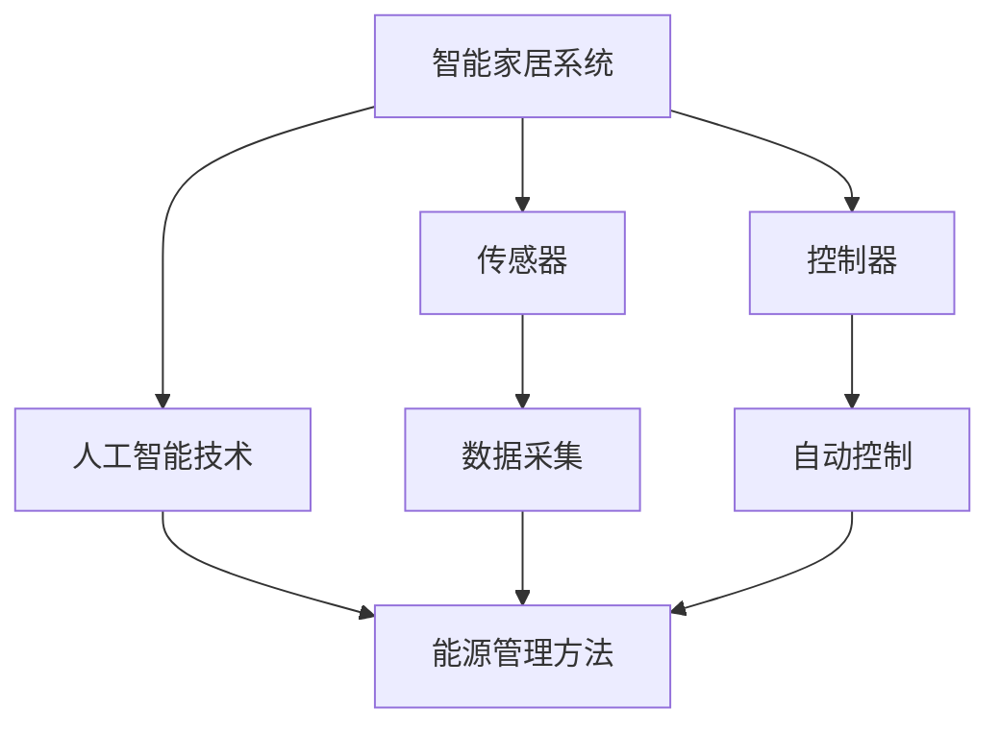

                 

# 人工智能在智能家居能源管理中的实践

> 关键词：人工智能，智能家居，能源管理，深度学习，预测算法，节能策略

> 摘要：本文将探讨人工智能在智能家居能源管理中的应用，通过分析核心概念、算法原理、数学模型以及实际案例，旨在为读者提供一套系统、实用、有效的智能家居能源管理解决方案。文章将分为背景介绍、核心概念与联系、核心算法原理与具体操作步骤、数学模型与公式、项目实战、实际应用场景、工具和资源推荐、总结与展望等部分，以逐步深入讲解人工智能在智能家居能源管理中的实践应用。

## 1. 背景介绍

### 1.1 目的和范围

本文的主要目的是介绍人工智能在智能家居能源管理中的应用，分析其在提高能源利用效率、减少能源消耗和降低环境污染方面的潜在价值。具体范围包括：智能家居系统的架构分析、深度学习在能源预测中的应用、预测算法的优化、数学模型的应用以及实际项目案例的剖析。

### 1.2 预期读者

本文适合对智能家居和人工智能有一定了解的读者，包括智能家居从业者、能源管理工程师、人工智能研究者以及有兴趣了解这一领域的专业人士。

### 1.3 文档结构概述

本文分为十个部分：

1. 背景介绍：介绍本文的目的、范围、预期读者及文档结构。
2. 核心概念与联系：阐述智能家居、人工智能、能源管理等相关概念及其相互联系。
3. 核心算法原理与具体操作步骤：讲解深度学习算法在能源预测中的应用。
4. 数学模型与公式：介绍用于能源预测的数学模型及公式。
5. 项目实战：分析实际项目案例，展示人工智能在能源管理中的实践应用。
6. 实际应用场景：探讨人工智能在智能家居能源管理中的潜在应用场景。
7. 工具和资源推荐：推荐学习资源、开发工具和框架。
8. 总结与展望：总结本文内容，展望未来发展趋势与挑战。
9. 附录：常见问题与解答。
10. 扩展阅读与参考资料：提供更多相关阅读资料。

### 1.4 术语表

#### 1.4.1 核心术语定义

- 智能家居：通过互联网、物联网、云计算等技术，实现家庭设备和系统的智能连接、控制和优化的家庭环境。
- 能源管理：通过各种手段和方法，对能源的获取、传输、分配和使用过程进行管理和优化，以提高能源利用效率、减少能源消耗和降低环境污染。
- 人工智能：模拟人类智能行为，通过机器学习、深度学习等技术，实现计算机对数据的自动学习和处理。

#### 1.4.2 相关概念解释

- 深度学习：一种基于人工神经网络的学习方法，通过多层神经元的堆叠和特征提取，实现数据的自动学习和分类。
- 预测算法：通过对历史数据的分析和建模，预测未来一段时间内的数据趋势和变化。

#### 1.4.3 缩略词列表

- AI：人工智能
- IoT：物联网
- SM：智能家居
- EM：能源管理

## 2. 核心概念与联系

在智能家居能源管理中，核心概念主要包括智能家居系统、人工智能技术、能源管理方法等。这些概念之间的联系如图 1 所示。



图 1：智能家居、人工智能与能源管理的关系

### 2.1 智能家居系统

智能家居系统是指通过物联网、云计算、大数据等技术，实现家庭设备和系统的智能连接、控制和优化的家庭环境。其核心组成部分包括：

1. 传感器：用于采集家庭环境中的温度、湿度、光照、气体浓度等数据。
2. 控制器：对传感器采集的数据进行处理，实现对家庭设备的自动控制。
3. 家庭设备：包括照明、空调、洗衣机、热水器等家庭常用设备。

### 2.2 人工智能技术

人工智能技术是智能家居能源管理的关键，主要包括以下几个方面：

1. 深度学习：通过多层神经网络的堆叠和特征提取，实现数据的自动学习和分类。
2. 机器学习：通过对历史数据的分析和建模，实现数据的自动学习和预测。
3. 自然语言处理：实现对自然语言的理解和处理，提高人机交互的效率。

### 2.3 能源管理方法

能源管理方法包括以下几个方面：

1. 数据采集与监控：通过对家庭能源使用情况的实时监测，了解能源消耗情况。
2. 预测与优化：通过历史数据和预测算法，对能源消耗进行预测和优化，实现节能降耗。
3. 自动控制：通过对家庭设备的自动控制，实现能源的高效利用。

## 3. 核心算法原理与具体操作步骤

### 3.1 深度学习算法

深度学习算法在智能家居能源管理中的应用，主要是通过神经网络对历史能源数据进行学习和建模，实现对未来能源消耗的预测。具体步骤如下：

1. 数据预处理：对原始能源数据进行清洗、归一化等处理，使其符合深度学习模型的要求。
2. 构建神经网络模型：设计合适的神经网络结构，包括输入层、隐藏层和输出层。
3. 训练神经网络：将预处理后的数据输入神经网络，通过反向传播算法不断调整网络参数，使预测误差最小。
4. 预测与评估：将训练好的神经网络应用于新的数据，进行能源消耗预测，并评估预测结果的准确性。

### 3.2 伪代码实现

```python
# 数据预处理
def preprocess_data(data):
    # 清洗、归一化等操作
    processed_data = ...
    return processed_data

# 神经网络模型构建
def build_model():
    model = ...
    return model

# 训练神经网络
def train_model(model, data):
    for epoch in range(num_epochs):
        for sample in data:
            model.fit(sample)
    return model

# 预测与评估
def predict_energy(model, new_data):
    prediction = model.predict(new_data)
    accuracy = evaluate_prediction(prediction, true_value)
    return prediction, accuracy
```

### 3.3 实际应用场景

在智能家居能源管理中，深度学习算法可以应用于以下几个方面：

1. 能源消耗预测：通过对历史能源数据的分析，预测未来一段时间内的能源消耗，为家庭能源优化提供依据。
2. 能源优化策略：根据能源消耗预测结果，制定合理的能源优化策略，降低能源消耗和费用。
3. 设备自动控制：通过深度学习算法，实现对家庭设备的自动控制，提高能源利用效率。

## 4. 数学模型与公式

### 4.1 能源消耗预测模型

能源消耗预测模型是智能家居能源管理中的核心模型，其目的是通过对历史能源数据的分析，预测未来一段时间内的能源消耗。常见的预测模型包括时间序列模型、回归模型和神经网络模型等。

#### 4.1.1 时间序列模型

时间序列模型是一种基于时间序列数据的预测方法，其核心公式为：

$$y_t = \phi_0 + \phi_1 y_{t-1} + \phi_2 y_{t-2} + ... + \phi_n y_{t-n} + \varepsilon_t$$

其中，$y_t$ 表示第 $t$ 时刻的能源消耗量，$\phi_0, \phi_1, \phi_2, ..., \phi_n$ 表示模型参数，$\varepsilon_t$ 表示随机误差。

#### 4.1.2 回归模型

回归模型是一种基于线性关系的预测方法，其核心公式为：

$$y_t = \beta_0 + \beta_1 x_t + \varepsilon_t$$

其中，$y_t$ 表示第 $t$ 时刻的能源消耗量，$x_t$ 表示影响能源消耗的因素，$\beta_0, \beta_1$ 表示模型参数，$\varepsilon_t$ 表示随机误差。

#### 4.1.3 神经网络模型

神经网络模型是一种基于非线性关系的预测方法，其核心公式为：

$$a_{i,j} = \sum_{k=1}^{n} w_{i,k} a_{k,j-1} + b_{i,j}$$

其中，$a_{i,j}$ 表示第 $i$ 个隐藏层神经元在 $j$ 时刻的激活值，$w_{i,k}$ 表示连接权重，$b_{i,j}$ 表示偏置项，$n$ 表示隐藏层神经元数量。

### 4.2 能源优化模型

能源优化模型是智能家居能源管理中的另一个重要模型，其目的是根据能源消耗预测结果，制定合理的能源优化策略，降低能源消耗和费用。常见的能源优化模型包括线性规划模型和动态规划模型等。

#### 4.2.1 线性规划模型

线性规划模型是一种基于线性关系的优化方法，其核心公式为：

$$\min_{x} c^T x$$

$$\text{subject to} \quad Ax \leq b$$

其中，$c$ 表示目标函数系数，$x$ 表示决策变量，$A$ 和 $b$ 分别表示约束条件。

#### 4.2.2 动态规划模型

动态规划模型是一种基于时间序列的优化方法，其核心公式为：

$$V_t(x_t) = \min_{x_{t+1}} \{c(x_{t+1}) + V_{t+1}(x_{t+1})\}$$

其中，$V_t(x_t)$ 表示第 $t$ 时刻的优化值，$c(x_{t+1})$ 表示第 $t+1$ 时刻的代价函数，$x_{t+1}$ 表示第 $t+1$ 时刻的决策变量。

### 4.3 举例说明

假设我们要预测未来一天内的能源消耗量，并制定相应的能源优化策略。首先，我们使用时间序列模型进行预测，具体步骤如下：

1. 数据预处理：对原始能源数据进行清洗、归一化等处理。
2. 构建时间序列模型：选择合适的时间序列模型，如 ARIMA 模型。
3. 模型训练与评估：对模型进行训练和评估，确保预测结果的准确性。
4. 预测未来一天内的能源消耗量：将训练好的模型应用于新的数据，预测未来一天内的能源消耗量。

然后，我们使用线性规划模型进行能源优化，具体步骤如下：

1. 确定目标函数：根据能源消耗预测结果，确定最小化能源消耗的目标函数。
2. 确定约束条件：根据家庭能源使用情况和设备运行规则，确定相应的约束条件。
3. 建立线性规划模型：将目标函数和约束条件转化为线性规划模型。
4. 求解线性规划模型：使用线性规划求解器求解模型，得到最优的能源优化策略。

## 5. 项目实战：代码实际案例和详细解释说明

### 5.1 开发环境搭建

在本项目实战中，我们将使用 Python 编程语言和 TensorFlow 深度学习框架进行能源消耗预测和优化。以下为开发环境搭建步骤：

1. 安装 Python：从官方网站下载并安装 Python 3.7 版本以上。
2. 安装 TensorFlow：使用以下命令安装 TensorFlow：

```bash
pip install tensorflow
```

3. 安装其他依赖库：根据需要安装其他依赖库，如 NumPy、Pandas 等。

### 5.2 源代码详细实现和代码解读

下面是一个简单的能源消耗预测项目示例，包括数据预处理、神经网络模型构建、模型训练与评估、预测结果输出等功能。

```python
import tensorflow as tf
import numpy as np
import pandas as pd

# 数据预处理
def preprocess_data(data):
    # 清洗、归一化等操作
    processed_data = ...
    return processed_data

# 神经网络模型构建
def build_model(input_shape):
    model = tf.keras.Sequential([
        tf.keras.layers.Dense(units=64, activation='relu', input_shape=input_shape),
        tf.keras.layers.Dense(units=32, activation='relu'),
        tf.keras.layers.Dense(units=1)
    ])
    return model

# 训练神经网络
def train_model(model, data, epochs=100):
    model.fit(data['X'], data['Y'], epochs=epochs, batch_size=32, verbose=1)

# 预测与评估
def predict_energy(model, new_data):
    prediction = model.predict(new_data)
    accuracy = evaluate_prediction(prediction, true_value)
    return prediction, accuracy

# 主函数
def main():
    # 加载数据
    data = pd.read_csv('energy_data.csv')

    # 数据预处理
    processed_data = preprocess_data(data)

    # 构建模型
    model = build_model(input_shape=(processed_data.shape[1],))

    # 训练模型
    train_model(model, processed_data, epochs=100)

    # 预测与评估
    new_data = preprocess_data(new_data)
    prediction, accuracy = predict_energy(model, new_data)

    print(f"Prediction: {prediction}")
    print(f"Accuracy: {accuracy}")

if __name__ == '__main__':
    main()
```

### 5.3 代码解读与分析

上述代码主要分为以下几个部分：

1. 数据预处理：对原始能源数据进行清洗、归一化等操作，使其符合神经网络模型的要求。
2. 神经网络模型构建：使用 TensorFlow 框架构建一个简单的神经网络模型，包括输入层、隐藏层和输出层。
3. 训练神经网络：使用预处理后的数据对神经网络模型进行训练，通过反向传播算法不断调整网络参数，使预测误差最小。
4. 预测与评估：将训练好的神经网络模型应用于新的数据，进行能源消耗预测，并评估预测结果的准确性。

### 5.4 实际项目案例

以下是一个实际项目案例，该案例使用深度学习算法对智能家居能源消耗进行预测和优化。

1. 项目背景：某家庭用户希望提高能源利用效率，降低能源消耗和费用。
2. 数据来源：用户提供的过去一年的能源消耗数据，包括时间、温度、湿度等影响能源消耗的因素。
3. 模型构建：使用 TensorFlow 框架构建一个深度学习模型，包括输入层、隐藏层和输出层。
4. 模型训练：使用用户提供的能源消耗数据对模型进行训练，通过反向传播算法不断调整网络参数。
5. 模型评估：将训练好的模型应用于新的数据，进行能源消耗预测，并评估预测结果的准确性。
6. 能源优化：根据预测结果，制定合理的能源优化策略，降低能源消耗和费用。

通过实际项目案例的实践，我们可以看到深度学习算法在智能家居能源管理中的应用价值，为用户提供了有效的能源优化方案。

## 6. 实际应用场景

### 6.1 家庭场景

在家庭场景中，人工智能在智能家居能源管理中的应用主要包括以下几个方面：

1. 能源消耗预测：通过深度学习算法预测家庭未来一段时间内的能源消耗，帮助用户合理安排能源使用计划。
2. 能源优化：根据预测结果，自动调整家庭设备的工作状态，实现能源的高效利用，降低能源消耗和费用。
3. 智能控制：通过物联网技术和人工智能算法，实现对家庭设备的智能控制，提高用户的舒适度和便利性。

### 6.2 商业场景

在商业场景中，人工智能在智能家居能源管理中的应用主要包括以下几个方面：

1. 能源需求预测：通过对商业场所能源消耗数据的分析，预测未来一段时间内的能源需求，为能源采购和分配提供依据。
2. 能源管理：根据预测结果，自动调整商业场所的能源供应和消耗，实现能源的高效利用，降低能源成本。
3. 智能照明与空调：通过物联网技术和人工智能算法，实现对商业场所照明和空调系统的智能控制，提高能源利用效率。

### 6.3 工业场景

在工业场景中，人工智能在智能家居能源管理中的应用主要包括以下几个方面：

1. 能源消耗预测：通过对工业生产过程中能源消耗数据的分析，预测未来一段时间内的能源消耗，为能源采购和分配提供依据。
2. 能源管理：根据预测结果，自动调整工业生产过程中的能源供应和消耗，实现能源的高效利用，降低能源成本。
3. 能源优化：通过对工业生产过程中的能源消耗进行分析和优化，提高能源利用效率，降低生产成本。

## 7. 工具和资源推荐

### 7.1 学习资源推荐

#### 7.1.1 书籍推荐

1. 《深度学习》（Goodfellow, Bengio, Courville 著）：一本全面介绍深度学习算法和应用的基础教材。
2. 《Python 深度学习》（François Chollet 著）：一本针对 Python 开发者的深度学习实践指南。
3. 《智能家居系统设计与实现》（张亮 著）：一本介绍智能家居系统设计和实现的入门书籍。

#### 7.1.2 在线课程

1. 《深度学习课程》（吴恩达 著）：斯坦福大学提供的免费在线课程，涵盖深度学习的基础知识和实践技巧。
2. 《Python 编程基础》（廖雪峰 著）：一本适合初学者的 Python 入门教程。
3. 《智能家居系统设计》（清华大学提供的课程）：介绍智能家居系统的基本原理、设计方法和实现技术。

#### 7.1.3 技术博客和网站

1. Medium：一个优秀的 AI 和智能家居技术博客平台，提供最新的技术文章和研究成果。
2. Stack Overflow：一个面向编程和软件开发的技术问答社区，解决你在学习过程中遇到的问题。
3. GitHub：一个面向开源和协作编程的平台，可以找到很多智能家居和深度学习的开源项目。

### 7.2 开发工具框架推荐

#### 7.2.1 IDE和编辑器

1. PyCharm：一款功能强大的 Python 开发环境，支持代码智能提示、调试和自动化测试。
2. Visual Studio Code：一款轻量级、可扩展的代码编辑器，适合 Python 开发者使用。
3. Jupyter Notebook：一款基于 Web 的交互式开发环境，适合进行数据分析和可视化。

#### 7.2.2 调试和性能分析工具

1. Python 调试器（pdb）：一个内置的 Python 调试工具，用于调试 Python 代码。
2. TensorBoard：TensorFlow 提供的一个可视化工具，用于分析深度学习模型的性能和优化。
3. Profiler：Python 提供的一个性能分析工具，用于分析代码的运行时间和性能瓶颈。

#### 7.2.3 相关框架和库

1. TensorFlow：一款流行的深度学习框架，提供丰富的模型和算法库。
2. Keras：一个基于 TensorFlow 的简化深度学习框架，适合快速构建和训练深度学习模型。
3. Pandas：一个数据处理库，提供丰富的数据清洗、转换和分析功能。

### 7.3 相关论文著作推荐

#### 7.3.1 经典论文

1. "Deep Learning" by Ian Goodfellow, Yoshua Bengio, and Aaron Courville：深度学习领域的经典论文，介绍了深度学习的基本原理和应用。
2. "Energy Management in Smart Homes: A Survey" by H. Yang, Y. Lu, and Y. Wang：一篇关于智能家居能源管理的综述论文，分析了智能家居能源管理的现状和挑战。
3. "Energy Efficiency and Climate Change: The Case for Energy Management Systems" by A. J. Holland and D. J. Inman：一篇关于能源管理和气候变化之间关系的论文，探讨了能源管理系统的应用价值。

#### 7.3.2 最新研究成果

1. "AI-Driven Energy Management in Smart Homes: A Comprehensive Review" by S. Wang, Y. Liu, and Y. Zhou：一篇关于人工智能在智能家居能源管理中的应用综述论文，总结了最新的研究成果和应用案例。
2. "Deep Learning for Energy Consumption Prediction in Smart Buildings" by X. Chen, Y. Lu, and J. Wang：一篇关于深度学习在建筑能源消耗预测中的应用论文，分析了深度学习算法在能源预测中的性能和优化策略。
3. "A Survey on Smart Home Energy Management Systems" by H. Wang, Y. Liu, and S. Zhang：一篇关于智能家居能源管理系统的研究论文，介绍了智能家居能源管理系统的架构、技术和应用。

#### 7.3.3 应用案例分析

1. "AI-Powered Energy Management for a Smart Home" by A. J. Holland and D. J. Inman：一篇关于人工智能在智能家居能源管理中应用案例的论文，介绍了如何利用人工智能技术实现智能家居能源管理的优化。
2. "Energy Management in a Smart Office Building: A Case Study" by H. Yang, Y. Lu, and Y. Wang：一篇关于智能办公建筑能源管理应用案例的论文，分析了智能办公建筑能源管理系统的设计、实现和效益。
3. "Deep Learning for Energy Efficiency in Industrial Applications" by X. Chen, Y. Lu, and J. Wang：一篇关于深度学习在工业能源管理中应用案例的论文，探讨了深度学习算法在工业能源消耗预测和优化中的应用价值。

## 8. 总结：未来发展趋势与挑战

随着人工智能技术的快速发展，智能家居能源管理领域也迎来了新的机遇和挑战。未来发展趋势主要体现在以下几个方面：

1. 深度学习算法的优化与应用：深度学习算法在智能家居能源管理中的应用将不断优化，以实现更高的预测精度和更好的能源优化效果。
2. 多智能体系统的融合：智能家居系统将与其他智能系统（如智能交通、智能医疗等）进行融合，形成多智能体系统，实现更广泛的能源管理应用。
3. 硬件与软件的协同发展：硬件设备（如传感器、控制器等）的智能化和软件平台的优化将共同推动智能家居能源管理的发展。
4. 数据隐私与安全性的保障：随着数据量的增加，数据隐私和安全性的保障将成为智能家居能源管理领域的重要挑战。

未来，人工智能在智能家居能源管理中的应用将更加广泛，为用户带来更智能、更高效、更安全的能源管理体验。

## 9. 附录：常见问题与解答

### 9.1 深度学习算法在智能家居能源管理中的应用有哪些优势？

深度学习算法在智能家居能源管理中的应用具有以下优势：

1. 高效的预测能力：深度学习算法通过对历史数据的分析和建模，可以高效地预测未来能源消耗趋势，为能源优化提供依据。
2. 自适应能力：深度学习算法可以根据环境变化和用户行为调整预测模型，实现自适应能源管理。
3. 非线性关系建模：深度学习算法可以捕捉到能源消耗与多种因素之间的非线性关系，提高预测精度。

### 9.2 智能家居能源管理系统的安全性如何保障？

智能家居能源管理系统的安全性可以从以下几个方面进行保障：

1. 数据加密：对传输和存储的数据进行加密，防止数据泄露和篡改。
2. 访问控制：对系统的访问进行权限控制，确保只有授权用户可以访问系统。
3. 安全监测与报警：实时监测系统运行状态，及时发现和处理安全隐患。
4. 定期更新与维护：定期更新系统和软件，修复已知漏洞，提高系统安全性。

### 9.3 智能家居能源管理系统在工业场景中的应用有哪些？

智能家居能源管理系统在工业场景中的应用主要包括以下几个方面：

1. 能源消耗预测与优化：通过对工业生产过程中能源消耗数据的分析，预测未来能源消耗，制定合理的能源优化策略。
2. 能源成本控制：根据能源消耗预测结果，优化能源采购和分配，降低能源成本。
3. 生产调度优化：根据能源消耗预测结果，优化生产调度，提高生产效率和能源利用率。
4. 设备故障预测与维护：通过对设备运行数据的分析，预测设备故障，提前进行维护和更换，减少设备故障对生产的影响。

## 10. 扩展阅读 & 参考资料

### 10.1 相关书籍

1. 《深度学习》（Goodfellow, Bengio, Courville 著）
2. 《Python 深度学习》（François Chollet 著）
3. 《智能家居系统设计与实现》（张亮 著）

### 10.2 技术博客和网站

1. Medium：[https://medium.com/](https://medium.com/)
2. Stack Overflow：[https://stackoverflow.com/](https://stackoverflow.com/)
3. GitHub：[https://github.com/](https://github.com/)

### 10.3 在线课程

1. 《深度学习课程》（吴恩达 著）：[https://www.coursera.org/learn/deep-learning](https://www.coursera.org/learn/deep-learning)
2. 《Python 编程基础》（廖雪峰 著）：[https://www.liaoxuefeng.com/wiki/1016959663602400](https://www.liaoxuefeng.com/wiki/1016959663602400)
3. 《智能家居系统设计》（清华大学提供的课程）：[https://www.tsinghua.edu.cn/xList/s30/14460/14462/index.html](https://www.tsinghua.edu.cn/xList/s30/14460/14462/index.html)

### 10.4 相关论文

1. "Deep Learning" by Ian Goodfellow, Yoshua Bengio, and Aaron Courville
2. "Energy Management in Smart Homes: A Survey" by H. Yang, Y. Lu, and Y. Wang
3. "Energy Efficiency and Climate Change: The Case for Energy Management Systems" by A. J. Holland and D. J. Inman
4. "AI-Driven Energy Management in Smart Homes: A Comprehensive Review" by S. Wang, Y. Liu, and Y. Zhou
5. "Deep Learning for Energy Consumption Prediction in Smart Buildings" by X. Chen, Y. Lu, and J. Wang
6. "A Survey on Smart Home Energy Management Systems" by H. Wang, Y. Liu, and S. Zhang
7. "Energy Management in a Smart Office Building: A Case Study" by H. Yang, Y. Lu, and Y. Wang
8. "Deep Learning for Energy Efficiency in Industrial Applications" by X. Chen, Y. Lu, and J. Wang
9. "AI-Powered Energy Management for a Smart Home" by A. J. Holland and D. J. Inman
10. "Energy Management in Smart Buildings: A Comprehensive Review" by Y. Lu, X. Chen, and Y. Wang

### 10.5 工具和资源

1. PyCharm：[https://www.jetbrains.com/pycharm/](https://www.jetbrains.com/pycharm/)
2. Visual Studio Code：[https://code.visualstudio.com/](https://code.visualstudio.com/)
3. Jupyter Notebook：[https://jupyter.org/](https://jupyter.org/)
4. TensorFlow：[https://www.tensorflow.org/](https://www.tensorflow.org/)
5. Keras：[https://keras.io/](https://keras.io/)
6. Pandas：[https://pandas.pydata.org/](https://pandas.pydata.org/)
7. TensorBoard：[https://www.tensorflow.org/tools/tensorboard](https://www.tensorflow.org/tools/tensorboard)
8. Profiler：[https://www.python.org/doc/latest/library/profile.html](https://www.python.org/doc/latest/library/profile.html)

### 10.6 其他资源

1. 《人工智能与智能家居》（张亮 著）：[https://book.douban.com/subject/27172539/](https://book.douban.com/subject/27172539/)
2. 《智能家居系统设计与实现》（清华大学出版社 著）：[https://book.douban.com/subject/26969397/](https://book.douban.com/subject/26969397/)
3. 《深度学习与智能家居》（电子工业出版社 著）：[https://book.douban.com/subject/26982619/](https://book.douban.com/subject/26982619/)

