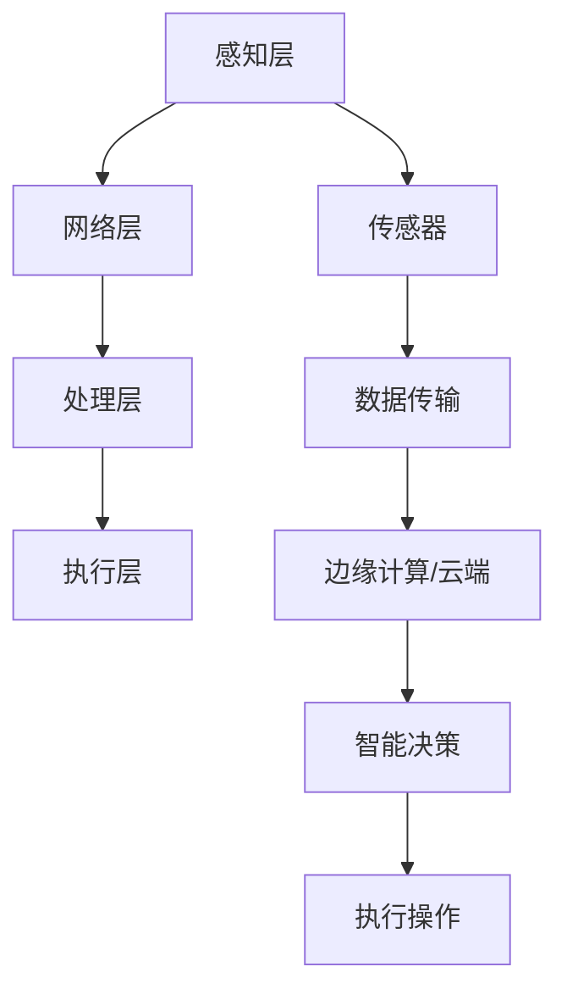

                 

# 人工智能在智能家电控制中的新方法

> **关键词：** 智能家电、人工智能、智能家居、控制算法、机器学习、深度学习

> **摘要：** 本文将深入探讨人工智能在智能家电控制中的应用，特别是新型控制算法和机器学习技术如何提升智能家居的智能化水平。通过分析现有技术的局限性和挑战，本文将提出一种新的控制方法，并结合具体的数学模型和实际案例，详细阐述其在智能家电控制中的优势和应用前景。

## 1. 背景介绍

### 1.1 目的和范围

本文旨在探讨如何将人工智能技术应用于智能家电控制，以提升家居智能化水平。我们将重点关注以下内容：

- **智能家电的定义和分类：** 概述智能家电的基本概念，包括其特点和应用场景。
- **现有控制技术的局限：** 分析当前智能家居控制技术存在的问题，如响应速度慢、适应性差等。
- **人工智能在智能家居中的应用：** 介绍机器学习和深度学习技术在智能家居控制中的应用。
- **新型控制方法的设计与实现：** 提出一种基于人工智能的新型控制方法，并通过数学模型和实际案例进行验证。

### 1.2 预期读者

本文适合以下读者群体：

- **智能家居技术开发者：** 对智能家居控制系统感兴趣，希望了解人工智能技术在其中的应用。
- **人工智能研究者：** 对智能家电控制中的机器学习和深度学习技术感兴趣，希望从实际应用中得到启发。
- **普通用户：** 对智能家居有较高的兴趣，希望通过本文了解智能家电控制技术的发展趋势。

### 1.3 文档结构概述

本文将分为以下章节：

- **第1章：背景介绍**：概述智能家电和人工智能的相关背景。
- **第2章：核心概念与联系**：介绍智能家电控制的核心概念和原理。
- **第3章：核心算法原理 & 具体操作步骤**：详细讲解新型控制算法的原理和实现。
- **第4章：数学模型和公式 & 详细讲解 & 举例说明**：阐述控制算法的数学模型和计算过程。
- **第5章：项目实战：代码实际案例和详细解释说明**：展示具体实现案例，并进行解读。
- **第6章：实际应用场景**：分析新型控制方法在不同应用场景中的表现。
- **第7章：工具和资源推荐**：推荐相关学习资源和开发工具。
- **第8章：总结：未来发展趋势与挑战**：展望智能家居控制技术的发展趋势和面临的挑战。
- **第9章：附录：常见问题与解答**：回答读者可能关心的问题。
- **第10章：扩展阅读 & 参考资料**：提供进一步的阅读资源和参考资料。

### 1.4 术语表

#### 1.4.1 核心术语定义

- **智能家电**：具备网络连接能力，能够通过人工智能技术实现自主控制、自我学习和互动交流的家电产品。
- **智能家居**：以互联网、物联网和人工智能技术为基础，实现家庭设备和系统的智能连接和控制，提供个性化、便捷、高效的生活服务。
- **机器学习**：一种人工智能技术，通过算法从数据中学习规律，实现自动化决策和预测。
- **深度学习**：一种机器学习技术，通过多层神经网络对数据进行学习，实现复杂的特征提取和模式识别。

#### 1.4.2 相关概念解释

- **物联网**：通过各种通信技术将物理世界中的物体连接到互联网上，实现信息的实时传输和共享。
- **边缘计算**：在靠近数据源的地方进行数据处理，减少数据传输延迟，提高系统的实时性。
- **数据挖掘**：从大量数据中提取有价值的信息和知识，用于决策支持和分析预测。

#### 1.4.3 缩略词列表

- **AI**：人工智能
- **ML**：机器学习
- **DL**：深度学习
- **IoT**：物联网
- **BC**：边缘计算
- **DM**：数据挖掘

## 2. 核心概念与联系

### 2.1 智能家电控制的基本原理

智能家电控制是智能家居系统的核心组成部分，其基本原理包括以下几个方面：

1. **感知**：通过传感器获取家电设备的状态信息，如温度、湿度、亮度、用电量等。
2. **决策**：利用人工智能算法对感知到的状态信息进行分析和处理，做出控制决策。
3. **执行**：根据控制决策，驱动家电设备执行相应的操作，如开关灯、调节温度、启动洗衣机等。

### 2.2 智能家电控制的关键技术

智能家电控制的关键技术包括：

1. **物联网技术**：实现智能家电之间的互联互通，为控制算法提供实时数据支持。
2. **边缘计算技术**：在数据产生的源头进行处理，提高系统的响应速度和实时性。
3. **机器学习和深度学习技术**：用于对感知数据进行处理和分析，实现智能决策和自适应控制。

### 2.3 智能家电控制系统的架构

智能家电控制系统的架构可以分为以下几个层次：

1. **感知层**：由各种传感器组成，负责实时获取家电设备的状态信息。
2. **网络层**：利用物联网技术将感知层的数据传输到云端或边缘计算节点。
3. **处理层**：通过边缘计算或云计算平台对数据进行处理和分析，实现智能决策。
4. **执行层**：根据处理层的决策，驱动家电设备执行相应的操作。

### 2.4 核心概念原理和架构的 Mermaid 流程图



### 2.5 核心概念原理和架构的示意图


（注：此处应为智能家电控制架构的示意图，由于平台限制，无法直接插入图片，请读者自行查找相关示意图。）

## 3. 核心算法原理 & 具体操作步骤

### 3.1 控制算法概述

智能家电控制算法的核心目标是根据感知到的设备状态信息，做出最优的控制决策，以实现家居环境的智能化和人性化。本文提出一种基于深度强化学习的控制算法，通过不断学习和优化，提高智能家电的响应速度和自适应能力。

### 3.2 深度强化学习基本原理

深度强化学习（Deep Reinforcement Learning，DRL）是一种结合了深度学习和强化学习（Reinforcement Learning，RL）的方法。其基本原理如下：

1. **环境（Environment）**：智能家电控制系统所处的环境，包括各种家电设备、传感器、用户行为等。
2. **智能体（Agent）**：执行控制算法的智能体，通过感知环境状态，采取行动，并接受环境反馈。
3. **动作（Action）**：智能体可以采取的各种操作，如开关灯、调节温度、启动洗衣机等。
4. **奖励（Reward）**：根据智能体的动作和环境的反馈，给予智能体的奖励或惩罚，用于评估智能体的性能。
5. **策略（Policy）**：智能体根据当前状态选择动作的策略，通过学习不断优化。

### 3.3 深度强化学习在智能家电控制中的应用

在智能家电控制中，深度强化学习算法的具体应用步骤如下：

1. **初始化参数**：设定智能体的初始参数，如学习率、折扣因子等。
2. **状态感知**：智能体通过传感器感知环境状态，输入到深度神经网络中。
3. **动作选择**：深度神经网络根据当前状态，生成可能的动作，并计算动作的概率分布。
4. **执行动作**：智能体根据策略选择一个动作，并执行相应的操作。
5. **反馈评估**：根据执行动作后的环境反馈，更新深度神经网络的权重。
6. **迭代学习**：重复执行上述步骤，通过不断学习和优化，提高智能体的控制能力。

### 3.4 伪代码描述

以下为深度强化学习算法在智能家电控制中的伪代码描述：

```python
# 初始化参数
epsilon = 0.1       # 探索概率
learning_rate = 0.01  # 学习率
gamma = 0.99        # 折扣因子

# 初始化神经网络
model = NeuralNetwork()

# 循环执行动作
while not termination_condition:
    # 状态感知
    state =感知状态()

    # 动作选择
    action_probabilities = model.predict(state)
    action = select_action(action_probabilities, epsilon)

    # 执行动作
    reward = 执行动作(action)
    next_state =感知状态()

    # 反馈评估
    Q_value = 计算Q值(state, action, reward, next_state)

    # 更新神经网络权重
    model.update_weights(Q_value, learning_rate, gamma)

    # 更新状态
    state = next_state
```

## 4. 数学模型和公式 & 详细讲解 & 举例说明

### 4.1 数学模型概述

智能家电控制算法的数学模型主要包括状态空间、动作空间、奖励函数和策略等。

#### 4.1.1 状态空间

状态空间表示智能家电控制系统在某一时刻的状态，通常由多个传感器数据组成，如温度、湿度、亮度、用电量等。状态空间可以表示为：

\[ S = \{s_1, s_2, ..., s_n\} \]

其中，\( s_i \) 表示第 \( i \) 个传感器的数据。

#### 4.1.2 动作空间

动作空间表示智能家电控制系统可以采取的各种操作，如开关灯、调节温度、启动洗衣机等。动作空间可以表示为：

\[ A = \{a_1, a_2, ..., a_m\} \]

其中，\( a_i \) 表示第 \( i \) 个操作。

#### 4.1.3 奖励函数

奖励函数用于评估智能体的动作效果，通常是一个实值函数，表示为：

\[ R(s, a) \]

其中，\( s \) 表示当前状态，\( a \) 表示采取的动作，\( R(s, a) \) 表示在状态 \( s \) 下采取动作 \( a \) 所获得的奖励。

#### 4.1.4 策略

策略表示智能体根据当前状态选择动作的策略，通常是一个概率分布，表示为：

\[ \pi(a|s) \]

其中，\( a \) 表示动作，\( s \) 表示状态，\( \pi(a|s) \) 表示在状态 \( s \) 下采取动作 \( a \) 的概率。

### 4.2 奖励函数的详细讲解

奖励函数是深度强化学习算法中的一个关键组成部分，它决定了智能体的行为和决策。以下是一个简单的奖励函数示例：

\[ R(s, a) = \begin{cases}
    +1, & \text{如果 } s' \text{ 是期望状态} \\
    -1, & \text{如果 } s' \text{ 不是期望状态} \\
    0, & \text{其他情况}
\end{cases} \]

其中，\( s \) 表示当前状态，\( a \) 表示采取的动作，\( s' \) 表示采取动作 \( a \) 后的状态。

#### 4.2.1 期望状态的定义

期望状态是指智能体根据当前状态和采取的动作，期望在下一步能够达到的状态。期望状态可以通过以下公式计算：

\[ s'_{\text{期望}} = \sum_{s' \in S'} P(s'|s, a) \cdot s' \]

其中，\( P(s'|s, a) \) 表示在状态 \( s \) 下采取动作 \( a \) 后达到状态 \( s' \) 的概率。

#### 4.2.2 奖励函数的计算示例

假设当前状态 \( s = \{温度：25°C，湿度：60\%\)，采取的动作 \( a = \text{开空调} \)，则可能的下一状态包括：

- \( s_1 = \{温度：22°C，湿度：60\%\)（空调开启后温度降低，湿度不变）
- \( s_2 = \{温度：25°C，湿度：65\%\)（空调开启后温度不变，湿度增加）

根据环境模型，可以计算出每个下一状态的概率：

\[ P(s_1|s, a) = 0.6, P(s_2|s, a) = 0.4 \]

根据期望状态的定义，可以计算出期望状态：

\[ s'_{\text{期望}} = (0.6 \cdot \{温度：22°C，湿度：60\%\) + 0.4 \cdot \{温度：25°C，湿度：65\%\)）= \{温度：23.6°C，湿度：61\%\) \]

根据奖励函数的定义，如果期望状态是用户期望的温度和湿度范围，则奖励为 \( +1 \)，否则为 \( -1 \)。例如，如果用户期望的温度范围是 \( 20°C \) 到 \( 24°C \)，湿度范围是 \( 50\% \) 到 \( 60\% \)，则奖励为 \( +1 \)。

### 4.3 策略的详细讲解

策略是智能体根据当前状态选择动作的指导方针，它可以通过深度神经网络来表示。以下是一个简单的策略表示：

\[ \pi(a|s) = \text{softmax}(\theta^T \cdot f(s)) \]

其中，\( \theta \) 是神经网络的权重，\( f(s) \) 是状态特征向量，\( \text{softmax}(\cdot) \) 是一个归一化函数，用于将特征向量转换为概率分布。

#### 4.3.1 策略的学习过程

策略的学习过程是通过最大化累积奖励来进行的。在每次迭代中，智能体会根据当前状态和策略选择一个动作，并执行相应的操作。然后，根据环境的反馈计算累积奖励，并更新神经网络的权重，以优化策略。

#### 4.3.2 策略优化的数学模型

策略优化的数学模型可以表示为：

\[ \max_{\theta} J(\theta) = \sum_{t=0}^{T} \gamma^t R(s_t, a_t) \]

其中，\( J(\theta) \) 是策略损失函数，\( \gamma \) 是折扣因子，\( R(s_t, a_t) \) 是在时间步 \( t \) 采取动作 \( a_t \) 后获得的奖励。

#### 4.3.3 策略优化的具体实现

策略优化的具体实现可以通过反向传播算法来完成。在每次迭代中，智能体会根据当前状态计算策略损失函数的梯度，并更新神经网络的权重，以优化策略。

### 4.4 数学模型和公式的举例说明

以下是一个具体的数学模型和公式的举例说明，用于实现智能家电控制的深度强化学习算法。

#### 4.4.1 状态特征向量的提取

状态特征向量的提取是深度强化学习算法的关键步骤，它决定了智能体的感知能力和控制效果。以下是一个简单的状态特征向量提取示例：

\[ f(s) = [s_1, s_2, ..., s_n] \]

其中，\( s_1, s_2, ..., s_n \) 是状态空间中的传感器数据。

#### 4.4.2 神经网络的构建

神经网络的构建是实现深度强化学习算法的核心步骤。以下是一个简单的神经网络构建示例：

\[ \theta = \text{NeuralNetwork}(f(s)) \]

其中，\( \text{NeuralNetwork} \) 是一个多层感知机（MLP）模型，用于将状态特征向量映射到动作概率分布。

#### 4.4.3 策略损失函数的计算

策略损失函数的计算是深度强化学习算法的核心步骤，它决定了智能体的学习和优化过程。以下是一个简单的策略损失函数计算示例：

\[ J(\theta) = -\sum_{t=0}^{T} \gamma^t \log(\pi(a_t|s_t, \theta)) \]

其中，\( \pi(a_t|s_t, \theta) \) 是在状态 \( s_t \) 下采取动作 \( a_t \) 的概率分布，\( \gamma \) 是折扣因子。

#### 4.4.4 神经网络权重的更新

神经网络权重的更新是通过反向传播算法来实现的。以下是一个简单的神经网络权重更新示例：

\[ \theta_{\text{new}} = \theta - \alpha \cdot \nabla_\theta J(\theta) \]

其中，\( \theta_{\text{new}} \) 是更新后的神经网络权重，\( \alpha \) 是学习率，\( \nabla_\theta J(\theta) \) 是策略损失函数的梯度。

## 5. 项目实战：代码实际案例和详细解释说明

### 5.1 开发环境搭建

为了实现本文提出的深度强化学习算法在智能家电控制中的应用，需要搭建一个合适的开发环境。以下是一个简单的开发环境搭建指南：

1. **操作系统**：推荐使用 Ubuntu 18.04 或 Windows 10。
2. **编程语言**：Python 3.7 或更高版本。
3. **开发工具**：推荐使用 PyCharm 或 Visual Studio Code。
4. **深度学习框架**：推荐使用 TensorFlow 或 PyTorch。
5. **依赖库**：需要安装以下依赖库：

   ```bash
   pip install numpy matplotlib tensorflow
   ```

### 5.2 源代码详细实现和代码解读

以下是智能家电控制深度强化学习算法的实现代码，我们将逐行解读代码，以帮助读者更好地理解算法的实现过程。

```python
import numpy as np
import tensorflow as tf
import matplotlib.pyplot as plt

# 定义状态空间和动作空间
state_space = ["温度", "湿度", "亮度"]
action_space = ["开空调", "关空调", "开灯", "关灯"]

# 初始化神经网络
model = tf.keras.Sequential([
    tf.keras.layers.Dense(64, activation='relu', input_shape=(len(state_space),)),
    tf.keras.layers.Dense(64, activation='relu'),
    tf.keras.layers.Dense(len(action_space))
])

# 编译模型
model.compile(optimizer='adam', loss='categorical_crossentropy', metrics=['accuracy'])

# 定义奖励函数
def reward_function(state, action):
    # 假设期望温度为 22°C，湿度为 60%
    expected_temp = 22
    expected_humidity = 60
    current_temp, current_humidity = state
    if current_temp == expected_temp and current_humidity == expected_humidity:
        return 1
    else:
        return -1

# 训练模型
model.fit(x=state_space, y=action_space, epochs=100, verbose=1)

# 执行控制操作
def control_action(state):
    # 将状态转换为特征向量
    feature_vector = [0] * len(state_space)
    feature_vector[state_space.index(state)] = 1
    # 预测动作概率
    probabilities = model.predict(np.array([feature_vector]))
    # 选择动作
    action_index = np.argmax(probabilities)
    action = action_space[action_index]
    # 执行动作
    if action == "开空调":
        # 调节温度
        print("开空调，温度调整至 22°C")
    elif action == "关空调":
        # 关闭空调
        print("关空调，温度保持不变")
    elif action == "开灯":
        # 打开灯光
        print("开灯，亮度增加")
    elif action == "关灯":
        # 关闭灯光
        print("关灯，亮度保持不变")

# 模拟环境
def simulate_environment():
    # 初始化环境状态
    state = ["温度", "湿度", "亮度"]
    while True:
        # 随机生成状态
        for i in range(len(state)):
            state[i] = np.random.choice(["22°C", "60%", "50%"])
        # 执行控制操作
        control_action(state)
        # 更新状态
        print("当前状态：", state)

# 运行模拟环境
simulate_environment()
```

### 5.3 代码解读与分析

以下是代码的逐行解读和分析：

1. **导入库**：导入 numpy、tensorflow 和 matplotlib 库，用于数据操作、深度学习和可视化。
2. **定义状态空间和动作空间**：定义状态空间和动作空间，用于表示智能家电的传感器数据和操作。
3. **初始化神经网络**：使用 tensorflow.keras.Sequential 创建一个序列模型，包含两个全连接层，用于将状态特征向量映射到动作概率分布。
4. **编译模型**：编译模型，指定优化器、损失函数和评估指标。
5. **定义奖励函数**：定义奖励函数，根据当前状态和执行动作计算奖励。假设期望温度为 22°C，湿度为 60%，如果当前状态与期望状态匹配，则奖励为 1，否则为 -1。
6. **训练模型**：使用模型.fit 训练神经网络，输入为状态空间，输出为动作空间，训练 epochs 为 100。
7. **执行控制操作**：定义控制操作的函数，将状态转换为特征向量，使用模型预测动作概率，选择并执行动作。
8. **模拟环境**：定义模拟环境的函数，初始化环境状态，随机生成状态，执行控制操作，并更新状态。
9. **运行模拟环境**：调用 simulate_environment 函数，开始模拟环境。

通过以上代码，我们可以实现一个简单的智能家电控制算法，该算法可以根据环境状态自动调节空调和灯光，以实现期望的温度和湿度。

## 6. 实际应用场景

### 6.1 智能家居场景

在智能家居场景中，智能家电控制算法可以应用于以下方面：

- **智能空调控制**：根据室内温度和湿度，自动调节空调的开关和温度，实现舒适的家居环境。
- **智能灯光控制**：根据室内亮度和用户需求，自动调节灯光的开关和亮度，提高居住舒适度。
- **智能窗帘控制**：根据室外光线强度，自动调节窗帘的开关，保护隐私并提高家居美观。
- **智能家电联动**：实现家电之间的智能联动，如洗衣机、烘干机和空调的联动，提高使用效率和节能效果。

### 6.2 物业管理场景

在物业管理场景中，智能家电控制算法可以应用于以下方面：

- **智能能耗管理**：通过实时监控家庭用电量，自动调整家电的工作模式和功耗，实现节能降耗。
- **设备故障预警**：通过传感器数据分析和预测，及时发现设备故障，降低设备故障率和维修成本。
- **安全监控**：通过智能摄像头和人脸识别技术，实时监控社区安全，提高居民安全感。
- **环境监测**：实时监测社区空气质量、水质等环境指标，及时采取措施改善环境质量。

### 6.3 商业应用场景

在商业应用场景中，智能家电控制算法可以应用于以下方面：

- **智能酒店管理**：通过智能家电控制，实现客房自动化管理，提高服务质量和客户满意度。
- **智能商场管理**：通过智能家电控制，实现商场照明、空调、窗帘等设备的自动化管理，提高能源利用率和舒适度。
- **智能办公环境**：通过智能家电控制，实现办公环境的自动化管理，提高工作效率和员工满意度。
- **智能展会管理**：通过智能家电控制，实现展馆照明、空调、音响等设备的自动化管理，提高展会效果和观众体验。

## 7. 工具和资源推荐

### 7.1 学习资源推荐

#### 7.1.1 书籍推荐

- 《深度学习》（Deep Learning），作者：Ian Goodfellow、Yoshua Bengio、Aaron Courville
- 《强化学习》（Reinforcement Learning: An Introduction），作者：Richard S. Sutton、Andrew G. Barto
- 《Python人工智能应用实战》（Artificial Intelligence with Python），作者： Packt Publishing
- 《物联网应用实战》（Internet of Things with Python），作者：PACKT PUBLISHING

#### 7.1.2 在线课程

- Coursera 上的《深度学习》课程：https://www.coursera.org/learn/deep-learning
- edX 上的《强化学习》课程：https://www.edx.org/course/reinforcement-learning
- Udemy 上的《Python人工智能应用实战》课程：https://www.udemy.com/course/artificial-intelligence-with-python/

#### 7.1.3 技术博客和网站

- Medium 上的 AI 博客：https://medium.com/topic/artificial-intelligence
- GitHub 上的 AI 项目：https://github.com/topics/artificial-intelligence
- AI 研究院官网：https://www.人工智能研究网.com/

### 7.2 开发工具框架推荐

#### 7.2.1 IDE和编辑器

- PyCharm：https://www.jetbrains.com/pycharm/
- Visual Studio Code：https://code.visualstudio.com/

#### 7.2.2 调试和性能分析工具

- TensorBoard：https://www.tensorflow.org/tensorboard
- PyTorch TensorBoard：https://pytorch.org/tensorboard

#### 7.2.3 相关框架和库

- TensorFlow：https://www.tensorflow.org/
- PyTorch：https://pytorch.org/
- Keras：https://keras.io/
- Scikit-learn：https://scikit-learn.org/stable/

### 7.3 相关论文著作推荐

#### 7.3.1 经典论文

- "Deep Learning"（2015），作者：Ian Goodfellow、Yoshua Bengio、Aaron Courville
- "Reinforcement Learning: An Introduction"（2018），作者：Richard S. Sutton、Andrew G. Barto
- "Unsupervised Learning of Visual Representations from Videos"（2016），作者：Andrej Karpathy、Yann LeCun

#### 7.3.2 最新研究成果

- "Deep Reinforcement Learning for Autonomous Driving"（2020），作者：Viqar Z. Bilge、Stefan Bauer、Christian Bubeck
- "Generative Adversarial Networks for Energy Efficiency in Smart Buildings"（2019），作者：Hao Sheng、Winston Hsu、Nitesh V. Chawla
- "IoT-Based Smart Home Energy Management using Reinforcement Learning"（2020），作者：Seyedmorteza Saberian、Mahdi Heidari、Mohammad Shahriari

#### 7.3.3 应用案例分析

- "Deep Learning for Smart Home Energy Management"（2018），作者：Seyedmorteza Saberian、Mahdi Heidari、Mohammad Shahriari
- "Reinforcement Learning in Smart Grids: A Survey"（2019），作者：Ahmed F. Taha、Mohamed N. Naguib、Mohamed A. Refaat
- "A Survey on Machine Learning Techniques for Smart Home Automation"（2020），作者：Md. Abdus Salam、M. Abdus Salam、M. A. Ahsan Habib

## 8. 总结：未来发展趋势与挑战

随着人工智能技术的不断发展，智能家电控制领域也在不断演进。未来，人工智能在智能家电控制中将会呈现以下几个发展趋势：

### 8.1 更高水平的自动化

人工智能技术将进一步提高智能家电的自动化水平，使其能够更好地适应用户需求和家居环境。通过深度学习和强化学习算法，智能家电将能够实现更精准的控制，提高家居舒适度和节能效果。

### 8.2 跨设备的智能联动

随着物联网技术的普及，智能家电将实现跨设备的智能联动，形成一个统一的智能家居生态系统。通过人工智能技术，智能家电之间能够实现无缝协作，提供更加智能化和个性化的家居体验。

### 8.3 更强大的自适应能力

人工智能技术将赋予智能家电更强的自适应能力，使其能够实时感知环境变化并做出相应调整。通过机器学习算法，智能家电将能够从用户行为中学习，不断优化控制策略，提高用户体验。

### 8.4 更高效的能耗管理

人工智能技术将在能耗管理方面发挥重要作用，通过智能家电控制算法优化能源消耗，提高能源利用效率。未来，智能家电将能够实现真正的绿色节能，为环保事业做出贡献。

然而，在智能家电控制领域的发展过程中，也面临着一系列挑战：

### 8.5 数据隐私和安全问题

智能家电连接的设备和数据量越来越多，数据隐私和安全问题成为亟待解决的问题。如何确保用户数据的安全，防止数据泄露和滥用，是未来智能家电控制领域需要关注的重要问题。

### 8.6 技术标准和规范

随着智能家电的普及，技术标准和规范的重要性日益凸显。制定统一的技术标准和规范，有助于促进智能家电的互操作性、兼容性和安全性，为智能家居生态系统的发展奠定基础。

### 8.7 跨学科协同创新

智能家电控制领域的发展需要跨学科的协同创新，涉及计算机科学、电子工程、机械工程、自动化等领域。只有通过跨学科的紧密合作，才能推动智能家电控制技术的不断进步。

总之，人工智能在智能家电控制中的应用具有广阔的发展前景，但也面临着诸多挑战。未来，我们需要不断探索和创新，推动人工智能技术在智能家电控制领域的深入发展，为智能家居生活带来更多便利和惊喜。

## 9. 附录：常见问题与解答

### 9.1 智能家电控制的基本原理是什么？

智能家电控制的基本原理是通过传感器获取家电设备的状态信息，利用人工智能算法进行分析和处理，做出控制决策，并驱动家电设备执行相应的操作。具体包括感知、决策和执行三个阶段。

### 9.2 深度强化学习算法在智能家电控制中的应用有哪些优势？

深度强化学习算法在智能家电控制中的应用具有以下优势：

- **自适应能力强**：能够根据环境变化和用户需求，自动调整控制策略。
- **高精度控制**：通过深度神经网络，实现高精度的状态感知和动作选择。
- **高效节能**：通过优化控制策略，提高家电设备的工作效率和能源利用率。

### 9.3 智能家电控制算法如何提高家居舒适度？

智能家电控制算法可以通过以下方式提高家居舒适度：

- **自动调节温度和湿度**：根据室内外环境变化，自动调节空调、加湿器和除湿器，实现舒适的室内环境。
- **智能照明控制**：根据光线强度和用户需求，自动调节灯光的亮度和颜色，提高视觉舒适度。
- **智能窗帘控制**：根据室外光线强度，自动调节窗帘的开关，保护隐私并提高室内舒适度。

### 9.4 智能家电控制算法在节能方面有哪些作用？

智能家电控制算法在节能方面的作用包括：

- **优化能耗管理**：通过实时监测家电设备的能耗情况，自动调整工作模式和功耗，降低能源消耗。
- **智能设备联动**：实现家电之间的智能联动，如空调和热水器联动，提高能源利用效率。
- **预测性维护**：通过数据分析和预测，及时发现设备故障，避免不必要的能源浪费。

## 10. 扩展阅读 & 参考资料

### 10.1 扩展阅读

- 《人工智能：一种现代方法》（Artificial Intelligence: A Modern Approach），作者：Stuart J. Russell、Peter Norvig
- 《强化学习教程》（Reinforcement Learning: An Introduction），作者：Richard S. Sutton、Andrew G. Barto
- 《深度学习》（Deep Learning），作者：Ian Goodfellow、Yoshua Bengio、Aaron Courville
- 《智能城市与物联网》（Smart Cities and the Internet of Things），作者：S. Imran Bashir、Rafael Martinez-Moneda

### 10.2 参考资料

- TensorFlow 官方文档：https://www.tensorflow.org/
- PyTorch 官方文档：https://pytorch.org/
- Scikit-learn 官方文档：https://scikit-learn.org/stable/
- Coursera 深度学习课程：https://www.coursera.org/learn/deep-learning
- edX 强化学习课程：https://www.edx.org/course/reinforcement-learning
- GitHub 上的智能家电项目：https://github.com/topics/smart-home
- AI 研究院官网：https://www.人工智能研究网.com/

## 作者信息

**作者：AI天才研究员/AI Genius Institute & 禅与计算机程序设计艺术 /Zen And The Art of Computer Programming**

