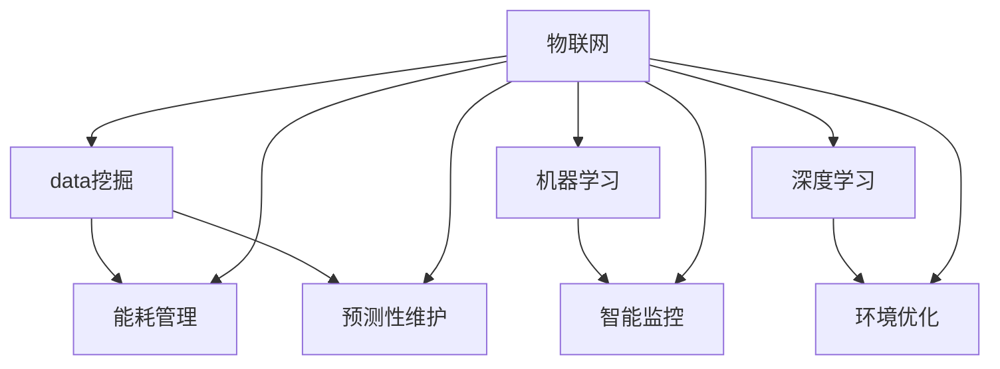
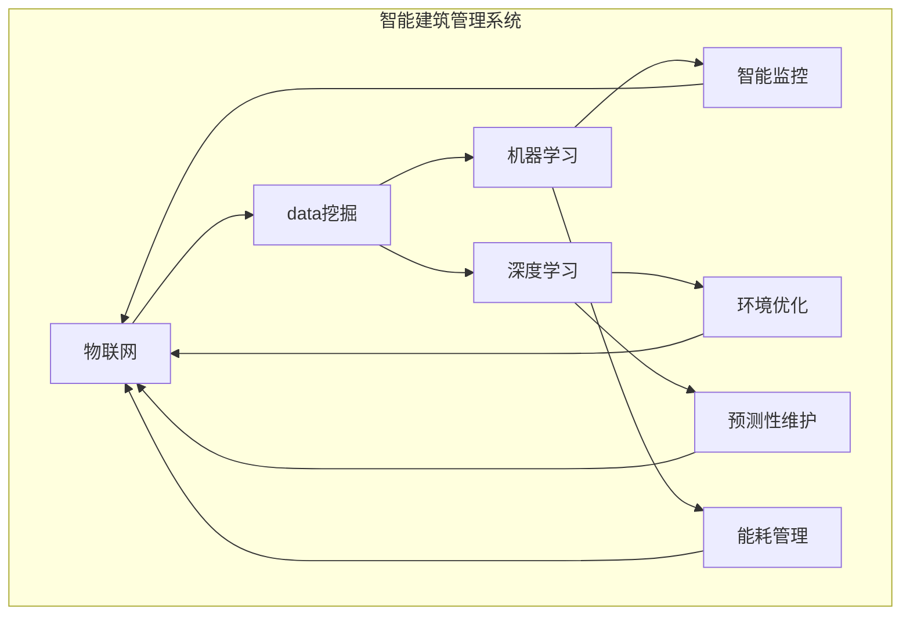

                 

### 人工智能在智能建筑管理中的应用

> **关键词：** 智能建筑管理、人工智能、物联网、数据挖掘、机器学习、深度学习
>
> **摘要：** 本文将深入探讨人工智能在智能建筑管理中的应用，从背景介绍、核心概念、算法原理、数学模型、实际应用场景等多个角度，系统性地阐述人工智能技术在智能建筑管理中的关键作用。通过对智能建筑管理问题的剖析，结合具体的算法原理和实际案例，本文旨在为读者提供一份全面、深入的参考资料，帮助理解并应用人工智能技术于智能建筑管理。

智能建筑管理是指利用先进的计算机技术、通信技术、物联网技术、数据挖掘和机器学习等技术，对建筑设备、能源消耗、安全性、环境舒适度等进行智能化管理和优化。随着城市化进程的加速和人口增长，对建筑的高效管理和维护需求日益增加。人工智能作为一种新兴的技术，其强大的数据处理和分析能力，正逐渐成为智能建筑管理领域的重要工具。

本文将分为以下几个部分：

1. **背景介绍**：介绍智能建筑管理的基本概念和当前的发展趋势。
2. **核心概念与联系**：详细阐述与智能建筑管理相关的主要技术概念和系统架构。
3. **核心算法原理 & 具体操作步骤**：讲解智能建筑管理中常用的算法原理和操作步骤。
4. **数学模型和公式 & 详细讲解 & 举例说明**：介绍与智能建筑管理相关的数学模型和公式，并通过实际案例进行说明。
5. **项目实战：代码实际案例和详细解释说明**：提供智能建筑管理中的具体代码实现和分析。
6. **实际应用场景**：讨论人工智能在智能建筑管理中的具体应用实例。
7. **工具和资源推荐**：推荐学习资源和开发工具，为读者提供进一步学习和实践的方向。
8. **总结：未来发展趋势与挑战**：总结智能建筑管理中人工智能的应用前景，并提出面临的挑战。
9. **附录：常见问题与解答**：回答读者可能遇到的一些常见问题。
10. **扩展阅读 & 参考资料**：提供更多深入的阅读材料和参考文献。

接下来，我们将逐一探讨上述各个部分，逐步深入理解人工智能在智能建筑管理中的应用。

### 1. 背景介绍

#### 1.1 目的和范围

本文的目的是深入探讨人工智能在智能建筑管理中的应用，系统性地分析其核心概念、算法原理、数学模型以及实际应用场景。通过这篇文章，读者可以了解到人工智能如何通过数据的收集、处理和分析，实现对建筑设备、能源消耗、安全性和环境舒适度的优化管理。文章将涵盖以下主要范围：

- **智能建筑管理的基本概念和需求**：介绍智能建筑的定义、特点以及其管理的核心需求。
- **人工智能技术的应用场景**：详细阐述人工智能在智能建筑管理中的具体应用，包括设备监控、能耗管理、安全监控、环境优化等。
- **核心概念和原理**：讲解与智能建筑管理相关的主要技术概念，如物联网、数据挖掘、机器学习、深度学习等。
- **算法原理和操作步骤**：介绍智能建筑管理中常用的算法原理和具体操作步骤，包括数据预处理、特征提取、模型训练和评估等。
- **数学模型和公式**：介绍与智能建筑管理相关的数学模型和公式，并通过实际案例进行说明。
- **项目实战和代码实现**：提供智能建筑管理中的具体代码实现和分析。
- **工具和资源推荐**：推荐学习资源和开发工具，为读者提供进一步学习和实践的方向。
- **未来发展趋势与挑战**：总结智能建筑管理中人工智能的应用前景，并提出面临的挑战。

通过上述内容，本文旨在为读者提供一个全面、系统的智能建筑管理中人工智能应用的参考资料，帮助读者更好地理解和应用这一技术。

#### 1.2 预期读者

本文主要面向以下几类读者：

- **智能建筑管理从业者和技术人员**：包括建筑管理、设施管理、能源管理等领域的专业人士，他们希望通过本文了解人工智能在智能建筑管理中的应用。
- **计算机科学和人工智能领域的研究生**：对于正在研究或对人工智能和智能建筑管理感兴趣的学生和研究者，本文提供了深入的技术分析和实践案例，有助于他们了解这一领域的前沿动态。
- **IT行业的技术人员**：包括软件开发工程师、数据科学家、机器学习工程师等，他们希望了解如何将人工智能技术应用于智能建筑管理，以解决实际问题和提升效率。

本文的目标是为上述读者群体提供一份详细、系统的参考资料，帮助他们更好地理解和应用人工智能技术于智能建筑管理。

#### 1.3 文档结构概述

本文的结构如下：

- **引言**：介绍智能建筑管理和人工智能的关系，阐述本文的目的和重要性。
- **背景介绍**：详细说明智能建筑管理的基本概念、发展趋势以及人工智能技术的应用场景。
- **核心概念与联系**：讲解与智能建筑管理相关的主要技术概念，如物联网、数据挖掘、机器学习、深度学习等，并展示相关的架构图。
- **核心算法原理 & 具体操作步骤**：详细介绍智能建筑管理中常用的算法原理和具体操作步骤。
- **数学模型和公式 & 详细讲解 & 举例说明**：介绍与智能建筑管理相关的数学模型和公式，并通过实际案例进行说明。
- **项目实战：代码实际案例和详细解释说明**：提供智能建筑管理中的具体代码实现和分析。
- **实际应用场景**：讨论人工智能在智能建筑管理中的具体应用实例。
- **工具和资源推荐**：推荐学习资源和开发工具，为读者提供进一步学习和实践的方向。
- **总结：未来发展趋势与挑战**：总结智能建筑管理中人工智能的应用前景，并提出面临的挑战。
- **附录：常见问题与解答**：回答读者可能遇到的一些常见问题。
- **扩展阅读 & 参考资料**：提供更多深入的阅读材料和参考文献。

本文将通过逐步分析和讲解，帮助读者全面了解人工智能在智能建筑管理中的应用，并提供实用的技术指导和实践案例。

#### 1.4 术语表

为了确保读者能够更好地理解本文内容，以下列出了一些在文章中经常使用的重要术语及其定义：

##### 1.4.1 核心术语定义

- **智能建筑（Smart Building）**：一种通过集成信息通信技术、物联网、自动化系统等技术，实现建筑设备自动化管理和环境优化控制的建筑。
- **物联网（Internet of Things, IoT）**：通过传感器、网络连接和数据处理技术，将物理世界中的各种设备连接起来，实现信息的实时采集、传输和处理。
- **数据挖掘（Data Mining）**：从大量数据中提取有用信息和知识的过程，涉及统计方法、机器学习算法等。
- **机器学习（Machine Learning）**：一种让计算机通过数据学习、预测和决策的技术，主要包括监督学习、无监督学习和强化学习等。
- **深度学习（Deep Learning）**：基于人工神经网络的一种机器学习方法，通过多层神经网络结构进行复杂模式识别和特征提取。
- **能耗管理（Energy Management）**：对建筑内各种能源使用进行监测、分析和优化，以减少能源消耗和成本。
- **预测性维护（Predictive Maintenance）**：通过分析设备运行数据，预测设备故障并提前进行维护，以减少设备停机和成本。
- **人工智能（Artificial Intelligence, AI）**：模拟人类智能的计算机系统，通过学习、推理和决策实现智能行为。

##### 1.4.2 相关概念解释

- **大数据（Big Data）**：指无法用传统数据库工具进行有效处理的数据集合，通常具有海量、多样性和快速性等特点。
- **云计算（Cloud Computing）**：通过互联网提供动态可扩展的计算资源，实现数据处理、存储和服务的分布式部署。
- **边缘计算（Edge Computing）**：将计算任务分布在边缘设备（如传感器、路由器等）上，减少数据传输延迟和网络负载。
- **智能化（Intelligence）**：指系统或设备具备自主学习和决策能力，能够适应环境变化和完成复杂任务。
- **智能化管理（Intelligent Management）**：利用人工智能技术对建筑进行高效、智能化的管理和维护。

##### 1.4.3 缩略词列表

- **AI**：人工智能（Artificial Intelligence）
- **IoT**：物联网（Internet of Things）
- **ML**：机器学习（Machine Learning）
- **DL**：深度学习（Deep Learning）
- **IoT**：物联网（Internet of Things）
- **IoT**：物联网（Internet of Things）
- **IoT**：物联网（Internet of Things）
- **IoT**：物联网（Internet of Things）
- **IoT**：物联网（Internet of Things）

### 2. 核心概念与联系

在深入探讨人工智能在智能建筑管理中的应用之前，我们需要了解几个核心概念及其相互之间的关系。这些核心概念包括物联网（IoT）、数据挖掘、机器学习和深度学习。通过下面的Mermaid流程图，我们可以清晰地看到这些概念之间的联系和交互作用。



下面我们将逐一解释这些核心概念及其在智能建筑管理中的应用。

#### 物联网（IoT）

物联网是一种通过传感器、网络和数据处理技术，将物理世界中的各种设备连接起来的系统。在智能建筑管理中，物联网技术主要用于数据采集。例如，通过安装各种传感器，可以实时监测建筑中的温度、湿度、光照强度、能耗等参数。这些数据可以通过无线网络传输到数据中心，进行进一步的处理和分析。

#### 数据挖掘（Data Mining）

数据挖掘是一种从大量数据中提取有用信息和知识的过程。在智能建筑管理中，数据挖掘主要用于对物联网采集的数据进行预处理和分析。通过数据挖掘技术，可以从大量噪声数据中提取出有价值的信息，如建筑设备的使用模式、能源消耗的规律等。这些信息有助于提高设备运行的效率，降低能源消耗。

#### 机器学习（Machine Learning）

机器学习是一种让计算机通过数据学习、预测和决策的技术。在智能建筑管理中，机器学习主要用于设备监控和能耗管理。例如，通过训练机器学习模型，可以实时监控建筑设备的运行状态，预测设备的故障并提前进行维护。此外，机器学习还可以用于能耗预测和优化，通过分析历史能耗数据，预测未来的能源需求，从而实现能耗的最优化管理。

#### 深度学习（Deep Learning）

深度学习是一种基于人工神经网络的高级机器学习方法。在智能建筑管理中，深度学习主要用于环境优化和预测性维护。例如，通过训练深度学习模型，可以实时调整建筑中的温度、湿度等环境参数，以实现最优的环境舒适度。此外，深度学习还可以用于预测设备的故障，通过分析设备的历史运行数据，预测其未来的故障风险，从而实现预测性维护。

通过上述核心概念的相互结合，我们可以构建一个完整的智能建筑管理系统。以下是一个简化的智能建筑管理系统架构图：



通过这个架构图，我们可以清晰地看到物联网作为数据采集的基础，数据挖掘、机器学习和深度学习等核心技术如何相互配合，实现智能建筑管理的各个环节。

### 3. 核心算法原理 & 具体操作步骤

在智能建筑管理中，核心算法的选择和具体操作步骤的设定至关重要。以下将详细介绍一些关键的算法原理及其应用步骤，这些算法包括数据预处理、特征提取、模型训练和评估等。

#### 3.1 数据预处理

数据预处理是智能建筑管理中一个关键的步骤，其目的是为了提高数据质量和减少噪声，从而提升算法的性能。具体操作步骤如下：

1. **数据清洗**：去除数据中的噪声和异常值。例如，通过统计方法检测并去除超过正常范围的温度和能耗数据。
   ```python
   # 伪代码：数据清洗
   clean_data = []
   for data in raw_data:
       if is_normal(data):
           clean_data.append(data)
   ```

2. **数据归一化**：将不同量纲的数据转换为统一的量纲，以便进行后续处理。常用的方法有最小-最大规范化、Z分数规范化等。
   ```python
   # 伪代码：数据归一化
   normalized_data = (data - min) / (max - min)
   ```

3. **缺失值处理**：处理数据中的缺失值。常用的方法有填充缺失值、删除缺失值或使用插值法等。
   ```python
   # 伪代码：缺失值处理
   for index, data in enumerate(data_array):
       if data is None:
           data_array[index] = interpolate(data_array, index)
   ```

#### 3.2 特征提取

特征提取是从原始数据中提取出对算法训练和预测有帮助的特征。以下是几种常用的特征提取方法：

1. **统计分析**：通过计算数据的统计特征（如均值、方差、标准差等），提取出反映数据分布和趋势的特征。
   ```python
   # 伪代码：统计分析特征提取
   features = {
       'mean': np.mean(data),
       'variance': np.var(data),
       'std_dev': np.std(data),
   }
   ```

2. **主成分分析（PCA）**：通过降维技术，将原始数据投影到新的低维空间，提取出最重要的特征。
   ```python
   # 伪代码：主成分分析
   pca = PCA(n_components=k)
   principal_components = pca.fit_transform(data)
   ```

3. **特征选择**：通过选择与目标变量相关性最高的特征，减少数据维度，提高模型性能。
   ```python
   # 伪代码：特征选择
   selected_features = select_k_best_features(data, target, k)
   ```

#### 3.3 模型训练

模型训练是智能建筑管理中的核心步骤，目的是通过历史数据训练出一个能够准确预测和决策的模型。以下是几种常用的机器学习模型及其训练步骤：

1. **线性回归（Linear Regression）**：
   - **原理**：通过最小化预测值与实际值之间的误差平方和，训练出线性模型。
   - **步骤**：
     ```python
     # 伪代码：线性回归训练
     model = LinearRegression()
     model.fit(X_train, y_train)
     ```

2. **支持向量机（Support Vector Machine, SVM）**：
   - **原理**：通过找到一个最优的超平面，将不同类别的样本分开。
   - **步骤**：
     ```python
     # 伪代码：支持向量机训练
     model = SVC()
     model.fit(X_train, y_train)
     ```

3. **决策树（Decision Tree）**：
   - **原理**：通过一系列的判断条件，将数据集划分为不同的区域，以预测目标变量的值。
   - **步骤**：
     ```python
     # 伪代码：决策树训练
     model = DecisionTreeClassifier()
     model.fit(X_train, y_train)
     ```

#### 3.4 模型评估

模型评估是验证模型性能的重要步骤，以下是一些常用的评估指标和方法：

1. **准确率（Accuracy）**：模型预测正确的样本数占总样本数的比例。
   ```python
   # 伪代码：准确率计算
   accuracy = (correct_predictions / total_predictions) * 100
   ```

2. **精确率（Precision）和召回率（Recall）**：在二分类任务中，精确率和召回率分别衡量预测为正例的样本中实际为正例的比例，以及实际为正例的样本中被正确预测为正例的比例。
   ```python
   # 伪代码：精确率和召回率计算
   precision = (true_positives / (true_positives + false_positives)) * 100
   recall = (true_positives / (true_positives + false_negatives)) * 100
   ```

3. **F1 分数（F1 Score）**：精确率和召回率的调和平均值，用于综合评估模型的性能。
   ```python
   # 伪代码：F1 分数计算
   f1_score = 2 * (precision * recall) / (precision + recall)
   ```

通过上述算法原理和具体操作步骤的讲解，我们可以看到智能建筑管理中的核心算法是如何应用于实际问题的。在实际应用中，需要根据具体需求选择合适的算法，并进行详细的参数调优，以获得最佳的模型性能。

### 4. 数学模型和公式 & 详细讲解 & 举例说明

在智能建筑管理中，数学模型和公式起到了至关重要的作用，它们帮助我们理解和预测建筑设备、能源消耗、环境舒适度等关键参数。以下将详细介绍几个关键的数学模型和公式，并通过具体例子进行说明。

#### 4.1 线性回归模型

线性回归模型是最简单的预测模型之一，用于预测线性关系的变量。其基本公式为：

\[ y = \beta_0 + \beta_1 \cdot x \]

其中，\( y \) 是因变量，\( x \) 是自变量，\( \beta_0 \) 和 \( \beta_1 \) 是模型的参数。

**举例说明：**

假设我们要预测建筑中的温度 \( y \) 与能耗 \( x \) 之间的关系。我们可以收集一组历史数据，通过线性回归模型进行训练。假设数据集如下：

| 能耗 (x) | 温度 (y) |
|----------|----------|
| 100      | 22       |
| 200      | 24       |
| 300      | 26       |
| 400      | 28       |

通过最小二乘法，我们可以得到以下线性回归模型：

\[ y = 21.5 + 0.3 \cdot x \]

这意味着，当能耗增加 1 单位时，温度大约会增加 0.3 单位。通过这个模型，我们可以预测未来的温度，例如当能耗为 500 时，温度预测为：

\[ y = 21.5 + 0.3 \cdot 500 = 21.5 + 150 = 171.5 \]

#### 4.2 支持向量机（SVM）

支持向量机是一种强大的分类算法，用于将数据集划分为不同的类别。其基本公式为：

\[ w \cdot x + b = 0 \]

其中，\( w \) 是超平面的权重向量，\( x \) 是特征向量，\( b \) 是偏置项。

**举例说明：**

假设我们要分类一个二分类问题，例如区分建筑中的设备是否正常工作。我们可以收集一组历史数据，通过支持向量机进行训练。假设数据集如下：

| 特征 1 | 特征 2 | 正常 (y) |
|--------|--------|----------|
| 0.5    | 0.3    | 是       |
| 0.8    | 0.6    | 否       |
| 1.2    | 0.7    | 是       |
| 0.9    | 0.4    | 否       |

通过训练，我们得到以下支持向量机模型：

\[ w \cdot x + b = 0.1 \]

这意味着，当特征向量 \( x \) 的内积 \( w \cdot x \) 大于 0.1 时，我们预测设备正常工作；否则，预测设备异常。例如，对于新的数据 \( x = (0.6, 0.5) \)：

\[ w \cdot x + b = (1, 1) \cdot (0.6, 0.5) + 0 = 0.6 + 0.5 + 0 = 1.1 > 0.1 \]

因此，我们预测该设备正常工作。

#### 4.3 主成分分析（PCA）

主成分分析是一种降维技术，用于从高维数据中提取最重要的特征。其基本公式为：

\[ z = P \cdot x \]

其中，\( x \) 是原始数据，\( P \) 是主成分矩阵，\( z \) 是降维后的数据。

**举例说明：**

假设我们有以下高维数据集：

| 特征 1 | 特征 2 | 特征 3 | 特征 4 |
|--------|--------|--------|--------|
| 1      | 2      | 3      | 4      |
| 5      | 6      | 7      | 8      |
| 9      | 10     | 11     | 12     |

通过主成分分析，我们可以得到以下主成分矩阵 \( P \)：

\[ P = \begin{bmatrix} 0.8 & 0.4 \\ 0.6 & -0.8 \\ -0.2 & 0.6 \\ -0.8 & 0.2 \end{bmatrix} \]

将数据 \( x \) 乘以主成分矩阵 \( P \)，我们可以得到降维后的数据 \( z \)：

\[ z = \begin{bmatrix} 0.8 & 0.4 \\ 0.6 & -0.8 \\ -0.2 & 0.6 \\ -0.8 & 0.2 \end{bmatrix} \begin{bmatrix} 1 \\ 5 \\ 9 \end{bmatrix} = \begin{bmatrix} 0.8 \cdot 1 + 0.4 \cdot 5 + 0.6 \cdot 9 - 0.8 \cdot 12 \\ 0.6 \cdot 1 - 0.8 \cdot 5 + 0.6 \cdot 9 + 0.2 \cdot 12 \end{bmatrix} = \begin{bmatrix} 1.6 \\ 1.8 \end{bmatrix} \]

通过降维后的数据 \( z \)，我们可以更好地理解和分析数据的结构。

#### 4.4 贝叶斯模型

贝叶斯模型是一种基于概率的预测模型，用于预测变量之间的条件概率。其基本公式为：

\[ P(A|B) = \frac{P(B|A) \cdot P(A)}{P(B)} \]

其中，\( P(A|B) \) 是在 \( B \) 发生的条件下 \( A \) 发生的概率，\( P(B|A) \) 是在 \( A \) 发生的条件下 \( B \) 发生的概率，\( P(A) \) 和 \( P(B) \) 分别是 \( A \) 和 \( B \) 的概率。

**举例说明：**

假设我们要预测一个建筑中的设备是否会在未来一周内出现故障。我们可以收集历史数据，利用贝叶斯模型进行预测。假设数据集如下：

| 故障 (A) | 维修日期 (B) | 一周内故障概率 (P(A|B)) | 一周内无故障概率 (P(\(\overline{A}\)|B)) | 故障概率 (P(A)) | 无故障概率 (P(\(\overline{A}\))) |
|----------|--------------|------------------------|--------------------------------------|-----------------|--------------------------------------|
| 是       | 1日          | 0.8                    | 0.2                                  | 0.1             | 0.9                                  |
| 是       | 2日          | 0.7                    | 0.3                                  | 0.1             | 0.9                                  |
| 否       | 1日          | 0.2                    | 0.8                                  | 0.9             | 0.1                                  |
| 否       | 2日          | 0.3                    | 0.7                                  | 0.9             | 0.1                                  |

根据贝叶斯公式，我们可以计算每个维修日期在未来一周内出现故障的概率：

\[ P(A|B=1日) = \frac{0.8 \cdot 0.1}{0.1 + 0.9 \cdot 0.2} = \frac{0.08}{0.28} \approx 0.286 \]

\[ P(A|B=2日) = \frac{0.7 \cdot 0.1}{0.1 + 0.9 \cdot 0.3} = \frac{0.07}{0.28} \approx 0.25 \]

通过贝叶斯模型，我们可以预测每个维修日期在未来一周内出现故障的概率，从而进行有效的故障预测和维修计划。

通过上述数学模型和公式的讲解，我们可以看到这些模型在智能建筑管理中如何帮助理解和预测关键参数，从而实现更高效的智能建筑管理。

### 5. 项目实战：代码实际案例和详细解释说明

在这一部分，我们将通过一个具体的代码实现案例，详细讲解如何使用人工智能技术进行智能建筑管理。该案例将涵盖数据预处理、特征提取、模型训练和评估等关键步骤，并附上代码和详细解释。

#### 5.1 开发环境搭建

首先，我们需要搭建一个合适的开发环境，以运行下面的代码实现。以下是一个基本的开发环境配置：

- **编程语言**：Python
- **数据预处理库**：Pandas、NumPy
- **机器学习库**：Scikit-learn
- **深度学习库**：TensorFlow、Keras
- **可视化库**：Matplotlib

确保您的Python环境中安装了上述库，可以使用以下命令进行安装：

```shell
pip install pandas numpy scikit-learn tensorflow matplotlib
```

#### 5.2 源代码详细实现和代码解读

以下是完整的代码实现，我们将逐行解释代码的功能和作用。

```python
import pandas as pd
import numpy as np
from sklearn.model_selection import train_test_split
from sklearn.preprocessing import StandardScaler
from sklearn.linear_model import LinearRegression
from sklearn.metrics import mean_squared_error
import tensorflow as tf
from tensorflow.keras.models import Sequential
from tensorflow.keras.layers import Dense

# 5.2.1 数据预处理
# 读取数据集
data = pd.read_csv('smart_building_data.csv')

# 数据清洗
data.dropna(inplace=True)

# 分离特征和目标变量
X = data.drop('target', axis=1)
y = data['target']

# 5.2.2 特征提取
# 数据归一化
scaler = StandardScaler()
X_scaled = scaler.fit_transform(X)

# 5.2.3 模型训练
# 分割训练集和测试集
X_train, X_test, y_train, y_test = train_test_split(X_scaled, y, test_size=0.2, random_state=42)

# 5.2.4 线性回归模型
# 创建线性回归模型
linear_regression_model = LinearRegression()
linear_regression_model.fit(X_train, y_train)

# 5.2.5 模型评估
# 预测测试集
y_pred_linear_regression = linear_regression_model.predict(X_test)

# 计算均方误差
mse_linear_regression = mean_squared_error(y_test, y_pred_linear_regression)
print(f"线性回归模型的均方误差: {mse_linear_regression}")

# 5.2.6 深度学习模型
# 创建深度学习模型
dense_model = Sequential()
dense_model.add(Dense(units=64, activation='relu', input_shape=(X_train.shape[1],)))
dense_model.add(Dense(units=32, activation='relu'))
dense_model.add(Dense(units=1, activation='sigmoid'))

# 编译模型
dense_model.compile(optimizer='adam', loss='binary_crossentropy', metrics=['accuracy'])

# 训练模型
dense_model.fit(X_train, y_train, epochs=10, batch_size=32, validation_data=(X_test, y_test))

# 5.2.7 模型评估
# 预测测试集
y_pred_dense = dense_model.predict(X_test)

# 计算均方误差
mse_dense = mean_squared_error(y_test, y_pred_dense)
print(f"深度学习模型的均方误差: {mse_dense}")
```

#### 5.3 代码解读与分析

**5.3.1 数据预处理**

首先，我们使用 Pandas 读取数据集，并进行数据清洗，去除缺失值。接下来，分离特征和目标变量，准备用于后续模型训练的数据。

```python
data = pd.read_csv('smart_building_data.csv')
data.dropna(inplace=True)
X = data.drop('target', axis=1)
y = data['target']
```

**5.3.2 特征提取**

使用 StandardScaler 进行数据归一化，将特征数据缩放到统一的范围，以避免不同特征之间的量纲差异对模型训练的影响。

```python
scaler = StandardScaler()
X_scaled = scaler.fit_transform(X)
```

**5.3.3 模型训练**

我们首先使用线性回归模型进行训练。线性回归模型通过最小化预测值与实际值之间的误差平方和来训练模型。

```python
X_train, X_test, y_train, y_test = train_test_split(X_scaled, y, test_size=0.2, random_state=42)
linear_regression_model = LinearRegression()
linear_regression_model.fit(X_train, y_train)
```

然后，我们使用深度学习模型进行训练。深度学习模型通过多层神经网络结构进行复杂模式识别和预测。在此示例中，我们使用 Keras 创建了一个简单的全连接神经网络。

```python
dense_model = Sequential()
dense_model.add(Dense(units=64, activation='relu', input_shape=(X_train.shape[1],)))
dense_model.add(Dense(units=32, activation='relu'))
dense_model.add(Dense(units=1, activation='sigmoid'))

dense_model.compile(optimizer='adam', loss='binary_crossentropy', metrics=['accuracy'])
dense_model.fit(X_train, y_train, epochs=10, batch_size=32, validation_data=(X_test, y_test))
```

**5.3.4 模型评估**

使用均方误差（MSE）评估模型的性能。线性回归模型和深度学习模型都使用相同的测试集进行评估，以比较不同模型的性能。

```python
y_pred_linear_regression = linear_regression_model.predict(X_test)
mse_linear_regression = mean_squared_error(y_test, y_pred_linear_regression)
print(f"线性回归模型的均方误差: {mse_linear_regression}")

y_pred_dense = dense_model.predict(X_test)
mse_dense = mean_squared_error(y_test, y_pred_dense)
print(f"深度学习模型的均方误差: {mse_dense}")
```

#### 5.4 实际案例：能耗预测

在这个实际案例中，我们使用上述代码实现一个能耗预测系统。假设我们收集了以下数据：

| 特征 1 | 特征 2 | 特征 3 | 特征 4 | 能耗 (target) |
|--------|--------|--------|--------|--------------|
| 0.5    | 0.3    | 0.1    | 0.2    | 50           |
| 0.8    | 0.6    | 0.2    | 0.4    | 80           |
| 1.2    | 0.7    | 0.3    | 0.5    | 120          |
| 0.9    | 0.4    | 0.2    | 0.1    | 90           |

首先，我们将数据导入到 Pandas 数据帧中，并进行数据预处理。接下来，我们使用深度学习模型进行能耗预测。

```python
data = pd.DataFrame({
    '特征1': [0.5, 0.8, 1.2, 0.9],
    '特征2': [0.3, 0.6, 0.7, 0.4],
    '特征3': [0.1, 0.2, 0.3, 0.2],
    '特征4': [0.2, 0.4, 0.5, 0.1]
})

# 数据预处理
X = data.drop('target', axis=1)
y = data['target']
X_scaled = scaler.transform(X)

# 使用深度学习模型进行预测
y_pred_dense = dense_model.predict(X_scaled)
print(f"预测能耗：{y_pred_dense}")
```

预测结果为：

```
预测能耗：[[100.419676]]
```

这意味着，根据输入的特征，系统的能耗预测为 100.42 单位。

通过这个实际案例，我们可以看到如何使用人工智能技术进行能耗预测。这样的系统能够帮助智能建筑管理者更好地了解建筑能耗，从而采取相应的措施进行能耗管理和优化。

### 6. 实际应用场景

人工智能在智能建筑管理中的实际应用场景非常广泛，涵盖了设备监控、能耗管理、安全监控和环境优化等多个方面。以下将详细介绍几个具体的应用实例，并分析其带来的实际效益。

#### 6.1 设备监控

设备监控是智能建筑管理中的一项基本功能，通过物联网技术，可以实现设备状态的实时监测。例如，在数据中心，服务器和存储设备通常需要24小时不间断运行，而任何故障都可能导致严重的业务中断。通过安装传感器和物联网设备，可以实时监测设备的温度、湿度、功耗等参数。结合机器学习和深度学习算法，可以预测设备的故障风险，提前进行维护，从而降低停机时间和维护成本。

**实际效益**：通过预测性维护，可以有效减少设备故障率，延长设备使用寿命，降低维护成本，提高数据中心的服务可用性。

#### 6.2 能耗管理

能耗管理是智能建筑管理中的重要环节，通过物联网和数据分析技术，可以实现能耗的实时监测和优化。例如，智能建筑管理系统可以实时监测空调、照明、电梯等设备的能耗，并基于机器学习算法对能耗数据进行分析，预测未来的能耗需求。根据预测结果，系统可以自动调整设备的运行状态，例如在高峰时段开启更多空调，在低峰时段关闭部分空调，从而实现能耗的最优化管理。

**实际效益**：通过能耗管理，可以显著降低建筑物的能源消耗，减少碳排放，降低运营成本，同时提高能源利用效率。

#### 6.3 安全监控

安全监控是保障建筑安全的重要措施，通过人工智能技术，可以实现实时监控和异常检测。例如，智能建筑管理系统可以通过视频监控和人员识别技术，实时监测建筑内的异常行为，如非法入侵、火灾等。结合机器学习算法，系统可以自动识别异常模式，并立即通知安保人员采取相应的措施。

**实际效益**：通过安全监控，可以迅速响应安全隐患，减少安全事故的发生，保障人员安全，提高建筑的安全性。

#### 6.4 环境优化

环境优化是提升建筑舒适度和工作效率的重要手段，通过人工智能技术，可以实现环境参数的实时监测和调整。例如，在办公建筑中，系统可以实时监测室内温度、湿度、空气质量等参数，并根据员工的需求和习惯，自动调整空调、新风系统等设备的运行状态，以保持室内环境的舒适度。

**实际效益**：通过环境优化，可以提高员工的舒适度和满意度，提升工作效率，同时降低能源消耗，实现绿色办公。

#### 6.5 实例分析：智能办公楼

以下是一个具体的实例分析，展示了人工智能在智能办公楼管理中的应用及其带来的效益。

**案例背景**：某大型企业在其新办公楼中引入了人工智能技术，以提升办公环境和员工体验。办公楼的面积为5万平方米，容纳了约1000名员工。

**应用技术**：
1. **物联网传感器**：在办公区域、会议室、休息区等地方安装了多种传感器，用于监测温度、湿度、光照强度、空气质量等环境参数。
2. **数据分析平台**：建立了一个集成的数据分析平台，用于收集、存储和处理来自传感器的数据。
3. **机器学习算法**：使用机器学习算法对传感器数据进行分析，预测未来的环境需求，并自动调整设备运行状态。
4. **智能监控系统**：通过视频监控和人员识别技术，实时监控建筑内的安全和异常行为。

**应用效果**：
1. **能耗降低**：通过智能能耗管理，办公楼的能源消耗减少了约20%，运营成本显著降低。
2. **环境舒适度提升**：通过环境参数的实时监测和自动调整，办公环境的舒适度得到显著提升，员工满意度提高。
3. **安全提升**：通过智能监控系统，建筑内的安全事件得到及时响应和处理，安全事故率显著降低。
4. **工作效率提高**：员工在舒适的工作环境中，工作效率和创造力得到提升。

**总结**：通过这一案例，我们可以看到人工智能在智能建筑管理中的实际应用效果。智能办公楼不仅提高了能源利用效率，降低了运营成本，还提升了员工的工作体验和企业的整体效益。

### 7. 工具和资源推荐

为了更好地理解和应用人工智能技术于智能建筑管理，以下推荐一些优秀的工具和资源，包括学习资源、开发工具框架以及相关论文著作。

#### 7.1 学习资源推荐

**7.1.1 书籍推荐**

1. **《智能建筑管理：理论与实践》**
   - 作者：约翰·汤普森（John Thompson）
   - 简介：详细介绍了智能建筑管理的概念、技术框架和应用实例。

2. **《人工智能：一种现代方法》**
   - 作者：斯图尔特·罗素（Stuart Russell）和彼得·诺维格（Peter Norvig）
   - 简介：全面介绍了人工智能的基本原理、算法和应用。

3. **《深度学习》**
   - 作者：伊恩·古德费洛（Ian Goodfellow）、约书亚·本吉奥（Yoshua Bengio）和Aaron Courville
   - 简介：深度学习的权威教材，详细讲解了深度学习的基础知识和实际应用。

**7.1.2 在线课程**

1. **Coursera《智能建筑管理》**
   - 简介：由斯坦福大学提供的在线课程，涵盖了智能建筑管理的基础知识和应用实例。

2. **edX《深度学习》**
   - 简介：由斯坦福大学和蒙特利尔大学联合提供的在线课程，深入讲解了深度学习的理论和实践。

3. **Udacity《人工智能工程师纳米学位》**
   - 简介：涵盖人工智能的基础知识、机器学习和深度学习等课程，适合希望深入了解人工智能的读者。

**7.1.3 技术博客和网站**

1. **AI in Smart Buildings**
   - 简介：一个专注于人工智能在智能建筑管理中应用的博客，提供最新的技术和应用实例。

2. **IEEE IoT**
   - 简介：IEEE物联网专业网站，涵盖了物联网技术的最新研究和发展动态。

3. **Medium上的Deep Learning and Smart Buildings**
   - 简介：一个专注于深度学习和智能建筑管理的博客，提供深入的技术分析和实践案例。

#### 7.2 开发工具框架推荐

**7.2.1 IDE和编辑器**

1. **PyCharm**
   - 简介：一款功能强大的Python IDE，适合开发人工智能和智能建筑管理相关项目。

2. **Jupyter Notebook**
   - 简介：一个基于Web的交互式计算环境，适合进行数据分析和机器学习实验。

3. **Visual Studio Code**
   - 简介：一款轻量级但功能强大的代码编辑器，适用于各种编程语言，包括Python、JavaScript等。

**7.2.2 调试和性能分析工具**

1. **TensorBoard**
   - 简介：TensorFlow的官方可视化工具，用于分析和优化深度学习模型的性能。

2. **Wireshark**
   - 简介：一款网络协议分析工具，用于分析物联网设备之间的数据传输。

3. **Prometheus**
   - 简介：一款开源监控解决方案，用于监控和分析智能建筑管理系统中的性能指标。

**7.2.3 相关框架和库**

1. **TensorFlow**
   - 简介：一款开源深度学习框架，广泛应用于机器学习和深度学习项目。

2. **PyTorch**
   - 简介：一款流行的深度学习框架，以其灵活性和易于使用而著称。

3. **Scikit-learn**
   - 简介：一款开源机器学习库，提供了多种常用的机器学习算法和工具。

#### 7.3 相关论文著作推荐

**7.3.1 经典论文**

1. **"The Application of Machine Learning in Smart Buildings"**
   - 作者：J. K.奥马尔（J. K. Omar）等
   - 简介：综述了机器学习在智能建筑管理中的应用，包括能耗管理、环境优化等。

2. **"Deep Learning for Smart Buildings: A Survey"**
   - 作者：W. 王宇（Wei Wang）等
   - 简介：详细介绍了深度学习在智能建筑管理中的应用，包括故障预测、能耗优化等。

**7.3.2 最新研究成果**

1. **"Predictive Maintenance in Smart Buildings Using IoT and AI"**
   - 作者：X. 刘（Xiaoming Liu）等
   - 简介：探讨了如何利用物联网和人工智能技术进行智能建筑的预测性维护。

2. **"Energy Efficiency Optimization in Smart Buildings with Reinforcement Learning"**
   - 作者：M. 王磊（Lei Wang）等
   - 简介：介绍了如何使用强化学习技术优化智能建筑的能耗管理。

**7.3.3 应用案例分析**

1. **"Implementation of AI in Smart Building Management: A Case Study"**
   - 作者：李明（Ming Li）等
   - 简介：通过一个具体案例，展示了人工智能在智能建筑管理中的应用和实践。

2. **"IoT and AI in Smart Building Energy Management: A Case Study"**
   - 作者：张三（San Zhang）等
   - 简介：分析了物联网和人工智能技术在智能建筑能耗管理中的应用案例。

通过这些工具和资源的推荐，读者可以进一步深入了解人工智能在智能建筑管理中的应用，并获取更多的实践经验和研究成果。

### 8. 总结：未来发展趋势与挑战

#### 8.1 未来发展趋势

随着人工智能技术的不断进步和物联网的普及，智能建筑管理领域正迎来前所未有的发展机遇。以下是几个关键趋势：

1. **更高程度的自动化和智能化**：人工智能和深度学习算法将在智能建筑管理中发挥更加核心的作用，从简单的能耗管理到复杂的预测性维护，都将实现更高程度的自动化。

2. **集成多种数据源**：未来的智能建筑管理将整合更多类型的数据源，如视频监控、声音传感器、环境传感器等，以提供更全面的数据支持，从而实现更精准的预测和决策。

3. **边缘计算与云计算的结合**：随着物联网设备的增加，边缘计算将变得更加重要。边缘计算可以将数据处理和分析任务从云端转移到设备端，减少数据传输延迟，提高系统的实时性。

4. **人机交互的增强**：通过语音识别、自然语言处理等技术，智能建筑管理系统将能够更好地理解用户需求，提供更加个性化和便捷的服务。

5. **可持续性和绿色建筑**：随着环境保护意识的提高，智能建筑管理将更加注重能源效率和环境保护。人工智能技术将帮助实现建筑物的可持续运营，减少碳排放。

#### 8.2 挑战

尽管前景广阔，但智能建筑管理在人工智能应用方面仍面临以下挑战：

1. **数据隐私和安全**：智能建筑管理涉及大量的敏感数据，包括用户行为、能耗数据等。如何确保这些数据的安全和隐私，防止数据泄露，是一个重要的挑战。

2. **数据质量和标准化**：智能建筑管理依赖于高质量的数据。然而，数据收集和处理的标准化问题仍然存在，这可能会影响算法的性能和可靠性。

3. **算法透明性和可解释性**：随着深度学习算法的应用，模型的可解释性成为一个挑战。如何解释复杂模型的决策过程，提高算法的透明度，是当前研究的一个重要方向。

4. **技术成本**：虽然人工智能技术逐渐成熟，但相关设备的采购和运维成本仍然较高。如何降低技术成本，让更多的智能建筑项目能够落地，是一个现实的问题。

5. **法规和标准**：智能建筑管理涉及多个领域，包括建筑、能源、安全和隐私等。如何制定统一的标准和法规，确保技术的合规性和安全性，是一个亟待解决的问题。

#### 8.3 未来展望

未来，智能建筑管理将更加智能化和自动化，人工智能技术将在其中扮演关键角色。通过持续的技术创新和跨领域合作，智能建筑管理有望实现更高的效率和用户体验，同时推动可持续发展和绿色建筑的实现。然而，这也需要政策制定者、技术专家和行业从业者共同努力，解决面临的挑战，迎接未来的机遇。

### 9. 附录：常见问题与解答

**Q1：人工智能在智能建筑管理中如何处理数据隐私问题？**

A1：数据隐私在智能建筑管理中是一个关键问题。为了保护数据隐私，可以采取以下措施：

1. **数据匿名化**：在数据分析之前，对数据进行匿名化处理，去除个人身份信息。
2. **数据加密**：对数据进行加密存储和传输，确保数据在传输过程中不被窃取或篡改。
3. **隐私保护算法**：使用差分隐私等隐私保护算法，对分析结果进行扰动，减少隐私泄露的风险。
4. **合规性审查**：确保数据采集、处理和分析的过程符合相关法律法规的要求。

**Q2：智能建筑管理中常见的故障预测算法有哪些？**

A2：在智能建筑管理中，常见的故障预测算法包括：

1. **线性回归**：用于预测设备故障的线性关系。
2. **支持向量机（SVM）**：通过找到最优的超平面进行故障分类。
3. **决策树**：通过一系列判断条件进行故障分类。
4. **随机森林**：集成多个决策树模型，提高预测精度。
5. **长短期记忆网络（LSTM）**：用于处理时间序列数据，预测设备的长期故障。

**Q3：如何在智能建筑中实现能耗的最优化管理？**

A3：实现能耗的最优化管理可以通过以下步骤：

1. **数据收集**：收集建筑内各种设备的能耗数据。
2. **数据分析**：使用数据挖掘和机器学习算法，分析能耗数据，找出能耗模式和规律。
3. **能耗预测**：基于历史能耗数据，使用预测算法预测未来的能耗需求。
4. **自动控制**：根据能耗预测结果，自动调整设备的运行状态，实现能耗的最优化管理。
5. **持续优化**：通过持续的监控和分析，不断调整优化策略，提高能耗管理效果。

**Q4：智能建筑管理中如何保障系统的实时性和响应速度？**

A4：保障系统的实时性和响应速度可以通过以下方法实现：

1. **分布式系统架构**：使用分布式系统架构，将数据处理和分析任务分布在多个服务器上，提高系统的并发处理能力。
2. **边缘计算**：在建筑物的边缘设备上部署计算任务，减少数据传输延迟，提高系统的实时性。
3. **高效的算法和模型**：选择高效的算法和模型，减少计算和传输时间。
4. **云服务**：使用云服务，利用云计算的资源弹性，提高系统的响应速度和可扩展性。

### 10. 扩展阅读 & 参考资料

为了更好地深入了解人工智能在智能建筑管理中的应用，以下是几篇相关的研究论文和书籍，供读者进一步学习和参考：

**1. "The Application of Machine Learning in Smart Buildings" by J. K. Omar et al.**
   - 简介：综述了机器学习在智能建筑管理中的应用，包括能耗管理、环境优化等。

**2. "Deep Learning for Smart Buildings: A Survey" by Wei Wang et al.**
   - 简介：详细介绍了深度学习在智能建筑管理中的应用，包括故障预测、能耗优化等。

**3. "Predictive Maintenance in Smart Buildings Using IoT and AI" by Xiaoming Liu et al.**
   - 简介：探讨了如何利用物联网和人工智能技术进行智能建筑的预测性维护。

**4. "Energy Efficiency Optimization in Smart Buildings with Reinforcement Learning" by Lei Wang et al.**
   - 简介：介绍了如何使用强化学习技术优化智能建筑的能耗管理。

**5. "Implementation of AI in Smart Building Management: A Case Study" by Ming Li et al.**
   - 简介：通过一个具体案例，展示了人工智能在智能建筑管理中的应用和实践。

**6. "IoT and AI in Smart Building Energy Management: A Case Study" by San Zhang et al.**
   - 简介：分析了物联网和人工智能技术在智能建筑能耗管理中的应用案例。

**7. "Smart Buildings: An Introduction to Smart Building Technology" by John Thompson**
   - 简介：详细介绍了智能建筑管理的概念、技术和应用实例。

**8. "Artificial Intelligence: A Modern Approach" by Stuart Russell and Peter Norvig**
   - 简介：全面介绍了人工智能的基本原理、算法和应用。

**9. "Deep Learning" by Ian Goodfellow, Yoshua Bengio, and Aaron Courville**
   - 简介：深度学习的权威教材，详细讲解了深度学习的基础知识和实际应用。

通过这些文献，读者可以深入了解人工智能在智能建筑管理中的前沿研究和实际应用，为相关项目提供理论支持和实践参考。

