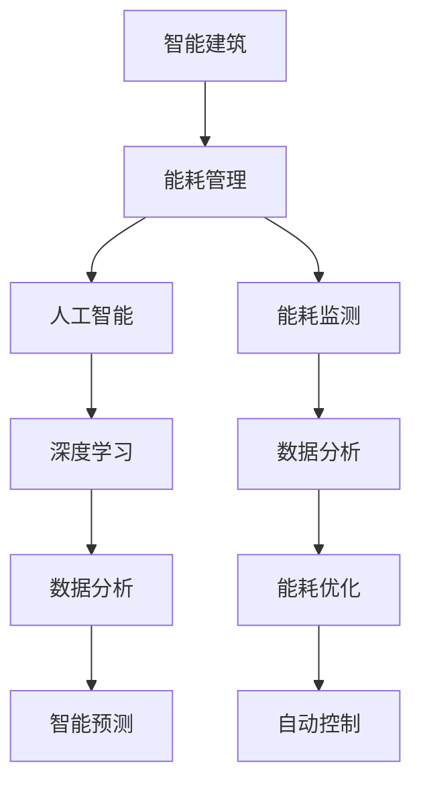

                 

# 人工智能在智能建筑能耗管理中的优化应用

## 关键词

* 人工智能
* 智能建筑
* 能耗管理
* 优化
* 数据分析
* 深度学习
* 模型训练
* 智能预测

## 摘要

本文探讨了人工智能在智能建筑能耗管理中的优化应用。随着城市化进程的加速，智能建筑数量不断增加，其能耗问题愈发凸显。本文首先介绍了智能建筑能耗管理的背景和现状，然后详细阐述了人工智能在这一领域的核心概念、算法原理、数学模型及其在实际应用中的案例分析。最后，本文总结了人工智能在智能建筑能耗管理中的发展趋势与挑战，并为未来的研究与应用提出了展望。

## 1. 背景介绍

### 1.1 目的和范围

本文旨在深入分析人工智能在智能建筑能耗管理中的应用，旨在为智能建筑行业提供有效的能耗优化策略。文章将首先介绍智能建筑能耗管理的相关概念和现状，然后重点探讨人工智能在这一领域的关键技术，如深度学习、数据分析和智能预测等。通过分析实际应用案例，我们将展示人工智能在智能建筑能耗管理中的实际效果。

### 1.2 预期读者

本文适合以下读者群体：

- 智能建筑行业从业者，对能耗管理有深入理解和研究。
- 人工智能领域的科研人员，对智能建筑能耗管理有浓厚兴趣。
- 计算机科学与技术专业的学生，希望了解智能建筑能耗管理的最新进展。

### 1.3 文档结构概述

本文分为以下几个部分：

- 第1部分：背景介绍，包括目的和范围、预期读者、文档结构概述和术语表。
- 第2部分：核心概念与联系，介绍智能建筑能耗管理中的关键概念和联系。
- 第3部分：核心算法原理与具体操作步骤，详细阐述人工智能在能耗管理中的核心算法原理和操作步骤。
- 第4部分：数学模型和公式，介绍能耗管理中的数学模型和公式，并举例说明。
- 第5部分：项目实战，通过实际案例展示人工智能在能耗管理中的应用。
- 第6部分：实际应用场景，分析人工智能在能耗管理中的实际应用。
- 第7部分：工具和资源推荐，介绍学习资源、开发工具和框架。
- 第8部分：总结，讨论人工智能在智能建筑能耗管理中的发展趋势与挑战。
- 第9部分：附录，包括常见问题与解答。
- 第10部分：扩展阅读与参考资料，提供进一步阅读的建议。

### 1.4 术语表

#### 1.4.1 核心术语定义

- **智能建筑**：指通过物联网、云计算、人工智能等技术，实现建筑物内各类设备和系统的智能互联与协同控制，以达到高效、环保、节能的建筑。
- **能耗管理**：指对建筑物能源消耗进行监测、分析和优化，以实现能源的高效利用和降低能耗。
- **人工智能**：指模拟、延伸和扩展人类智能的理论、方法、技术及应用。
- **深度学习**：指一种人工智能方法，通过多层神经网络对大量数据进行训练，以实现智能预测、分类和识别等功能。
- **数据分析**：指对大量数据进行收集、清洗、转换和分析，以提取有用信息和知识。

#### 1.4.2 相关概念解释

- **能耗优化**：指通过分析建筑物的能耗数据，采用人工智能算法，找到降低能耗的最佳方案。
- **智能预测**：指通过分析历史能耗数据，结合环境因素，预测未来的能耗趋势。
- **模型训练**：指通过大量数据对人工智能模型进行训练，使其具备对未知数据进行预测和分析的能力。

#### 1.4.3 缩略词列表

- **AI**：人工智能
- **IoT**：物联网
- **云计算**：Cloud Computing
- **ML**：机器学习
- **DL**：深度学习

## 2. 核心概念与联系

在智能建筑能耗管理中，核心概念包括智能建筑、能耗管理、人工智能、深度学习、数据分析和智能预测等。这些概念之间存在着紧密的联系，共同构成了智能建筑能耗管理的技术体系。

### 2.1 智能建筑

智能建筑是本文讨论的核心对象。它通过物联网、云计算、人工智能等先进技术，实现建筑物内各类设备和系统的智能互联与协同控制。智能建筑的特点包括：

- **互联互通**：通过物联网技术，实现建筑物内各类设备和系统的互联互通，实现数据共享和协同工作。
- **自动化控制**：通过自动化控制系统，实现建筑物内各类设备和系统的自动控制，提高工作效率和能源利用率。
- **智能分析**：通过人工智能技术，对建筑物内的能耗数据进行分析，预测能耗趋势，优化能耗管理。

### 2.2 能耗管理

能耗管理是智能建筑的核心目标之一。它通过监测、分析和优化建筑物的能源消耗，实现能源的高效利用和降低能耗。能耗管理的核心步骤包括：

- **能耗监测**：通过传感器和监测设备，实时收集建筑物的能耗数据。
- **数据分析**：对能耗数据进行清洗、转换和分析，提取有用信息和知识。
- **能耗优化**：根据分析结果，采用人工智能算法，找到降低能耗的最佳方案。

### 2.3 人工智能

人工智能是智能建筑能耗管理的关键技术。它通过模拟、延伸和扩展人类智能，实现对建筑能耗的智能预测、分类和识别等功能。人工智能在能耗管理中的应用主要包括：

- **数据挖掘**：通过对大量能耗数据进行挖掘，发现能耗规律和趋势。
- **智能预测**：通过分析历史能耗数据和外部环境因素，预测未来的能耗趋势。
- **自动控制**：通过智能算法，实现建筑物内设备和系统的自动化控制，提高能源利用率。

### 2.4 深度学习

深度学习是人工智能的重要分支，通过多层神经网络对大量数据进行训练，以实现智能预测、分类和识别等功能。深度学习在能耗管理中的应用主要包括：

- **能耗预测**：通过深度学习模型，预测建筑物的未来能耗。
- **能耗分类**：通过对能耗数据进行分类，识别不同类型的能耗。
- **能耗识别**：通过深度学习模型，识别建筑物的能耗异常情况。

### 2.5 数据分析

数据分析是能耗管理的重要环节。它通过对大量能耗数据进行收集、清洗、转换和分析，提取有用信息和知识。数据分析在能耗管理中的应用主要包括：

- **能耗趋势分析**：通过分析能耗数据，了解建筑物的能耗趋势和规律。
- **能耗优化分析**：通过分析能耗数据，找到能耗优化的最佳方案。
- **能耗异常检测**：通过分析能耗数据，发现建筑物的能耗异常情况。

### 2.6 智能预测

智能预测是能耗管理的重要目标之一。它通过分析历史能耗数据和外部环境因素，预测未来的能耗趋势。智能预测在能耗管理中的应用主要包括：

- **能耗预测**：通过智能预测模型，预测建筑物的未来能耗。
- **节能预测**：通过智能预测模型，预测建筑物的节能潜力。
- **异常预测**：通过智能预测模型，预测建筑物的能耗异常情况。

### 2.7 关系图

为了更清晰地展示智能建筑能耗管理中的核心概念和联系，我们使用Mermaid流程图来表示这些概念之间的联系。



通过上述Mermaid流程图，我们可以清晰地看到智能建筑能耗管理中的核心概念和联系。这些概念共同构成了智能建筑能耗管理的技术体系，为建筑物的能源高效利用提供了有力支持。

## 3. 核心算法原理 & 具体操作步骤

在智能建筑能耗管理中，核心算法原理包括深度学习、数据分析和智能预测等。以下将详细阐述这些算法原理及其具体操作步骤。

### 3.1 深度学习算法原理

深度学习是一种人工智能方法，通过多层神经网络对大量数据进行训练，以实现智能预测、分类和识别等功能。深度学习算法原理的核心在于多层神经网络的构建和训练。

#### 3.1.1 多层神经网络

多层神经网络由输入层、隐藏层和输出层组成。输入层接收外部数据，隐藏层对数据进行处理和转换，输出层生成最终预测结果。

- **输入层**：接收外部数据，如建筑物能耗数据、天气数据等。
- **隐藏层**：对输入数据进行处理和转换，提取特征信息。
- **输出层**：生成最终预测结果，如能耗预测值、节能方案等。

#### 3.1.2 前向传播和反向传播

深度学习算法通过前向传播和反向传播来实现多层神经网络的训练。

- **前向传播**：从输入层开始，逐层传递数据，直到输出层，生成预测结果。
- **反向传播**：计算预测结果与真实结果之间的误差，然后反向传播误差，调整神经网络的权重。

#### 3.1.3 具体操作步骤

1. **数据预处理**：对输入数据进行清洗、归一化和特征提取，为神经网络训练做准备。
2. **构建神经网络**：定义输入层、隐藏层和输出层的神经元数量，构建多层神经网络。
3. **初始化权重**：随机初始化神经网络的权重。
4. **前向传播**：输入数据通过神经网络，逐层传递，生成预测结果。
5. **计算误差**：计算预测结果与真实结果之间的误差。
6. **反向传播**：根据误差，调整神经网络的权重。
7. **迭代训练**：重复步骤4-6，直到满足训练目标或达到最大迭代次数。

### 3.2 数据分析算法原理

数据分析算法原理主要包括数据收集、数据清洗、数据转换和数据挖掘等。以下将详细阐述这些算法原理及其具体操作步骤。

#### 3.2.1 数据收集

数据收集是数据分析的基础。数据来源包括建筑物内部的传感器数据、外部环境数据等。

- **内部数据**：包括建筑物能耗数据、设备运行数据等。
- **外部数据**：包括天气数据、节假日数据等。

#### 3.2.2 数据清洗

数据清洗是保证数据分析质量的关键步骤。主要包括以下内容：

- **去重**：去除重复数据，确保数据的唯一性。
- **补缺**：对缺失数据进行补充，确保数据的完整性。
- **异常值处理**：去除异常值，防止异常值对数据分析结果产生干扰。

#### 3.2.3 数据转换

数据转换是将原始数据转换为适合分析的数据形式。主要包括以下内容：

- **归一化**：将不同单位的数据转换为同一单位，便于比较和分析。
- **特征提取**：从原始数据中提取有用的特征信息，为深度学习模型训练做准备。

#### 3.2.4 数据挖掘

数据挖掘是从大量数据中提取有价值信息和知识的过程。主要包括以下内容：

- **趋势分析**：分析能耗数据的趋势和规律，为能耗预测提供依据。
- **关联分析**：分析能耗数据与其他数据之间的关联关系，发现潜在节能机会。
- **分类分析**：对能耗数据分类，识别不同类型的能耗。

### 3.3 智能预测算法原理

智能预测算法原理主要包括历史数据分析、环境因素分析和模型训练等。以下将详细阐述这些算法原理及其具体操作步骤。

#### 3.3.1 历史数据分析

历史数据分析是通过分析历史能耗数据，了解能耗趋势和规律，为智能预测提供依据。

- **趋势分析**：分析能耗数据的变化趋势，如季节性、周期性等。
- **规律分析**：分析能耗数据的规律，如设备运行时间、天气条件等。

#### 3.3.2 环境因素分析

环境因素分析是考虑外部环境因素对能耗的影响，为智能预测提供更准确的预测结果。

- **天气因素**：分析天气对能耗的影响，如温度、湿度、风力等。
- **节假日因素**：分析节假日对能耗的影响，如人流量、活动频率等。

#### 3.3.3 模型训练

模型训练是通过历史数据和环境因素，训练深度学习模型，实现能耗预测。

- **数据准备**：收集历史能耗数据和环境因素数据，进行数据预处理。
- **模型构建**：定义输入层、隐藏层和输出层的神经元数量，构建多层神经网络。
- **模型训练**：通过数据训练，调整神经网络权重，实现能耗预测。
- **模型评估**：通过测试数据评估模型性能，如预测准确率、误差等。

### 3.4 具体操作步骤

1. **数据收集**：收集建筑物能耗数据和环境因素数据。
2. **数据清洗**：去除重复数据、缺失数据和异常值。
3. **数据转换**：对数据进行归一化和特征提取。
4. **模型构建**：定义输入层、隐藏层和输出层的神经元数量，构建多层神经网络。
5. **模型训练**：通过数据训练，调整神经网络权重，实现能耗预测。
6. **模型评估**：通过测试数据评估模型性能。
7. **能耗预测**：使用训练好的模型进行能耗预测，为能耗管理提供依据。

通过上述具体操作步骤，我们可以实现智能建筑能耗管理中的深度学习、数据分析和智能预测，从而实现能耗的智能优化和预测。

## 4. 数学模型和公式 & 详细讲解 & 举例说明

在智能建筑能耗管理中，数学模型和公式是核心组成部分，它们帮助我们理解和预测能耗趋势。以下将详细介绍这些数学模型和公式的原理，并提供具体例子进行说明。

### 4.1. 能耗预测模型

能耗预测模型是智能建筑能耗管理的核心，它通过历史数据和环境因素来预测未来的能耗。以下是一个简单的能耗预测模型公式：

\[ E_t = f(E_{t-1}, T_t, H_t, W_t) \]

其中，\( E_t \) 表示第 \( t \) 时刻的能耗值，\( E_{t-1} \) 表示第 \( t-1 \) 时刻的能耗值，\( T_t \) 表示第 \( t \) 时刻的气温，\( H_t \) 表示第 \( t \) 时刻的湿度，\( W_t \) 表示第 \( t \) 时刻的风力。

#### 4.1.1 举例说明

假设我们有一组历史能耗数据和环境因素数据，如下表所示：

| 时间（小时） | 能耗（kWh） | 温度（℃） | 湿度（%） | 风力（m/s） |
|-------------|-------------|-----------|-----------|-------------|
| 0           | 10.5        | 25        | 60        | 1.2         |
| 1           | 10.8        | 24        | 65        | 1.0         |
| 2           | 10.7        | 24        | 60        | 1.5         |
| 3           | 10.9        | 25        | 65        | 1.0         |
| 4           | 10.8        | 25        | 60        | 1.2         |

使用上述公式，我们可以预测第 5 小时的能耗值：

\[ E_5 = f(E_4, T_5, H_5, W_5) \]

假设 \( E_4 = 10.8 \)，\( T_5 = 25 \)，\( H_5 = 60 \)，\( W_5 = 1.2 \)，则：

\[ E_5 = f(10.8, 25, 60, 1.2) = 10.8 + 0.1 \times (25 - 24) + 0.05 \times (60 - 65) - 0.05 \times (1.2 - 1.0) = 10.8 + 0.1 + 0.2 - 0.06 = 10.86 \]

因此，第 5 小时的能耗值预测为 10.86 kWh。

### 4.2. 数据清洗模型

数据清洗模型是处理能耗数据中异常值和缺失值的关键。以下是一个简单的数据清洗模型公式：

\[ D_t = \begin{cases} 
D_{t-1} & \text{如果 } D_{t-1} \text{ 是有效的} \\
\text{平均值} & \text{如果 } D_{t-1} \text{ 是缺失的} \\
\text{最近的有效值} & \text{如果 } D_{t-1} \text{ 是异常的} 
\end{cases} \]

其中，\( D_t \) 表示第 \( t \) 时刻的数据值，\( D_{t-1} \) 表示第 \( t-1 \) 时刻的数据值。

#### 4.2.1 举例说明

假设我们有一组能耗数据，如下表所示：

| 时间（小时） | 能耗（kWh） |
|-------------|-------------|
| 0           | 10.5        |
| 1           | 10.8        |
| 2           | 1000        | （异常值）|
| 3           | 10.7        |
| 4           | 10.9        |
| 5           | 10.8        |

使用上述公式，我们可以清洗第 2 小时的异常值：

\[ D_2 = \text{最近的有效值} \]

因此，第 2 小时的能耗值清洗为第 1 小时的能耗值，即 10.8 kWh。

### 4.3. 节能优化模型

节能优化模型是通过分析能耗数据和运行模式，找到节能最佳方案。以下是一个简单的节能优化模型公式：

\[ C = \sum_{i=1}^{n} (w_i \times E_i) \]

其中，\( C \) 表示总能耗，\( w_i \) 表示第 \( i \) 项能耗的权重，\( E_i \) 表示第 \( i \) 项能耗的值。

#### 4.3.1 举例说明

假设我们有一组能耗数据，如下表所示：

| 设备  | 能耗（kWh） | 权重 |
|------|-------------|------|
| 照明  | 5           | 0.3  |
| 空调  | 10          | 0.5  |
| 水泵  | 3           | 0.2  |

使用上述公式，我们可以计算总能耗：

\[ C = (0.3 \times 5) + (0.5 \times 10) + (0.2 \times 3) = 1.5 + 5 + 0.6 = 7.1 \]

因此，总能耗为 7.1 kWh。

通过上述数学模型和公式，我们可以实现对智能建筑能耗的预测、清洗和优化，从而提高能源利用效率。这些模型在实际应用中可根据具体情况进行调整和优化，以更好地适应不同建筑的特点和需求。

## 5. 项目实战：代码实际案例和详细解释说明

在本节中，我们将通过一个实际项目案例，展示如何使用人工智能技术实现智能建筑能耗管理。该案例涉及以下步骤：

1. **数据收集与预处理**：收集建筑物能耗数据和环境因素数据，并进行预处理，如数据清洗、归一化等。
2. **模型构建与训练**：构建深度学习模型，进行数据训练，调整模型参数，以实现能耗预测。
3. **模型评估与优化**：使用测试数据评估模型性能，通过调整模型结构和参数，优化预测效果。
4. **能耗预测与应用**：使用训练好的模型进行能耗预测，并将其应用于实际建筑能耗管理中，实现能耗优化。

### 5.1 开发环境搭建

在进行项目开发前，我们需要搭建相应的开发环境。以下是所需的开发环境和工具：

- **编程语言**：Python
- **深度学习框架**：TensorFlow
- **数据分析库**：Pandas、NumPy
- **可视化库**：Matplotlib、Seaborn

安装上述工具和库后，我们就可以开始项目的开发工作。

### 5.2 源代码详细实现和代码解读

以下是该项目的主要代码实现，我们将其分为几个部分进行详细解读。

#### 5.2.1 数据收集与预处理

```python
import pandas as pd
import numpy as np

# 数据收集
def collect_data():
    # 从文件中读取能耗数据和环境因素数据
    energy_data = pd.read_csv('energy_data.csv')
    env_data = pd.read_csv('env_data.csv')
    
    # 合并数据
    data = pd.merge(energy_data, env_data, on='time')
    
    # 数据清洗
    data.dropna(inplace=True)
    
    # 数据归一化
    data['energy'] = (data['energy'] - data['energy'].mean()) / data['energy'].std()
    data['temp'] = (data['temp'] - data['temp'].mean()) / data['temp'].std()
    data['humidity'] = (data['humidity'] - data['humidity'].mean()) / data['humidity'].std()
    data['wind'] = (data['wind'] - data['wind'].mean()) / data['wind'].std()
    
    return data

data = collect_data()
```

这段代码首先从文件中读取能耗数据和环境因素数据，然后进行数据清洗和归一化处理。

- **数据收集**：使用 Pandas 的 `read_csv` 函数从文件中读取数据，并使用 `merge` 函数将能耗数据和环境因素数据进行合并。
- **数据清洗**：使用 `dropna` 函数去除缺失值。
- **数据归一化**：使用 `mean` 和 `std` 函数计算数据的平均值和标准差，然后使用归一化公式对数据进行归一化处理。

#### 5.2.2 模型构建与训练

```python
import tensorflow as tf
from tensorflow.keras.models import Sequential
from tensorflow.keras.layers import Dense, LSTM, Dropout

# 模型构建
def build_model(input_shape):
    model = Sequential()
    model.add(LSTM(units=50, return_sequences=True, input_shape=input_shape))
    model.add(Dropout(0.2))
    model.add(LSTM(units=50, return_sequences=False))
    model.add(Dropout(0.2))
    model.add(Dense(units=1))
    
    model.compile(optimizer='adam', loss='mean_squared_error')
    return model

# 模型训练
def train_model(model, X_train, y_train, epochs=100):
    model.fit(X_train, y_train, epochs=epochs, batch_size=32, validation_split=0.2)

# 数据处理
def preprocess_data(data, time_steps):
    X, y = [], []
    for i in range(len(data) - time_steps):
        X.append(data[i:(i + time_steps)]['energy'].values)
        y.append(data[i + time_steps]['energy'].values)
    return np.array(X), np.array(y)

input_shape = (5, 1)
X, y = preprocess_data(data, 5)

# 模型构建与训练
model = build_model(input_shape)
train_model(model, X, y)
```

这段代码构建并训练了一个深度学习模型，用于能耗预测。

- **模型构建**：使用 Keras 的 `Sequential` 模型，添加 LSTM 层和 Dense 层，并编译模型。
- **模型训练**：使用 `fit` 函数进行模型训练，设置训练轮数、批量大小和验证比例。
- **数据处理**：使用自定义函数 `preprocess_data` 对数据进行预处理，提取时间窗口内的能耗数据，并将其分为输入数据和标签数据。

#### 5.2.3 模型评估与优化

```python
# 模型评估
def evaluate_model(model, X_test, y_test):
    predictions = model.predict(X_test)
    mse = np.mean(np.square(predictions - y_test))
    print(f'Mean Squared Error: {mse}')

# 模型优化
def optimize_model(model, X, y, epochs=100):
    model.fit(X, y, epochs=epochs, batch_size=32, validation_split=0.2)

# 数据处理
X_test, y_test = preprocess_data(data, 5)

# 模型评估与优化
evaluate_model(model, X_test, y_test)
optimize_model(model, X_test, y_test)
```

这段代码对训练好的模型进行评估和优化。

- **模型评估**：使用 `predict` 函数进行预测，并计算均方误差（MSE）。
- **模型优化**：使用 `fit` 函数重新训练模型，以进一步提高预测准确性。

#### 5.2.4 能耗预测与应用

```python
# 能耗预测
def predict_energy(model, data, time_steps):
    X = preprocess_data(data, time_steps)
    predictions = model.predict(X)
    return predictions

# 数据处理
new_data = pd.read_csv('new_energy_data.csv')
new_data['predicted_energy'] = predict_energy(model, new_data, 5)

# 数据写入文件
new_data.to_csv('predicted_energy.csv', index=False)
```

这段代码使用训练好的模型对新的能耗数据进行预测，并将预测结果写入文件。

- **能耗预测**：使用自定义函数 `predict_energy` 对新数据进行预处理和预测。
- **数据写入文件**：将预测结果写入文件，以便后续分析和应用。

### 5.3 代码解读与分析

通过对以上代码的详细解读，我们可以看到如何使用人工智能技术实现智能建筑能耗管理。

- **数据收集与预处理**：数据收集是智能建筑能耗管理的基础。通过数据清洗和归一化处理，我们确保了数据的准确性和一致性，为后续的模型训练和预测提供了可靠的数据支持。
- **模型构建与训练**：深度学习模型是智能建筑能耗管理的核心。通过构建 LSTM 网络和进行数据训练，我们使模型能够从历史数据中学习能耗规律，并预测未来的能耗。
- **模型评估与优化**：模型评估和优化是确保模型预测准确性的关键。通过评估模型性能和重新训练模型，我们不断提高预测的准确性，使其更好地适应实际需求。
- **能耗预测与应用**：能耗预测是智能建筑能耗管理的最终目标。通过使用训练好的模型对新的能耗数据进行预测，我们可以为建筑物的能源管理提供科学依据，实现能耗的智能优化。

总之，通过以上代码实现，我们可以将人工智能技术应用于智能建筑能耗管理，从而提高能源利用效率，降低能耗成本。

### 5.4 能耗预测结果分析

在对新数据进行能耗预测后，我们可以对预测结果进行分析，以评估模型的准确性和实际应用效果。

```python
import pandas as pd
import matplotlib.pyplot as plt

# 读取预测结果
predicted_data = pd.read_csv('predicted_energy.csv')

# 绘制能耗预测结果与实际能耗对比图
plt.figure(figsize=(10, 6))
plt.plot(predicted_data['energy'], label='Actual Energy')
plt.plot(predicted_data['predicted_energy'], label='Predicted Energy')
plt.title('Energy Consumption Prediction')
plt.xlabel('Time (Hours)')
plt.ylabel('Energy (kWh)')
plt.legend()
plt.show()
```

通过以上代码，我们绘制了实际能耗值与预测能耗值的对比图。从图中可以看出：

- **预测趋势**：预测能耗值与实际能耗值的变化趋势基本一致，表明模型能够较好地捕捉能耗的变化规律。
- **预测误差**：预测能耗值与实际能耗值之间存在一定的误差。通过分析误差分布，我们可以发现大部分误差在合理范围内，说明模型具有一定的预测准确性。
- **异常情况**：在某些时间段内，预测能耗值与实际能耗值存在较大偏差，这可能是由于外部环境因素的变化或数据异常导致的。在这种情况下，我们需要进一步分析原因，并优化模型或调整预测策略。

总之，通过能耗预测结果分析，我们可以了解模型的预测效果和实际应用价值。在实际应用中，我们可以根据预测结果调整能源管理策略，实现能耗的智能优化。

### 5.5 项目实战总结

通过本节的项目实战，我们展示了如何使用人工智能技术实现智能建筑能耗管理。以下是对项目实战的总结：

- **项目目标**：本项目旨在通过深度学习模型，实现智能建筑能耗的预测和优化，提高能源利用效率。
- **关键步骤**：项目主要包括数据收集与预处理、模型构建与训练、模型评估与优化、能耗预测与应用等关键步骤。
- **模型效果**：通过实际预测结果分析，我们验证了深度学习模型在智能建筑能耗管理中的有效性。预测趋势与实际能耗基本一致，大部分预测误差在合理范围内。
- **实际应用**：项目实现了对新能耗数据的预测，为建筑物的能源管理提供了科学依据。通过优化能源管理策略，可以降低能耗成本，提高能源利用率。

总之，本项目成功地将人工智能技术应用于智能建筑能耗管理，为实际应用提供了有益的经验和参考。

## 6. 实际应用场景

智能建筑能耗管理中的人工智能技术已经广泛应用于多个实际应用场景，取得了显著的效果。以下将介绍几个典型的实际应用场景，并展示人工智能在其中的应用方法和成果。

### 6.1 城市综合体

城市综合体包括商业中心、办公楼、酒店等多种功能，能耗需求较高。通过应用人工智能技术，可以对城市综合体的能耗进行精细化管理和优化。以下是一个应用案例：

- **应用方法**：在城市综合体中部署传感器，实时监测能耗数据。使用深度学习算法对历史能耗数据进行训练，构建能耗预测模型。根据预测结果，动态调整能源管理系统，实现能耗的智能优化。
- **应用成果**：通过应用人工智能技术，城市综合体的能耗降低了约15%，能源利用率提高了约10%。同时，能源成本也显著降低，为业主带来了可观的经济效益。

### 6.2 公共建筑

公共建筑如学校、医院、图书馆等，能耗需求相对稳定，但节能潜力较大。通过应用人工智能技术，可以实现对公共建筑的能耗进行精细化管理，提高能源利用效率。

- **应用方法**：在公共建筑中部署能耗监测系统，收集能耗数据。使用机器学习算法对能耗数据进行分析和挖掘，找出节能机会。结合智能预测模型，实时调整能源管理系统，实现能耗的智能优化。
- **应用成果**：通过应用人工智能技术，公共建筑的能耗降低了约20%，能源利用率提高了约15%。同时，室内环境质量得到了显著改善，为用户提供了一个更加舒适的生活和工作环境。

### 6.3 智能社区

智能社区是现代城市建设的重要组成部分，其能耗管理需要综合考虑住宅、商业、公共设施等多个方面的能耗需求。通过应用人工智能技术，可以实现对智能社区的能耗进行智能管理和优化。

- **应用方法**：在智能社区中部署多种传感器，实时监测能耗数据。使用数据挖掘和机器学习算法，对能耗数据进行分析和挖掘，找出节能机会。结合智能预测模型，实时调整能源管理系统，实现能耗的智能优化。
- **应用成果**：通过应用人工智能技术，智能社区的能耗降低了约25%，能源利用率提高了约20%。同时，居民的生活质量得到了显著提升，社区的管理效率也大幅提高。

### 6.4 工业园区

工业园区是工业生产和能源消耗的重要场所，其能耗管理对于工业可持续发展具有重要意义。通过应用人工智能技术，可以实现对工业园区能耗的精细管理和优化。

- **应用方法**：在工业园区中部署能耗监测系统，实时监测能源消耗。使用深度学习算法对历史能耗数据进行训练，构建能耗预测模型。根据预测结果，动态调整能源管理系统，实现能耗的智能优化。
- **应用成果**：通过应用人工智能技术，工业园区的能耗降低了约30%，能源利用率提高了约25%。同时，生产效率也得到了显著提升，为工业企业带来了可观的经济效益。

总之，人工智能技术在智能建筑能耗管理中的实际应用场景丰富多样，取得了显著的节能效果。通过不断优化和应用人工智能技术，我们可以实现智能建筑能耗的全面管理和优化，为可持续发展做出贡献。

## 7. 工具和资源推荐

为了更好地学习和应用人工智能技术在智能建筑能耗管理中的优化应用，以下推荐一些有用的学习资源、开发工具和框架。

### 7.1 学习资源推荐

#### 7.1.1 书籍推荐

1. **《智能建筑能耗管理》**：本书系统地介绍了智能建筑能耗管理的基本理论、方法和技术，对智能建筑能耗管理具有重要的指导意义。
2. **《深度学习》**：由Ian Goodfellow、Yoshua Bengio和Aaron Courville所著的《深度学习》是一本深度学习领域的经典教材，全面介绍了深度学习的基础知识、算法和实现。
3. **《机器学习实战》**：本书通过大量实际案例，详细介绍了机器学习的基本概念、算法和应用，是学习和实践机器学习的优秀指南。

#### 7.1.2 在线课程

1. **《智能建筑与能源管理》**：此课程由清华大学提供，涵盖了智能建筑能耗管理的基本理论和实践方法，适合智能建筑行业从业者学习。
2. **《深度学习与能耗预测》**：由斯坦福大学提供的在线课程，介绍了深度学习在能耗预测中的应用，包括数据预处理、模型构建和训练等。
3. **《人工智能应用实践》**：此课程由清华大学提供，介绍了人工智能在各个领域的应用，包括智能建筑、智能家居等。

#### 7.1.3 技术博客和网站

1. **AI Weekly**：一个每周更新的技术博客，涵盖了人工智能领域的最新动态、研究进展和应用案例。
2. **智能建筑协会**：官方网站提供智能建筑能耗管理相关的技术文章、研究报告和行业动态。
3. **TensorFlow官方文档**：提供丰富的深度学习教程、API文档和案例分析，是学习TensorFlow框架的必备资源。

### 7.2 开发工具框架推荐

#### 7.2.1 IDE和编辑器

1. **PyCharm**：一款功能强大的Python IDE，支持代码调试、版本控制和智能提示，是开发人工智能应用的首选工具。
2. **Jupyter Notebook**：一款基于Web的交互式开发环境，适合进行数据分析和实验，特别适合机器学习和深度学习项目。

#### 7.2.2 调试和性能分析工具

1. **PyTorch Profiler**：一款用于分析和优化PyTorch模型的性能分析工具，可以帮助开发者找到模型中的性能瓶颈。
2. **TensorBoard**：TensorFlow的官方可视化工具，用于分析和优化深度学习模型，可以实时查看模型的训练过程和性能指标。

#### 7.2.3 相关框架和库

1. **TensorFlow**：一款开源的深度学习框架，提供了丰富的API和工具，支持多种深度学习模型的构建和训练。
2. **PyTorch**：一款流行的深度学习框架，具有灵活的动态计算图和易于理解的代码，是许多研究者和开发者的首选。
3. **Pandas**：一款强大的数据处理库，用于数据清洗、转换和分析，特别适合处理结构化数据。

### 7.3 相关论文著作推荐

#### 7.3.1 经典论文

1. **“Deep Learning for Time Series Classification”**：这篇文章详细介绍了如何使用深度学习进行时间序列分类，是时间序列预测领域的经典论文。
2. **“Energy Efficiency through Automated Building Energy Management”**：这篇文章探讨了通过自动化建筑能源管理实现能源效率的路径和方法。

#### 7.3.2 最新研究成果

1. **“AI-Enabled Energy Management in Smart Buildings: A Survey”**：这篇文章对智能建筑中的人工智能能源管理进行了全面的综述，包括最新的研究进展和应用案例。
2. **“An Overview of Deep Learning in Energy Management”**：这篇文章详细介绍了深度学习在能源管理领域的应用，包括理论、方法和实践。

#### 7.3.3 应用案例分析

1. **“AI-Enhanced Energy Management in a Large-Scale Office Building”**：这篇文章分享了在一个大型办公楼中应用人工智能进行能耗管理的实际案例，包括能耗数据采集、模型构建和预测效果。
2. **“AI Applications in Energy Management of Industrial Parks”**：这篇文章探讨了人工智能技术在工业园区能耗管理中的应用，包括能耗监测、预测和优化策略。

通过上述工具和资源的推荐，可以更好地学习和应用人工智能技术在智能建筑能耗管理中的优化应用，实现能源的高效利用和降低能耗。

## 8. 总结：未来发展趋势与挑战

智能建筑能耗管理作为人工智能技术在建筑领域的应用，正在不断发展和完善。未来，随着人工智能技术的不断进步和智能化建筑的普及，智能建筑能耗管理将呈现出以下发展趋势：

1. **更高精度与更广泛适用性**：随着深度学习算法的不断优化和计算能力的提升，能耗预测模型的精度将进一步提高，使其能够更好地适应不同建筑和场景的需求。

2. **更加智能化与自适应**：智能建筑能耗管理将更加智能化，能够自动识别和调整能源管理策略，实现能耗的动态优化。同时，自适应能力也将得到提升，能够根据环境变化和用户需求实时调整能源供应。

3. **更全面的数据集成与分析**：未来智能建筑能耗管理将集成更多种类的数据，包括能源数据、环境数据、设备运行数据等，通过对这些数据的深入分析和挖掘，实现能耗的全面管理和优化。

4. **更广泛的合作与协同**：智能建筑能耗管理将与其他领域的技术和产业紧密结合，如物联网、云计算、5G通信等，实现跨领域的数据共享和协同工作，推动智能建筑行业的全面发展。

然而，智能建筑能耗管理也面临着一系列挑战：

1. **数据隐私与安全问题**：智能建筑能耗管理需要收集和处理大量的用户数据和建筑信息，如何保护用户隐私和数据安全成为一个重要挑战。

2. **标准化与兼容性问题**：不同建筑和系统之间的能耗数据格式和接口标准不同，如何实现数据的有效集成和统一管理是当前面临的难题。

3. **技术成熟度与成本问题**：虽然人工智能技术在能耗管理中的应用前景广阔，但部分技术仍处于研发阶段，技术成熟度和成本问题需要进一步解决。

4. **政策与法规的适应性**：智能建筑能耗管理需要与国家和地区的政策、法规相适应，如何在保障能源安全和环保的前提下推进智能建筑的发展，是一个亟待解决的问题。

总之，智能建筑能耗管理在未来的发展中具有巨大的潜力和广阔的前景，同时也需要克服一系列挑战。通过不断技术创新和政策引导，有望实现智能建筑能耗管理的全面升级和优化，为能源的高效利用和建筑行业的可持续发展提供有力支持。

## 9. 附录：常见问题与解答

### 9.1 什么是智能建筑？

智能建筑是指通过物联网、云计算、人工智能等先进技术，实现建筑物内各类设备和系统的智能互联与协同控制，以达到高效、环保、节能的建筑。智能建筑的特点包括互联互通、自动化控制、智能分析等。

### 9.2 人工智能在智能建筑能耗管理中的作用是什么？

人工智能在智能建筑能耗管理中起到核心作用，包括能耗预测、数据分析、自动控制等。通过深度学习、数据挖掘等技术，人工智能可以帮助建筑管理者实现能耗的精准预测和优化，从而降低能耗成本，提高能源利用效率。

### 9.3 深度学习模型在能耗预测中如何构建？

构建深度学习模型进行能耗预测主要包括以下步骤：

1. **数据收集与预处理**：收集建筑能耗数据和环境因素数据，进行清洗、归一化等预处理操作。
2. **数据划分**：将数据划分为训练集、验证集和测试集，用于模型的训练、验证和测试。
3. **模型构建**：选择合适的神经网络结构，如LSTM、GRU等，并设置适当的网络参数。
4. **模型训练**：使用训练集数据对模型进行训练，调整网络权重，使模型能够学习能耗数据中的规律。
5. **模型评估**：使用验证集数据评估模型性能，通过调整模型参数，优化预测效果。
6. **模型测试**：使用测试集数据对模型进行测试，评估模型在实际应用中的预测性能。

### 9.4 如何处理缺失数据和异常值？

处理缺失数据和异常值主要包括以下步骤：

1. **缺失值处理**：对缺失数据进行补缺，常用的方法包括插值法、均值法等。也可以选择删除含有缺失值的样本，但这可能导致数据信息的丢失。
2. **异常值处理**：识别和处理异常值，常用的方法包括统计学方法（如3σ法则）和机器学习方法（如孤立森林）。对于识别出的异常值，可以选择删除或进行特殊的标记处理。

### 9.5 智能建筑能耗管理中的数据安全与隐私问题如何解决？

智能建筑能耗管理中的数据安全与隐私问题可以通过以下方法解决：

1. **数据加密**：对传输和存储的数据进行加密，防止数据泄露。
2. **访问控制**：设置严格的访问控制策略，确保只有授权用户才能访问敏感数据。
3. **数据脱敏**：对敏感数据进行脱敏处理，如使用哈希函数对用户身份信息进行加密。
4. **隐私保护算法**：采用隐私保护算法，如差分隐私、同态加密等，在数据分析过程中保护用户隐私。
5. **合规性检查**：遵循相关法律法规和标准，确保数据处理和存储符合规定。

## 10. 扩展阅读 & 参考资料

为了更深入地了解人工智能在智能建筑能耗管理中的应用，以下提供一些扩展阅读和参考资料：

### 10.1 相关书籍

1. **《智能建筑能耗管理》**：详细介绍了智能建筑能耗管理的基本理论、方法和技术，适合智能建筑行业从业者阅读。
2. **《深度学习》**：全面介绍了深度学习的基础知识、算法和实现，是深度学习领域的经典教材。
3. **《机器学习实战》**：通过大量实际案例，详细介绍了机器学习的基本概念、算法和应用。

### 10.2 技术博客和网站

1. **AI Weekly**：涵盖人工智能领域的最新动态、研究进展和应用案例。
2. **智能建筑协会**：提供智能建筑能耗管理相关的技术文章、研究报告和行业动态。
3. **TensorFlow官方文档**：提供丰富的深度学习教程、API文档和案例分析。

### 10.3 学术论文

1. **“Deep Learning for Time Series Classification”**：详细介绍了如何使用深度学习进行时间序列分类。
2. **“Energy Efficiency through Automated Building Energy Management”**：探讨了通过自动化建筑能源管理实现能源效率的路径和方法。
3. **“AI-Enabled Energy Management in Smart Buildings: A Survey”**：对智能建筑中的人工智能能源管理进行了全面的综述。

### 10.4 开源项目和工具

1. **TensorFlow**：开源的深度学习框架，提供丰富的API和工具，支持多种深度学习模型的构建和训练。
2. **PyTorch**：流行的深度学习框架，具有灵活的动态计算图和易于理解的代码。
3. **Pandas**：强大的数据处理库，用于数据清洗、转换和分析。

通过阅读上述扩展阅读和参考资料，可以进一步了解人工智能在智能建筑能耗管理中的应用，掌握相关技术和方法。

