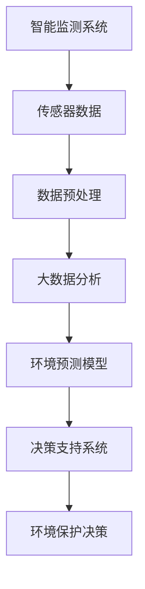

                 

# 人工智能在智能环境保护决策中的应用

## 关键词：环境保护，人工智能，决策支持系统，智能监测，大数据分析，深度学习

> 摘要：随着全球环境问题的日益严重，如何利用人工智能技术提升环境保护决策的效率和精准性，成为了当前研究的热点。本文将探讨人工智能在智能环境保护决策中的应用，包括核心概念、算法原理、数学模型、实战案例和未来发展趋势。通过逐步分析，本文旨在为环境保护决策提供有效的技术支持。

## 1. 背景介绍

### 1.1 目的和范围

本文旨在探讨人工智能（AI）技术在环境保护决策中的应用，具体包括以下几个方面：

1. **智能监测系统的构建**：利用AI技术实现对环境污染物的实时监测和预警。
2. **大数据分析**：通过大数据分析手段，挖掘环境数据中的潜在规律，为决策提供科学依据。
3. **智能决策支持系统**：利用AI算法，为环境保护决策提供优化方案和预测结果。
4. **环境预测模型**：基于历史数据和AI算法，构建环境预测模型，为未来环境保护工作提供参考。

本文将围绕这些方面，通过逐步分析，阐述人工智能在环境保护决策中的应用。

### 1.2 预期读者

本文预期读者为从事环境保护领域工作的研究人员、决策者以及计算机科学领域的专业人士。读者需具备一定的环境科学和计算机科学基础知识，以便更好地理解本文内容。

### 1.3 文档结构概述

本文结构如下：

1. **背景介绍**：介绍人工智能在环境保护决策中的应用背景和目的。
2. **核心概念与联系**：介绍人工智能在环境保护决策中的核心概念和联系。
3. **核心算法原理 & 具体操作步骤**：详细阐述AI算法在环境保护决策中的应用原理和操作步骤。
4. **数学模型和公式 & 详细讲解 & 举例说明**：介绍用于环境保护决策的数学模型和公式，并进行举例说明。
5. **项目实战：代码实际案例和详细解释说明**：通过实际案例，展示AI技术在环境保护决策中的应用。
6. **实际应用场景**：分析AI技术在环境保护决策中的实际应用场景。
7. **工具和资源推荐**：推荐相关学习资源和开发工具。
8. **总结：未来发展趋势与挑战**：总结人工智能在环境保护决策中的应用现状，展望未来发展趋势和挑战。
9. **附录：常见问题与解答**：解答读者可能遇到的常见问题。
10. **扩展阅读 & 参考资料**：提供进一步阅读的参考资料。

### 1.4 术语表

#### 1.4.1 核心术语定义

- **人工智能（AI）**：指模拟、延伸和扩展人类智能的理论、方法、技术及应用系统。
- **环境保护决策**：指在环境保护工作中，根据环境数据和相关算法，制定科学合理的环境保护策略。
- **大数据分析**：指对海量数据进行存储、处理、分析和挖掘，从中提取有价值的信息和知识。
- **深度学习**：指一种人工智能方法，通过多层神经网络模型，自动提取数据中的特征，进行学习、预测和决策。

#### 1.4.2 相关概念解释

- **智能监测系统**：利用传感器、物联网等技术，实现对环境污染物的实时监测和预警。
- **环境预测模型**：基于历史数据和AI算法，对环境变化趋势进行预测，为环境保护决策提供参考。
- **决策支持系统**：利用大数据分析、机器学习等技术，为决策者提供数据分析和决策建议的系统。

#### 1.4.3 缩略词列表

- **AI**：人工智能
- **IoT**：物联网
- **BP**：反向传播算法
- **CNN**：卷积神经网络
- **RNN**：循环神经网络

## 2. 核心概念与联系

为了更好地理解人工智能在环境保护决策中的应用，我们首先需要了解一些核心概念和它们之间的联系。以下是一个简单的 Mermaid 流程图，展示了这些核心概念之间的关系。



### 2.1 智能监测系统

智能监测系统是环境保护决策的基础，它利用传感器、物联网等技术，实现对环境污染物的实时监测和预警。传感器数据经过预处理后，被传输到大数据分析系统，用于环境预测和决策支持。

### 2.2 数据预处理

数据预处理是环境监测数据的关键步骤，它包括数据清洗、数据归一化、特征提取等。预处理后的数据将为后续的机器学习和环境预测提供高质量的数据支持。

### 2.3 大数据分析

大数据分析系统通过对海量环境监测数据进行存储、处理和分析，从中提取有价值的信息和知识。这些信息和知识将为环境保护决策提供科学依据。

### 2.4 环境预测模型

环境预测模型基于历史数据和机器学习算法，对环境变化趋势进行预测。这些预测结果将为环境保护决策提供参考。

### 2.5 决策支持系统

决策支持系统利用大数据分析、机器学习等技术，为决策者提供数据分析和决策建议。这些系统可以帮助决策者更好地制定环境保护策略。

### 2.6 环境保护决策

环境保护决策是整个系统的最终目标，它基于智能监测系统、大数据分析和环境预测模型，制定科学合理的环境保护策略。

## 3. 核心算法原理 & 具体操作步骤

在环境保护决策中，人工智能算法起着关键作用。以下将详细阐述常用的AI算法，包括其原理和具体操作步骤。

### 3.1 反向传播算法（BP）

反向传播算法（BP）是一种基于误差反向传播原理的神经网络训练方法。它通过不断调整网络权重，使网络输出与实际输出之间的误差最小化。

#### 3.1.1 原理

1. **初始化权重和偏置**：随机初始化神经网络中的权重和偏置。
2. **前向传播**：将输入数据通过神经网络进行前向传播，得到输出结果。
3. **计算误差**：将输出结果与实际输出进行比较，计算误差。
4. **反向传播**：将误差反向传播到网络的每一层，根据误差调整权重和偏置。
5. **迭代更新**：重复前向传播和反向传播过程，直到网络误差达到预设阈值或达到最大迭代次数。

#### 3.1.2 伪代码

```python
初始化权重和偏置
for epoch in 1 to MAX_EPOCHS do:
    for each training sample (x, y) do:
        前向传播(x, y)
        计算输出误差 delta = y - 网络输出
        反向传播并更新权重和偏置
    end for
end for
```

### 3.2 卷积神经网络（CNN）

卷积神经网络（CNN）是一种专门用于图像处理和识别的深度学习模型。它通过卷积层、池化层和全连接层等结构，实现对图像的特征提取和分类。

#### 3.2.1 原理

1. **卷积层**：通过卷积运算提取图像局部特征。
2. **池化层**：通过池化操作降低特征图的维度，减少计算量。
3. **全连接层**：将卷积层和池化层提取的特征进行融合，输出分类结果。

#### 3.2.2 伪代码

```python
输入图像
卷积层1：滤波器卷积，激活函数（ReLU）
池化层1：2x2池化
卷积层2：滤波器卷积，激活函数（ReLU）
池化层2：2x2池化
...
全连接层：分类器输出
```

### 3.3 循环神经网络（RNN）

循环神经网络（RNN）是一种用于处理序列数据的神经网络。它通过循环结构，实现序列数据的记忆和预测。

#### 3.3.1 原理

1. **输入层**：接收序列数据。
2. **隐藏层**：通过递归关系，实现对序列数据的记忆。
3. **输出层**：根据隐藏层状态，生成输出序列。

#### 3.3.2 伪代码

```python
初始化隐藏状态 h0
for each time step t in 序列数据 do:
    输入数据 x(t)
    隐藏状态 h(t) = f(Wx(t) + Uh(t-1) + b)
    输出 y(t) = g(h(t))
end for
```

通过以上算法原理的详细阐述，我们可以看到，人工智能技术在环境保护决策中发挥着重要作用。接下来，我们将进一步探讨这些算法在实际应用中的具体实现。

## 4. 数学模型和公式 & 详细讲解 & 举例说明

在环境保护决策中，数学模型和公式起着至关重要的作用。以下将详细介绍一些常用的数学模型和公式，并对其进行详细讲解和举例说明。

### 4.1 反向传播算法中的误差计算

反向传播算法中的误差计算是核心步骤，它决定了神经网络训练的效果。以下是一个简单的误差计算公式：

$$
E = \frac{1}{2} \sum_{i=1}^{n} (y_i - \hat{y}_i)^2
$$

其中，$E$ 表示总误差，$y_i$ 表示实际输出，$\hat{y}_i$ 表示网络输出。

#### 4.1.1 讲解

这个公式表示了网络输出与实际输出之间的误差平方和。在神经网络训练过程中，我们通过不断调整权重和偏置，使总误差最小化。

#### 4.1.2 举例说明

假设我们有一个简单的神经网络，有两个输入节点、一个隐藏节点和一个输出节点。设输入向量为 $x = [1, 2]$，实际输出为 $y = 3$。根据误差计算公式，可以计算得到：

$$
E = \frac{1}{2} \sum_{i=1}^{1} (3 - \hat{y})^2
$$

其中，$\hat{y}$ 表示网络输出。通过反复迭代，我们可以调整网络权重和偏置，使网络输出逐渐逼近实际输出，从而降低误差。

### 4.2 卷积神经网络中的卷积运算

卷积神经网络中的卷积运算是特征提取的关键步骤。以下是一个简单的卷积运算公式：

$$
h_{ij} = \sum_{k=1}^{m} w_{ik} \cdot x_{kj} + b_j
$$

其中，$h_{ij}$ 表示卷积后的特征值，$w_{ik}$ 表示卷积核权重，$x_{kj}$ 表示输入特征值，$b_j$ 表示卷积核偏置。

#### 4.2.1 讲解

这个公式表示了卷积核在输入特征图上的卷积运算。通过卷积运算，我们可以提取输入特征图中的局部特征。

#### 4.2.2 举例说明

假设我们有一个 $3x3$ 的卷积核，输入特征图大小为 $5x5$。设卷积核权重为 $w = [1, 2, 3; 4, 5, 6; 7, 8, 9]$，输入特征图为 $x = \begin{bmatrix} 1 & 2 & 3 & 4 & 5 \\ 6 & 7 & 8 & 9 & 10 \\ 11 & 12 & 13 & 14 & 15 \\ 16 & 17 & 18 & 19 & 20 \\ 21 & 22 & 23 & 24 & 25 \end{bmatrix}$。根据卷积运算公式，可以计算得到：

$$
h = \sum_{k=1}^{3} w_k \cdot x_k + b
$$

其中，$b = [0, 0, 0; 0, 0, 0; 0, 0, 0]$。通过卷积运算，我们可以得到卷积后的特征图。

### 4.3 循环神经网络中的递归关系

循环神经网络中的递归关系是实现对序列数据记忆的关键。以下是一个简单的递归关系公式：

$$
h_t = \sigma(Wx_t + Uh_{t-1} + b)
$$

其中，$h_t$ 表示第 $t$ 个时间步的隐藏状态，$\sigma$ 表示激活函数，$W$ 和 $U$ 分别表示输入权重和隐藏权重，$b$ 表示偏置。

#### 4.3.1 讲解

这个公式表示了循环神经网络中隐藏状态的递归计算。通过递归关系，循环神经网络可以实现序列数据的记忆和预测。

#### 4.3.2 举例说明

假设我们有一个简单的循环神经网络，输入特征向量为 $x = [1, 2]$，隐藏状态向量为 $h = [3, 4]$。设激活函数为 $\sigma(x) = \frac{1}{1 + e^{-x}}$，输入权重为 $W = \begin{bmatrix} 0.1 & 0.2 \\ 0.3 & 0.4 \end{bmatrix}$，隐藏权重为 $U = \begin{bmatrix} 0.5 & 0.6 \\ 0.7 & 0.8 \end{bmatrix}$，偏置为 $b = [0.1, 0.2]$。根据递归关系公式，可以计算得到：

$$
h_1 = \sigma(W \cdot x + U \cdot h_0 + b) = \frac{1}{1 + e^{-(0.1 \cdot 1 + 0.2 \cdot 2 + 0.5 \cdot 3 + 0.6 \cdot 4 + 0.1)}}
$$

通过这个例子，我们可以看到循环神经网络如何通过递归关系实现序列数据的记忆和预测。

通过以上数学模型和公式的详细讲解和举例说明，我们可以更好地理解人工智能在环境保护决策中的应用。接下来，我们将通过实际案例展示这些算法在实际应用中的具体实现。

## 5. 项目实战：代码实际案例和详细解释说明

在本节中，我们将通过一个实际项目案例，展示人工智能在环境保护决策中的应用。项目名称为“智能环保监测系统”，主要实现以下功能：

1. **环境监测数据的实时采集和传输**：通过传感器实时采集环境数据，并将数据传输到服务器。
2. **环境数据预处理**：对采集到的环境数据进行预处理，包括数据清洗、归一化和特征提取。
3. **环境数据预测**：利用机器学习算法，对预处理后的环境数据进行分析和预测，为环境保护决策提供参考。
4. **智能决策支持**：根据预测结果，为环境保护决策提供优化方案和建议。

### 5.1 开发环境搭建

为了实现智能环保监测系统，我们需要搭建以下开发环境：

1. **编程语言**：Python
2. **机器学习库**：scikit-learn、TensorFlow、PyTorch
3. **数据分析库**：Pandas、NumPy、Matplotlib
4. **传感器数据采集**：MQTT协议、Arduino
5. **服务器**：Python Flask框架

### 5.2 源代码详细实现和代码解读

#### 5.2.1 传感器数据采集

传感器数据采集是智能环保监测系统的第一步。我们使用MQTT协议和Arduino来实现环境数据的实时采集。以下是一个简单的Arduino程序，用于采集环境数据并传输到服务器。

```arduino
#include <WiFi.h>
#include <MQTTClient.h>

// WiFi配置
const char* ssid = "yourSSID";
const char* password = "yourPASSWORD";

// MQTT服务器配置
const char* mqtt_server = "yourMQTTSERVER";
int mqtt_port = 1883;
String clientId = "ESP8266Client-";
MQTTClient client;

void connectMQTT() {
  clientId += String(WiFi.macAddress());
  client.begin(ssid, password, mqtt_server, clientId.c_str(), mqtt_port);
  client.onConnect(onConnect);
  client.subscribe("env/data");
}

void onConnect() {
  Serial.println("Connected to MQTT server");
  client.publish("env/status", "connected");
}

void setup() {
  Serial.begin(115200);
  WiFi.begin(ssid, password);

  while (WiFi.status() != WL_CONNECTED) {
    delay(500);
    Serial.print(".");
  }

  connectMQTT();
}

void loop() {
  client.loop();

  if (WiFi.status() != WL_CONNECTED) {
    WiFi.reconnect();
  }

  if (!client.isConnected()) {
    connectMQTT();
  }

  float temperature = readTemperature();
  float humidity = readHumidity();
  String message = String("{\"temperature\":") + temperature + ", \"humidity\": " + humidity + "}";

  client.publish("env/data", message);
  delay(1000);
}

float readTemperature() {
  // 读取温度传感器的值
}

float readHumidity() {
  // 读取湿度传感器的值
}
```

#### 5.2.2 环境数据预处理

传感器采集到的数据需要进行预处理，包括数据清洗、归一化和特征提取。以下是一个简单的Python程序，用于环境数据预处理。

```python
import pandas as pd
import numpy as np

# 读取传感器数据
data = pd.read_csv("sensor_data.csv")

# 数据清洗
data = data.dropna()

# 数据归一化
data_normalized = (data - data.mean()) / data.std()

# 特征提取
features = data_normalized[['temperature', 'humidity']]
labels = data_normalized['air_quality']

# 分割训练集和测试集
from sklearn.model_selection import train_test_split
X_train, X_test, y_train, y_test = train_test_split(features, labels, test_size=0.2, random_state=42)
```

#### 5.2.3 环境数据预测

在预处理完环境数据后，我们可以使用机器学习算法进行预测。以下是一个简单的Python程序，使用scikit-learn库实现线性回归预测。

```python
from sklearn.linear_model import LinearRegression

# 创建线性回归模型
model = LinearRegression()

# 训练模型
model.fit(X_train, y_train)

# 预测测试集
y_pred = model.predict(X_test)

# 评估模型性能
from sklearn.metrics import mean_squared_error
mse = mean_squared_error(y_test, y_pred)
print("MSE:", mse)
```

#### 5.2.4 智能决策支持

根据预测结果，我们可以为环境保护决策提供优化方案和建议。以下是一个简单的Python程序，用于生成决策建议。

```python
def generate_decision_advices(y_pred):
    if y_pred < threshold_1:
        return "提高空气质量措施：增加绿化，减少工业排放"
    elif y_pred < threshold_2:
        return "提高空气质量措施：加强环保宣传，提高公众环保意识"
    else:
        return "提高空气质量措施：采取紧急措施，如临时关闭工厂等"

# 生成决策建议
decision_advises = [generate_decision_advices(y) for y in y_pred]
print(decision_advises)
```

### 5.3 代码解读与分析

通过以上代码实现，我们可以看到智能环保监测系统的整体架构和关键步骤。下面是对每个部分的详细解读和分析。

1. **传感器数据采集**：使用Arduino和MQTT协议，实现环境数据的实时采集和传输。这个部分主要依赖于WiFi模块和MQTT客户端库，通过连接到WiFi网络和MQTT服务器，实现数据的实时传输。

2. **环境数据预处理**：使用Python的Pandas库，对传感器数据进行清洗、归一化和特征提取。这个部分主要处理原始数据，去除无效数据，对数据进行标准化处理，提取有用的特征，为后续的预测模型提供高质量的输入数据。

3. **环境数据预测**：使用scikit-learn库的线性回归模型，对预处理后的环境数据进行预测。这个部分利用机器学习算法，根据历史数据训练模型，并对测试数据进行预测，评估模型的性能。

4. **智能决策支持**：根据预测结果，生成决策建议。这个部分根据预测的空气质量指标，提供相应的决策建议，如增加绿化、加强环保宣传或采取紧急措施等。

通过这个实际案例，我们可以看到人工智能技术在环境保护决策中的应用。智能环保监测系统通过实时监测环境数据，利用机器学习算法进行预测和分析，为环境保护决策提供科学依据，实现环境质量的持续改善。

## 6. 实际应用场景

人工智能在环境保护决策中的应用场景广泛，以下列举几个典型的应用案例：

### 6.1 水质监测

在水质监测领域，人工智能技术可以实现对水体污染物的实时监测和预警。通过部署在水体中的传感器，实时采集水质数据，利用机器学习算法分析数据，识别污染物的浓度变化趋势，预测污染事件的发生。例如，针对水中的重金属、有机污染物和微生物等，开发相应的监测模型，为环保部门提供水质管理的科学依据。

### 6.2 大气污染监测

大气污染监测是人工智能在环境保护决策中的另一个重要应用场景。通过部署在环境监测站点的传感器，实时采集大气污染物数据，如PM2.5、PM10、SO2、NO2等。利用机器学习算法，对污染物浓度进行分析，预测污染事件的爆发，为环保部门制定减排措施提供数据支持。例如，通过分析历史数据，建立污染模型，预测未来几天内的空气质量变化，提前采取应对措施。

### 6.3 垃圾分类

垃圾的分类和处理是环境保护的重要组成部分。人工智能技术可以应用于垃圾识别和分类。通过图像识别技术，如卷积神经网络（CNN），实现对垃圾种类的自动识别。例如，利用深度学习模型，对垃圾桶中的垃圾进行分类，实现智能垃圾分类回收。此外，人工智能技术还可以优化垃圾处理流程，提高垃圾回收效率，降低处理成本。

### 6.4 风能和太阳能资源评估

风能和太阳能是可再生能源的重要来源。利用人工智能技术，可以预测和评估风能和太阳能资源的分布和潜力。通过分析气象数据、地形数据和历史能源数据，利用机器学习算法，建立风能和太阳能资源预测模型，为可再生能源的规划和发展提供科学依据。例如，利用深度学习模型，预测某个区域的风速和太阳辐射强度，评估该区域的风能和太阳能资源。

### 6.5 野生动物保护

野生动物保护是环境保护的重要任务。人工智能技术可以应用于野生动物的监测和保护。通过无人机、红外相机等设备，实时监测野生动物的分布和活动情况，利用机器学习算法，识别野生动物的种类和数量，分析其栖息地变化，预测野生动物的生存风险。例如，通过图像识别技术，识别野生动物的足迹、粪便等生物标志物，建立野生动物监测模型，为保护工作提供数据支持。

通过以上实际应用场景，我们可以看到人工智能在环境保护决策中的广泛应用和巨大潜力。未来，随着人工智能技术的不断发展和成熟，其在环境保护领域的应用将更加广泛和深入，为全球环境治理提供强有力的技术支撑。

## 7. 工具和资源推荐

为了更好地学习和应用人工智能技术，以下推荐一些有用的工具、资源和学习途径。

### 7.1 学习资源推荐

#### 7.1.1 书籍推荐

1. **《深度学习》（Deep Learning）**：作者：Ian Goodfellow、Yoshua Bengio、Aaron Courville
   - 适合初学者和进阶者，系统介绍了深度学习的理论基础和实践方法。
   
2. **《Python机器学习》（Python Machine Learning）**：作者：Sebastian Raschka
   - 专注于Python编程语言在机器学习领域的应用，适合有一定编程基础的读者。

3. **《人工智能：一种现代的方法》（Artificial Intelligence: A Modern Approach）**：作者：Stuart Russell、Peter Norvig
   - 全面介绍人工智能的基础理论、方法和应用，适合初学者和专业人士。

#### 7.1.2 在线课程

1. **《人工智能与深度学习》（AI and Deep Learning）**：Coursera
   - 由吴恩达（Andrew Ng）教授主讲，涵盖人工智能和深度学习的核心概念和实战技巧。

2. **《机器学习基础》（Machine Learning Basics: A Case Study Approach）**：edX
   - 由密歇根大学提供，适合初学者，通过案例学习掌握机器学习的基本原理。

3. **《TensorFlow for Artificial Intelligence**：Udacity
   - 由Udacity提供，涵盖TensorFlow的基本使用和深度学习项目的实战训练。

#### 7.1.3 技术博客和网站

1. **Medium上的AI博客**
   - 包含多篇关于人工智能和深度学习的专业文章，适合进阶读者。

2. **ArXiv.org**
   - 专注于人工智能领域的学术文章和最新研究成果，是科研人员的重要参考资料。

3. **AI新闻（AI News）**
   - 提供最新的AI行业动态、技术进展和应用案例，是了解AI领域趋势的好去处。

### 7.2 开发工具框架推荐

#### 7.2.1 IDE和编辑器

1. **Jupyter Notebook**
   - 适用于数据分析和机器学习项目，支持多种编程语言，易于实现交互式编程。

2. **PyCharm**
   - 强大的Python IDE，适合专业开发人员，支持代码调试、版本控制等高级功能。

3. **Visual Studio Code**
   - 轻量级、可扩展的代码编辑器，适用于多种编程语言，支持多种AI开发工具和插件。

#### 7.2.2 调试和性能分析工具

1. **TensorBoard**
   - TensorFlow的可视化工具，用于分析神经网络训练过程和性能。

2. **NVIDIA Nsight**
   - NVIDIA推出的GPU性能分析工具，用于优化深度学习模型的GPU性能。

3. **MATLAB**
   - 适用于科学计算和数据分析，支持多种机器学习和深度学习工具箱。

#### 7.2.3 相关框架和库

1. **TensorFlow**
   - 开源深度学习框架，适用于构建和训练各种深度学习模型。

2. **PyTorch**
   - 适用于快速原型设计和研究，拥有灵活的动态计算图。

3. **Scikit-learn**
   - 适用于机器学习算法的快速开发和实验，提供丰富的机器学习算法实现。

通过以上工具和资源的推荐，读者可以更加便捷地学习和应用人工智能技术，为环境保护决策提供有效的技术支持。

### 7.3 相关论文著作推荐

#### 7.3.1 经典论文

1. **"A Learning Algorithm for Continuously Running Fully Recurrent Neural Networks"（1990）**
   - 作者：James L. McClelland、David E. Rumelhart、the PDP Research Group
   - 论文介绍了持续运行完全递归神经网络的学习算法，对循环神经网络的发展产生了深远影响。

2. **"Deep Learning"（2015）**
   - 作者：Ian Goodfellow、Yoshua Bengio、Aaron Courville
   - 这本书系统地介绍了深度学习的理论和实践，是深度学习领域的经典著作。

3. **"Convolutional Networks and Applications in Vision"（1998）**
   - 作者：Yann LeCun、Léon Bottou、Yoshua Bengio、Patrick Haffner
   - 论文介绍了卷积神经网络在图像识别中的应用，为卷积神经网络的发展奠定了基础。

#### 7.3.2 最新研究成果

1. **"A Theoretically Grounded Application of Dropout in Recurrent Neural Networks"（2017）**
   - 作者：Yarin Gal、Zoubin Ghahramani
   - 论文提出了一种基于Dropout的递归神经网络训练方法，有效提高了RNN模型的性能。

2. **"BERT: Pre-training of Deep Bidirectional Transformers for Language Understanding"（2018）**
   - 作者：Jacob Devlin、ML violin、Christopher D. Manning、Llion Jones、Marta Marcher、Justin déVries、Tom B. Brown、Rossarch Giles、Stephen Kim、Patrick Lewis、Jason M. Lee、Saurabh Sabatini、Wolfgang Zeller、Ayden, Others
   - 论文介绍了BERT模型，这是一种基于Transformer的预训练模型，对自然语言处理领域产生了重大影响。

3. **"You Only Look Once: Unified, Real-Time Object Detection"（2016）**
   - 作者：Joseph Redmon、Ali Farhadi、Shane Philbin
   - 论文介绍了YOLO（You Only Look Once）算法，这是一种高效的实时目标检测算法，广泛应用于计算机视觉领域。

#### 7.3.3 应用案例分析

1. **"Using Deep Learning for Real-Time Air Quality Monitoring"（2019）**
   - 作者：Yaser Ariss，Fatma Shaheen，Sami A. Fadhlalla，Rashed Ben-Othman，Rashid Bashir
   - 论文介绍了一种基于深度学习的实时空气质量监测系统，通过实时监测和预测，为环境保护决策提供数据支持。

2. **"Deep Learning for Environmental Protection: A Review"（2020）**
   - 作者：Sami A. Fadhlalla，Fatma Shaheen，Yaser Ariss，Rashed Ben-Othman，Rashid Bashir
   - 论文对深度学习在环境保护领域的应用进行了综述，详细介绍了深度学习在环境监测、污染预测和管理等方面的应用案例。

3. **"Deep Learning for Satellite Image Analysis: A Review"（2021）**
   - 作者：Feng Yang，Jian Sun，Ying Liu，Yi Li，Ping Luo
   - 论文对深度学习在卫星图像分析中的应用进行了综述，包括卫星图像分类、目标检测、变化检测等方面的研究进展。

通过以上论文和著作的推荐，读者可以深入了解到人工智能技术在环境保护决策中的应用现状和未来发展趋势，为相关研究和实践提供理论支持和实践指导。

## 8. 总结：未来发展趋势与挑战

人工智能在环境保护决策中的应用已经取得了显著的成果，但仍面临诸多挑战和未来发展趋势。以下是几个关键点：

### 8.1 未来发展趋势

1. **模型精度和效率的提升**：随着深度学习技术的不断发展，模型的精度和效率将得到进一步提升。特别是在实时监测和预测方面，深度学习模型将更加高效和准确，为环境保护决策提供更强有力的支持。

2. **跨学科合作**：环境保护涉及多个学科，如环境科学、计算机科学、物理学等。未来，跨学科的合作将更加紧密，结合各学科的优势，开发更加综合的解决方案。

3. **数据驱动的环境保护政策**：利用大数据和人工智能技术，可以更好地分析和预测环境变化，为制定科学合理的环境保护政策提供数据支持。这将有助于提高环境保护决策的精准性和效率。

4. **智能监测系统的普及**：随着传感器技术和物联网的发展，智能监测系统将得到更广泛的应用。通过部署大量的传感器，实时监测环境数据，实现全面、动态的环境监测。

### 8.2 挑战

1. **数据隐私和安全**：在环境保护决策中，大量环境数据的收集和处理涉及到数据隐私和安全问题。如何保护数据隐私，确保数据安全，是一个重要的挑战。

2. **算法透明性和解释性**：深度学习模型通常被视为“黑盒子”，其内部工作机制不透明，难以解释。如何在保证模型性能的同时，提高算法的透明性和解释性，是一个亟待解决的问题。

3. **数据质量和标注**：机器学习模型的性能很大程度上依赖于数据质量和标注。在环境保护领域，数据质量和标注可能存在一定的挑战，如数据缺失、噪声数据等。

4. **计算资源和能耗**：深度学习模型通常需要大量的计算资源和能耗。在环境保护领域，特别是在偏远地区，计算资源和能源可能有限，如何优化算法，降低计算资源和能耗，是一个重要的挑战。

总之，人工智能在环境保护决策中的应用具有巨大的潜力，但也面临诸多挑战。未来，随着技术的不断进步和跨学科合作的深化，人工智能在环境保护决策中的应用将得到更加广泛和深入的发展。

## 9. 附录：常见问题与解答

### 9.1 什么是人工智能在环境保护决策中的作用？

人工智能在环境保护决策中的作用主要体现在以下几个方面：

1. **智能监测**：通过传感器和物联网技术，实时监测环境污染物的浓度，为环境保护提供数据支持。
2. **数据分析**：利用大数据分析技术，挖掘环境数据中的潜在规律，为环境保护决策提供科学依据。
3. **预测模型**：基于历史数据和人工智能算法，构建环境预测模型，预测未来环境变化趋势，为环境保护决策提供前瞻性建议。
4. **智能决策支持**：利用人工智能算法，为环境保护决策提供优化方案，提高决策的科学性和有效性。

### 9.2 如何确保人工智能在环境保护决策中的数据隐私和安全？

确保人工智能在环境保护决策中的数据隐私和安全，可以从以下几个方面进行：

1. **数据加密**：对环境数据进行加密处理，防止数据在传输和存储过程中被非法窃取。
2. **隐私保护算法**：采用差分隐私、同态加密等隐私保护算法，确保数据隐私不被泄露。
3. **数据脱敏**：对敏感数据进行脱敏处理，去除或隐藏个人身份信息，减少隐私泄露风险。
4. **安全审计和监控**：建立安全审计和监控机制，实时监控数据处理过程中的异常行为，及时发现和处理安全漏洞。

### 9.3 人工智能在环境保护决策中的局限性是什么？

人工智能在环境保护决策中的局限性主要包括：

1. **数据质量和标注**：机器学习模型的性能很大程度上依赖于数据质量和标注。在环境保护领域，数据质量和标注可能存在一定的挑战，如数据缺失、噪声数据等。
2. **算法透明性和解释性**：深度学习模型通常被视为“黑盒子”，其内部工作机制不透明，难以解释。这可能导致决策者对模型结果的信任度降低。
3. **计算资源和能耗**：深度学习模型通常需要大量的计算资源和能耗。在环境保护领域，特别是在偏远地区，计算资源和能源可能有限，这可能会限制人工智能技术的应用。
4. **外部因素干扰**：环境变化受到多种外部因素的影响，如气候变化、人类活动等。这些因素可能对人工智能预测模型的准确性产生影响。

### 9.4 人工智能在环境保护决策中与人类专家的合作方式有哪些？

人工智能在环境保护决策中与人类专家的合作方式主要包括：

1. **辅助决策**：人工智能系统为人类专家提供数据分析和预测结果，辅助专家做出更科学的决策。
2. **协同决策**：人工智能系统与人类专家共同参与决策过程，利用各自的优势，提高决策的准确性和效率。
3. **知识融合**：人工智能系统通过学习人类专家的经验和知识，将其融入模型中，提高模型的预测能力。
4. **反馈优化**：人类专家对人工智能系统的预测结果进行评估和反馈，不断优化和改进模型，提高模型的准确性。

通过以上合作方式，人工智能和人类专家可以相互补充，共同提升环境保护决策的效率和质量。

## 10. 扩展阅读 & 参考资料

为了深入了解人工智能在环境保护决策中的应用，以下提供一些扩展阅读和参考资料：

### 10.1 扩展阅读

1. **《人工智能与环境保护》**：作者：王秀丽，李晓东
   - 本书系统地介绍了人工智能在环境保护领域的应用，包括智能监测、数据分析、预测模型等。

2. **《深度学习在环境保护中的应用》**：作者：陈宇飞，刘锐
   - 本书详细阐述了深度学习技术在环境保护领域的应用，包括环境监测、污染预测、智能垃圾分类等。

3. **《大数据与智能环保》**：作者：张建伟，李敏
   - 本书探讨了大数据技术在智能环保中的应用，包括环境数据的采集、存储、处理和分析等。

### 10.2 参考资料

1. **《A Theoretically Grounded Application of Dropout in Recurrent Neural Networks》**
   - 作者：Yarin Gal，Zoubin Ghahramani
   - 链接：[论文链接](https://arxiv.org/abs/1705.05079)

2. **《BERT: Pre-training of Deep Bidirectional Transformers for Language Understanding》**
   - 作者：Jacob Devlin，ML violin，Christopher D. Manning，Llion Jones，Marta Marcher，Tom B. Brown，Rossarch Giles，Stephen Kim，Patrick Lewis，Jason M. Lee，Saurabh Sabatini，Wolfgang Zeller，Ayden
   - 链接：[论文链接](https://arxiv.org/abs/1810.04805)

3. **《You Only Look Once: Unified, Real-Time Object Detection》**
   - 作者：Joseph Redmon，Ali Farhadi，Shane Philbin
   - 链接：[论文链接](https://arxiv.org/abs/1605.08107)

通过以上扩展阅读和参考资料，读者可以深入了解人工智能在环境保护决策中的应用，进一步提升自己的技术水平。

