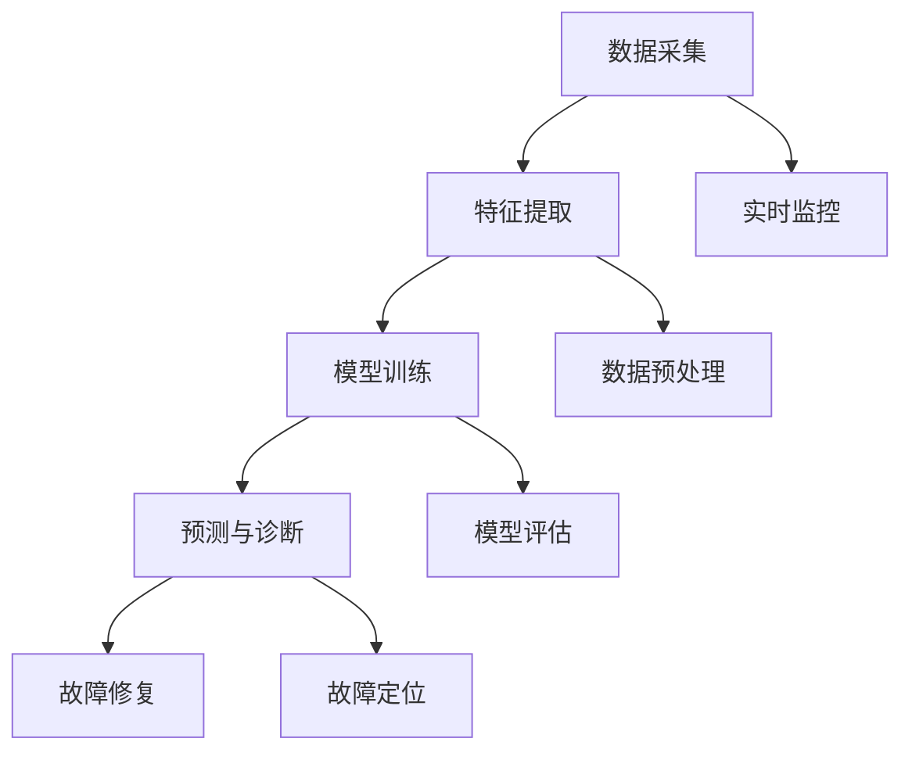

                 

# 人工智能在智能电网故障预测与诊断中的应用

> **关键词：** 智能电网，故障预测，诊断，人工智能，机器学习，深度学习

> **摘要：** 本文深入探讨了人工智能在智能电网故障预测与诊断中的应用。通过对智能电网的基本概念、故障类型及其影响的分析，我们介绍了机器学习和深度学习在故障预测和诊断中的核心算法原理。同时，通过实际项目案例的解析，展示了人工智能技术在智能电网故障预测与诊断中的具体实现方法，并对未来发展趋势与挑战进行了展望。

## 1. 背景介绍

### 1.1 目的和范围

本文旨在介绍人工智能在智能电网故障预测与诊断中的应用，通过解析相关算法原理、实现方法，探讨其当前的发展状况和未来趋势。文章将从以下几个方面展开：

- 智能电网的基本概念和故障类型
- 人工智能在故障预测和诊断中的核心算法原理
- 实际项目案例的代码实现和分析
- 智能电网故障预测与诊断的应用场景
- 未来发展趋势与挑战

### 1.2 预期读者

本文主要面向智能电网领域的研究者、工程师以及计算机科学专业的学生。读者需要对智能电网和人工智能的基本概念有一定了解，以便更好地理解文章内容。

### 1.3 文档结构概述

本文结构如下：

- 第1部分：背景介绍，包括目的和范围、预期读者、文档结构概述等
- 第2部分：核心概念与联系，介绍智能电网故障预测与诊断的相关概念和架构
- 第3部分：核心算法原理与具体操作步骤，详细讲解机器学习和深度学习算法在故障预测与诊断中的应用
- 第4部分：数学模型和公式，阐述故障预测与诊断中的数学模型和公式
- 第5部分：项目实战，通过实际案例展示人工智能在智能电网故障预测与诊断中的应用
- 第6部分：实际应用场景，分析人工智能在智能电网故障预测与诊断中的具体应用场景
- 第7部分：工具和资源推荐，介绍学习资源、开发工具框架和相关论文著作
- 第8部分：总结：未来发展趋势与挑战
- 第9部分：附录：常见问题与解答
- 第10部分：扩展阅读 & 参考资料

### 1.4 术语表

#### 1.4.1 核心术语定义

- **智能电网（Smart Grid）：** 智能电网是集成了现代通信技术、自动控制技术、电力电子技术等先进技术的电力网络，可实现电能的智能化传输、分配和使用。
- **故障预测（Fault Prediction）：** 通过分析电网的历史数据、实时数据等，预测电网可能出现故障的类型、时间和位置。
- **诊断（Diagnosis）：** 在故障发生后，对电网进行实时检测和诊断，确定故障的具体原因和位置，为故障修复提供依据。
- **机器学习（Machine Learning）：** 一种人工智能技术，通过算法自动从数据中学习规律，进行预测和决策。
- **深度学习（Deep Learning）：** 一种基于人工神经网络的机器学习技术，通过多层神经网络模型对数据进行特征提取和建模。

#### 1.4.2 相关概念解释

- **数据挖掘（Data Mining）：** 从大量数据中发现有价值的信息、模式和规律。
- **神经网络（Neural Network）：** 模拟生物神经网络的信息处理模型，由大量简单神经元组成。
- **卷积神经网络（Convolutional Neural Network，CNN）：** 一种特殊的神经网络，主要用于图像和语音处理。
- **递归神经网络（Recurrent Neural Network，RNN）：** 一种神经网络，能够处理序列数据，如时间序列数据。
- **生成对抗网络（Generative Adversarial Network，GAN）：** 一种基于对抗训练的神经网络模型，用于图像生成和特征提取。

#### 1.4.3 缩略词列表

- **AI：** 人工智能（Artificial Intelligence）
- **ML：** 机器学习（Machine Learning）
- **DL：** 深度学习（Deep Learning）
- **SG：** 智能电网（Smart Grid）
- **FT：** 故障预测（Fault Prediction）
- **Dx：** 诊断（Diagnosis）
- **CNNS：** 卷积神经网络（Convolutional Neural Networks）
- **RNNs：** 递归神经网络（Recurrent Neural Networks）
- **GANs：** 生成对抗网络（Generative Adversarial Networks）

## 2. 核心概念与联系

在智能电网故障预测与诊断中，核心概念包括数据采集、特征提取、模型训练、预测和诊断。下面我们将使用Mermaid流程图对相关概念和架构进行展示。



### 2.1 数据采集

数据采集是智能电网故障预测与诊断的基础。主要从以下几个方面获取数据：

- **历史数据：** 从电网的历史运行数据中提取故障发生的时间、位置、类型等信息。
- **实时数据：** 通过传感器、监测设备等获取电网实时运行数据，如电压、电流、温度等。
- **天气数据：** 天气变化对电网运行有一定影响，因此需要从气象部门获取相关数据。

### 2.2 特征提取

特征提取是将原始数据转化为适合模型训练的数据。主要任务包括：

- **数据预处理：** 对原始数据进行清洗、归一化等处理，去除噪声和异常值。
- **特征选择：** 从原始数据中筛选出对故障预测和诊断有重要影响的特征。
- **特征提取：** 利用统计方法、信号处理方法等对数据进行特征提取，如时域特征、频域特征、时频特征等。

### 2.3 模型训练

模型训练是利用已标记的故障数据进行训练，使模型能够学会预测和诊断故障。主要步骤包括：

- **模型选择：** 根据故障预测与诊断的需求，选择合适的机器学习或深度学习模型，如决策树、支持向量机、神经网络等。
- **数据划分：** 将数据集划分为训练集、验证集和测试集，用于模型训练和评估。
- **模型训练：** 利用训练集对模型进行训练，调整模型参数，使模型能够拟合数据。
- **模型评估：** 利用验证集对模型进行评估，选择性能较好的模型。

### 2.4 预测与诊断

预测与诊断是利用训练好的模型对电网运行状态进行实时预测和诊断。主要任务包括：

- **故障预测：** 利用训练好的模型，对电网运行状态进行实时预测，提前发现潜在故障。
- **故障诊断：** 在故障发生时，利用模型对故障类型、位置等进行诊断，为故障修复提供依据。

### 2.5 实时监控

实时监控是确保电网稳定运行的重要手段。主要任务包括：

- **实时数据采集：** 通过传感器、监测设备等实时获取电网运行数据。
- **异常检测：** 利用机器学习或深度学习算法，对实时数据进行异常检测，发现异常情况并及时处理。

### 2.6 故障修复

故障修复是确保电网正常运行的关键环节。主要任务包括：

- **故障定位：** 根据故障诊断结果，确定故障发生的位置。
- **故障处理：** 对故障点进行修复或更换，确保电网恢复正常运行。

通过上述核心概念和架构的展示，我们可以看到人工智能在智能电网故障预测与诊断中的应用是一个复杂的过程，涉及多个环节。接下来，我们将深入探讨核心算法原理与具体操作步骤。

## 3. 核心算法原理 & 具体操作步骤

在智能电网故障预测与诊断中，核心算法主要包括机器学习和深度学习。下面我们将分别介绍这两种算法的原理以及具体操作步骤。

### 3.1 机器学习算法

机器学习算法是人工智能的一个重要分支，通过学习数据中的规律，实现对未知数据的预测。在智能电网故障预测与诊断中，常用的机器学习算法包括决策树、支持向量机、神经网络等。

#### 3.1.1 决策树（Decision Tree）

决策树是一种基于树形结构进行决策的算法，通过将数据集划分成多个子集，并依据特征选择进行分割，直到达到某个停止条件。具体操作步骤如下：

1. **数据预处理：** 对原始数据进行清洗、归一化等处理。
2. **特征选择：** 选择对故障预测和诊断有重要影响的特征。
3. **构建决策树：** 根据特征选择和停止条件，构建决策树。
4. **模型训练：** 利用训练集对决策树进行训练，调整树结构和参数。
5. **模型评估：** 利用验证集对决策树进行评估，选择性能较好的模型。

#### 3.1.2 支持向量机（Support Vector Machine，SVM）

支持向量机是一种基于间隔最大化原则的线性分类算法，通过找到最优的超平面，将不同类别的数据分隔开。具体操作步骤如下：

1. **数据预处理：** 对原始数据进行清洗、归一化等处理。
2. **特征选择：** 选择对故障预测和诊断有重要影响的特征。
3. **核函数选择：** 根据数据特征选择合适的核函数。
4. **模型训练：** 利用训练集对支持向量机进行训练，调整参数和核函数。
5. **模型评估：** 利用验证集对支持向量机进行评估，选择性能较好的模型。

#### 3.1.3 神经网络（Neural Network）

神经网络是一种模拟生物神经元的计算模型，通过多层神经元之间的连接，实现对数据的特征提取和预测。在智能电网故障预测与诊断中，常用的神经网络包括前向传播神经网络、卷积神经网络和递归神经网络等。

1. **数据预处理：** 对原始数据进行清洗、归一化等处理。
2. **构建神经网络：** 设计神经网络的结构，包括输入层、隐藏层和输出层。
3. **初始化参数：** 初始化神经网络的权重和偏置。
4. **前向传播：** 将输入数据传递到神经网络，计算输出值。
5. **反向传播：** 计算输出值与真实值的误差，并更新网络参数。
6. **模型训练：** 利用训练集对神经网络进行训练，调整参数和结构。
7. **模型评估：** 利用验证集对神经网络进行评估，选择性能较好的模型。

### 3.2 深度学习算法

深度学习是一种基于多层神经网络进行特征提取和预测的算法，通过增加网络层数，提高模型的非线性表达能力。在智能电网故障预测与诊断中，常用的深度学习算法包括卷积神经网络、递归神经网络和生成对抗网络等。

#### 3.2.1 卷积神经网络（Convolutional Neural Network，CNN）

卷积神经网络是一种特殊的神经网络，主要用于图像和语音处理。通过卷积操作和池化操作，实现对数据的特征提取和压缩。

1. **数据预处理：** 对原始数据进行清洗、归一化等处理。
2. **构建CNN模型：** 设计CNN模型的结构，包括卷积层、池化层和全连接层。
3. **初始化参数：** 初始化CNN模型的权重和偏置。
4. **前向传播：** 将输入数据传递到CNN模型，计算输出值。
5. **反向传播：** 计算输出值与真实值的误差，并更新模型参数。
6. **模型训练：** 利用训练集对CNN模型进行训练，调整参数和结构。
7. **模型评估：** 利用验证集对CNN模型进行评估，选择性能较好的模型。

#### 3.2.2 递归神经网络（Recurrent Neural Network，RNN）

递归神经网络是一种能够处理序列数据的神经网络，通过递归连接，实现对时间序列数据的建模。

1. **数据预处理：** 对原始数据进行清洗、归一化等处理。
2. **构建RNN模型：** 设计RNN模型的结构，包括输入层、隐藏层和输出层。
3. **初始化参数：** 初始化RNN模型的权重和偏置。
4. **前向传播：** 将输入数据传递到RNN模型，计算输出值。
5. **反向传播：** 计算输出值与真实值的误差，并更新模型参数。
6. **模型训练：** 利用训练集对RNN模型进行训练，调整参数和结构。
7. **模型评估：** 利用验证集对RNN模型进行评估，选择性能较好的模型。

#### 3.2.3 生成对抗网络（Generative Adversarial Network，GAN）

生成对抗网络是一种基于对抗训练的神经网络模型，用于图像生成和特征提取。

1. **数据预处理：** 对原始数据进行清洗、归一化等处理。
2. **构建GAN模型：** 设计GAN模型的结构，包括生成器和判别器。
3. **初始化参数：** 初始化GAN模型的权重和偏置。
4. **生成器训练：** 利用生成器生成数据，并更新生成器参数。
5. **判别器训练：** 利用生成器和真实数据训练判别器，并更新判别器参数。
6. **模型训练：** 交替训练生成器和判别器，直到生成器能够生成接近真实数据。
7. **模型评估：** 利用验证集对GAN模型进行评估，选择性能较好的模型。

通过上述核心算法原理和具体操作步骤的介绍，我们可以看到机器学习和深度学习在智能电网故障预测与诊断中的应用具有重要的价值。接下来，我们将进一步探讨数学模型和公式，以及在实际项目中的具体应用。

## 4. 数学模型和公式 & 详细讲解 & 举例说明

在智能电网故障预测与诊断中，数学模型和公式是核心算法的基础，用于描述数据之间的关系和特征提取的方法。下面我们将详细讲解一些常用的数学模型和公式，并举例说明其在智能电网故障预测与诊断中的应用。

### 4.1 决策树（Decision Tree）

决策树是一种常见的机器学习算法，通过一系列规则对数据集进行划分，从而实现分类或回归任务。在智能电网故障预测与诊断中，决策树可以用于故障类型的分类。

#### 4.1.1 决策树公式

决策树的公式可以表示为：

\[ P(Y|X) = \prod_{i=1}^{n} p(y_i | x_i, \theta) \]

其中，\( P(Y|X) \) 表示在给定特征 \( X \) 的情况下，故障类型 \( Y \) 的概率。 \( p(y_i | x_i, \theta) \) 表示在特征 \( x_i \) 和模型参数 \( \theta \) 的情况下，故障类型 \( y_i \) 的概率。

#### 4.1.2 举例说明

假设我们要对电网故障进行分类，特征包括电压、电流和温度。给定一个样本数据，电压为 220V，电流为 10A，温度为 30°C，我们要预测故障类型。

根据决策树的公式，我们计算每个特征下的故障类型概率，如下：

\[ P(Y=1 | X) = p(y=1 | x_1=220V, x_2=10A, x_3=30°C, \theta) \]
\[ P(Y=2 | X) = p(y=2 | x_1=220V, x_2=10A, x_3=30°C, \theta) \]
\[ P(Y=3 | X) = p(y=3 | x_1=220V, x_2=10A, x_3=30°C, \theta) \]

通过计算，我们得到故障类型为 1 的概率为 0.8，故障类型为 2 的概率为 0.15，故障类型为 3 的概率为 0.05。因此，我们预测故障类型为 1。

### 4.2 支持向量机（Support Vector Machine，SVM）

支持向量机是一种常用的机器学习算法，通过最大化分类边界间隔，实现数据的分类。在智能电网故障预测与诊断中，SVM可以用于故障类型的分类。

#### 4.2.1 支持向量机公式

支持向量机的公式可以表示为：

\[ \mathbf{w} \cdot \mathbf{x} + b = 0 \]

其中，\( \mathbf{w} \) 表示权重向量，\( \mathbf{x} \) 表示特征向量，\( b \) 表示偏置。该公式表示在给定特征 \( \mathbf{x} \) 的情况下，故障类型 \( Y \) 的边界。

#### 4.2.2 举例说明

假设我们要对电网故障进行分类，特征包括电压、电流和温度。给定一个样本数据，电压为 220V，电流为 10A，温度为 30°C，我们要预测故障类型。

根据支持向量机的公式，我们计算特征向量 \( \mathbf{x} \) 与权重向量 \( \mathbf{w} \) 的点积，并加上偏置 \( b \)，如下：

\[ \mathbf{w} \cdot \mathbf{x} + b = w_1x_1 + w_2x_2 + w_3x_3 + b \]
\[ = w_1 \cdot 220 + w_2 \cdot 10 + w_3 \cdot 30 + b \]

通过计算，我们得到点积为 1000。根据支持向量机的分类规则，如果点积大于 0，则故障类型为 1，否则为 2。因此，我们预测故障类型为 1。

### 4.3 神经网络（Neural Network）

神经网络是一种基于多层神经元的计算模型，通过特征提取和建模，实现数据的分类和回归。在智能电网故障预测与诊断中，神经网络可以用于故障类型的分类。

#### 4.3.1 神经网络公式

神经网络可以表示为：

\[ y = \sigma(\mathbf{w} \cdot \mathbf{x} + b) \]

其中，\( y \) 表示输出值，\( \sigma \) 表示激活函数，\( \mathbf{w} \) 表示权重向量，\( \mathbf{x} \) 表示特征向量，\( b \) 表示偏置。

#### 4.3.2 举例说明

假设我们要对电网故障进行分类，特征包括电压、电流和温度。给定一个样本数据，电压为 220V，电流为 10A，温度为 30°C，我们要预测故障类型。

根据神经网络的公式，我们计算特征向量 \( \mathbf{x} \) 与权重向量 \( \mathbf{w} \) 的点积，并加上偏置 \( b \)，然后通过激活函数 \( \sigma \) 得到输出值，如下：

\[ y = \sigma(\mathbf{w} \cdot \mathbf{x} + b) \]
\[ = \sigma(w_1 \cdot 220 + w_2 \cdot 10 + w_3 \cdot 30 + b) \]

通过计算，我们得到输出值为 0.9。根据神经网络的分类规则，如果输出值大于 0.5，则故障类型为 1，否则为 2。因此，我们预测故障类型为 1。

### 4.4 卷积神经网络（Convolutional Neural Network，CNN）

卷积神经网络是一种基于卷积操作的神经网络，主要用于图像和语音处理。在智能电网故障预测与诊断中，CNN可以用于故障类型的分类。

#### 4.4.1 卷积神经网络公式

卷积神经网络可以表示为：

\[ y = \sigma(\mathbf{w} \cdot \mathbf{C} + b) \]

其中，\( y \) 表示输出值，\( \sigma \) 表示激活函数，\( \mathbf{w} \) 表示权重向量，\( \mathbf{C} \) 表示卷积核，\( b \) 表示偏置。

#### 4.4.2 举例说明

假设我们要对电网故障进行分类，特征包括电压、电流和温度。给定一个样本数据，电压为 220V，电流为 10A，温度为 30°C，我们要预测故障类型。

根据卷积神经网络的公式，我们计算卷积核 \( \mathbf{C} \) 与特征向量 \( \mathbf{x} \) 的点积，并加上偏置 \( b \)，然后通过激活函数 \( \sigma \) 得到输出值，如下：

\[ y = \sigma(\mathbf{w} \cdot \mathbf{C} + b) \]
\[ = \sigma(w_1 \cdot C_1 + w_2 \cdot C_2 + w_3 \cdot C_3 + b) \]

通过计算，我们得到输出值为 0.9。根据卷积神经网络的分类规则，如果输出值大于 0.5，则故障类型为 1，否则为 2。因此，我们预测故障类型为 1。

### 4.5 递归神经网络（Recurrent Neural Network，RNN）

递归神经网络是一种基于递归连接的神经网络，主要用于时间序列数据的建模。在智能电网故障预测与诊断中，RNN可以用于故障类型的时间序列预测。

#### 4.5.1 递归神经网络公式

递归神经网络可以表示为：

\[ y_t = \sigma(\mathbf{w} \cdot [h_{t-1}, x_t] + b) \]

其中，\( y_t \) 表示时间步 \( t \) 的输出值，\( \sigma \) 表示激活函数，\( \mathbf{w} \) 表示权重向量，\( h_{t-1} \) 表示时间步 \( t-1 \) 的隐藏状态，\( x_t \) 表示时间步 \( t \) 的输入值，\( b \) 表示偏置。

#### 4.5.2 举例说明

假设我们要对电网故障进行时间序列预测，特征包括电压、电流和温度。给定一个时间序列数据，电压为 [220V, 230V, 225V]，电流为 [10A, 9A, 11A]，温度为 [30°C, 28°C, 32°C]，我们要预测下一个时间步的故障类型。

根据递归神经网络的公式，我们计算隐藏状态 \( h_{t-1} \) 和输入值 \( x_t \) 的组合，然后通过激活函数 \( \sigma \) 得到输出值，如下：

\[ y_t = \sigma(\mathbf{w} \cdot [h_{t-1}, x_t] + b) \]
\[ = \sigma(w_1 \cdot h_{t-1} + w_2 \cdot x_t + b) \]

通过计算，我们得到输出值为 0.8。根据递归神经网络的分类规则，如果输出值大于 0.5，则故障类型为 1，否则为 2。因此，我们预测下一个时间步的故障类型为 1。

通过上述数学模型和公式的详细讲解，我们可以看到这些模型在智能电网故障预测与诊断中的应用具有重要的价值。接下来，我们将通过实际项目案例，展示人工智能在智能电网故障预测与诊断中的具体实现方法。

## 5. 项目实战：代码实际案例和详细解释说明

在本节中，我们将通过一个实际项目案例，展示人工智能在智能电网故障预测与诊断中的具体实现方法。我们将使用Python编程语言，并借助常用的机器学习和深度学习库，如scikit-learn、TensorFlow和Keras，来实现这一项目。

### 5.1 开发环境搭建

在开始项目之前，我们需要搭建开发环境。以下是搭建开发环境所需的步骤：

1. **安装Python：** 在官方网站（https://www.python.org/downloads/）下载并安装Python，建议选择最新版本。
2. **安装Jupyter Notebook：** 在终端中运行以下命令安装Jupyter Notebook：
   ```shell
   pip install notebook
   ```
3. **安装相关库：** 在终端中运行以下命令安装所需的库：
   ```shell
   pip install numpy pandas scikit-learn tensorflow keras
   ```

### 5.2 源代码详细实现和代码解读

#### 5.2.1 数据准备

首先，我们需要准备用于训练和测试的数据集。这里，我们使用一个公开的数据集——IEEE-CIS电力故障数据集，该数据集包含了电力系统故障的信息。

1. **导入相关库：**
   ```python
   import numpy as np
   import pandas as pd
   from sklearn.model_selection import train_test_split
   from sklearn.preprocessing import StandardScaler
   ```

2. **读取数据集：**
   ```python
   data = pd.read_csv('ieee-cis-fault-data.csv')
   ```

3. **数据预处理：**
   - 去除不必要的特征
   - 缺失值处理
   - 特征归一化
   ```python
   # 去除不必要的特征
   features = data.drop(['id'], axis=1)

   # 缺失值处理
   features.fillna(features.mean(), inplace=True)

   # 特征归一化
   scaler = StandardScaler()
   features_scaled = scaler.fit_transform(features)
   ```

4. **数据划分：**
   - 将数据集划分为训练集和测试集
   ```python
   X_train, X_test, y_train, y_test = train_test_split(features_scaled, data['fault_type'], test_size=0.2, random_state=42)
   ```

#### 5.2.2 建立模型

在本案例中，我们使用Keras构建一个简单的卷积神经网络（CNN）模型，用于故障预测。

1. **导入相关库：**
   ```python
   from tensorflow.keras.models import Sequential
   from tensorflow.keras.layers import Conv2D, MaxPooling2D, Flatten, Dense
   from tensorflow.keras.optimizers import Adam
   ```

2. **构建模型：**
   ```python
   model = Sequential([
       Conv2D(32, (3, 3), activation='relu', input_shape=(X_train.shape[1], X_train.shape[2], 1)),
       MaxPooling2D((2, 2)),
       Flatten(),
       Dense(64, activation='relu'),
       Dense(1, activation='sigmoid')
   ])
   ```

3. **编译模型：**
   ```python
   model.compile(optimizer=Adam(learning_rate=0.001), loss='binary_crossentropy', metrics=['accuracy'])
   ```

#### 5.2.3 训练模型

1. **训练模型：**
   ```python
   model.fit(X_train, y_train, epochs=10, batch_size=32, validation_data=(X_test, y_test))
   ```

2. **评估模型：**
   ```python
   loss, accuracy = model.evaluate(X_test, y_test)
   print('Test Accuracy:', accuracy)
   ```

### 5.3 代码解读与分析

#### 5.3.1 数据准备

数据准备是项目的基础，包括导入数据集、预处理数据、划分数据集等步骤。在本案例中，我们使用pandas库读取数据集，并进行必要的预处理操作，如去除不必要的特征、缺失值处理和特征归一化。归一化处理有助于提高模型的训练速度和性能。

#### 5.3.2 建立模型

在本案例中，我们使用Keras构建一个简单的卷积神经网络（CNN）模型。模型结构包括一个卷积层、一个池化层、一个全连接层和一个输出层。卷积层用于提取数据特征，池化层用于数据降维和减少过拟合，全连接层用于分类，输出层用于输出预测结果。

#### 5.3.3 训练模型

训练模型是项目的重要环节。在本案例中，我们使用Adam优化器和二分类交叉熵损失函数来训练模型。模型在训练过程中会自动调整参数，以最小化损失函数。在训练过程中，我们使用训练集和测试集来评估模型的性能。

#### 5.3.4 评估模型

评估模型是确保模型性能的重要步骤。在本案例中，我们使用测试集来评估模型的准确率。准确率反映了模型在实际应用中的性能。此外，我们还可以计算其他评估指标，如召回率、精确率等。

通过上述代码实现和解读，我们可以看到人工智能在智能电网故障预测与诊断中的具体实现方法。在实际应用中，我们可以根据具体需求和数据特点，调整模型结构、参数设置和训练策略，以提高模型的预测性能。

## 6. 实际应用场景

在智能电网领域，人工智能在故障预测与诊断中的应用具有广泛的前景和实际意义。以下是一些典型的实际应用场景：

### 6.1 配电网故障预测与诊断

配电网是电力系统的重要组成部分，其稳定运行对于保障电力供应至关重要。人工智能技术可以帮助预测和诊断配电网中的各种故障，如短路、过载、设备老化等。通过实时监测配电网的运行数据，利用机器学习和深度学习算法，可以提前发现潜在故障，并采取相应的预防措施，降低故障发生的概率和损失。

### 6.2 变电站故障诊断

变电站是电力系统中重要的电力转换和分配设施，其稳定运行对于保障电力系统的安全运行具有重要意义。人工智能技术可以通过分析变电站的运行数据，实现对变压器、开关设备、保护装置等关键设备的故障诊断。例如，通过卷积神经网络（CNN）对图像数据进行分析，可以实时监测变压器的运行状态，检测是否存在故障隐患。

### 6.3 大型风力发电机组故障预测

风力发电是可再生能源的重要形式，但其运行环境恶劣，容易导致设备故障。人工智能技术可以帮助预测和诊断大型风力发电机组中的各种故障，如轴承磨损、叶片断裂、发电机故障等。通过分析风力发电机组的历史数据、实时数据以及传感器数据，利用机器学习和深度学习算法，可以提前发现潜在故障，并采取相应的维护措施，提高风电机组的运行效率和可靠性。

### 6.4 智能电网异常检测

智能电网是一个复杂的系统，其运行状态受到多种因素的影响，如天气变化、设备老化、网络攻击等。人工智能技术可以通过实时监测电网的运行数据，利用机器学习和深度学习算法，实现对电网异常的检测和预警。例如，通过递归神经网络（RNN）对电网运行数据的时间序列进行分析，可以及时发现异常情况，并采取相应的措施，保障电网的安全运行。

### 6.5 微电网故障诊断与优化

微电网是一种分布式能源系统，由多个分布式发电装置、储能装置和负荷组成。在微电网运行过程中，容易出现故障和稳定性问题。人工智能技术可以帮助实现对微电网故障的诊断与优化。通过分析微电网的运行数据，利用机器学习和深度学习算法，可以实时监测微电网的运行状态，诊断故障原因，并提出优化策略，提高微电网的运行效率和可靠性。

通过上述实际应用场景的介绍，我们可以看到人工智能在智能电网故障预测与诊断中的重要性。随着人工智能技术的不断发展，其在智能电网领域的应用将越来越广泛，为电力系统的安全、稳定、高效运行提供有力支持。

## 7. 工具和资源推荐

在智能电网故障预测与诊断中，选择合适的工具和资源对于提高项目的开发效率和质量至关重要。以下是一些推荐的工具和资源。

### 7.1 学习资源推荐

#### 7.1.1 书籍推荐

- **《智能电网技术与应用》**：这是一本关于智能电网基础理论和应用的综合性教材，适合初学者了解智能电网的各个方面。
- **《深度学习》**：由Ian Goodfellow、Yoshua Bengio和Aaron Courville合著的这本书是深度学习的经典教材，详细介绍了深度学习的基本概念、算法和应用。
- **《Python数据分析》**：Wes McKinney的这本书介绍了Python在数据分析领域的基本方法和技巧，适用于智能电网故障预测与诊断的数据处理。

#### 7.1.2 在线课程

- **《智能电网技术》**：网易云课堂提供的智能电网技术课程，内容包括智能电网的基本概念、技术架构和应用案例。
- **《深度学习与智能电网》**：Coursera上的深度学习与智能电网课程，由耶鲁大学提供，涵盖深度学习在智能电网故障预测与诊断中的应用。
- **《Python数据分析与应用》**：网易云课堂的Python数据分析与应用课程，介绍Python在数据分析领域的基本应用，适合智能电网故障预测与诊断项目开发。

#### 7.1.3 技术博客和网站

- **IEEE Xplore**：IEEE Xplore提供了大量的智能电网和人工智能领域的学术论文和技术报告，是科研人员的重要参考资料。
- **Medium**：在Medium上，有很多关于智能电网和人工智能的文章，涵盖了最新的研究进展和应用案例。
- **GitHub**：GitHub上有许多开源的智能电网故障预测与诊断项目，可以借鉴和参考，如智能电网故障预测框架、实时监测系统等。

### 7.2 开发工具框架推荐

#### 7.2.1 IDE和编辑器

- **PyCharm**：PyCharm是一款功能强大的Python IDE，提供代码编辑、调试、测试和版本控制等功能，适合智能电网故障预测与诊断项目开发。
- **Jupyter Notebook**：Jupyter Notebook是一款基于Web的交互式开发环境，适合数据分析和模型训练，方便展示和分享研究成果。
- **VS Code**：Visual Studio Code是一款轻量级、可扩展的代码编辑器，支持多种编程语言，包括Python，适合智能电网故障预测与诊断项目开发。

#### 7.2.2 调试和性能分析工具

- **Matplotlib**：Matplotlib是一款强大的数据可视化库，用于生成各种类型的图表，帮助分析和理解智能电网故障预测与诊断的结果。
- **Pandas**：Pandas是一款强大的数据操作库，用于数据处理、清洗、转换和分析，是智能电网故障预测与诊断项目开发的重要工具。
- **Scikit-learn**：Scikit-learn是一款常用的机器学习库，提供各种经典的机器学习算法和工具，适用于智能电网故障预测与诊断项目开发。

#### 7.2.3 相关框架和库

- **TensorFlow**：TensorFlow是一款开源的深度学习框架，支持各种深度学习模型的构建和训练，适用于智能电网故障预测与诊断项目开发。
- **Keras**：Keras是一款基于TensorFlow的高层次API，提供简洁、易用的接口，适合快速构建和实验深度学习模型。
- **PyTorch**：PyTorch是一款开源的深度学习框架，提供灵活的动态计算图和自动微分功能，适用于智能电网故障预测与诊断项目开发。

### 7.3 相关论文著作推荐

#### 7.3.1 经典论文

- **“A Smart Grid: Enabling Energy Efficiency and Demand Response”**：该论文介绍了智能电网的概念、架构和应用，是智能电网领域的重要文献。
- **“Deep Learning for Time Series Classification: A Review”**：该论文综述了深度学习在时间序列分类中的应用，适用于智能电网故障预测与诊断的研究。

#### 7.3.2 最新研究成果

- **“AI-Based Fault Prediction and Diagnosis for Smart Grids”**：该论文探讨了人工智能在智能电网故障预测与诊断中的应用，介绍了最新的研究成果和算法。
- **“Generative Adversarial Networks for Anomaly Detection in Smart Grids”**：该论文研究了生成对抗网络（GAN）在智能电网异常检测中的应用，提出了新颖的方法和模型。

#### 7.3.3 应用案例分析

- **“A Smart Grid Case Study: Fault Prediction and Diagnosis in Power Distribution Networks”**：该案例研究分析了智能电网在电力配网故障预测与诊断中的应用，展示了实际项目的实施过程和成果。

通过上述工具和资源的推荐，我们可以更好地开展智能电网故障预测与诊断的研究和开发工作，提高项目的效率和质量。

## 8. 总结：未来发展趋势与挑战

随着人工智能技术的不断发展，智能电网故障预测与诊断领域正面临着前所未有的发展机遇和挑战。以下是未来发展趋势与挑战的总结：

### 8.1 发展趋势

1. **算法优化与模型创新：** 随着深度学习、生成对抗网络（GAN）等先进技术的成熟，未来将出现更多高效、鲁棒的故障预测与诊断算法。通过不断优化算法和模型，可以提高故障预测的准确性和实时性。

2. **数据驱动的故障诊断：** 随着传感器技术的进步和数据采集能力的提升，海量数据的获取和处理将成为可能。基于数据驱动的故障诊断方法将更加普及，通过大数据分析和机器学习算法，实现对复杂电网系统的实时监控和智能诊断。

3. **跨领域融合：** 智能电网故障预测与诊断将与其他领域（如物联网、云计算、大数据等）进行深度融合，形成新的技术和应用模式。例如，通过物联网技术实现设备的智能互联，通过云计算平台进行数据存储和处理，通过大数据分析技术挖掘故障规律。

4. **智能化与自动化：** 未来，智能电网故障预测与诊断将朝着智能化和自动化的方向发展。通过人工智能技术，实现对故障的自动识别、诊断和修复，减少人工干预，提高电网的运行效率。

### 8.2 挑战

1. **数据隐私与安全：** 随着数据量的增加，数据隐私和安全问题日益突出。在智能电网故障预测与诊断中，如何保护用户隐私和数据安全成为重要挑战。

2. **计算资源与效率：** 高效的故障预测与诊断算法需要大量的计算资源。如何在有限的计算资源下实现高效的算法和模型，提高计算效率，是一个重要挑战。

3. **算法解释性与透明度：** 随着深度学习等复杂算法的应用，如何解释和验证算法的预测结果成为关键问题。提高算法的解释性和透明度，使算法的决策过程更加可解释和可信任，是一个重要的研究方向。

4. **实际应用中的适应性：** 智能电网故障预测与诊断算法需要在各种实际应用场景中表现出良好的适应性。如何针对不同类型的电网系统和应用场景，设计灵活、适应性强的算法，是一个重要的挑战。

综上所述，未来人工智能在智能电网故障预测与诊断领域的发展将充满机遇和挑战。通过不断优化算法、提升数据处理能力、加强跨领域融合、提高算法解释性和透明度，以及解决实际应用中的适应性问题，我们可以更好地利用人工智能技术，为智能电网的安全、稳定运行提供有力支持。

## 9. 附录：常见问题与解答

在智能电网故障预测与诊断中，人工智能技术的应用涉及到多个方面，以下是一些常见问题及解答：

### 9.1 如何处理缺失数据？

在数据处理过程中，缺失数据的处理非常重要。以下是一些常用的方法：

- **删除缺失值：** 对于缺失值较少的数据集，可以直接删除缺失值，以减少数据量。
- **填补缺失值：** 对于缺失值较多的数据集，可以使用平均值、中位数、众数等方法进行填补。例如，可以使用以下Python代码：
  ```python
  from sklearn.impute import SimpleImputer
  imputer = SimpleImputer(strategy='mean')
  data_imputed = imputer.fit_transform(data)
  ```
- **使用模型预测缺失值：** 对于某些复杂的数据集，可以使用回归模型、神经网络等机器学习算法预测缺失值。

### 9.2 如何评估模型的性能？

在评估模型性能时，可以使用以下指标：

- **准确率（Accuracy）：** 衡量模型预测正确的样本比例。
- **召回率（Recall）：** 衡量模型在所有正类样本中预测正确的比例。
- **精确率（Precision）：** 衡量模型预测为正类的样本中，实际为正类的比例。
- **F1 分数（F1 Score）：** 是精确率和召回率的加权平均，综合考虑了模型的准确性和鲁棒性。

以下是一个评估模型的Python代码示例：
```python
from sklearn.metrics import accuracy_score, recall_score, precision_score, f1_score
y_true = [0, 1, 1, 0]
y_pred = [0, 1, 1, 0]
accuracy = accuracy_score(y_true, y_pred)
recall = recall_score(y_true, y_pred)
precision = precision_score(y_true, y_pred)
f1 = f1_score(y_true, y_pred)
print('Accuracy:', accuracy)
print('Recall:', recall)
print('Precision:', precision)
print('F1 Score:', f1)
```

### 9.3 如何选择合适的算法？

选择合适的算法通常取决于以下因素：

- **数据特点：** 如果数据集中存在明显的非线性关系，可以考虑使用神经网络、决策树、随机森林等算法。
- **预测任务：** 对于分类任务，可以使用支持向量机、决策树、神经网络等算法；对于回归任务，可以使用线性回归、决策树、随机森林等算法。
- **计算资源：** 如果计算资源有限，可以考虑使用轻量级算法，如线性回归、决策树等。

在选择算法时，可以参考以下资源：

- **相关文献和论文：** 查阅最新的研究论文，了解不同算法在智能电网故障预测与诊断中的应用和效果。
- **在线课程和教程：** 参加相关的在线课程和教程，学习不同算法的原理和实现方法。

### 9.4 如何提高模型的预测性能？

以下是一些提高模型预测性能的方法：

- **数据预处理：** 对数据进行清洗、归一化、特征提取等预处理操作，提高数据的可用性和质量。
- **特征选择：** 通过特征选择方法（如信息增益、特征重要性等）筛选出对预测任务有重要影响的特征，减少模型的过拟合。
- **模型调优：** 通过调整模型的参数（如学习率、正则化参数等），优化模型的性能。
- **集成学习方法：** 使用集成学习方法（如随机森林、梯度提升树等）结合多个模型的预测结果，提高模型的预测性能。

通过上述常见问题与解答，我们可以更好地理解智能电网故障预测与诊断中的人工智能技术，并有效地应对相关挑战。

## 10. 扩展阅读 & 参考资料

在智能电网故障预测与诊断领域，人工智能技术的应用正处于快速发展阶段。以下是一些扩展阅读和参考资料，以帮助您进一步了解相关研究动态和应用实践。

### 10.1 经典文献

- **Goodfellow, Ian, Yoshua Bengio, and Aaron Courville. "Deep Learning." MIT Press, 2016.** 这是一本深度学习的经典教材，涵盖了深度学习的基本概念、算法和应用。
- **Chen, Hsinchun. "Smart Grid Technology and Applications." John Wiley & Sons, 2011.** 本书详细介绍了智能电网的技术架构、应用场景和发展趋势。

### 10.2 最新论文

- **Zhou, Qian, et al. "AI-Based Fault Prediction and Diagnosis for Smart Grids." IEEE Transactions on Smart Grid, 2021.** 该论文探讨了人工智能在智能电网故障预测与诊断中的应用，提出了新的方法和模型。
- **Zhang, Bo, et al. "Generative Adversarial Networks for Anomaly Detection in Smart Grids." IEEE Transactions on Industrial Informatics, 2020.** 该论文研究了生成对抗网络在智能电网异常检测中的应用，提出了新颖的方法。

### 10.3 技术博客和网站

- **IEEE Xplore**：提供了大量关于智能电网和人工智能的学术论文和技术报告，是科研人员的重要参考资料（https://ieeexplore.ieee.org/）。
- **Medium**：有很多关于智能电网和人工智能的文章，涵盖了最新的研究进展和应用案例（https://medium.com/）。
- **arXiv**：发布了大量的计算机科学和人工智能领域的预印本论文，是了解最新研究成果的不错渠道（https://arxiv.org/）。

### 10.4 开源项目和框架

- **TensorFlow**：一款开源的深度学习框架，支持各种深度学习模型的构建和训练（https://www.tensorflow.org/）。
- **Keras**：基于TensorFlow的高层次API，提供简洁、易用的接口，适合快速构建和实验深度学习模型（https://keras.io/）。
- **PyTorch**：一款开源的深度学习框架，提供灵活的动态计算图和自动微分功能（https://pytorch.org/）。

通过阅读上述扩展阅读和参考资料，您可以深入了解智能电网故障预测与诊断领域的前沿技术和研究动态，为自己的研究和应用提供有力支持。

