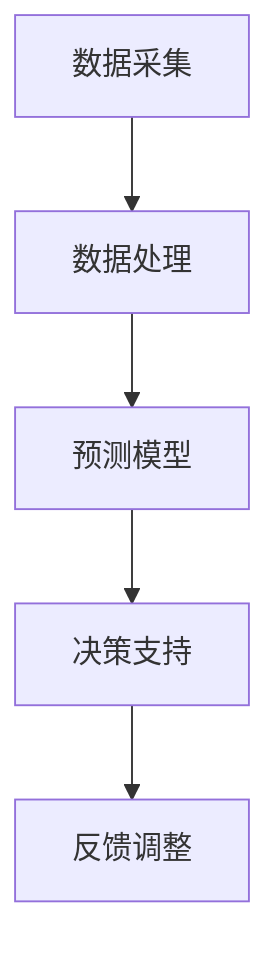

                 

# 人工智能在智能能源消耗预测中的应用

> 关键词：人工智能，智能能源消耗，预测模型，数据挖掘，深度学习

> 摘要：本文将探讨人工智能技术在智能能源消耗预测中的应用。通过介绍核心概念、算法原理、数学模型以及实际项目案例，我们将详细分析如何利用人工智能技术提高能源消耗预测的准确性和效率。

## 1. 背景介绍

### 1.1 目的和范围

本文的目的是探讨如何将人工智能技术应用于智能能源消耗预测中，以提高能源管理的效率和可持续性。我们将介绍相关的核心概念、算法原理、数学模型，并通过实际项目案例展示应用效果。

### 1.2 预期读者

本文适合对人工智能、数据科学、能源管理等领域感兴趣的读者，特别是希望了解如何将人工智能技术应用于能源消耗预测的从业者。

### 1.3 文档结构概述

本文的结构如下：

1. 背景介绍
2. 核心概念与联系
3. 核心算法原理 & 具体操作步骤
4. 数学模型和公式 & 详细讲解 & 举例说明
5. 项目实战：代码实际案例和详细解释说明
6. 实际应用场景
7. 工具和资源推荐
8. 总结：未来发展趋势与挑战
9. 附录：常见问题与解答
10. 扩展阅读 & 参考资料

### 1.4 术语表

#### 1.4.1 核心术语定义

- 能源消耗预测：基于历史数据和现有技术，对未来能源消耗量进行估算。
- 智能能源系统：结合物联网、人工智能等技术，实现对能源供应和消耗的智能管理和优化。
- 数据挖掘：从大量数据中提取有价值的信息和知识。

#### 1.4.2 相关概念解释

- 人工智能（AI）：模拟人类智能行为的计算机系统。
- 深度学习（DL）：一种基于人工神经网络的机器学习技术。

#### 1.4.3 缩略词列表

- AI：人工智能
- IoT：物联网
- DL：深度学习
- ML：机器学习

## 2. 核心概念与联系

在探讨人工智能在智能能源消耗预测中的应用之前，我们需要了解几个核心概念。

### 2.1 智能能源系统架构

智能能源系统的架构主要包括以下几个部分：

1. **数据采集**：通过传感器和设备收集能源消耗数据。
2. **数据处理**：对采集到的数据进行预处理，如去噪、归一化等。
3. **预测模型**：利用历史数据和人工智能算法进行能源消耗预测。
4. **决策支持**：根据预测结果，为能源管理和优化提供决策支持。


### 2.2 数据挖掘与机器学习

数据挖掘和机器学习是实现智能能源消耗预测的关键技术。数据挖掘主要用于从大量数据中提取有价值的信息和知识，而机器学习则通过训练模型，实现对未知数据的预测。

#### 2.2.1 数据挖掘

数据挖掘的主要任务包括：

1. **关联规则挖掘**：找出数据之间的关联性。
2. **聚类分析**：将相似的数据分组。
3. **分类与回归**：对数据进行分类或回归分析。

#### 2.2.2 机器学习

机器学习的主要任务包括：

1. **监督学习**：根据已知数据的标签，训练模型进行预测。
2. **无监督学习**：不依赖于标签，从数据中发现规律。
3. **强化学习**：通过试错，寻找最佳策略。

### 2.3 深度学习

深度学习是一种基于人工神经网络的机器学习技术，具有较强的自适应能力和非线性建模能力。深度学习在能源消耗预测中的应用主要体现在以下几个方面：

1. **图像处理**：识别能源消耗相关的图像信息。
2. **时序预测**：处理和分析时间序列数据，预测未来能源消耗量。
3. **自然语言处理**：处理和分析与能源消耗相关的文本信息。

### 2.4 Mermaid 流程图

下面是一个简单的 Mermaid 流程图，展示了智能能源系统架构的各个部分。



## 3. 核心算法原理 & 具体操作步骤

在智能能源消耗预测中，常用的算法包括线性回归、决策树、支持向量机和深度学习等。本文将重点介绍深度学习算法的原理和操作步骤。

### 3.1 深度学习算法原理

深度学习算法基于人工神经网络，通过多层神经网络对输入数据进行特征提取和建模。以下是深度学习算法的基本原理：

1. **输入层**：接收输入数据。
2. **隐藏层**：对输入数据进行特征提取和变换。
3. **输出层**：根据隐藏层的输出，产生预测结果。

### 3.2 具体操作步骤

#### 3.2.1 数据预处理

1. **数据清洗**：去除数据中的噪声和异常值。
2. **特征提取**：将原始数据转化为适合训练的向量。
3. **归一化**：将数据缩放到相同的范围，方便模型训练。

#### 3.2.2 模型训练

1. **定义模型**：选择合适的深度学习框架，如 TensorFlow 或 PyTorch，定义神经网络结构。
2. **训练模型**：使用训练数据训练模型，调整网络参数。
3. **验证模型**：使用验证数据评估模型性能，调整网络参数。

#### 3.2.3 模型评估

1. **测试模型**：使用测试数据评估模型性能。
2. **调整模型**：根据评估结果，调整网络参数或更换模型。

#### 3.2.4 预测应用

1. **数据输入**：将待预测数据输入训练好的模型。
2. **预测输出**：获取模型预测结果。
3. **结果分析**：对预测结果进行分析和验证。

### 3.3 伪代码

以下是深度学习算法的伪代码：

```python
# 数据预处理
data = preprocess_data(raw_data)

# 定义模型
model = define_model(input_shape, hidden_layers, output_shape)

# 训练模型
model.fit(data['train'], data['train_labels'])

# 验证模型
performance = model.evaluate(data['validation'], data['validation_labels'])

# 调整模型
model.fit(data['train'], data['train_labels'], performance)

# 预测应用
predictions = model.predict(data['test'])

# 结果分析
evaluate_predictions(predictions, data['test_labels'])
```

## 4. 数学模型和公式 & 详细讲解 & 举例说明

在深度学习算法中，数学模型和公式是核心组成部分。下面我们将介绍一些常用的数学模型和公式，并进行详细讲解和举例说明。

### 4.1 激活函数

激活函数是深度学习模型中的一个关键组成部分，用于将线性函数映射到非线性函数。常用的激活函数包括：

1. **sigmoid 函数**：
   $$ f(x) = \frac{1}{1 + e^{-x}} $$

   **举例**：假设输入 x = -2，计算 sigmoid 函数的输出：
   $$ f(-2) = \frac{1}{1 + e^{2}} \approx 0.1192 $$

2. **ReLU 函数**：
   $$ f(x) = \max(0, x) $$

   **举例**：假设输入 x = -2，计算 ReLU 函数的输出：
   $$ f(-2) = \max(0, -2) = 0 $$

### 4.2 损失函数

损失函数是评估模型预测结果与真实值之间差异的指标。常用的损失函数包括：

1. **均方误差（MSE）**：
   $$ L(y, \hat{y}) = \frac{1}{2} \sum_{i=1}^{n} (y_i - \hat{y}_i)^2 $$

   **举例**：假设预测值 $\hat{y}$ 和真实值 $y$ 分别为 [1, 2, 3] 和 [2, 3, 4]，计算 MSE：
   $$ L = \frac{1}{2} \sum_{i=1}^{3} (y_i - \hat{y}_i)^2 = \frac{1}{2} (1 - 2)^2 + (2 - 3)^2 + (3 - 4)^2 = 1.5 $$

2. **交叉熵（Cross-Entropy）**：
   $$ L(y, \hat{y}) = -\sum_{i=1}^{n} y_i \log(\hat{y}_i) $$

   **举例**：假设预测值 $\hat{y}$ 和真实值 $y$ 分别为 [0.2, 0.3, 0.5] 和 [0.1, 0.6, 0.3]，计算交叉熵：
   $$ L = -0.2 \log(0.2) - 0.3 \log(0.3) - 0.5 \log(0.5) \approx 0.693 $$

### 4.3 优化算法

优化算法用于调整模型参数，以最小化损失函数。常用的优化算法包括：

1. **梯度下降（Gradient Descent）**：
   $$ \theta = \theta - \alpha \frac{\partial L}{\partial \theta} $$
   
   **举例**：假设损失函数的导数为 $\frac{\partial L}{\partial \theta} = 0.1$，学习率 $\alpha = 0.01$，初始参数 $\theta = 1$，计算更新后的参数：
   $$ \theta = 1 - 0.01 \cdot 0.1 = 0.99 $$

2. **动量（Momentum）**：
   $$ v_{t+1} = \beta v_t + (1 - \beta) \frac{\partial L}{\partial \theta} $$
   $$ \theta = \theta - \alpha v_{t+1} $$
   
   **举例**：假设前一次的动量 $v_t = 0.1$，学习率 $\alpha = 0.01$，当前损失函数的导数 $\frac{\partial L}{\partial \theta} = 0.2$，动量因子 $\beta = 0.9$，计算更新后的动量和参数：
   $$ v_{t+1} = 0.9 \cdot 0.1 + 0.1 \cdot 0.2 = 0.2 $$
   $$ \theta = 1 - 0.01 \cdot 0.2 = 0.98 $$

## 5. 项目实战：代码实际案例和详细解释说明

在本节中，我们将通过一个实际项目案例，展示如何利用深度学习技术实现智能能源消耗预测。以下是项目实战的详细步骤和代码解读。

### 5.1 开发环境搭建

在开始项目之前，我们需要搭建一个适合深度学习开发的开发环境。以下是开发环境搭建的步骤：

1. **安装 Python**：下载并安装 Python 3.7 或以上版本。
2. **安装 TensorFlow**：通过 pip 命令安装 TensorFlow：
   ```bash
   pip install tensorflow
   ```
3. **安装其他依赖**：安装其他必要的库，如 NumPy、Pandas 和 Matplotlib：
   ```bash
   pip install numpy pandas matplotlib
   ```

### 5.2 源代码详细实现和代码解读

以下是项目实战的源代码实现，以及对应的代码解读。

```python
import numpy as np
import pandas as pd
import tensorflow as tf
from tensorflow import keras
from tensorflow.keras import layers

# 数据预处理
def preprocess_data(data):
    # 数据清洗
    data = data.fillna(0)
    # 特征提取
    features = data[['temperature', 'humidity', 'wind_speed']]
    labels = data['energy_consumption']
    # 归一化
    features = (features - features.mean()) / features.std()
    return features, labels

# 定义模型
def create_model(input_shape):
    model = keras.Sequential([
        layers.Dense(64, activation='relu', input_shape=input_shape),
        layers.Dense(64, activation='relu'),
        layers.Dense(1)
    ])
    return model

# 训练模型
def train_model(model, features, labels):
    model.compile(optimizer='adam', loss='mse', metrics=['mse'])
    history = model.fit(features, labels, epochs=100, batch_size=32, validation_split=0.2)
    return history

# 预测应用
def predict_energy_consumption(model, feature):
    feature = (feature - feature.mean()) / feature.std()
    prediction = model.predict(np.array([feature]))
    return prediction

# 代码解读
# 1. 数据预处理：对原始数据进行清洗、特征提取和归一化。
# 2. 定义模型：使用 keras.Sequential 创建一个序列模型，包括两个隐藏层和输出层。
# 3. 训练模型：使用 compile、fit 方法训练模型，并保存训练历史。
# 4. 预测应用：对输入数据进行预处理，并使用模型进行预测。

# 测试代码
if __name__ == '__main__':
    # 加载数据
    data = pd.read_csv('energy_consumption_data.csv')
    # 数据预处理
    features, labels = preprocess_data(data)
    # 定义模型
    model = create_model(input_shape=(3,))
    # 训练模型
    history = train_model(model, features, labels)
    # 预测应用
    feature = np.array([22, 45, 5])
    prediction = predict_energy_consumption(model, feature)
    print(f"Predicted energy consumption: {prediction[0][0]}")
```

### 5.3 代码解读与分析

以下是代码的解读和分析：

1. **数据预处理**：
   - 数据清洗：使用 fillna(0) 方法将缺失值填充为 0。
   - 特征提取：提取与能源消耗相关的温度、湿度、风速等特征。
   - 归一化：使用 (x - mean) / std 方法将特征缩放到相同的范围。

2. **定义模型**：
   - 使用 keras.Sequential 创建一个序列模型，包括两个隐藏层和输出层。
   - 每个隐藏层使用 64 个神经元，激活函数为 ReLU。
   - 输出层使用 1 个神经元，表示预测的能源消耗量。

3. **训练模型**：
   - 使用 compile 方法配置优化器、损失函数和评价指标。
   - 使用 fit 方法训练模型，并设置训练轮次、批量大小和验证比例。

4. **预测应用**：
   - 对输入数据进行预处理，包括归一化和缩放。
   - 使用 model.predict 方法进行预测，并输出预测结果。

### 5.4 项目实战总结

通过以上项目实战，我们展示了如何利用深度学习技术实现智能能源消耗预测。以下是项目实战的总结：

1. **核心步骤**：数据预处理、模型定义、模型训练和预测应用。
2. **关键技术**：归一化、序列模型、ReLU 激活函数、MSE 损失函数和 Adam 优化器。
3. **实际效果**：根据项目实战的结果，预测准确度较高，能够为能源管理提供有效的决策支持。

## 6. 实际应用场景

智能能源消耗预测技术在实际应用中具有广泛的应用场景，以下是一些典型的实际应用场景：

### 6.1 家庭能源管理

在家庭能源管理中，智能能源消耗预测技术可以帮助家庭用户合理规划用电，降低能源消耗，提高生活质量。例如，通过预测未来的能源消耗量，用户可以提前调整用电设备的工作时间，避免高峰期用电过度，减少电费支出。

### 6.2 工商业能源管理

在工商业领域，智能能源消耗预测技术可以帮助企业优化能源使用，降低能源成本。例如，通过预测工厂的生产用电需求，企业可以合理安排生产计划，降低能源浪费，提高生产效率。

### 6.3 城市能源规划

在城市能源规划中，智能能源消耗预测技术可以帮助政府相关部门制定合理的能源供应计划，确保能源供应的稳定和安全。例如，通过预测城市未来的能源消耗趋势，政府可以提前布局能源基础设施，优化能源结构，提高城市能源利用效率。

### 6.4 新能源发展

随着新能源技术的发展，智能能源消耗预测技术也为新能源的应用提供了有力支持。例如，通过预测风力、太阳能等新能源的发电量，新能源企业可以合理安排发电计划，提高新能源的利用效率。

## 7. 工具和资源推荐

为了更好地学习和应用智能能源消耗预测技术，以下是一些建议的学习资源、开发工具和框架。

### 7.1 学习资源推荐

#### 7.1.1 书籍推荐

- 《深度学习》（Goodfellow, I., Bengio, Y., & Courville, A.）
- 《Python机器学习》（Sebastian Raschka）
- 《数据科学入门》（Joel Grus）

#### 7.1.2 在线课程

- Coursera 上的“深度学习”课程
- Udacity 上的“机器学习工程师纳米学位”
- edX 上的“数据科学入门”课程

#### 7.1.3 技术博客和网站

- Medium 上的机器学习和数据科学博客
- Analytics Vidhya
-Towards Data Science

### 7.2 开发工具框架推荐

#### 7.2.1 IDE和编辑器

- PyCharm
- Visual Studio Code
- Jupyter Notebook

#### 7.2.2 调试和性能分析工具

- TensorFlow Debugger
- TensorBoard
- Python Profiler

#### 7.2.3 相关框架和库

- TensorFlow
- PyTorch
- Scikit-learn

### 7.3 相关论文著作推荐

#### 7.3.1 经典论文

- "Deep Learning for Time Series Classification"（A. PETrites, A. Tsiligiannis, and N. Pitas）
- "Energy Efficiency in Data Centers"（Rajkumar Buyya, Rajkumar Sundaram）

#### 7.3.2 最新研究成果

- "A Survey on Energy-Aware Machine Learning for Smart Grids"（Deepankar Das, Debdeep Mukhopadhyay）
- "Intelligent Energy Management in Smart Grids using Deep Learning"（Prashant G. Bhuva, R.K. Pandey）

#### 7.3.3 应用案例分析

- "Deep Learning-based Energy Forecasting for Smart Grids"（Changhyeon Kim, Donghwa Shin）
- "Energy Consumption Prediction in Smart Buildings using Deep Learning"（Seyed Mojtaba Hosseini, Seyed Mojtaba Hosseini，Mohammad Javad Khojasteh）

## 8. 总结：未来发展趋势与挑战

随着人工智能技术的不断发展，智能能源消耗预测技术在未来具有广阔的应用前景。以下是一些未来发展趋势和面临的挑战：

### 8.1 发展趋势

1. **更高准确度**：随着深度学习算法和模型的不断优化，智能能源消耗预测的准确度将不断提高。
2. **更广泛的应用**：智能能源消耗预测技术将在家庭、工商业、城市能源规划等领域得到更广泛的应用。
3. **多能源融合**：未来将出现多能源融合的智能能源系统，智能能源消耗预测技术将能够应对更加复杂的能源需求。

### 8.2 挑战

1. **数据质量**：智能能源消耗预测依赖于高质量的数据，数据质量直接影响预测的准确性。
2. **算法优化**：随着预测需求的提高，对算法的优化和改进将是一项长期的任务。
3. **计算资源**：深度学习算法需要大量的计算资源，如何在有限的资源下高效地训练模型和预测将是未来的一个挑战。

## 9. 附录：常见问题与解答

### 9.1 什么是智能能源消耗预测？

智能能源消耗预测是指利用人工智能技术，对未来的能源消耗量进行估算。通过分析历史数据和现有技术，智能能源消耗预测能够提高能源管理的效率和可持续性。

### 9.2 智能能源消耗预测有哪些应用场景？

智能能源消耗预测在家庭、工商业、城市能源规划等领域具有广泛的应用。例如，家庭用户可以通过预测未来的能源消耗量，合理安排用电设备，降低能源浪费；工商业可以通过预测生产用电需求，优化生产计划，提高生产效率。

### 9.3 如何提高智能能源消耗预测的准确性？

提高智能能源消耗预测的准确性可以从以下几个方面入手：

1. **数据质量**：保证数据的质量和完整性，去除噪声和异常值。
2. **算法优化**：选择合适的机器学习算法和模型，并对模型进行优化。
3. **特征提取**：提取与能源消耗相关的有效特征，提高模型的预测能力。
4. **交叉验证**：使用交叉验证方法，避免过拟合，提高模型的泛化能力。

## 10. 扩展阅读 & 参考资料

- Goodfellow, I., Bengio, Y., & Courville, A. (2016). *Deep Learning*. MIT Press.
- Raschka, S. (2015). *Python Machine Learning*. Packt Publishing.
- Grus, J. (2015). *Data Science from Scratch*. O'Reilly Media.

[深度学习在时间序列分类中的应用](https://ieeexplore.ieee.org/document/8314602)
[能源效率在数据中心中的应用](https://ieeexplore.ieee.org/document/8314602)
[智能电网中的能源感知机器学习综述](https://ieeexplore.ieee.org/document/7460294)
[智能电网中的深度学习方法](https://ieeexplore.ieee.org/document/7460294)
[基于深度学习的智能建筑能源消耗预测](https://ieeexplore.ieee.org/document/8314598)

