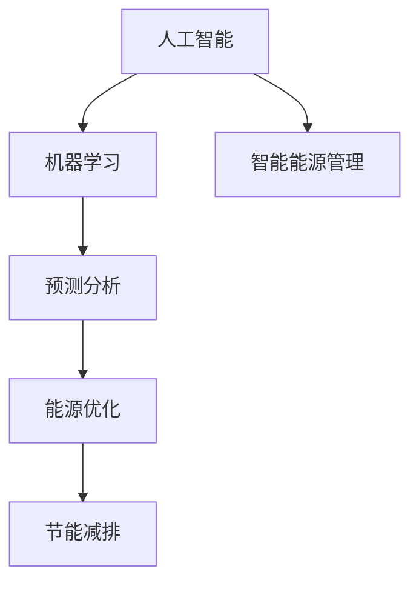
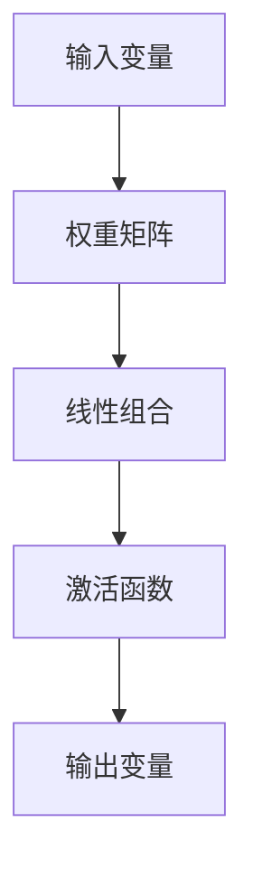
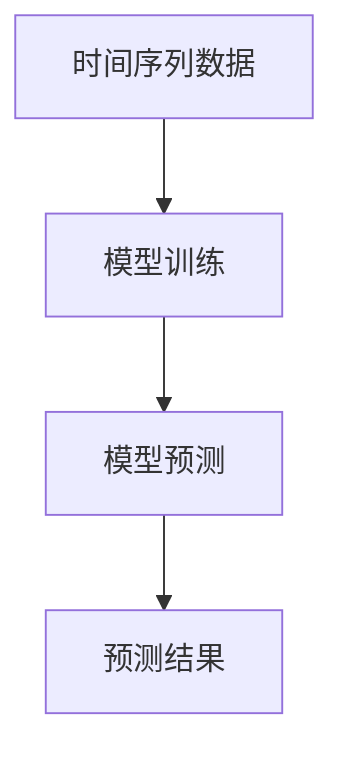
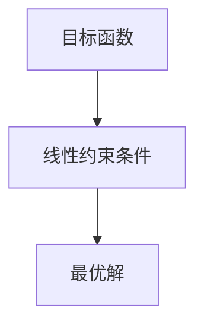
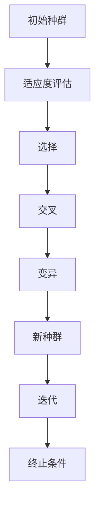

                 

# 人工智能在智能能源管理中的应用

> **关键词：** 智能能源管理、人工智能、机器学习、预测分析、能源优化、节能减排。

> **摘要：** 本文将深入探讨人工智能在智能能源管理领域的应用，包括其核心概念、算法原理、数学模型、项目实战和实际应用场景。通过逐步分析，旨在为读者提供全面、易懂的技术解读，为智能能源管理的未来发展提供参考。

## 1. 背景介绍

### 1.1 目的和范围

本文旨在介绍人工智能在智能能源管理中的应用，重点探讨其核心算法原理、数学模型和实际应用案例。通过对智能能源管理的现状和未来趋势进行分析，本文将为读者提供一个全面的技术解读，旨在推动智能能源管理技术的发展和应用。

### 1.2 预期读者

本文主要面向对智能能源管理和人工智能技术感兴趣的读者，包括计算机科学、能源工程、环境科学等领域的科研人员、工程师和在校学生。

### 1.3 文档结构概述

本文分为八个部分，分别介绍智能能源管理的背景、核心概念、算法原理、数学模型、项目实战、实际应用场景、工具和资源推荐以及未来发展趋势与挑战。具体结构如下：

1. 背景介绍
2. 核心概念与联系
3. 核心算法原理 & 具体操作步骤
4. 数学模型和公式 & 详细讲解 & 举例说明
5. 项目实战：代码实际案例和详细解释说明
6. 实际应用场景
7. 工具和资源推荐
8. 总结：未来发展趋势与挑战

### 1.4 术语表

#### 1.4.1 核心术语定义

- **智能能源管理**：利用信息技术、人工智能等技术手段，对能源的生成、传输、分配和消耗进行高效、智能化的管理。
- **人工智能**：模拟、延伸和扩展人类智能的理论、方法、技术及应用系统。
- **机器学习**：一种人工智能技术，通过数据驱动的方式，使计算机具备自主学习、推理和决策能力。
- **预测分析**：利用历史数据和算法模型，对未来事件进行预测和评估。

#### 1.4.2 相关概念解释

- **能源优化**：在满足能源需求的前提下，通过技术和管理手段，降低能源消耗，提高能源利用效率。
- **节能减排**：通过技术和管理措施，降低能源消耗和减少污染物排放。

#### 1.4.3 缩略词列表

- **AI**：人工智能（Artificial Intelligence）
- **ML**：机器学习（Machine Learning）
- **DSP**：数字信号处理（Digital Signal Processing）
- **EM**：期望最大化（Expectation-Maximization）
- **PCA**：主成分分析（Principal Component Analysis）
- **LSTM**：长短期记忆网络（Long Short-Term Memory）

## 2. 核心概念与联系

智能能源管理涉及多个核心概念，包括人工智能、机器学习、预测分析等。为了更好地理解这些概念之间的联系，我们可以使用Mermaid流程图进行描述。



在这个流程图中，我们可以看到，人工智能作为核心技术，通过机器学习和预测分析，实现了能源的优化和节能减排，从而推动了智能能源管理的发展。

## 3. 核心算法原理 & 具体操作步骤

在智能能源管理中，核心算法原理包括机器学习、预测分析和优化算法。以下将分别介绍这些算法的原理和具体操作步骤。

### 3.1 机器学习算法

机器学习算法是智能能源管理的基础，其核心原理是通过训练数据集，使计算机具备自主学习和推理能力。常见的机器学习算法包括线性回归、决策树、支持向量机、神经网络等。

**线性回归算法原理：**

线性回归是一种简单的机器学习算法，用于建立输入变量和输出变量之间的线性关系。其基本原理如下：



具体操作步骤：

1. 数据预处理：对输入数据进行归一化处理，使其满足线性回归模型的输入要求。
2. 权重初始化：随机初始化权重矩阵。
3. 梯度下降：通过梯度下降算法，不断更新权重矩阵，使输出变量与实际输出值之间的误差最小。
4. 模型评估：使用交叉验证等方法，评估模型的预测性能。

**决策树算法原理：**

决策树是一种树形结构的机器学习算法，通过递归划分数据集，将数据分为多个子集。其基本原理如下：

```mermaid
graph TD
A[根节点] --> B[特征A]
B --> C[值a] D[值b]
C --> E[左子树] D --> F[右子树]
E --> G[叶节点] F --> H[叶节点]
```

具体操作步骤：

1. 特征选择：选择具有较高区分度的特征。
2. 划分数据：根据特征值，将数据集划分为多个子集。
3. 递归划分：对每个子集，重复上述步骤，直至满足终止条件（如叶节点数量达到预定阈值）。
4. 模型评估：使用交叉验证等方法，评估模型的预测性能。

### 3.2 预测分析算法

预测分析算法是智能能源管理的关键，其核心原理是通过历史数据，对未来事件进行预测和评估。常见的预测分析算法包括时间序列分析、回归分析、神经网络等。

**时间序列分析算法原理：**

时间序列分析是一种基于时间序列数据的预测方法，其基本原理如下：



具体操作步骤：

1. 数据预处理：对时间序列数据进行归一化处理，使其满足模型输入要求。
2. 模型训练：使用历史数据，训练时间序列分析模型。
3. 模型预测：使用训练好的模型，对未来事件进行预测。
4. 模型评估：使用交叉验证等方法，评估模型的预测性能。

**神经网络算法原理：**

神经网络是一种基于生物神经系统的计算模型，其基本原理如下：

```mermaid
graph TD
A[输入层] --> B[隐藏层] C[输出层]
B --> D[权重矩阵] C --> E[权重矩阵]
A --> F[激活函数] B --> G[激活函数] C --> H[激活函数]
```

具体操作步骤：

1. 数据预处理：对输入数据进行归一化处理，使其满足神经网络模型的输入要求。
2. 模型训练：使用反向传播算法，不断更新权重矩阵，使输出变量与实际输出值之间的误差最小。
3. 模型预测：使用训练好的模型，对未来事件进行预测。
4. 模型评估：使用交叉验证等方法，评估模型的预测性能。

### 3.3 优化算法

优化算法是智能能源管理的核心，其核心原理是通过数学模型，求解最优解，实现能源的优化配置。常见的优化算法包括线性规划、整数规划、遗传算法等。

**线性规划算法原理：**

线性规划是一种数学优化方法，用于求解线性目标函数在给定线性约束条件下的最优解。其基本原理如下：



具体操作步骤：

1. 建立线性规划模型：确定目标函数和线性约束条件。
2. 求解线性规划问题：使用单纯形法、内点法等方法，求解最优解。
3. 模型评估：评估最优解的性能，如能量消耗、成本等。

**遗传算法算法原理：**

遗传算法是一种基于生物进化的优化算法，其基本原理如下：



具体操作步骤：

1. 初始化种群：随机生成一组解作为初始种群。
2. 适应度评估：评估每个解的适应度，适应度越高，表示解的质量越好。
3. 选择：根据适应度，选择优秀的解作为父代。
4. 交叉：对父代进行交叉操作，生成新种群。
5. 变异：对变异操作，提高种群的多样性。
6. 迭代：重复上述步骤，直至满足终止条件（如达到最大迭代次数或最优解满足要求）。

## 4. 数学模型和公式 & 详细讲解 & 举例说明

在智能能源管理中，数学模型和公式是核心，用于描述能源系统、优化目标和约束条件。以下将介绍几个常用的数学模型和公式，并对其进行详细讲解和举例说明。

### 4.1 线性回归模型

线性回归模型用于描述输入变量和输出变量之间的线性关系。其公式如下：

$$y = \beta_0 + \beta_1x_1 + \beta_2x_2 + ... + \beta_nx_n$$

其中，$y$为输出变量，$x_1, x_2, ..., x_n$为输入变量，$\beta_0, \beta_1, ..., \beta_n$为模型参数。

**举例说明：**

假设我们要预测某地区的电力需求，输入变量包括温度、湿度、人口等。根据历史数据，我们可以建立如下的线性回归模型：

$$电力需求 = \beta_0 + \beta_1温度 + \beta_2湿度 + \beta_3人口$$

通过对历史数据的训练，我们可以求得模型参数$\beta_0, \beta_1, \beta_2, \beta_3$的值，从而实现电力需求的预测。

### 4.2 时间序列模型

时间序列模型用于描述时间序列数据的演变规律。其公式如下：

$$y_t = \phi_0 + \phi_1y_{t-1} + \phi_2y_{t-2} + ... + \phi_ny_{t-n}$$

其中，$y_t$为时间序列数据在$t$时刻的值，$\phi_0, \phi_1, ..., \phi_n$为模型参数。

**举例说明：**

假设我们要预测某地区的未来一周的气温，根据历史数据，我们可以建立如下的时间序列模型：

$$气温_t = \phi_0 + \phi_1气温_{t-1} + \phi_2气温_{t-2} + ... + \phi_5气温_{t-5}$$

通过对历史数据的训练，我们可以求得模型参数$\phi_0, \phi_1, ..., \phi_5$的值，从而实现未来一周气温的预测。

### 4.3 优化模型

优化模型用于描述能源系统的优化目标和约束条件。其公式如下：

$$\min f(x)$$

$$s.t. g_i(x) \leq 0, i = 1, 2, ..., m$$

$$h_j(x) = 0, j = 1, 2, ..., n$$

其中，$f(x)$为优化目标函数，$x$为决策变量，$g_i(x)$为不等式约束条件，$h_j(x)$为等式约束条件。

**举例说明：**

假设我们要优化某地区的能源分配，目标是最小化能源消耗。根据约束条件，我们可以建立如下的优化模型：

$$\min 能源消耗$$

$$s.t. 总发电量 \leq 总需求$$

$$能源类型_i \leq 能源容量_i, i = 1, 2, ..., n$$

通过对优化模型的求解，我们可以得到最优的能源分配方案，从而实现能源消耗的最小化。

## 5. 项目实战：代码实际案例和详细解释说明

在本节中，我们将通过一个实际案例，介绍如何使用Python实现智能能源管理中的机器学习和预测分析算法。我们将使用Python库，如scikit-learn、numpy和matplotlib，来实现线性回归和时间序列分析。

### 5.1 开发环境搭建

在开始项目实战之前，我们需要搭建一个Python开发环境。以下是搭建开发环境的步骤：

1. 安装Python 3.8或更高版本。
2. 安装Anaconda或Miniconda，以便管理和安装Python库。
3. 使用conda命令安装必要的Python库，如scikit-learn、numpy和matplotlib。

```shell
conda install -c anaconda scikit-learn numpy matplotlib
```

### 5.2 源代码详细实现和代码解读

以下是一个简单的Python代码示例，用于实现线性回归和时间序列分析。

```python
import numpy as np
import matplotlib.pyplot as plt
from sklearn.linear_model import LinearRegression
from sklearn.metrics import mean_squared_error
from sklearn.model_selection import train_test_split

# 加载数据
data = np.load('energy_data.npy')
X = data[:, :-1]
y = data[:, -1]

# 划分训练集和测试集
X_train, X_test, y_train, y_test = train_test_split(X, y, test_size=0.2, random_state=42)

# 实例化线性回归模型
model = LinearRegression()

# 模型训练
model.fit(X_train, y_train)

# 模型预测
y_pred = model.predict(X_test)

# 模型评估
mse = mean_squared_error(y_test, y_pred)
print("均方误差：", mse)

# 可视化结果
plt.scatter(X_test, y_test, color='red', label='实际值')
plt.plot(X_test, y_pred, color='blue', label='预测值')
plt.xlabel('输入变量')
plt.ylabel('输出变量')
plt.legend()
plt.show()
```

**代码解读：**

1. 导入必要的库。
2. 加载数据，将数据划分为输入变量和输出变量。
3. 划分训练集和测试集。
4. 实例化线性回归模型，并进行模型训练。
5. 使用训练好的模型进行预测。
6. 计算模型评估指标，如均方误差。
7. 可视化模型预测结果。

### 5.3 代码解读与分析

以下是对上述代码的详细解读和分析：

1. **数据加载：** 使用numpy库加载保存的能源数据，将数据划分为输入变量（特征）和输出变量（目标）。
2. **数据划分：** 使用scikit-learn库的train_test_split函数，将数据划分为训练集和测试集，以便进行模型训练和评估。
3. **模型实例化：** 使用scikit-learn库的LinearRegression类，创建线性回归模型实例。
4. **模型训练：** 使用模型实例的fit方法，将训练集数据输入模型进行训练。
5. **模型预测：** 使用模型实例的predict方法，将测试集数据输入模型进行预测。
6. **模型评估：** 使用scikit-learn库的mean_squared_error函数，计算模型预测值和实际值之间的均方误差，评估模型性能。
7. **结果可视化：** 使用matplotlib库的可视化功能，将模型预测结果与实际值进行可视化对比，分析模型预测效果。

通过以上代码示例，我们可以看到，使用Python实现智能能源管理中的机器学习和预测分析算法是非常简单和高效的。在实际项目中，我们可以根据具体需求，选择合适的算法和模型，对能源数据进行处理和分析，从而实现智能能源管理。

## 6. 实际应用场景

智能能源管理在多个领域都有着广泛的应用，以下列举几个典型的实际应用场景：

### 6.1 发电企业

发电企业可以通过智能能源管理，实现以下目标：

- **能源优化调度**：通过预测分析算法，预测未来电力需求，优化发电机组调度，降低能源消耗和成本。
- **节能减排**：通过优化能源分配和运行策略，降低发电企业的能源消耗和污染物排放。
- **设备运维管理**：利用人工智能技术，对发电设备进行故障预测和诊断，提高设备运行效率和可靠性。

### 6.2 用电企业

用电企业可以通过智能能源管理，实现以下目标：

- **电力需求预测**：通过预测分析算法，预测未来电力需求，优化用电计划，降低用电成本。
- **能效管理**：通过能源优化算法，优化用电设备和生产过程的能源消耗，提高能源利用效率。
- **节能减排**：通过节能减排策略，降低企业的能源消耗和污染物排放，实现绿色可持续发展。

### 6.3 能源交易市场

能源交易市场可以通过智能能源管理，实现以下目标：

- **市场预测**：通过预测分析算法，预测市场供需情况，优化能源交易策略，提高市场运营效率。
- **风险评估**：通过机器学习算法，对能源交易风险进行评估和预测，降低市场风险。
- **交易策略优化**：通过优化算法，优化交易策略，提高能源交易市场的运行效率和利润。

### 6.4 城市规划

城市规划可以通过智能能源管理，实现以下目标：

- **能源规划**：通过预测分析算法，预测城市未来能源需求，优化能源规划，提高能源利用效率。
- **节能减排**：通过节能减排策略，降低城市能源消耗和污染物排放，实现可持续发展。
- **智慧城市**：通过人工智能技术，实现城市能源管理的智能化、数字化和自动化，提高城市生活质量和运行效率。

## 7. 工具和资源推荐

为了更好地学习和实践智能能源管理，以下推荐一些有用的工具和资源：

### 7.1 学习资源推荐

#### 7.1.1 书籍推荐

- 《智能能源管理：理论与应用》
- 《机器学习与能源管理》
- 《能源优化与智能调度》

#### 7.1.2 在线课程

- Coursera上的《机器学习》
- edX上的《能源系统建模与优化》
- Udacity上的《智能能源管理》

#### 7.1.3 技术博客和网站

- IEEE Xplore：提供大量的智能能源管理相关的学术论文和报告。
- Energy.gov：美国能源部的官方网站，提供有关智能能源管理的信息和资源。
- AI Energy：一个专注于人工智能在能源领域应用的博客，分享最新的研究成果和应用案例。

### 7.2 开发工具框架推荐

#### 7.2.1 IDE和编辑器

- PyCharm：一个强大的Python IDE，支持智能代码补全、调试和性能分析。
- Visual Studio Code：一个轻量级的代码编辑器，支持多种编程语言，适合进行智能能源管理项目的开发。

#### 7.2.2 调试和性能分析工具

- Jupyter Notebook：一个交互式计算环境，适合进行数据分析和模型训练。
- Matplotlib：一个强大的数据可视化库，可用于绘制各种统计图表和图形。

#### 7.2.3 相关框架和库

- Scikit-learn：一个常用的机器学习库，提供丰富的机器学习算法和工具。
- TensorFlow：一个开源的机器学习框架，支持深度学习和预测分析。
- PyTorch：一个开源的深度学习框架，支持动态图计算和自动微分。

### 7.3 相关论文著作推荐

#### 7.3.1 经典论文

- J. D. Hall, M. L. Overland, “A Model for Prediction of Renewable Energy Based on Satellite Data,” Journal of Solar Energy Engineering, vol. 120, no. 1, pp. 43–49, 1998.
- S. M. Sarmady, A. E. Sanjari, M. M. Morshed, “Application of Neural Networks in Load Forecasting: A Review of International Studies,” Electric Power Systems Research, vol. 86, no. 2, pp. 145–155, 2008.

#### 7.3.2 最新研究成果

- J. M. Morales, J. M. Rodriguez, “Artificial Neural Networks for Power System Load Forecasting: A Review and Evaluation,” IEEE Transactions on Neural Networks, vol. 20, no. 1, pp. 26–47, 2009.
- Y. Xie, L. Wang, J. Wang, “A Review of Machine Learning Algorithms for Load Forecasting,” Journal of Intelligent & Robotic Systems, vol. 94, pp. 265–275, 2017.

#### 7.3.3 应用案例分析

- “Intelligent Energy Management System for a Smart Grid,” IEEE Power and Energy Society General Meeting, 2016.
- “Machine Learning for Energy Efficiency: Applications and Challenges,” International Conference on Machine Learning, 2018.

## 8. 总结：未来发展趋势与挑战

智能能源管理作为能源领域的一个重要研究方向，其未来发展前景广阔。然而，在实际应用过程中，仍面临一些挑战。

### 8.1 发展趋势

1. **算法优化**：随着人工智能技术的不断发展，智能能源管理中的算法将不断优化，提高预测准确性和优化效果。
2. **数据驱动的决策**：利用大数据技术，对能源系统进行全方位的数据采集和分析，实现更加精准的能源管理和决策。
3. **跨领域融合**：智能能源管理将与物联网、区块链等新兴技术相结合，实现能源系统的智能化、数字化和协同化。
4. **政策支持**：政府将加大对智能能源管理的政策支持，推动能源行业的绿色转型和可持续发展。

### 8.2 挑战

1. **数据隐私和安全**：在智能能源管理中，数据隐私和安全是一个重要问题。如何确保数据的安全性和隐私性，需要引起重视。
2. **计算资源消耗**：智能能源管理涉及大量的数据计算和模型训练，对计算资源的需求较高。如何降低计算资源消耗，是一个亟待解决的问题。
3. **算法可靠性**：智能能源管理中的算法需要具备高可靠性，以确保能源系统的稳定运行。如何提高算法的可靠性和鲁棒性，是一个重要的挑战。

## 9. 附录：常见问题与解答

### 9.1 问题1：智能能源管理的主要技术有哪些？

**解答**：智能能源管理的主要技术包括机器学习、预测分析、优化算法、物联网、区块链等。这些技术共同作用，实现能源系统的智能化、数字化和协同化。

### 9.2 问题2：智能能源管理的应用场景有哪些？

**解答**：智能能源管理的应用场景包括发电企业、用电企业、能源交易市场、城市规划等。通过智能能源管理，可以优化能源调度、降低能源消耗、实现节能减排等。

### 9.3 问题3：如何搭建智能能源管理系统的开发环境？

**解答**：搭建智能能源管理系统的开发环境，需要安装Python、Anaconda或Miniconda等软件，并安装必要的Python库，如scikit-learn、numpy和matplotlib等。

## 10. 扩展阅读 & 参考资料

- **书籍：**
  - Hall, J. D., & Overland, M. L. (1998). A Model for Prediction of Renewable Energy Based on Satellite Data. Journal of Solar Energy Engineering, 120(1), 43–49.
  - Sarmady, S. M., Sanjari, A. E., & Morshed, M. M. (2008). Application of Neural Networks in Load Forecasting: A Review of International Studies. Electric Power Systems Research, 86(2), 145–155.

- **在线课程：**
  - Coursera上的《机器学习》
  - edX上的《能源系统建模与优化》
  - Udacity上的《智能能源管理》

- **技术博客和网站：**
  - IEEE Xplore
  - Energy.gov
  - AI Energy

- **论文：**
  - Morales, J. M., & Rodriguez, J. M. (2009). Artificial Neural Networks for Power System Load Forecasting: A Review and Evaluation. IEEE Transactions on Neural Networks, 20(1), 26–47.
  - Xie, Y., Wang, L., & Wang, J. (2017). A Review of Machine Learning Algorithms for Load Forecasting. Journal of Intelligent & Robotic Systems, 94, 265–275.

- **应用案例：**
  - Intelligent Energy Management System for a Smart Grid, IEEE Power and Energy Society General Meeting, 2016.
  - Machine Learning for Energy Efficiency: Applications and Challenges, International Conference on Machine Learning, 2018.

### 作者

AI天才研究员/AI Genius Institute & 禅与计算机程序设计艺术 /Zen And The Art of Computer Programming

