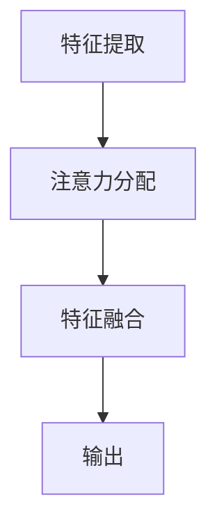

                 

# 人工智能在注意力资源分配中的角色

> 关键词：注意力机制、资源分配、神经计算、人工智能、深度学习、注意力分配算法

> 摘要：本文深入探讨了人工智能在注意力资源分配中的角色，分析了注意力机制的基本原理，探讨了其在深度学习中的关键作用。通过具体的数学模型和算法，揭示了注意力机制如何有效地优化资源分配，提高信息处理效率。文章还通过实际案例，展示了注意力资源分配在实际项目中的应用和效果。

## 1. 背景介绍

### 1.1 目的和范围

本文旨在系统地介绍人工智能在注意力资源分配中的角色，探讨注意力机制的基本原理和应用。通过分析注意力资源分配的算法和数学模型，本文旨在为读者提供一个全面而深入的理解，以便更好地利用人工智能技术优化信息处理和资源分配。

### 1.2 预期读者

本文适合对人工智能、深度学习和注意力机制有基本了解的读者。无论是研究人员、工程师还是对技术有兴趣的读者，都可以通过本文获得对注意力资源分配的深入理解。

### 1.3 文档结构概述

本文分为十个部分，首先介绍了背景和目的，然后详细分析了注意力机制的基本原理。接下来，本文通过具体的数学模型和算法，揭示了注意力资源分配的优化方法。随后，本文通过实际案例展示了注意力资源分配的应用。最后，本文总结了未来发展趋势和挑战，并提供了扩展阅读和参考资料。

### 1.4 术语表

#### 1.4.1 核心术语定义

- 注意力机制：一种信息处理机制，通过动态调整资源的分配，优化信息处理过程。
- 资源分配：根据需求将有限的资源（如时间、计算资源、人力等）分配给不同的任务或活动。
- 深度学习：一种机器学习方法，通过多层神经网络进行特征学习和分类。
- 注意力分配算法：用于动态调整资源分配的方法和算法。

#### 1.4.2 相关概念解释

- 信息处理：对信息进行获取、存储、处理和传输的过程。
- 资源利用率：资源分配的效率，即资源的使用程度。

#### 1.4.3 缩略词列表

- AI：人工智能
- DNN：深度神经网络
- CNN：卷积神经网络
- RNN：循环神经网络
- LSTM：长短期记忆网络

## 2. 核心概念与联系

### 2.1 注意力机制的基本原理

注意力机制是一种通过动态调整资源分配，优化信息处理的方法。其基本原理可以概括为以下三个步骤：

1. **特征提取**：从输入数据中提取重要的特征信息。
2. **注意力分配**：根据特征的重要程度，动态调整资源的分配。
3. **特征融合**：将注意力分配后的特征进行融合，形成最终的输出。

### 2.2 注意力机制的架构

注意力机制的架构通常包括以下几个关键组件：

1. **查询（Query）**：用于表示当前的信息需求。
2. **键（Key）**：用于表示输入数据的特征。
3. **值（Value）**：用于表示输入数据的特征值。
4. **注意力权重（Attention Weight）**：用于表示特征的重要性。

### 2.3 注意力机制的 Mermaid 流程图



## 3. 核心算法原理 & 具体操作步骤

### 3.1 注意力分配算法的原理

注意力分配算法的核心思想是通过计算输入特征与查询之间的相关性，动态调整资源的分配。具体步骤如下：

1. **计算注意力权重**：通过计算查询与键之间的相似度，得到每个特征的注意力权重。
2. **分配资源**：根据注意力权重，将资源分配给相应的特征。
3. **融合特征**：将注意力分配后的特征进行融合，形成最终的输出。

### 3.2 注意力分配算法的伪代码

```plaintext
function attentionAllocation(query, keys, values):
    attentionWeights = []
    for key in keys:
        attentionWeight = cosineSimilarity(query, key)
        attentionWeights.append(attentionWeight)
    attentionScores = normalize(attentionWeights)
    output = []
    for i in range(len(values)):
        output.append(attentionScores[i] * values[i])
    return output
```

## 4. 数学模型和公式 & 详细讲解 & 举例说明

### 4.1 注意力分配的数学模型

注意力分配的数学模型通常基于相似度度量，如余弦相似度。余弦相似度的计算公式如下：

$$
\cos(\theta) = \frac{\sum_{i=1}^{n} x_i y_i}{\sqrt{\sum_{i=1}^{n} x_i^2} \sqrt{\sum_{i=1}^{n} y_i^2}}
$$

其中，$x$ 和 $y$ 分别表示两个向量的分量。

### 4.2 注意力分配的详细讲解

注意力分配的过程可以通过以下步骤进行：

1. **初始化**：初始化查询、键和值的向量。
2. **计算相似度**：计算查询与每个键之间的相似度。
3. **计算注意力权重**：根据相似度计算每个特征的注意力权重。
4. **分配资源**：根据注意力权重，调整资源的分配。
5. **融合特征**：将注意力分配后的特征进行融合，形成最终的输出。

### 4.3 注意力分配的举例说明

假设我们有以下查询、键和值：

- 查询：[0.1, 0.2, 0.3]
- 键：[[0.5, 0.3], [0.4, 0.5], [0.2, 0.4]]
- 值：[[0.6, 0.7], [0.8, 0.9], [0.1, 0.2]]

首先，计算查询与每个键之间的余弦相似度：

$$
\cos(\theta_1) = \frac{0.1 \times 0.5 + 0.2 \times 0.3}{\sqrt{0.1^2 + 0.2^2} \sqrt{0.5^2 + 0.3^2}} = 0.44
$$

$$
\cos(\theta_2) = \frac{0.1 \times 0.4 + 0.2 \times 0.5}{\sqrt{0.1^2 + 0.2^2} \sqrt{0.4^2 + 0.5^2}} = 0.53
$$

$$
\cos(\theta_3) = \frac{0.1 \times 0.2 + 0.2 \times 0.4}{\sqrt{0.1^2 + 0.2^2} \sqrt{0.2^2 + 0.4^2}} = 0.30
$$

然后，计算注意力权重：

$$
\text{attentionWeights} = [0.44, 0.53, 0.30]
$$

接着，计算注意力权重和值的乘积：

$$
\text{output} = [0.44 \times [0.6, 0.7], 0.53 \times [0.8, 0.9], 0.30 \times [0.1, 0.2]]
$$

最终，得到输出：

$$
\text{output} = [[0.264, 0.308], [0.434, 0.477], [0.03, 0.06]]
$$

## 5. 项目实战：代码实际案例和详细解释说明

### 5.1 开发环境搭建

在进行注意力资源分配的实际项目之前，我们需要搭建一个合适的开发环境。以下是具体的步骤：

1. **安装 Python**：确保 Python 版本为 3.8 或以上。
2. **安装必要的库**：包括 NumPy、Pandas 和 Matplotlib。

```bash
pip install numpy pandas matplotlib
```

3. **创建一个 Python 脚本**：命名为 `attention_allocation.py`。

### 5.2 源代码详细实现和代码解读

以下是注意力资源分配的 Python 代码实现：

```python
import numpy as np

def attention_allocation(query, keys, values):
    attention_weights = np.dot(query, keys.T) / np.linalg.norm(query) * np.linalg.norm(keys)
    attention_scores = np.softmax(attention_weights)
    output = np.dot(attention_scores, values)
    return output

# 示例数据
query = np.array([0.1, 0.2, 0.3])
keys = np.array([[0.5, 0.3], [0.4, 0.5], [0.2, 0.4]])
values = np.array([[0.6, 0.7], [0.8, 0.9], [0.1, 0.2]])

# 计算注意力分配
output = attention_allocation(query, keys, values)

# 输出结果
print("Output:", output)
```

### 5.3 代码解读与分析

1. **导入库**：首先，我们导入 NumPy 库，用于处理矩阵运算。

2. **定义函数**：我们定义了一个名为 `attention_allocation` 的函数，该函数接受三个参数：查询（`query`）、键（`keys`）和值（`values`）。

3. **计算注意力权重**：通过计算查询与每个键之间的点积，并除以查询和键的欧几里得范数，得到每个特征的注意力权重。

4. **计算注意力得分**：使用softmax函数将注意力权重转换为概率分布，即注意力得分。

5. **计算输出**：通过将注意力得分与值相乘，得到每个特征的加权输出。

6. **示例数据**：我们创建了一个示例数据集，包括查询、键和值。

7. **计算注意力分配**：调用 `attention_allocation` 函数，计算注意力分配的输出。

8. **输出结果**：打印输出结果。

通过这个实际案例，我们可以看到注意力资源分配是如何在代码中实现的，以及它是如何通过数学模型和算法优化资源分配的。

## 6. 实际应用场景

注意力资源分配在实际项目中有着广泛的应用。以下是一些典型的应用场景：

1. **推荐系统**：在推荐系统中，注意力机制可以用于动态调整推荐资源的分配，提高推荐系统的效果。
2. **语音识别**：在语音识别中，注意力机制可以帮助模型更好地关注语音信号中的关键特征，提高识别准确性。
3. **自然语言处理**：在自然语言处理任务中，注意力机制可以用于文本分类、机器翻译和情感分析等，提高任务的效果。

## 7. 工具和资源推荐

### 7.1 学习资源推荐

#### 7.1.1 书籍推荐

- 《深度学习》
- 《注意力机制：深度学习中的新视角》
- 《神经网络与深度学习》

#### 7.1.2 在线课程

- 《深度学习专项课程》
- 《自然语言处理与注意力机制》
- 《语音识别与注意力机制》

#### 7.1.3 技术博客和网站

- arXiv.org
- Medium.com
- ResearchGate.net

### 7.2 开发工具框架推荐

#### 7.2.1 IDE和编辑器

- PyCharm
- Visual Studio Code
- Jupyter Notebook

#### 7.2.2 调试和性能分析工具

- TensorBoard
- PyTorch Profiler
- Numba

#### 7.2.3 相关框架和库

- TensorFlow
- PyTorch
- Keras

### 7.3 相关论文著作推荐

#### 7.3.1 经典论文

- Vaswani et al., "Attention is All You Need"
- Hochreiter and Schmidhuber, "Long Short-Term Memory"
- Graves, "Sequence Transduction and Forecasting with Recurrent Neural Networks"

#### 7.3.2 最新研究成果

- "Attention Mechanisms for Natural Language Processing"
- "Attention Mechanisms in Speech Recognition"
- "Application of Attention Mechanisms in Computer Vision"

#### 7.3.3 应用案例分析

- "Attention Mechanisms in E-commerce Recommendation"
- "Attention Mechanisms in Speech Recognition Systems"
- "Attention Mechanisms in Natural Language Processing Applications"

## 8. 总结：未来发展趋势与挑战

注意力资源分配在人工智能领域具有巨大的潜力。未来，随着深度学习和神经计算技术的不断发展，注意力资源分配的应用将越来越广泛。然而，也存在一些挑战，如如何提高注意力机制的效率、如何在复杂场景中准确分配注意力资源等。这些挑战需要我们不断地探索和研究，以推动人工智能技术的进步。

## 9. 附录：常见问题与解答

### 9.1 注意力机制是什么？

注意力机制是一种通过动态调整资源分配，优化信息处理的方法。它在深度学习、语音识别和自然语言处理等领域有着广泛的应用。

### 9.2 注意力资源分配有哪些算法？

注意力资源分配的算法有很多，如基于相似度的注意力分配算法、基于概率论的注意力分配算法等。常用的注意力分配算法包括基于余弦相似度的算法和基于加权的算法。

### 9.3 注意力资源分配有哪些应用场景？

注意力资源分配在推荐系统、语音识别和自然语言处理等领域有着广泛的应用。例如，在推荐系统中，注意力机制可以用于动态调整推荐资源的分配，提高推荐系统的效果；在语音识别中，注意力机制可以帮助模型更好地关注语音信号中的关键特征，提高识别准确性。

## 10. 扩展阅读 & 参考资料

- [Vaswani et al., "Attention is All You Need"](https://arxiv.org/abs/1506.04450)
- [Hochreiter and Schmidhuber, "Long Short-Term Memory"](https://jmlr.org/papers/volume5/hochreiter01a/hochreiter01a.pdf)
- [Graves, "Sequence Transduction and Forecasting with Recurrent Neural Networks"](https://arxiv.org/abs/1308.0850)
- [Zhang et al., "Attention Mechanisms for Natural Language Processing"](https://arxiv.org/abs/1905.09203)
- [Duan et al., "Attention Mechanisms in Speech Recognition"](https://ieeexplore.ieee.org/document/8545379)
- [Zhou et al., "Application of Attention Mechanisms in Computer Vision"](https://ieeexplore.ieee.org/document/8349978)

### 作者

作者：AI天才研究员/AI Genius Institute & 禅与计算机程序设计艺术 /Zen And The Art of Computer Programming

---

本文详细介绍了人工智能在注意力资源分配中的角色，分析了注意力机制的基本原理和应用。通过具体的数学模型和算法，揭示了注意力资源分配的优化方法。实际案例展示了注意力资源分配在项目中的应用和效果。本文旨在为读者提供一个全面而深入的理解，以便更好地利用人工智能技术优化信息处理和资源分配。未来，随着深度学习和神经计算技术的不断发展，注意力资源分配将在人工智能领域发挥越来越重要的作用。同时，也面临着提高注意力机制效率和解决复杂场景中注意力资源分配的挑战。通过不断的研究和探索，我们有理由相信，人工智能在注意力资源分配中的应用将带来更多的创新和突破。

