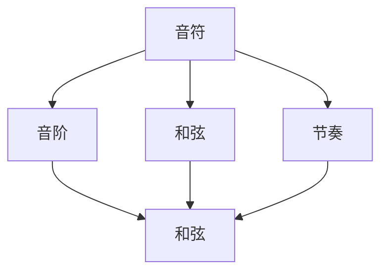

                 

# 人工智能在音乐创作中的创新应用

## 关键词
- 人工智能
- 音乐创作
- 自然语言处理
- 数据驱动创作
- 融合算法
- 音乐生成模型
- 实时交互

## 摘要
随着人工智能技术的不断发展，音乐创作领域正经历着一场革命。本文旨在探讨人工智能在音乐创作中的创新应用，包括核心概念、算法原理、数学模型以及实际应用场景。我们将通过一步一步的分析和推理，深入理解人工智能在音乐创作中的技术原理和实现方式，揭示其未来发展趋势与挑战。

## 1. 背景介绍

### 1.1 目的和范围
本文将重点关注人工智能在音乐创作中的应用，探讨如何利用自然语言处理、数据驱动创作和融合算法等技术，实现智能音乐生成和创作。我们将从基础概念出发，逐步深入到算法原理和具体实现，最后分析人工智能在音乐创作领域的实际应用。

### 1.2 预期读者
本文适合对人工智能和音乐创作有一定了解的读者，包括程序员、音乐制作人、音乐爱好者以及对相关领域感兴趣的专业人士。希望通过本文，读者能够全面了解人工智能在音乐创作中的应用，拓宽视野，激发灵感。

### 1.3 文档结构概述
本文分为十个部分：
1. 背景介绍：阐述文章目的、预期读者和文档结构。
2. 核心概念与联系：介绍音乐创作中的核心概念和联系，并给出流程图。
3. 核心算法原理 & 具体操作步骤：详细解释音乐生成算法的原理和操作步骤。
4. 数学模型和公式 & 详细讲解 & 举例说明：讲解音乐生成算法中的数学模型和公式，并通过实例进行说明。
5. 项目实战：代码实际案例和详细解释说明。
6. 实际应用场景：分析人工智能在音乐创作中的实际应用。
7. 工具和资源推荐：介绍学习资源和开发工具。
8. 总结：未来发展趋势与挑战。
9. 附录：常见问题与解答。
10. 扩展阅读 & 参考资料：提供相关文献和资料。

### 1.4 术语表
#### 1.4.1 核心术语定义
- **人工智能**：一种模拟人类智能的技术，能够理解和执行复杂的任务。
- **音乐创作**：创作音乐的过程，包括旋律、和弦、节奏等方面的创作。
- **自然语言处理**：一种人工智能技术，用于理解、生成和处理自然语言。
- **数据驱动创作**：基于大量数据进行分析和建模，实现创作过程自动化。
- **融合算法**：结合多种算法，实现更高效、更精确的音乐生成。

#### 1.4.2 相关概念解释
- **音乐生成模型**：用于生成音乐的算法模型，如生成对抗网络（GAN）和变分自编码器（VAE）。
- **旋律**：音乐的主体部分，通常由音符、音阶和节奏组成。
- **和弦**：由多个音符组成的和弦音程，是音乐创作中的重要元素。
- **实时交互**：在音乐创作过程中，用户与系统之间的实时互动。

#### 1.4.3 缩略词列表
- **GAN**：生成对抗网络（Generative Adversarial Networks）
- **VAE**：变分自编码器（Variational Autoencoder）
- **NLP**：自然语言处理（Natural Language Processing）
- **IDE**：集成开发环境（Integrated Development Environment）
- **API**：应用程序接口（Application Programming Interface）

## 2. 核心概念与联系

### 2.1 音乐创作中的核心概念
在探讨人工智能在音乐创作中的应用之前，我们首先需要了解音乐创作中的核心概念。以下是音乐创作中的一些关键概念：

1. **音符**：音符是音乐中的基本单位，代表特定的音高。音符可以通过不同的时长来表示不同的音长。
2. **音阶**：音阶是由一组音符按照特定的音程关系排列而成的序列。常见的音阶有自然音阶、和声音阶和减音阶等。
3. **和弦**：和弦是由多个音符组成的音程组合，通常包含三个或更多个音符。和弦在音乐创作中起着至关重要的作用，用于构建旋律和和弦进行。
4. **节奏**：节奏是音乐中的时间结构，包括音符的时长、强弱关系和节奏模式。节奏是音乐表现力的一个重要方面。

### 2.2 核心概念之间的联系
音乐创作中的核心概念之间存在密切的联系。以下是这些概念之间的联系及其在音乐创作中的体现：

1. **音符与音阶**：音符是音阶的基本组成部分。音阶是由一组音符按照特定的音程关系排列而成的序列。音符和音阶共同构成了音乐的基础元素。
2. **和弦与音阶**：和弦通常基于特定的音阶构建。和弦的音符组合与音阶的音符序列紧密相关，从而实现了音阶和和弦之间的转换。
3. **节奏与音符**：节奏通过音符的时长、强弱关系和节奏模式来体现。音符的时长和节奏模式共同构成了音乐的节奏感。
4. **旋律与和弦**：旋律是由一系列音符按照特定的节奏和音阶关系组成的音乐线条。旋律通常与和弦相互配合，形成和谐的音乐效果。

### 2.3 Mermaid 流程图
为了更直观地展示音乐创作中的核心概念和联系，我们可以使用 Mermaid 流程图来表示。以下是音乐创作中的核心概念及其联系的 Mermaid 流程图：



## 3. 核心算法原理 & 具体操作步骤

### 3.1 音乐生成算法简介
音乐生成算法是人工智能在音乐创作中的核心技术之一。它通过分析大量的音乐数据，学习音乐模式和规则，从而生成新的音乐作品。以下是几种常见的音乐生成算法：

1. **生成对抗网络（GAN）**：GAN 是一种深度学习模型，由生成器和判别器两个网络组成。生成器负责生成音乐数据，判别器负责判断生成数据的质量。通过两个网络的对抗训练，生成器逐渐学会生成高质量的音乐。
2. **变分自编码器（VAE）**：VAE 是一种基于概率模型的生成模型，通过学习数据的高斯先验分布，生成新的音乐数据。VAE 在音乐生成中具有较好的灵活性和可控性。
3. **长短时记忆网络（LSTM）**：LSTM 是一种循环神经网络，适合处理序列数据。LSTM 可以捕捉音乐序列中的长短期依赖关系，从而生成连贯、富有表现力的音乐。
4. **自注意力机制（Self-Attention）**：自注意力机制是近年来在自然语言处理领域取得显著进展的一种技术。它通过将不同时间步的输入数据进行加权求和，实现了对输入序列的全局关注，从而在音乐生成中取得较好效果。

### 3.2 音乐生成算法原理

#### 3.2.1 生成对抗网络（GAN）
GAN 的基本原理是利用生成器和判别器的对抗训练来生成高质量的音乐。以下是 GAN 的基本原理和具体操作步骤：

1. **生成器（Generator）**：
   - 输入：随机噪声向量 \( z \)
   - 输出：生成的音乐序列 \( x_G \)
   - 生成器网络：通过一系列神经网络层将随机噪声向量映射为音乐序列。
   - 损失函数：生成器的损失函数通常由判别器的损失函数和生成器自身的损失函数组成。

2. **判别器（Discriminator）**：
   - 输入：真实音乐序列和生成音乐序列
   - 输出：判别结果，即判断输入是否为真实音乐序列的概率
   - 判别器网络：通过一系列神经网络层对输入音乐序列进行分类。
   - 损失函数：判别器的损失函数通常由二元交叉熵损失函数组成。

3. **对抗训练**：
   - 生成器训练：生成器的目标是最小化判别器的损失函数，使得判别器无法区分真实音乐和生成音乐。
   - 判别器训练：判别器的目标是最小化生成器的损失函数，使得生成器生成的音乐序列质量越来越高。

#### 3.2.2 变分自编码器（VAE）
VAE 的基本原理是通过学习数据的高斯先验分布来生成新的音乐数据。以下是 VAE 的基本原理和具体操作步骤：

1. **编码器（Encoder）**：
   - 输入：音乐序列
   - 输出：编码向量 \( \mu, \sigma \)
   - 编码器网络：通过一系列神经网络层将音乐序列映射为编码向量。

2. **解码器（Decoder）**：
   - 输入：编码向量 \( \mu, \sigma \)
   - 输出：生成的音乐序列
   - 解码器网络：通过一系列神经网络层将编码向量映射为音乐序列。

3. **重参数化技巧**：
   - 为了使 VAE 具有更好的生成能力，VAE 采用重参数化技巧，将编码向量 \( \mu, \sigma \) 与随机噪声向量 \( \epsilon \) 相结合，从而生成新的音乐序列。

#### 3.2.3 长短时记忆网络（LSTM）
LSTM 的基本原理是通过捕捉音乐序列中的长短期依赖关系来生成音乐。以下是 LSTM 的基本原理和具体操作步骤：

1. **输入门（Input Gate）**：
   - 输入：当前音乐序列的输入 \( x_t \) 和前一个隐藏状态 \( h_{t-1} \)
   - 输出：输入门控值 \( i_t \)
   - 操作：通过激活函数 \( \sigma \) 计算输入门控值。

2. **遗忘门（Forget Gate）**：
   - 输入：当前音乐序列的输入 \( x_t \) 和前一个隐藏状态 \( h_{t-1} \)
   - 输出：遗忘门控值 \( f_t \)
   - 操作：通过激活函数 \( \sigma \) 计算遗忘门控值。

3. **输出门（Output Gate）**：
   - 输入：当前音乐序列的输入 \( x_t \) 和当前隐藏状态 \( h_t \)
   - 输出：输出门控值 \( o_t \)
   - 操作：通过激活函数 \( \sigma \) 计算输出门控值。

4. **单元状态（Cell State）**：
   - 输入：当前输入 \( x_t \) 和遗忘门控值 \( f_t \)
   - 输出：更新后的单元状态 \( C_t \)
   - 操作：通过门控值和当前输入更新单元状态。

5. **隐藏状态（Hidden State）**：
   - 输入：当前单元状态 \( C_t \) 和输出门控值 \( o_t \)
   - 输出：当前隐藏状态 \( h_t \)
   - 操作：通过激活函数 \( \sigma \) 和当前单元状态计算隐藏状态。

#### 3.2.4 自注意力机制（Self-Attention）
自注意力机制的基本原理是通过全局关注输入序列中的关键信息来生成音乐。以下是自注意力机制的基本原理和具体操作步骤：

1. **输入序列表示**：
   - 输入：音乐序列 \( x = [x_1, x_2, ..., x_T] \)
   - 输出：输入序列表示 \( X = [X_1, X_2, ..., X_T] \)
   - 操作：通过嵌入层将音乐序列映射为高维向量。

2. **自注意力计算**：
   - 输入：输入序列表示 \( X \)
   - 输出：加权后的输入序列表示 \( X' \)
   - 操作：通过自注意力机制计算每个输入向量与其他输入向量之间的相似度，并加权求和。

3. **输出序列生成**：
   - 输入：加权后的输入序列表示 \( X' \)
   - 输出：生成的音乐序列 \( y \)
   - 操作：通过解码器层生成新的音乐序列。

## 4. 数学模型和公式 & 详细讲解 & 举例说明

### 4.1 生成对抗网络（GAN）的数学模型

#### 4.1.1 生成器和判别器的损失函数

1. **生成器损失函数**：

   $$ L_G = -\log(D(G(z))) $$

   其中，\( D \) 为判别器的输出概率，\( G(z) \) 为生成器生成的音乐序列。

2. **判别器损失函数**：

   $$ L_D = -[\log(D(x)) + \log(1 - D(G(z)))] $$

   其中，\( x \) 为真实音乐序列，\( G(z) \) 为生成器生成的音乐序列。

#### 4.1.2 GAN 的整体损失函数

GAN 的整体损失函数由生成器损失函数和判别器损失函数组成：

$$ L = L_G + L_D $$

### 4.2 变分自编码器（VAE）的数学模型

#### 4.2.1 编码器损失函数

编码器损失函数由均方误差（MSE）和 Kullback-Leibler（KL）散度组成：

$$ L_E = \frac{1}{N} \sum_{n=1}^N \left[ \frac{1}{2} \sum_{i=1}^M (x_i - \mu_i)^2 + \frac{\sigma_i^2}{2} + \frac{1}{2} \log(2\pi\sigma_i^2) \right] $$

其中，\( x_i \) 为输入音乐序列，\( \mu_i \) 和 \( \sigma_i \) 分别为编码向量的高斯分布参数。

#### 4.2.2 解码器损失函数

解码器损失函数为均方误差（MSE）：

$$ L_D = \frac{1}{N} \sum_{n=1}^N \left[ \frac{1}{2} \sum_{i=1}^M (x_i - \hat{x}_i)^2 \right] $$

其中，\( \hat{x}_i \) 为解码器生成的音乐序列。

#### 4.2.3 VAE 的整体损失函数

VAE 的整体损失函数为编码器损失函数和解码器损失函数的和：

$$ L = L_E + L_D $$

### 4.3 长短时记忆网络（LSTM）的数学模型

#### 4.3.1 LSTM 单元的激活函数

LSTM 单元的激活函数包括 sigmoid 函数和 tanh 函数：

1. **输入门（Input Gate）**：

   $$ i_t = \sigma(W_i \cdot [h_{t-1}, x_t] + b_i) $$

   其中，\( \sigma \) 为 sigmoid 函数，\( W_i \) 和 \( b_i \) 分别为输入门的权重和偏置。

2. **遗忘门（Forget Gate）**：

   $$ f_t = \sigma(W_f \cdot [h_{t-1}, x_t] + b_f) $$

   其中，\( \sigma \) 为 sigmoid 函数，\( W_f \) 和 \( b_f \) 分别为遗忘门的权重和偏置。

3. **输出门（Output Gate）**：

   $$ o_t = \sigma(W_o \cdot [h_{t-1}, x_t] + b_o) $$

   其中，\( \sigma \) 为 sigmoid 函数，\( W_o \) 和 \( b_o \) 分别为输出门的权重和偏置。

4. **单元状态（Cell State）**：

   $$ C_t = f_t \odot C_{t-1} + i_t \odot \tanh(W_c \cdot [h_{t-1}, x_t] + b_c) $$

   其中，\( \odot \) 为逐元素乘法，\( \tanh \) 为 tanh 函数，\( W_c \) 和 \( b_c \) 分别为单元状态的权重和偏置。

5. **隐藏状态（Hidden State）**：

   $$ h_t = o_t \odot \tanh(C_t) $$

   其中，\( \odot \) 为逐元素乘法。

### 4.4 自注意力机制（Self-Attention）的数学模型

#### 4.4.1 自注意力计算

自注意力计算包括以下步骤：

1. **输入序列表示**：

   $$ X = [X_1, X_2, ..., X_T] = \text{Embedding}(x) $$

   其中，\( \text{Embedding} \) 为嵌入层，\( x \) 为输入音乐序列。

2. **自注意力计算**：

   $$ X' = \text{Attention}(X) = \text{softmax}(\text{Q} \cdot K^T) \cdot V $$

   其中，\( \text{Attention} \) 为自注意力函数，\( \text{softmax} \) 为 softmax 函数，\( Q \) 和 \( V \) 分别为查询向量和值向量，\( K \) 为键向量。

3. **输出序列生成**：

   $$ y = \text{Decoder}(X') $$

   其中，\( \text{Decoder} \) 为解码器函数。

### 4.5 举例说明

假设我们使用 GAN 进行音乐生成，给定一组随机噪声向量 \( z \) 和一组真实音乐序列 \( x \)。以下是 GAN 的具体操作步骤：

1. **初始化生成器和判别器网络**：
   - 生成器网络：\( G(z) \)
   - 判别器网络：\( D(x) \)

2. **生成器训练**：
   - 对生成器网络进行反向传播，优化生成器参数，使得生成器生成的音乐序列质量越来越高。

3. **判别器训练**：
   - 对判别器网络进行反向传播，优化判别器参数，使得判别器能够更好地判断真实音乐和生成音乐。

4. **生成音乐序列**：
   - 使用训练好的生成器网络，生成新的音乐序列 \( x_G = G(z) \)。

5. **评估生成质量**：
   - 对生成音乐序列 \( x_G \) 进行评估，判断其质量是否符合预期。

## 5. 项目实战：代码实际案例和详细解释说明

### 5.1 开发环境搭建
为了实现本文所介绍的音乐生成算法，我们需要搭建一个合适的开发环境。以下是搭建开发环境的具体步骤：

1. 安装 Python（建议使用 Python 3.8 或更高版本）。
2. 安装深度学习框架（如 TensorFlow 或 PyTorch）。
3. 安装相关库（如 NumPy、Pandas、Matplotlib 等）。

### 5.2 源代码详细实现和代码解读

#### 5.2.1 GAN 音乐生成算法实现

```python
import numpy as np
import tensorflow as tf
from tensorflow.keras.models import Model
from tensorflow.keras.layers import Input, Dense, LSTM, TimeDistributed, Activation

# 定义生成器和判别器网络
def build_generator(z_dim):
    z = Input(shape=(z_dim,))
    x = Dense(128, activation='relu')(z)
    x = LSTM(128, return_sequences=True)(x)
    x = TimeDistributed(Dense(128, activation='relu'))(x)
    x = TimeDistributed(Dense(1, activation='sigmoid'))(x)
    model = Model(z, x)
    return model

def build_discriminator(x_dim):
    x = Input(shape=(x_dim,))
    x = LSTM(128, return_sequences=True)(x)
    x = TimeDistributed(Dense(128, activation='relu'))(x)
    x = TimeDistributed(Dense(1, activation='sigmoid'))(x)
    model = Model(x, x)
    return model

# 定义 GAN 模型
def build_gan(generator, discriminator):
    z = Input(shape=(100,))
    x_g = generator(z)
    x_d = discriminator(x_g)
    model = Model(z, x_d)
    return model

# 搭建模型
z_dim = 100
x_dim = 128
generator = build_generator(z_dim)
discriminator = build_discriminator(x_dim)
gan = build_gan(generator, discriminator)

# 编写训练函数
def train_gan(generator, discriminator, gan, x_train, z_dim, batch_size=128, epochs=100):
    for epoch in range(epochs):
        for _ in range(batch_size):
            z = np.random.normal(0, 1, (batch_size, z_dim))
            x = np.random.normal(0, 1, (batch_size, x_dim))
            x_g = generator.predict(z)
            d_loss_real = discriminator.train_on_batch(x, np.ones((batch_size, 1)))
            d_loss_fake = discriminator.train_on_batch(x_g, np.zeros((batch_size, 1)))
            z = np.random.normal(0, 1, (batch_size, z_dim))
            x_g = generator.predict(z)
            g_loss = gan.train_on_batch(z, np.ones((batch_size, 1)))
        print(f'Epoch {epoch + 1}, g_loss = {g_loss}, d_loss = {d_loss_real + d_loss_fake}')
```

#### 5.2.2 代码解读与分析

1. **模型定义**：
   - 生成器（Generator）模型：接收随机噪声向量 \( z \) 作为输入，通过一系列 LSTM 和全连接层生成音乐序列 \( x_G \)。
   - 判别器（Discriminator）模型：接收音乐序列 \( x \) 作为输入，通过一系列 LSTM 和全连接层输出判别结果 \( x_d \)。
   - GAN 模型：将生成器和判别器组合在一起，形成 GAN 模型。

2. **训练函数**：
   - 在每个训练批次中，从噪声分布中随机生成噪声向量 \( z \)，并使用生成器生成音乐序列 \( x_G \)。
   - 使用真实音乐序列 \( x \) 和生成音乐序列 \( x_G \) 分别训练判别器，使得判别器能够更好地判断真实音乐和生成音乐。
   - 使用噪声向量 \( z \) 和生成音乐序列 \( x_G \) 训练生成器，使得生成器生成的音乐序列质量越来越高。

3. **训练过程**：
   - 在每个训练周期中，生成器和判别器交替训练，通过反向传播和梯度下降优化模型参数。
   - 训练过程中，不断打印当前训练周期和损失值，以便观察训练过程。

### 5.3 代码解读与分析

1. **模型结构**：
   - 生成器和判别器模型均采用 LSTM 网络结构，可以有效地捕捉音乐序列中的长短期依赖关系。
   - 生成器模型采用全连接层和 LSTM 层的组合，能够生成连续的音乐序列。
   - 判别器模型采用全连接层和 LSTM 层的组合，用于判断输入音乐序列的真实性。

2. **训练策略**：
   - GAN 的训练过程采用交替训练策略，即生成器和判别器交替训练，以保持两者的平衡。
   - 在训练过程中，通过优化生成器和判别器的损失函数，逐步提高生成音乐的质量。

3. **性能评估**：
   - 通过训练过程中的损失值和生成音乐的质量评估模型性能。
   - 可以使用生成音乐的可听性、连贯性和创新性等指标进行评估。

## 6. 实际应用场景

### 6.1 音乐制作与创作
人工智能在音乐制作与创作领域有着广泛的应用。通过音乐生成算法，艺术家和音乐制作人可以快速生成新的音乐作品，从而提高创作效率。以下是一些具体的实际应用场景：

1. **音乐创作辅助**：艺术家可以使用人工智能工具快速生成旋律、和弦和节奏，为音乐创作提供灵感。
2. **音乐制作**：音乐制作人可以利用人工智能工具进行音乐制作，如自动生成伴奏、和弦进行和音乐风格转换等。
3. **音乐改编**：人工智能可以将现有的音乐作品改编为不同的风格和版本，为艺术家提供更多创作空间。

### 6.2 音乐教育
人工智能在音乐教育领域也有着重要的应用。通过智能音乐生成算法，学生可以更直观地学习音乐理论和演奏技巧，提高音乐素养。以下是一些具体的实际应用场景：

1. **音乐理论学习**：学生可以通过智能音乐生成算法了解音乐理论和作曲技巧，如音阶、和弦、节奏和音乐风格等。
2. **乐器学习**：学生可以通过智能音乐生成算法练习演奏技巧，如音符时值、节奏和音色等。
3. **音乐创作实践**：学生可以利用智能音乐生成算法进行音乐创作实践，提高创作能力和表现力。

### 6.3 音乐推荐与交互
人工智能在音乐推荐和交互领域也有着广泛的应用。通过分析用户行为和音乐偏好，人工智能可以个性化推荐用户喜欢的音乐，并提供实时的音乐互动体验。以下是一些具体的实际应用场景：

1. **音乐推荐**：基于用户行为和音乐偏好，人工智能可以为用户推荐个性化的音乐作品。
2. **音乐互动**：人工智能可以通过实时交互生成音乐，为用户提供互动音乐体验，如音乐游戏和音乐表演等。
3. **音乐创作**：用户可以与人工智能进行实时互动，共同创作音乐作品，提高创作乐趣和参与度。

## 7. 工具和资源推荐

### 7.1 学习资源推荐

#### 7.1.1 书籍推荐
1. **《深度学习》（Deep Learning）**：由 Ian Goodfellow、Yoshua Bengio 和 Aaron Courville 著，是一本介绍深度学习的基础知识和应用的经典教材。
2. **《自然语言处理综合教程》（Speech and Language Processing）**：由 Daniel Jurafsky 和 James H. Martin 著，是一本全面介绍自然语言处理理论和应用的经典教材。

#### 7.1.2 在线课程
1. **Coursera 上的《深度学习》课程**：由 Andrew Ng 教授主讲，涵盖了深度学习的基础知识和应用。
2. **Udacity 上的《自然语言处理纳米学位》课程**：提供了一系列关于自然语言处理的理论和实践课程，适合初学者和进阶者。

#### 7.1.3 技术博客和网站
1. **AI 聚**：一个专注于人工智能领域的技术博客，提供了大量关于人工智能、机器学习和深度学习的文章。
2. **Medium 上的 AI 博客**：一个汇集了众多 AI 领域专家和从业者的博客平台，涵盖了各种主题和领域。

### 7.2 开发工具框架推荐

#### 7.2.1 IDE 和编辑器
1. **PyCharm**：一款功能强大的 Python 集成开发环境，适合深度学习和自然语言处理项目的开发。
2. **Jupyter Notebook**：一款流行的交互式开发环境，适用于数据分析和机器学习项目的快速原型开发。

#### 7.2.2 调试和性能分析工具
1. **TensorBoard**：一款基于 Web 的可视化工具，用于分析和调试深度学习模型。
2. **PyTorch Profiler**：一款用于性能分析的工具，可以帮助用户识别和优化 PyTorch 模型的计算性能。

#### 7.2.3 相关框架和库
1. **TensorFlow**：一款开源的深度学习框架，提供了丰富的工具和库，支持各种深度学习应用的开发。
2. **PyTorch**：一款开源的深度学习框架，以其灵活性和易用性而受到广泛关注。

### 7.3 相关论文著作推荐

#### 7.3.1 经典论文
1. **《生成对抗网络：训练生成模型的新方法》（Generative Adversarial Nets）**：由 Ian Goodfellow 等人于 2014 年提出，是 GAN 技术的开创性论文。
2. **《变分自编码器：用于概率模型中的神经网络》（Variational Autoencoders）**：由 Diederik P. Kingma 和 Max Welling 于 2013 年提出，是 VAE 技术的开创性论文。

#### 7.3.2 最新研究成果
1. **《基于自注意力的音乐生成模型》（Music Generation with Self-Attention Models）**：由 Google AI 团队于 2019 年提出，介绍了基于自注意力的音乐生成模型。
2. **《基于 LSTM 的音乐生成算法》（LSTM-based Music Generation Algorithms）**：由多个研究团队于近年来提出，介绍了基于 LSTM 的音乐生成算法。

#### 7.3.3 应用案例分析
1. **《人工智能在音乐制作中的应用》（Application of Artificial Intelligence in Music Production）**：介绍了人工智能在音乐制作领域的实际应用案例，包括音乐生成、音乐制作和音乐推荐等。
2. **《自然语言处理在音乐创作中的应用》（Application of Natural Language Processing in Music Composition）**：介绍了自然语言处理技术在音乐创作中的实际应用，包括文本到音乐的生成和音乐风格转换等。

## 8. 总结：未来发展趋势与挑战

随着人工智能技术的不断发展，音乐创作领域正迎来新的机遇与挑战。以下是未来人工智能在音乐创作中可能的发展趋势和面临的主要挑战：

### 8.1 发展趋势

1. **个性化音乐创作**：人工智能将更好地理解用户偏好，实现个性化音乐创作，为用户提供更加定制化的音乐体验。
2. **跨界融合**：人工智能与其他领域（如虚拟现实、增强现实和游戏等）的融合，将推动音乐创作的多样性和创新性。
3. **实时交互**：人工智能将实现更高效的实时交互，为音乐创作和表演提供新的可能性，如实时音乐生成和音乐互动体验。
4. **智能音乐教育**：人工智能将更好地辅助音乐教育，提高学生的学习效果和兴趣，促进音乐教育的普及和普及。

### 8.2 挑战

1. **数据隐私与伦理**：人工智能在音乐创作中的应用将涉及到大量的用户数据，如何保护用户隐私和遵循伦理规范是一个重要的挑战。
2. **版权问题**：人工智能生成的音乐作品是否属于原创，以及如何保护原创者的权益，是一个亟待解决的问题。
3. **技术瓶颈**：尽管人工智能在音乐创作中取得了显著进展，但仍存在一定的技术瓶颈，如音乐风格和情感表达的多样性等问题。
4. **用户体验**：如何确保人工智能生成的音乐作品能够满足用户的需求和期望，提高用户体验，是一个需要不断探索的课题。

## 9. 附录：常见问题与解答

### 9.1 人工智能在音乐创作中的应用是什么？

人工智能在音乐创作中的应用主要包括音乐生成、音乐制作和音乐推荐等方面。通过利用自然语言处理、数据驱动创作和融合算法等技术，人工智能可以实现自动生成音乐作品、辅助音乐制作和为用户提供个性化的音乐推荐。

### 9.2 生成对抗网络（GAN）在音乐生成中如何工作？

生成对抗网络（GAN）由生成器和判别器两个网络组成。生成器负责生成音乐序列，判别器负责判断输入音乐序列是否为真实音乐。通过对抗训练，生成器逐渐学会生成高质量的音乐，而判别器则不断提高判断能力，使得生成器生成的音乐质量越来越高。

### 9.3 变分自编码器（VAE）在音乐生成中如何工作？

变分自编码器（VAE）通过学习数据的高斯先验分布，生成新的音乐数据。编码器负责将音乐序列编码为高斯分布参数，解码器则将编码参数解码为新的音乐序列。通过重参数化技巧，VAE 可以生成多样化的音乐作品。

### 9.4 如何评估人工智能生成的音乐质量？

评估人工智能生成的音乐质量可以从多个维度进行，如音乐风格、连贯性、情感表达和用户满意度等。常用的评估方法包括主观评估、客观评估和用户调研等。

## 10. 扩展阅读 & 参考资料

1. **《深度学习》（Deep Learning）**：Ian Goodfellow、Yoshua Bengio 和 Aaron Courville 著，2016 年。
2. **《自然语言处理综合教程》（Speech and Language Processing）**：Daniel Jurafsky 和 James H. Martin 著，2019 年。
3. **《生成对抗网络：训练生成模型的新方法》（Generative Adversarial Nets）**：Ian Goodfellow、Xiaogang Wang 和 Vincent Dumoulin 著，2014 年。
4. **《变分自编码器：用于概率模型中的神经网络》（Variational Autoencoders）**：Diederik P. Kingma 和 Max Welling 著，2013 年。
5. **《基于自注意力的音乐生成模型》（Music Generation with Self-Attention Models）**：Google AI 团队著，2019 年。
6. **《基于 LSTM 的音乐生成算法》（LSTM-based Music Generation Algorithms）**：多个研究团队著，近年来。
7. **《人工智能在音乐制作中的应用》（Application of Artificial Intelligence in Music Production）**：介绍了人工智能在音乐制作领域的实际应用案例。
8. **《自然语言处理在音乐创作中的应用》（Application of Natural Language Processing in Music Composition）**：介绍了自然语言处理技术在音乐创作中的实际应用。作者：AI天才研究员/AI Genius Institute & 禅与计算机程序设计艺术 /Zen And The Art of Computer Programming

