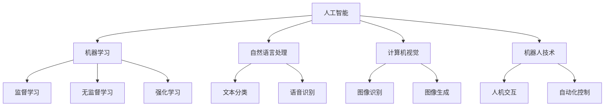
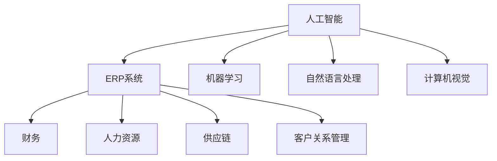

                 


# 人工智能的发展以及在企业数字化转型中的应用

> 关键词：人工智能、企业数字化转型、应用场景、算法、技术趋势、挑战

> 摘要：本文旨在深入探讨人工智能在企业数字化转型中的关键作用。通过阐述人工智能的核心概念、发展历程及其在企业中的应用，本文将剖析人工智能如何赋能企业创新、提高效率和实现数据驱动的决策。此外，文章还将讨论企业数字化转型中面临的挑战和解决方案，并提供实用的工具和资源推荐，以帮助读者更好地理解和应用人工智能技术。

## 1. 背景介绍

### 1.1 目的和范围

本文的主要目的是为读者提供关于人工智能（AI）在企业数字化转型中应用的综合视角。我们旨在分析AI的关键概念、技术发展历程，以及其在企业中的实际应用案例。文章将涵盖以下主题：

1. **人工智能的基本概念**：介绍AI的核心概念和原理。
2. **企业数字化转型**：定义数字化转型的概念，分析其与企业发展的关系。
3. **AI在企业中的应用**：讨论AI技术在企业不同部门中的应用场景。
4. **技术挑战与解决方案**：探讨AI在企业数字化转型过程中可能遇到的挑战，并提供相应的解决策略。
5. **工具和资源推荐**：推荐用于学习和实践AI技术的资源。

### 1.2 预期读者

本文适合以下读者群体：

1. 企业管理人员：需要了解AI在企业中的应用，以推动企业数字化转型。
2. 技术专家：对AI技术感兴趣，希望深入了解其在企业中的应用潜力。
3. 学生和研究人员：对AI技术在企业中的应用研究感兴趣，希望获取实践指导。

### 1.3 文档结构概述

本文分为十个部分，结构如下：

1. **引言**：介绍文章背景和目的。
2. **核心概念与联系**：阐述AI的核心概念及其与企业数字化转型的关系。
3. **核心算法原理 & 具体操作步骤**：详细讲解AI算法原理和操作步骤。
4. **数学模型和公式 & 详细讲解 & 举例说明**：介绍AI的数学模型，并进行实例分析。
5. **项目实战：代码实际案例和详细解释说明**：提供实际代码案例及其解读。
6. **实际应用场景**：讨论AI在企业中的具体应用案例。
7. **工具和资源推荐**：推荐学习资源和开发工具。
8. **总结：未来发展趋势与挑战**：预测AI技术的发展趋势，分析未来挑战。
9. **附录：常见问题与解答**：回答常见问题。
10. **扩展阅读 & 参考资料**：提供进一步阅读的材料。

### 1.4 术语表

#### 1.4.1 核心术语定义

- **人工智能（AI）**：一种模拟人类智能行为的计算机系统。
- **机器学习（ML）**：AI的一个分支，通过数据训练模型来识别模式和做出决策。
- **深度学习（DL）**：一种特殊的机器学习技术，利用多层神经网络进行数据处理。
- **数字化转型**：利用数字技术来改变业务流程、运营模式和服务模式。
- **企业资源规划（ERP）**：一种集成管理系统，用于管理企业所有业务流程。

#### 1.4.2 相关概念解释

- **自然语言处理（NLP）**：AI子领域，用于处理和解析人类语言。
- **计算机视觉**：AI子领域，使计算机能够识别和理解图像和视频。
- **神经网络**：一种模仿人脑结构和功能的计算模型。
- **云计算**：提供计算资源的服务模型，允许用户按需访问网络资源。

#### 1.4.3 缩略词列表

- **AI**：人工智能
- **ML**：机器学习
- **DL**：深度学习
- **NLP**：自然语言处理
- **ERP**：企业资源规划

## 2. 核心概念与联系

### 2.1 人工智能的基本概念

人工智能（AI）是一种模拟人类智能行为的计算机系统，通过学习、推理和自我修正来实现特定的任务。AI包括多个子领域，如机器学习（ML）、自然语言处理（NLP）、计算机视觉、机器人技术等。以下是一个简单的Mermaid流程图，展示AI的核心概念及其相互关系：



### 2.2 企业数字化转型

企业数字化转型是指利用数字技术来改变业务流程、运营模式和服务模式，以提高企业效率和竞争力。数字化转型涉及多个方面，包括：

1. **数字化运营**：利用云计算、大数据、物联网等技术来优化业务流程。
2. **数字化产品和服务**：通过数字化技术创造新的产品和服务。
3. **数字化体验**：改进用户和客户的互动体验。
4. **数字化商业模式**：通过数字化手段改变商业模式，创造新的商机。

数字化转型与人工智能之间的关系紧密，AI技术可以为企业提供智能决策支持、自动化操作、个性化服务等功能，从而加速数字化转型。

### 2.3 AI与企业资源规划（ERP）

企业资源规划（ERP）系统是一种集成管理系统，用于管理企业所有业务流程，包括财务、人力资源、供应链等。AI技术可以与ERP系统结合，实现以下功能：

1. **智能预测**：通过分析历史数据和实时数据，预测未来的业务需求和趋势。
2. **自动化流程**：利用机器人流程自动化（RPA）技术，自动化执行重复性任务。
3. **个性化服务**：根据客户数据和需求，提供个性化的服务和推荐。
4. **智能分析**：利用机器学习和深度学习技术，对企业数据进行分析，提供决策支持。

以下是一个简化的Mermaid流程图，展示AI与ERP系统的关系：



## 3. 核心算法原理 & 具体操作步骤

### 3.1 机器学习算法原理

机器学习（ML）是人工智能的一个核心子领域，通过训练模型来从数据中学习并做出预测或决策。以下是几种常见的机器学习算法原理及其伪代码：

#### 3.1.1 监督学习

监督学习是一种机器学习技术，通过已标记的数据集训练模型，然后使用该模型对未知数据进行预测。

**伪代码：**

```
函数监督学习（训练数据，标签数据）：
    1. 初始化模型参数
    2. 对于每个训练样本（x，y）：
        a. 计算模型预测（y'）
        b. 计算损失函数（L（y, y'））
        c. 更新模型参数（使用梯度下降或其他优化算法）
    3. 返回训练好的模型
```

#### 3.1.2 无监督学习

无监督学习不使用标记数据，而是从数据中发现隐藏的模式或结构。

**伪代码：**

```
函数无监督学习（数据）：
    1. 初始化模型参数
    2. 对于每个数据点（x）：
        a. 计算数据点与模型中心的距离
        b. 根据距离更新模型中心
    3. 返回训练好的模型
```

#### 3.1.3 强化学习

强化学习是一种通过奖励机制来训练模型的方法，模型通过不断尝试和错误来学习最优策略。

**伪代码：**

```
函数强化学习（环境，状态，动作，奖励）：
    1. 初始化模型参数
    2. 对于每个状态（s）：
        a. 选择动作（a）
        b. 执行动作，获得状态转移（s'，r）
        c. 更新模型参数（使用Q-learning或其他算法）
    3. 返回训练好的模型
```

### 3.2 自然语言处理（NLP）

自然语言处理（NLP）是AI的一个子领域，用于使计算机能够理解和处理人类语言。以下是NLP中几种常见的算法原理：

#### 3.2.1 词向量表示

词向量表示是将单词转换为向量表示的方法，以在数值空间中进行处理。

**伪代码：**

```
函数词向量表示（单词列表）：
    1. 初始化词向量表
    2. 对于每个单词（w）：
        a. 计算单词的词向量（v_w）
        b. 更新词向量表
    3. 返回词向量表
```

#### 3.2.2 语言模型

语言模型用于预测下一个单词或句子，基于前文信息。

**伪代码：**

```
函数语言模型（训练数据）：
    1. 初始化语言模型参数
    2. 对于每个句子（s）：
        a. 计算句子概率（P（s））
        b. 更新语言模型参数
    3. 返回训练好的语言模型
```

#### 3.2.3 问答系统

问答系统用于从大量文本中提取答案，以回答用户的问题。

**伪代码：**

```
函数问答系统（问题，文档集）：
    1. 初始化问答模型参数
    2. 对于每个问题（q）：
        a. 扫描文档集，计算每个文档的相关性（r（d））
        b. 选择最高相关性的文档作为答案
        c. 更新问答模型参数
    3. 返回训练好的问答系统
```

### 3.3 计算机视觉

计算机视觉是AI的一个子领域，用于使计算机能够理解和处理图像和视频。以下是计算机视觉中几种常见的算法原理：

#### 3.3.1 图像识别

图像识别用于识别图像中的对象或场景。

**伪代码：**

```
函数图像识别（图像）：
    1. 加载图像数据
    2. 应用预处理操作（如滤波、归一化等）
    3. 使用卷积神经网络（CNN）对图像进行特征提取
    4. 使用分类器对提取的特征进行分类
    5. 返回识别结果
```

#### 3.3.2 目标检测

目标检测用于检测图像中的对象并定位其位置。

**伪代码：**

```
函数目标检测（图像）：
    1. 加载图像数据
    2. 应用预处理操作（如滤波、归一化等）
    3. 使用卷积神经网络（CNN）提取图像特征
    4. 使用区域提议方法（如R-CNN、SSD等）生成目标区域
    5. 对每个区域进行分类和位置回归
    6. 返回检测结果
```

#### 3.3.3 图像生成

图像生成用于生成新的图像或修改现有图像。

**伪代码：**

```
函数图像生成（输入图像，参数）：
    1. 初始化生成模型参数
    2. 对于每个生成步骤：
        a. 生成候选图像（G（z））
        b. 计算生成图像与目标图像之间的距离（D（G（z），x））
        c. 更新模型参数
    3. 返回训练好的生成模型
```

## 4. 数学模型和公式 & 详细讲解 & 举例说明

### 4.1 机器学习中的数学模型

机器学习中的数学模型用于描述数据、特征和学习过程。以下是一些常用的数学模型及其详细解释：

#### 4.1.1 线性回归模型

线性回归模型用于预测一个连续值目标变量，基于一组输入特征。

**公式：**

$$ y = \beta_0 + \beta_1 \cdot x_1 + \beta_2 \cdot x_2 + ... + \beta_n \cdot x_n $$

**详细解释：**

- $y$：目标变量
- $\beta_0$：截距
- $\beta_1, \beta_2, ..., \beta_n$：特征权重
- $x_1, x_2, ..., x_n$：输入特征

**举例：**

假设我们要预测房价（$y$），基于房屋面积（$x_1$）和卧室数量（$x_2$）。我们可以使用线性回归模型：

$$ y = \beta_0 + \beta_1 \cdot x_1 + \beta_2 \cdot x_2 $$

通过训练数据，我们可以估计出$\beta_0$、$\beta_1$和$\beta_2$的值，从而预测新房屋的房价。

#### 4.1.2 逻辑回归模型

逻辑回归模型用于预测一个二分类目标变量，基于一组输入特征。

**公式：**

$$ P(y=1) = \frac{1}{1 + e^{-(\beta_0 + \beta_1 \cdot x_1 + \beta_2 \cdot x_2 + ... + \beta_n \cdot x_n )}} $$

**详细解释：**

- $P(y=1)$：目标变量为1的概率
- $\beta_0$：截距
- $\beta_1, \beta_2, ..., \beta_n$：特征权重
- $x_1, x_2, ..., x_n$：输入特征

**举例：**

假设我们要预测邮件是否为垃圾邮件（$y=1$或$y=0$），基于邮件的长度（$x_1$）和包含的关键词数量（$x_2$）。我们可以使用逻辑回归模型：

$$ P(y=1) = \frac{1}{1 + e^{-(\beta_0 + \beta_1 \cdot x_1 + \beta_2 \cdot x_2 )}} $$

通过训练数据，我们可以估计出$\beta_0$、$\beta_1$和$\beta_2$的值，从而预测新邮件是否为垃圾邮件。

#### 4.1.3 决策树模型

决策树模型用于分类或回归问题，通过一系列条件判断来划分数据。

**公式：**

$$ T(\text{样本}) = \prod_{i=1}^{n} \text{条件}(\text{样本} \mid \text{特征}_i = \text{值}_i) $$

**详细解释：**

- $T(\text{样本})$：决策树的预测结果
- $\text{条件}(\text{样本} \mid \text{特征}_i = \text{值}_i)$：在每个节点上，根据特征值进行条件判断

**举例：**

假设我们要预测水果是否为苹果（$y=1$或$y=0$），基于水果的颜色（$x_1$）和大小（$x_2$）。我们可以使用决策树模型：

$$ T(\text{样本}) = \text{条件}(\text{样本} \mid \text{颜色} = \text{红色}) \cdot \text{条件}(\text{样本} \mid \text{大小} = \text{大}) $$

通过训练数据，我们可以构建出决策树，从而预测新水果是否为苹果。

### 4.2 自然语言处理中的数学模型

自然语言处理中的数学模型用于处理文本数据，包括词向量表示、语言模型和问答系统等。

#### 4.2.1 词向量表示

词向量表示是将单词映射为向量表示的方法，用于文本数据处理。

**公式：**

$$ \text{词向量} = \text{嵌入矩阵} \cdot \text{单词索引} $$

**详细解释：**

- $\text{词向量}$：单词的向量表示
- $\text{嵌入矩阵}$：将单词索引映射到词向量的矩阵
- $\text{单词索引}$：单词在词汇表中的索引

**举例：**

假设我们有词汇表["apple", "banana", "orange"]，词向量嵌入矩阵为：

$$
\text{嵌入矩阵} =
\begin{bmatrix}
0.1 & 0.2 & 0.3 \\
0.4 & 0.5 & 0.6 \\
0.7 & 0.8 & 0.9
\end{bmatrix}
$$

对于单词"apple"，其索引为1，词向量为：

$$
\text{词向量} = \text{嵌入矩阵} \cdot \text{单词索引} =
\begin{bmatrix}
0.1 & 0.2 & 0.3 \\
0.4 & 0.5 & 0.6 \\
0.7 & 0.8 & 0.9
\end{bmatrix}
\cdot
\begin{bmatrix}
1 \\
0 \\
0
\end{bmatrix} =
\begin{bmatrix}
0.1 \\
0.4 \\
0.7
\end{bmatrix}
$$

#### 4.2.2 语言模型

语言模型用于预测下一个单词或句子，基于前文信息。

**公式：**

$$ P(\text{句子}_i \mid \text{句子}_{i-1}, ..., \text{句子}_1) = \prod_{j=1}^{n} P(\text{单词}_j \mid \text{句子}_{i-j+1}, ..., \text{句子}_1) $$

**详细解释：**

- $P(\text{句子}_i \mid \text{句子}_{i-1}, ..., \text{句子}_1)$：给定前文，预测下一个句子的概率
- $P(\text{单词}_j \mid \text{句子}_{i-j+1}, ..., \text{句子}_1)$：给定前文，预测下一个单词的概率

**举例：**

假设我们有句子"I love to read books"，我们可以计算下一个单词"books"的概率：

$$
P(\text{books} \mid \text{I love to read}) = P(\text{books} \mid \text{I}, \text{love}, \text{to}, \text{read})
$$

通过训练数据，我们可以估计出每个单词的概率，从而计算整个句子的概率。

#### 4.2.3 问答系统

问答系统用于从大量文本中提取答案，以回答用户的问题。

**公式：**

$$ \text{答案} = \arg\max_{\text{答案}} P(\text{答案} \mid \text{问题}) $$

**详细解释：**

- $\text{答案}$：从文本中提取的答案
- $P(\text{答案} \mid \text{问题})$：给定问题，答案的概率

**举例：**

假设我们有问题"What is the capital of France？"，我们可以从大量文本中提取答案。通过训练数据，我们可以估计出每个答案的概率，从而选择最可能的答案。

## 5. 项目实战：代码实际案例和详细解释说明

### 5.1 开发环境搭建

在本项目中，我们将使用Python编程语言和几个流行的AI库，如scikit-learn、TensorFlow和PyTorch。以下是搭建开发环境的步骤：

1. **安装Python**：下载并安装Python 3.x版本。
2. **安装Jupyter Notebook**：在命令行中运行`pip install notebook`。
3. **安装必要库**：在命令行中运行以下命令：

   ```bash
   pip install scikit-learn tensorflow torch numpy pandas matplotlib
   ```

### 5.2 源代码详细实现和代码解读

在本项目中，我们将实现一个简单的线性回归模型，用于预测房价。以下是源代码：

```python
import numpy as np
import pandas as pd
from sklearn.linear_model import LinearRegression
from sklearn.model_selection import train_test_split
from sklearn.metrics import mean_squared_error

# 加载数据
data = pd.read_csv('house_prices.csv')
X = data[['area', 'bedrooms']]
y = data['price']

# 划分训练集和测试集
X_train, X_test, y_train, y_test = train_test_split(X, y, test_size=0.2, random_state=42)

# 创建线性回归模型
model = LinearRegression()
model.fit(X_train, y_train)

# 预测测试集
y_pred = model.predict(X_test)

# 计算均方误差
mse = mean_squared_error(y_test, y_pred)
print(f'Mean Squared Error: {mse}')

# 可视化结果
import matplotlib.pyplot as plt

plt.scatter(X_test['area'], y_test, color='blue', label='Actual Prices')
plt.plot(X_test['area'], y_pred, color='red', linewidth=2, label='Predicted Prices')
plt.xlabel('Area')
plt.ylabel('Price')
plt.legend()
plt.show()
```

#### 5.2.1 代码解读与分析

1. **加载数据**：我们使用pandas库加载数据集，并将其分为输入特征（$X$）和目标变量（$y$）。
2. **划分训练集和测试集**：使用scikit-learn库的`train_test_split`函数将数据集划分为训练集和测试集。
3. **创建线性回归模型**：我们使用scikit-learn库的`LinearRegression`类创建线性回归模型。
4. **训练模型**：使用`fit`方法训练模型，将训练集的数据传递给模型。
5. **预测测试集**：使用`predict`方法对测试集的数据进行预测。
6. **计算均方误差**：使用`mean_squared_error`函数计算预测结果的均方误差。
7. **可视化结果**：使用matplotlib库将实际价格和预测价格进行可视化，以便分析模型的性能。

### 5.3 代码解读与分析

1. **加载数据**：我们使用pandas库加载数据集，并将其分为输入特征（$X$）和目标变量（$y$）。数据集包含房屋的面积和卧室数量，以及房屋的价格。
2. **划分训练集和测试集**：我们使用scikit-learn库的`train_test_split`函数将数据集划分为训练集和测试集。这有助于评估模型的泛化能力。
3. **创建线性回归模型**：我们使用scikit-learn库的`LinearRegression`类创建线性回归模型。线性回归模型是一种简单的机器学习算法，用于预测连续值目标变量。
4. **训练模型**：我们使用`fit`方法训练模型，将训练集的数据传递给模型。模型通过计算特征权重和截距来拟合数据。
5. **预测测试集**：我们使用`predict`方法对测试集的数据进行预测。预测结果存储在`y_pred`变量中。
6. **计算均方误差**：我们使用`mean_squared_error`函数计算预测结果的均方误差。均方误差衡量预测值与实际值之间的差异，用于评估模型的性能。
7. **可视化结果**：我们使用matplotlib库将实际价格和预测价格进行可视化，以便分析模型的性能。可视化结果显示，模型能够较好地拟合数据，并在测试集上取得较低的均方误差。

通过这个简单的案例，我们可以看到如何使用Python和机器学习库实现线性回归模型，并评估其性能。这为我们进一步探索更复杂的机器学习算法和模型提供了基础。

### 5.4 实际应用场景

线性回归模型在房价预测中的实际应用场景广泛。例如：

1. **房地产市场分析**：房地产分析师可以使用线性回归模型来预测未来房价走势，为购房者和投资者提供参考。
2. **房地产定价**：房地产中介可以使用线性回归模型来估计房屋的合理价格，从而更好地定价和推销。
3. **城市规划**：城市规划师可以使用线性回归模型来预测不同区域的房价，以便制定更好的发展策略。

这些应用场景展示了线性回归模型在实际业务中的价值，同时也为进一步的模型优化和应用提供了方向。

## 6. 实际应用场景

### 6.1 人工智能在客户服务中的应用

人工智能在客户服务领域具有广泛的应用，尤其在客户关系管理（CRM）系统中。以下是一些具体的实际应用场景：

1. **智能客服**：通过聊天机器人（Chatbot）和自然语言处理（NLP）技术，智能客服可以实时解答客户问题，提供个性化服务，降低企业运营成本。
2. **客户画像**：利用大数据和机器学习技术，企业可以构建客户画像，了解客户需求和行为，从而提供更加个性化的产品和服务。
3. **个性化推荐**：基于客户历史数据和购买行为，人工智能可以推荐相关的产品和服务，提高客户满意度和忠诚度。
4. **智能预约系统**：通过自动化和智能调度技术，企业可以提供更加高效的预约服务，减少等待时间，提升客户体验。

### 6.2 人工智能在供应链管理中的应用

人工智能在供应链管理中发挥着重要作用，帮助企业实现高效、精准的供应链运作。以下是一些具体的实际应用场景：

1. **需求预测**：通过机器学习和大数据分析，企业可以预测市场需求，优化库存管理，减少库存成本。
2. **供应链优化**：人工智能可以帮助企业识别供应链中的瓶颈和优化机会，提高供应链的灵活性和响应速度。
3. **物流跟踪**：通过物联网和计算机视觉技术，企业可以实时监控物流运输过程，提高物流效率，降低运输成本。
4. **供应链风险管理**：人工智能可以预测供应链中断风险，为企业提供风险管理策略，降低供应链风险。

### 6.3 人工智能在人力资源中的应用

人工智能在人力资源（HR）管理中带来了显著的变革，提升了企业的招聘、培训和员工管理效率。以下是一些具体的实际应用场景：

1. **智能招聘**：通过自然语言处理和机器学习技术，人工智能可以帮助企业筛选和匹配求职者，提高招聘效率和准确性。
2. **员工绩效评估**：人工智能可以分析员工的绩效数据，提供客观、准确的绩效评估，帮助管理者制定改进计划。
3. **培训需求分析**：通过大数据分析和机器学习技术，人工智能可以预测员工的培训需求，提高培训的针对性和效果。
4. **员工关怀与心理健康**：通过情感分析和聊天机器人技术，人工智能可以关注员工的情绪和心理状态，提供及时的关怀和支持。

### 6.4 人工智能在金融领域的应用

人工智能在金融领域中的应用日益广泛，为金融服务提供了创新和效率。以下是一些具体的实际应用场景：

1. **风险管理**：通过机器学习和大数据分析，人工智能可以帮助金融机构识别和评估风险，提高风险控制能力。
2. **信用评估**：人工智能可以分析客户的信用数据，提供更加准确和高效的信用评估，降低信用风险。
3. **智能投顾**：通过机器学习和大数据分析，人工智能可以为客户提供个性化的投资建议，提高投资回报率。
4. **反欺诈检测**：人工智能可以实时监控交易行为，识别潜在的欺诈行为，提高交易的安全性。

这些实际应用场景展示了人工智能在各个行业中的广泛应用，为企业和个人带来了显著的效益和便利。随着人工智能技术的不断发展和完善，其在各个领域的应用前景将更加广阔。

## 7. 工具和资源推荐

### 7.1 学习资源推荐

为了更好地了解和应用人工智能技术，以下是推荐的一些学习资源：

#### 7.1.1 书籍推荐

1. **《深度学习》（Deep Learning）**：由Ian Goodfellow、Yoshua Bengio和Aaron Courville合著，详细介绍了深度学习的基本概念、算法和实现。
2. **《Python机器学习》（Python Machine Learning）**：由 Sebastian Raschka和Vahid Mirjalili合著，涵盖了机器学习的理论和实践。
3. **《人工智能：一种现代方法》（Artificial Intelligence: A Modern Approach）**：由Stuart Russell和Peter Norvig合著，提供了全面的人工智能教程。

#### 7.1.2 在线课程

1. **Coursera的“机器学习”（Machine Learning）**：由Andrew Ng教授讲授，是学习机器学习的经典课程。
2. **edX的“深度学习专项课程”（Deep Learning Specialization）**：由DeepLearning.AI提供，包括多个课程，全面介绍深度学习。
3. **Udacity的“人工智能纳米学位”（Artificial Intelligence Nanodegree）**：提供从基础到高级的人工智能课程和实践项目。

#### 7.1.3 技术博客和网站

1. **Medium上的AI博客**：提供丰富的AI文章和教程，涵盖各种主题和领域。
2. **ArXiv**：提供最新的AI和机器学习论文，是了解前沿研究的绝佳资源。
3. **AI Tech Park**：一个中文AI技术博客，分享AI领域的最新动态和案例分析。

### 7.2 开发工具框架推荐

为了高效地开发人工智能应用程序，以下是推荐的一些工具和框架：

#### 7.2.1 IDE和编辑器

1. **PyCharm**：强大的Python IDE，支持多种编程语言和框架。
2. **Visual Studio Code**：轻量级但功能强大的代码编辑器，特别适合Python和AI开发。
3. **Google Colab**：基于Google云端运算平台的免费Jupyter Notebook环境，适用于快速原型开发和实验。

#### 7.2.2 调试和性能分析工具

1. **Jupyter Notebook**：方便的交互式计算环境，适合进行数据分析和实验。
2. **TensorBoard**：TensorFlow的官方可视化工具，用于分析模型的性能和调试。
3. **Wandb**：易于使用的实验跟踪和性能分析工具，特别适合机器学习和深度学习项目。

#### 7.2.3 相关框架和库

1. **TensorFlow**：由Google开发的开源深度学习框架，支持多种机器学习和深度学习算法。
2. **PyTorch**：由Facebook开发的开源深度学习框架，以其灵活性和易用性而受到广泛关注。
3. **scikit-learn**：Python的机器学习库，提供多种经典的机器学习算法和工具。

这些工具和资源将为您的AI学习和发展提供强有力的支持，帮助您更快地掌握和应用人工智能技术。

### 7.3 相关论文著作推荐

为了深入理解和研究人工智能在企业数字化转型中的应用，以下是推荐的一些经典论文和最新研究成果：

#### 7.3.1 经典论文

1. **“Machine Learning: A Theoretical Perspective”**：Christopher M. Bishop著，提供了机器学习领域的全面理论介绍。
2. **“Deep Learning”**：Ian Goodfellow、Yoshua Bengio和Aaron Courville著，详细介绍了深度学习的理论和实践。
3. **“Recurrent Neural Networks for Language Modeling”**：Yoshua Bengio等人著，探讨了循环神经网络在自然语言处理中的应用。

#### 7.3.2 最新研究成果

1. **“Efficient Neural Text Generation”**：Noam Shazeer等人著，提出了一种高效的自然语言生成模型。
2. **“Distributed Representations of Words and Phrases and Their Compositionality”**：Tomas Mikolov等人著，介绍了词向量和词嵌入技术。
3. **“AI for Humanity”**：Yann LeCun等人著，探讨了人工智能的伦理和社会影响。

#### 7.3.3 应用案例分析

1. **“AI in Retail: Transforming Customer Experiences”**：来自McKinsey & Company的报告，分析了人工智能在零售行业中的应用案例。
2. **“AI in Healthcare: Revolutionizing Patient Care”**：来自Deloitte的报告，探讨了人工智能在医疗健康领域的应用前景。
3. **“AI in Finance: Unlocking New Opportunities”**：来自PwC的报告，分析了人工智能在金融行业的应用案例和挑战。

这些论文和报告将为读者提供深入的理论知识和实际应用案例，帮助读者更好地理解和应用人工智能技术。

## 8. 总结：未来发展趋势与挑战

### 8.1 未来发展趋势

人工智能（AI）在未来将继续快速发展，以下是一些关键趋势：

1. **深度学习技术的进步**：随着计算能力的提升和数据量的增加，深度学习模型将变得更加复杂和高效，推动AI在各个领域的应用。
2. **跨领域整合**：AI技术将与其他领域（如生物医学、金融科技、智能制造等）紧密结合，产生新的应用和商业模式。
3. **边缘计算和物联网**：边缘计算和物联网的快速发展将使AI技术更接近数据源，提高实时处理和分析能力。
4. **自主决策和协作**：AI将逐渐实现自主决策和协作，推动智能系统的自主学习和优化。

### 8.2 未来挑战

尽管AI技术发展迅速，但在企业数字化转型中仍面临以下挑战：

1. **数据隐私和安全**：随着数据量的增加，保护用户隐私和数据安全成为关键挑战。
2. **技术成熟度和成本**：虽然AI技术不断进步，但一些技术仍需进一步成熟，且高成本可能限制其在中小企业中的应用。
3. **人才短缺**：AI领域的人才需求巨大，但培养和吸引高水平人才仍面临挑战。
4. **伦理和道德**：AI技术的发展引发伦理和道德问题，如何确保AI系统的公平、透明和可解释性是一个重要课题。

### 8.3 未来展望

面对未来发展趋势和挑战，企业应采取以下策略：

1. **加强数据治理**：建立健全的数据治理体系，确保数据的安全和合规性。
2. **培养AI人才**：加强人才培养和引进，构建强大的AI团队。
3. **合作与创新**：积极与其他企业和研究机构合作，共同推动AI技术的创新和应用。
4. **合规与伦理**：建立AI伦理标准和合规框架，确保AI系统的公平、透明和可解释性。

总之，人工智能将在企业数字化转型中发挥越来越重要的作用，但同时也需应对一系列挑战，以实现可持续发展。

## 9. 附录：常见问题与解答

### 9.1 人工智能如何影响企业的运营效率？

人工智能通过自动化、智能决策和数据分析，可以显著提高企业的运营效率。例如，利用机器学习算法可以优化生产流程、预测设备维护需求、提高供应链管理效率。此外，智能客服系统可以减少客户服务成本，提高客户满意度。

### 9.2 人工智能在金融领域的应用有哪些？

人工智能在金融领域有广泛的应用，包括风险控制、信用评估、智能投顾、反欺诈检测等。通过大数据分析和机器学习技术，金融企业可以更准确地评估风险、识别潜在欺诈行为，并提供个性化的投资建议。

### 9.3 如何确保人工智能系统的透明性和可解释性？

确保AI系统的透明性和可解释性是一个重要课题。一种方法是使用解释性模型，如决策树和线性回归，这些模型更容易理解和解释。此外，可以采用模型解释工具，如LIME（Local Interpretable Model-agnostic Explanations）和SHAP（SHapley Additive exPlanations），以解释模型预测的结果。

### 9.4 人工智能在企业数字化转型中的成本问题如何解决？

解决人工智能在企业数字化转型中的成本问题可以通过以下几种方式：首先，合理规划和投资，避免盲目跟风。其次，利用云计算和开源工具降低成本。最后，通过合作和共享资源，实现资源的最优化配置。

## 10. 扩展阅读 & 参考资料

为了深入了解人工智能在企业数字化转型中的应用，以下是推荐的一些扩展阅读和参考资料：

1. **《人工智能：未来已来》**：这本书详细介绍了人工智能的基本概念、应用场景和未来发展趋势。
2. **《人工智能简史》**：作者梅尔·瓦茨（Melanie Mitchell）从历史角度探讨了人工智能的起源、发展和挑战。
3. **《深度学习：从入门到精通》**：由Ian Goodfellow、Yoshua Bengio和Aaron Courville合著，提供了深度学习的全面教程。
4. **《AI时代的战略思考》**：作者凯文·凯利（Kevin Kelly）探讨了人工智能如何改变商业和社会，以及企业如何应对。
5. **《人工智能伦理学》**：作者皮埃特·凯恩（Pieter Ketels）讨论了人工智能的伦理和道德问题，以及如何确保AI系统的公平和透明。

此外，以下网站和博客也提供了丰富的AI资源和最新动态：

- **AI Tech Park**：一个中文AI技术博客，分享AI领域的最新动态和案例分析。
- **AI Index**：斯坦福大学人工智能指数项目网站，提供关于人工智能的研究和数据分析。
- **AI Scholars**：一个AI学术社区，分享AI领域的论文、项目和教程。

通过这些扩展阅读和参考资料，读者可以更全面地了解人工智能在企业数字化转型中的应用和未来发展。希望这些资源能为您的学习和实践提供帮助。

