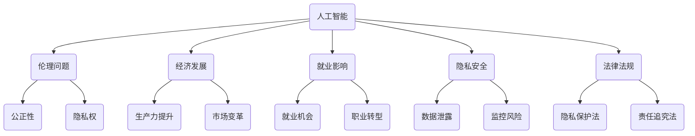

                 

# 人工智能的社会影响评估

> 关键词：人工智能、社会影响、伦理问题、经济发展、就业影响、隐私安全、法律法规

> 摘要：本文旨在探讨人工智能在社会各个领域的影响，包括伦理问题、经济发展、就业影响、隐私安全以及法律法规等方面。通过逐步分析这些影响，本文旨在为读者提供一个全面、客观的视角，以更好地理解和应对人工智能带来的挑战。

## 1. 背景介绍

### 1.1 目的和范围

本文旨在深入探讨人工智能对社会各个层面的影响，包括伦理问题、经济发展、就业影响、隐私安全和法律法规等方面。通过系统地分析这些问题，本文旨在为读者提供一个全面、客观的视角，以更好地理解和应对人工智能带来的挑战。

### 1.2 预期读者

本文面向对人工智能有一定了解的读者，包括程序员、数据科学家、AI研究人员、企业管理者、政策制定者等。通过对本文的阅读，读者将能够获得对人工智能社会影响的深刻理解，并为相关领域的工作提供有益的参考。

### 1.3 文档结构概述

本文结构分为十个部分，如下所示：

1. 背景介绍
2. 核心概念与联系
3. 核心算法原理 & 具体操作步骤
4. 数学模型和公式 & 详细讲解 & 举例说明
5. 项目实战：代码实际案例和详细解释说明
6. 实际应用场景
7. 工具和资源推荐
8. 总结：未来发展趋势与挑战
9. 附录：常见问题与解答
10. 扩展阅读 & 参考资料

### 1.4 术语表

#### 1.4.1 核心术语定义

- 人工智能（AI）：模拟人类智能行为的计算机系统。
- 伦理问题：涉及道德、公正、隐私等问题的讨论。
- 经济发展：国家或地区整体经济水平的提升。
- 就业影响：人工智能对就业市场的影响，包括就业机会的创造与消失。
- 隐私安全：个人隐私数据的保护。
- 法律法规：规范社会行为的国家法律、法规和条例。

#### 1.4.2 相关概念解释

- 机器学习：一种人工智能技术，通过数据训练模型，使其具备自动学习、推理和决策能力。
- 深度学习：一种特殊的机器学习技术，利用多层神经网络模拟人脑处理信息的方式。
- 伦理审查：在人工智能应用过程中，对潜在伦理问题进行评估和审查的过程。

#### 1.4.3 缩略词列表

- AI：人工智能
- ML：机器学习
- DL：深度学习
- GDPR：通用数据保护条例
- IoT：物联网

## 2. 核心概念与联系

为了更好地理解人工智能对社会的影响，我们需要明确几个核心概念，并探讨它们之间的联系。以下是一个简单的 Mermaid 流程图，展示了这些概念及其关系。



### 2.1 伦理问题

伦理问题是人工智能应用过程中最为关注的议题之一。人工智能在决策、推荐和预测等方面具有强大的能力，但也可能带来伦理问题。例如，机器学习模型可能存在偏见，导致不公平的结果；自动化系统可能侵犯个人隐私；自主武器系统可能引发道德争议。因此，伦理审查在人工智能开发和应用过程中至关重要。

### 2.2 经济发展

人工智能在推动经济发展方面具有巨大的潜力。通过提高生产力、优化资源配置和促进市场变革，人工智能有助于提升国家或地区的整体经济水平。例如，智能制造、智能金融和智能医疗等领域的发展，为经济增长注入了新的动力。

### 2.3 就业影响

人工智能对就业市场的影响是一个备受关注的话题。一方面，人工智能创造了新的就业机会，如数据科学家、机器学习工程师等；另一方面，自动化技术可能导致部分传统职业的消失。因此，就业市场将面临职业转型和技能升级的需求。

### 2.4 隐私安全

随着人工智能技术的应用，个人隐私数据的安全问题日益突出。数据泄露、监控风险等问题给个人隐私带来了严重威胁。因此，确保隐私安全成为人工智能应用过程中的一项重要任务。

### 2.5 法律法规

为了规范人工智能的发展，各国纷纷制定了一系列法律法规。这些法规旨在保护隐私、确保公平竞争、明确责任追究等方面。例如，欧盟的 GDPR（通用数据保护条例）就为数据保护提供了严格的法规框架。

## 3. 核心算法原理 & 具体操作步骤

在深入探讨人工智能对社会的影响之前，我们需要了解一些核心算法原理。以下是一个简单的机器学习算法——线性回归的伪代码，用于解释其基本操作步骤。

```python
# 线性回归算法伪代码

# 输入：训练数据集 X, Y
# 输出：模型参数 w

# 初始化模型参数 w 为零向量
w = 0

# 设定迭代次数
num_iterations = 1000

# 设定学习率
learning_rate = 0.01

# 开始迭代
for i in range(num_iterations):
    # 计算预测值
    predicted_value = w * X
    
    # 计算损失函数
    loss = (predicted_value - Y) ** 2
    
    # 计算梯度
    gradient = 2 * (predicted_value - Y) * X
    
    # 更新模型参数
    w = w - learning_rate * gradient

# 输出最终模型参数
return w
```

在这个伪代码中，线性回归算法通过迭代优化模型参数 w，以最小化损失函数。具体操作步骤如下：

1. 初始化模型参数 w 为零向量。
2. 设定迭代次数和学习率。
3. 在每个迭代中，计算预测值和损失函数。
4. 计算损失函数关于模型参数的梯度。
5. 根据学习率更新模型参数。
6. 重复上述步骤，直到达到设定的迭代次数或满足收敛条件。

线性回归算法作为一种简单的机器学习算法，能够为我们提供对人工智能基本原理的直观理解。在实际应用中，更复杂的人工智能算法，如深度学习，需要更多的技术手段和计算资源。

## 4. 数学模型和公式 & 详细讲解 & 举例说明

在人工智能领域，数学模型和公式是理解和实现算法的核心。以下将介绍几个关键数学模型和公式，并详细讲解它们的原理和应用。

### 4.1 损失函数

损失函数是机器学习中评价模型性能的重要工具。常见的损失函数包括均方误差（MSE）和交叉熵（Cross-Entropy）。

$$
MSE = \frac{1}{n}\sum_{i=1}^{n}(y_i - \hat{y}_i)^2
$$

$$
Cross-Entropy = -\sum_{i=1}^{n}y_i \log(\hat{y}_i)
$$

其中，$y_i$ 为真实标签，$\hat{y}_i$ 为预测值，$n$ 为样本数量。

- 均方误差（MSE）：用于回归问题，衡量预测值与真实值之间的差异。
- 交叉熵（Cross-Entropy）：用于分类问题，衡量预测概率分布与真实标签分布之间的差异。

### 4.2 优化算法

优化算法用于求解最小化损失函数的模型参数。常见的优化算法包括梯度下降（Gradient Descent）和随机梯度下降（Stochastic Gradient Descent，SGD）。

$$
w_{t+1} = w_t - \alpha \nabla_w J(w_t)
$$

$$
w_{t+1} = w_t - \frac{\alpha}{m}\sum_{i=1}^{m} \nabla_w J(w_t; x_i, y_i)
$$

其中，$w_t$ 为第 t 次迭代的模型参数，$J(w_t)$ 为损失函数，$\alpha$ 为学习率，$\nabla_w J(w_t)$ 为损失函数关于模型参数的梯度。

- 梯度下降（Gradient Descent）：通过迭代更新模型参数，使损失函数逐渐减小。
- 随机梯度下降（SGD）：在每个迭代中，随机选择一个样本计算梯度，以加速收敛。

### 4.3 激活函数

激活函数用于引入非线性特性，使神经网络能够模拟更复杂的函数。常见的激活函数包括 sigmoid、ReLU 和 tanh。

$$
sigmoid(x) = \frac{1}{1 + e^{-x}}
$$

$$
ReLU(x) = \max(0, x)
$$

$$
tanh(x) = \frac{e^x - e^{-x}}{e^x + e^{-x}}
$$

- sigmoid：在 0 和 1 之间输出，适用于分类问题。
- ReLU：在 0 和正无穷之间输出，计算速度快。
- tanh：在 -1 和 1 之间输出，保持数据在 [-1, 1] 区间内。

### 4.4 示例说明

假设我们使用线性回归算法对一组数据进行拟合，目标函数为最小化均方误差（MSE）。

输入数据集：

$$
X = \begin{bmatrix}
x_1 \\
x_2 \\
\vdots \\
x_n
\end{bmatrix}, Y = \begin{bmatrix}
y_1 \\
y_2 \\
\vdots \\
y_n
\end{bmatrix}
$$

初始化模型参数 $w = 0$，学习率 $\alpha = 0.01$，迭代次数 $num_iterations = 1000$。

迭代过程：

1. 计算预测值 $\hat{y} = w \cdot x$。
2. 计算损失函数 $MSE = \frac{1}{n}\sum_{i=1}^{n}(y_i - \hat{y}_i)^2$。
3. 计算梯度 $\nabla_w MSE = 2 \cdot (y_i - \hat{y}_i) \cdot x_i$。
4. 更新模型参数 $w = w - \alpha \cdot \nabla_w MSE$。

通过多次迭代，模型参数 $w$ 将逐渐优化，使预测值 $\hat{y}$ 更接近真实值 $y$。

## 5. 项目实战：代码实际案例和详细解释说明

在本节中，我们将通过一个实际项目案例，展示如何使用 Python 和 Scikit-Learn 库实现线性回归算法。代码如下：

```python
# 导入所需库
import numpy as np
import matplotlib.pyplot as plt
from sklearn.linear_model import LinearRegression

# 生成模拟数据集
np.random.seed(0)
X = np.random.rand(100, 1) * 10
Y = 3 * X + 4 + np.random.randn(100, 1)

# 创建线性回归模型
model = LinearRegression()

# 训练模型
model.fit(X, Y)

# 计算预测值
predictions = model.predict(X)

# 绘制真实值与预测值的散点图
plt.scatter(X, Y, color='blue', label='True Values')
plt.plot(X, predictions, color='red', label='Predictions')
plt.xlabel('X')
plt.ylabel('Y')
plt.title('Linear Regression Example')
plt.legend()
plt.show()
```

### 5.1 开发环境搭建

在开始编写代码之前，确保您的计算机上已经安装了 Python 和相关库。可以使用以下命令进行安装：

```bash
pip install numpy matplotlib scikit-learn
```

### 5.2 源代码详细实现和代码解读

**5.2.1 生成模拟数据集**

首先，我们使用 NumPy 库生成一个模拟数据集。数据集由自变量 $X$ 和因变量 $Y$ 组成。自变量 $X$ 是一个 100x1 的矩阵，表示独立变量的取值；因变量 $Y$ 是一个 100x1 的矩阵，表示依赖于 $X$ 的取值。

```python
np.random.seed(0)
X = np.random.rand(100, 1) * 10
Y = 3 * X + 4 + np.random.randn(100, 1)
```

这里，`np.random.rand(100, 1) * 10` 生成一个 100x1 的矩阵，表示 $X$ 的取值范围在 [0, 10] 内。`3 * X + 4 + np.random.randn(100, 1)` 用于生成 $Y$ 的值，其中 $3 * X$ 表示线性关系，4 是一个常数项，`np.random.randn(100, 1)` 用于引入随机误差。

**5.2.2 创建线性回归模型**

接下来，我们创建一个线性回归模型。在这个例子中，我们使用 Scikit-Learn 库中的 `LinearRegression` 类。

```python
model = LinearRegression()
```

`LinearRegression` 类包含线性回归算法的实现，如损失函数、梯度计算和模型参数更新等。

**5.2.3 训练模型**

使用训练数据集训练模型。`fit` 方法用于训练模型，它接收训练数据集 $X$ 和 $Y$，并计算模型参数。

```python
model.fit(X, Y)
```

在训练过程中，模型会通过迭代优化参数，使损失函数逐渐减小，以达到最小化损失的目标。

**5.2.4 计算预测值**

训练完成后，我们可以使用 `predict` 方法计算预测值。

```python
predictions = model.predict(X)
```

`predict` 方法接收自变量矩阵 $X$，并返回对应的预测值矩阵 $\hat{Y}$。

**5.2.5 绘制真实值与预测值的散点图**

最后，我们使用 Matplotlib 库绘制真实值与预测值的散点图。

```python
plt.scatter(X, Y, color='blue', label='True Values')
plt.plot(X, predictions, color='red', label='Predictions')
plt.xlabel('X')
plt.ylabel('Y')
plt.title('Linear Regression Example')
plt.legend()
plt.show()
```

在这个例子中，我们使用蓝色散点表示真实值，红色线条表示预测值。通过可视化，我们可以直观地观察线性回归模型的效果。

### 5.3 代码解读与分析

**5.3.1 数据生成**

在代码的第一部分，我们使用 NumPy 库生成模拟数据集。这一步骤是训练线性回归模型的基础，需要确保数据集的质量和规模。

**5.3.2 创建线性回归模型**

接下来，我们创建一个线性回归模型。在这个例子中，我们使用 Scikit-Learn 库中的 `LinearRegression` 类，这是一个高度优化的线性回归算法实现，具有较好的性能和稳定性。

**5.3.3 训练模型**

使用训练数据集训练模型是线性回归算法的核心步骤。在这个例子中，我们使用 `fit` 方法训练模型，它会自动优化模型参数，使损失函数逐渐减小。

**5.3.4 计算预测值**

训练完成后，我们可以使用 `predict` 方法计算预测值。这是一个简单的线性回归应用，预测结果与真实值之间的差距反映了模型的质量。

**5.3.5 绘制散点图**

最后，我们使用 Matplotlib 库绘制真实值与预测值的散点图，这是一个直观的评估模型效果的方法。

通过这个实际项目案例，我们展示了如何使用 Python 和 Scikit-Learn 库实现线性回归算法。这一步骤是理解和应用人工智能技术的基础，有助于读者更好地掌握相关技术。

## 6. 实际应用场景

人工智能技术在各行各业中已经得到了广泛应用，下面将介绍几个典型应用场景，展示人工智能在现实世界中的影响。

### 6.1 智能医疗

人工智能在医疗领域的应用潜力巨大。通过深度学习、图像识别等技术，人工智能能够辅助医生进行诊断、治疗方案制定和疾病预测。例如，深度学习算法可以分析医学图像，帮助医生检测肿瘤、心脏病等疾病。此外，人工智能还可以通过分析大规模医疗数据，发现疾病之间的潜在关联，为临床研究提供新的思路。

### 6.2 智能交通

智能交通系统利用人工智能技术，提高道路安全和交通效率。例如，自动驾驶技术通过计算机视觉、传感器数据融合等技术，使车辆能够自主导航、避免碰撞，减少交通事故。智能交通信号灯系统可以根据实时交通流量，动态调整信号时长，减少拥堵。此外，人工智能还可以用于交通流量预测，为交通管理部门提供决策支持，优化交通资源配置。

### 6.3 智能金融

人工智能在金融领域的应用主要包括风险管理、信用评估、交易策略制定等方面。例如，机器学习算法可以分析大量历史交易数据，预测市场走势，为投资者提供参考。人工智能还可以用于风险控制，识别潜在的欺诈行为，降低金融风险。此外，智能投顾系统通过分析用户风险偏好和投资目标，提供个性化的投资建议，提高投资回报率。

### 6.4 智能家居

智能家居通过人工智能技术，实现家电设备的智能化控制，提高生活便利性和舒适度。例如，智能门锁可以通过人脸识别、指纹识别等技术，实现无钥匙开锁。智能灯光系统可以根据用户的习惯和光线强度，自动调节灯光亮度。智能空调可以根据室内外温度和湿度，自动调整制冷或加热模式，提高节能效果。智能家居系统还可以通过数据分析和学习，为用户提供个性化的生活服务，如健康监测、安防预警等。

### 6.5 智能教育

人工智能在教育领域的应用主要包括个性化教学、智能评估和辅助学习等方面。通过人工智能技术，教育机构可以为学生提供个性化的学习路径，提高学习效果。例如，智能教育平台可以根据学生的学习进度和能力，推荐适合的学习资源和练习题目。此外，人工智能还可以用于自动评估学生的作业和考试，节省教师的时间和精力。智能教育系统还可以通过分析学生的学习数据，发现潜在的学习问题，为教师提供教学改进建议。

这些实际应用场景展示了人工智能技术在各个领域的广泛应用，带来了诸多便利和变革。然而，随着人工智能技术的不断发展，我们也需要关注其可能带来的挑战和问题，确保人工智能的健康发展。

## 7. 工具和资源推荐

为了更好地学习和应用人工智能技术，我们需要掌握一些关键的工具和资源。以下是一些推荐的学习资源、开发工具和相关论文著作。

### 7.1 学习资源推荐

#### 7.1.1 书籍推荐

- 《深度学习》（Ian Goodfellow、Yoshua Bengio 和 Aaron Courville 著）：这本书是深度学习领域的经典教材，适合初学者和进阶者。
- 《Python机器学习》（Sebastian Raschka 和 Vahid Mirhoseini 著）：这本书涵盖了机器学习的理论和实践，特别适合 Python 程序员。
- 《人工智能：一种现代方法》（Stuart J. Russell 和 Peter Norvig 著）：这本书全面介绍了人工智能的基础知识，适合对人工智能有兴趣的读者。

#### 7.1.2 在线课程

- Coursera 的《机器学习》（吴恩达 老师授课）：这是一门非常受欢迎的在线课程，适合初学者和进阶者。
- edX 的《深度学习与神经网络》（李飞飞 老师授课）：这是一门专注于深度学习的在线课程，内容深入浅出。
- Udacity 的《深度学习纳米学位》：这是一个包含实战项目的在线课程，适合想要实际应用深度学习技术的学习者。

#### 7.1.3 技术博客和网站

- Medium 上的 AI 博客：这是一个汇集了众多 AI 领域专业人士博客的平台，提供了丰富的学习和交流资源。
- ArXiv：这是一个计算机科学和人工智能领域的预印本论文库，可以找到最新的研究成果。
- AI 研究院（AI2）：这是一个专注于人工智能研究的研究机构，其网站上提供了大量的研究资源和报告。

### 7.2 开发工具框架推荐

#### 7.2.1 IDE和编辑器

- Jupyter Notebook：这是一个基于 Web 的交互式开发环境，适合数据分析和机器学习实验。
- PyCharm：这是一个功能强大的 Python IDE，提供了代码智能提示、调试和版本控制等功能。
- Visual Studio Code：这是一个轻量级的跨平台 IDE，适用于各种编程语言，支持丰富的扩展。

#### 7.2.2 调试和性能分析工具

- Python Debugger（pdb）：这是一个内置的 Python 调试器，用于跟踪代码执行和调试错误。
- Py-Spy：这是一个 Python 性能分析工具，可以识别程序中的瓶颈和性能问题。
- WSL（Windows Subsystem for Linux）：这是一个在 Windows 系统上运行 Linux 的工具，方便开发者使用 Linux 环境和工具。

#### 7.2.3 相关框架和库

- TensorFlow：这是一个开源的机器学习框架，适用于深度学习和大规模数据处理。
- PyTorch：这是一个流行的深度学习框架，具有灵活的动态图计算能力。
- Scikit-Learn：这是一个开源的机器学习库，提供了多种机器学习算法和工具。

### 7.3 相关论文著作推荐

- "Deep Learning"（Ian Goodfellow、Yoshua Bengio 和 Aaron Courville 著）：这是一本深度学习领域的经典著作，涵盖了深度学习的理论基础和应用。
- "Learning Deep Architectures for AI"（Yoshua Bengio 著）：这本书深入探讨了深度学习架构的设计和优化方法。
- "Convolutional Networks and Applications"（Yann LeCun、Yoshua Bengio 和 Geoffrey Hinton 著）：这是一篇关于卷积神经网络及其应用的综述论文，对深度学习的发展具有重要意义。

通过掌握这些工具和资源，我们可以更好地学习和应用人工智能技术，为解决现实问题提供有力支持。

## 8. 总结：未来发展趋势与挑战

随着人工智能技术的不断进步，未来人工智能在社会各个领域的应用将更加广泛和深入。然而，这一过程中也面临着诸多挑战和问题。

### 8.1 发展趋势

1. **技术创新**：人工智能技术将继续向更高层次发展，包括更高效的算法、更强大的计算能力和更广泛的应用场景。
2. **跨学科融合**：人工智能与其他领域（如生物学、心理学、经济学等）的融合将推动新的应用模式和技术突破。
3. **智能硬件普及**：随着物联网和边缘计算的发展，智能硬件将更加普及，为人工智能提供更丰富的数据和计算资源。
4. **产业链成熟**：人工智能产业链将逐步完善，包括硬件制造、软件开发、数据服务等多个环节，形成一个完整的产业生态。

### 8.2 挑战

1. **伦理问题**：人工智能在决策过程中可能带来伦理问题，如歧视、隐私侵犯等。需要制定相应的伦理标准和规范，确保人工智能的公平性和透明度。
2. **就业影响**：人工智能技术的发展可能导致部分传统职业的消失，引发就业市场的不稳定。需要关注就业转型的需求，提供培训和支持，帮助劳动力适应新的就业环境。
3. **隐私安全**：人工智能应用过程中涉及大量个人隐私数据，数据泄露和监控风险可能对个人隐私造成威胁。需要加强数据保护措施，确保个人隐私安全。
4. **法律法规**：随着人工智能技术的发展，现有的法律法规可能无法满足需求。需要及时更新和完善法律法规，确保人工智能的健康发展。

### 8.3 未来展望

在未来，人工智能将继续推动社会进步，带来新的机遇和挑战。我们需要关注以下几个方面：

1. **技术创新**：持续推动人工智能技术的研究和开发，提高算法效率和应用范围。
2. **跨学科融合**：加强人工智能与其他领域的合作，推动多学科交叉融合，实现创新突破。
3. **人才培养**：加强人工智能领域的人才培养，提高人才素质和技能水平，为产业发展提供有力支持。
4. **政策制定**：制定科学合理的政策，推动人工智能健康发展，确保社会公平和稳定。

通过关注这些方面，我们可以更好地应对人工智能带来的挑战，推动人工智能技术的健康发展和广泛应用。

## 9. 附录：常见问题与解答

### 9.1 人工智能是什么？

人工智能（AI）是一种模拟人类智能行为的计算机系统，通过算法和计算能力，实现感知、推理、学习、决策等功能。

### 9.2 人工智能有哪些类型？

人工智能可分为两大类：窄人工智能（Narrow AI）和宽人工智能（General AI）。窄人工智能专注于特定任务，如语音识别、图像处理等；宽人工智能具备广泛的能力，能够应对各种复杂任务。

### 9.3 人工智能有哪些应用领域？

人工智能广泛应用于医疗、金融、交通、教育、家居等领域，如智能医疗诊断、自动驾驶、智能理财、个性化教育等。

### 9.4 人工智能会取代人类吗？

目前，人工智能主要专注于特定任务，不具备全面替代人类的能力。然而，随着技术的不断发展，人工智能在某些领域的应用可能会替代部分人力工作。

### 9.5 人工智能的伦理问题有哪些？

人工智能的伦理问题主要包括歧视、隐私侵犯、决策透明度等。需要制定相应的伦理标准和规范，确保人工智能的公平性和透明度。

### 9.6 如何保障人工智能的隐私安全？

保障人工智能的隐私安全需要从技术、法律和管理等多个方面入手。例如，采用加密技术、数据脱敏等技术手段保护个人隐私；制定数据保护法律法规，明确责任追究；加强数据安全监管，防范数据泄露和滥用。

## 10. 扩展阅读 & 参考资料

为了深入了解人工智能的社会影响，读者可以参考以下扩展阅读和参考资料：

1. Goodfellow, I., Bengio, Y., & Courville, A. (2016). *Deep Learning*. MIT Press.
2. Russell, S. J., & Norvig, P. (2020). *Artificial Intelligence: A Modern Approach*. Pearson Education.
3. ArXiv. (<https://arxiv.org/>)
4. Coursera. (<https://www.coursera.org/>)
5. edX. (<https://www.edx.org/>)
6. Udacity. (<https://www.udacity.com/>)
7. AI2. (<https://ai2.com/>)
8. 中国人工智能学会. (<http://www.caai.cn/>)

这些资源涵盖了人工智能的理论、实践和前沿动态，有助于读者更全面地了解人工智能的社会影响。

