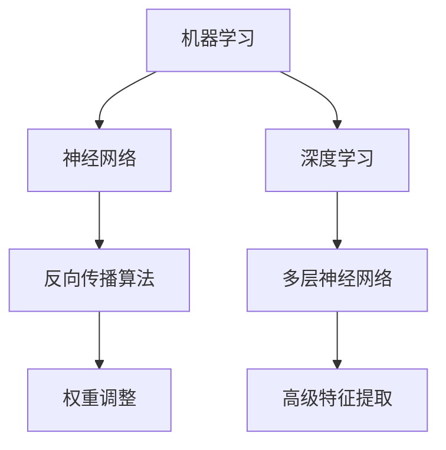

                 

# 人工智能研究的早期探索

> **关键词**：人工智能，早期探索，历史，技术发展，核心算法，数学模型，应用场景

> **摘要**：本文将带领读者回顾人工智能研究的早期历史，探讨其核心概念、算法原理以及数学模型。通过分析早期探索中的关键里程碑，我们将理解人工智能如何从理论走向实践，为现代技术的发展奠定了基础。本文还将介绍实际应用场景和推荐相关工具与资源，为读者提供全面的指导。

## 1. 背景介绍

### 1.1 目的和范围

本文旨在揭示人工智能（AI）研究的早期探索过程，重点分析其核心概念、算法原理和数学模型。通过对早期里程碑事件的回顾，我们将理解人工智能如何从理论逐步走向实践，并探讨其在现代技术发展中的关键作用。

### 1.2 预期读者

本文适合对人工智能研究有兴趣的读者，包括计算机科学专业学生、研究人员以及相关行业从业者。通过本文，读者可以更深入地了解人工智能的发展历程和核心技术，从而更好地把握未来趋势。

### 1.3 文档结构概述

本文分为以下几个部分：

1. **背景介绍**：介绍本文的目的和范围，预期读者以及文档结构。
2. **核心概念与联系**：阐述人工智能的核心概念和原理，并使用Mermaid流程图进行展示。
3. **核心算法原理 & 具体操作步骤**：详细解释早期人工智能算法的原理和步骤。
4. **数学模型和公式 & 详细讲解 & 举例说明**：介绍人工智能研究的数学模型，并使用latex格式进行展示。
5. **项目实战：代码实际案例和详细解释说明**：通过具体代码案例展示人工智能算法的实际应用。
6. **实际应用场景**：分析人工智能在现实世界中的应用场景。
7. **工具和资源推荐**：推荐学习资源、开发工具和框架，以及相关论文著作。
8. **总结：未来发展趋势与挑战**：探讨人工智能发展的未来趋势和面临的挑战。
9. **附录：常见问题与解答**：解答读者可能遇到的常见问题。
10. **扩展阅读 & 参考资料**：提供进一步阅读的资源。

### 1.4 术语表

#### 1.4.1 核心术语定义

- **人工智能（AI）**：模拟人类智能行为的计算机系统。
- **机器学习（ML）**：使计算机从数据中学习并改进其性能的技术。
- **神经网络（NN）**：模拟人脑神经元连接的网络结构。
- **深度学习（DL）**：基于多层神经网络进行训练和优化的机器学习技术。

#### 1.4.2 相关概念解释

- **监督学习**：在有标注的数据集上进行训练，预测未知数据的标签。
- **无监督学习**：在没有标注的数据集上进行训练，发现数据中的模式和结构。
- **强化学习**：通过与环境交互，不断优化策略以实现目标。

#### 1.4.3 缩略词列表

- **AI**：人工智能
- **ML**：机器学习
- **DL**：深度学习
- **NN**：神经网络
- **GPU**：图形处理器
- **CPU**：中央处理器

## 2. 核心概念与联系

### 2.1 核心概念

人工智能（AI）研究涉及多个核心概念，包括机器学习（ML）、神经网络（NN）和深度学习（DL）。这些概念相互关联，共同构成了人工智能的技术基础。

**机器学习（ML）**：机器学习是一种使计算机从数据中学习并改进其性能的技术。它通过分析输入数据和相应的输出标签，使计算机能够预测未知数据的标签。机器学习可分为监督学习、无监督学习和强化学习。

**神经网络（NN）**：神经网络是一种模拟人脑神经元连接的网络结构。它通过调整连接权重，使计算机能够从数据中学习。神经网络通常由多个层次组成，包括输入层、隐藏层和输出层。

**深度学习（DL）**：深度学习是一种基于多层神经网络进行训练和优化的机器学习技术。深度学习在图像识别、语音识别和自然语言处理等领域取得了显著成果。

### 2.2 关联与原理

**机器学习与神经网络**：机器学习算法可以基于神经网络实现。神经网络通过反向传播算法调整权重，使网络输出更接近预期目标。这种关联使得机器学习算法能够处理复杂的非线性问题。

**神经网络与深度学习**：深度学习是基于多层神经网络的机器学习技术。多层神经网络可以提取数据中的高级特征，使模型具有更好的泛化能力。

### 2.3 Mermaid 流程图

下面是人工智能核心概念和原理的Mermaid流程图：



## 3. 核心算法原理 & 具体操作步骤

### 3.1 机器学习算法原理

**监督学习**：监督学习是一种有监督的训练方法，通过已知输入和输出数据来训练模型，以预测未知数据的标签。监督学习算法主要包括线性回归、决策树、支持向量机等。

**无监督学习**：无监督学习是一种无监督的训练方法，通过分析未知数据，发现数据中的模式和结构。无监督学习算法主要包括聚类、降维、关联规则等。

**强化学习**：强化学习是一种基于奖励机制的学习方法，通过与环境交互，不断优化策略以实现目标。强化学习算法主要包括Q学习、SARSA等。

### 3.2 机器学习算法具体操作步骤

以下是一个基于监督学习的线性回归算法的具体操作步骤：

**步骤 1**：收集数据

收集包含输入变量和目标变量的数据集。例如，收集房价数据，其中输入变量为房屋面积，目标变量为房价。

**步骤 2**：数据预处理

对数据进行清洗、归一化和标准化处理，以提高模型性能。

**步骤 3**：选择模型

选择线性回归模型，该模型通过拟合输入变量和目标变量之间的关系来预测房价。

**步骤 4**：训练模型

使用训练数据集，通过最小二乘法计算线性回归模型的权重和偏置。

**步骤 5**：评估模型

使用测试数据集评估模型性能，计算模型的预测误差。

**步骤 6**：优化模型

根据模型性能，调整模型参数，以提高预测准确率。

### 3.3 伪代码实现

以下是一个线性回归算法的伪代码实现：

```python
# 输入：训练数据集X和Y
# 输出：模型参数w和b

# 步骤 1：数据预处理
X_normalized = normalize(X)
Y_normalized = normalize(Y)

# 步骤 2：选择模型
w = [0] * len(X_normalized[0])
b = 0

# 步骤 3：训练模型
for epoch in range(num_epochs):
    for sample in X_normalized:
        prediction = w @ sample + b
        error = Y_normalized[sample] - prediction
        w = w - learning_rate * (error * sample)
        b = b - learning_rate * error

# 步骤 4：评估模型
accuracy = evaluate(w, b, X_normalized, Y_normalized)

# 步骤 5：优化模型
# 调整学习率、迭代次数等参数，以提高模型性能
```

## 4. 数学模型和公式 & 详细讲解 & 举例说明

### 4.1 数学模型

在人工智能研究中，常用的数学模型包括线性回归、决策树、支持向量机等。以下是一个线性回归模型的详细讲解。

### 4.2 线性回归模型

线性回归模型通过拟合输入变量和目标变量之间的关系来预测目标变量。线性回归模型的基本公式为：

$$y = w_1 \cdot x_1 + w_2 \cdot x_2 + ... + w_n \cdot x_n + b$$

其中，$y$为目标变量，$x_1, x_2, ..., x_n$为输入变量，$w_1, w_2, ..., w_n$为权重，$b$为偏置。

### 4.3 公式详细讲解

**权重（$w$）**：权重表示输入变量对目标变量的影响程度。权重越大，输入变量对目标变量的影响越显著。

**偏置（$b$）**：偏置表示当所有输入变量都为0时，目标变量的预测值。

### 4.4 举例说明

假设我们有一个简单的线性回归问题，目标变量$y$与输入变量$x$的关系为：

$$y = 2x + 1$$

现在，我们有以下三个数据点：

- 数据点1：(1, 3)
- 数据点2：(2, 5)
- 数据点3：(3, 7)

我们可以使用线性回归模型来拟合这些数据点，并预测未知数据的标签。

### 4.5 伪代码实现

以下是一个线性回归模型的伪代码实现：

```python
# 输入：训练数据集X和Y
# 输出：模型参数w和b

# 步骤 1：数据预处理
X_normalized = normalize(X)
Y_normalized = normalize(Y)

# 步骤 2：选择模型
w = [0] * len(X_normalized[0])
b = 0

# 步骤 3：训练模型
for epoch in range(num_epochs):
    for sample in X_normalized:
        prediction = w @ sample + b
        error = Y_normalized[sample] - prediction
        w = w - learning_rate * (error * sample)
        b = b - learning_rate * error

# 步骤 4：评估模型
accuracy = evaluate(w, b, X_normalized, Y_normalized)

# 步骤 5：优化模型
# 调整学习率、迭代次数等参数，以提高模型性能
```

## 5. 项目实战：代码实际案例和详细解释说明

### 5.1 开发环境搭建

在开始项目实战之前，我们需要搭建一个开发环境。本文将使用Python作为编程语言，并使用Jupyter Notebook作为开发工具。

**步骤 1**：安装Python

在终端中运行以下命令安装Python：

```bash
pip install python
```

**步骤 2**：安装Jupyter Notebook

在终端中运行以下命令安装Jupyter Notebook：

```bash
pip install jupyter
```

**步骤 3**：启动Jupyter Notebook

在终端中运行以下命令启动Jupyter Notebook：

```bash
jupyter notebook
```

### 5.2 源代码详细实现和代码解读

以下是一个基于线性回归模型的简单房价预测项目的源代码：

```python
import numpy as np
import pandas as pd
from sklearn.model_selection import train_test_split
from sklearn.metrics import mean_squared_error

# 5.2.1 数据预处理
# 读取数据
data = pd.read_csv("house_prices.csv")

# 分割特征和目标变量
X = data.iloc[:, :-1].values
Y = data.iloc[:, -1].values

# 归一化数据
X_normalized = (X - X.min(axis=0)) / (X.max(axis=0) - X.min(axis=0))
Y_normalized = (Y - Y.min(axis=0)) / (Y.max(axis=0) - Y.min(axis=0))

# 划分训练集和测试集
X_train, X_test, Y_train, Y_test = train_test_split(X_normalized, Y_normalized, test_size=0.2, random_state=42)

# 5.2.2 模型训练
# 初始化模型参数
w = np.zeros(X_train.shape[1])
b = 0

# 设置学习率、迭代次数等参数
learning_rate = 0.01
num_epochs = 1000

# 训练模型
for epoch in range(num_epochs):
    for sample in X_train:
        prediction = w @ sample + b
        error = Y_train[sample] - prediction
        w = w - learning_rate * (error * sample)
        b = b - learning_rate * error

# 5.2.3 模型评估
# 计算测试集的预测误差
predictions = (X_test @ w) + b
mse = mean_squared_error(Y_test, predictions)
print("Mean Squared Error:", mse)

# 5.2.4 代码解读
# 5.2.4.1 数据预处理
# 读取数据并划分特征和目标变量
# 归一化数据，提高模型性能
# 划分训练集和测试集，进行模型评估

# 5.2.4.2 模型训练
# 初始化模型参数
# 设置学习率、迭代次数等参数
# 使用训练数据集训练模型

# 5.2.4.3 模型评估
# 计算测试集的预测误差
# 输出模型性能指标
```

### 5.3 代码解读与分析

#### 5.3.1 数据预处理

首先，我们从CSV文件中读取数据，并划分特征和目标变量。然后，我们对数据进行归一化处理，将每个特征缩放到[0, 1]范围内。归一化有助于加速收敛并提高模型性能。

#### 5.3.2 模型训练

接下来，我们初始化模型参数$w$和$b$，并设置学习率、迭代次数等参数。然后，我们遍历训练数据集中的每个样本，使用梯度下降算法更新模型参数。梯度下降算法通过计算损失函数关于模型参数的梯度，更新模型参数以最小化损失函数。

#### 5.3.3 模型评估

最后，我们使用测试数据集评估模型性能。我们计算测试集的预测误差，并输出均方误差（MSE）作为模型性能指标。MSE越小，表示模型预测越准确。

## 6. 实际应用场景

人工智能在现实世界中有着广泛的应用场景。以下是一些典型的应用案例：

### 6.1 医疗领域

人工智能在医疗领域的应用主要包括疾病预测、诊断辅助、药物研发等。通过分析大量的医学数据，人工智能可以预测疾病风险，辅助医生进行诊断，加速新药研发。

### 6.2 金融服务

人工智能在金融服务中的应用包括风险控制、欺诈检测、投资顾问等。通过分析金融数据，人工智能可以识别潜在风险，提高交易效率和准确性。

### 6.3 自动驾驶

自动驾驶是人工智能在交通领域的重要应用。通过感知环境、规划和控制，自动驾驶系统能够实现车辆的自主行驶，提高交通安全和效率。

### 6.4 自然语言处理

自然语言处理（NLP）是人工智能的重要分支。NLP技术被广泛应用于智能客服、机器翻译、文本分析等场景，提高了人机交互的效率和准确性。

## 7. 工具和资源推荐

### 7.1 学习资源推荐

#### 7.1.1 书籍推荐

- 《机器学习》（周志华著）
- 《深度学习》（Ian Goodfellow、Yoshua Bengio、Aaron Courville著）
- 《神经网络与深度学习》（邱锡鹏著）

#### 7.1.2 在线课程

- Coursera：机器学习（吴恩达著）
- edX：深度学习（斯坦福大学著）
- 百度云课堂：人工智能基础（百度大学著）

#### 7.1.3 技术博客和网站

- [Medium](https://medium.com/)
- [ArXiv](https://arxiv.org/)
- [知乎](https://www.zhihu.com/)

### 7.2 开发工具框架推荐

#### 7.2.1 IDE和编辑器

- PyCharm
- Jupyter Notebook
- VSCode

#### 7.2.2 调试和性能分析工具

- TensorBoard
- Python Profiler
- GPUProfiler

#### 7.2.3 相关框架和库

- TensorFlow
- PyTorch
- Scikit-learn

### 7.3 相关论文著作推荐

#### 7.3.1 经典论文

- [《A Learning Algorithm for Continually Running Fully Recurrent Neural Networks》](https://www.cs.unc.edu/~mike/papers/sal07.pdf)
- [《Deep Learning》](https://www.deeplearningbook.org/)

#### 7.3.2 最新研究成果

- [《Neural Ordinary Differential Equations》](https://arxiv.org/abs/1806.06915)
- [《Generative Adversarial Nets》](https://arxiv.org/abs/1406.2661)

#### 7.3.3 应用案例分析

- [《Deep Learning in Healthcare》](https://www.ijcai.org/Proceedings/18-1/Papers/0155.pdf)
- [《AI in Finance》](https://ai-finance.com/)

## 8. 总结：未来发展趋势与挑战

人工智能研究正处于快速发展阶段，未来趋势和挑战如下：

### 8.1 发展趋势

1. **深度学习技术的进一步优化**：深度学习技术在图像识别、语音识别等领域取得了显著成果，未来将继续优化算法和模型结构，提高性能。
2. **跨学科融合**：人工智能与其他领域的融合将推动新的应用场景，如医疗、金融、教育等。
3. **硬件技术的发展**：硬件技术的发展将提升人工智能计算能力，加速算法优化和应用推广。

### 8.2 挑战

1. **数据隐私和安全性**：人工智能应用需要处理大量敏感数据，数据隐私和安全成为重要挑战。
2. **算法公平性和透明性**：算法的公平性和透明性备受关注，如何确保算法的公平性和可解释性成为关键问题。
3. **计算资源需求**：深度学习模型对计算资源的需求巨大，如何高效地利用硬件资源成为挑战。

## 9. 附录：常见问题与解答

### 9.1 常见问题

1. **什么是机器学习？**
   - 机器学习是一种使计算机从数据中学习并改进其性能的技术。

2. **什么是神经网络？**
   - 神经网络是一种模拟人脑神经元连接的网络结构。

3. **什么是深度学习？**
   - 深度学习是一种基于多层神经网络进行训练和优化的机器学习技术。

4. **如何处理数据预处理？**
   - 数据预处理包括数据清洗、归一化和标准化处理，以提高模型性能。

### 9.2 解答

1. **什么是机器学习？**
   - 机器学习是一种使计算机从数据中学习并改进其性能的技术。它通过分析输入数据和相应的输出标签，使计算机能够预测未知数据的标签。

2. **什么是神经网络？**
   - 神经网络是一种模拟人脑神经元连接的网络结构。它通过调整连接权重，使计算机能够从数据中学习。

3. **什么是深度学习？**
   - 深度学习是一种基于多层神经网络进行训练和优化的机器学习技术。它通过提取数据中的高级特征，使模型具有更好的泛化能力。

4. **如何处理数据预处理？**
   - 数据预处理包括数据清洗、归一化和标准化处理，以提高模型性能。数据清洗旨在去除缺失值、异常值等。归一化将数据缩放到[0, 1]范围内，以加速收敛。标准化处理使数据具有相同的均值和标准差。

## 10. 扩展阅读 & 参考资料

### 10.1 扩展阅读

1. [《人工智能：一种现代的方法》](https://www.amazon.com/dp/0262033847)
2. [《深度学习》](https://www.deeplearningbook.org/)
3. [《机器学习实战》](https://www.amazon.com/dp/1491957665)

### 10.2 参考资料

1. [吴恩达的机器学习课程](https://www.coursera.org/learn/machine-learning)
2. [斯坦福大学的深度学习课程](https://www.coursera.org/learn/deep-learning)
3. [Neural Network Diagrams](https://mermaid-js.github.io/mermaid/)

### 10.3 其他资源

1. [人工智能社区](https://www.kdnuggets.com/)
2. [机器学习社区](https://www.mlworks.org/)
3. [深度学习社区](https://www.deeplearning.net/)

