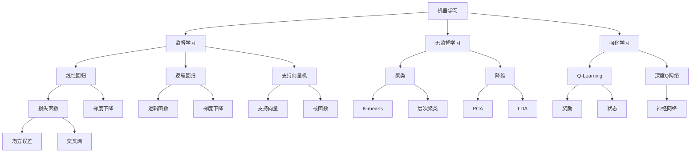

                 

# 人工智能算法(AI Algorithms) - 原理与代码实例讲解

> 关键词：人工智能算法、机器学习、深度学习、神经网络、算法原理、代码实例

> 摘要：本文旨在深入探讨人工智能算法的原理和实现，通过详细的代码实例讲解，帮助读者理解并掌握各类核心算法。本文涵盖了从基础机器学习算法到复杂深度学习模型的解析，适合对AI算法有一定基础的读者阅读和学习。

## 1. 背景介绍

### 1.1 目的和范围

本文的目的在于系统地介绍人工智能算法的基本原理和实现细节，旨在通过具体的代码实例，使读者能够深入理解这些算法的运行机制和适用场景。文章将涵盖以下主要内容：

- 机器学习基础算法：包括线性回归、逻辑回归、支持向量机等。
- 深度学习核心算法：包括卷积神经网络（CNN）、循环神经网络（RNN）、长短期记忆网络（LSTM）等。
- 算法实现细节：通过伪代码和实际代码示例，解析算法的每一部分。
- 数学模型和公式：对核心算法涉及的数学模型进行详细讲解，并附有实例说明。
- 实际应用场景：讨论人工智能算法在现实世界中的应用案例。

### 1.2 预期读者

本文适合具有一定编程基础和对机器学习、深度学习有一定了解的读者。读者需要对Python等编程语言有一定的掌握，并了解基本的数学知识，如线性代数、微积分等。

### 1.3 文档结构概述

本文结构如下：

- 第1部分：背景介绍，包括目的、范围、预期读者和文档结构概述。
- 第2部分：核心概念与联系，通过Mermaid流程图展示核心概念和架构。
- 第3部分：核心算法原理与具体操作步骤，使用伪代码详细阐述算法原理。
- 第4部分：数学模型和公式，详细讲解核心算法涉及的数学模型。
- 第5部分：项目实战，提供代码实际案例和详细解释。
- 第6部分：实际应用场景，讨论算法的应用实例。
- 第7部分：工具和资源推荐，包括学习资源、开发工具和论文著作。
- 第8部分：总结，探讨未来发展趋势与挑战。
- 第9部分：附录，提供常见问题与解答。
- 第10部分：扩展阅读与参考资料，列出相关文献和资源。

### 1.4 术语表

#### 1.4.1 核心术语定义

- 机器学习（Machine Learning）：通过算法使计算机从数据中学习，进行预测或决策。
- 深度学习（Deep Learning）：一种特殊的机器学习方法，通过多层神经网络进行数据处理和特征学习。
- 神经网络（Neural Network）：一种模仿生物神经系统的计算模型。
- 卷积神经网络（Convolutional Neural Network，CNN）：用于图像识别等任务的深度学习模型。
- 循环神经网络（Recurrent Neural Network，RNN）：用于序列数据处理和学习。
- 长短期记忆网络（Long Short-Term Memory，LSTM）：RNN的一种变体，能够更好地处理长序列数据。

#### 1.4.2 相关概念解释

- 算法（Algorithm）：解决问题的步骤集合。
- 模型（Model）：将现实世界的问题抽象为一个数学结构。
- 特征（Feature）：用于描述数据属性的变量。
- 标签（Label）：用于标注数据类别的变量。

#### 1.4.3 缩略词列表

- AI：人工智能（Artificial Intelligence）
- ML：机器学习（Machine Learning）
- DL：深度学习（Deep Learning）
- CNN：卷积神经网络（Convolutional Neural Network）
- RNN：循环神经网络（Recurrent Neural Network）
- LSTM：长短期记忆网络（Long Short-Term Memory）

## 2. 核心概念与联系

在深入讨论人工智能算法之前，我们需要了解一些核心概念和它们之间的关系。以下是一个用Mermaid绘制的流程图，展示了机器学习和深度学习中的关键组成部分及其相互联系。



### 2.1 机器学习

机器学习是人工智能的核心分支之一，旨在通过算法让计算机从数据中学习。机器学习可以分为以下几类：

- **监督学习**：有标记的数据训练模型，用于预测未知数据。
  - **线性回归**：预测连续值。
  - **逻辑回归**：预测离散值，常用于分类问题。
  - **支持向量机**：通过最大化边界来分类数据。

- **无监督学习**：没有标记的数据训练模型，用于发现数据中的结构和模式。
  - **聚类**：将数据分组为若干个簇。
    - **K-means**：一种基于距离的聚类算法。
    - **层次聚类**：通过层次结构对数据进行聚类。
  - **降维**：减少数据维度，提高计算效率。
    - **PCA**：主成分分析，通过保留主要信息来降维。
    - **LDA**：线性判别分析，通过最大化类别间差异来降维。

- **强化学习**：通过与环境的交互来学习策略，通常用于决策问题。
  - **Q-Learning**：通过迭代更新Q值来学习策略。
  - **深度Q网络**：结合深度学习和Q-Learning的强化学习模型。

### 2.2 深度学习

深度学习是机器学习的一个分支，通过多层神经网络来学习数据的高级特征表示。深度学习的关键组成部分包括：

- **神经网络**：由多个神经元组成的计算模型，用于处理和变换数据。
- **卷积神经网络（CNN）**：专门用于图像处理，通过卷积操作提取图像特征。
- **循环神经网络（RNN）**：用于序列数据建模，能够记住序列信息。
- **长短期记忆网络（LSTM）**：RNN的一种变体，能够更好地处理长序列数据。

## 3. 核心算法原理 & 具体操作步骤

在了解核心概念和联系后，我们将深入探讨几个重要的机器学习和深度学习算法，并使用伪代码详细阐述它们的原理和操作步骤。

### 3.1 线性回归

线性回归是一种用于预测连续值的监督学习算法，其基本原理是通过拟合一条直线来预测目标值。

#### 算法原理

线性回归的目标是最小化预测值与实际值之间的误差，使用最小二乘法来求解最优参数。假设我们有一个包含输入变量 \( x \) 和目标变量 \( y \) 的数据集，我们希望找到一个线性模型：

\[ y = w_0 + w_1 \cdot x \]

其中 \( w_0 \) 和 \( w_1 \) 是我们需要求解的参数。最小二乘法的思想是使得所有样本点到拟合直线的垂直距离之和最小。

#### 伪代码

```python
def linear_regression(x, y):
    # 求解参数 w_0 和 w_1
    w_0 = (sum(y - w_1 * x) / n) / sum(x**2)
    w_1 = (sum(x * y) - sum(x) * sum(y)) / (sum(x**2) - n * sum(x**2))

    # 返回参数
    return w_0, w_1
```

#### 操作步骤

1. 收集数据集 \( (x, y) \)。
2. 计算参数 \( w_0 \) 和 \( w_1 \)。
3. 使用拟合直线进行预测。

### 3.2 卷积神经网络（CNN）

卷积神经网络是一种专门用于图像识别的深度学习模型，其核心思想是通过卷积操作和池化操作提取图像特征。

#### 算法原理

CNN的基本结构包括卷积层、池化层和全连接层。卷积层通过卷积操作提取图像的局部特征，池化层用于减少数据维度和参数数量，全连接层用于分类。

- **卷积层**：通过卷积操作将输入图像与卷积核进行卷积，提取特征。
- **池化层**：通过最大池化或平均池化将卷积层的输出进行下采样。
- **全连接层**：将池化层的输出映射到分类结果。

#### 伪代码

```python
def convolutional_neural_network(x, w, b):
    # 卷积层
    for filter in w:
        conv_output = conv2d(x, filter)
        pool_output = max_pool(conv_output)
        
        # 全连接层
        z = dot(pool_output, b)
        y = activation_function(z)

    return y
```

#### 操作步骤

1. 初始化权重和偏置。
2. 通过卷积层提取特征。
3. 通过池化层减少数据维度。
4. 通过全连接层进行分类。

### 3.3 循环神经网络（RNN）

循环神经网络是一种用于序列数据建模的深度学习模型，其核心思想是通过循环结构来保持对序列上下文的记忆。

#### 算法原理

RNN的基本结构包括输入层、隐藏层和输出层。每个时间步的输入都会与前一时间步的隐藏状态结合，用于更新当前隐藏状态。

- **输入层**：接收序列的输入。
- **隐藏层**：存储序列信息，通过递归更新隐藏状态。
- **输出层**：生成序列的输出。

#### 伪代码

```python
def recurrent_neural_network(x, h_prev, w, b):
    # 输入层
    h = activation_function(dot(x, w_input) + dot(h_prev, w_hidden) + b)

    # 返回隐藏状态
    return h
```

#### 操作步骤

1. 初始化隐藏状态。
2. 遍历序列的每个时间步。
3. 更新隐藏状态。
4. 生成输出序列。

## 4. 数学模型和公式 & 详细讲解 & 举例说明

在人工智能算法中，数学模型是理解和实现算法的关键。以下是对核心算法涉及的数学模型和公式的详细讲解，并附有实例说明。

### 4.1 线性回归

线性回归的核心数学模型是一个线性方程：

\[ y = w_0 + w_1 \cdot x \]

其中，\( w_0 \) 和 \( w_1 \) 是模型参数，\( x \) 是输入特征，\( y \) 是目标变量。

#### 损失函数

为了最小化预测值与实际值之间的误差，我们使用均方误差（Mean Squared Error，MSE）作为损失函数：

\[ J(w_0, w_1) = \frac{1}{2n} \sum_{i=1}^{n} (y_i - (w_0 + w_1 \cdot x_i))^2 \]

#### 梯度下降

为了求解最优参数，我们使用梯度下降法。梯度下降的目标是沿着损失函数的负梯度方向更新参数：

\[ w_0 := w_0 - \alpha \frac{\partial J}{\partial w_0} \]
\[ w_1 := w_1 - \alpha \frac{\partial J}{\partial w_1} \]

其中，\( \alpha \) 是学习率。

#### 实例说明

假设我们有如下数据集：

\[ \{ (1, 2), (2, 3), (3, 4) \} \]

我们希望拟合一条直线 \( y = w_0 + w_1 \cdot x \)。使用梯度下降法，初始参数 \( w_0 = 0 \)，\( w_1 = 0 \)，学习率 \( \alpha = 0.1 \)。

1. 计算损失函数 \( J(w_0, w_1) \)。
2. 计算梯度 \( \frac{\partial J}{\partial w_0} \) 和 \( \frac{\partial J}{\partial w_1} \)。
3. 更新参数 \( w_0 \) 和 \( w_1 \)。
4. 重复步骤1-3，直到满足停止条件（如迭代次数或损失函数收敛）。

### 4.2 卷积神经网络（CNN）

卷积神经网络的核心数学模型包括卷积操作、池化操作和激活函数。

#### 卷积操作

卷积操作是将输入图像与卷积核进行卷积，提取图像特征。卷积操作可以用以下公式表示：

\[ \text{output}_{ij} = \sum_{k=1}^{K} \sum_{l=1}^{K} w_{kl} \cdot x_{i+k-j, j+l-h} \]

其中，\( \text{output}_{ij} \) 是卷积输出，\( w_{kl} \) 是卷积核，\( x \) 是输入图像，\( K \) 是卷积核大小，\( h \) 和 \( w \) 是输入图像的高度和宽度。

#### 池化操作

池化操作是将卷积输出的局部区域进行平均或最大值操作，减少数据维度。最大池化可以用以下公式表示：

\[ \text{pool}_{ij} = \max \{ \text{output}_{i+k-j, j+l-h} : k=1, \ldots, K; l=1, \ldots, K \} \]

#### 激活函数

激活函数是对卷积输出的非线性变换，用于引入非线性特性。常见的激活函数包括ReLU（Rectified Linear Unit）：

\[ \text{ReLU}(x) = \max \{ 0, x \} \]

#### 实例说明

假设我们有如下输入图像：

\[ x = \begin{bmatrix} 1 & 1 & 1 \\ 1 & 1 & 1 \\ 1 & 1 & 1 \end{bmatrix} \]

和卷积核：

\[ w = \begin{bmatrix} 1 & 0 & -1 \\ 1 & 1 & 0 \\ 0 & 1 & 1 \end{bmatrix} \]

使用2x2的最大池化，计算卷积输出和池化输出：

1. 计算卷积输出。
2. 计算最大池化输出。

### 4.3 循环神经网络（RNN）

循环神经网络的核心数学模型包括递归关系、激活函数和损失函数。

#### 递归关系

RNN的递归关系可以表示为：

\[ h_t = \text{ReLU}(W_h \cdot [h_{t-1}, x_t] + b_h) \]

其中，\( h_t \) 是当前时间步的隐藏状态，\( x_t \) 是当前时间步的输入，\( W_h \) 和 \( b_h \) 是权重和偏置。

#### 激活函数

RNN的激活函数通常使用ReLU函数：

\[ \text{ReLU}(x) = \max \{ 0, x \} \]

#### 损失函数

RNN的损失函数通常使用交叉熵损失：

\[ J = \frac{1}{n} \sum_{i=1}^{n} -y_i \cdot \log(p_i) \]

其中，\( y_i \) 是目标变量，\( p_i \) 是模型预测的概率分布。

#### 实例说明

假设我们有如下输入序列：

\[ x = \{ (1, 2), (3, 4), (5, 6) \} \]

和隐藏状态：

\[ h_0 = \begin{bmatrix} 1 & 0 & 0 \end{bmatrix} \]

使用ReLU函数和交叉熵损失，计算隐藏状态和损失：

1. 初始化隐藏状态。
2. 遍历输入序列，更新隐藏状态。
3. 计算损失函数。

## 5. 项目实战：代码实际案例和详细解释说明

在了解了核心算法和数学模型之后，我们将通过一个实际项目来展示如何将这些算法应用到实际问题中。

### 5.1 开发环境搭建

在开始项目之前，我们需要搭建一个合适的开发环境。以下是所需的软件和工具：

- 编程语言：Python
- 深度学习框架：TensorFlow
- 数据可视化工具：Matplotlib
- 数据预处理库：Pandas

#### 步骤

1. 安装Python（建议使用Anaconda）。
2. 安装TensorFlow。

```bash
pip install tensorflow
```

3. 安装Matplotlib和Pandas。

```bash
pip install matplotlib pandas
```

### 5.2 源代码详细实现和代码解读

以下是一个简单的线性回归项目的代码示例，我们将使用Python和TensorFlow来实现线性回归模型，并对其代码进行详细解读。

```python
import tensorflow as tf
import pandas as pd
import matplotlib.pyplot as plt

# 加载数据集
data = pd.read_csv('data.csv')
x = data[['x']]
y = data[['y']]

# 初始化模型参数
w = tf.Variable(0.0, name='weights')
b = tf.Variable(0.0, name='bias')

# 定义线性回归模型
def linear_regression(x, w, b):
    y_pred = w * x + b
    return y_pred

# 定义损失函数
def mean_squared_error(y_pred, y):
    return tf.reduce_mean(tf.square(y_pred - y))

# 定义梯度下降优化器
optimizer = tf.train.GradientDescentOptimizer(learning_rate=0.1)

# 定义训练步骤
def train(x, y, w, b):
    with tf.GradientTape() as tape:
        y_pred = linear_regression(x, w, b)
        loss = mean_squared_error(y_pred, y)
    
    gradients = tape.gradient(loss, [w, b])
    optimizer.apply_gradients(zip(gradients, [w, b]))
    
    return loss

# 训练模型
n_epochs = 100
for epoch in range(n_epochs):
    loss = train(x, y, w, b)
    if epoch % 10 == 0:
        print(f'Epoch {epoch}: Loss = {loss.numpy()}')

# 模型评估
test_data = pd.read_csv('test_data.csv')
x_test = test_data[['x']]
y_test = test_data[['y']]

y_pred = linear_regression(x_test, w, b)
loss_test = mean_squared_error(y_pred, y_test)

print(f'Test Loss: {loss_test.numpy()}')

# 可视化结果
plt.scatter(x, y)
plt.plot(x, y_pred.numpy(), 'r')
plt.xlabel('x')
plt.ylabel('y')
plt.show()
```

#### 代码解读

1. **数据加载**：我们使用Pandas加载CSV文件中的数据集，并将其分为输入特征 \( x \) 和目标变量 \( y \)。
2. **模型初始化**：我们使用TensorFlow创建两个变量 \( w \) 和 \( b \)，分别表示模型的权重和偏置。
3. **定义模型**：`linear_regression` 函数定义了线性回归模型，通过 \( w \) 和 \( b \) 计算预测值。
4. **损失函数**：`mean_squared_error` 函数计算预测值和实际值之间的均方误差。
5. **梯度下降优化器**：`GradientDescentOptimizer` 用于更新模型参数。
6. **训练步骤**：`train` 函数定义了训练过程，通过反向传播计算梯度并更新参数。
7. **模型评估**：我们使用测试数据集评估模型的性能。
8. **可视化结果**：我们使用Matplotlib将真实数据和预测结果进行可视化。

### 5.3 代码解读与分析

在代码示例中，我们使用了TensorFlow的高层API来简化模型实现。以下是代码的详细解读和分析：

1. **数据预处理**：使用Pandas加载数据集并分为输入特征和目标变量。在实际项目中，我们可能需要进行更复杂的预处理步骤，如归一化、缺失值填充等。
2. **模型初始化**：使用TensorFlow创建变量，这里我们使用了默认的初始化方法。在实际项目中，可能需要自定义初始化方法来改进模型的性能。
3. **模型定义**：`linear_regression` 函数定义了线性回归模型，通过 \( w \) 和 \( b \) 计算预测值。这里使用了简单的线性模型，但在实际项目中，可能需要更复杂的模型结构，如多层感知机等。
4. **损失函数**：使用均方误差作为损失函数，它能够衡量预测值和实际值之间的差异。在实际项目中，可能需要使用其他损失函数，如交叉熵损失，以适应不同的任务。
5. **梯度下降优化器**：我们使用了梯度下降优化器来更新模型参数。在实际项目中，可能需要使用更复杂的优化器，如Adam优化器，以加快收敛速度。
6. **训练过程**：`train` 函数定义了训练过程，通过反向传播计算梯度并更新参数。在实际项目中，可能需要添加正则化、提前停止等技巧来防止过拟合。
7. **模型评估**：使用测试数据集评估模型的性能。在实际项目中，可能需要使用更复杂的评估指标，如准确率、召回率等。
8. **可视化结果**：使用Matplotlib将真实数据和预测结果进行可视化。在实际项目中，可视化可以帮助我们更好地理解模型的行为和性能。

通过这个实际项目，我们展示了如何使用TensorFlow实现线性回归模型，并对代码进行了详细解读和分析。这为我们进一步探索更复杂的机器学习和深度学习算法打下了坚实的基础。

## 6. 实际应用场景

人工智能算法在现实世界中有广泛的应用，涵盖了从图像识别到自然语言处理的各种领域。以下是一些典型的应用场景：

### 6.1 图像识别

卷积神经网络（CNN）是图像识别领域的核心技术。例如，在医疗图像分析中，CNN可以用于诊断疾病，如皮肤癌、乳腺癌等。通过训练CNN模型，医生可以更准确地识别图像中的异常区域，从而提高诊断的准确性。

### 6.2 自然语言处理

循环神经网络（RNN）和长短期记忆网络（LSTM）在自然语言处理领域有着广泛的应用。例如，RNN可以用于机器翻译，通过学习源语言和目标语言之间的对应关系，实现高质量的自然语言翻译。此外，RNN还可以用于情感分析，通过分析文本的情感倾向，帮助企业和品牌了解消费者的反馈和态度。

### 6.3 个性化推荐

机器学习算法在个性化推荐系统中发挥着重要作用。例如，电商平台可以使用协同过滤算法为用户推荐商品，通过分析用户的历史购买记录和相似用户的偏好，实现个性化的推荐。此外，深度学习算法也被用于推荐系统，通过学习用户的历史行为和内容特征，提供更加精准的推荐结果。

### 6.4 自动驾驶

深度学习在自动驾驶领域有着重要的应用。自动驾驶系统使用卷积神经网络（CNN）和循环神经网络（RNN）来处理摄像头和激光雷达的数据，识别道路标志、行人、车辆等障碍物，并做出相应的驾驶决策。通过深度学习算法的训练，自动驾驶系统能够在各种复杂的交通环境中实现安全驾驶。

### 6.5 医疗诊断

机器学习算法在医疗诊断中也具有广泛的应用。例如，可以使用支持向量机（SVM）进行疾病分类，通过分析患者的医学影像和病历数据，实现早期疾病的诊断和预测。此外，深度学习算法也被用于医学图像分析，如肺癌筛查、脑部病变检测等，以提高诊断的准确性和效率。

这些实际应用案例展示了人工智能算法在各个领域的强大能力。通过不断的研究和创新，人工智能算法将在未来继续推动社会的发展和进步。

## 7. 工具和资源推荐

在学习和应用人工智能算法的过程中，合适的工具和资源可以极大地提高效率。以下是一些建议的资源和工具，以帮助您更好地掌握人工智能知识。

### 7.1 学习资源推荐

#### 7.1.1 书籍推荐

- **《Python机器学习》（Python Machine Learning）**：由Sebastian Raschka和Vahid Mirhoseini编写的这本书是Python机器学习的经典之作，适合初学者和进阶者。
- **《深度学习》（Deep Learning）**：由Ian Goodfellow、Yoshua Bengio和Aaron Courville编写的这本书是深度学习的权威指南，内容全面，适合进阶学习。
- **《统计学习方法》（Statistical Learning Methods）**：由李航编写的这本书详细介绍了机器学习的基础算法和理论，适合对算法原理有深入理解的读者。

#### 7.1.2 在线课程

- **Coursera上的《机器学习》（Machine Learning）**：吴恩达（Andrew Ng）开设的这门课程是机器学习的入门经典，适合初学者。
- **Udacity的《深度学习纳米学位》（Deep Learning Nanodegree）**：这门课程涵盖了深度学习的各个方面，适合进阶学习。
- **edX上的《神经网络与深度学习》（Neural Networks and Deep Learning）**：由斯坦福大学开设的这门课程，由吴恩达主讲，适合对深度学习有兴趣的读者。

#### 7.1.3 技术博客和网站

- **Towards Data Science**：这是一个广泛的技术博客，涵盖了数据科学和机器学习的各个方面，有许多高质量的教程和文章。
- **Medium上的“Deep Learning”专题**：许多深度学习领域的专家和研究者在这里分享他们的研究成果和见解，非常适合进阶学习。
- **AI Sandbox**：这是一个在线学习平台，提供许多机器学习和深度学习的实战项目，适合动手实践。

### 7.2 开发工具框架推荐

#### 7.2.1 IDE和编辑器

- **Jupyter Notebook**：这是一个流行的交互式开发环境，适合数据分析和机器学习实验。
- **PyCharm**：这是一个功能强大的Python IDE，提供代码自动完成、调试和版本控制等功能。
- **VS Code**：这是一个轻量级的文本编辑器，通过插件支持Python开发，非常适合机器学习和深度学习。

#### 7.2.2 调试和性能分析工具

- **TensorBoard**：TensorFlow提供的可视化工具，用于分析和调试深度学习模型的性能。
- **PyTorch Profiler**：PyTorch提供的性能分析工具，用于优化模型性能。
- **NVIDIA Nsight**：NVIDIA提供的工具，用于分析深度学习模型的性能和资源使用。

#### 7.2.3 相关框架和库

- **TensorFlow**：这是一个广泛使用的深度学习框架，提供丰富的API和工具。
- **PyTorch**：这是一个流行的深度学习框架，以动态计算图和灵活的API著称。
- **Scikit-Learn**：这是一个机器学习库，提供许多经典的机器学习算法和工具。

### 7.3 相关论文著作推荐

#### 7.3.1 经典论文

- **“Backpropagation” by David E. Rumelhart, Geoffrey E. Hinton, and Ronald J. Williams**：这篇论文首次提出了反向传播算法，是深度学习的基础。
- **“A Learning Algorithm for Continually Running Fully Recurrent Neural Networks” by Sepp Hochreiter and Jürgen Schmidhuber**：这篇论文提出了长短期记忆网络（LSTM），解决了传统RNN的长期依赖问题。

#### 7.3.2 最新研究成果

- **“Attention Is All You Need” by Vaswani et al.**：这篇论文提出了Transformer模型，彻底改变了自然语言处理领域。
- **“Gradient Descent Is Efficient: Linear Convergence of Gradient Descent for Machine Learning” by Andrew M. Stuart and Michael L. Overton**：这篇论文证明了梯度下降算法在机器学习问题中的线性收敛性。

#### 7.3.3 应用案例分析

- **“Deep Learning for Natural Language Processing” by William L. Hamilton**：这本书详细介绍了深度学习在自然语言处理中的应用案例。
- **“Deep Learning in Computer Vision” by Yangqing Jia, Trevor Darrell, and Kaiming He**：这本书探讨了深度学习在计算机视觉领域的应用，包括图像识别和目标检测等。

通过这些资源和工具，您可以系统地学习人工智能算法，提高实战能力，并在未来的项目中取得更好的成果。

## 8. 总结：未来发展趋势与挑战

人工智能算法在过去的几十年里取得了显著的进展，从基础的机器学习算法到复杂的深度学习模型，都展现出了强大的应用潜力。然而，随着技术的不断演进，我们也面临诸多挑战和机遇。

### 8.1 未来发展趋势

1. **算法优化与效率提升**：现有的深度学习模型在计算资源和能耗方面存在较大消耗，未来将出现更多高效的算法和优化方法，如量化、剪枝、神经架构搜索（NAS）等。
2. **跨领域融合**：人工智能算法与其他领域的结合将产生新的突破，如生物医学、金融、制造业等。跨领域的融合将推动人工智能在更多场景中的应用。
3. **可解释性增强**：随着人工智能算法的复杂性增加，提高模型的可解释性变得尤为重要。未来将出现更多可解释性强的算法，帮助用户更好地理解模型的决策过程。
4. **数据隐私与安全**：随着数据隐私和安全问题的日益突出，人工智能算法将更加注重数据保护和隐私保护。数据加密、联邦学习等技术将成为重要的研究方向。

### 8.2 面临的挑战

1. **算法复杂度**：深度学习模型的复杂度不断增加，导致训练和推理时间显著增加。如何简化模型结构，提高计算效率，是当前的一个重要挑战。
2. **数据质量和数量**：高质量的数据是训练强大模型的基础。然而，获取和标注大量高质量数据仍然是一个难题。如何从大量未标注的数据中自动提取有价值的信息，是实现人工智能算法的重要方向。
3. **伦理与道德**：人工智能算法在应用过程中，可能引发伦理和道德问题，如偏见、歧视等。如何确保算法的公平性、透明性和可控性，是亟待解决的问题。
4. **资源消耗**：随着深度学习模型规模的不断扩大，计算资源和能源消耗也越来越大。如何降低资源消耗，提高算法的可持续性，是一个重要的挑战。

### 8.3 结论

人工智能算法的发展带来了巨大的机遇，但同时也伴随着诸多挑战。未来，我们需要在算法优化、跨领域融合、可解释性、数据隐私等方面进行深入研究，以应对这些挑战，推动人工智能技术的持续进步。

## 9. 附录：常见问题与解答

在本文中，我们涉及了许多关于人工智能算法的基本概念、实现细节和应用场景。以下是一些常见问题的解答，希望能为您进一步理解人工智能算法提供帮助。

### 9.1 什么是机器学习？

机器学习是指通过算法使计算机从数据中学习，进行预测或决策。它是一种使计算机能够自动改进性能的技术。

### 9.2 什么是深度学习？

深度学习是机器学习的一个分支，通过多层神经网络来学习数据的高级特征表示。它能够自动提取数据中的复杂结构和模式。

### 9.3 什么是卷积神经网络（CNN）？

卷积神经网络是一种专门用于图像处理的深度学习模型，通过卷积操作提取图像特征，并用于图像分类、目标检测等任务。

### 9.4 什么是循环神经网络（RNN）？

循环神经网络是一种用于序列数据建模的深度学习模型，能够记住序列信息，并用于时间序列预测、机器翻译等任务。

### 9.5 什么是长短期记忆网络（LSTM）？

长短期记忆网络是RNN的一种变体，能够更好地处理长序列数据，避免了传统RNN的长期依赖问题。

### 9.6 如何选择合适的机器学习算法？

选择合适的机器学习算法取决于问题的类型、数据的特征以及模型的性能要求。常见的策略包括：

- **问题类型**：确定是分类问题、回归问题还是聚类问题。
- **数据特征**：分析数据的分布、特征数量和特征之间的相关性。
- **模型性能**：通过交叉验证等方法评估不同算法的性能，选择表现最好的算法。

### 9.7 如何处理不平衡数据？

在不平衡数据集上训练模型可能会导致模型偏向于大多数类。以下是一些处理不平衡数据的方法：

- **过采样**：增加少数类样本的数量。
- **欠采样**：减少多数类样本的数量。
- **生成对抗网络（GAN）**：生成少数类的模拟样本。
- **权重调整**：为每个样本分配不同的权重，以平衡模型的决策。

### 9.8 如何提高模型的泛化能力？

提高模型的泛化能力可以通过以下方法实现：

- **数据增强**：增加训练数据的多样性。
- **正则化**：引入正则化项，防止过拟合。
- **提前停止**：在验证集上性能不再提升时停止训练。
- **交叉验证**：使用不同的数据集多次训练和验证模型。

通过以上问题的解答，我们希望您能对人工智能算法有更深入的理解。在实际应用中，根据具体问题和数据特点，灵活选择和调整算法，是取得成功的关键。

## 10. 扩展阅读 & 参考资料

在本文中，我们介绍了人工智能算法的基本概念、原理和应用。以下是一些扩展阅读和参考资料，以帮助您进一步深入学习：

### 10.1 书籍推荐

- **《机器学习》（Machine Learning）**：作者：Tom M. Mitchell
- **《深度学习》（Deep Learning）**：作者：Ian Goodfellow、Yoshua Bengio、Aaron Courville
- **《Python机器学习》（Python Machine Learning）**：作者：Sebastian Raschka、Vahid Mirhoseini

### 10.2 在线课程

- **《机器学习》（Machine Learning）**：课程地址：[Coursera](https://www.coursera.org/learn/machine-learning)
- **《深度学习》（Deep Learning）**：课程地址：[DeepLearning.AI](https://www.deeplearning.ai/)
- **《自然语言处理与深度学习》**：课程地址：[自然语言处理纳米学位](https://www.udacity.com/course/nanodegree-program-nlp-deep-dl--nd269)

### 10.3 技术博客和网站

- **Towards Data Science**：[towardsdatascience.com](https://towardsdatascience.com/)
- **Medium上的“深度学习”专题**：[Deep Learning](https://medium.com/topic/deep-learning)
- **AI Sandbox**：[aisandbox.com](https://aisandbox.com/)

### 10.4 相关论文

- **“Backpropagation” by David E. Rumelhart, Geoffrey E. Hinton, and Ronald J. Williams**：[http://www.sciencedirect.com/science/article/pii/0893206709001074](http://www.sciencedirect.com/science/article/pii/0893206709001074)
- **“A Learning Algorithm for Continually Running Fully Recurrent Neural Networks” by Sepp Hochreiter and Jürgen Schmidhuber**：[http://www.cogsci.rpi.edu/research/pubs/attachments/HochreiterSchmidhuber1997.pdf](http://www.cogsci.rpi.edu/research/pubs/attachments/HochreiterSchmidhuber1997.pdf)
- **“Attention Is All You Need” by Vaswani et al.**：[https://www.semanticscholar.org/paper/Attention-is-all-you-need-Vaswani-Shazeer-Parsa/b13a9e4c4b7c51e66a13d6644212f2a527ba0d4f](https://www.semanticscholar.org/paper/Attention-is-all-you-need-Vaswani-Shazeer-Parsa/b13a9e4c4b7c51e66a13d6644212f2a527ba0d4f)

通过这些扩展阅读和参考资料，您可以更深入地了解人工智能算法的理论和实践，不断提升自己的技术水平。希望本文能为您在人工智能领域的学习和探索提供有益的指导。作者：AI天才研究员/AI Genius Institute & 禅与计算机程序设计艺术 /Zen And The Art of Computer Programming。

