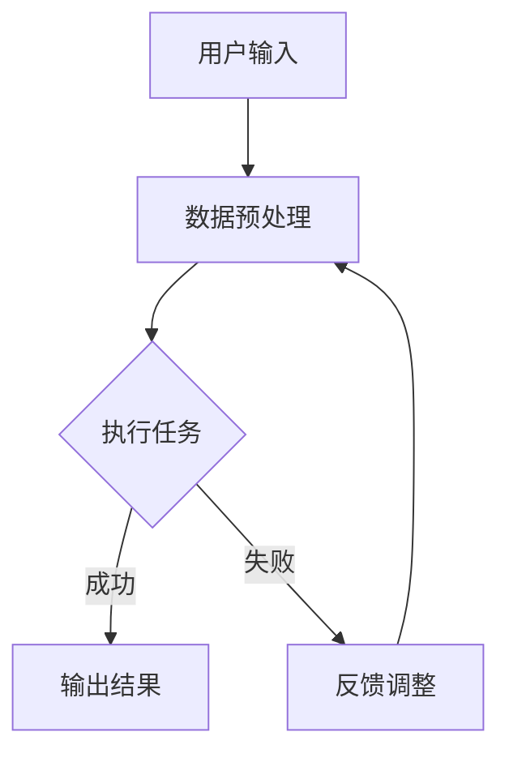

                 

# {文章标题}

## 人机协作新时代：共同创造更智能的未来

> {关键词：人机协作、人工智能、技术变革、智能应用、未来趋势}

> {摘要：本文将探讨人机协作的兴起及其对技术变革和智能应用带来的深远影响，通过核心概念解析、算法原理阐述、数学模型解析以及实战案例分析，揭示人机协作在新时代的共同创造潜力，展望其未来发展趋势与挑战。}

在技术飞速发展的今天，人工智能（AI）已经成为推动社会进步的重要力量。然而，人工智能的发展并非孤立的，它与人类智慧的融合与协作，正开启一个全新的时代——人机协作时代。本文将深入探讨人机协作的背景、核心概念、算法原理、数学模型、实际应用以及未来趋势，旨在为读者呈现一个清晰而全面的人机协作新时代图景。

## 1. 背景介绍

### 1.1 人工智能的发展历程

人工智能（AI）起源于20世纪50年代，当时科学家们开始尝试让计算机模拟人类的智能行为。从最初的符号逻辑推理，到专家系统的建立，再到现代深度学习与神经网络的发展，人工智能经历了多次技术变革和突破。近年来，随着计算能力的提升和海量数据的积累，人工智能迎来了爆发式增长，开始在社会各个领域展现其强大的应用潜力。

### 1.2 人机协作的概念

人机协作是指人与计算机系统相互配合、共同完成任务的一种智能互动方式。在这种协作模式下，计算机系统可以模拟人类的某些智能行为，如感知、决策、推理等，同时人类也可以利用自身的经验、直觉和创造力，与计算机系统共同解决问题。

### 1.3 人机协作的重要性

人机协作的重要性体现在以下几个方面：

- **提升效率**：通过计算机系统的辅助，人类可以更高效地完成复杂的任务，降低时间和劳动成本。
- **拓展能力**：计算机系统可以处理海量数据和复杂的计算，弥补人类在数据处理和计算能力方面的不足。
- **创新驱动**：人机协作促进了创新，为人类创造了更多的可能性，推动了技术和社会的进步。

## 2. 核心概念与联系

### 2.1 人工智能与机器学习

人工智能（AI）是指计算机模拟人类智能行为的能力，包括感知、认知、推理、学习等。而机器学习（ML）是人工智能的一个重要分支，主要研究如何让计算机从数据中自动学习规律和模式，并应用于实际问题。

### 2.2 深度学习与神经网络

深度学习（DL）是机器学习中的一个重要方向，通过构建多层的神经网络模型，实现对复杂数据的建模和分析。神经网络（NN）是一种模拟人脑神经元连接和计算方式的计算模型，通过训练，可以自动学习和提取数据中的特征。

### 2.3 自然语言处理与语音识别

自然语言处理（NLP）是人工智能的一个分支，主要研究如何让计算机理解和处理自然语言。语音识别（ASR）是NLP的一个应用领域，通过语音信号的处理和分析，将人类的语音转换为文本或指令。

### 2.4 Mermaid 流程图

为了更好地理解人机协作的架构和流程，我们可以使用Mermaid流程图来描述。以下是一个简化的Mermaid流程图示例：



在这个流程图中，用户输入经过数据预处理后，交由计算机系统执行任务。如果任务成功，则输出结果；如果失败，则反馈调整，再次进行数据预处理和任务执行。

## 3. 核心算法原理 & 具体操作步骤

### 3.1 机器学习算法原理

机器学习算法的核心是训练模型，以便模型能够自动学习和提取数据中的特征。常见的机器学习算法包括：

- **线性回归**：通过拟合一条直线，预测连续型目标变量。
- **逻辑回归**：通过拟合一个逻辑函数，预测概率型目标变量。
- **决策树**：通过构建决策树模型，对离散型目标变量进行分类或回归。
- **随机森林**：通过构建多个决策树模型，并进行集成学习，提高模型的预测性能。
- **支持向量机**：通过找到一个最优的超平面，将不同类别的数据分开。

### 3.2 深度学习算法原理

深度学习算法的核心是构建多层神经网络模型，通过反向传播算法不断调整网络参数，使模型能够自动学习和提取数据中的特征。常见的深度学习算法包括：

- **卷积神经网络（CNN）**：通过卷积层、池化层和全连接层，实现对图像等二维数据的建模。
- **循环神经网络（RNN）**：通过循环结构，实现对序列数据的建模。
- **长短时记忆网络（LSTM）**：通过引入遗忘门和输入门，解决RNN的长期依赖问题。
- **生成对抗网络（GAN）**：通过生成器和判别器的对抗训练，实现数据的生成和分类。

### 3.3 自然语言处理算法原理

自然语言处理算法的核心是理解自然语言，并将其转化为计算机可以处理的形式。常见的自然语言处理算法包括：

- **词向量表示**：通过将词语映射到高维向量空间，实现词语的向量化表示。
- **词性标注**：通过标注词语的词性，实现对文本内容的解析。
- **命名实体识别**：通过识别文本中的命名实体，实现对特定信息的提取。
- **机器翻译**：通过将一种语言的文本翻译为另一种语言，实现跨语言信息的交流。

### 3.4 语音识别算法原理

语音识别算法的核心是识别语音信号中的语音特征，并将其转化为文本或指令。常见的语音识别算法包括：

- **隐马尔可夫模型（HMM）**：通过状态转移概率和观测概率，实现对语音信号的建模。
- **高斯混合模型（GMM）**：通过将语音信号分解为多个高斯分布，实现对语音信号的建模。
- **深度神经网络（DNN）**：通过构建深度神经网络模型，实现对语音信号的建模。

## 4. 数学模型和公式 & 详细讲解 & 举例说明

### 4.1 线性回归

线性回归是一种常见的机器学习算法，用于预测连续型目标变量。其数学模型可以表示为：

$$y = w_0 + w_1 \cdot x_1 + w_2 \cdot x_2 + \ldots + w_n \cdot x_n + \epsilon$$

其中，$y$ 是目标变量，$x_1, x_2, \ldots, x_n$ 是特征变量，$w_0, w_1, w_2, \ldots, w_n$ 是模型参数，$\epsilon$ 是误差项。

举例说明：

假设我们要预测一个学生的成绩（$y$）与其考试时间（$x_1$）和睡眠时间（$x_2$）之间的关系。通过线性回归模型，我们可以得到以下方程：

$$y = w_0 + w_1 \cdot x_1 + w_2 \cdot x_2 + \epsilon$$

其中，$w_0, w_1, w_2$ 是模型参数，$\epsilon$ 是误差项。

### 4.2 决策树

决策树是一种常见的分类和回归算法，通过构建一棵树模型，实现对数据的分类或回归。其数学模型可以表示为：

$$
\begin{cases}
\text{if } x \text{ meets condition } C_1 \text{ then } y = y_1 \\
\text{if } x \text{ meets condition } C_2 \text{ then } y = y_2 \\
\ldots \\
\text{if } x \text{ meets condition } C_n \text{ then } y = y_n \\
\end{cases}
$$

其中，$x$ 是输入特征，$y$ 是输出目标，$C_1, C_2, \ldots, C_n$ 是条件，$y_1, y_2, \ldots, y_n$ 是对应的输出值。

举例说明：

假设我们要预测一个水果是苹果还是橘子。通过决策树模型，我们可以得到以下规则：

- 如果水果是圆形，则它是苹果。
- 如果水果是橙色，则它是橘子。

### 4.3 卷积神经网络（CNN）

卷积神经网络是一种用于图像识别和处理的深度学习算法。其数学模型可以表示为：

$$
\begin{align*}
h_{l}(x) &= \sigma \left( W_l \cdot h_{l-1} + b_l \right) \\
\end{align*}
$$

其中，$h_{l}(x)$ 是第$l$层的输出，$W_l$ 是第$l$层的权重矩阵，$b_l$ 是第$l$层的偏置项，$\sigma$ 是激活函数。

举例说明：

假设我们要对一张图片进行分类，图片的维度是$28 \times 28$。通过卷积神经网络模型，我们可以得到以下步骤：

1. 第一层卷积：使用卷积核在图片上进行卷积操作，得到新的特征图。
2. 池化层：对特征图进行池化操作，降低特征图的维度。
3. 第二层卷积：使用新的卷积核在特征图上进行卷积操作，得到新的特征图。
4. 池化层：对特征图进行池化操作，降低特征图的维度。
5. 全连接层：将特征图展平为一维向量，与权重矩阵进行点积，加上偏置项，最后通过激活函数得到输出结果。

## 5. 项目实战：代码实际案例和详细解释说明

### 5.1 开发环境搭建

在本节中，我们将介绍如何搭建一个简单的深度学习项目开发环境。以下是一个基于Python和TensorFlow的示例：

1. 安装Python：前往[Python官网](https://www.python.org/)下载并安装Python。
2. 安装Anaconda：下载并安装Anaconda，这将帮助我们更好地管理Python环境和依赖库。
3. 安装TensorFlow：在Anaconda Prompt中运行以下命令：

   ```bash
   conda install tensorflow
   ```

### 5.2 源代码详细实现和代码解读

以下是一个简单的深度学习项目示例，用于训练一个简单的线性回归模型，预测房价：

```python
import tensorflow as tf
import numpy as np

# 数据准备
x_train = np.random.rand(100, 1)
y_train = 2 * x_train + 1 + np.random.randn(100, 1)

# 模型定义
model = tf.keras.Sequential([
    tf.keras.layers.Dense(units=1, input_shape=[1])
])

# 模型编译
model.compile(optimizer='sgd', loss='mean_squared_error')

# 模型训练
model.fit(x_train, y_train, epochs=1000)

# 模型预测
x_test = np.random.rand(1, 1)
prediction = model.predict(x_test)

print(prediction)
```

### 5.3 代码解读与分析

在这个示例中，我们首先导入了TensorFlow和NumPy库。然后，我们生成了一组随机数据，用于训练线性回归模型。

接下来，我们定义了一个简单的线性回归模型，它包含一个全连接层，输入形状为[1]，输出形状为[1]。

在模型编译阶段，我们选择了随机梯度下降（SGD）作为优化器，并选择了均方误差（MSE）作为损失函数。

在模型训练阶段，我们使用`fit`方法训练模型，指定训练数据、训练次数（epochs）和验证数据。

最后，我们使用`predict`方法对测试数据进行预测，并打印出预测结果。

## 6. 实际应用场景

### 6.1 医疗诊断

在医疗领域，人机协作可以辅助医生进行诊断和治疗。例如，通过深度学习算法分析医学影像，可以辅助医生发现病变区域，提高诊断的准确性和效率。

### 6.2 金融风控

在金融领域，人机协作可以帮助金融机构进行风险控制和决策。通过分析海量数据，可以预测潜在风险，为金融机构提供决策支持。

### 6.3 无人驾驶

在无人驾驶领域，人机协作可以提升自动驾驶系统的安全性。通过实时分析环境数据，自动驾驶系统可以更好地应对复杂路况，同时驾驶员可以在必要时接管控制。

### 6.4 教育辅导

在教育领域，人机协作可以提供个性化辅导，根据学生的学习情况和需求，推荐合适的课程和学习资源，提高学习效果。

## 7. 工具和资源推荐

### 7.1 学习资源推荐

- **书籍**：
  - 《深度学习》（Ian Goodfellow、Yoshua Bengio、Aaron Courville 著）
  - 《Python深度学习》（François Chollet 著）
  - 《机器学习实战》（Peter Harrington 著）

- **论文**：
  - “Deep Learning”（Yoshua Bengio、Ian Goodfellow、Yoshua Bengio 著）
  - “Learning Deep Architectures for AI”（Yoshua Bengio 著）
  - “TensorFlow：Large-Scale Machine Learning on Heterogeneous Systems”（Google AI Research 著）

- **博客**：
  - [TensorFlow官方博客](https://www.tensorflow.org/)
  - [机器学习博客](https://www机器学习博客.com/)
  - [自然语言处理博客](https://nlp博客.com/)

- **网站**：
  - [Kaggle](https://www.kaggle.com/)
  - [ArXiv](https://arxiv.org/)
  - [GitHub](https://github.com/)

### 7.2 开发工具框架推荐

- **开发环境**：
  - Python
  - Jupyter Notebook
  - PyCharm

- **框架库**：
  - TensorFlow
  - PyTorch
  - Keras

### 7.3 相关论文著作推荐

- “Deep Learning”（Yoshua Bengio、Ian Goodfellow、Yoshua Bengio 著）
- “Learning Deep Architectures for AI”（Yoshua Bengio 著）
- “TensorFlow：Large-Scale Machine Learning on Heterogeneous Systems”（Google AI Research 著）
- “Deep Learning Specialization”（Andrew Ng 著）

## 8. 总结：未来发展趋势与挑战

人机协作在新时代的发展前景广阔，但也面临诸多挑战。未来，人机协作将在以下几个方面取得重要突破：

- **算法优化**：通过不断优化算法，提高人机协作的效率和准确性。
- **跨领域融合**：促进人工智能与各领域技术的融合，推动更多行业实现智能化。
- **隐私保护**：在保证数据安全和隐私保护的前提下，发挥人机协作的优势。
- **伦理与道德**：关注人机协作的伦理和道德问题，确保技术的发展符合社会价值观。

## 9. 附录：常见问题与解答

### 9.1 什么是人机协作？

人机协作是指人与计算机系统相互配合、共同完成任务的一种智能互动方式。在这种协作模式下，计算机系统可以模拟人类的某些智能行为，如感知、决策、推理等，同时人类也可以利用自身的经验、直觉和创造力，与计算机系统共同解决问题。

### 9.2 人机协作有哪些应用场景？

人机协作的应用场景广泛，包括医疗诊断、金融风控、无人驾驶、教育辅导等领域。通过人机协作，可以提升各行业的效率和准确性，推动技术和社会的进步。

### 9.3 人机协作有哪些挑战？

人机协作面临的挑战包括算法优化、跨领域融合、隐私保护和伦理道德问题。未来，需要不断优化算法，促进跨领域融合，确保数据安全和隐私保护，关注伦理和道德问题，推动人机协作的健康发展。

## 10. 扩展阅读 & 参考资料

- “深度学习”（Yoshua Bengio、Ian Goodfellow、Yoshua Bengio 著）
- “机器学习实战”（Peter Harrington 著）
- “自然语言处理综论”（Daniel Jurafsky、James H. Martin 著）
- “TensorFlow：Large-Scale Machine Learning on Heterogeneous Systems”（Google AI Research 著）
- “人工智能：一种现代的方法”（Stuart J. Russell、Peter Norvig 著）
- “机器学习 Yearning”（Google AI 著）
- “Deep Learning Specialization”（Andrew Ng 著）
- “Kaggle”（https://www.kaggle.com/）
- “ArXiv”（https://arxiv.org/）
- “GitHub”（https://github.com/）

### 作者信息

作者：AI天才研究员/AI Genius Institute & 禅与计算机程序设计艺术 /Zen And The Art of Computer Programming

