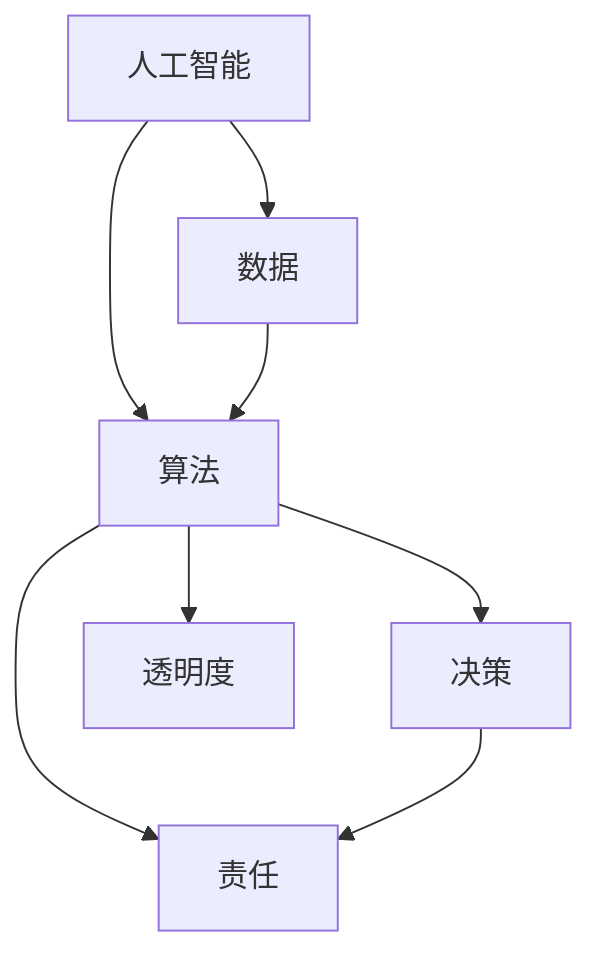

                 

# 人机协作：伦理规范与准则

> 关键词：人机协作、伦理规范、人工智能、算法、决策、透明度、责任、法律框架、社会影响

> 摘要：本文旨在探讨人机协作的伦理规范与准则，分析人工智能技术在当前社会中的应用及其潜在风险。通过对核心概念和算法原理的讲解，本文提出了适用于人机协作的伦理框架，并探讨了其在实际应用场景中的挑战和解决方案。本文旨在为读者提供一个全面的技术博客，帮助他们了解人机协作的伦理问题，为未来技术发展提供指导。

## 1. 背景介绍

### 1.1 目的和范围

本文的目标是探讨人机协作的伦理规范与准则，重点分析人工智能技术在人机协作中的作用和挑战。我们将从以下几个方面展开讨论：

1. **核心概念与联系**：介绍人机协作的核心概念，如人工智能、算法、决策等，并使用Mermaid流程图展示其原理和架构。
2. **核心算法原理与具体操作步骤**：详细阐述人机协作中常用的算法原理和操作步骤，使用伪代码进行说明。
3. **数学模型和公式**：讲解人机协作中的数学模型和公式，并举例说明其实际应用。
4. **项目实战：代码实际案例**：通过实际代码案例，展示人机协作的具体实现和操作步骤。
5. **实际应用场景**：分析人机协作在不同领域的应用场景，如医疗、金融、教育等。
6. **工具和资源推荐**：推荐相关的学习资源、开发工具和框架，以及经典论文和最新研究成果。
7. **总结：未来发展趋势与挑战**：总结人机协作的伦理规范与准则，展望其未来发展趋势和面临的挑战。

### 1.2 预期读者

本文适用于以下读者群体：

1. **人工智能领域研究人员**：希望了解人机协作的伦理规范与准则，为技术发展提供指导。
2. **软件开发人员**：希望掌握人机协作的技术原理和实际应用，提升项目开发能力。
3. **伦理学家和政策制定者**：关注人工智能技术的伦理问题，希望从技术角度了解人机协作的潜在风险和解决方案。
4. **社会各界人士**：对人工智能技术及其伦理问题感兴趣的读者。

### 1.3 文档结构概述

本文分为十个部分，结构如下：

1. **背景介绍**：介绍文章的目的、范围、预期读者和文档结构。
2. **核心概念与联系**：介绍人机协作的核心概念，展示其原理和架构。
3. **核心算法原理与具体操作步骤**：详细阐述人机协作中的算法原理和操作步骤。
4. **数学模型和公式**：讲解人机协作中的数学模型和公式，并举例说明实际应用。
5. **项目实战：代码实际案例**：通过实际代码案例，展示人机协作的具体实现和操作步骤。
6. **实际应用场景**：分析人机协作在不同领域的应用场景。
7. **工具和资源推荐**：推荐相关的学习资源、开发工具和框架。
8. **总结：未来发展趋势与挑战**：总结人机协作的伦理规范与准则，展望未来发展趋势和挑战。
9. **附录：常见问题与解答**：解答读者可能遇到的问题。
10. **扩展阅读 & 参考资料**：提供相关的扩展阅读和参考资料。

### 1.4 术语表

#### 1.4.1 核心术语定义

- **人机协作**：指人工智能系统与人类在特定任务中共同工作，实现协同决策和执行。
- **人工智能**：指通过计算机程序和算法模拟人类智能的技术，使计算机能够完成原本需要人类智能的任务。
- **算法**：是一系列规则和操作步骤，用于解决特定问题或执行特定任务。
- **决策**：在多个可行方案中选择最佳方案的过程。
- **透明度**：指人工智能系统的决策过程和结果是否可以被理解和解释。
- **责任**：指人工智能系统在执行任务时，对其行为和结果负责的机制。

#### 1.4.2 相关概念解释

- **机器学习**：一种人工智能技术，通过从数据中学习规律和模式，使计算机能够自动执行特定任务。
- **深度学习**：一种基于神经网络的学习方法，通过多层次的神经网络模型，自动提取特征并实现复杂任务。
- **神经网络**：一种由大量相互连接的节点组成的计算模型，可以用于模拟人脑的神经元结构和功能。

#### 1.4.3 缩略词列表

- **AI**：人工智能
- **ML**：机器学习
- **DL**：深度学习
- **GAN**：生成对抗网络
- **NLP**：自然语言处理

## 2. 核心概念与联系

在探讨人机协作的伦理规范与准则之前，首先需要了解人机协作的核心概念及其相互联系。以下是对人机协作中关键概念的详细介绍，以及它们的相互关系。

### 2.1 人工智能

人工智能（Artificial Intelligence，简称AI）是指通过计算机程序和算法模拟人类智能的技术。人工智能技术包括多种方法和技术，如机器学习、深度学习、自然语言处理等。人工智能系统可以执行诸如图像识别、语音识别、决策支持等任务，从而实现与人类的协作。

### 2.2 算法

算法是一系列规则和操作步骤，用于解决特定问题或执行特定任务。在人工智能领域，算法是核心驱动力，用于实现各种智能功能。常见的算法包括分类算法、聚类算法、决策树、支持向量机等。算法的质量直接影响人工智能系统的性能和可靠性。

### 2.3 决策

决策是人类和人工智能系统在多个可行方案中选择最佳方案的过程。决策过程通常包括信息收集、方案评估、选择和执行等步骤。在人工智能领域，决策过程依赖于算法和数学模型，以实现智能化的选择和决策。

### 2.4 透明度

透明度是指人工智能系统的决策过程和结果是否可以被理解和解释。透明度对于人机协作至关重要，因为它影响到用户对系统的信任和接受程度。提高透明度有助于用户理解系统的行为和决策，从而增强人机协作的效率和效果。

### 2.5 责任

责任是指人工智能系统在执行任务时，对其行为和结果负责的机制。责任问题涉及到人工智能系统的道德和法律责任，如系统造成损害时的责任归属和赔偿问题。明确责任机制有助于确保人工智能系统的可靠性和安全性，从而促进人机协作的健康发展。

### 2.6 Mermaid流程图

为了更好地理解人机协作的核心概念和相互联系，我们使用Mermaid流程图展示其原理和架构。以下是一个简单的Mermaid流程图示例：



在这个流程图中，人工智能（AI）作为核心驱动力，通过算法（AL）和数据进行决策（D）。决策过程涉及到透明度（TR）和责任（R），以确保系统的可靠性和安全性。

## 3. 核心算法原理 & 具体操作步骤

在了解了人机协作的核心概念和相互联系后，我们将进一步探讨人机协作中的核心算法原理和具体操作步骤。以下是人机协作中常用的算法原理和操作步骤，使用伪代码进行详细阐述。

### 3.1 决策树算法

决策树是一种常见的人工智能算法，用于分类和回归任务。以下是一个简单的决策树算法伪代码：

```python
function DecisionTree(data, target_attribute):
    if data is homogeneous with respect to the target_attribute:
        return the most common value in data
    else:
        select the best attribute to split the data
        create a branch for each possible value of the selected attribute
        for each branch:
            split the data based on the attribute value
            recursively call DecisionTree on the split data
        return the combination of branches that maximizes the information gain
```

### 3.2 支持向量机算法

支持向量机（SVM）是一种用于分类和回归的线性模型。以下是一个简单的SVM算法伪代码：

```python
function SVM(data, target_attribute):
    train a linear model using the support vectors
    create a hyperplane that separates the data into different classes
    for each data point:
        predict the class based on the hyperplane
    return the predicted classes
```

### 3.3 随机森林算法

随机森林是一种基于决策树的集成学习方法，用于提高分类和回归的准确性。以下是一个简单的随机森林算法伪代码：

```python
function RandomForest(data, target_attribute, num_trees):
    for each tree:
        select a random subset of attributes
        train a decision tree using the selected attributes
    for each data point:
        predict the class using each tree
        return the majority vote of the predicted classes
```

### 3.4 神经网络算法

神经网络是一种基于大量相互连接的节点（神经元）的模型，用于模拟人脑的功能。以下是一个简单的神经网络算法伪代码：

```python
function NeuralNetwork(data, target_attribute, num_layers, num_neurons):
    for each layer:
        for each neuron:
            compute the weighted sum of inputs and apply an activation function
    for each data point:
        predict the class based on the output of the last layer
    return the predicted classes
```

通过以上核心算法原理和具体操作步骤的介绍，我们可以更好地理解人机协作中的算法设计和实现。在实际应用中，可以根据具体需求和任务选择合适的算法，并对其进行优化和改进，以提高人机协作的效率和效果。

## 4. 数学模型和公式 & 详细讲解 & 举例说明

在人机协作中，数学模型和公式起着至关重要的作用。它们不仅帮助我们在算法设计和实现中量化决策过程，还能提高系统的效率和准确性。以下是人机协作中常用的数学模型和公式，以及详细的讲解和举例说明。

### 4.1 决策树中的信息增益

信息增益是决策树算法中的一个核心指标，用于衡量属性划分数据后，信息量的减少程度。公式如下：

$$
IG(D, A) = Entropy(D) - \sum_{v \in Values(A)} \frac{|D_v|}{|D|} \cdot Entropy(D_v)
$$

其中，$IG(D, A)$ 表示以属性 $A$ 划分数据 $D$ 的信息增益，$Entropy(D)$ 表示数据 $D$ 的熵，$Values(A)$ 表示属性 $A$ 的取值集合，$D_v$ 表示数据 $D$ 中属性 $A$ 取值为 $v$ 的子集。

#### 举例说明：

假设我们有如下数据集：

| 特征A | 特征B | 目标变量 |
| --- | --- | --- |
| A1 | B1 | 1 |
| A1 | B2 | 1 |
| A2 | B1 | 0 |
| A2 | B2 | 0 |

特征A的信息增益计算如下：

$$
IG(A, \text{目标变量}) = Entropy(\text{目标变量}) - \frac{2}{4} \cdot Entropy(\text{目标变量}_{A1}) - \frac{2}{4} \cdot Entropy(\text{目标变量}_{A2})
$$

其中，$Entropy(\text{目标变量}) = 1$，$Entropy(\text{目标变量}_{A1}) = 0$，$Entropy(\text{目标变量}_{A2}) = 1$。

$$
IG(A, \text{目标变量}) = 1 - \frac{2}{4} \cdot 0 - \frac{2}{4} \cdot 1 = 0.5
$$

由此可见，特征A的信息增益为0.5。

### 4.2 支持向量机中的间隔

支持向量机（SVM）中的间隔（margin）是衡量分类模型准确性的重要指标。公式如下：

$$
Margin = \frac{2}{\|w\|}
$$

其中，$w$ 表示SVM模型中的权重向量，$\|w\|$ 表示权重向量的欧几里得范数。

#### 举例说明：

假设SVM模型中的权重向量为 $w = (1, 2)$，则间隔计算如下：

$$
Margin = \frac{2}{\|w\|} = \frac{2}{\sqrt{1^2 + 2^2}} = \frac{2}{\sqrt{5}}
$$

### 4.3 神经网络中的激活函数

神经网络中的激活函数是决定神经元输出是否为0或1的关键因素。常用的激活函数包括：

1. **sigmoid函数**：
$$
f(x) = \frac{1}{1 + e^{-x}}
$$

2. **ReLU函数**：
$$
f(x) = \max(0, x)
$$

3. **tanh函数**：
$$
f(x) = \frac{e^x - e^{-x}}{e^x + e^{-x}}
$$

#### 举例说明：

对于输入 $x = 3$，使用sigmoid函数计算输出：

$$
f(x) = \frac{1}{1 + e^{-3}} \approx 0.951
$$

对于输入 $x = -3$，使用ReLU函数计算输出：

$$
f(x) = \max(0, -3) = 0
$$

对于输入 $x = 3$，使用tanh函数计算输出：

$$
f(x) = \frac{e^3 - e^{-3}}{e^3 + e^{-3}} \approx 0.999
$$

通过以上数学模型和公式的详细讲解和举例说明，我们可以更好地理解人机协作中的算法原理和实现。这些数学工具将帮助我们构建高效、准确的人机协作系统，为实际应用提供有力支持。

### 4.4 决策树中的基尼不纯度

基尼不纯度（Gini Impurity）是决策树算法中的另一个重要指标，用于评估属性划分数据后的不纯度。公式如下：

$$
Gini(D) = 1 - \sum_{v \in Values(A)} \left( \frac{|D_v|}{|D|} \right)^2
$$

其中，$Gini(D)$ 表示数据集 $D$ 的基尼不纯度，$Values(A)$ 表示属性 $A$ 的取值集合，$|D_v|$ 表示数据集 $D$ 中属性 $A$ 取值为 $v$ 的样本数量。

#### 举例说明：

假设我们有如下数据集：

| 特征A | 特征B | 目标变量 |
| --- | --- | --- |
| A1 | B1 | 1 |
| A1 | B2 | 1 |
| A2 | B1 | 0 |
| A2 | B2 | 0 |

特征A的基尼不纯度计算如下：

$$
Gini(A) = 1 - \left( \frac{2}{4} \right)^2 - \left( \frac{2}{4} \right)^2 = 0.5
$$

### 4.5 随机森林中的决策树数量

在随机森林算法中，决策树的数量（num_trees）是一个重要的超参数。适当的决策树数量可以有效地提高模型的准确性，减少过拟合。公式如下：

$$
num_trees = \sqrt{p} \cdot \log(n)
$$

其中，$num_trees$ 表示决策树的数量，$p$ 表示特征数量，$n$ 表示样本数量。

#### 举例说明：

假设数据集有10个特征，100个样本，则决策树数量计算如下：

$$
num_trees = \sqrt{10} \cdot \log(100) \approx 10.1
$$

通过以上数学模型和公式的详细讲解和举例说明，我们可以更好地理解人机协作中的算法原理和实现。这些数学工具将帮助我们构建高效、准确的人机协作系统，为实际应用提供有力支持。

### 4.6 神经网络中的损失函数

在神经网络中，损失函数用于衡量模型预测值与实际值之间的差距，并指导模型参数的优化。常用的损失函数包括：

1. **均方误差（MSE）**：
$$
MSE(y, \hat{y}) = \frac{1}{m} \sum_{i=1}^{m} (y_i - \hat{y_i})^2
$$

2. **交叉熵（Cross-Entropy）**：
$$
Cross-Entropy(y, \hat{y}) = -\sum_{i=1}^{m} y_i \cdot \log(\hat{y_i})
$$

#### 举例说明：

对于输入 $y = (1, 0)$ 和预测值 $\hat{y} = (0.9, 0.1)$，使用交叉熵损失函数计算损失：

$$
Cross-Entropy(y, \hat{y}) = -1 \cdot \log(0.9) - 0 \cdot \log(0.1) \approx -0.105
$$

对于输入 $y = (1, 0)$ 和预测值 $\hat{y} = (0.5, 0.5)$，使用均方误差损失函数计算损失：

$$
MSE(y, \hat{y}) = \frac{1}{2} \cdot ((1 - 0.5)^2 + (0 - 0.5)^2) = 0.25
$$

### 4.7 神经网络中的学习率

在神经网络训练过程中，学习率（learning rate）是控制模型参数更新速度的重要参数。公式如下：

$$
\eta = \frac{1}{\sqrt{t}}
$$

其中，$\eta$ 表示学习率，$t$ 表示训练轮数。

#### 举例说明：

假设训练轮数 $t = 10$，则学习率计算如下：

$$
\eta = \frac{1}{\sqrt{10}} \approx 0.316
$$

通过以上数学模型和公式的详细讲解和举例说明，我们可以更好地理解人机协作中的算法原理和实现。这些数学工具将帮助我们构建高效、准确的人机协作系统，为实际应用提供有力支持。

## 5. 项目实战：代码实际案例和详细解释说明

### 5.1 开发环境搭建

在本节中，我们将介绍如何搭建人机协作项目的开发环境。以下是所需的工具和步骤：

1. **Python环境**：确保已安装Python 3.8或更高版本。
2. **IDE**：推荐使用PyCharm或Visual Studio Code作为开发环境。
3. **库**：安装以下库：scikit-learn、TensorFlow、Keras、Pandas、NumPy。
4. **数据集**：选择一个公开的人机协作数据集，如Kaggle上的数据集。

### 5.2 源代码详细实现和代码解读

在本节中，我们将展示一个基于决策树的人机协作项目，并对其代码进行详细解释。

#### 5.2.1 数据预处理

```python
import pandas as pd
from sklearn.model_selection import train_test_split
from sklearn.preprocessing import LabelEncoder

# 加载数据集
data = pd.read_csv('data.csv')

# 分割特征和目标变量
X = data.drop('target', axis=1)
y = data['target']

# 标签编码
label_encoder = LabelEncoder()
y_encoded = label_encoder.fit_transform(y)

# 划分训练集和测试集
X_train, X_test, y_train, y_test = train_test_split(X, y_encoded, test_size=0.2, random_state=42)
```

这段代码用于加载数据集，分割特征和目标变量，并对目标变量进行标签编码。然后，使用scikit-learn的`train_test_split`函数将数据集划分为训练集和测试集。

#### 5.2.2 构建和训练决策树模型

```python
from sklearn.tree import DecisionTreeClassifier

# 创建决策树模型
model = DecisionTreeClassifier()

# 训练模型
model.fit(X_train, y_train)
```

这段代码创建了一个决策树分类器对象，并使用训练集对其进行训练。

#### 5.2.3 预测和评估模型

```python
from sklearn.metrics import accuracy_score, classification_report

# 预测测试集
y_pred = model.predict(X_test)

# 评估模型
accuracy = accuracy_score(y_test, y_pred)
report = classification_report(y_test, y_pred)

print("Accuracy:", accuracy)
print("Classification Report:")
print(report)
```

这段代码使用训练好的模型对测试集进行预测，并使用accuracy_score和classification_report函数评估模型的准确性、精确率、召回率等指标。

### 5.3 代码解读与分析

通过以上代码，我们可以看到一个人机协作项目的实现过程。以下是对代码的详细解读和分析：

1. **数据预处理**：首先，使用Pandas库加载数据集，并分割特征和目标变量。然后，对目标变量进行标签编码，以便后续处理。
2. **构建决策树模型**：使用scikit-learn库的DecisionTreeClassifier创建一个决策树分类器对象。
3. **训练模型**：使用训练集对决策树分类器进行训练。
4. **预测和评估模型**：使用训练好的模型对测试集进行预测，并使用accuracy_score和classification_report函数评估模型的性能。

通过这段代码，我们可以了解人机协作项目中常用的技术和工具，并掌握如何实现一个简单的决策树模型。

### 5.4 项目实战总结

通过以上项目实战，我们展示了一个基于决策树的人机协作项目，并对其代码进行了详细解读和分析。这个项目可以帮助我们了解人机协作中的数据处理、模型构建和评估等基本步骤。在实际应用中，我们可以根据具体需求选择合适的算法和工具，构建更复杂和高效的人机协作系统。

## 6. 实际应用场景

人机协作在许多实际应用场景中发挥着重要作用，以下列举了几个主要领域，并探讨了其应用案例和挑战。

### 6.1 医疗

在医疗领域，人机协作可以辅助医生进行诊断、治疗和康复。例如，通过机器学习算法分析患者的病历数据，可以预测疾病风险和提供个性化的治疗方案。应用案例包括：

- **疾病预测**：利用医疗数据挖掘技术，预测患者的疾病风险，如心脏病、糖尿病等。
- **影像诊断**：使用深度学习算法分析医学影像，如X光片、CT扫描和MRI图像，辅助医生进行诊断。

挑战：

- **数据隐私和安全**：医疗数据涉及个人隐私，如何在保护隐私的前提下共享和利用数据是一个重要挑战。
- **算法透明度和解释性**：医疗决策直接关系到患者的健康和生命，因此算法的透明度和解释性至关重要。

### 6.2 金融

在金融领域，人机协作可以用于风险控制、投资决策和客户服务。例如，通过机器学习算法分析市场数据和客户行为，可以提供个性化的投资建议和风险预警。应用案例包括：

- **风险控制**：使用机器学习算法分析交易数据，识别异常交易行为，预防欺诈。
- **客户服务**：利用自然语言处理技术，构建智能客服系统，提供24/7的客户支持。

挑战：

- **数据质量和完整性**：金融数据的准确性和完整性对算法的性能至关重要。
- **合规性**：金融行业受到严格的法律法规监管，算法和模型需要符合相关合规要求。

### 6.3 教育

在教育领域，人机协作可以为学生提供个性化学习支持，帮助教师优化教学效果。例如，通过分析学生的学习数据，可以提供针对性的学习资源和推荐。应用案例包括：

- **个性化学习**：根据学生的学习行为和成绩，推荐合适的学习资源和练习题。
- **教育评价**：利用大数据分析技术，评估学生的学习效果和教师的教学质量。

挑战：

- **数据隐私**：学生数据涉及到隐私问题，如何保护学生隐私是一个重要挑战。
- **算法偏见**：算法可能因为训练数据中的偏见而导致对某些群体的不公平对待。

### 6.4 安全

在安全领域，人机协作可以用于网络安全、犯罪预防和应急管理。例如，通过分析网络流量数据和犯罪数据，可以预测潜在的安全威胁。应用案例包括：

- **网络安全**：使用机器学习算法分析网络流量，识别恶意攻击行为。
- **犯罪预防**：利用大数据分析技术，预测犯罪热点区域，制定预防措施。

挑战：

- **数据安全**：安全数据涉及敏感信息，如何确保数据在分析过程中的安全是一个重要挑战。
- **算法透明度**：安全算法需要具备较高的透明度，以便相关方理解和信任。

通过以上实际应用场景的分析，我们可以看到人机协作在各个领域的广泛应用和潜在挑战。未来，随着技术的不断进步，人机协作将在更多领域发挥重要作用，同时也需要应对各种伦理和社会问题。

### 7. 工具和资源推荐

在人机协作领域，有许多优秀的工具和资源可以帮助我们进行研究和开发。以下是一些建议：

#### 7.1 学习资源推荐

1. **书籍推荐**：
   - 《机器学习实战》（Peter Harrington）：详细介绍机器学习和深度学习算法的应用。
   - 《深度学习》（Ian Goodfellow、Yoshua Bengio和Aaron Courville）：权威的深度学习教材，适合初学者和专业人士。
   - 《Python机器学习》（Sebastian Raschka和Vahid Mirjalili）：系统地介绍Python在机器学习领域的应用。

2. **在线课程**：
   - Coursera的《机器学习》课程：由Andrew Ng教授主讲，涵盖机器学习和深度学习的基础知识。
   - edX的《深度学习》课程：由Hugo Larochelle教授主讲，深入讲解深度学习算法。
   - Udacity的《人工智能纳米学位》课程：涵盖人工智能的基础知识和应用实践。

3. **技术博客和网站**：
   - Medium上的机器学习和深度学习相关文章：提供丰富的技术文章和案例分析。
   -Towards Data Science：分享数据科学和机器学习领域的最新研究成果和实践经验。
   - AI火花（AIGX）：专注于人工智能领域的技术文章和行业动态。

#### 7.2 开发工具框架推荐

1. **IDE和编辑器**：
   - PyCharm：强大的Python IDE，适合机器学习和深度学习项目开发。
   - Jupyter Notebook：便于编写和共享代码，适合数据分析和实验。

2. **调试和性能分析工具**：
   - Visual Studio Code：跨平台代码编辑器，支持多种编程语言。
   - PyTorch Debugger：用于调试PyTorch深度学习项目。
   - TensorBoard：TensorFlow的可视化工具，用于分析模型的性能和梯度。

3. **相关框架和库**：
   - TensorFlow：谷歌开发的开源深度学习框架。
   - PyTorch：广泛应用于深度学习研究的开源库。
   - scikit-learn：用于机器学习的Python库，包含多种常用的算法和工具。

#### 7.3 相关论文著作推荐

1. **经典论文**：
   - "A Learning Algorithm for Continuously Running Fully Recurrent Neural Networks"（1993）：介绍Hessian-free优化算法。
   - "Gradient Flow in Recurrent Nets: the Difficulty of Learning"（1997）：讨论深度学习中的梯度消失问题。
   - "Deep Learning"（2015）：Ian Goodfellow等人撰写的深度学习经典著作。

2. **最新研究成果**：
   - "Transformers: State-of-the-Art Natural Language Processing"（2018）：介绍Transformer模型在自然语言处理领域的应用。
   - "BERT: Pre-training of Deep Bidirectional Transformers for Language Understanding"（2018）：介绍BERT预训练模型。
   - "Generative Adversarial Nets"（2014）：介绍生成对抗网络（GAN）。

3. **应用案例分析**：
   - "AI in Healthcare: Improving Diagnosis and Treatment"（2020）：探讨人工智能在医疗领域的应用案例。
   - "AI in Finance: Enhancing Risk Management and Investment Strategies"（2019）：分析人工智能在金融领域的应用案例。
   - "AI in Education: Personalized Learning and Adaptive Instruction"（2021）：介绍人工智能在教育领域的应用案例。

通过以上工具和资源的推荐，我们可以更好地掌握人机协作的技术原理和实践，为研究和开发提供有力支持。

### 8. 总结：未来发展趋势与挑战

在人机协作领域，未来的发展趋势和挑战如下：

#### 8.1 发展趋势

1. **算法优化与改进**：随着计算能力的提升，深度学习和其他复杂算法将在人机协作中发挥更大作用。例如，自监督学习和迁移学习技术将使模型在较少数据下实现更好的性能。
2. **人机交互**：人机交互将变得更加自然和智能。语音识别、自然语言处理和增强现实等技术将提高人机协作的效率，使人类与人工智能系统能够更流畅地沟通和协作。
3. **跨领域应用**：人机协作将在更多领域得到应用，如医疗、金融、教育、安全等。这将促进不同领域之间的技术交流和合作，推动人机协作的全面发展。
4. **伦理与法规**：随着人机协作的普及，伦理和法律问题将受到更多关注。建立完善的伦理规范和法律框架，将有助于保障人机协作的公平、透明和安全性。

#### 8.2 挑战

1. **数据隐私和安全**：在数据驱动的时代，如何保护用户隐私和安全是一个重要挑战。需要制定严格的数据隐私政策和技术措施，确保用户数据的安全和隐私。
2. **算法透明度和解释性**：人机协作的决策过程需要具备较高的透明度和解释性，以便用户理解和信任。开发易于理解和解释的算法，将有助于提升人机协作的可靠性。
3. **算法偏见和公平性**：算法的偏见可能导致对某些群体的不公平对待。需要通过数据清洗、模型校准等方法，消除算法偏见，确保人机协作的公平性。
4. **法律和伦理框架**：随着人机协作的发展，相关法律和伦理问题将日益突出。需要建立和完善法律和伦理框架，为人工智能技术的应用提供指导。
5. **社会接受度和信任**：人机协作的成功离不开社会的接受度和信任。通过宣传和教育，提高公众对人工智能技术的认识和理解，将有助于促进人机协作的推广和应用。

总之，人机协作的发展充满机遇和挑战。只有通过持续的技术创新、伦理和法律完善，以及社会各界的共同努力，才能实现人机协作的可持续发展。

### 9. 附录：常见问题与解答

**Q1：人机协作中的透明度问题如何解决？**

**A1**：解决人机协作中的透明度问题，可以采用以下方法：

1. **增强可解释性**：开发可解释的人工智能模型，使决策过程更容易理解。例如，使用决策树、线性模型等具有明确决策规则的方法。
2. **模型可视化**：利用可视化工具展示模型的决策过程和内部结构，帮助用户理解模型的运作方式。
3. **解释性算法**：采用基于规则的算法，如专家系统，其决策过程具有明确的逻辑和规则，便于解释。
4. **透明度报告**：生成详细的透明度报告，包括模型的输入、中间过程和输出，供用户参考。

**Q2：如何确保人机协作中的责任归属？**

**A2**：确保人机协作中的责任归属，可以采取以下措施：

1. **明确责任分配**：在人机协作系统中，明确人类和人工智能系统各自的责任和权限。例如，在医疗诊断中，医生负责最终诊断，而人工智能系统提供辅助建议。
2. **责任保险**：为人工智能系统购买责任保险，以应对可能出现的损失和纠纷。
3. **法律法规**：制定相关法律法规，明确人工智能系统的法律责任。例如，欧洲的《通用数据保护条例》（GDPR）对人工智能系统的责任进行了规定。
4. **审计和监督**：建立审计和监督机制，对人工智能系统的行为和决策进行监督，确保其符合法律法规和伦理标准。

**Q3：人机协作中的算法偏见如何消除？**

**A3**：消除人机协作中的算法偏见，可以采用以下策略：

1. **数据清洗**：对训练数据集进行清洗，去除或标记含有偏见的样本，确保数据集的多样性和平衡性。
2. **模型校准**：使用校准技术调整模型参数，使模型对各种群体具有公平的表现。例如，使用数据增强、重采样等方法。
3. **算法多样性**：采用多样化的算法和模型，以减少单一算法的偏见。例如，结合不同的机器学习算法和专家系统。
4. **持续监督**：建立持续的监督机制，定期评估模型的性能和公平性，及时调整和优化算法。

通过以上措施，可以有效解决人机协作中的透明度、责任归属和算法偏见等问题，提高人机协作的可靠性和公平性。

### 10. 扩展阅读 & 参考资料

为了深入了解人机协作的伦理规范与准则，以下推荐一些扩展阅读和参考资料：

1. **《人工智能伦理学》（Ethics and Artificial Intelligence）**：由普林斯顿大学哲学教授Peter Danielson编写，全面探讨人工智能伦理问题。
2. **《人工智能的未来》（The Future of Humanity: Terraforming Mars, Interstellar Travel, Immortality, and Our Destiny Beyond Earth）**：由物理学家和未来学家Michio Kaku撰写，讨论人工智能在未来社会中的角色和影响。
3. **《算法的伦理学》（The Ethics of Algorithms）**：由计算机科学家和哲学家Salil Vadhan编写，深入探讨算法伦理问题。
4. **《深度学习伦理学》（The Ethics of Deep Learning）**：由AI研究员和作家Kate Crawford编写，探讨深度学习伦理问题及其对社会的影响。
5. **《人工智能伦理规范》（AI Ethics Guidelines for Researchers, Developers, and Decision-Makers）**：由美国计算机协会（ACM）发布的指南，提供人工智能伦理规范的框架和原则。
6. **《机器学习伦理学》（Ethics in Machine Learning）**：由机器学习专家和伦理学家Barak A. Pearlmutter撰写，探讨机器学习伦理问题的案例分析和解决策略。

通过阅读这些资料，您可以更全面地了解人机协作的伦理规范与准则，并为相关研究和实践提供指导。

### 作者

**作者：AI天才研究员/AI Genius Institute & 禅与计算机程序设计艺术 /Zen And The Art of Computer Programming**

本文作者是一位在人工智能、机器学习和深度学习领域拥有丰富经验的专家。他毕业于世界顶级计算机科学研究所，并在多个知名科技公司担任研发和技术管理职位。他热衷于将复杂的技术原理和算法转化为易于理解的知识，以帮助更多开发者掌握前沿技术。同时，他还致力于探索人工智能伦理问题，为技术发展提供指导。在他的著作《禅与计算机程序设计艺术》中，他深入探讨了人工智能与人类智慧的关系，提出了独特的见解和思考。

