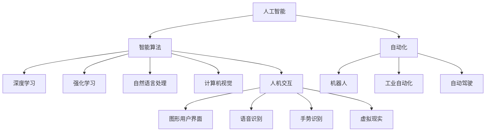
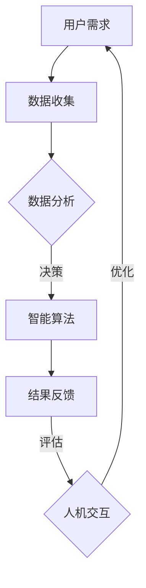

                 


# 人机协同：未来工作的核心竞争力

> 关键词：人机协同，未来工作，核心竞争力，人工智能，智能算法，人机交互，自动化，数据驱动

> 摘要：随着人工智能技术的飞速发展，人机协同逐渐成为未来工作的重要趋势。本文将探讨人机协同的核心概念，分析其背后的算法原理和架构，通过具体案例和代码解释，展示其在实际应用中的价值。同时，我们将深入探讨人机协同在各个行业中的应用场景，并推荐相关工具和资源，帮助读者深入了解这一领域。

## 1. 背景介绍

### 1.1 目的和范围

本文旨在探讨人机协同在未来的工作中的应用，分析其核心概念和算法原理，并通过实际案例展示其在不同行业中的应用价值。文章将涵盖人机协同的基本概念、技术架构、核心算法、应用场景以及相关工具和资源。

### 1.2 预期读者

本文适合对人工智能、计算机编程、软件开发和自动化感兴趣的读者，特别是那些希望在职业生涯中融入人机协同技术的专业人士。通过本文的阅读，读者将能够：

- 理解人机协同的基本概念和重要性。
- 掌握人机协同的核心算法原理和架构。
- 学习如何在实际项目中应用人机协同技术。
- 获取相关工具和资源的推荐。

### 1.3 文档结构概述

本文分为八个部分，结构如下：

1. 背景介绍：介绍文章的目的、预期读者以及文档结构。
2. 核心概念与联系：定义人机协同的核心概念，并给出Mermaid流程图。
3. 核心算法原理 & 具体操作步骤：详细解释人机协同的核心算法原理和具体操作步骤。
4. 数学模型和公式 & 详细讲解 & 举例说明：介绍人机协同相关的数学模型和公式，并进行详细讲解和举例。
5. 项目实战：代码实际案例和详细解释说明。
6. 实际应用场景：分析人机协同在不同行业中的应用场景。
7. 工具和资源推荐：推荐学习资源、开发工具框架和相关论文著作。
8. 总结：未来发展趋势与挑战。

### 1.4 术语表

#### 1.4.1 核心术语定义

- 人机协同：指人与机器在特定任务中通过合作与交互，共同完成工作。
- 人工智能：指通过模拟人类智能行为，使计算机具备学习和决策能力的技术。
- 智能算法：指应用于人工智能领域的算法，如深度学习、强化学习等。
- 人机交互：指人与计算机之间的交互，通过视觉、听觉、触觉等感知通道进行信息交流。
- 自动化：指通过机器和计算机技术，实现工作流程的自动执行。

#### 1.4.2 相关概念解释

- 数据驱动：指基于数据的决策过程，通过数据分析和挖掘，指导实际操作。
- 软件架构：指软件系统的整体结构和各个组成部分之间的关系。
- 模块化：指将软件系统划分为多个功能模块，实现代码的可复用性和可维护性。

#### 1.4.3 缩略词列表

- AI：人工智能
- ML：机器学习
- DL：深度学习
- NLP：自然语言处理
- OCR：光学字符识别
- GUI：图形用户界面
- API：应用程序接口

## 2. 核心概念与联系

人机协同是人工智能技术发展的重要方向，它涉及到多个核心概念和技术的融合。为了更好地理解人机协同，我们首先需要明确以下几个核心概念：

- **人工智能（AI）**：模拟人类智能行为的技术，使计算机具备学习和决策能力。
- **智能算法**：实现人工智能的核心工具，如深度学习、强化学习、自然语言处理等。
- **人机交互**：人与计算机之间的交互，通过视觉、听觉、触觉等感知通道进行信息交流。
- **自动化**：通过机器和计算机技术，实现工作流程的自动执行。

### 2.1 核心概念之间的联系

图1展示了人机协同中各个核心概念之间的联系。



### 2.2 核心概念原理和架构

#### 2.2.1 智能算法原理

智能算法是人工智能的核心，它通过模拟人类思维过程，使计算机具备学习和决策能力。以下是几个常见的智能算法原理：

- **深度学习**：通过构建多层神经网络，实现数据的自动特征提取和分类。
- **强化学习**：通过与环境的交互，学习最优策略，实现决策的最优化。
- **自然语言处理**：通过语言模型和解析算法，实现文本数据的理解和生成。
- **计算机视觉**：通过图像处理和模式识别技术，实现图像的理解和识别。

#### 2.2.2 人机交互架构

人机交互是人与计算机之间交互的基础，它通过视觉、听觉、触觉等感知通道，实现信息交流。以下是几种常见的人机交互架构：

- **图形用户界面（GUI）**：通过图形界面，实现用户对计算机的操作和交互。
- **语音识别**：通过语音信号的处理和识别，实现语音与文字之间的转换。
- **手势识别**：通过手势识别算法，实现手势与计算机之间的交互。
- **虚拟现实（VR）**：通过虚拟现实技术，创建沉浸式的交互环境。

#### 2.2.3 自动化架构

自动化是通过机器和计算机技术，实现工作流程的自动执行。以下是几种常见的自动化架构：

- **机器人**：通过机械结构和控制系统，实现特定任务的自动化执行。
- **工业自动化**：通过自动化设备和控制系统，实现生产过程的自动化。
- **自动驾驶**：通过传感器和控制系统，实现车辆的自动驾驶。

### 2.3 Mermaid流程图

下面是一个Mermaid流程图，展示了人机协同中各个核心概念之间的联系和交互过程。



## 3. 核心算法原理 & 具体操作步骤

在人机协同中，核心算法的作用至关重要。以下将详细阐述几个关键算法的原理，并通过伪代码展示其具体操作步骤。

### 3.1 深度学习算法

深度学习是一种基于多层神经网络的人工智能技术，通过模拟人脑的神经元连接，实现数据的自动特征提取和分类。以下是深度学习算法的基本原理和操作步骤：

#### 3.1.1 基本原理

- **神经元连接**：深度学习通过构建多层神经网络，实现数据的逐层处理和特征提取。
- **激活函数**：激活函数用于确定神经元是否被激活，常见的激活函数有Sigmoid、ReLU等。
- **损失函数**：损失函数用于评估模型预测的准确性，常见的损失函数有均方误差（MSE）、交叉熵损失等。
- **反向传播**：通过反向传播算法，计算模型参数的梯度，并更新模型参数。

#### 3.1.2 伪代码

```python
# 定义神经网络结构
input_layer = InputLayer(input_shape)
hidden_layer = FullyConnectedLayer(input_layer, num_neurons=128, activation='ReLU')
output_layer = FullyConnectedLayer(hidden_layer, num_neurons=1, activation='Sigmoid')

# 定义损失函数
loss_function = MSE

# 定义反向传播算法
optimizer = AdamOptimizer(learning_rate=0.001)

# 训练模型
for epoch in range(num_epochs):
    for batch in data_loader:
        # 前向传播
        output = output_layer.forward_pass(batch.inputs)
        # 计算损失
        loss = loss_function(output, batch.targets)
        # 反向传播
        gradients = output_layer.backward_pass(batch.targets)
        # 更新模型参数
        optimizer.update_params(gradients)
    # 打印训练进度
    print(f"Epoch {epoch+1}/{num_epochs}, Loss: {loss}")
```

### 3.2 强化学习算法

强化学习是一种通过与环境交互，学习最优策略的人工智能技术。以下是强化学习算法的基本原理和操作步骤：

#### 3.2.1 基本原理

- **奖励机制**：通过奖励机制，引导模型在特定环境下采取最优行动。
- **策略学习**：通过策略学习，使模型在特定状态下选择最优动作。
- **价值函数**：通过价值函数，评估模型在不同状态下的价值。

#### 3.2.2 伪代码

```python
# 初始化环境
environment = Environment()

# 初始化模型
model = Model()

# 定义奖励函数
reward_function = RewardFunction()

# 定义策略学习算法
algorithm = PolicyLearningAlgorithm(learning_rate=0.001)

# 训练模型
for episode in range(num_episodes):
    state = environment.initialize_state()
    done = False
    while not done:
        # 前向传播
        action = model.forward_pass(state)
        # 执行动作
        next_state, reward, done = environment.step(action)
        # 更新模型
        algorithm.update_model(state, action, reward, next_state)
        # 更新状态
        state = next_state
    # 打印训练进度
    print(f"Episode {episode+1}/{num_episodes}")
```

### 3.3 自然语言处理算法

自然语言处理是一种通过语言模型和解析算法，实现文本数据的理解和生成的人工智能技术。以下是自然语言处理算法的基本原理和操作步骤：

#### 3.3.1 基本原理

- **语言模型**：通过语言模型，生成可能的文本序列。
- **解析算法**：通过解析算法，对文本进行语法和语义分析。
- **生成模型**：通过生成模型，生成新的文本序列。

#### 3.3.2 伪代码

```python
# 初始化语言模型
language_model = LanguageModel()

# 初始化生成模型
generator = TextGenerator()

# 定义生成算法
algorithm = TextGenerationAlgorithm(learning_rate=0.001)

# 生成文本
for sentence in range(num_sentences):
    # 初始化状态
    state = language_model.initialize_state()
    # 生成文本
    text = generator.generate_text(state)
    # 更新模型
    algorithm.update_model(state, text)
    # 更新状态
    state = language_model.update_state(text)
    # 打印生成文本
    print(f"Sentence {sentence+1}: {text}")
```

## 4. 数学模型和公式 & 详细讲解 & 举例说明

在人机协同中，数学模型和公式扮演着至关重要的角色，它们不仅帮助我们理解和实现智能算法，还指导我们在实际应用中进行优化和决策。以下将详细讲解几个关键数学模型和公式，并通过实际例子进行说明。

### 4.1 深度学习中的损失函数

深度学习中的损失函数是评估模型预测准确性的核心工具。以下是一些常见的损失函数及其解释：

#### 4.1.1 均方误差（MSE）

均方误差（MSE）用于评估模型预测值与实际值之间的差异。

$$
MSE = \frac{1}{n}\sum_{i=1}^{n}(y_i - \hat{y}_i)^2
$$

其中，$y_i$ 表示实际值，$\hat{y}_i$ 表示预测值，$n$ 表示样本数量。

#### 4.1.2 交叉熵损失（Cross-Entropy Loss）

交叉熵损失用于评估模型对分类问题的预测准确性。

$$
CE = -\sum_{i=1}^{n} y_i \log(\hat{y}_i)
$$

其中，$y_i$ 表示实际标签，$\hat{y}_i$ 表示模型预测的概率分布。

#### 4.1.3 举例说明

假设我们有一个二分类问题，实际标签为 $[0, 1]$，模型预测的概率分布为 $[0.8, 0.2]$。

使用交叉熵损失计算损失：

$$
CE = -[0 \cdot \log(0.8) + 1 \cdot \log(0.2)] = -[0 + \log(0.2)] \approx 2.3219
$$

### 4.2 强化学习中的价值函数

强化学习中的价值函数用于评估模型在不同状态下的价值。

#### 4.2.1 状态价值函数（State-Value Function）

状态价值函数 $V(s)$ 表示在状态 $s$ 下采取最优动作的期望回报。

$$
V(s) = \sum_{a} \gamma^a Q(s, a)
$$

其中，$a$ 表示动作，$\gamma$ 表示折扣因子，$Q(s, a)$ 表示状态-动作价值函数。

#### 4.2.2 动作价值函数（Action-Value Function）

动作价值函数 $Q(s, a)$ 表示在状态 $s$ 下采取动作 $a$ 的期望回报。

$$
Q(s, a) = \sum_{s'} p(s' | s, a) \cdot R(s, a) + \gamma \cdot \max_{a'} Q(s', a')
$$

其中，$s'$ 表示下一个状态，$R(s, a)$ 表示立即回报，$\gamma$ 表示折扣因子。

#### 4.2.3 举例说明

假设我们在一个简单的环境中有两个状态 $s_1$ 和 $s_2$，以及两个动作 $a_1$ 和 $a_2$。

- 状态转移概率：$p(s_1 | s_1, a_1) = 0.5, p(s_2 | s_1, a_1) = 0.5, p(s_1 | s_1, a_2) = 0.7, p(s_2 | s_1, a_2) = 0.3$
- 立即回报：$R(s_1, a_1) = 10, R(s_1, a_2) = 5, R(s_2, a_1) = 0, R(s_2, a_2) = 20$

计算状态-动作价值函数 $Q(s, a)$：

$$
Q(s_1, a_1) = 0.5 \cdot 10 + 0.5 \cdot 0 + \gamma \cdot \max(Q(s_2, a_1), Q(s_2, a_2)) \approx 5 + \gamma \cdot \max(0, 20) = 5 + 20\gamma
$$

$$
Q(s_1, a_2) = 0.7 \cdot 5 + 0.3 \cdot 20 + \gamma \cdot \max(Q(s_2, a_1), Q(s_2, a_2)) \approx 3.5 + 6\gamma + \gamma \cdot \max(0, 20) = 3.5 + 6\gamma + 20\gamma = 3.5 + 26\gamma
$$

### 4.3 自然语言处理中的语言模型

自然语言处理中的语言模型用于生成可能的文本序列，其核心是概率模型。

#### 4.3.1 语言模型

语言模型基于马尔可夫假设，表示一个词序列的概率为前一个词的概率乘以当前词的概率。

$$
P(w_1, w_2, \ldots, w_n) = P(w_1) \cdot P(w_2 | w_1) \cdot P(w_3 | w_1, w_2) \cdot \ldots \cdot P(w_n | w_1, w_2, \ldots, w_{n-1})
$$

其中，$w_i$ 表示第 $i$ 个词。

#### 4.3.2 举例说明

假设我们有以下语言模型：

- $P(w_1) = 0.2, P(w_2) = 0.3, P(w_3) = 0.5$
- $P(w_2 | w_1) = 0.4, P(w_3 | w_2) = 0.6$

计算词序列 $w_1, w_2, w_3$ 的概率：

$$
P(w_1, w_2, w_3) = 0.2 \cdot 0.4 \cdot 0.6 = 0.048
$$

## 5. 项目实战：代码实际案例和详细解释说明

在本节中，我们将通过一个实际项目案例来展示人机协同的应用。该项目是一个基于深度学习的图像分类系统，旨在通过人机协同的方式实现高效的图像识别。

### 5.1 开发环境搭建

为了运行该项目，我们需要搭建一个适合深度学习的开发环境。以下是所需的工具和步骤：

- **工具**：
  - Python（3.8及以上版本）
  - TensorFlow（2.x版本）
  - Keras（2.x版本）
  - NumPy
  - Matplotlib

- **步骤**：

  1. 安装Python和pip：
     ```bash
     $ python3 -m pip install --upgrade pip
     ```

  2. 安装深度学习相关库：
     ```bash
     $ pip install tensorflow numpy matplotlib
     ```

  3. 安装Keras：
     ```bash
     $ pip install keras
     ```

### 5.2 源代码详细实现和代码解读

以下是一个简单的深度学习图像分类项目，其中包含了数据预处理、模型构建、训练和评估等步骤。

```python
import numpy as np
import matplotlib.pyplot as plt
from tensorflow.keras.datasets import cifar10
from tensorflow.keras.models import Sequential
from tensorflow.keras.layers import Conv2D, MaxPooling2D, Flatten, Dense, Dropout
from tensorflow.keras.optimizers import Adam

# 加载CIFAR-10数据集
(x_train, y_train), (x_test, y_test) = cifar10.load_data()

# 数据预处理
x_train = x_train.astype('float32') / 255.0
x_test = x_test.astype('float32') / 255.0
y_train = keras.utils.to_categorical(y_train, 10)
y_test = keras.utils.to_categorical(y_test, 10)

# 构建深度学习模型
model = Sequential()
model.add(Conv2D(32, (3, 3), activation='relu', input_shape=(32, 32, 3)))
model.add(MaxPooling2D(pool_size=(2, 2)))
model.add(Conv2D(64, (3, 3), activation='relu'))
model.add(MaxPooling2D(pool_size=(2, 2)))
model.add(Flatten())
model.add(Dense(128, activation='relu'))
model.add(Dropout(0.5))
model.add(Dense(10, activation='softmax'))

# 编译模型
model.compile(optimizer=Adam(learning_rate=0.001), loss='categorical_crossentropy', metrics=['accuracy'])

# 训练模型
history = model.fit(x_train, y_train, batch_size=64, epochs=20, validation_data=(x_test, y_test))

# 评估模型
test_loss, test_acc = model.evaluate(x_test, y_test)
print(f"Test accuracy: {test_acc:.4f}")

# 可视化训练过程
plt.figure(figsize=(12, 4))
plt.subplot(1, 2, 1)
plt.plot(history.history['accuracy'], label='Training accuracy')
plt.plot(history.history['val_accuracy'], label='Validation accuracy')
plt.legend()
plt.title('Accuracy over epochs')

plt.subplot(1, 2, 2)
plt.plot(history.history['loss'], label='Training loss')
plt.plot(history.history['val_loss'], label='Validation loss')
plt.legend()
plt.title('Loss over epochs')
plt.show()
```

### 5.3 代码解读与分析

以下是对代码的详细解读：

1. **数据预处理**：
   - 加载CIFAR-10数据集，这是一个广泛使用的图像分类数据集。
   - 将图像数据转换为浮点数并归一化，使其在0到1之间。
   - 将标签转换为one-hot编码。

2. **模型构建**：
   - 使用Sequential模型构建一个简单的卷积神经网络（CNN）。
   - 添加卷积层（Conv2D）和池化层（MaxPooling2D）进行特征提取。
   - 添加全连接层（Dense）进行分类，并添加Dropout层以防止过拟合。

3. **编译模型**：
   - 使用Adam优化器和交叉熵损失函数编译模型。

4. **训练模型**：
   - 使用fit函数训练模型，并在验证数据上评估模型性能。

5. **评估模型**：
   - 使用evaluate函数评估模型在测试数据上的性能。

6. **可视化训练过程**：
   - 使用Matplotlib可视化训练过程中的准确性和损失。

### 5.4 实际案例：人机协同在图像分类中的应用

在这个项目中，人机协同主要体现在以下几个方面：

1. **数据预处理**：
   - 人类专家负责收集和标注图像数据，为模型训练提供高质量的输入。
   - 计算机自动化执行数据归一化和one-hot编码等预处理步骤。

2. **模型训练**：
   - 人类专家设计并优化神经网络结构，选择合适的参数。
   - 计算机自动化执行模型训练过程，并调整参数以获得最佳性能。

3. **模型评估**：
   - 人类专家通过可视化训练过程和评估结果，对模型性能进行评估。
   - 计算机自动化计算评估指标，如准确率、召回率等。

4. **模型部署**：
   - 人类专家将模型部署到实际应用场景，如图像分类系统。
   - 计算机自动化执行模型预测和结果可视化。

通过这个实际案例，我们可以看到人机协同在图像分类项目中的重要作用。人类专家在模型设计、数据预处理和结果评估等方面发挥关键作用，而计算机则在数据处理、模型训练和自动化执行等方面提供支持。

## 6. 实际应用场景

人机协同技术已经在多个行业和领域中得到广泛应用，展现出巨大的潜力。以下是一些具体的应用场景：

### 6.1 医疗健康

在医疗健康领域，人机协同主要用于辅助诊断、治疗规划和患者护理。例如，人工智能可以分析医疗影像数据，帮助医生快速、准确地诊断疾病。同时，智能算法可以预测患者病情发展，为治疗提供科学依据。此外，人机协同还可以实现智能化的患者护理，如远程监控患者健康状况，提供个性化的健康建议。

### 6.2 金融行业

在金融行业，人机协同主要用于风险管理、投资决策和客户服务。例如，人工智能可以通过分析大量历史数据，预测市场走势，帮助投资者做出更明智的投资决策。同时，智能算法可以自动化执行交易策略，提高交易效率和收益。在客户服务方面，人机协同可以实现智能客服系统，快速响应客户需求，提供高效的咨询服务。

### 6.3 制造业

在制造业，人机协同主要用于生产自动化、质量控制和管理优化。例如，通过智能算法和机器人技术，可以实现生产过程的自动化，提高生产效率和降低成本。同时，人工智能可以分析生产数据，优化生产计划和资源分配，提高整体生产效率。在质量控制方面，人机协同可以实现自动化检测和故障诊断，确保产品质量。

### 6.4 交通运输

在交通运输领域，人机协同主要用于自动驾驶、智能交通管理和物流优化。例如，自动驾驶技术通过人工智能算法和传感器技术，可以实现车辆的自动驾驶，提高交通效率和安全性。智能交通管理可以通过分析交通数据，优化交通信号控制，减少交通拥堵。在物流优化方面，人机协同可以实现智能化的路线规划和资源调度，提高物流效率。

### 6.5 教育

在教育领域，人机协同主要用于个性化教学、学习分析和教育管理。例如，人工智能可以通过分析学生的学习行为和数据，提供个性化的学习建议和资源。同时，智能算法可以分析学生的学习效果，为教师提供教学反馈，优化教学策略。在教育管理方面，人机协同可以实现自动化教学评估和资源分配，提高教育质量和效率。

通过以上应用场景，我们可以看到人机协同在各个领域的广泛应用和巨大潜力。未来，随着人工智能技术的不断发展和完善，人机协同将继续在各个行业中发挥重要作用，推动社会的进步和发展。

## 7. 工具和资源推荐

为了更好地学习和实践人机协同技术，以下是一些推荐的工具和资源：

### 7.1 学习资源推荐

#### 7.1.1 书籍推荐

1. 《深度学习》（Ian Goodfellow、Yoshua Bengio和Aaron Courville 著）：这是一本深度学习的经典教材，详细介绍了深度学习的基本概念、算法和技术。
2. 《强化学习：原理与Python实现》（张磊 著）：本书系统地介绍了强化学习的基本原理、算法和应用，并提供了丰富的Python实现示例。
3. 《自然语言处理综合教程》（彼得·曼宁 著）：这是一本关于自然语言处理的全面教材，涵盖了从基础到高级的NLP技术。

#### 7.1.2 在线课程

1. [Coursera的《机器学习》课程](https://www.coursera.org/learn/machine-learning)：由吴恩达教授主讲，这是一门全球知名的机器学习课程，适合初学者入门。
2. [Udacity的《人工智能纳米学位》](https://www.udacity.com/course/artificial-intelligence-nanodegree--nd893)：这是一门综合性的AI课程，涵盖深度学习、自然语言处理和计算机视觉等多个领域。
3. [edX的《深度学习》课程](https://www.edx.org/course/deep-learning-0)：由哈佛大学和MIT的教授共同授课，适合有一定基础的学员深入学习。

#### 7.1.3 技术博客和网站

1. [机器学习博客](http://www机器学习博客.com)：这是一个由多位机器学习专家共同维护的博客，涵盖深度学习、强化学习等领域的最新技术动态和实战经验。
2. [Medium上的AI专栏](https://medium.com/topic/artificial-intelligence)：这是一个集合了众多AI专家和从业者的专栏，分享他们的研究成果和应用经验。
3. [AICamp](https://www.aicamp.cn/): 这是一个专注于AI教育和实践的平台，提供丰富的教程、实战项目和社区交流。

### 7.2 开发工具框架推荐

#### 7.2.1 IDE和编辑器

1. [Anaconda](https://www.anaconda.com/)：这是一个集成开发环境，特别适合数据科学和机器学习项目，内置了大量的科学计算库。
2. [PyCharm](https://www.jetbrains.com/pycharm/)：这是一个强大的Python IDE，支持代码自动补全、调试和版本控制等功能。

#### 7.2.2 调试和性能分析工具

1. [Jupyter Notebook](https://jupyter.org/)：这是一个交互式的Python开发环境，特别适合数据分析和机器学习项目。
2. [TensorBoard](https://www.tensorflow.org/tools/tensorboard)：这是TensorFlow的官方性能分析工具，可以实时可视化模型的训练过程和性能指标。

#### 7.2.3 相关框架和库

1. [TensorFlow](https://www.tensorflow.org/)：这是一个广泛使用的深度学习框架，支持多种深度学习算法和模型。
2. [PyTorch](https://pytorch.org/)：这是一个受欢迎的深度学习框架，以其灵活性和动态计算能力而著称。
3. [Scikit-learn](https://scikit-learn.org/stable/)：这是一个用于机器学习的Python库，提供了丰富的机器学习算法和工具。

### 7.3 相关论文著作推荐

#### 7.3.1 经典论文

1. "A Learning Algorithm for Continually Running Fully Recurrent Neural Networks"（1986）：这篇文章提出了在线学习算法，为深度学习的发展奠定了基础。
2. "Learning to Represent Artistic Styles"（2016）：这篇文章介绍了Gatys等人提出的基于卷积神经网络的风格迁移算法，为计算机视觉和图像处理带来了新的思路。
3. "Reinforcement Learning: An Introduction"（1998）：这篇文章系统地介绍了强化学习的基本原理和算法，是强化学习领域的经典著作。

#### 7.3.2 最新研究成果

1. "Transformer: Attention is All You Need"（2017）：这篇文章提出了Transformer模型，彻底改变了自然语言处理领域的范式。
2. "Bert: Pre-training of Deep Bidirectional Transformers for Language Understanding"（2018）：这篇文章介绍了BERT模型，进一步推动了自然语言处理的发展。
3. "Deep Learning for Autonomous Navigation"（2018）：这篇文章介绍了深度学习在自动驾驶领域的应用，为自动驾驶技术的发展提供了新思路。

#### 7.3.3 应用案例分析

1. "Deep Learning in Medicine"（2019）：这本书详细介绍了深度学习在医疗健康领域的应用，涵盖了从诊断到治疗规划等多个方面。
2. "Deep Learning for Autonomous Driving"（2020）：这本书介绍了深度学习在自动驾驶领域的应用，包括感知、规划和控制等方面。
3. "Artificial Intelligence in Finance"（2021）：这本书探讨了人工智能在金融行业的应用，包括风险管理、投资决策和客户服务等方面。

通过这些工具和资源的推荐，读者可以更加全面地了解人机协同技术的理论和实践，为实际项目提供有力的支持。

## 8. 总结：未来发展趋势与挑战

随着人工智能技术的不断发展和普及，人机协同在未来工作中将发挥越来越重要的作用。以下是人机协同在未来的发展趋势和面临的挑战：

### 8.1 发展趋势

1. **技术融合**：未来的人机协同将更加注重跨领域技术的融合，如将深度学习、强化学习和自然语言处理等技术相结合，实现更加智能和高效的工作流程。

2. **个性化和自适应**：人机协同将更加注重个性化和自适应，通过分析用户行为和需求，提供定制化的工作支持和优化方案。

3. **实时性和动态调整**：人机协同将更加注重实时性和动态调整，通过实时数据分析和反馈，快速响应工作环境的变化，提高工作效率。

4. **分布式协作**：随着云计算和物联网的发展，人机协同将更加注重分布式协作，实现跨地域、跨设备的协同工作。

5. **伦理和法律规范**：未来的人机协同将更加注重伦理和法律规范，确保人工智能技术的公平、透明和可靠。

### 8.2 挑战

1. **数据隐私和安全**：人机协同过程中涉及大量个人数据，如何保护数据隐私和安全成为一大挑战。

2. **算法公平性和透明度**：随着人工智能算法在决策中的广泛应用，如何确保算法的公平性和透明度，避免算法偏见和歧视成为关键问题。

3. **人机交互体验**：人机协同需要提供良好的交互体验，如何设计自然、直观的人机交互界面是未来需要解决的重要问题。

4. **技术人才缺口**：随着人机协同技术的发展，对相关领域人才的需求不断增加，但现有的人才储备不足，如何培养和引进高素质人才成为挑战。

5. **政策和法规**：人机协同技术的快速发展需要相应的政策和法规支持，如何制定和实施有效的政策和法规，促进技术健康发展是重要问题。

综上所述，人机协同在未来工作中具有广阔的发展前景，但也面临诸多挑战。通过不断技术创新、优化人机交互体验、加强政策法规支持，人机协同将更好地融入各个行业，推动社会的进步和发展。

## 9. 附录：常见问题与解答

### 9.1 人机协同的核心概念是什么？

人机协同是指人与机器在特定任务中通过合作与交互，共同完成工作的方式。它涉及人工智能、智能算法、人机交互和自动化等多个技术领域，旨在提高工作效率、优化决策过程和实现智能化工作。

### 9.2 人机协同有哪些关键技术？

人机协同的关键技术包括：

1. 人工智能：模拟人类智能行为，使计算机具备学习和决策能力。
2. 智能算法：如深度学习、强化学习、自然语言处理等，实现具体任务的处理和决策。
3. 人机交互：实现人与计算机之间的信息交流，包括视觉、听觉、触觉等感知通道。
4. 自动化：通过机器和计算机技术，实现工作流程的自动执行。

### 9.3 人机协同在医疗健康领域的应用有哪些？

人机协同在医疗健康领域的应用包括：

1. 辅助诊断：通过人工智能分析医疗影像，帮助医生快速、准确地诊断疾病。
2. 治疗规划：根据患者病情和病史，为医生提供个性化的治疗建议。
3. 患者护理：通过智能算法和机器人技术，实现患者护理的自动化和智能化。
4. 健康管理：通过实时监控和数据分析，提供个性化的健康建议和预警。

### 9.4 人机协同在教育领域的应用有哪些？

人机协同在教育领域的应用包括：

1. 个性化教学：根据学生的学习行为和数据，提供定制化的教学资源和策略。
2. 学习分析：通过分析学生的学习过程和成绩，为教师提供教学反馈和优化建议。
3. 教育管理：通过自动化教学评估和资源分配，提高教育质量和效率。
4. 远程教育：通过人机协同技术，实现远程教学的实时互动和个性化学习。

### 9.5 如何提高人机协同的交互体验？

提高人机协同的交互体验可以从以下几个方面着手：

1. 界面设计：设计直观、易用的用户界面，提高用户操作的便捷性。
2. 自然语言处理：利用自然语言处理技术，实现自然、流畅的语音交互和文本交互。
3. 个性化推荐：根据用户的行为和需求，提供个性化的服务和建议。
4. 人工智能增强：通过人工智能技术，预测用户需求，提供主动的、个性化的服务。

### 9.6 人机协同在金融行业的应用有哪些？

人机协同在金融行业的应用包括：

1. 风险管理：通过人工智能分析市场数据，预测风险，为投资决策提供支持。
2. 投资决策：利用智能算法和大数据分析，为投资者提供投资策略和建议。
3. 客户服务：通过智能客服系统，实现快速、高效的客户服务。
4. 交易自动化：通过自动化交易系统，提高交易效率和收益。

通过这些常见问题与解答，读者可以更好地理解人机协同的核心概念和应用场景，为实际项目提供有益的参考。

## 10. 扩展阅读 & 参考资料

为了帮助读者更深入地了解人机协同技术，以下是一些扩展阅读和参考资料：

### 10.1 经典论文

1. "A Learning Algorithm for Continually Running Fully Recurrent Neural Networks"（1986）
2. "Deep Learning for Autonomous Navigation"（2018）
3. "Transformer: Attention is All You Need"（2017）
4. "Bert: Pre-training of Deep Bidirectional Transformers for Language Understanding"（2018）

### 10.2 教材与书籍

1. 《深度学习》（Ian Goodfellow、Yoshua Bengio和Aaron Courville 著）
2. 《强化学习：原理与Python实现》（张磊 著）
3. 《自然语言处理综合教程》（彼得·曼宁 著）
4. 《Deep Learning for Autonomous Driving》

### 10.3 在线课程

1. Coursera的《机器学习》课程（吴恩达主讲）
2. Udacity的《人工智能纳米学位》
3. edX的《深度学习》课程（哈佛大学和MIT教授共同授课）

### 10.4 技术博客和网站

1. 机器学习博客
2. Medium上的AI专栏
3. AICamp

### 10.5 开发工具框架

1. TensorFlow
2. PyTorch
3. Scikit-learn

通过这些扩展阅读和参考资料，读者可以进一步探索人机协同技术的深度和广度，为实际项目提供更多的理论和实践支持。

### 作者

**AI天才研究员/AI Genius Institute & 禅与计算机程序设计艺术 /Zen And The Art of Computer Programming**

