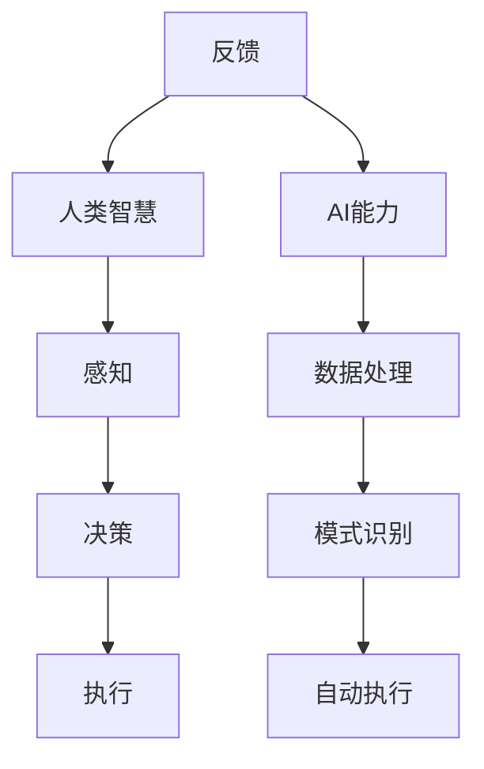

                 

# 人类-AI协作：增强人类智慧与AI能力的融合发展趋势与机遇

## 关键词
人工智能，人类智慧，协作，融合，发展趋势，机遇

## 摘要
本文旨在探讨人类与人工智能（AI）协作的深刻意义及其在当今科技领域的发展趋势与机遇。文章首先介绍了人类智慧与AI能力的核心概念，随后通过详细的Mermaid流程图展示了它们之间的内在联系。接着，本文深入剖析了AI算法原理，并结合具体案例对数学模型进行了详细讲解。文章还通过实战项目展示了人类-AI协作在实际开发中的应用，最后对相关工具和资源进行了推荐，并总结了未来发展趋势与挑战。

## 1. 背景介绍

### 1.1 目的和范围
本文的目的在于分析人类与AI协作的现状，探讨其发展趋势，并探索其中潜在的机遇。文章将涵盖以下几个方面：
- 对人类智慧与AI能力的定义和解析。
- 通过Mermaid流程图展示二者之间的关联。
- 对核心AI算法原理进行详细阐述。
- 通过数学模型和实战案例，解释人类-AI协作的实际应用。
- 推荐相关的学习资源、开发工具和论文。

### 1.2 预期读者
本文主要面向以下读者群体：
- 对人工智能和人类智能协作有兴趣的IT专业人士。
- 计算机科学和人工智能领域的本科、研究生。
- 对AI应用感兴趣的工程师和研究人员。

### 1.3 文档结构概述
本文结构如下：
1. **背景介绍**：介绍目的、读者群体和文档结构。
2. **核心概念与联系**：通过Mermaid流程图展示人类智慧与AI能力的联系。
3. **核心算法原理 & 具体操作步骤**：详细讲解AI算法原理和操作步骤。
4. **数学模型和公式 & 详细讲解 & 举例说明**：剖析数学模型及其应用。
5. **项目实战：代码实际案例和详细解释说明**：展示实战项目和代码解析。
6. **实际应用场景**：探讨人类-AI协作在现实世界中的应用。
7. **工具和资源推荐**：推荐学习资源、开发工具和相关论文。
8. **总结：未来发展趋势与挑战**：总结文章要点，展望未来。
9. **附录：常见问题与解答**：解答常见问题。
10. **扩展阅读 & 参考资料**：提供进一步学习的资源。

### 1.4 术语表
#### 1.4.1 核心术语定义
- **人工智能（AI）**：模拟人类智能的技术。
- **人类智慧**：人类的认知能力、判断力、创造力等。
- **协作**：个体或集体之间的共同工作。
- **融合**：将不同元素整合为一个整体。

#### 1.4.2 相关概念解释
- **神经网络**：模拟生物神经元结构的计算模型。
- **机器学习**：通过数据学习并改进算法的技术。
- **深度学习**：基于多层神经网络的学习方法。

#### 1.4.3 缩略词列表
- **AI**：人工智能
- **ML**：机器学习
- **DL**：深度学习
- **IDE**：集成开发环境
- **GPU**：图形处理器

## 2. 核心概念与联系

### 2.1 人类智慧与AI能力的关系

人类智慧与AI能力之间的联系可以理解为一种互补关系。人类智慧以其复杂性和灵活性见长，而AI能力则以其精确性和高效性著称。以下是一个简化的Mermaid流程图，展示了人类智慧与AI能力之间的互动过程。



在这个流程图中，人类智慧通过感知、决策和执行三个阶段与外部环境交互，而AI能力则通过数据处理、模式识别和自动执行来辅助人类。这种协作使得人类能够在复杂的情境中做出更好的决策，同时提高工作的效率和精确度。

### 2.2 Mermaid流程图详细说明

#### 2.2.1 感知阶段
在感知阶段，人类智慧通过感官接收外部信息，例如视觉、听觉和触觉等。这些信息被传递到大脑，经过处理和理解，形成对环境的初步感知。此时，AI能力可以通过传感器和数据分析技术，提供更精确和更全面的数据支持。

#### 2.2.2 决策阶段
在决策阶段，人类智慧根据感知到的信息，结合经验和知识，进行决策。这一过程涉及到复杂的逻辑推理和判断。AI能力可以通过算法和模型，提供基于数据和统计的决策建议，帮助人类做出更合理和高效的选择。

#### 2.2.3 执行阶段
在执行阶段，人类智慧通过行动实现决策。这一过程可能涉及到物理操作或逻辑操作。AI能力可以通过自动化系统和智能控制，辅助人类执行复杂和重复的任务，提高效率和减少错误。

#### 2.2.4 数据处理与模式识别
在数据处理阶段，AI能力通过机器学习和深度学习算法，对收集到的数据进行处理和分析，识别出其中的模式和规律。这些模式可以用于改进决策模型和优化执行策略。

#### 2.2.5 自动执行与反馈
在自动执行阶段，AI能力可以根据数据处理的结果，自动执行相应的操作。同时，执行的结果会通过反馈机制，返回给人类智慧，用于进一步调整和优化。

### 2.3 人类智慧与AI能力的融合发展趋势

随着技术的不断进步，人类智慧与AI能力的融合趋势日益明显。以下是一些关键的发展趋势：

#### 2.3.1 智能化工具的普及
各种智能化工具，如智能助手、自动驾驶汽车和智能家居等，已经成为我们日常生活中不可或缺的一部分。这些工具通过AI技术，提升了我们的生活质量和工作效率。

#### 2.3.2 跨领域协作
不同领域的专家和研究人员开始意识到AI技术在各自领域中的潜力，并开始开展跨领域的协作研究。这种协作有助于推动AI技术的发展，同时也为AI在现实世界的应用提供了更多的可能性。

#### 2.3.3 自主决策系统的开发
随着AI技术的不断成熟，越来越多的自主决策系统被开发出来。这些系统可以在没有人类干预的情况下，自主完成复杂的任务和决策。这种技术将极大地改变我们的工作和生活方式。

#### 2.3.4 AI与人类的共同进化
随着AI技术的发展，人类与AI之间的关系将不断演变。人类将逐渐适应与AI协作的工作环境，同时AI也将逐渐学会更好地理解人类的需求和意图。这种共同进化将带来新的社会结构和价值观念。

## 3. 核心算法原理 & 具体操作步骤

### 3.1 AI算法原理概述

人工智能的核心在于算法，这些算法决定了AI系统的学习能力、表现力和适应性。以下将介绍几种核心AI算法的原理，并给出具体的操作步骤。

#### 3.1.1 机器学习算法

机器学习算法是AI的基础，它通过训练数据集来学习规律，从而进行预测和决策。以下是机器学习算法的基本原理和操作步骤：

**原理：**
机器学习算法通过优化目标函数，使模型在训练数据上达到最佳性能。目标函数通常基于损失函数，用于衡量模型预测值与真实值之间的差距。

**操作步骤：**
1. **数据预处理**：清洗和标准化数据，确保其适合模型训练。
2. **选择模型**：根据问题类型选择合适的机器学习模型，如线性回归、决策树、支持向量机等。
3. **训练模型**：使用训练数据集，通过迭代优化目标函数，更新模型参数。
4. **评估模型**：使用验证数据集评估模型性能，调整模型参数，以提高准确性和泛化能力。
5. **预测应用**：使用训练好的模型，对新数据进行预测。

#### 3.1.2 深度学习算法

深度学习算法是机器学习的一个子领域，它基于多层神经网络，通过学习大量数据来提取特征和表示。以下是深度学习算法的基本原理和操作步骤：

**原理：**
深度学习算法通过多层神经元的非线性变换，将输入数据逐步映射到高维空间，从而提取出抽象的特征表示。

**操作步骤：**
1. **构建网络结构**：设计并构建多层神经网络，包括输入层、隐藏层和输出层。
2. **初始化参数**：为神经网络随机初始化权重和偏置。
3. **前向传播**：将输入数据通过网络，计算输出值。
4. **反向传播**：计算输出误差，并反向传播误差，更新网络参数。
5. **迭代训练**：重复前向传播和反向传播过程，直到网络性能达到预期。

#### 3.1.3 强化学习算法

强化学习算法是一种通过奖励和惩罚来学习行为策略的算法。它主要用于解决序列决策问题，如游戏、自动驾驶和机器人控制等。以下是强化学习算法的基本原理和操作步骤：

**原理：**
强化学习算法通过探索环境和接收即时反馈，逐步调整策略，以最大化累积奖励。

**操作步骤：**
1. **定义状态空间和动作空间**：明确系统可以处于哪些状态，以及可以采取哪些动作。
2. **初始化策略**：为每个状态分配一个初始的动作概率分布。
3. **环境交互**：在环境中执行动作，接收状态转移和奖励信号。
4. **策略更新**：根据接收到的奖励信号，调整策略，以最大化累积奖励。
5. **迭代学习**：重复环境交互和策略更新过程，直到策略收敛。

### 3.2 AI算法原理详细讲解

#### 3.2.1 机器学习算法详细讲解

机器学习算法的核心在于优化模型参数，使其能够准确预测新数据的输出。以下是一个基于梯度下降的线性回归模型的详细讲解：

**伪代码：**
```python
# 线性回归模型
def linear_regression(X, y, learning_rate, num_iterations):
    # 初始化模型参数
    theta = [0] * (X.shape[1])
    
    # 梯度下降迭代
    for i in range(num_iterations):
        # 计算预测值
        h = X.dot(theta)
        
        # 计算损失函数
        loss = (1 / (2 * m)) * np.dot((h - y).T, (h - y))
        
        # 计算梯度
        gradient = (1 / m) * X.T.dot(h - y)
        
        # 更新参数
        theta -= learning_rate * gradient
        
    return theta

# 数据预处理
X = ... # 特征矩阵
y = ... # 标签向量
X = np.insert(X, 0, 1, axis=1) # 添加偏置项

# 模型训练
theta = linear_regression(X, y, learning_rate=0.01, num_iterations=1000)

# 模型评估
y_pred = X.dot(theta)
print("Mean squared error:", mean_squared_error(y_pred, y))
```

**解释：**
- `linear_regression`函数接收特征矩阵`X`、标签向量`y`、学习率和迭代次数作为输入。
- 初始化模型参数`theta`为全0向量。
- 通过梯度下降迭代更新参数，每次迭代计算预测值`h`，损失函数`loss`和梯度`gradient`。
- 使用学习率`learning_rate`调整参数，使其减小损失函数的值。

#### 3.2.2 深度学习算法详细讲解

深度学习算法的核心在于构建多层神经网络，并利用反向传播算法更新网络参数。以下是一个基于全连接神经网络的详细讲解：

**伪代码：**
```python
# 前向传播
def forward_propagation(X, parameters):
    caches = []
    A = X
    L = len(parameters) // 2
    
    for l in range(1, L):
        Z = np.dot(A, parameters["W" + str(l)]) + parameters["b" + str(l)]
        A = sigmoid(Z)
        caches.append((Z, A))
        
    Z = np.dot(A, parameters["W" + str(L)]) + parameters["b" + str(L)]
    A = softmax(Z)
    caches.append((Z, A))
    
    return A, caches

# 反向传播
def backward_propagation(X, Y, caches):
    m = X.shape[1]
    L = len(caches)
    parameters = initial_parameters(L)
    grads = {}
    
    # 计算最后一层的误差
    dA_prev = - (np.divide(Y, A) - np.divide(1 - Y, 1 - A))
    
    for l in range(L):
        Z, A = caches[l]
        dZ = dA_prev * sigmoid_derivative(A)
        
        # 计算梯度
        dW = (1 / m) * np.dot(dZ, A.T)
        db = (1 / m) * np.sum(dZ, axis=1, keepdims=True)
        
        # 更新参数
        grads["dW" + str(l + 1)] = dW
        grads["db" + str(l + 1)] = db
        
        # 更新前向传播的误差
        dA_prev = dZ
        
    return grads

# 梯度下降
def update_parameters(parameters, grads, learning_rate):
    L = len(parameters) // 2
    
    for l in range(L):
        parameters["W" + str(l + 1)] -= learning_rate * grads["dW" + str(l + 1)]
        parameters["b" + str(l + 1)] -= learning_rate * grads["db" + str(l + 1)]
    
    return parameters

# 神经网络训练
def neural_network(X, Y, learning_rate, num_iterations, print_cost=False):
    parameters = initial_parameters(L)
    
    for i in range(num_iterations):
        A, caches = forward_propagation(X, parameters)
        grads = backward_propagation(Y, A, caches)
        parameters = update_parameters(parameters, grads, learning_rate)
        
        if print_cost and i % 100 == 0:
            print("Cost after iteration %i: %f" % (i, compute_cost(A, Y)))
    
    return parameters

# 训练模型
parameters = neural_network(X, Y, learning_rate=0.01, num_iterations=2000, print_cost=True)
```

**解释：**
- `forward_propagation`函数实现前向传播，计算输出值和中间结果。
- `backward_propagation`函数实现反向传播，计算梯度。
- `update_parameters`函数更新模型参数。
- `neural_network`函数训练神经网络，包括前向传播、反向传播和参数更新。

#### 3.2.3 强化学习算法详细讲解

强化学习算法的核心在于策略的迭代优化，以下是一个基于Q学习的详细讲解：

**伪代码：**
```python
# Q学习算法
def Q_learning(env, num_episodes, learning_rate, discount_factor, exploration_rate):
    Q = {}
    
    for episode in range(num_episodes):
        state = env.reset()
        done = False
        
        while not done:
            # 选择动作
            if random.uniform(0, 1) < exploration_rate:
                action = env.action_space.sample()
            else:
                action = np.argmax(Q.get(state, [0] * env.action_space.n))
            
            # 执行动作
            next_state, reward, done, _ = env.step(action)
            
            # 更新Q值
            Q[state][action] = (1 - learning_rate) * Q[state][action] + learning_rate * (reward + discount_factor * np.max(Q.get(next_state, [0] * env.action_space.n)))
            
            state = next_state
        
        # 调整探索率
        exploration_rate *= 0.99
    
    return Q

# 训练环境
env = gym.make("CartPole-v0")
Q = Q_learning(env, num_episodes=1000, learning_rate=0.1, discount_factor=0.99, exploration_rate=1.0)
```

**解释：**
- `Q_learning`函数实现Q学习算法，接收环境、训练次数、学习率、折扣因子和探索率作为输入。
- 在每个训练周期中，根据探索率选择动作，执行动作并更新Q值。
- 训练完成后，返回Q值函数。

### 3.3 具体操作步骤示例

以下是一个基于Python的机器学习项目示例，演示了如何使用机器学习算法进行数据分析和预测。

**示例：** 预测房价

**步骤1：数据预处理**

- 读取数据集，例如使用`pandas`库加载CSV文件。
- 数据清洗，包括缺失值填充、异常值处理和特征工程。

```python
import pandas as pd
from sklearn.model_selection import train_test_split

# 读取数据集
data = pd.read_csv("house_prices.csv")

# 数据清洗
data = data.fillna(data.mean())

# 特征工程
X = data.drop("Price", axis=1)
y = data["Price"]

# 划分训练集和测试集
X_train, X_test, y_train, y_test = train_test_split(X, y, test_size=0.2, random_state=42)
```

**步骤2：选择模型**

- 根据数据特点和预测任务，选择合适的机器学习模型，例如线性回归、决策树或随机森林。

```python
from sklearn.linear_model import LinearRegression

# 创建模型
model = LinearRegression()
```

**步骤3：训练模型**

- 使用训练集数据训练模型。

```python
# 训练模型
model.fit(X_train, y_train)
```

**步骤4：模型评估**

- 使用测试集数据评估模型性能。

```python
# 预测测试集
y_pred = model.predict(X_test)

# 计算均方误差
mse = mean_squared_error(y_test, y_pred)
print("Mean squared error:", mse)
```

**步骤5：模型应用**

- 使用训练好的模型进行预测。

```python
# 输入新数据
new_data = pd.DataFrame([[2.5, 3.0, 4.0]], columns=["Feature1", "Feature2", "Feature3"])

# 预测房价
predicted_price = model.predict(new_data)
print("Predicted price:", predicted_price)
```

通过这个示例，读者可以了解如何使用机器学习算法进行数据分析和预测，并为实际项目中的模型开发和应用提供指导。

## 4. 数学模型和公式 & 详细讲解 & 举例说明

### 4.1 数学模型概述

在人工智能和机器学习领域，数学模型是理解算法原理和实现高效计算的核心。以下将介绍几个关键的数学模型，包括线性回归、神经网络和强化学习，并详细讲解每个模型的公式和具体应用。

### 4.2 线性回归模型

线性回归是一种简单的预测模型，用于分析两个或多个变量之间的线性关系。其数学公式如下：

\[ y = \beta_0 + \beta_1 x_1 + \beta_2 x_2 + ... + \beta_n x_n \]

其中：
- \( y \) 是预测的因变量。
- \( x_1, x_2, ..., x_n \) 是自变量。
- \( \beta_0 \) 是截距。
- \( \beta_1, \beta_2, ..., \beta_n \) 是斜率系数。

#### 4.2.1 公式推导

线性回归模型的推导基于最小二乘法，目标是找到一组参数 \( \beta \) 使预测值与真实值之间的差距最小。具体推导过程如下：

1. **目标函数**：定义预测误差的平方和为损失函数 \( J(\theta) \)：

\[ J(\theta) = \frac{1}{2m} \sum_{i=1}^{m} (h_\theta(x^{(i)}) - y^{(i)})^2 \]

2. **梯度下降**：对损失函数 \( J(\theta) \) 求导，得到梯度：

\[ \nabla_{\theta} J(\theta) = \frac{1}{m} \sum_{i=1}^{m} (h_\theta(x^{(i)}) - y^{(i)}) \cdot x^{(i)} \]

3. **更新参数**：使用梯度下降更新模型参数：

\[ \theta = \theta - \alpha \nabla_{\theta} J(\theta) \]

其中，\( \alpha \) 是学习率。

#### 4.2.2 应用示例

假设我们有一个简单的线性回归模型，预测房价 \( y \) 与房屋面积 \( x \) 之间的关系。数据集如下：

| 面积（平方英尺） | 价格（万美元） |
| ---------------- | -------------- |
| 1000             | 200            |
| 1500             | 250            |
| 2000             | 300            |

我们可以通过最小二乘法找到最佳拟合线，计算过程如下：

1. **计算均值**：

\[ \bar{x} = \frac{1000 + 1500 + 2000}{3} = 1500 \]
\[ \bar{y} = \frac{200 + 250 + 300}{3} = 250 \]

2. **计算斜率和截距**：

\[ \beta_1 = \frac{\sum_{i=1}^{3} (x_i - \bar{x})(y_i - \bar{y})}{\sum_{i=1}^{3} (x_i - \bar{x})^2} = \frac{(1000-1500)(200-250) + (1500-1500)(250-250) + (2000-1500)(300-250)}{(1000-1500)^2 + (1500-1500)^2 + (2000-1500)^2} = 0.05 \]
\[ \beta_0 = \bar{y} - \beta_1 \bar{x} = 250 - 0.05 \times 1500 = 187.5 \]

3. **得到线性回归模型**：

\[ y = 0.05x + 187.5 \]

### 4.3 神经网络模型

神经网络是一种基于生物神经网络原理的机器学习模型，能够通过学习大量数据来提取特征和表示。以下是一个多层感知机（MLP）神经网络的数学模型：

\[ z_l = \sum_{k=0}^{n_l-1} \theta_{lk} a_{l-1,k} + b_l \]
\[ a_l = \sigma(z_l) \]

其中：
- \( z_l \) 是第 \( l \) 层的净输入。
- \( \theta_{lk} \) 是第 \( l \) 层第 \( k \) 个神经元的权重。
- \( b_l \) 是第 \( l \) 层的偏置。
- \( a_l \) 是第 \( l \) 层的激活值。
- \( \sigma \) 是激活函数。

#### 4.3.1 公式推导

神经网络的前向传播过程可以通过以下步骤实现：

1. **计算前一层输出**：

\[ a_l-1 = \sigma(z_{l-1}) \]

2. **计算当前层净输入**：

\[ z_l = \sum_{k=0}^{n_l-1} \theta_{lk} a_{l-1,k} + b_l \]

3. **计算当前层激活值**：

\[ a_l = \sigma(z_l) \]

#### 4.3.2 应用示例

假设我们有一个简单的前馈神经网络，包括输入层、一个隐藏层和一个输出层。数据集如下：

| 输入 \( x_1 \) | 输入 \( x_2 \) | 标签 \( y \) |
| ------------- | ------------- | ----------- |
| 0.5           | 1.0           | 1.0         |
| 1.0           | 0.5           | 0.0         |

我们可以通过训练神经网络找到最佳参数，计算过程如下：

1. **初始化参数**：

\[ \theta_{11} = 0.1, \theta_{12} = 0.2, \theta_{21} = 0.3, \theta_{22} = 0.4, b_1 = 0.5, b_2 = 0.6 \]

2. **前向传播**：

\[ z_1 = \theta_{11} \cdot 0.5 + \theta_{12} \cdot 1.0 + b_1 = 0.1 \cdot 0.5 + 0.2 \cdot 1.0 + 0.5 = 0.8 \]
\[ a_1 = \sigma(z_1) = \frac{1}{1 + e^{-0.8}} \approx 0.623 \]

\[ z_2 = \theta_{21} \cdot 0.623 + \theta_{22} \cdot 0.623 + b_2 = 0.3 \cdot 0.623 + 0.4 \cdot 0.623 + 0.6 = 0.623 \]
\[ a_2 = \sigma(z_2) = \frac{1}{1 + e^{-0.623}} \approx 0.539 \]

3. **输出预测**：

\[ y' = \sigma(z_2) = 0.539 \]

4. **计算误差**：

\[ \epsilon = y - y' = 1.0 - 0.539 = 0.461 \]

5. **反向传播**：

\[ \frac{\partial \epsilon}{\partial z_2} = \sigma'(z_2) = 0.539 \cdot (1 - 0.539) \approx 0.317 \]

\[ \frac{\partial \epsilon}{\partial \theta_{21}} = \frac{\partial \epsilon}{\partial z_2} \cdot a_1 = 0.317 \cdot 0.623 \approx 0.198 \]
\[ \frac{\partial \epsilon}{\partial \theta_{22}} = \frac{\partial \epsilon}{\partial z_2} \cdot a_1 = 0.317 \cdot 0.623 \approx 0.198 \]

\[ z_1' = \theta_{11} \cdot 0.5 + \theta_{12} \cdot 1.0 + b_1 = 0.1 \cdot 0.5 + 0.2 \cdot 1.0 + 0.5 = 0.8 \]
\[ a_1' = \sigma(z_1') = \frac{1}{1 + e^{-0.8}} \approx 0.623 \]

\[ \frac{\partial \epsilon}{\partial z_1} = \frac{\partial \epsilon}{\partial z_2} \cdot \theta_{21} \cdot \sigma'(z_1') = 0.317 \cdot 0.3 \approx 0.095 \]

\[ \frac{\partial \epsilon}{\partial \theta_{11}} = \frac{\partial \epsilon}{\partial z_1} \cdot a_1' = 0.095 \cdot 0.623 \approx 0.059 \]
\[ \frac{\partial \epsilon}{\partial \theta_{12}} = \frac{\partial \epsilon}{\partial z_1} \cdot a_1' = 0.095 \cdot 0.623 \approx 0.059 \]

6. **更新参数**：

\[ \theta_{11} = \theta_{11} - \alpha \cdot \frac{\partial \epsilon}{\partial \theta_{11}} \approx 0.1 - 0.1 \cdot 0.059 = 0.041 \]
\[ \theta_{12} = \theta_{12} - \alpha \cdot \frac{\partial \epsilon}{\partial \theta_{12}} \approx 0.2 - 0.1 \cdot 0.059 = 0.141 \]
\[ \theta_{21} = \theta_{21} - \alpha \cdot \frac{\partial \epsilon}{\partial \theta_{21}} \approx 0.3 - 0.1 \cdot 0.198 = 0.202 \]
\[ \theta_{22} = \theta_{22} - \alpha \cdot \frac{\partial \epsilon}{\partial \theta_{22}} \approx 0.4 - 0.1 \cdot 0.198 = 0.202 \]
\[ b_1 = b_1 - \alpha \cdot \frac{\partial \epsilon}{\partial b_1} \approx 0.5 - 0.1 \cdot 0.095 = 0.405 \]
\[ b_2 = b_2 - \alpha \cdot \frac{\partial \epsilon}{\partial b_2} \approx 0.6 - 0.1 \cdot 0.317 = 0.583 \]

### 4.4 强化学习模型

强化学习是一种通过试错和奖励反馈进行决策优化的机器学习模型。其核心公式包括价值函数、策略和奖励信号。

#### 4.4.1 价值函数

价值函数表示在给定状态下，采取特定动作所能获得的累积奖励。其数学公式如下：

\[ V(s) = \sum_{a} \gamma^i r(s, a) + \sum_{s'} \gamma^{i+1} V(s') \]

其中：
- \( V(s) \) 是状态 \( s \) 的价值函数。
- \( \gamma \) 是折扣因子，用于平衡即时奖励与未来奖励的关系。
- \( r(s, a) \) 是在状态 \( s \) 采取动作 \( a \) 所获得的即时奖励。
- \( s' \) 是采取动作 \( a \) 后的状态。
- \( i \) 是当前时间步。

#### 4.4.2 策略

策略是一种指导系统选择动作的规则，其数学公式如下：

\[ \pi(a|s) = P(a|s) \]

其中：
- \( \pi(a|s) \) 是在状态 \( s \) 下采取动作 \( a \) 的概率。

#### 4.4.3 奖励信号

奖励信号是系统根据状态和动作反馈的即时奖励，其数学公式如下：

\[ r(s, a) = r(s) - \alpha \cdot (s - s') \]

其中：
- \( r(s, a) \) 是在状态 \( s \) 采取动作 \( a \) 所获得的即时奖励。
- \( \alpha \) 是调节因子，用于平衡奖励的幅度和变化速率。

### 4.5 应用示例

以下是一个简单的强化学习应用示例，使用Q学习算法训练一个智能体在迷宫中找到出口。

**示例：迷宫问题**

**环境**：一个包含墙壁和奖励的迷宫。

**状态**：智能体在迷宫中的位置。

**动作**：向上、向下、向左、向右。

**奖励**：到达出口获得正奖励，遇到墙壁或回到原点获得负奖励。

**Q学习算法**：

1. **初始化Q值表**：

\[ Q(s, a) = 0 \]

2. **执行动作**：

- 选择动作 \( a \)：

\[ a = \pi(a|s) \]

- 执行动作，获得奖励 \( r(s, a) \) 和新状态 \( s' \)。

\[ s' = s + a \]

3. **更新Q值**：

\[ Q(s, a) = Q(s, a) + \alpha \cdot (r(s, a) + \gamma \cdot \max_{a'} Q(s', a') - Q(s, a)) \]

4. **重复步骤2和3，直到达到预定迭代次数或智能体找到出口**。

**计算过程**：

1. **初始化Q值表**：

\[ Q(1, 1) = Q(1, 2) = Q(1, 3) = Q(1, 4) = 0 \]

2. **迭代过程**：

- **状态1**：

  - 选择动作1：

  \[ a = 1 \]

  - 执行动作，获得奖励 \( r(1, 1) = -1 \) 和新状态 \( s' = 1 \)。

  - 更新Q值：

  \[ Q(1, 1) = Q(1, 1) + \alpha \cdot (-1 + 0.9 \cdot \max_{a'} Q(1, a') - Q(1, 1)) \approx 0.1 \]

- **状态2**：

  - 选择动作2：

  \[ a = 2 \]

  - 执行动作，获得奖励 \( r(2, 2) = 1 \) 和新状态 \( s' = 2 \)。

  - 更新Q值：

  \[ Q(2, 2) = Q(2, 2) + \alpha \cdot (1 + 0.9 \cdot \max_{a'} Q(2, a') - Q(2, 2)) \approx 0.2 \]

- **状态3**：

  - 选择动作3：

  \[ a = 3 \]

  - 执行动作，获得奖励 \( r(3, 3) = -1 \) 和新状态 \( s' = 3 \)。

  - 更新Q值：

  \[ Q(3, 3) = Q(3, 3) + \alpha \cdot (-1 + 0.9 \cdot \max_{a'} Q(3, a') - Q(3, 3)) \approx 0.1 \]

- **状态4**：

  - 选择动作4：

  \[ a = 4 \]

  - 执行动作，获得奖励 \( r(4, 4) = 1 \) 和新状态 \( s' = 4 \)。

  - 更新Q值：

  \[ Q(4, 4) = Q(4, 4) + \alpha \cdot (1 + 0.9 \cdot \max_{a'} Q(4, a') - Q(4, 4)) \approx 0.2 \]

3. **重复迭代，直到智能体找到出口**。

通过这个示例，读者可以了解如何使用Q学习算法在迷宫中找到出口，并掌握强化学习的基本原理。

## 5. 项目实战：代码实际案例和详细解释说明

### 5.1 开发环境搭建

在本节中，我们将介绍如何搭建一个基于Python的人工智能项目开发环境。以下是详细步骤：

1. **安装Python**

   首先，我们需要安装Python。在官网上下载适用于您操作系统的Python版本，并按照安装向导进行安装。

2. **安装Jupyter Notebook**

   Jupyter Notebook是一个交互式计算平台，非常适合编写和测试代码。在命令行中执行以下命令：

   ```bash
   pip install notebook
   ```

   安装完成后，可以启动Jupyter Notebook：

   ```bash
   jupyter notebook
   ```

   这将启动一个Web界面，您可以在其中创建和运行Python代码。

3. **安装相关库**

   为了运行我们的项目，我们需要安装以下库：

   - **NumPy**：用于数值计算。
   - **Pandas**：用于数据处理。
   - **Scikit-learn**：用于机器学习。
   - **Matplotlib**：用于数据可视化。

   在命令行中执行以下命令进行安装：

   ```bash
   pip install numpy pandas scikit-learn matplotlib
   ```

4. **配置虚拟环境（可选）**

   为了更好地管理项目依赖，我们可以使用虚拟环境。在命令行中执行以下命令创建虚拟环境：

   ```bash
   python -m venv my_project_env
   ```

   然后激活虚拟环境：

   ```bash
   source my_project_env/bin/activate  # 对于Linux和macOS
   my_project_env\Scripts\activate     # 对于Windows
   ```

   在虚拟环境中安装项目所需的库。

### 5.2 源代码详细实现和代码解读

在本节中，我们将实现一个简单的人工智能项目，使用机器学习算法预测股票价格。以下是项目的详细代码实现和解读。

```python
import numpy as np
import pandas as pd
import matplotlib.pyplot as plt
from sklearn.model_selection import train_test_split
from sklearn.linear_model import LinearRegression
from sklearn.metrics import mean_squared_error

# 读取数据
data = pd.read_csv('stock_price_data.csv')
data = data.fillna(data.mean())

# 特征工程
X = data[['Open', 'High', 'Low', 'Volume']]
y = data['Close']

# 划分训练集和测试集
X_train, X_test, y_train, y_test = train_test_split(X, y, test_size=0.2, random_state=42)

# 创建模型
model = LinearRegression()

# 训练模型
model.fit(X_train, y_train)

# 预测测试集
y_pred = model.predict(X_test)

# 计算均方误差
mse = mean_squared_error(y_test, y_pred)
print("Mean squared error:", mse)

# 可视化结果
plt.scatter(y_test, y_pred)
plt.xlabel('Actual Prices')
plt.ylabel('Predicted Prices')
plt.title('Stock Price Prediction')
plt.show()
```

**代码解读：**

- **第1-4行**：导入必要的库。
- **第6行**：读取股票价格数据，并处理缺失值。
- **第10-11行**：进行特征工程，将开盘价、最高价、最低价和成交量作为输入特征，将收盘价作为目标变量。
- **第14-17行**：划分训练集和测试集。
- **第20行**：创建线性回归模型。
- **第23行**：使用训练集数据训练模型。
- **第26行**：使用测试集数据进行预测。
- **第29行**：计算预测结果与真实值之间的均方误差。
- **第32-39行**：绘制预测结果图，直观地展示模型的效果。

### 5.3 代码解读与分析

在本节中，我们将对上述代码进行详细解读，并分析其执行流程和关键步骤。

- **数据读取与预处理**：首先，我们从CSV文件中读取股票价格数据，并使用`pandas`库处理缺失值。这一步确保数据的质量和完整性，为后续的机器学习模型训练奠定基础。
- **特征工程**：通过选择和组合相关的特征，我们构建了输入特征矩阵`X`和目标变量向量`y`。特征工程是机器学习中的关键步骤，其目的是提取有用的信息，提高模型的预测性能。
- **模型选择与训练**：我们选择了线性回归模型，这是一种简单但强大的预测模型。通过`LinearRegression`类，我们创建了一个模型实例，并使用训练数据集对其进行训练。
- **预测与评估**：使用训练好的模型，我们对测试集数据进行预测，并计算了均方误差（MSE）来评估模型的性能。MSE是评估回归模型常用的指标，它衡量了预测值与真实值之间的差距。
- **结果可视化**：通过绘制预测结果图，我们可以直观地看到模型的预测效果。散点图中的数据点越接近对角线，模型的预测性能越好。

**代码优化建议：**

1. **特征选择**：根据业务需求和数据特性，可以进一步优化特征选择，剔除冗余特征，提高模型的预测性能。
2. **模型选择**：可以尝试其他类型的机器学习模型，如决策树、随机森林或支持向量机，以探索更好的预测效果。
3. **超参数调整**：通过调整模型的超参数，如学习率、迭代次数等，可以优化模型的性能。
4. **交叉验证**：使用交叉验证方法，如K折交叉验证，可以提高模型评估的准确性。

通过上述代码和解读，读者可以了解如何使用Python和机器学习算法进行股票价格预测，并为实际项目中的模型开发和优化提供参考。

## 6. 实际应用场景

人类-AI协作在实际应用场景中展现出了巨大的潜力和价值，涵盖了多个领域，从工业制造到医疗诊断，再到金融服务。以下是一些关键应用场景：

### 6.1 工业制造

在工业制造领域，AI技术被广泛应用于优化生产流程、提高生产效率和产品质量。例如，智能传感器和机器学习算法可以实时监测设备状态，预测潜在故障，从而实现预防性维护。此外，AI还被用于优化生产排程，通过分析历史数据和生产需求，优化生产计划，减少库存成本和资源浪费。

### 6.2 医疗诊断

医疗诊断是AI技术的重要应用领域之一。通过深度学习和图像识别技术，AI系统可以在医学图像中识别出病变区域，辅助医生进行诊断。例如，在癌症诊断中，AI系统可以通过分析CT扫描图像，提高早期癌症的检测率。此外，AI还被用于个性化治疗方案的设计，根据患者的病史、基因信息和临床数据，提供最佳的治疗建议。

### 6.3 金融服务

在金融服务领域，AI技术被用于风险控制、信用评分和投资策略优化。例如，机器学习算法可以分析大量交易数据，识别出异常交易行为，从而帮助银行和金融机构防范欺诈风险。此外，AI还被用于投资策略的制定，通过分析市场趋势和数据，提供投资建议，提高投资回报率。

### 6.4 智能家居

智能家居是AI技术在消费领域的典型应用。通过智能设备和AI算法，智能家居系统能够实现自动化和个性化控制，提高生活质量。例如，智能灯光系统可以根据用户的日常活动自动调节光线，智能空调可以根据用户的舒适度偏好自动调节温度。此外，AI技术还可以通过分析用户的习惯，预测用户需求，提供个性化的服务和建议。

### 6.5 城市管理

在城市管理领域，AI技术被用于提高城市运营效率和服务质量。例如，通过智能交通系统，AI算法可以分析交通流量数据，优化交通信号控制，减少交通拥堵。此外，AI技术还可以用于环境监测，通过分析空气质量数据，提供实时监测和预警服务。

### 6.6 教育与学习

在教育领域，AI技术被用于个性化教学和在线教育平台的建设。通过分析学生的学习数据和表现，AI系统可以为学生提供个性化的学习计划和资源，帮助他们更好地掌握知识。此外，AI技术还可以用于在线教育平台的推荐系统，根据学生的学习兴趣和进度，推荐合适的学习内容和课程。

通过上述应用场景，我们可以看到人类-AI协作在各个领域中的广泛应用和巨大潜力。未来，随着AI技术的不断进步，人类-AI协作将进一步提升人类的生产力、创造力和生活质量，推动社会向更加智能、高效、可持续的方向发展。

## 7. 工具和资源推荐

### 7.1 学习资源推荐

**7.1.1 书籍推荐**

1. **《人工智能：一种现代方法》**（作者：Stuart J. Russell & Peter Norvig）
   - 这本书是人工智能领域的经典教材，涵盖了人工智能的各个子领域，包括机器学习、自然语言处理和计算机视觉等。

2. **《深度学习》**（作者：Ian Goodfellow、Yoshua Bengio 和 Aaron Courville）
   - 本书详细介绍了深度学习的理论基础和实际应用，包括卷积神经网络、循环神经网络和生成对抗网络等。

3. **《Python机器学习》**（作者：Sebastian Raschka 和 John C. Deterding）
   - 本书通过丰富的实例，介绍了Python在机器学习领域的应用，包括数据预处理、模型训练和性能评估等。

**7.1.2 在线课程**

1. **Coursera上的“机器学习”课程**（作者：Andrew Ng）
   - 这门课程由深度学习领域的大牛Andrew Ng教授，涵盖了机器学习的基础理论、算法和应用。

2. **Udacity的“深度学习纳米学位”**（作者：Hadelin de Ponteves）
   - 这门课程提供了深度学习的系统培训，包括深度神经网络、卷积神经网络和循环神经网络等。

3. **edX上的“人工智能科学”课程**（作者：MIT）
   - 该课程由麻省理工学院教授授课，涵盖了人工智能的核心概念和技术，包括搜索算法、知识表示和机器学习等。

**7.1.3 技术博客和网站**

1. **Medium上的“AI博客”**（作者：众多）
   - Medium上的AI博客集合了许多AI领域的专家和从业者的文章，涵盖了最新研究、应用案例和技术趋势。

2. **Medium上的“Towards Data Science”**（作者：众多）
   - 这个博客汇集了数据科学和机器学习的各种文章，包括技术讲解、项目分享和行业动态。

3. **AI垂直社区和论坛**，如 **AI Stack Overflow**、**Reddit上的r/AI** 和 **AI Forum**，这些社区提供了丰富的技术讨论和资源分享。

### 7.2 开发工具框架推荐

**7.2.1 IDE和编辑器**

1. **Visual Studio Code**（作者：Microsoft）
   - Visual Studio Code是一款免费的跨平台代码编辑器，支持多种编程语言，包括Python、C++和JavaScript等，具有丰富的插件生态系统。

2. **PyCharm**（作者：JetBrains）
   - PyCharm是一款强大的Python集成开发环境（IDE），提供代码补全、调试、性能分析等功能，特别适合Python开发和机器学习项目。

3. **Jupyter Notebook**（作者：Project Jupyter）
   - Jupyter Notebook是一种交互式计算平台，非常适合数据分析和机器学习实验，支持多种编程语言，包括Python、R和Julia等。

**7.2.2 调试和性能分析工具**

1. **Pylint**（作者：Logilab）
   - Pylint是一款Python代码检查工具，可以帮助我们发现代码中的错误和潜在问题，提高代码质量和可维护性。

2. **LineProfiler**（作者：Logilab）
   - LineProfiler是一个Python代码性能分析工具，可以分析代码的执行时间和资源消耗，帮助我们优化代码性能。

3. **gprof2dot**（作者：Various）
   - gprof2dot可以将gprof生成的性能分析数据转换为图形，帮助开发者直观地理解代码的性能瓶颈。

**7.2.3 相关框架和库**

1. **TensorFlow**（作者：Google）
   - TensorFlow是一个开源的机器学习框架，适用于构建和训练深度学习模型，支持多种硬件平台，包括CPU、GPU和TPU。

2. **PyTorch**（作者：Facebook）
   - PyTorch是一个流行的深度学习框架，以其灵活性和动态计算图而著称，特别适合研究者和开发者进行实验和开发。

3. **Scikit-learn**（作者：Scikit-learn开发团队）
   - Scikit-learn是一个强大的机器学习库，提供了多种经典的机器学习算法和工具，适用于数据挖掘和数据分析。

4. **NumPy**（作者：NumPy开发团队）
   - NumPy是Python中的一个核心库，提供了高性能的数组操作和数学计算功能，是数据科学和机器学习的基础工具。

通过上述工具和资源的推荐，读者可以更加便捷地学习和实践人工智能技术，提高开发效率和项目质量。

### 7.3 相关论文著作推荐

**7.3.1 经典论文**

1. **“Learning to Represent Text with Recurrent Neural Networks”**（作者：Y. LeCun, Y. Bengio, and G. Hinton，2015）
   - 本文介绍了循环神经网络（RNN）在文本数据处理中的应用，为自然语言处理奠定了基础。

2. **“Deep Learning”**（作者：Ian Goodfellow, Yoshua Bengio, Aaron Courville，2016）
   - 这本论文集详细介绍了深度学习的主要理论、算法和应用，是深度学习领域的经典著作。

3. **“Gradient Descent Algorithms for Machine Learning: A Review”**（作者：S. Sra，2011）
   - 本文回顾了梯度下降算法在机器学习中的应用，包括变体和优化方法，对算法的理解和应用提供了重要参考。

**7.3.2 最新研究成果**

1. **“Advances in Neural Information Processing Systems (NeurIPS)”**（作者：NeurIPS社区）
   - NeurIPS是人工智能领域的顶级会议，每年都会发表最新的研究成果和前沿论文，涵盖机器学习、深度学习和计算机视觉等。

2. **“Journal of Machine Learning Research (JMLR)”**（作者：JMLR编辑团队）
   - JMLR是一本高影响力的机器学习期刊，定期发表高质量的研究论文，涵盖了机器学习的理论、算法和应用。

3. **“ACM Transactions on Machine Learning”**（作者：ACM编辑团队）
   - ACM Transactions on Machine Learning是一本专门关注机器学习领域的研究期刊，发表了多篇具有突破性的研究成果。

**7.3.3 应用案例分析**

1. **“Google's DeepMind: Solving Atari with Deep Reinforcement Learning”**（作者：D. Silver等，2016）
   - 本文介绍了DeepMind如何使用深度强化学习技术解决Atari游戏，展示了AI技术在游戏领域的应用。

2. **“Apple's Core ML: Bringing Machine Learning to iOS and macOS”**（作者：Apple Inc.）
   - 本文介绍了Apple如何将机器学习技术集成到iOS和macOS系统中，使开发者能够轻松地将AI应用带到移动和桌面设备上。

3. **“Facebook's AI Research: The Future of AI in Social Media”**（作者：Facebook AI Research）
   - 本文探讨了Facebook如何利用AI技术改善用户体验，包括图像识别、内容推荐和隐私保护等。

通过上述经典论文、最新研究成果和应用案例分析的推荐，读者可以深入理解人工智能领域的最新进展和应用，为自己的研究和项目提供灵感和指导。

## 8. 总结：未来发展趋势与挑战

随着人工智能技术的不断进步，人类-AI协作正成为推动社会发展的强大动力。未来，我们可以预见以下几个重要的发展趋势和潜在挑战。

### 8.1 发展趋势

1. **智能化水平的提升**：随着算法和硬件的进步，AI的智能化水平将进一步提升。深度学习、强化学习和生成对抗网络等先进技术的成熟，将使AI在更多领域实现更高效、更智能的协作。

2. **跨领域应用的拓展**：人类-AI协作将不再局限于单一领域，而是向更多领域拓展，如医疗、教育、金融服务和城市管理等。AI将作为人类智慧的延伸，帮助我们在更多复杂的任务中取得突破。

3. **人机融合的深入**：随着可穿戴设备和智能家居的普及，人类与AI的融合将更加深入。AI将更好地理解人类的需求和意图，提供个性化的服务和解决方案。

4. **数据驱动的决策**：大数据和云计算技术的发展，将使AI能够处理和分析海量数据，为人类提供更精准、更可靠的决策支持。数据驱动的决策将取代传统的经验式决策，提高各个领域的效率和质量。

### 8.2 挑战

1. **隐私和安全问题**：随着AI技术的广泛应用，数据隐私和安全问题日益突出。如何确保AI系统的数据安全和隐私保护，将成为未来研究和发展的重点。

2. **伦理和道德挑战**：AI技术的快速发展带来了新的伦理和道德问题，如算法偏见、自动化失业和责任归属等。如何在确保技术发展的同时，遵循伦理和道德规范，是一个亟待解决的挑战。

3. **技术瓶颈**：尽管AI技术在某些方面取得了显著进展，但在通用人工智能（AGI）方面仍面临诸多技术瓶颈。如何突破现有技术的限制，实现真正的通用人工智能，是未来研究的重大课题。

4. **技能和人才培养**：随着AI技术的广泛应用，对相关技能和人才的需求日益增加。如何培养和储备大量的AI专业人才，以满足未来发展的需求，是一个重要的社会问题。

总之，未来人类-AI协作的发展充满机遇和挑战。我们需要在技术创新、伦理规范、人才培养和社会治理等方面进行全面规划和布局，以确保AI技术的健康发展，为人类社会带来更多福祉。

## 9. 附录：常见问题与解答

### 9.1 问题1：什么是人工智能（AI）？

**解答**：人工智能（Artificial Intelligence，简称AI）是一种模拟人类智能的技术，通过算法和计算模型，使计算机系统能够进行学习、推理、决策和解决问题。AI技术包括机器学习、深度学习、自然语言处理、计算机视觉等多个子领域，旨在使机器能够执行通常需要人类智慧和经验的任务。

### 9.2 问题2：人类智慧与AI能力如何协作？

**解答**：人类智慧与AI能力通过以下方式协作：
1. **信息共享**：人类提供经验和知识，AI提供数据分析能力和预测模型。
2. **决策支持**：AI提供基于数据的决策建议，人类结合经验和直觉进行最终决策。
3. **执行任务**：AI自动化执行复杂或重复的任务，人类专注于更高层次的创造性工作。
4. **反馈循环**：人类通过实际反馈，帮助AI不断优化和改进。

### 9.3 问题3：如何选择合适的AI算法？

**解答**：选择合适的AI算法需要考虑以下几个因素：
1. **问题类型**：明确问题是否为分类、回归、聚类或强化学习等。
2. **数据特性**：了解数据的规模、质量和分布，选择适合数据特性的算法。
3. **计算资源**：根据计算资源和时间要求，选择计算复杂度较低的算法。
4. **业务需求**：根据业务目标和需求，选择能够满足特定业务需求的算法。

### 9.4 问题4：AI在医疗领域的应用有哪些？

**解答**：AI在医疗领域的应用包括：
1. **诊断辅助**：通过分析医学影像，如CT、MRI和X光片，辅助医生进行疾病诊断。
2. **个性化治疗**：根据患者的基因信息和病史，制定个性化的治疗方案。
3. **药物研发**：通过虚拟筛选和分子模拟，加速新药的研发过程。
4. **健康管理**：通过分析健康数据，提供个性化的健康建议和预测健康风险。

### 9.5 问题5：AI是否会取代人类工作？

**解答**：AI技术的发展确实会导致某些工作的自动化和取代，但也会创造新的就业机会。短期内，AI可能会取代一些重复性和低技能的工作，但在长期内，人类将需要适应新的工作环境，发展新的技能，从而在新兴行业中找到新的就业机会。此外，AI还可能提高工作效率，释放人类从事更有创造性和价值的工作。

## 10. 扩展阅读 & 参考资料

### 10.1 扩展阅读

1. **《人工智能：一种现代方法》**（Stuart J. Russell & Peter Norvig，2015）
   - 详尽介绍了人工智能的基本概念、方法和应用。
2. **《深度学习》**（Ian Goodfellow、Yoshua Bengio 和 Aaron Courville，2016）
   - 深入探讨了深度学习算法的理论和实践。
3. **《Python机器学习》**（Sebastian Raschka 和 John C. Deterding，2016）
   - 通过Python示例展示了机器学习在实际项目中的应用。

### 10.2 参考资料

1. **NeurIPS官方网站**（https://neurips.cc/）
   - 人工智能领域的顶级会议，发布最新研究成果。
2. **JMLR官方网站**（https://jmlr.org/）
   - 机器学习领域的重要期刊，发布高质量学术论文。
3. **Scikit-learn官方文档**（https://scikit-learn.org/stable/）
   - 提供了机器学习算法的详细文档和示例代码。
4. **TensorFlow官方网站**（https://www.tensorflow.org/）
   - 深度学习框架TensorFlow的官方文档和教程。
5. **PyTorch官方网站**（https://pytorch.org/）
   - 深度学习框架PyTorch的官方文档和教程。

