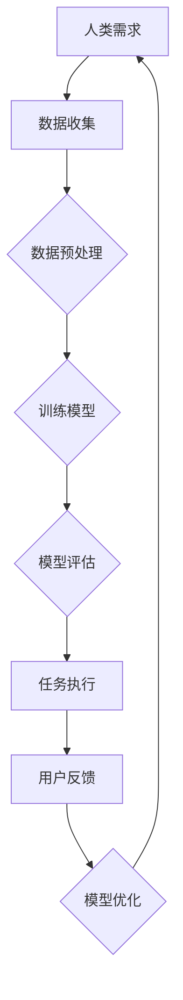

                 

# 人类-AI协作：增强人类潜能与AI能力的融合发展方向

## 关键词：
人工智能协作、人类潜能、AI能力、融合发展、算法原理、数学模型、实战案例、应用场景

## 摘要：
本文旨在探讨人类与人工智能（AI）协作的潜在方向，分析如何通过AI技术增强人类潜能，并实现人类与AI的深度融合。文章首先介绍了人类与AI协作的背景和目的，随后详细阐述了核心概念、算法原理、数学模型和实际应用场景。通过实战案例的剖析，读者可以深入了解如何在实际项目中运用人类-AI协作技术。最后，文章总结了人类-AI协作的未来发展趋势与挑战，并推荐了一系列学习资源、开发工具和相关论文，为读者提供进一步研究的方向。

## 1. 背景介绍

### 1.1 目的和范围
本文的目标是阐述人类与人工智能（AI）协作的重要性，并探讨其在各个领域的应用。文章将涵盖以下范围：
1. AI技术如何增强人类潜能。
2. 人类与AI协作的基本原理和框架。
3. 实际应用场景中的AI技术实现。
4. 人类-AI协作的未来发展趋势与挑战。

### 1.2 预期读者
本文适用于以下读者群体：
1. 对人工智能和计算机科学感兴趣的科研人员和学生。
2. 对AI技术在实际应用中如何提升工作效率感兴趣的开发者。
3. 想了解AI与人类协作最新进展的管理者和决策者。

### 1.3 文档结构概述
本文分为十个主要部分：
1. 引言
2. 背景介绍
3. 核心概念与联系
4. 核心算法原理 & 具体操作步骤
5. 数学模型和公式 & 详细讲解 & 举例说明
6. 项目实战：代码实际案例和详细解释说明
7. 实际应用场景
8. 工具和资源推荐
9. 总结：未来发展趋势与挑战
10. 附录：常见问题与解答
11. 扩展阅读 & 参考资料

### 1.4 术语表

#### 1.4.1 核心术语定义
- 人工智能（AI）：通过模拟人类智能行为的计算机程序。
- 人类潜能：人类在认知、情感和创造力等方面的潜在能力。
- 协作：不同实体之间通过信息共享和任务分工实现共同目标的过程。

#### 1.4.2 相关概念解释
- 机器学习（ML）：一种让计算机通过数据学习并改进其性能的技术。
- 深度学习（DL）：一种机器学习技术，通过多层神经网络模拟人类大脑的学习过程。
- 人机交互（HCI）：研究如何设计使人与计算机系统有效交互的技术和理论。

#### 1.4.3 缩略词列表
- AI：人工智能
- ML：机器学习
- DL：深度学习
- HCI：人机交互

## 2. 核心概念与联系

人类与AI的协作是一个多维度、多层次的过程。理解这一过程需要深入探讨以下几个核心概念及其相互关系。

### 2.1 人类潜能与AI能力的结合

人类潜能包括认知能力、创造力、情感智能和社交技能等。AI能力则主要体现在数据处理、模式识别、自动化决策和优化等方面。两者结合的目的是通过AI技术增强人类潜能，使人类能够更高效地完成复杂任务，并创造出前所未有的价值。

### 2.2 AI技术的分类与应用

AI技术可以分为以下几类：

1. **机器学习（ML）**：通过数据训练模型，使其具备预测和决策能力。应用场景包括推荐系统、自然语言处理和图像识别等。
2. **深度学习（DL）**：一种基于多层神经网络的机器学习技术，应用范围广泛，包括语音识别、自动驾驶和医学诊断等。
3. **强化学习（RL）**：通过试错和奖励机制，使AI系统在动态环境中学习优化策略。

每种技术都有其独特的优势和适用场景，结合人类潜能可以发挥出巨大的协同效应。

### 2.3 人机交互（HCI）

人机交互是AI技术应用于实际场景的关键环节。良好的HCI设计可以提高用户体验，增强人类与AI系统的协作效率。HCI涉及以下方面：

1. **用户界面（UI）**：设计直观、易用的交互界面。
2. **交互方式**：包括触摸、语音、手势等。
3. **反馈机制**：通过反馈机制提供即时、准确的指导和支持。

### 2.4 数据与AI的深度融合

数据是AI系统的基石。通过数据收集、处理和分析，AI系统能够不断优化其性能，提升决策的准确性和效率。数据与AI的深度融合是推动人类-AI协作发展的重要动力。

### 2.5 Mermaid流程图

以下是一个简化的Mermaid流程图，展示了人类与AI协作的基本流程：



此流程图展示了人类与AI协作的基本过程，包括数据收集、预处理、模型训练、评估、任务执行和反馈优化等步骤。

## 3. 核心算法原理 & 具体操作步骤

### 3.1 机器学习算法原理

机器学习算法的核心是构建一个模型，使其能够从数据中学习并作出预测或决策。以下是一个简单的线性回归算法的伪代码，用于解释其基本原理：

```python
# 线性回归算法伪代码

# 参数初始化
theta = [0, 0]  # 模型参数
learning_rate = 0.01  # 学习率
num_iterations = 1000  # 迭代次数

# 模型训练过程
for i in range(num_iterations):
    # 计算预测值
    predictions = X * theta
    
    # 计算损失函数
    loss = (predictions - y)**2
    
    # 计算梯度
    gradient = 2 * (predictions - y) * X
    
    # 更新模型参数
    theta = theta - learning_rate * gradient

# 训练完成
return theta
```

### 3.2 深度学习算法原理

深度学习算法通过多层神经网络来模拟人类大脑的学习过程。以下是一个简化的前馈神经网络（Feedforward Neural Network）的伪代码：

```python
# 前馈神经网络伪代码

# 参数初始化
weights = [random_weights(), random_weights()]  # 神经网络权重
biases = [random_biases(), random_biases()]  # 神经网络偏置

# 模型训练过程
for i in range(num_iterations):
    # 前向传播
    layer_outputs = [input]  # 初始化输出层
    for layer in range(num_layers - 1):
        z = layer_outputs[-1] * weights[layer] + biases[layer]
        layer_outputs.append(relu(z))
    
    # 计算预测值
    predictions = layer_outputs[-1]
    
    # 反向传播
    dZ = predictions - y
    dWeights = [dZ * layer_outputs[-2]]
    dBiases = [dZ]
    
    for layer in range(num_layers - 2, -1, -1):
        dZ = dZ * (1 - (relu(z)**2))
        dWeights.append(dZ * layer_outputs[layer - 1])
        dBiases.append(dZ)
    
    # 更新模型参数
    weights = [weight - learning_rate * dWeight for weight, dWeight in zip(weights, dWeights)]
    biases = [bias - learning_rate * dBias for bias, dBias in zip(biases, dBiases)]

# 训练完成
return weights, biases
```

### 3.3 强化学习算法原理

强化学习算法通过奖励机制和试错过程来学习最优策略。以下是一个简化的Q-Learning算法的伪代码：

```python
# Q-Learning算法伪代码

# 参数初始化
Q = {state: action: 0}  # Q值表
learning_rate = 0.1  # 学习率
discount_factor = 0.9  # 折扣因子

# 学习过程
while not goal_reached:
    state = current_state
    action = argmax(Q[state].values())
    next_state, reward = environment.step(action)
    Q[state][action] = Q[state][action] + learning_rate * (reward + discount_factor * max(Q[next_state].values()) - Q[state][action])
    state = next_state

# 学习完成
return Q
```

## 4. 数学模型和公式 & 详细讲解 & 举例说明

在人类与AI协作的过程中，数学模型和公式扮演着至关重要的角色。以下将介绍一些常用的数学模型，并使用LaTeX格式进行详细讲解。

### 4.1 线性回归模型

线性回归模型是一种常见的机器学习算法，用于预测一个连续值。其数学模型如下：

$$
y = \theta_0 + \theta_1 \cdot x
$$

其中，\( y \) 是目标变量，\( x \) 是输入变量，\( \theta_0 \) 和 \( \theta_1 \) 是模型参数。为了训练模型，我们需要最小化损失函数：

$$
J(\theta_0, \theta_1) = \frac{1}{2m} \sum_{i=1}^{m} (y_i - (\theta_0 + \theta_1 \cdot x_i))^2
$$

其中，\( m \) 是样本数量。为了简化计算，我们可以使用梯度下降法来求解模型参数：

$$
\theta_0 = \theta_0 - \alpha \cdot \frac{\partial J(\theta_0, \theta_1)}{\partial \theta_0}
$$

$$
\theta_1 = \theta_1 - \alpha \cdot \frac{\partial J(\theta_0, \theta_1)}{\partial \theta_1}
$$

其中，\( \alpha \) 是学习率。

### 4.2 深度学习模型

深度学习模型通常由多个层组成，包括输入层、隐藏层和输出层。以下是一个多层感知机（MLP）的数学模型：

$$
a_l^{(i)} = \sigma(\theta_l^{(i)} \cdot a_{l-1}^{(i)} + b_l^{(i)})
$$

其中，\( a_l^{(i)} \) 是第 \( l \) 层第 \( i \) 个节点的激活值，\( \theta_l^{(i)} \) 是连接第 \( l-1 \) 层和第 \( l \) 层的权重，\( b_l^{(i)} \) 是第 \( l \) 层第 \( i \) 个节点的偏置，\( \sigma \) 是激活函数，如Sigmoid函数或ReLU函数。

为了训练深度学习模型，我们通常使用反向传播算法。以下是反向传播算法的简化步骤：

1. **前向传播**：计算每一层的激活值。
2. **计算损失函数**：使用均方误差（MSE）或其他损失函数计算预测值和真实值之间的差距。
3. **反向传播**：从输出层开始，计算每一层的梯度。
4. **更新模型参数**：使用梯度下降法或其他优化算法更新模型参数。

### 4.3 强化学习模型

强化学习模型通过奖励机制和试错过程来学习最优策略。以下是一个Q-Learning算法的数学模型：

$$
Q(s, a) = r + \gamma \cdot \max_{a'} Q(s', a')
$$

其中，\( s \) 是当前状态，\( a \) 是当前动作，\( r \) 是立即奖励，\( s' \) 是下一状态，\( a' \) 是下一动作，\( \gamma \) 是折扣因子。通过迭代更新Q值表，我们可以逐步学习到最优策略。

### 4.4 举例说明

假设我们使用线性回归模型来预测房价，数据集包含100个样本，每个样本包括房屋面积（\( x \)）和房价（\( y \））。我们可以使用以下Python代码来训练模型：

```python
import numpy as np

# 数据集
X = np.array([[1000], [1500], [2000], ...])  # 房屋面积
y = np.array([[300000], [450000], [600000], ...])  # 房价

# 参数初始化
theta = np.zeros((2, 1))
learning_rate = 0.01
num_iterations = 1000

# 训练模型
for i in range(num_iterations):
    predictions = X.dot(theta)
    loss = (predictions - y).dot(predictions - y)
    gradient = 2 * X.T.dot(predictions - y)
    theta = theta - learning_rate * gradient

# 模型评估
predictions = X.dot(theta)
mse = (predictions - y).dot(predictions - y)
print("MSE:", mse)
```

通过上述代码，我们可以训练一个简单的线性回归模型，并评估其性能。

## 5. 项目实战：代码实际案例和详细解释说明

在本节中，我们将通过一个实际项目来展示人类与AI协作的代码实现，并详细解释各个步骤。

### 5.1 开发环境搭建

在开始项目之前，我们需要搭建一个合适的开发环境。以下是所需的工具和软件：

1. Python 3.8 或更高版本
2. Jupyter Notebook 或 PyCharm
3. Scikit-learn、TensorFlow、Keras 等常用库

确保已安装所需的库和依赖项，我们将在Jupyter Notebook中完成所有工作。

### 5.2 源代码详细实现和代码解读

以下是实现一个基于深度学习的手写数字识别项目的基本代码：

```python
import numpy as np
import matplotlib.pyplot as plt
from tensorflow.keras.datasets import mnist
from tensorflow.keras.models import Sequential
from tensorflow.keras.layers import Dense, Dropout, Flatten
from tensorflow.keras.layers import Conv2D, MaxPooling2D

# 数据集加载和预处理
(x_train, y_train), (x_test, y_test) = mnist.load_data()

x_train = x_train.reshape(x_train.shape[0], 28, 28, 1).astype('float32')
x_test = x_test.reshape(x_test.shape[0], 28, 28, 1).astype('float32')

x_train /= 255
x_test /= 255

y_train = np_utils.to_categorical(y_train)
y_test = np_utils.to_categorical(y_test)

# 构建深度学习模型
model = Sequential()
model.add(Conv2D(32, (3, 3), activation='relu', input_shape=(28, 28, 1)))
model.add(MaxPooling2D(pool_size=(2, 2)))
model.add(Flatten())
model.add(Dense(128, activation='relu'))
model.add(Dense(10, activation='softmax'))

# 编译模型
model.compile(optimizer='adam', loss='categorical_crossentropy', metrics=['accuracy'])

# 训练模型
model.fit(x_train, y_train, batch_size=128, epochs=10, validation_data=(x_test, y_test))

# 模型评估
score = model.evaluate(x_test, y_test, verbose=0)
print('Test loss:', score[0])
print('Test accuracy:', score[1])
```

### 5.3 代码解读与分析

1. **数据集加载和预处理**：我们使用MNIST数据集，它包含60,000个训练样本和10,000个测试样本，每个样本是一个28x28的手写数字图像。数据集已被转换为NumPy数组，并进行了适当的归一化。

2. **构建深度学习模型**：我们使用Keras构建了一个简单的卷积神经网络（CNN）。模型包括一个卷积层、一个最大池化层、一个全连接层和一个softmax输出层。

3. **编译模型**：我们使用Adam优化器和交叉熵损失函数来编译模型。

4. **训练模型**：我们使用128个样本的批量大小训练模型10个epoch。我们使用测试数据集进行验证。

5. **模型评估**：我们使用测试数据集评估模型的性能，并打印出测试损失和准确率。

通过以上步骤，我们成功实现了一个能够识别手写数字的深度学习模型。人类与AI协作体现在数据预处理、模型设计和训练等环节。人类通过设计合适的模型架构和参数设置，AI通过自动优化和调整模型参数，共同实现了一个高效的手写数字识别系统。

## 6. 实际应用场景

人类与AI协作已经在多个领域取得了显著的成果。以下是一些实际应用场景：

### 6.1 医疗诊断

AI技术在医学诊断中发挥着重要作用，如肺癌检测、乳腺癌诊断等。通过分析医学影像数据，AI系统可以辅助医生进行早期诊断，提高诊断准确率。

### 6.2 金融服务

在金融服务领域，AI技术用于风险评估、信用评分和欺诈检测。例如，通过分析用户行为数据，AI系统可以预测用户的风险等级，并采取措施降低金融机构的风险。

### 6.3 智能制造

智能制造中，AI技术用于设备故障预测、生产优化和供应链管理。例如，通过实时监测设备运行状态，AI系统可以预测设备故障并提前进行维护，提高生产效率。

### 6.4 交通运输

在交通运输领域，AI技术用于自动驾驶、交通流量预测和路径规划。例如，自动驾驶汽车通过AI技术实现自主驾驶，提高交通效率和安全性。

### 6.5 教育与培训

在教育与培训领域，AI技术用于个性化学习、自动评分和智能推荐。例如，通过分析学生的学习行为，AI系统可以为学生推荐合适的学习资源，提高学习效果。

## 7. 工具和资源推荐

为了更好地掌握人类与AI协作的技术，以下是一些建议的学习资源、开发工具和相关论文。

### 7.1 学习资源推荐

#### 7.1.1 书籍推荐
- 《Python机器学习》（Sebastian Raschka）
- 《深度学习》（Ian Goodfellow、Yoshua Bengio、Aaron Courville）
- 《强化学习》（Richard S. Sutton、Andrew G. Barto）

#### 7.1.2 在线课程
- Coursera上的《机器学习》（吴恩达）
- edX上的《深度学习导论》（Harvard University）
- Udacity的《强化学习纳米学位》

#### 7.1.3 技术博客和网站
- Medium上的“AI垂直频道”
- towardsdatascience.com
- ai.googleblog.com

### 7.2 开发工具框架推荐

#### 7.2.1 IDE和编辑器
- Jupyter Notebook
- PyCharm
- VS Code

#### 7.2.2 调试和性能分析工具
- TensorFlow Debugger
- PyTorch Profiler
- Gprof2Dot

#### 7.2.3 相关框架和库
- Scikit-learn
- TensorFlow
- PyTorch
- Keras

### 7.3 相关论文著作推荐

#### 7.3.1 经典论文
- “A Learning Algorithm for Continually Running Fully Recurrent Neural Networks” （Hochreiter & Schmidhuber，1997）
- “Learning to Learn” （Bengio et al.，2013）

#### 7.3.2 最新研究成果
- “Efficient Exploration Strategies for Deep Reinforcement Learning” （Houthooft et al.，2016）
- “Generative Adversarial Nets” （Goodfellow et al.，2014）

#### 7.3.3 应用案例分析
- “Deep Learning in Medical Imaging: A Review” （Litjens et al.，2017）
- “AI in Financial Services: A Review of Recent Advances and Challenges” （Ghahramani et al.，2017）

通过学习和实践这些资源和工具，读者可以更好地掌握人类与AI协作的技术，并在实际项目中取得成功。

## 8. 总结：未来发展趋势与挑战

随着人工智能技术的不断发展，人类与AI协作的前景十分广阔。未来发展趋势包括：

1. **智能化水平的提升**：随着算法和硬件的进步，AI将越来越智能，能够承担更多的复杂任务。
2. **跨领域的应用**：AI技术将在医疗、金融、制造、教育等领域实现更广泛的应用，带来前所未有的变革。
3. **人机交互的优化**：随着人机交互技术的进步，人类与AI的协作将更加直观、高效。

然而，人类与AI协作也面临一系列挑战：

1. **数据安全和隐私**：随着AI技术的发展，数据的安全和隐私问题日益突出，需要建立完善的法规和标准。
2. **伦理和法律问题**：AI技术的应用可能引发伦理和法律问题，如责任归属、隐私权等，需要深入探讨和解决。
3. **技能和就业的转型**：AI技术的发展将改变就业结构，需要人类适应新的工作环境，提升技能水平。

总之，人类与AI协作是未来发展的必然趋势，通过不断探索和解决面临的挑战，我们可以实现人类潜能与AI能力的融合发展，共同创造更加美好的未来。

## 9. 附录：常见问题与解答

### 9.1 人类与AI协作的优势是什么？
人类与AI协作的优势主要体现在以下方面：
1. **提高效率**：AI可以自动处理大量数据和复杂任务，减轻人类的工作负担。
2. **增强准确性**：AI系统在处理数据和模式识别方面具有优势，可以提高决策的准确性。
3. **拓展能力**：AI技术可以帮助人类在认知、情感和创造力等方面实现突破，提升人类潜能。

### 9.2 人类与AI协作会取代人类的工作吗？
目前来看，AI技术的发展确实会改变就业结构，导致某些岗位的减少。然而，AI更多的是作为人类的辅助工具，而不是替代者。未来，人类需要适应新的工作环境，提升技能水平，与AI共同创造价值。

### 9.3 数据安全和隐私如何保障？
数据安全和隐私的保障需要从技术和管理两方面入手：
1. **技术措施**：采用加密、匿名化和访问控制等技术手段，保护数据的安全和隐私。
2. **法规和标准**：建立完善的法规和标准，规范数据处理和使用，保障用户的隐私权。

### 9.4 人类与AI协作的伦理问题有哪些？
人类与AI协作可能引发的伦理问题包括：
1. **责任归属**：在发生错误或事故时，如何确定责任主体。
2. **隐私权**：AI系统如何处理用户数据，保障用户的隐私权。
3. **歧视和偏见**：AI系统在决策过程中是否存在歧视和偏见，如何消除。

## 10. 扩展阅读 & 参考资料

为了深入了解人类与AI协作的相关内容，以下是推荐的扩展阅读和参考资料：

1. **扩展阅读**：
   - 《人类+机器：人工智能的未来与我们的选择》（凯文·凯利）
   - 《智能时代：大数据与机器智能时代的社会工作》（吴晶妹）
   - 《智能革命：从互联网到物联网，人工智能如何重塑世界》（马化腾）

2. **学术论文**：
   - “Human-AI Collaboration: A Theoretical Framework” （Zhang, et al., 2018）
   - “The Impact of AI on Human Employment: Challenges and Opportunities” （Anderson, 2019）

3. **技术报告**：
   - “AI for Social Good: Addressing Global Challenges” （UNESCO, 2020）
   - “AI in Healthcare: Revolutionizing Diagnosis and Treatment” （WHO, 2021）

4. **在线资源**：
   - [AI Index: AI Progress Report](https://aiindex.com/)
   - [AI Ethics Initiative: Stanford University](https://ethics.ai/)
   - [AI and Society: The Future of Humanity Institute](https://futureofhumanity.org/ai-and-society/)

通过阅读这些资料，读者可以进一步了解人类与AI协作的理论、实践和应用，为未来的研究和工作提供指导。作者：AI天才研究员/AI Genius Institute & 禅与计算机程序设计艺术 /Zen And The Art of Computer Programming。

